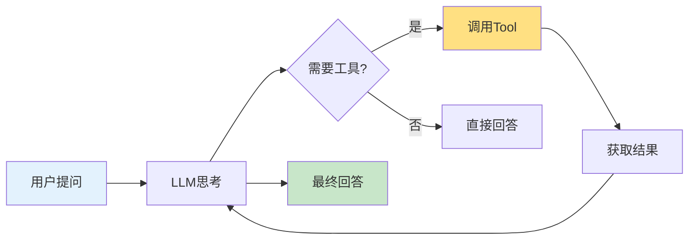

---
title: 第7周 - Tools 工具集成
date: 2025-02-26
permalink: /ai/langchain/week7-tools.html
categories:
  - AI
  - LangChain
---

# 第7周：Tools 工具集成

::: tip 本周学习目标
- 🔧 理解 Tool 的概念和作用
- 🛠️ 掌握内置工具的使用
- 🎯 学会自定义工具开发
- 🔌 集成外部 API 和服务
- 💡 构建工具调用系统
:::

## 一、Tool 基础概念

### 1.1 什么是 Tool？

**Tool（工具）** 是 LangChain 中用于扩展 LLM 能力的组件，让 AI 可以：
- 🔍 搜索互联网
- 🧮 执行计算
- 📊 查询数据库
- 🌐 调用 API
- 💻 执行代码



#### 为什么需要 Tool？

**LLM 的局限性：**
1. ❌ 无法获取实时信息（训练数据截止日期之后的）
2. ❌ 数学计算不准确
3. ❌ 无法访问私有数据
4. ❌ 不能执行操作（发邮件、创建文件等）

**Tool 的作用：**
✅ 弥补 LLM 的局限，赋予 AI "行动能力"

### 1.2 Tool 的结构

LangChain 的 Tool 包含三个核心要素：

```python
"""
Tool 的基本结构
"""
from langchain.tools import Tool

def search_function(query: str) -> str:
    """搜索函数的实现"""
    return f"搜索结果：{query}"

# 创建 Tool
search_tool = Tool(
    name="Search",                          # 1. 名称（唯一标识）
    func=search_function,                   # 2. 函数（实际执行的操作）
    description="在互联网上搜索信息"        # 3. 描述（告诉 LLM 何时使用）
)

# 使用 Tool
result = search_tool.run("LangChain 是什么")
print(result)
```

**三要素详解：**

| 要素 | 作用 | 示例 |
|------|------|------|
| **name** | 工具的唯一标识，LLM 通过名称选择工具 | `Search`, `Calculator`, `Weather` |
| **func** | 实际执行的 Python 函数 | `search_function`, `calculate`, `get_weather` |
| **description** | 告诉 LLM 这个工具的功能和使用场景 | "当需要搜索最新信息时使用此工具" |

::: warning description 的重要性
**description 是 LLM 选择工具的唯一依据！**

❌ 不好的描述：
```python
description="搜索工具"  # 太简短，LLM 不知道何时使用
```

✅ 好的描述：
```python
description="""当用户询问最新信息、实时数据或你不知道的内容时使用此工具。
输入：搜索关键词
输出：搜索结果摘要"""
```
:::

---

## 二、内置工具

### 2.1 DuckDuckGo 搜索

```python
"""
DuckDuckGo 搜索工具
功能：在互联网上搜索信息
"""
# 安装：pip install duckduckgo-search
from langchain.tools import DuckDuckGoSearchRun

# 创建搜索工具
search = DuckDuckGoSearchRun()

# 使用搜索
query = "LangChain 最新版本"
result = search.run(query)

print(f"搜索：{query}")
print(f"结果：\n{result}")
```

#### 自定义搜索参数

```python
"""
自定义 DuckDuckGo 搜索参数
"""
from langchain.tools import DuckDuckGoSearchResults
from langchain.utilities import DuckDuckGoSearchAPIWrapper

# 创建搜索包装器
wrapper = DuckDuckGoSearchAPIWrapper(
    max_results=5,          # 最多返回5个结果
    region="cn-zh",         # 中国地区
    time="d"                # 最近一天的结果 (d/w/m/y)
)

# 创建搜索工具
search_tool = DuckDuckGoSearchResults(api_wrapper=wrapper)

# 使用
results = search_tool.run("人工智能 最新新闻")
print(results)
```

### 2.2 Wikipedia 工具

```python
"""
Wikipedia 工具
功能：从维基百科获取信息
"""
# 安装：pip install wikipedia
from langchain.tools import WikipediaQueryRun
from langchain.utilities import WikipediaAPIWrapper

# 创建 Wikipedia 工具
wikipedia = WikipediaQueryRun(
    api_wrapper=WikipediaAPIWrapper(
        top_k_results=2,    # 返回前2个结果
        doc_content_chars_max=1000  # 每个结果最多1000字符
    )
)

# 使用
result = wikipedia.run("Python programming language")
print(result)
```

### 2.3 Python REPL 工具

```python
"""
Python REPL 工具
功能：执行 Python 代码
"""
from langchain.tools import PythonREPLTool

python_repl = PythonREPLTool()

# 执行代码
code = """
import math
result = math.sqrt(16) + math.pi
print(f"结果：{result}")
"""

output = python_repl.run(code)
print(f"执行结果：\n{output}")
```

::: danger 安全警告
**PythonREPLTool 存在安全风险！**

- ❌ 可以执行任意 Python 代码
- ❌ 可能删除文件、访问敏感数据
- ❌ 不适合生产环境

**安全措施：**
1. 仅在可控环境中使用
2. 限制代码执行权限
3. 使用沙箱环境
4. 审核所有执行的代码
:::

### 2.4 计算器工具

```python
"""
计算器工具
功能：执行数学计算
"""
from langchain.tools import Tool
from langchain_community.utilities import SerpAPIWrapper

def calculator(expression: str) -> str:
    """
    安全的计算器
    只允许基本数学运算
    """
    try:
        # 只允许数字和基本运算符
        allowed_chars = "0123456789+-*/().  "
        if not all(c in allowed_chars for c in expression):
            return "错误：包含不允许的字符"

        # 使用 eval（在限制条件下相对安全）
        result = eval(expression, {"__builtins__": {}}, {})
        return str(result)
    except Exception as e:
        return f"计算错误：{str(e)}"

calculator_tool = Tool(
    name="Calculator",
    func=calculator,
    description="""用于数学计算的工具。
输入：数学表达式（如 "2+2", "10*5", "sqrt(16)"）
输出：计算结果"""
)

# 测试
print(calculator_tool.run("(100 + 50) * 2"))  # 300
print(calculator_tool.run("12345 + 67890"))   # 80235
```

### 2.5 Shell 工具

```python
"""
Shell 工具
功能：执行 shell 命令
"""
from langchain.tools import ShellTool

shell_tool = ShellTool()

# 执行命令（谨慎使用！）
output = shell_tool.run("ls -la")
print(output)
```

::: danger 安全警告
**Shell 工具极其危险！**

- ❌ 可以执行任意系统命令
- ❌ 可能导致数据丢失
- ❌ 绝不要在生产环境使用

**如果必须使用：**
1. 严格限制可执行的命令白名单
2. 在 Docker 容器中运行
3. 详细记录所有执行的命令
:::

---

## 三、自定义工具

### 3.1 使用 @tool 装饰器

最简单的自定义工具方式：

```python
"""
使用 @tool 装饰器创建工具
"""
from langchain.tools import tool

@tool
def get_word_length(word: str) -> int:
    """
    计算单词的长度。

    参数:
        word: 要计算长度的单词

    返回:
        单词的字符数
    """
    return len(word)

# 工具会自动生成 name 和 description
print(f"工具名称：{get_word_length.name}")
print(f"工具描述：{get_word_length.description}")

# 使用工具
result = get_word_length.run("hello")
print(f"结果：{result}")
```

#### 复杂示例：天气查询工具

```python
"""
天气查询工具示例
"""
from langchain.tools import tool
from typing import Optional
import random  # 模拟 API 调用

@tool
def get_weather(
    city: str,
    units: Optional[str] = "celsius"
) -> str:
    """
    获取指定城市的当前天气信息。

    参数:
        city: 城市名称（如：北京、上海）
        units: 温度单位，可选 "celsius"（摄氏度）或 "fahrenheit"（华氏度）

    返回:
        包含温度、天气状况的字符串

    示例:
        get_weather("北京") -> "北京：晴天，温度25°C"
        get_weather("上海", "fahrenheit") -> "上海：多云，温度77°F"
    """
    # 模拟 API 调用（实际应该调用天气 API）
    temperature = random.randint(15, 35)
    if units == "fahrenheit":
        temperature = temperature * 9/5 + 32

    conditions = random.choice(["晴天", "多云", "阴天", "小雨"])

    unit_symbol = "°C" if units == "celsius" else "°F"

    return f"{city}：{conditions}，温度{temperature}{unit_symbol}"

# 使用
print(get_weather.run("北京"))
print(get_weather.run("上海, units=fahrenheit"))
```

### 3.2 使用 StructuredTool

当需要多个参数或复杂参数时，使用 `StructuredTool`：

```python
"""
StructuredTool 示例：数据库查询工具
"""
from langchain.tools import StructuredTool
from pydantic import BaseModel, Field
from typing import Optional

# 定义输入模式
class DatabaseQueryInput(BaseModel):
    """数据库查询输入模式"""
    table: str = Field(description="表名")
    condition: Optional[str] = Field(None, description="查询条件（WHERE 子句）")
    limit: Optional[int] = Field(10, description="返回结果数量限制")

def query_database(
    table: str,
    condition: Optional[str] = None,
    limit: int = 10
) -> str:
    """
    查询数据库

    这是模拟实现，实际应连接真实数据库
    """
    query = f"SELECT * FROM {table}"

    if condition:
        query += f" WHERE {condition}"

    query += f" LIMIT {limit}"

    # 模拟查询结果
    return f"执行查询：{query}\n结果：[模拟数据行1, 模拟数据行2, ...]"

# 创建结构化工具
db_query_tool = StructuredTool.from_function(
    func=query_database,
    name="DatabaseQuery",
    description="查询数据库表。支持条件过滤和结果数量限制。",
    args_schema=DatabaseQueryInput
)

# 使用
result = db_query_tool.run({
    "table": "users",
    "condition": "age > 18",
    "limit": 5
})
print(result)
```

### 3.3 继承 BaseTool 类

最灵活的方式，适合复杂工具：

```python
"""
继承 BaseTool 创建自定义工具
示例：文件操作工具
"""
from langchain.tools import BaseTool
from typing import Optional, Type
from pydantic import BaseModel, Field
import os

class FileOperationInput(BaseModel):
    """文件操作输入"""
    operation: str = Field(description="操作类型：read, write, list")
    file_path: str = Field(description="文件路径")
    content: Optional[str] = Field(None, description="写入内容（仅 write 操作）")

class FileOperationTool(BaseTool):
    """文件操作工具"""

    name = "FileOperations"
    description = """执行文件操作（读取、写入、列出文件）。

操作类型：
- read: 读取文件内容
- write: 写入内容到文件
- list: 列出目录下的文件

注意：仅允许操作指定目录下的文件。"""

    args_schema: Type[BaseModel] = FileOperationInput

    # 配置：允许操作的目录
    allowed_directory: str = "./safe_dir/"

    def _run(
        self,
        operation: str,
        file_path: str,
        content: Optional[str] = None
    ) -> str:
        """
        同步执行工具

        参数:
            operation: 操作类型
            file_path: 文件路径
            content: 内容（可选）

        返回:
            操作结果
        """
        # 安全检查：确保文件在允许的目录内
        safe_path = os.path.join(self.allowed_directory, file_path)
        safe_path = os.path.normpath(safe_path)

        if not safe_path.startswith(os.path.abspath(self.allowed_directory)):
            return "错误：不允许访问该路径"

        try:
            if operation == "read":
                if not os.path.exists(safe_path):
                    return f"错误：文件不存在 {file_path}"

                with open(safe_path, 'r', encoding='utf-8') as f:
                    return f.read()

            elif operation == "write":
                if content is None:
                    return "错误：写入操作需要提供 content 参数"

                os.makedirs(os.path.dirname(safe_path), exist_ok=True)

                with open(safe_path, 'w', encoding='utf-8') as f:
                    f.write(content)

                return f"成功写入 {len(content)} 个字符到 {file_path}"

            elif operation == "list":
                if not os.path.exists(safe_path):
                    return f"错误：目录不存在 {file_path}"

                files = os.listdir(safe_path)
                return "\n".join(files) if files else "目录为空"

            else:
                return f"错误：不支持的操作类型 {operation}"

        except Exception as e:
            return f"错误：{str(e)}"

    async def _arun(
        self,
        operation: str,
        file_path: str,
        content: Optional[str] = None
    ) -> str:
        """异步执行（可选实现）"""
        # 简单起见，调用同步版本
        return self._run(operation, file_path, content)

# 使用示例
if __name__ == "__main__":
    # 创建安全目录
    os.makedirs("./safe_dir", exist_ok=True)

    # 创建工具
    file_tool = FileOperationTool()

    # 测试：写入文件
    result = file_tool.run({
        "operation": "write",
        "file_path": "test.txt",
        "content": "Hello, LangChain!"
    })
    print(result)

    # 测试：读取文件
    result = file_tool.run({
        "operation": "read",
        "file_path": "test.txt"
    })
    print(f"文件内容：{result}")

    # 测试：列出文件
    result = file_tool.run({
        "operation": "list",
        "file_path": "."
    })
    print(f"文件列表：\n{result}")
```

---

## 四、工具集成实战

### 4.1 集成外部 API

#### 示例：GitHub API 集成

```python
"""
GitHub API 工具
功能：查询 GitHub 仓库信息
"""
from langchain.tools import tool
import requests
from typing import Optional

@tool
def get_github_repo_info(repo: str) -> str:
    """
    获取 GitHub 仓库信息。

    参数:
        repo: 仓库名称，格式：owner/repo（如：langchain-ai/langchain）

    返回:
        仓库的基本信息（星标数、Fork 数、描述等）

    示例:
        get_github_repo_info("langchain-ai/langchain")
    """
    try:
        # 调用 GitHub API
        url = f"https://api.github.com/repos/{repo}"
        response = requests.get(url, timeout=10)

        if response.status_code == 404:
            return f"错误：仓库 {repo} 不存在"

        response.raise_for_status()
        data = response.json()

        # 提取关键信息
        info = f"""仓库：{data['full_name']}
描述：{data['description'] or '无描述'}
星标数：{data['stargazers_count']}
Fork 数：{data['forks_count']}
主要语言：{data['language'] or '未指定'}
创建时间：{data['created_at'][:10]}
最后更新：{data['updated_at'][:10]}
开源协议：{data['license']['name'] if data.get('license') else '未指定'}
"""
        return info

    except requests.RequestException as e:
        return f"错误：API 请求失败 - {str(e)}"

# 测试
result = get_github_repo_info.run("langchain-ai/langchain")
print(result)
```

#### 天气 API 集成（真实版）

```python
"""
真实天气 API 集成
使用 OpenWeatherMap API
"""
import requests
from langchain.tools import tool
from typing import Optional

# 需要在 https://openweathermap.org/api 注册获取 API Key
OPENWEATHER_API_KEY = "your-api-key-here"

@tool
def get_current_weather(city: str, units: str = "metric") -> str:
    """
    获取指定城市的实时天气信息。

    参数:
        city: 城市名称（英文或拼音，如：Beijing, Shanghai）
        units: 单位系统
            - metric: 摄氏度（默认）
            - imperial: 华氏度

    返回:
        天气信息字符串

    示例:
        get_current_weather("Beijing") -> "北京：晴天，温度25°C，湿度60%"
    """
    if not OPENWEATHER_API_KEY or OPENWEATHER_API_KEY == "your-api-key-here":
        return "错误：未配置 OpenWeatherMap API Key"

    try:
        url = "http://api.openweathermap.org/data/2.5/weather"
        params = {
            "q": city,
            "appid": OPENWEATHER_API_KEY,
            "units": units,
            "lang": "zh_cn"
        }

        response = requests.get(url, params=params, timeout=10)
        response.raise_for_status()
        data = response.json()

        # 解析数据
        city_name = data['name']
        temp = data['main']['temp']
        feels_like = data['main']['feels_like']
        humidity = data['main']['humidity']
        description = data['weather'][0]['description']

        unit_symbol = "°C" if units == "metric" else "°F"

        result = f"""{city_name}
天气：{description}
温度：{temp}{unit_symbol}（体感 {feels_like}{unit_symbol}）
湿度：{humidity}%"""

        return result

    except requests.RequestException as e:
        return f"错误：无法获取天气信息 - {str(e)}"

# 测试（需要有效的 API Key）
# result = get_current_weather.run("Beijing")
# print(result)
```

### 4.2 数据库工具

```python
"""
数据库查询工具
使用 SQLite 示例
"""
import sqlite3
from langchain.tools import tool
from typing import Optional

# 创建示例数据库
def setup_demo_database():
    """设置演示数据库"""
    conn = sqlite3.connect("demo.db")
    cursor = conn.cursor()

    # 创建表
    cursor.execute("""
        CREATE TABLE IF NOT EXISTS products (
            id INTEGER PRIMARY KEY,
            name TEXT NOT NULL,
            price REAL NOT NULL,
            category TEXT
        )
    """)

    # 插入示例数据
    products = [
        ("笔记本电脑", 5999.00, "电子产品"),
        ("鼠标", 99.00, "电子产品"),
        ("键盘", 299.00, "电子产品"),
        ("显示器", 1999.00, "电子产品"),
        ("台灯", 199.00, "家居用品"),
    ]

    cursor.executemany(
        "INSERT OR IGNORE INTO products (name, price, category) VALUES (?, ?, ?)",
        products
    )

    conn.commit()
    conn.close()

setup_demo_database()

@tool
def query_products(
    category: Optional[str] = None,
    max_price: Optional[float] = None
) -> str:
    """
    查询产品数据库。

    参数:
        category: 产品类别（可选）
        max_price: 最高价格（可选）

    返回:
        符合条件的产品列表

    示例:
        query_products(category="电子产品", max_price=1000)
        -> 返回价格不超过1000元的电子产品
    """
    try:
        conn = sqlite3.connect("demo.db")
        cursor = conn.cursor()

        # 构建查询
        query = "SELECT name, price, category FROM products WHERE 1=1"
        params = []

        if category:
            query += " AND category = ?"
            params.append(category)

        if max_price:
            query += " AND price <= ?"
            params.append(max_price)

        # 执行查询
        cursor.execute(query, params)
        results = cursor.fetchall()

        conn.close()

        # 格式化结果
        if not results:
            return "未找到符合条件的产品"

        output = "查询结果：\n"
        for name, price, cat in results:
            output += f"- {name}：¥{price:.2f}（{cat}）\n"

        return output.strip()

    except Exception as e:
        return f"错误：{str(e)}"

# 测试
print(query_products.run(""))
print("\n" + query_products.run("category=电子产品, max_price=1000"))
```

### 4.3 邮件发送工具

```python
"""
邮件发送工具
使用 SMTP
"""
import smtplib
from email.mime.text import MIMEText
from email.mime.multipart import MIMEMultipart
from langchain.tools import tool
from typing import Optional

# 邮件配置（示例）
EMAIL_CONFIG = {
    "smtp_server": "smtp.gmail.com",
    "smtp_port": 587,
    "sender_email": "your-email@gmail.com",
    "sender_password": "your-app-password"
}

@tool
def send_email(
    recipient: str,
    subject: str,
    body: str,
    is_html: bool = False
) -> str:
    """
    发送电子邮件。

    参数:
        recipient: 收件人邮箱地址
        subject: 邮件主题
        body: 邮件正文
        is_html: 是否为 HTML 格式（默认 False）

    返回:
        发送状态信息

    示例:
        send_email(
            recipient="friend@example.com",
            subject="问候",
            body="你好，朋友！"
        )

    注意：需要配置 SMTP 服务器信息
    """
    # 检查配置
    if EMAIL_CONFIG["sender_email"] == "your-email@gmail.com":
        return "错误：未配置邮件发送账户"

    try:
        # 创建邮件
        message = MIMEMultipart("alternative")
        message["From"] = EMAIL_CONFIG["sender_email"]
        message["To"] = recipient
        message["Subject"] = subject

        # 添加正文
        mime_type = "html" if is_html else "plain"
        message.attach(MIMEText(body, mime_type))

        # 发送
        with smtplib.SMTP(EMAIL_CONFIG["smtp_server"], EMAIL_CONFIG["smtp_port"]) as server:
            server.starttls()
            server.login(EMAIL_CONFIG["sender_email"], EMAIL_CONFIG["sender_password"])
            server.send_message(message)

        return f"✅ 邮件已成功发送到 {recipient}"

    except Exception as e:
        return f"❌ 发送失败：{str(e)}"

# 测试（需要有效配置）
# result = send_email.run({
#     "recipient": "test@example.com",
#     "subject": "测试邮件",
#     "body": "这是一封测试邮件"
# })
# print(result)
```

---

## 五、工具组合与实战

### 5.1 多工具系统

```python
"""
多工具协作示例
场景：智能研究助手
工具：搜索 + Wikipedia + 计算器
"""
from langchain.tools import DuckDuckGoSearchRun, WikipediaQueryRun, tool
from langchain.utilities import WikipediaAPIWrapper
from typing import List

# 创建工具集合
@tool
def calculator(expression: str) -> str:
    """
    执行数学计算。

    参数:
        expression: 数学表达式

    返回:
        计算结果
    """
    try:
        result = eval(expression, {"__builtins__": {}}, {})
        return str(result)
    except Exception as e:
        return f"计算错误：{str(e)}"

# 组合工具
tools = [
    DuckDuckGoSearchRun(name="Search", description="搜索最新信息"),
    WikipediaQueryRun(
        name="Wikipedia",
        description="从维基百科获取详细背景知识",
        api_wrapper=WikipediaAPIWrapper(top_k_results=1, doc_content_chars_max=500)
    ),
    calculator
]

# 展示工具信息
print("可用工具：")
for tool in tools:
    print(f"\n名称：{tool.name}")
    print(f"描述：{tool.description}")
```

### 5.2 实战项目：智能助手

```python
"""
实战项目：多功能智能助手
功能：
1. 搜索信息
2. 查询天气
3. 进行计算
4. 查询数据库
"""
from langchain_openai import ChatOpenAI
from langchain.agents import initialize_agent, AgentType
from langchain.tools import tool
import random

# 定义工具集
@tool
def search_web(query: str) -> str:
    """
    在互联网上搜索信息。用于查找最新资讯、实时数据。

    参数:
        query: 搜索关键词

    返回:
        搜索结果摘要
    """
    # 这里应该调用真实搜索 API
    return f"关于'{query}'的搜索结果：[模拟搜索内容]"

@tool
def get_weather(city: str) -> str:
    """
    获取指定城市的天气信息。

    参数:
        city: 城市名称

    返回:
        天气信息
    """
    temp = random.randint(15, 30)
    weather = random.choice(["晴天", "多云", "小雨"])
    return f"{city}：{weather}，温度{temp}°C"

@tool
def calculate(expression: str) -> str:
    """
    进行数学计算。支持基本运算（+、-、*、/）。

    参数:
        expression: 数学表达式（如："10 + 20"）

    返回:
        计算结果
    """
    try:
        result = eval(expression, {"__builtins__": {}}, {})
        return f"{expression} = {result}"
    except Exception as e:
        return f"计算错误：{str(e)}"

@tool
def query_database(table: str) -> str:
    """
    查询内部数据库。

    参数:
        table: 表名（支持：users, products, orders）

    返回:
        查询结果
    """
    # 模拟数据库查询
    data = {
        "users": "用户总数：1250",
        "products": "产品总数：580",
        "orders": "订单总数：3240"
    }
    return data.get(table, f"错误：表 {table} 不存在")

# 创建工具列表
tools = [search_web, get_weather, calculate, query_database]

# 创建 Agent（后续章节详细介绍）
llm = ChatOpenAI(model="gpt-3.5-turbo", temperature=0)

agent = initialize_agent(
    tools=tools,
    llm=llm,
    agent=AgentType.ZERO_SHOT_REACT_DESCRIPTION,
    verbose=True,
    handle_parsing_errors=True
)

# 测试不同场景
test_queries = [
    "北京今天天气怎么样？",
    "计算 (100 + 50) * 2",
    "查询 users 表",
    "搜索 LangChain 最新消息"
]

print("=" * 60)
print("智能助手测试")
print("=" * 60)

for query in test_queries:
    print(f"\n用户：{query}")
    try:
        response = agent.run(query)
        print(f"助手：{response}")
    except Exception as e:
        print(f"错误：{str(e)}")
    print("-" * 60)
```

---

## 六、工具安全与最佳实践

### 6.1 安全检查清单

```python
"""
工具安全检查器
"""
from typing import List, Dict
import re

class ToolSecurityChecker:
    """工具安全检查器"""

    # 危险操作关键词
    DANGEROUS_KEYWORDS = [
        "delete", "drop", "truncate", "rm", "remove",
        "__import__", "eval", "exec", "compile",
        "os.system", "subprocess"
    ]

    @staticmethod
    def check_sql_injection(query: str) -> Dict[str, any]:
        """检查 SQL 注入风险"""
        dangerous_patterns = [
            r";\s*drop",
            r";\s*delete",
            r"union\s+select",
            r"--",
            r"/\*",
        ]

        risks = []
        for pattern in dangerous_patterns:
            if re.search(pattern, query, re.IGNORECASE):
                risks.append(f"发现危险模式：{pattern}")

        return {
            "safe": len(risks) == 0,
            "risks": risks
        }

    @staticmethod
    def check_command_injection(command: str) -> Dict[str, any]:
        """检查命令注入风险"""
        dangerous_chars = [";", "|", "&", "$", "`", ">", "<"]

        risks = []
        for char in dangerous_chars:
            if char in command:
                risks.append(f"发现危险字符：{char}")

        return {
            "safe": len(risks) == 0,
            "risks": risks
        }

    @staticmethod
    def check_path_traversal(path: str) -> Dict[str, any]:
        """检查路径遍历攻击"""
        dangerous_patterns = ["..", "~", "/etc", "/root"]

        risks = []
        for pattern in dangerous_patterns:
            if pattern in path:
                risks.append(f"发现危险路径：{pattern}")

        return {
            "safe": len(risks) == 0,
            "risks": risks
        }

# 示例：安全的数据库工具
from langchain.tools import tool

@tool
def safe_database_query(query: str) -> str:
    """
    安全的数据库查询工具

    参数:
        query: SQL 查询语句

    返回:
        查询结果或错误信息
    """
    checker = ToolSecurityChecker()

    # 安全检查
    check_result = checker.check_sql_injection(query)

    if not check_result["safe"]:
        return f"❌ 安全检查失败：\n" + "\n".join(check_result["risks"])

    # 只允许 SELECT 查询
    if not query.strip().upper().startswith("SELECT"):
        return "❌ 仅允许 SELECT 查询"

    # 执行查询（这里省略实际数据库操作）
    return f"✅ 查询通过安全检查，结果：[模拟数据]"

# 测试
print(safe_database_query.run("SELECT * FROM users"))
print(safe_database_query.run("SELECT * FROM users; DROP TABLE users--"))
```

### 6.2 最佳实践

#### 1. 工具描述编写规范

```python
"""
好的工具描述示例
"""
from langchain.tools import tool

@tool
def good_tool_example(input_data: str) -> str:
    """
    【工具名称】数据处理工具

    【功能描述】
    处理用户输入的数据，执行清洗、转换和验证操作。

    【使用场景】
    - 当用户提供原始数据需要处理时使用
    - 适用于 JSON、CSV 等格式的数据
    - 不适用于图片、视频等二进制数据

    【参数说明】
    input_data: 待处理的数据字符串

    【返回值】
    处理后的数据或错误信息

    【使用示例】
    输入：'{"name": "张三", "age": "25"}'
    输出：'{"name": "张三", "age": 25}'（类型转换）

    【注意事项】
    - 输入数据大小不超过 10MB
    - 处理时间可能需要 1-5 秒
    """
    # 实现...
    pass
```

#### 2. 错误处理

```python
"""
完善的错误处理
"""
from langchain.tools import tool
from typing import Union

@tool
def robust_tool(input: str) -> str:
    """
    健壮的工具示例

    参数:
        input: 输入字符串

    返回:
        处理结果
    """
    try:
        # 1. 输入验证
        if not input or not isinstance(input, str):
            return "错误：输入必须是非空字符串"

        if len(input) > 10000:
            return "错误：输入过长（最大 10000 字符）"

        # 2. 核心处理
        result = input.upper()  # 示例操作

        # 3. 输出验证
        if not result:
            return "错误：处理结果为空"

        return f"✅ 处理成功：{result}"

    except ValueError as e:
        return f"❌ 值错误：{str(e)}"

    except TypeError as e:
        return f"❌ 类型错误：{str(e)}"

    except Exception as e:
        return f"❌ 未知错误：{str(e)}"
```

#### 3. 日志记录

```python
"""
工具调用日志
"""
import logging
from functools import wraps
from datetime import datetime

# 配置日志
logging.basicConfig(
    level=logging.INFO,
    format='%(asctime)s - %(name)s - %(levelname)s - %(message)s',
    filename='tool_usage.log'
)

logger = logging.getLogger(__name__)

def log_tool_usage(func):
    """工具使用日志装饰器"""
    @wraps(func)
    def wrapper(*args, **kwargs):
        start_time = datetime.now()

        # 记录调用
        logger.info(f"工具调用开始：{func.__name__}")
        logger.info(f"参数：args={args}, kwargs={kwargs}")

        try:
            # 执行工具
            result = func(*args, **kwargs)

            # 记录成功
            duration = (datetime.now() - start_time).total_seconds()
            logger.info(f"工具调用成功：{func.__name__}，耗时{duration:.2f}秒")

            return result

        except Exception as e:
            # 记录失败
            logger.error(f"工具调用失败：{func.__name__}，错误：{str(e)}")
            raise

    return wrapper

@log_tool_usage
@tool
def logged_tool(input: str) -> str:
    """带日志的工具"""
    return f"处理结果：{input}"

# 测试
logged_tool.run("测试输入")
```

---

## 七、本周练习题

### 练习1：自定义工具（难度：⭐⭐）

**任务**：创建一个"文本分析工具"。

**要求**：
1. 统计字符数、单词数
2. 提取关键词
3. 判断情感倾向

<details>
<summary>查看提示</summary>

使用 `@tool` 装饰器，集成 jieba 分词库。
</details>

### 练习2：API 集成（难度：⭐⭐）

**任务**：集成一个真实的 API（如新闻 API、翻译 API）。

**要求**：
1. 完整的错误处理
2. 速率限制处理
3. 缓存机制

<details>
<summary>查看提示</summary>

可以使用免费 API：
- NewsAPI: https://newsapi.org/
- 翻译API: https://fanyi-api.baidu.com/
</details>

### 练习3：工具安全（难度：⭐⭐⭐）

**任务**：为 SQL 查询工具添加完善的安全机制。

**要求**：
1. SQL 注入检测
2. 查询白名单
3. 结果大小限制
4. 查询时间限制

---

## 八、本周总结

### 8.1 知识点清单

- [x] Tool 的概念和结构
- [x] 内置工具使用（搜索、Wikipedia、计算器）
- [x] @tool 装饰器创建工具
- [x] StructuredTool 处理复杂参数
- [x] 继承 BaseTool 创建灵活工具
- [x] API 集成（GitHub、天气、数据库）
- [x] 工具安全与最佳实践

### 8.2 工具选择指南

| 场景 | 推荐方式 | 复杂度 |
|------|---------|--------|
| 简单函数 | @tool 装饰器 | ⭐ |
| 多参数函数 | StructuredTool | ⭐⭐ |
| 复杂逻辑 | 继承 BaseTool | ⭐⭐⭐ |
| API 集成 | @tool + requests | ⭐⭐ |

### 8.3 安全清单

- [ ] 输入验证
- [ ] SQL 注入检测
- [ ] 命令注入检测
- [ ] 路径遍历检测
- [ ] 错误处理
- [ ] 日志记录
- [ ] 速率限制
- [ ] 权限控制

### 8.4 下周预习

**第8周主题：Agents 智能体**

预习内容：
1. 什么是 Agent？
2. Agent 如何决策？
3. ReAct 模式

**思考问题**：
- Agent 如何选择合适的工具？
- 如何处理多步骤任务？

---

::: tip 学习建议
1. **安全第一**：生产环境中必须重视工具安全
2. **完善文档**：工具描述直接影响 LLM 的选择
3. **充分测试**：用边界情况测试工具
4. **监控使用**：记录工具调用情况
5. **渐进集成**：先从简单工具开始
:::

**本周完成！下周学习 Agents！🚀**
