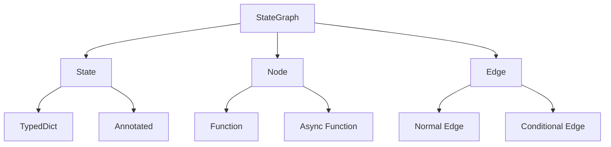
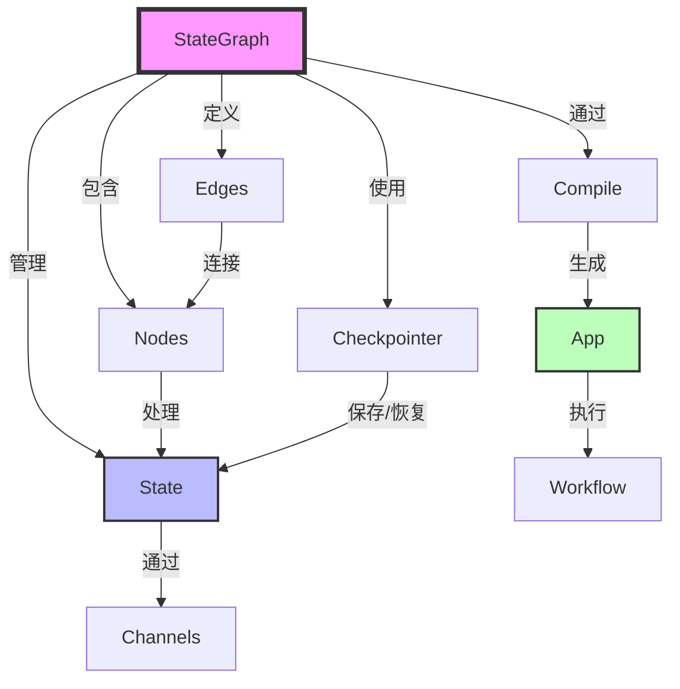

---
title: LangGraph 核心概念解析
date: 2025-01-30
permalink: /ai/langgraph/core-concepts.html
categories:
  - AI
  - LangGraph
---

# LangGraph 核心概念解析

## 一、概述

LangGraph 的核心概念构成了整个框架的基础。理解这些概念是掌握 LangGraph 的关键。



## 二、StateGraph - 状态图

### 2.1 概念定义

StateGraph 是 LangGraph 的核心类，代表整个工作流的结构和逻辑。

```python
from langgraph.graph import StateGraph

# StateGraph 是一个泛型类，接受状态类型作为参数
graph = StateGraph(StateType)
```

### 2.2 主要职责

- **管理节点**：注册和组织所有处理节点
- **定义流程**：确定节点间的执行顺序
- **维护状态**：在节点间传递和更新状态
- **编译执行**：将图结构编译为可执行应用

### 2.3 生命周期

```python
# 1. 创建图
graph = StateGraph(MyState)

# 2. 配置图（添加节点、边）
graph.add_node("process", process_function)
graph.add_edge("process", "next")

# 3. 编译图
app = graph.compile()

# 4. 执行图
result = app.invoke(initial_state)
```

## 三、State - 状态

### 3.1 状态的本质

状态是在整个工作流中传递的数据容器，每个节点都会接收状态、处理状态、返回更新后的状态。

### 3.2 状态定义方式

#### TypedDict 方式（推荐）
```python
from typing import TypedDict, List

class WorkflowState(TypedDict):
    messages: List[str]
    current_step: int
    result: str
    metadata: dict
```

#### Pydantic 方式
```python
from pydantic import BaseModel

class WorkflowState(BaseModel):
    messages: List[str] = []
    current_step: int = 0
    result: str = ""
    metadata: dict = {}
```

### 3.3 状态更新机制

```python
# 节点返回部分更新
def node_function(state: WorkflowState) -> dict:
    # 只更新需要改变的字段
    return {
        "current_step": state["current_step"] + 1,
        "result": "processed"
    }
```

### 3.4 Reducer 机制

Reducer 定义了如何合并状态更新：

```python
from typing import Annotated
import operator

class AdvancedState(TypedDict):
    # 列表追加
    messages: Annotated[List[str], operator.add]

    # 数值累加
    count: Annotated[int, operator.add]

    # 自定义 reducer
    latest_value: Annotated[str, lambda old, new: new]

    # 合并字典
    metadata: Annotated[dict, lambda old, new: {**old, **new}]
```

## 四、Node - 节点

### 4.1 节点的定义

节点是执行具体业务逻辑的单元，本质上是一个函数。

```python
def my_node(state: StateType) -> StateType:
    """
    节点函数的标准签名
    输入：当前状态
    输出：更新后的状态（或部分更新）
    """
    # 业务逻辑
    return updated_state
```

### 4.2 节点类型

#### 同步节点
```python
def sync_node(state: State) -> State:
    # 同步处理
    result = process_data(state["data"])
    return {"result": result}
```

#### 异步节点
```python
async def async_node(state: State) -> State:
    # 异步处理
    result = await fetch_data(state["url"])
    return {"data": result}
```

#### 工具节点
```python
from langgraph.prebuilt import ToolNode

tools = [search_tool, calculator_tool]
tool_node = ToolNode(tools)
```

### 4.3 节点注册

```python
# 添加普通节点
graph.add_node("process", process_function)

# 添加带元数据的节点
graph.add_node(
    "critical",
    critical_function,
    metadata={"priority": "high", "timeout": 30}
)

# 添加带重试策略的节点
graph.add_node(
    "unstable",
    unstable_function,
    retry_policy=RetryPolicy(max_attempts=3)
)
```

## 五、Edge - 边

### 5.1 边的作用

边定义了节点间的连接关系，决定执行流程。

### 5.2 边的类型

#### 普通边
```python
# 无条件连接两个节点
graph.add_edge("start", "process")
graph.add_edge("process", "end")
```

#### 条件边
```python
def router(state):
    if state["score"] > 0.8:
        return "success"
    elif state["score"] > 0.5:
        return "review"
    else:
        return "failure"

graph.add_conditional_edges(
    "evaluate",
    router,
    {
        "success": "approve",
        "review": "human_review",
        "failure": "reject"
    }
)
```

#### 入口边
```python
# 设置图的起始节点
graph.set_entry_point("initialization")
```

### 5.3 特殊边 - END

```python
from langgraph.graph import END

# END 是一个特殊常量，表示工作流结束
graph.add_edge("final_step", END)

# 条件结束
graph.add_conditional_edges(
    "check",
    lambda s: "continue" if s["retry"] else END
)
```

## 六、Checkpointer - 检查点

### 6.1 概念说明

Checkpointer 负责保存和恢复工作流的执行状态，支持中断恢复和历史回溯。

### 6.2 内存检查点

```python
from langgraph.checkpoint.memory import MemorySaver

memory = MemorySaver()
app = graph.compile(checkpointer=memory)

# 使用线程ID保存状态
config = {"configurable": {"thread_id": "session-123"}}
result = app.invoke(input_data, config=config)
```

### 6.3 持久化检查点

```python
from langgraph.checkpoint.sqlite import SqliteSaver

# SQLite 检查点
checkpointer = SqliteSaver.from_conn_string("checkpoint.db")

# PostgreSQL 检查点
from langgraph.checkpoint.postgres import PostgresSaver
import psycopg2

conn = psycopg2.connect("postgresql://...")
checkpointer = PostgresSaver(conn)

app = graph.compile(checkpointer=checkpointer)
```

## 七、Channel - 通道

### 7.1 通道的作用

通道是状态字段的底层实现，管理值的存储和更新。

### 7.2 通道类型

```python
from langgraph.channels import LastValue, Topic, BinaryOperatorAggregate

# LastValue - 保留最新值
last_channel = LastValue(int)

# Topic - 发布订阅模式
topic_channel = Topic(str)

# BinaryOperatorAggregate - 聚合操作
sum_channel = BinaryOperatorAggregate(int, operator.add)
```

## 八、实例：完整概念展示

```python
from langgraph.graph import StateGraph, END
from langgraph.checkpoint.memory import MemorySaver
from typing import TypedDict, Annotated, List
import operator

# 1. 定义状态（State）
class ProcessState(TypedDict):
    input_data: str
    steps_completed: Annotated[List[str], operator.add]
    score: float
    final_result: str
    error: str

# 2. 定义节点（Nodes）
def validate_input(state: ProcessState) -> ProcessState:
    """验证输入节点"""
    if not state.get("input_data"):
        return {"error": "无输入数据", "steps_completed": ["validation"]}
    return {"steps_completed": ["validation"]}

def process_data(state: ProcessState) -> ProcessState:
    """处理数据节点"""
    # 模拟处理
    processed = state["input_data"].upper()
    score = len(processed) / 10.0
    return {
        "score": score,
        "steps_completed": ["processing"]
    }

def evaluate_result(state: ProcessState) -> ProcessState:
    """评估结果节点"""
    if state["score"] > 0.5:
        result = "优秀"
    else:
        result = "需改进"
    return {
        "final_result": result,
        "steps_completed": ["evaluation"]
    }

# 3. 路由函数（用于条件边）
def route_after_validation(state: ProcessState) -> str:
    if state.get("error"):
        return "error_handler"
    return "process"

def route_after_processing(state: ProcessState) -> str:
    if state["score"] > 0.8:
        return "fast_track"
    return "normal_evaluation"

# 4. 创建图（StateGraph）
graph = StateGraph(ProcessState)

# 5. 添加节点
graph.add_node("validate", validate_input)
graph.add_node("process", process_data)
graph.add_node("evaluate", evaluate_result)
graph.add_node("fast_track", lambda s: {"final_result": "自动通过", "steps_completed": ["fast_track"]})
graph.add_node("error_handler", lambda s: {"final_result": f"错误: {s['error']}", "steps_completed": ["error_handling"]})

# 6. 添加边（Edges）
graph.add_conditional_edges(
    "validate",
    route_after_validation,
    {
        "process": "process",
        "error_handler": "error_handler"
    }
)

graph.add_conditional_edges(
    "process",
    route_after_processing,
    {
        "fast_track": "fast_track",
        "normal_evaluation": "evaluate"
    }
)

graph.add_edge("evaluate", END)
graph.add_edge("fast_track", END)
graph.add_edge("error_handler", END)

# 7. 设置入口点
graph.set_entry_point("validate")

# 8. 编译（使用检查点）
checkpointer = MemorySaver()
app = graph.compile(checkpointer=checkpointer)

# 9. 执行
config = {"configurable": {"thread_id": "example-001"}}
result = app.invoke(
    {"input_data": "Hello LangGraph", "steps_completed": []},
    config=config
)

print(f"最终结果: {result['final_result']}")
print(f"完成步骤: {result['steps_completed']}")
print(f"评分: {result.get('score', 'N/A')}")

# 10. 查看执行历史
for state in app.get_state_history(config):
    print(f"历史状态: {state.values}")
```

## 九、概念关系图



## 十、核心概念对比

| 概念 | 作用 | 类比 | 关键特性 |
|------|------|------|----------|
| **StateGraph** | 工作流容器 | 工厂流水线 | 定义结构、管理执行 |
| **State** | 数据载体 | 传送带上的产品 | 携带信息、全局共享 |
| **Node** | 处理单元 | 工人/机器 | 执行逻辑、转换状态 |
| **Edge** | 流程连接 | 传送带 | 决定流向、条件路由 |
| **Checkpointer** | 状态管理器 | 存档系统 | 保存进度、支持恢复 |
| **Channel** | 值管理器 | 数据管道 | 处理更新、聚合操作 |

## 十一、最佳实践

### 11.1 状态设计原则

1. **最小化状态**：只保存必要的数据
2. **类型明确**：使用 TypedDict 或 Pydantic
3. **合理使用 Reducer**：避免状态冲突
4. **考虑序列化**：确保状态可以被检查点保存

### 11.2 节点设计原则

1. **单一职责**：每个节点只做一件事
2. **幂等性**：相同输入产生相同输出
3. **错误处理**：妥善处理异常情况
4. **性能考虑**：避免节点中的重操作

### 11.3 图设计原则

1. **清晰的流程**：避免过于复杂的分支
2. **合理的粒度**：平衡节点数量和复杂度
3. **可测试性**：便于单元测试和集成测试
4. **可维护性**：良好的命名和文档

## 十二、总结

通过本章学习，你已经掌握了：

- ✅ StateGraph 的作用和生命周期
- ✅ State 的定义和更新机制
- ✅ Node 的类型和实现方式
- ✅ Edge 的种类和路由逻辑
- ✅ Checkpointer 的使用场景
- ✅ Channel 的底层机制
- ✅ 各概念间的关系和协作

这些核心概念是构建复杂 LangGraph 应用的基础，深入理解它们将帮助你更好地设计和实现工作流系统。

---

**下一步：** 通过 [03.基础案例实战](./03.基础案例实战.md) 将这些概念应用到实际项目中！