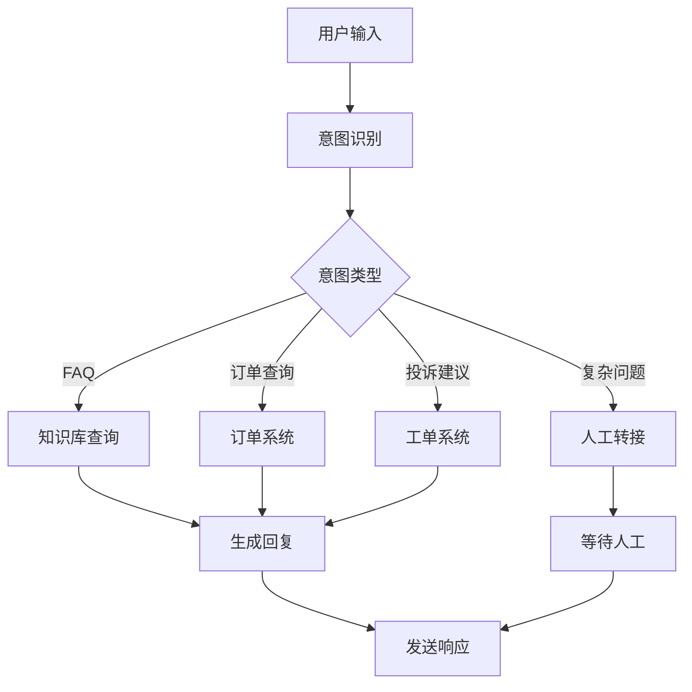

---
title: LangGraph 项目开发实战
date: 2025-01-30
permalink: /ai/langgraph/project-development.html
categories:
  - AI
  - LangGraph
---

# LangGraph 项目开发实战

## 一、项目一：智能客服系统

### 1.1 项目概述

构建一个多功能智能客服系统，支持意图识别、多轮对话、知识库查询和人工转接。

### 1.2 系统架构



### 1.3 完整实现

```python
from langgraph.graph import StateGraph, END
from langgraph.checkpoint.memory import MemorySaver
from typing import TypedDict, List, Dict, Optional, Annotated
import operator
from enum import Enum
from datetime import datetime
import json
import random

# 意图类型定义
class Intent(Enum):
    GREETING = "greeting"
    FAQ = "faq"
    ORDER_QUERY = "order_query"
    COMPLAINT = "complaint"
    HUMAN_TRANSFER = "human_transfer"
    UNKNOWN = "unknown"

# 状态定义
class CustomerServiceState(TypedDict):
    # 对话历史
    messages: Annotated[List[Dict[str, str]], operator.add]
    # 用户信息
    user_id: str
    session_id: str
    # 当前对话
    user_input: str
    bot_response: str
    # 意图识别
    intent: Intent
    intent_confidence: float
    entities: Dict[str, any]
    # 上下文
    context: Dict[str, any]
    conversation_stage: str
    # 控制标志
    needs_human: bool
    conversation_ended: bool
    satisfaction_score: Optional[float]

# 知识库
class KnowledgeBase:
    """模拟知识库"""

    def __init__(self):
        self.faqs = {
            "退货政策": "我们提供30天无理由退货服务...",
            "配送时间": "标准配送需要3-5个工作日...",
            "支付方式": "支持支付宝、微信、信用卡等多种支付方式...",
            "会员权益": "会员可享受积分、优惠券、专属活动等权益...",
        }

    def search(self, query: str, top_k: int = 3) -> List[Dict]:
        """搜索相关问答"""
        results = []
        for question, answer in self.faqs.items():
            # 简单的关键词匹配
            if any(keyword in query for keyword in question):
                results.append({
                    "question": question,
                    "answer": answer,
                    "confidence": 0.8
                })

        return results[:top_k]

# 订单系统
class OrderSystem:
    """模拟订单系统"""

    def query_order(self, order_id: str) -> Optional[Dict]:
        """查询订单"""
        # 模拟订单数据
        orders = {
            "ORD001": {
                "status": "已发货",
                "tracking_number": "SF1234567890",
                "expected_delivery": "2024-01-15"
            },
            "ORD002": {
                "status": "处理中",
                "tracking_number": None,
                "expected_delivery": "2024-01-18"
            }
        }
        return orders.get(order_id)

# 节点实现
class CustomerServiceNodes:
    def __init__(self):
        self.kb = KnowledgeBase()
        self.order_system = OrderSystem()

    def receive_input(self, state: CustomerServiceState) -> CustomerServiceState:
        """接收用户输入"""
        # 这里可以从实际的输入源获取
        return {
            "messages": [{
                "role": "user",
                "content": state["user_input"],
                "timestamp": datetime.now().isoformat()
            }]
        }

    def identify_intent(self, state: CustomerServiceState) -> CustomerServiceState:
        """意图识别"""
        user_input = state["user_input"].lower()

        # 简单的规则匹配（实际应使用NLP模型）
        if any(word in user_input for word in ["你好", "hello", "hi"]):
            intent = Intent.GREETING
            confidence = 0.95
        elif any(word in user_input for word in ["订单", "包裹", "快递"]):
            intent = Intent.ORDER_QUERY
            confidence = 0.85
            # 提取订单号
            entities = self._extract_order_id(user_input)
        elif any(word in user_input for word in ["退货", "换货", "退款"]):
            intent = Intent.FAQ
            confidence = 0.80
            entities = {"topic": "return_policy"}
        elif any(word in user_input for word in ["投诉", "不满意", "差评"]):
            intent = Intent.COMPLAINT
            confidence = 0.85
            entities = {}
        elif any(word in user_input for word in ["人工", "客服", "转接"]):
            intent = Intent.HUMAN_TRANSFER
            confidence = 0.90
            entities = {}
        else:
            intent = Intent.UNKNOWN
            confidence = 0.3
            entities = {}

        return {
            "intent": intent,
            "intent_confidence": confidence,
            "entities": entities
        }

    def _extract_order_id(self, text: str) -> Dict:
        """提取订单号"""
        import re
        pattern = r'ORD\d+'
        matches = re.findall(pattern, text.upper())
        if matches:
            return {"order_id": matches[0]}
        return {}

    def handle_greeting(self, state: CustomerServiceState) -> CustomerServiceState:
        """处理问候"""
        responses = [
            "您好！很高兴为您服务，请问有什么可以帮助您的吗？",
            "欢迎光临！我是您的智能客服助手，有什么需要帮助的吗？",
        ]

        return {
            "bot_response": random.choice(responses),
            "conversation_stage": "greeting_completed"
        }

    def query_knowledge_base(self, state: CustomerServiceState) -> CustomerServiceState:
        """查询知识库"""
        results = self.kb.search(state["user_input"])

        if results:
            response = f"根据您的问题，我找到了以下信息：\n"
            for r in results:
                response += f"\n{r['answer']}"
        else:
            response = "抱歉，我没有找到相关信息。您可以尝试换个问法，或者转接人工客服。"

        return {
            "bot_response": response,
            "context": {"kb_results": results}
        }

    def query_order(self, state: CustomerServiceState) -> CustomerServiceState:
        """查询订单"""
        order_id = state.get("entities", {}).get("order_id")

        if not order_id:
            return {
                "bot_response": "请提供您的订单号，格式如：ORD001",
                "conversation_stage": "waiting_order_id"
            }

        order = self.order_system.query_order(order_id)

        if order:
            response = f"订单 {order_id} 信息：\n"
            response += f"状态：{order['status']}\n"
            if order['tracking_number']:
                response += f"物流单号：{order['tracking_number']}\n"
            response += f"预计送达：{order['expected_delivery']}"
        else:
            response = f"未找到订单 {order_id}，请核对订单号是否正确。"

        return {
            "bot_response": response,
            "context": {"order_info": order}
        }

    def handle_complaint(self, state: CustomerServiceState) -> CustomerServiceState:
        """处理投诉"""
        response = "非常抱歉给您带来不便。您的反馈对我们很重要。\n"
        response += "我已经记录了您的投诉，工单号：TICKET" + str(random.randint(10000, 99999))
        response += "\n我们会在24小时内处理并回复您。"

        return {
            "bot_response": response,
            "conversation_stage": "complaint_recorded"
        }

    def transfer_to_human(self, state: CustomerServiceState) -> CustomerServiceState:
        """转接人工"""
        response = "正在为您转接人工客服，请稍候...\n"
        response += "当前排队人数：" + str(random.randint(1, 5))
        response += "\n预计等待时间：2-5分钟"

        return {
            "bot_response": response,
            "needs_human": True,
            "conversation_stage": "waiting_human"
        }

    def generate_response(self, state: CustomerServiceState) -> CustomerServiceState:
        """生成最终响应"""
        response = state.get("bot_response", "抱歉，我没有理解您的问题。")

        # 添加上下文相关的提示
        if state.get("conversation_stage") == "waiting_order_id":
            response += "\n\n您也可以直接说'人工客服'转接人工服务。"

        return {
            "messages": [{
                "role": "assistant",
                "content": response,
                "timestamp": datetime.now().isoformat()
            }]
        }

    def collect_feedback(self, state: CustomerServiceState) -> CustomerServiceState:
        """收集反馈"""
        response = "感谢您的使用！请为本次服务评分（1-5分）："

        # 这里简化处理，实际应等待用户输入
        satisfaction = random.uniform(3.5, 5.0)

        return {
            "bot_response": response,
            "satisfaction_score": satisfaction,
            "conversation_ended": True
        }

# 路由函数
def intent_router(state: CustomerServiceState) -> str:
    """根据意图路由"""
    intent = state.get("intent", Intent.UNKNOWN)

    if intent == Intent.GREETING:
        return "greeting"
    elif intent == Intent.FAQ:
        return "knowledge_base"
    elif intent == Intent.ORDER_QUERY:
        return "order_query"
    elif intent == Intent.COMPLAINT:
        return "complaint"
    elif intent == Intent.HUMAN_TRANSFER:
        return "human_transfer"
    else:
        return "knowledge_base"  # 默认查询知识库

def should_continue(state: CustomerServiceState) -> str:
    """决定是否继续对话"""
    if state.get("needs_human"):
        return "human_transfer"
    elif state.get("conversation_ended"):
        return "end"
    elif len(state.get("messages", [])) > 20:  # 对话轮次限制
        return "feedback"
    else:
        return "continue"

# 创建客服系统
def create_customer_service():
    graph = StateGraph(CustomerServiceState)
    nodes = CustomerServiceNodes()

    # 添加节点
    graph.add_node("receive", nodes.receive_input)
    graph.add_node("intent", nodes.identify_intent)
    graph.add_node("greeting", nodes.handle_greeting)
    graph.add_node("knowledge_base", nodes.query_knowledge_base)
    graph.add_node("order_query", nodes.query_order)
    graph.add_node("complaint", nodes.handle_complaint)
    graph.add_node("human_transfer", nodes.transfer_to_human)
    graph.add_node("response", nodes.generate_response)
    graph.add_node("feedback", nodes.collect_feedback)

    # 设置流程
    graph.set_entry_point("receive")
    graph.add_edge("receive", "intent")

    # 意图路由
    graph.add_conditional_edges(
        "intent",
        intent_router,
        {
            "greeting": "greeting",
            "knowledge_base": "knowledge_base",
            "order_query": "order_query",
            "complaint": "complaint",
            "human_transfer": "human_transfer"
        }
    )

    # 所有处理节点到响应生成
    for node in ["greeting", "knowledge_base", "order_query", "complaint", "human_transfer"]:
        graph.add_edge(node, "response")

    # 响应后的路由
    graph.add_conditional_edges(
        "response",
        should_continue,
        {
            "continue": "receive",
            "human_transfer": "human_transfer",
            "feedback": "feedback",
            "end": END
        }
    )

    graph.add_edge("feedback", END)

    # 使用内存保存对话历史
    memory = MemorySaver()
    return graph.compile(checkpointer=memory)

# 测试客服系统
def test_customer_service():
    cs_system = create_customer_service()

    # 模拟对话
    test_conversations = [
        "你好",
        "我想查询订单ORD001",
        "退货政策是什么？",
        "我要投诉，产品质量太差了",
        "转人工客服"
    ]

    config = {"configurable": {"thread_id": "test-session-001"}}
    state = {
        "user_id": "USER123",
        "session_id": "SESSION456",
        "messages": [],
        "context": {}
    }

    print("=" * 50)
    print("智能客服系统测试")
    print("=" * 50)

    for user_input in test_conversations:
        print(f"\n👤 用户: {user_input}")
        state["user_input"] = user_input

        result = cs_system.invoke(state, config)
        state.update(result)

        # 获取最新的机器人响应
        bot_messages = [msg for msg in result.get("messages", [])
                       if msg["role"] == "assistant"]
        if bot_messages:
            print(f"🤖 客服: {bot_messages[-1]['content']}")

        if result.get("needs_human"):
            print("\n[系统提示: 已转接人工客服]")
            break

    print("\n" + "=" * 50)
    print(f"对话结束 - 满意度评分: {state.get('satisfaction_score', 'N/A')}")
```

## 二、项目二：RAG 检索增强生成系统

### 2.1 项目概述

构建一个基于检索增强生成（RAG）的智能问答系统，支持文档处理、向量检索和答案生成。

### 2.2 系统实现

```python
from langgraph.graph import StateGraph, END
from typing import TypedDict, List, Dict, Optional, Annotated
import operator
import numpy as np
from dataclasses import dataclass

@dataclass
class Document:
    """文档类"""
    id: str
    content: str
    metadata: Dict
    embedding: Optional[np.ndarray] = None

class RAGState(TypedDict):
    # 查询
    query: str
    query_embedding: Optional[np.ndarray]
    # 检索
    retrieved_docs: List[Document]
    relevance_scores: List[float]
    # 生成
    context: str
    answer: str
    # 元数据
    sources: List[str]
    confidence: float

class VectorStore:
    """向量存储"""

    def __init__(self, dimension=768):
        self.documents = []
        self.embeddings = []
        self.dimension = dimension

    def add_documents(self, documents: List[Document]):
        """添加文档"""
        for doc in documents:
            if doc.embedding is None:
                # 生成模拟嵌入
                doc.embedding = np.random.randn(self.dimension)
            self.documents.append(doc)
            self.embeddings.append(doc.embedding)

    def search(self, query_embedding: np.ndarray, top_k: int = 5) -> List[tuple]:
        """向量搜索"""
        if not self.embeddings:
            return []

        # 计算余弦相似度
        similarities = []
        for emb in self.embeddings:
            sim = np.dot(query_embedding, emb) / (
                np.linalg.norm(query_embedding) * np.linalg.norm(emb)
            )
            similarities.append(sim)

        # 获取top-k
        indices = np.argsort(similarities)[::-1][:top_k]
        results = [(self.documents[i], similarities[i]) for i in indices]

        return results

class RAGPipeline:
    """RAG 管道"""

    def __init__(self):
        self.vector_store = VectorStore()
        self._load_documents()

    def _load_documents(self):
        """加载示例文档"""
        docs = [
            Document(
                id="doc1",
                content="LangGraph 是一个用于构建状态化、多参与者应用的框架。",
                metadata={"source": "docs", "category": "introduction"}
            ),
            Document(
                id="doc2",
                content="StateGraph 是 LangGraph 的核心类，用于定义工作流。",
                metadata={"source": "api", "category": "core"}
            ),
            Document(
                id="doc3",
                content="节点是执行具体逻辑的单元，可以是同步或异步函数。",
                metadata={"source": "guide", "category": "concepts"}
            )
        ]
        self.vector_store.add_documents(docs)

    def embed_query(self, state: RAGState) -> RAGState:
        """生成查询嵌入"""
        # 模拟嵌入生成
        query_embedding = np.random.randn(768)
        return {"query_embedding": query_embedding}

    def retrieve_documents(self, state: RAGState) -> RAGState:
        """检索相关文档"""
        results = self.vector_store.search(
            state["query_embedding"],
            top_k=3
        )

        retrieved_docs = [doc for doc, _ in results]
        relevance_scores = [score for _, score in results]

        return {
            "retrieved_docs": retrieved_docs,
            "relevance_scores": relevance_scores
        }

    def rerank_documents(self, state: RAGState) -> RAGState:
        """重排序文档"""
        # 基于相关性分数和其他因素重排序
        docs_with_scores = zip(
            state["retrieved_docs"],
            state["relevance_scores"]
        )

        # 简单的重排序逻辑
        reranked = sorted(
            docs_with_scores,
            key=lambda x: x[1],
            reverse=True
        )

        retrieved_docs = [doc for doc, _ in reranked]
        relevance_scores = [score for _, score in reranked]

        return {
            "retrieved_docs": retrieved_docs,
            "relevance_scores": relevance_scores
        }

    def build_context(self, state: RAGState) -> RAGState:
        """构建上下文"""
        context_parts = []
        sources = []

        for doc in state["retrieved_docs"][:3]:  # 使用前3个文档
            context_parts.append(doc.content)
            sources.append(doc.metadata.get("source", "unknown"))

        context = "\n\n".join(context_parts)

        return {
            "context": context,
            "sources": sources
        }

    def generate_answer(self, state: RAGState) -> RAGState:
        """生成答案"""
        # 模拟答案生成
        prompt = f"""基于以下上下文回答问题：

上下文：
{state['context']}

问题：{state['query']}

答案："""

        # 这里应该调用 LLM
        answer = f"根据文档内容，{state['query']} 的答案是：[基于上下文的回答]"

        # 计算置信度
        confidence = np.mean(state["relevance_scores"][:3])

        return {
            "answer": answer,
            "confidence": float(confidence)
        }

    def validate_answer(self, state: RAGState) -> RAGState:
        """验证答案"""
        # 检查答案质量
        if state["confidence"] < 0.5:
            state["answer"] = "抱歉，我找不到足够相关的信息来回答这个问题。"

        return state

# 创建 RAG 系统
def create_rag_system():
    graph = StateGraph(RAGState)
    pipeline = RAGPipeline()

    # 添加节点
    graph.add_node("embed", pipeline.embed_query)
    graph.add_node("retrieve", pipeline.retrieve_documents)
    graph.add_node("rerank", pipeline.rerank_documents)
    graph.add_node("context", pipeline.build_context)
    graph.add_node("generate", pipeline.generate_answer)
    graph.add_node("validate", pipeline.validate_answer)

    # 连接节点
    graph.set_entry_point("embed")
    graph.add_edge("embed", "retrieve")
    graph.add_edge("retrieve", "rerank")
    graph.add_edge("rerank", "context")
    graph.add_edge("context", "generate")
    graph.add_edge("generate", "validate")
    graph.add_edge("validate", END)

    return graph.compile()

# 测试 RAG 系统
def test_rag_system():
    rag = create_rag_system()

    queries = [
        "什么是 LangGraph？",
        "StateGraph 的作用是什么？",
        "节点是什么？"
    ]

    for query in queries:
        print(f"\n问题: {query}")
        result = rag.invoke({"query": query})
        print(f"答案: {result['answer']}")
        print(f"置信度: {result['confidence']:.2f}")
        print(f"来源: {result['sources']}")
```

## 三、项目三：工作流自动化引擎

### 3.1 项目概述

构建一个灵活的工作流自动化引擎，支持动态工作流定义、条件分支和并行执行。

### 3.2 系统实现

```python
from langgraph.graph import StateGraph, END
from typing import TypedDict, List, Dict, Any, Optional
import yaml
import json
from datetime import datetime
import asyncio

class WorkflowState(TypedDict):
    workflow_id: str
    workflow_definition: Dict
    current_step: str
    completed_steps: List[str]
    step_results: Dict[str, Any]
    variables: Dict[str, Any]
    status: str  # running, completed, failed
    error: Optional[str]

class WorkflowEngine:
    """工作流引擎"""

    def __init__(self):
        self.registered_actions = self._register_actions()

    def _register_actions(self) -> Dict:
        """注册可用的动作"""
        return {
            "http_request": self.action_http_request,
            "database_query": self.action_database_query,
            "file_operation": self.action_file_operation,
            "data_transform": self.action_data_transform,
            "notification": self.action_notification,
            "approval": self.action_approval
        }

    async def action_http_request(self, params: Dict) -> Dict:
        """HTTP 请求动作"""
        # 模拟 HTTP 请求
        return {
            "status_code": 200,
            "response": {"data": "mock response"},
            "timestamp": datetime.now().isoformat()
        }

    async def action_database_query(self, params: Dict) -> Dict:
        """数据库查询动作"""
        # 模拟数据库查询
        return {
            "rows": [
                {"id": 1, "name": "Item 1"},
                {"id": 2, "name": "Item 2"}
            ],
            "count": 2
        }

    async def action_file_operation(self, params: Dict) -> Dict:
        """文件操作动作"""
        operation = params.get("operation", "read")
        if operation == "read":
            return {"content": "file content"}
        elif operation == "write":
            return {"success": True, "bytes_written": 100}
        return {"error": "Unknown operation"}

    async def action_data_transform(self, params: Dict) -> Dict:
        """数据转换动作"""
        transform_type = params.get("type", "json")
        data = params.get("data", {})

        if transform_type == "json":
            return {"transformed": json.dumps(data)}
        elif transform_type == "csv":
            return {"transformed": "csv data"}
        return {"error": "Unknown transform type"}

    async def action_notification(self, params: Dict) -> Dict:
        """发送通知动作"""
        return {
            "sent": True,
            "channel": params.get("channel", "email"),
            "recipient": params.get("to", "user@example.com")
        }

    async def action_approval(self, params: Dict) -> Dict:
        """审批动作"""
        # 模拟审批流程
        return {
            "approved": True,
            "approver": "manager@example.com",
            "comments": "Approved automatically for testing"
        }

    def load_workflow(self, state: WorkflowState) -> WorkflowState:
        """加载工作流定义"""
        # 示例工作流定义
        workflow_def = {
            "name": "数据处理流程",
            "version": "1.0",
            "steps": [
                {
                    "id": "fetch_data",
                    "type": "http_request",
                    "params": {
                        "url": "https://api.example.com/data",
                        "method": "GET"
                    },
                    "next": "transform_data"
                },
                {
                    "id": "transform_data",
                    "type": "data_transform",
                    "params": {
                        "type": "json"
                    },
                    "next": "check_data"
                },
                {
                    "id": "check_data",
                    "type": "condition",
                    "condition": "len(data) > 0",
                    "true_branch": "process_data",
                    "false_branch": "notify_empty"
                },
                {
                    "id": "process_data",
                    "type": "database_query",
                    "params": {
                        "query": "INSERT INTO processed_data"
                    },
                    "next": "notify_success"
                },
                {
                    "id": "notify_empty",
                    "type": "notification",
                    "params": {
                        "channel": "email",
                        "message": "No data to process"
                    },
                    "next": "end"
                },
                {
                    "id": "notify_success",
                    "type": "notification",
                    "params": {
                        "channel": "email",
                        "message": "Processing completed"
                    },
                    "next": "end"
                }
            ]
        }

        return {
            "workflow_definition": workflow_def,
            "current_step": workflow_def["steps"][0]["id"]
        }

    async def execute_step(self, state: WorkflowState) -> WorkflowState:
        """执行单个步骤"""
        current_step_id = state["current_step"]
        workflow_def = state["workflow_definition"]

        # 查找当前步骤
        current_step = None
        for step in workflow_def["steps"]:
            if step["id"] == current_step_id:
                current_step = step
                break

        if not current_step:
            return {
                "status": "failed",
                "error": f"Step {current_step_id} not found"
            }

        step_type = current_step.get("type")

        # 执行动作
        if step_type in self.registered_actions:
            action = self.registered_actions[step_type]
            params = current_step.get("params", {})

            # 变量替换
            params = self._substitute_variables(params, state["variables"])

            try:
                result = await action(params)
                return {
                    "completed_steps": [current_step_id],
                    "step_results": {current_step_id: result},
                    "variables": {**state["variables"], f"{current_step_id}_result": result}
                }
            except Exception as e:
                return {
                    "status": "failed",
                    "error": f"Step {current_step_id} failed: {str(e)}"
                }
        elif step_type == "condition":
            # 处理条件分支
            condition = current_step.get("condition")
            result = self._evaluate_condition(condition, state["variables"])

            next_step = (
                current_step.get("true_branch") if result
                else current_step.get("false_branch")
            )

            return {
                "current_step": next_step,
                "completed_steps": [current_step_id]
            }

        return state

    def _substitute_variables(self, params: Dict, variables: Dict) -> Dict:
        """变量替换"""
        result = {}
        for key, value in params.items():
            if isinstance(value, str) and value.startswith("${"):
                var_name = value[2:-1]
                result[key] = variables.get(var_name, value)
            else:
                result[key] = value
        return result

    def _evaluate_condition(self, condition: str, variables: Dict) -> bool:
        """评估条件"""
        try:
            # 简单的条件评估（实际应使用安全的表达式评估）
            return eval(condition, {"__builtins__": {}}, variables)
        except:
            return False

    def determine_next_step(self, state: WorkflowState) -> WorkflowState:
        """确定下一步"""
        current_step_id = state.get("current_step")
        workflow_def = state["workflow_definition"]

        # 查找当前步骤
        for step in workflow_def["steps"]:
            if step["id"] == current_step_id:
                next_step = step.get("next")
                if next_step == "end":
                    return {"status": "completed"}
                elif next_step:
                    return {"current_step": next_step}
                break

        return {"status": "completed"}

# 创建工作流引擎
def create_workflow_engine():
    graph = StateGraph(WorkflowState)
    engine = WorkflowEngine()

    # 添加节点
    graph.add_node("load", engine.load_workflow)
    graph.add_node("execute", engine.execute_step)
    graph.add_node("next", engine.determine_next_step)
    graph.add_node("complete", lambda s: {**s, "status": "completed"})

    # 定义流程
    graph.set_entry_point("load")
    graph.add_edge("load", "execute")
    graph.add_edge("execute", "next")

    # 条件路由
    def route_next(state: WorkflowState) -> str:
        if state.get("status") == "completed":
            return "complete"
        elif state.get("status") == "failed":
            return "complete"
        else:
            return "execute"

    graph.add_conditional_edges(
        "next",
        route_next,
        {
            "execute": "execute",
            "complete": "complete"
        }
    )

    graph.add_edge("complete", END)

    return graph.compile()

# 测试工作流引擎
async def test_workflow_engine():
    engine = create_workflow_engine()

    initial_state = {
        "workflow_id": "WF001",
        "completed_steps": [],
        "step_results": {},
        "variables": {},
        "status": "running"
    }

    print("=" * 50)
    print("工作流引擎测试")
    print("=" * 50)

    result = await engine.ainvoke(initial_state)

    print(f"\n工作流状态: {result['status']}")
    print(f"完成的步骤: {result['completed_steps']}")
    print(f"步骤结果: {json.dumps(result['step_results'], indent=2)}")

if __name__ == "__main__":
    # 测试各个系统
    print("\n" + "="*60)
    print("测试智能客服系统")
    print("="*60)
    test_customer_service()

    print("\n" + "="*60)
    print("测试 RAG 系统")
    print("="*60)
    test_rag_system()

    print("\n" + "="*60)
    print("测试工作流引擎")
    print("="*60)
    asyncio.run(test_workflow_engine())
```

## 四、项目总结

### 4.1 项目对比

| 特性 | 智能客服 | RAG系统 | 工作流引擎 |
|------|---------|---------|-----------|
| **复杂度** | 中高 | 中 | 高 |
| **核心技术** | 意图识别、多轮对话 | 向量检索、文本生成 | 动态执行、条件分支 |
| **状态管理** | 对话历史、上下文 | 查询、文档、答案 | 步骤、结果、变量 |
| **扩展性** | 易于添加意图 | 易于添加文档源 | 易于添加动作 |
| **应用场景** | 客户服务 | 知识问答 | 流程自动化 |

### 4.2 最佳实践

1. **模块化设计**：将功能分解为独立的节点
2. **错误处理**：每个节点都要考虑异常情况
3. **状态设计**：合理划分状态字段
4. **测试覆盖**：编写全面的测试用例
5. **文档完善**：保持代码和文档同步

### 4.3 扩展建议

1. **智能客服**：
   - 集成真实的 NLP 模型
   - 添加多语言支持
   - 实现情感分析

2. **RAG 系统**：
   - 使用真实的向量数据库
   - 集成 LLM 进行生成
   - 添加文档更新机制

3. **工作流引擎**：
   - 支持并行步骤
   - 添加回滚机制
   - 实现可视化编辑器

---

**下一步：** 学习 [08.测试与调试](./08.测试与调试.md) 掌握测试和调试技巧！