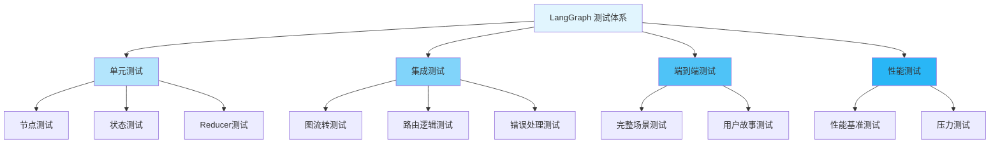

---
title: LangGraph 测试与调试
date: 2025-01-30
permalink: /ai/langgraph/testing-debugging.html
categories:
  - AI
  - LangGraph
---

# LangGraph 测试与调试

## 一、测试体系概览



## 二、单元测试

### 2.1 节点函数测试

```python
import pytest
from typing import TypedDict, Annotated
import operator

# 待测试的节点
class State(TypedDict):
    count: int
    messages: Annotated[list[str], operator.add]
    error: str | None

def increment_node(state: State) -> dict:
    """增加计数的节点"""
    return {
        "count": state["count"] + 1,
        "messages": ["Incremented"]
    }

def validate_node(state: State) -> dict:
    """验证节点"""
    if state["count"] < 0:
        return {"error": "Count cannot be negative"}
    return {"error": None}

# 测试用例
class TestNodes:
    """节点单元测试"""

    def test_increment_node_basic(self):
        """测试基本增加功能"""
        state = {
            "count": 5,
            "messages": [],
            "error": None
        }
        result = increment_node(state)

        assert result["count"] == 6
        assert "Incremented" in result["messages"]

    def test_increment_node_zero(self):
        """测试从零开始"""
        state = {
            "count": 0,
            "messages": [],
            "error": None
        }
        result = increment_node(state)
        assert result["count"] == 1

    def test_validate_node_positive(self):
        """测试正数验证"""
        state = {"count": 5, "messages": [], "error": None}
        result = validate_node(state)
        assert result["error"] is None

    def test_validate_node_negative(self):
        """测试负数验证"""
        state = {"count": -1, "messages": [], "error": None}
        result = validate_node(state)
        assert result["error"] == "Count cannot be negative"

    @pytest.mark.parametrize("count,expected", [
        (0, 1),
        (10, 11),
        (99, 100),
        (-5, -4),
    ])
    def test_increment_parametrized(self, count, expected):
        """参数化测试"""
        state = {"count": count, "messages": [], "error": None}
        result = increment_node(state)
        assert result["count"] == expected
```

### 2.2 状态更新测试

```python
from typing import TypedDict, Annotated
import operator

class MessageState(TypedDict):
    messages: Annotated[list[str], operator.add]
    user_id: str
    session_id: str

class TestStateUpdates:
    """状态更新测试"""

    def test_message_accumulation(self):
        """测试消息累积"""
        from langgraph.graph import StateGraph

        def add_message(state: MessageState) -> dict:
            return {"messages": ["new message"]}

        graph = StateGraph(MessageState)
        graph.add_node("add", add_message)
        graph.set_entry_point("add")
        graph.set_finish_point("add")

        app = graph.compile()

        initial_state = {
            "messages": ["initial"],
            "user_id": "user1",
            "session_id": "session1"
        }

        result = app.invoke(initial_state)

        # 验证消息累积（使用 operator.add）
        assert len(result["messages"]) == 2
        assert "initial" in result["messages"]
        assert "new message" in result["messages"]

    def test_state_immutability(self):
        """测试状态不可变性"""
        def modify_node(state: MessageState) -> dict:
            # 不应该修改原始状态
            return {"messages": ["modified"]}

        initial_state = {
            "messages": ["original"],
            "user_id": "user1",
            "session_id": "session1"
        }

        original_messages = initial_state["messages"].copy()
        result = modify_node(initial_state)

        # 原始状态不应改变
        assert initial_state["messages"] == original_messages
```

### 2.3 Reducer 测试

```python
from typing import Annotated

def merge_max(old: int, new: int) -> int:
    """保留较大值的 Reducer"""
    return max(old, new) if old is not None else new

def merge_unique_list(old: list, new: list) -> list:
    """去重合并列表的 Reducer"""
    return list(set(old + new))

class TestReducers:
    """Reducer 单元测试"""

    def test_merge_max_basic(self):
        """测试最大值合并"""
        assert merge_max(5, 10) == 10
        assert merge_max(10, 5) == 10
        assert merge_max(None, 5) == 5

    def test_merge_unique_list(self):
        """测试唯一列表合并"""
        old = [1, 2, 3]
        new = [3, 4, 5]
        result = merge_unique_list(old, new)

        assert len(result) == 5
        assert set(result) == {1, 2, 3, 4, 5}

    def test_merge_unique_list_empty(self):
        """测试空列表"""
        assert merge_unique_list([], [1, 2]) == [1, 2]
        assert merge_unique_list([1, 2], []) == [1, 2]
```

## 三、集成测试

### 3.1 图流转测试

```python
import pytest
from langgraph.graph import StateGraph, END
from typing import TypedDict

class WorkflowState(TypedDict):
    step: int
    data: str
    completed: bool

def step1(state: WorkflowState) -> dict:
    return {"step": 1, "data": "Step 1 done"}

def step2(state: WorkflowState) -> dict:
    return {"step": 2, "data": "Step 2 done"}

def step3(state: WorkflowState) -> dict:
    return {"step": 3, "data": "Step 3 done", "completed": True}

class TestGraphFlow:
    """图流转集成测试"""

    @pytest.fixture
    def workflow(self):
        """创建工作流图"""
        graph = StateGraph(WorkflowState)

        graph.add_node("step1", step1)
        graph.add_node("step2", step2)
        graph.add_node("step3", step3)

        graph.set_entry_point("step1")
        graph.add_edge("step1", "step2")
        graph.add_edge("step2", "step3")
        graph.add_edge("step3", END)

        return graph.compile()

    def test_complete_workflow(self, workflow):
        """测试完整流程"""
        initial_state = {
            "step": 0,
            "data": "",
            "completed": False
        }

        result = workflow.invoke(initial_state)

        assert result["step"] == 3
        assert result["data"] == "Step 3 done"
        assert result["completed"] is True

    def test_intermediate_states(self, workflow):
        """测试中间状态"""
        initial_state = {
            "step": 0,
            "data": "",
            "completed": False
        }

        # 获取所有中间状态
        states = []
        for state in workflow.stream(initial_state):
            states.append(state)

        # 验证每个步骤都执行了
        assert len(states) == 3
        assert states[0]["step1"]["step"] == 1
        assert states[1]["step2"]["step"] == 2
        assert states[2]["step3"]["step"] == 3
```

### 3.2 条件路由测试

```python
from langgraph.graph import StateGraph, END

class RouteState(TypedDict):
    value: int
    path: str

def router(state: RouteState) -> str:
    """路由函数"""
    if state["value"] > 10:
        return "high"
    elif state["value"] > 0:
        return "medium"
    else:
        return "low"

def high_handler(state: RouteState) -> dict:
    return {"path": "high"}

def medium_handler(state: RouteState) -> dict:
    return {"path": "medium"}

def low_handler(state: RouteState) -> dict:
    return {"path": "low"}

class TestConditionalRouting:
    """条件路由测试"""

    @pytest.fixture
    def routing_graph(self):
        """创建路由图"""
        graph = StateGraph(RouteState)

        graph.add_node("high", high_handler)
        graph.add_node("medium", medium_handler)
        graph.add_node("low", low_handler)

        graph.set_conditional_entry_point(
            router,
            {
                "high": "high",
                "medium": "medium",
                "low": "low"
            }
        )

        graph.add_edge("high", END)
        graph.add_edge("medium", END)
        graph.add_edge("low", END)

        return graph.compile()

    @pytest.mark.parametrize("value,expected_path", [
        (15, "high"),
        (5, "medium"),
        (-5, "low"),
        (11, "high"),
        (10, "medium"),
        (0, "low"),
    ])
    def test_routing(self, routing_graph, value, expected_path):
        """参数化路由测试"""
        state = {"value": value, "path": ""}
        result = routing_graph.invoke(state)
        assert result["path"] == expected_path
```

### 3.3 错误处理测试

```python
class ErrorState(TypedDict):
    value: int
    error: str | None
    retry_count: int

def risky_operation(state: ErrorState) -> dict:
    """可能失败的操作"""
    if state["value"] < 0:
        raise ValueError("Value cannot be negative")
    return {"error": None}

def error_handler(state: ErrorState) -> dict:
    """错误处理器"""
    return {
        "error": "Operation failed",
        "retry_count": state["retry_count"] + 1
    }

class TestErrorHandling:
    """错误处理测试"""

    def test_successful_operation(self):
        """测试成功操作"""
        state = {"value": 10, "error": None, "retry_count": 0}
        result = risky_operation(state)
        assert result["error"] is None

    def test_error_raised(self):
        """测试错误抛出"""
        state = {"value": -1, "error": None, "retry_count": 0}

        with pytest.raises(ValueError, match="Value cannot be negative"):
            risky_operation(state)

    def test_error_handler(self):
        """测试错误处理"""
        state = {"value": -1, "error": None, "retry_count": 0}

        try:
            risky_operation(state)
        except ValueError:
            result = error_handler(state)
            assert result["error"] == "Operation failed"
            assert result["retry_count"] == 1

    def test_retry_logic(self):
        """测试重试逻辑"""
        from langgraph.graph import StateGraph, END

        def try_operation(state: ErrorState) -> dict:
            try:
                return risky_operation(state)
            except ValueError:
                if state["retry_count"] < 3:
                    return error_handler(state)
                return {"error": "Max retries exceeded"}

        graph = StateGraph(ErrorState)
        graph.add_node("operation", try_operation)
        graph.set_entry_point("operation")
        graph.add_edge("operation", END)

        app = graph.compile()

        # 测试失败场景
        result = app.invoke({
            "value": -1,
            "error": None,
            "retry_count": 0
        })

        assert result["error"] == "Operation failed"
        assert result["retry_count"] == 1
```

## 四、Mock 和 Stub

### 4.1 Mock 外部依赖

```python
from unittest.mock import Mock, patch, MagicMock
import pytest

class LLMState(TypedDict):
    query: str
    response: str

def llm_node(state: LLMState) -> dict:
    """调用 LLM 的节点"""
    from langchain_openai import ChatOpenAI

    llm = ChatOpenAI(model="gpt-4")
    response = llm.invoke(state["query"])

    return {"response": response.content}

class TestWithMocks:
    """使用 Mock 的测试"""

    @patch('langchain_openai.ChatOpenAI')
    def test_llm_node_mocked(self, mock_llm_class):
        """Mock LLM 调用"""
        # 配置 Mock
        mock_llm = Mock()
        mock_response = Mock()
        mock_response.content = "Mocked response"
        mock_llm.invoke.return_value = mock_response
        mock_llm_class.return_value = mock_llm

        # 执行测试
        state = {"query": "Hello", "response": ""}
        result = llm_node(state)

        # 验证
        assert result["response"] == "Mocked response"
        mock_llm.invoke.assert_called_once_with("Hello")

    def test_with_fake_llm(self):
        """使用 Fake LLM"""
        from langchain_community.llms.fake import FakeListLLM

        def fake_llm_node(state: LLMState) -> dict:
            llm = FakeListLLM(responses=["Response 1", "Response 2"])
            response = llm.invoke(state["query"])
            return {"response": response}

        state = {"query": "Test", "response": ""}
        result = fake_llm_node(state)

        assert result["response"] in ["Response 1", "Response 2"]
```

### 4.2 Stub 复杂逻辑

```python
class DatabaseState(TypedDict):
    user_id: str
    data: dict | None

# 实际的数据库操作
def fetch_from_database(user_id: str) -> dict:
    """真实的数据库查询（需要数据库连接）"""
    # 实际实现
    pass

# 测试用的 Stub
class StubDatabase:
    """数据库 Stub"""

    def __init__(self):
        self.data = {
            "user1": {"name": "Alice", "age": 30},
            "user2": {"name": "Bob", "age": 25},
        }

    def fetch(self, user_id: str) -> dict | None:
        return self.data.get(user_id)

class TestWithStubs:
    """使用 Stub 的测试"""

    @pytest.fixture
    def stub_db(self):
        """数据库 Stub Fixture"""
        return StubDatabase()

    def test_fetch_existing_user(self, stub_db):
        """测试获取存在的用户"""
        result = stub_db.fetch("user1")
        assert result["name"] == "Alice"
        assert result["age"] == 30

    def test_fetch_nonexistent_user(self, stub_db):
        """测试获取不存在的用户"""
        result = stub_db.fetch("user999")
        assert result is None
```

## 五、调试技巧

### 5.1 日志调试

```python
import logging
from typing import TypedDict

# 配置日志
logging.basicConfig(
    level=logging.DEBUG,
    format='%(asctime)s - %(name)s - %(levelname)s - %(message)s'
)
logger = logging.getLogger(__name__)

class DebugState(TypedDict):
    step: int
    value: int

def debug_node(state: DebugState) -> dict:
    """带日志的节点"""
    logger.debug(f"Entering node with state: {state}")

    result = {"value": state["value"] * 2}

    logger.debug(f"Node result: {result}")
    logger.info(f"Processed step {state['step']}, value: {state['value']} -> {result['value']}")

    return result

# 使用示例
def test_with_logging(caplog):
    """测试日志输出"""
    with caplog.at_level(logging.DEBUG):
        state = {"step": 1, "value": 5}
        result = debug_node(state)

        # 验证日志
        assert "Entering node with state" in caplog.text
        assert "Node result" in caplog.text
        assert result["value"] == 10
```

### 5.2 状态检查点

```python
from langgraph.checkpoint.memory import MemorySaver
from langgraph.graph import StateGraph, END

class CheckpointState(TypedDict):
    count: int
    history: list[int]

def increment_with_checkpoint(state: CheckpointState) -> dict:
    """带检查点的节点"""
    new_count = state["count"] + 1
    return {
        "count": new_count,
        "history": state["history"] + [new_count]
    }

class TestCheckpointing:
    """检查点测试"""

    def test_state_checkpoints(self):
        """测试状态检查点"""
        # 创建带检查点的图
        memory = MemorySaver()

        graph = StateGraph(CheckpointState)
        graph.add_node("increment", increment_with_checkpoint)
        graph.set_entry_point("increment")
        graph.add_edge("increment", END)

        app = graph.compile(checkpointer=memory)

        # 执行多次
        config = {"configurable": {"thread_id": "test-1"}}

        # 第一次执行
        result1 = app.invoke(
            {"count": 0, "history": []},
            config=config
        )
        assert result1["count"] == 1

        # 第二次执行（使用同一 thread_id）
        result2 = app.invoke(
            {"count": result1["count"], "history": result1["history"]},
            config=config
        )
        assert result2["count"] == 2
        assert result2["history"] == [1, 2]

        # 检查历史状态
        history = []
        for state in app.get_state_history(config):
            history.append(state.values)

        assert len(history) >= 2
```

### 5.3 断点调试

```python
def debug_breakpoint_node(state: DebugState) -> dict:
    """带断点的节点（仅用于开发调试）"""
    import pdb

    # 条件断点
    if state["value"] < 0:
        pdb.set_trace()  # 只在值为负时暂停

    result = {"value": state["value"] * 2}
    return result

# 使用 pytest 的断点
def test_with_breakpoint():
    """使用 pytest 断点"""
    state = {"step": 1, "value": -5}

    # 在这里设置断点（运行 pytest 时使用 -s 标志）
    # 运行: pytest -s test_file.py::test_with_breakpoint
    result = debug_breakpoint_node(state)

    assert result["value"] == -10
```

### 5.4 可视化调试

```python
from langgraph.graph import StateGraph, END
from typing import TypedDict

class VisualState(TypedDict):
    value: int
    path: list[str]

def node_a(state: VisualState) -> dict:
    return {"value": state["value"] + 1, "path": state["path"] + ["A"]}

def node_b(state: VisualState) -> dict:
    return {"value": state["value"] * 2, "path": state["path"] + ["B"]}

def node_c(state: VisualState) -> dict:
    return {"value": state["value"] - 1, "path": state["path"] + ["C"]}

def create_visual_graph():
    """创建可视化的图"""
    graph = StateGraph(VisualState)

    graph.add_node("a", node_a)
    graph.add_node("b", node_b)
    graph.add_node("c", node_c)

    graph.set_entry_point("a")
    graph.add_edge("a", "b")
    graph.add_edge("b", "c")
    graph.add_edge("c", END)

    return graph.compile()

def test_visualize_graph():
    """测试图可视化"""
    app = create_visual_graph()

    # 生成 Mermaid 图
    try:
        mermaid_code = app.get_graph().draw_mermaid()
        print("\nMermaid Graph:")
        print(mermaid_code)

        # 验证图结构
        assert "a" in mermaid_code
        assert "b" in mermaid_code
        assert "c" in mermaid_code
    except Exception as e:
        print(f"Visualization not available: {e}")

    # 测试执行路径
    result = app.invoke({"value": 5, "path": []})
    print(f"\nExecution path: {result['path']}")
    print(f"Final value: {result['value']}")

    assert result["path"] == ["A", "B", "C"]
    assert result["value"] == 11  # (5+1)*2-1
```

## 六、性能测试

### 6.1 基准测试

```python
import time
import pytest
from typing import TypedDict

class PerfState(TypedDict):
    data: list[int]
    result: int

def expensive_operation(state: PerfState) -> dict:
    """耗时操作"""
    result = sum(x * x for x in state["data"])
    return {"result": result}

class TestPerformance:
    """性能测试"""

    def test_operation_performance(self, benchmark):
        """使用 pytest-benchmark 测试性能"""
        state = {"data": list(range(1000)), "result": 0}

        # benchmark 会多次运行函数并统计
        result = benchmark(expensive_operation, state)

        assert result["result"] > 0

    def test_manual_benchmark(self):
        """手动基准测试"""
        state = {"data": list(range(10000)), "result": 0}

        start = time.time()
        result = expensive_operation(state)
        duration = time.time() - start

        print(f"\nOperation took {duration:.4f} seconds")

        # 断言性能要求
        assert duration < 1.0  # 应该在1秒内完成
        assert result["result"] > 0
```

### 6.2 压力测试

```python
import concurrent.futures
from langgraph.graph import StateGraph, END

class LoadState(TypedDict):
    request_id: int
    processed: bool

def process_request(state: LoadState) -> dict:
    """处理请求"""
    # 模拟处理
    time.sleep(0.01)
    return {"processed": True}

class TestLoad:
    """负载测试"""

    @pytest.fixture
    def app(self):
        """创建应用"""
        graph = StateGraph(LoadState)
        graph.add_node("process", process_request)
        graph.set_entry_point("process")
        graph.add_edge("process", END)
        return graph.compile()

    def test_concurrent_requests(self, app):
        """测试并发请求"""
        num_requests = 100

        def make_request(request_id: int):
            state = {"request_id": request_id, "processed": False}
            return app.invoke(state)

        start = time.time()

        # 使用线程池并发执行
        with concurrent.futures.ThreadPoolExecutor(max_workers=10) as executor:
            futures = [
                executor.submit(make_request, i)
                for i in range(num_requests)
            ]

            results = [f.result() for f in concurrent.futures.as_completed(futures)]

        duration = time.time() - start

        print(f"\nProcessed {num_requests} requests in {duration:.2f} seconds")
        print(f"Throughput: {num_requests/duration:.2f} requests/second")

        # 验证所有请求都成功
        assert len(results) == num_requests
        assert all(r["processed"] for r in results)
```

## 七、测试最佳实践

### 7.1 测试组织

```python
# tests/
# ├── unit/
# │   ├── test_nodes.py
# │   ├── test_reducers.py
# │   └── test_state.py
# ├── integration/
# │   ├── test_workflows.py
# │   └── test_routing.py
# ├── e2e/
# │   └── test_scenarios.py
# └── conftest.py

# conftest.py - 共享 fixtures
import pytest
from langgraph.checkpoint.memory import MemorySaver

@pytest.fixture
def memory_saver():
    """内存检查点 fixture"""
    return MemorySaver()

@pytest.fixture
def sample_state():
    """示例状态 fixture"""
    return {
        "count": 0,
        "messages": [],
        "error": None
    }
```

### 7.2 测试覆盖率

```python
# 运行测试并生成覆盖率报告
# pytest --cov=your_module --cov-report=html tests/

# .coveragerc 配置文件
"""
[run]
omit =
    */tests/*
    */venv/*
    */__pycache__/*

[report]
exclude_lines =
    pragma: no cover
    def __repr__
    raise AssertionError
    raise NotImplementedError
    if __name__ == .__main__.:
    if TYPE_CHECKING:
"""
```

### 7.3 持续集成

```yaml
# .github/workflows/test.yml
name: Tests

on: [push, pull_request]

jobs:
  test:
    runs-on: ubuntu-latest

    strategy:
      matrix:
        python-version: [3.9, 3.10, 3.11]

    steps:
    - uses: actions/checkout@v2

    - name: Set up Python
      uses: actions/setup-python@v2
      with:
        python-version: ${{ matrix.python-version }}

    - name: Install dependencies
      run: |
        pip install -r requirements.txt
        pip install pytest pytest-cov pytest-asyncio

    - name: Run tests
      run: |
        pytest --cov=src --cov-report=xml

    - name: Upload coverage
      uses: codecov/codecov-action@v2
      with:
        file: ./coverage.xml
```

## 八、调试工具推荐

### 8.1 LangSmith

```python
import os
from langsmith import Client

# 配置 LangSmith
os.environ["LANGCHAIN_TRACING_V2"] = "true"
os.environ["LANGCHAIN_API_KEY"] = "your-api-key"

# 使用 LangSmith 跟踪
from langchain.callbacks.tracers import LangChainTracer

tracer = LangChainTracer()

# 在调用时传入
result = app.invoke(
    initial_state,
    config={"callbacks": [tracer]}
)

# 在 LangSmith UI 中查看执行详情
```

### 8.2 自定义调试工具

```python
class DebugTracer:
    """自定义调试追踪器"""

    def __init__(self):
        self.events = []

    def on_node_start(self, node_name: str, state: dict):
        """节点开始时记录"""
        self.events.append({
            "type": "node_start",
            "node": node_name,
            "state": state.copy(),
            "timestamp": time.time()
        })

    def on_node_end(self, node_name: str, result: dict):
        """节点结束时记录"""
        self.events.append({
            "type": "node_end",
            "node": node_name,
            "result": result.copy(),
            "timestamp": time.time()
        })

    def print_trace(self):
        """打印追踪信息"""
        print("\n=== Execution Trace ===")
        for event in self.events:
            print(f"[{event['type']}] {event['node']}")
            if event['type'] == 'node_start':
                print(f"  State: {event['state']}")
            else:
                print(f"  Result: {event['result']}")

# 使用示例
tracer = DebugTracer()

def traced_node(state: dict) -> dict:
    node_name = "example_node"
    tracer.on_node_start(node_name, state)

    # 执行节点逻辑
    result = {"value": state["value"] * 2}

    tracer.on_node_end(node_name, result)
    return result
```

## 九、常见问题调试

### 9.1 状态不更新

```python
# 问题：状态没有更新
def broken_node(state: dict) -> dict:
    # ❌ 错误：修改了状态但没有返回
    state["value"] = 10
    return {}  # 没有返回更新

# ✅ 正确：返回要更新的字段
def fixed_node(state: dict) -> dict:
    return {"value": 10}

# 调试技巧
def test_state_update():
    """测试状态更新"""
    state = {"value": 5}

    result = fixed_node(state)

    # 验证返回值
    assert "value" in result
    assert result["value"] == 10
```

### 9.2 循环依赖

```python
# 问题：节点之间的循环依赖
def test_detect_cycle():
    """检测循环依赖"""
    graph = StateGraph(dict)

    graph.add_node("a", lambda s: s)
    graph.add_node("b", lambda s: s)

    graph.add_edge("a", "b")
    graph.add_edge("b", "a")  # 循环！

    # 应该在编译时检测到
    try:
        app = graph.compile()
        pytest.fail("Should detect cycle")
    except Exception as e:
        assert "cycle" in str(e).lower()
```

### 9.3 内存泄漏

```python
import tracemalloc
import gc

def test_memory_leak():
    """检测内存泄漏"""
    tracemalloc.start()

    # 执行多次操作
    for i in range(1000):
        state = {"data": list(range(1000))}
        result = expensive_operation(state)

    # 强制垃圾回收
    gc.collect()

    # 检查内存使用
    current, peak = tracemalloc.get_traced_memory()
    tracemalloc.stop()

    print(f"\nMemory: current={current/1024/1024:.2f}MB, peak={peak/1024/1024:.2f}MB")

    # 验证内存不会无限增长
    assert current < peak * 1.5  # 当前内存不应远超峰值
```

## 十、总结

### 测试策略矩阵

| 测试类型 | 覆盖范围 | 执行速度 | 何时使用 |
|---------|---------|---------|---------|
| 单元测试 | 单个函数/节点 | 快 | 开发时持续运行 |
| 集成测试 | 多个节点/路由 | 中等 | 提交前运行 |
| E2E 测试 | 完整场景 | 慢 | 发布前运行 |
| 性能测试 | 性能基准 | 慢 | 定期运行 |

### 调试清单

- ✅ 配置详细日志
- ✅ 使用断点和追踪
- ✅ 检查状态流转
- ✅ 验证路由逻辑
- ✅ 监控性能指标
- ✅ 使用可视化工具
- ✅ 编写复现测试

---

**下一步：** 学习 [09.性能优化指南](./09.性能优化指南.md) 提升应用性能！
