---
title: LangGraph 高级特性详解
date: 2025-01-30
permalink: /ai/langgraph/advanced-features.html
categories:
  - AI
  - LangGraph
---

# LangGraph 高级特性详解

## 一、高级特性概览

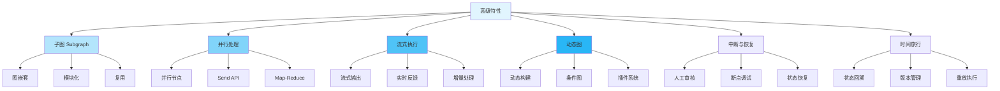

## 二、子图 (Subgraph)

### 2.1 子图概述

**什么是子图？**

子图（Subgraph）是 LangGraph 中的一种模块化机制，它允许你将一个完整的图作为另一个图的节点使用。子图本质上是一个**独立的、可编译的图**，可以在其他图中被调用和复用。

**为什么需要子图？**

1. **代码复用**：将常用的处理逻辑封装成子图，在多个工作流中重复使用
2. **模块化设计**：将复杂的工作流分解为多个独立的子图，每个子图负责特定功能
3. **关注点分离**：不同的子图可以有不同的状态结构和处理逻辑
4. **团队协作**：不同团队可以独立开发和维护各自的子图
5. **测试便利**：子图可以独立测试，提高代码质量

**子图的核心特点**

| 特点 | 说明 | 优势 |
|------|------|------|
| **独立编译** | 子图需要先编译成 `CompiledGraph` | 可独立运行和测试 |
| **状态隔离** | 子图有自己的状态类型 | 避免状态污染 |
| **接口清晰** | 通过 invoke() 调用，输入输出明确 | 易于理解和维护 |
| **可嵌套** | 子图内部可以包含其他子图 | 支持多层抽象 |
| **无副作用** | 子图不会直接修改父图状态 | 提高安全性 |

**子图的使用流程**


### 2.2 基本子图实现

下面通过一个完整示例来理解子图的基本用法：

```python
from langgraph.graph import StateGraph, END
from typing import TypedDict

# 1. 定义子图状态（独立的状态结构）
class SubState(TypedDict):
    value: int      # 子图的输入
    result: int     # 子图的输出

# 2. 创建子图工厂函数
def create_subgraph():
    """
    创建可复用的子图

    这个子图实现两个功能：
    1. 对输入值加 1
    2. 对结果乘以 2

    返回: 编译后的子图应用
    """
    def increment(state: SubState) -> dict:
        """子图节点1：递增操作"""
        return {"value": state["value"] + 1}

    def multiply(state: SubState) -> dict:
        """子图节点2：乘法操作"""
        return {"result": state["value"] * 2}

    # 创建子图实例
    subgraph = StateGraph(SubState)

    # 添加子图节点
    subgraph.add_node("increment", increment)
    subgraph.add_node("multiply", multiply)

    # 定义子图流程
    subgraph.set_entry_point("increment")      # 入口：increment
    subgraph.add_edge("increment", "multiply")  # increment → multiply
    subgraph.add_edge("multiply", END)          # multiply → 结束

    # 编译并返回（重要：必须编译才能被调用）
    return subgraph.compile()

# 3. 定义主图状态
class MainState(TypedDict):
    input: int      # 主图输入
    output: int     # 主图输出

# 4. 在主图中使用子图
def create_main_graph_with_subgraph():
    """
    主图包含子图的完整示例

    流程：prepare → subgraph → END
    """
    # 获取编译后的子图（可复用）
    subgraph_app = create_subgraph()

    def prepare(state: MainState) -> dict:
        """主图节点1：准备数据"""
        return {"input": state["input"]}

    def use_subgraph(state: MainState) -> dict:
        """
        主图节点2：调用子图

        关键点：
        1. 构造子图所需的状态（状态转换）
        2. 调用子图的 invoke() 方法
        3. 从子图结果中提取需要的数据
        4. 转换为主图的状态格式
        """
        # 状态转换：主图状态 → 子图状态
        sub_input = {
            "value": state["input"],
            "result": 0
        }

        # 调用子图处理
        sub_result = subgraph_app.invoke(sub_input)

        # 状态转换：子图状态 → 主图状态
        return {"output": sub_result["result"]}

    # 构建主图
    graph = StateGraph(MainState)
    graph.add_node("prepare", prepare)
    graph.add_node("subgraph", use_subgraph)

    graph.set_entry_point("prepare")
    graph.add_edge("prepare", "subgraph")
    graph.add_edge("subgraph", END)

    return graph.compile()

# 5. 测试子图集成
def test_subgraph():
    """
    测试子图功能

    执行流程：
    1. 主图接收 input=5
    2. prepare 节点保持输入
    3. subgraph 节点：
       - 子图 increment: 5 + 1 = 6
       - 子图 multiply: 6 * 2 = 12
    4. 主图输出 output=12
    """
    app = create_main_graph_with_subgraph()
    result = app.invoke({"input": 5, "output": 0})

    print(f"结果: {result['output']}")  # (5+1)*2 = 12
    assert result["output"] == 12

    print("✅ 子图测试通过")
```

**状态转换图示**

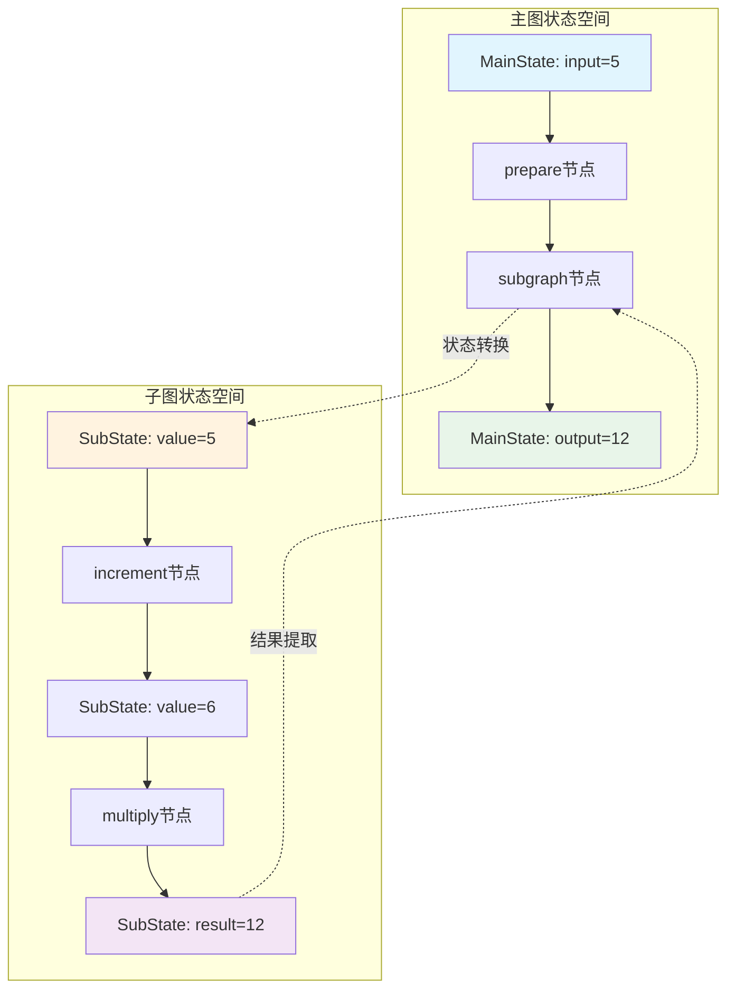

**关键要点总结**

1. **子图必须先编译**：使用 `subgraph.compile()` 编译后才能被调用
2. **状态需要转换**：主图状态和子图状态通常不同，需要手动转换
3. **子图是独立的**：子图执行时有自己的状态空间，不会影响主图
4. **可以复用**：编译后的子图可以在多个节点中调用
5. **调用方式**：通过 `subgraph_app.invoke(state)` 同步调用

### 2.3 嵌套子图

**嵌套子图的概念**

嵌套子图是指在一个子图内部调用另一个子图，形成多层级的图结构。这种设计模式在以下场景特别有用：

1. **层次化处理**：将复杂逻辑分解为多个抽象层次
2. **深度模块化**：每一层关注特定的抽象级别
3. **职责分离**：不同层次处理不同粒度的任务
4. **可组合性**：底层子图可以被多个上层子图复用

**嵌套结构示意图**

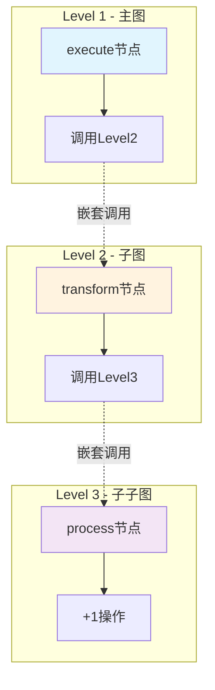

**完整实现示例**

```python
from typing import TypedDict

# 定义三个层次的状态（每层有不同的关注点）
class Level1State(TypedDict):
    data: str           # 顶层：处理字符串数据

class Level2State(TypedDict):
    value: int          # 中层：处理整数值

class Level3State(TypedDict):
    count: int          # 底层：处理计数

# 第三层子图（最内层 - 原子操作）
def create_level3_graph():
    """
    最内层子图：执行基础的原子操作

    功能：对计数加 1
    抽象级别：最低（原子操作）
    """
    def process(state: Level3State) -> dict:
        """原子操作：递增"""
        return {"count": state["count"] + 1}

    graph = StateGraph(Level3State)
    graph.add_node("process", process)
    graph.set_entry_point("process")
    graph.add_edge("process", END)

    return graph.compile()

# 第二层子图（中间层 - 业务逻辑）
def create_level2_graph():
    """
    中间层子图：组合原子操作形成业务逻辑

    功能：调用 Level3 递增，然后乘以 2
    抽象级别：中等（业务逻辑）
    """
    # 获取底层子图
    level3 = create_level3_graph()

    def transform(state: Level2State) -> dict:
        """
        业务逻辑：先递增再翻倍

        执行步骤：
        1. 调用 Level3 子图进行递增
        2. 将结果乘以 2
        """
        # 调用更深层的子图
        result = level3.invoke({"count": state["value"]})

        # 在 Level3 结果基础上继续处理
        return {"value": result["count"] * 2}

    graph = StateGraph(Level2State)
    graph.add_node("transform", transform)
    graph.set_entry_point("transform")
    graph.add_edge("transform", END)

    return graph.compile()

# 第一层主图（顶层 - 工作流编排）
def create_level1_graph():
    """
    顶层主图：编排整个工作流

    功能：处理字符串输入，调用下层子图，返回字符串结果
    抽象级别：最高（工作流编排）
    """
    # 获取中层子图
    level2 = create_level2_graph()

    def execute(state: Level1State) -> dict:
        """
        工作流编排：
        1. 解析字符串为整数
        2. 调用 Level2 子图处理
        3. 格式化结果为字符串
        """
        # 数据转换：字符串 → 整数
        value = int(state["data"])

        # 调用中层子图（内部会调用 Level3）
        result = level2.invoke({"value": value})

        # 数据转换：整数 → 字符串
        return {"data": str(result["value"])}

    graph = StateGraph(Level1State)
    graph.add_node("execute", execute)
    graph.set_entry_point("execute")
    graph.add_edge("execute", END)

    return graph.compile()

# 测试嵌套子图
def test_nested_subgraph():
    """
    测试嵌套子图的执行流程

    执行追踪：
    1. Level1: "5" → int(5)
    2. Level2: 5 → Level3
    3. Level3: 5 + 1 = 6
    4. Level2: 6 * 2 = 12
    5. Level1: str(12) = "12"
    """
    app = create_level1_graph()
    result = app.invoke({"data": "5"})

    print("嵌套子图执行结果:")
    print(f"  输入: '5'")
    print(f"  Level3: 5 + 1 = 6")
    print(f"  Level2: 6 * 2 = 12")
    print(f"  Level1: str(12) = '12'")
    print(f"  输出: {result['data']}")

    # 验证结果：(5+1)*2 = 12
    assert result["data"] == "12"
    print("✅ 嵌套子图测试通过")
```

**嵌套子图的最佳实践**

| 实践 | 说明 | 优势 |
|------|------|------|
| **单一职责** | 每层子图只负责一个抽象级别 | 易于理解和维护 |
| **清晰边界** | 明确定义每层的输入输出 | 减少耦合 |
| **避免过深** | 嵌套层次不超过 3-4 层 | 防止过度复杂 |
| **状态转换** | 每层有独立的状态类型 | 类型安全 |
| **错误处理** | 每层捕获和传递错误 | 可靠性高 |

**何时使用嵌套子图？**

✅ **适用场景**：
- 复杂的多层业务逻辑
- 需要在不同抽象层次重用代码
- 大型团队协作开发
- 需要独立测试各个层次

❌ **不适用场景**：
- 简单的线性流程
- 只有一层抽象的任务
- 性能要求极高的场景（每层调用有开销）

### 2.4 模块化子图

**模块化设计理念**

模块化子图是将子图封装为可复用的功能模块，每个模块专注于单一职责。这种设计模式类似于微服务架构，具有以下特点：

1. **高内聚**：模块内部功能紧密相关
2. **低耦合**：模块之间通过清晰的接口通信
3. **可替换**：模块可以独立升级或替换
4. **可组合**：模块可以自由组合形成不同的工作流

**模块化架构图**

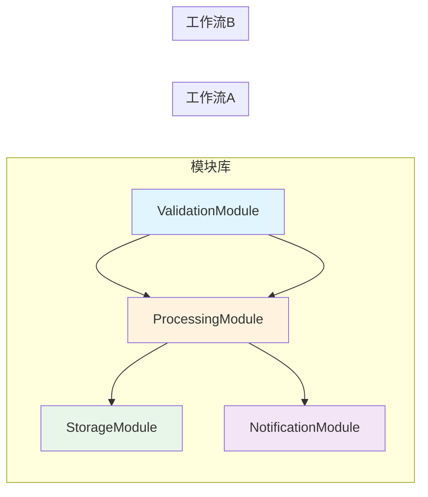

**完整的模块化实现**

```python
from typing import TypedDict, Literal

# ============= 模块1：验证模块 =============
class ValidationModule:
    """
    验证模块（子图）

    职责：验证输入数据的合法性
    输入：待验证的字符串
    输出：验证结果（通过/失败）+ 错误信息
    """

    class State(TypedDict):
        input: str
        valid: bool
        error: str | None

    @staticmethod
    def create():
        """工厂方法：创建验证子图"""
        def validate(state: "ValidationModule.State") -> dict:
            """验证逻辑"""
            # 规则1：不能为空
            if not state["input"]:
                return {"valid": False, "error": "Input cannot be empty"}

            # 规则2：长度限制
            if len(state["input"]) > 100:
                return {"valid": False, "error": "Input too long"}

            # 验证通过
            return {"valid": True, "error": None}

        # 构建子图
        graph = StateGraph(ValidationModule.State)
        graph.add_node("validate", validate)
        graph.set_entry_point("validate")
        graph.add_edge("validate", END)

        return graph.compile()

# ============= 模块2：处理模块 =============
class ProcessingModule:
    """
    处理模块（子图）

    职责：处理业务逻辑
    输入：原始数据
    输出：处理后的数据
    """

    class State(TypedDict):
        data: str
        processed: str

    @staticmethod
    def create():
        """工厂方法：创建处理子图"""
        def process(state: "ProcessingModule.State") -> dict:
            """处理逻辑：转大写"""
            processed = state["data"].upper()
            return {"processed": processed}

        # 构建子图
        graph = StateGraph(ProcessingModule.State)
        graph.add_node("process", process)
        graph.set_entry_point("process")
        graph.add_edge("process", END)

        return graph.compile()

# ============= 组合模块：主工作流 =============
class WorkflowState(TypedDict):
    """主工作流状态"""
    input: str          # 原始输入
    output: str         # 最终输出
    valid: bool         # 验证状态

def create_modular_workflow():
    """
    使用模块化子图的工作流

    架构：ValidationModule → ProcessingModule
    流程：验证 → 处理 → 输出
    """
    # 实例化各个模块（子图）
    validator = ValidationModule.create()
    processor = ProcessingModule.create()

    def validate_step(state: WorkflowState) -> dict:
        """
        步骤1：验证输入

        调用 ValidationModule 检查输入
        """
        # 状态转换：WorkflowState → ValidationModule.State
        result = validator.invoke({
            "input": state["input"],
            "valid": False,
            "error": None
        })

        # 提取验证结果
        return {"valid": result["valid"]}

    def process_step(state: WorkflowState) -> dict:
        """
        步骤2：处理数据

        如果验证通过，调用 ProcessingModule 处理
        """
        # 验证失败，返回错误信息
        if not state["valid"]:
            return {"output": "Invalid input"}

        # 状态转换：WorkflowState → ProcessingModule.State
        result = processor.invoke({
            "data": state["input"],
            "processed": ""
        })

        # 提取处理结果
        return {"output": result["processed"]}

    # 组装主工作流
    graph = StateGraph(WorkflowState)
    graph.add_node("validate", validate_step)
    graph.add_node("process", process_step)

    graph.set_entry_point("validate")
    graph.add_edge("validate", "process")
    graph.add_edge("process", END)

    return graph.compile()

# ============= 测试模块化工作流 =============
def test_modular_workflow():
    """测试模块化子图"""
    app = create_modular_workflow()

    # 测试1：有效输入
    print("=== 测试1：有效输入 ===")
    result1 = app.invoke({
        "input": "hello world",
        "output": "",
        "valid": False
    })
    print(f"输入: 'hello world'")
    print(f"输出: {result1['output']}")  # HELLO WORLD
    assert result1["output"] == "HELLO WORLD"

    # 测试2：空输入
    print("\n=== 测试2：空输入 ===")
    result2 = app.invoke({
        "input": "",
        "output": "",
        "valid": False
    })
    print(f"输入: ''")
    print(f"输出: {result2['output']}")  # Invalid input
    assert result2["output"] == "Invalid input"

    # 测试3：超长输入
    print("\n=== 测试3：超长输入 ===")
    long_input = "x" * 101
    result3 = app.invoke({
        "input": long_input,
        "output": "",
        "valid": False
    })
    print(f"输入: '{long_input[:20]}...' (长度 {len(long_input)})")
    print(f"输出: {result3['output']}")  # Invalid input
    assert result3["output"] == "Invalid input"

    print("\n✅ 所有测试通过")
```

**模块化设计的优势**

| 优势 | 说明 | 实际效果 |
|------|------|---------|
| **独立开发** | 不同模块可以并行开发 | 提高开发效率 |
| **独立测试** | 每个模块单独测试 | 提高代码质量 |
| **易于维护** | 修改模块不影响其他部分 | 降低维护成本 |
| **灵活组合** | 模块可以自由组合 | 支持多种工作流 |
| **版本管理** | 模块可以独立版本化 | 便于升级和回滚 |

**模块化最佳实践**

```python
# ✅ 好的实践：清晰的接口定义
class GoodModule:
    class State(TypedDict):
        # 明确的输入输出
        input: str
        output: str

    @staticmethod
    def create():
        # 工厂方法封装创建逻辑
        return graph.compile()

# ❌ 不好的实践：模块耦合
class BadModule:
    # 直接依赖其他模块的内部状态
    def process(state: AnotherModule.State):
        pass
```

**实际应用场景**

1. **数据处理管道**
   - 验证模块 → 清洗模块 → 转换模块 → 存储模块

2. **API网关**
   - 认证模块 → 限流模块 → 路由模块 → 响应模块

3. **内容审核系统**
   - 预处理模块 → 敏感词检测模块 → AI审核模块 → 人工审核模块

4. **订单处理系统**
   - 验证模块 → 库存检查模块 → 支付模块 → 发货模块

## 三、并行处理

### 3.1 并行处理概述

**什么是并行处理？**

并行处理是指多个节点同时执行，而不是顺序执行。在 LangGraph 中，当多个节点没有依赖关系时，它们可以并发运行，从而显著提升性能。

**为什么需要并行处理？**

1. **提升性能**：多个独立任务同时执行，总时间接近最长任务的时间
2. **资源利用**：充分利用多核 CPU 和异步 I/O
3. **降低延迟**：用户感知的响应时间更短
4. **提高吞吐量**：单位时间内处理更多请求

**串行 vs 并行对比**

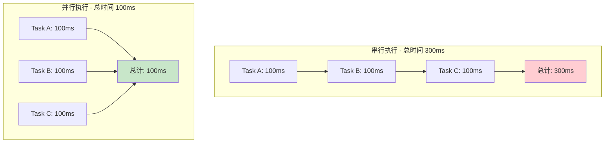

**LangGraph 并行处理的核心机制**

| 机制 | 说明 | 适用场景 |
|------|------|---------|
| **多入口点** | 设置多个 entry_point | 固定数量的并行任务 |
| **Send API** | 动态创建并行任务 | 运行时决定任务数量 |
| **Reducer** | 使用 operator.add 合并结果 | 需要收集所有结果 |
| **同步点** | 所有并行任务完成后继续 | 需要等待所有任务完成 |

### 3.2 多入口点并行

**工作原理**

通过设置多个入口点，LangGraph 会同时启动这些节点的执行。所有入口点节点完成后，才会执行后续节点。

**执行流程图**

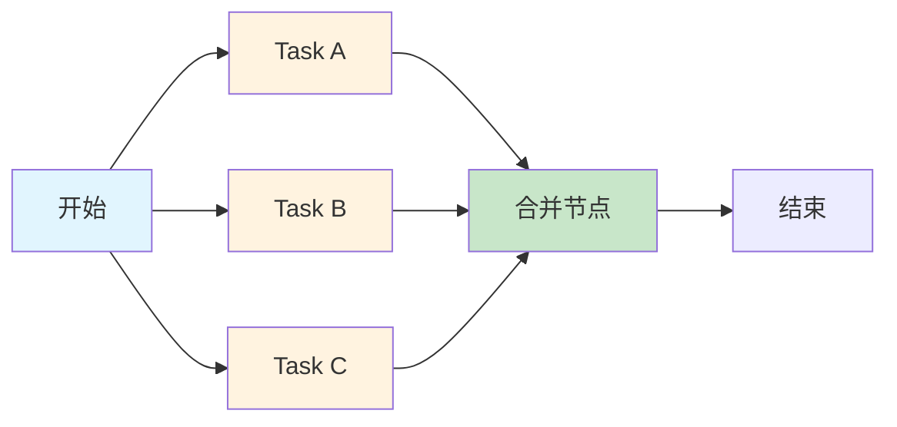

**完整实现示例**

```python
from typing import TypedDict, Annotated
import operator
from langgraph.graph import StateGraph, END

# 定义状态（使用 Reducer 合并结果）
class ParallelState(TypedDict):
    input: str
    # 关键：使用 Annotated + operator.add 作为 Reducer
    # 这样多个节点返回的列表会自动合并
    results: Annotated[list[str], operator.add]

def task_a(state: ParallelState) -> dict:
    """
    任务 A：模拟耗时处理

    特点：
    - 独立执行，不依赖其他任务
    - 模拟 100ms 的处理时间
    - 返回结果到 results 列表
    """
    import time
    time.sleep(0.1)  # 模拟耗时操作
    return {"results": [f"Task A processed: {state['input']}"]}

def task_b(state: ParallelState) -> dict:
    """
    任务 B：模拟耗时处理

    与 Task A 并行执行
    """
    import time
    time.sleep(0.1)
    return {"results": [f"Task B processed: {state['input']}"]}

def task_c(state: ParallelState) -> dict:
    """
    任务 C：模拟耗时处理

    与 Task A、Task B 并行执行
    """
    import time
    time.sleep(0.1)
    return {"results": [f"Task C processed: {state['input']}"]}

def merge_results(state: ParallelState) -> dict:
    """
    合并节点：所有并行任务完成后执行

    此时 state['results'] 已经包含了所有任务的结果
    因为使用了 operator.add 作为 Reducer
    """
    result_count = len(state['results'])
    return {"results": [f"Merged {result_count} results"]}

def create_parallel_graph():
    """
    创建并行执行图

    架构：
    1. 三个入口点：task_a, task_b, task_c (并行)
    2. 一个同步点：merge (等待所有任务完成)
    """
    graph = StateGraph(ParallelState)

    # 添加所有节点
    graph.add_node("task_a", task_a)
    graph.add_node("task_b", task_b)
    graph.add_node("task_c", task_c)
    graph.add_node("merge", merge_results)

    # 关键：设置多个入口点（并行执行）
    graph.set_entry_point("task_a")
    graph.set_entry_point("task_b")
    graph.set_entry_point("task_c")

    # 所有任务完成后汇聚到 merge 节点
    graph.add_edge("task_a", "merge")
    graph.add_edge("task_b", "merge")
    graph.add_edge("task_c", "merge")

    # merge 节点完成后结束
    graph.add_edge("merge", END)

    return graph.compile()

# 测试并行执行
def test_parallel():
    """
    测试并行执行的性能提升

    预期：
    - 串行执行：0.3s (100ms * 3)
    - 并行执行：~0.1s (max(100ms, 100ms, 100ms))
    """
    import time

    app = create_parallel_graph()

    # 计时开始
    start = time.time()

    # 执行图
    result = app.invoke({
        "input": "test",
        "results": []
    })

    # 计时结束
    duration = time.time() - start

    print("=== 并行执行测试 ===")
    print(f"执行时间: {duration:.2f}s")
    print(f"结果列表: {result['results']}")
    print(f"结果数量: {len(result['results'])}")

    # 验证：并行执行应该接近 0.1s，而不是 0.3s
    assert duration < 0.2, f"并行执行应该 < 0.2s，实际 {duration:.2f}s"

    # 验证：应该有 4 个结果（3个任务 + 1个合并）
    assert len(result['results']) == 4

    print("✅ 并行执行测试通过 - 性能提升 3倍！")
```

**关键技术点**

1. **Reducer 机制**
```python
# 使用 Annotated + operator.add
results: Annotated[list[str], operator.add]

# 效果：
# Task A 返回 {"results": ["A"]}
# Task B 返回 {"results": ["B"]}
# Task C 返回 {"results": ["C"]}
# 最终状态：{"results": ["A", "B", "C"]}
```

2. **执行顺序**
```python
# 并行节点的执行顺序是不确定的
# 但所有并行节点完成后，才会执行后续节点
```

3. **性能计算**
```python
# 串行时间 = task_a + task_b + task_c = 300ms
# 并行时间 = max(task_a, task_b, task_c) = 100ms
# 加速比 = 串行时间 / 并行时间 = 3倍
```

**适用场景**

✅ **适合并行的任务**：
- 多个 API 调用（查询数据库、调用外部服务）
- 多个 LLM 推理（不同模型或不同 prompt）
- 数据预处理（分片处理大文件）
- 独立的计算任务（不共享状态）

❌ **不适合并行的任务**：
- 有依赖关系的任务（A 的输出是 B 的输入）
- 共享资源的任务（需要加锁）
- 顺序敏感的任务（必须按特定顺序执行）

### 3.3 Send API 动态并行

**什么是 Send API？**

Send API 是 LangGraph 提供的一种**动态创建并行任务**的机制。与多入口点不同，Send API 可以在运行时根据数据动态决定创建多少个并行任务。

**多入口点 vs Send API**

| 特性 | 多入口点 | Send API |
|------|---------|----------|
| **任务数量** | 编译时固定 | 运行时动态 |
| **适用场景** | 固定的并行任务 | 数据驱动的并行 |
| **灵活性** | 低 | 高 |
| **实现复杂度** | 简单 | 中等 |

**典型应用场景**

1. **批量数据处理**：对列表中的每个元素并行处理
2. **Map-Reduce**：Map 阶段并行处理多个分片
3. **多路搜索**：同时搜索多个数据源
4. **Fan-out 模式**：一个输入触发多个处理流程

**执行流程图**

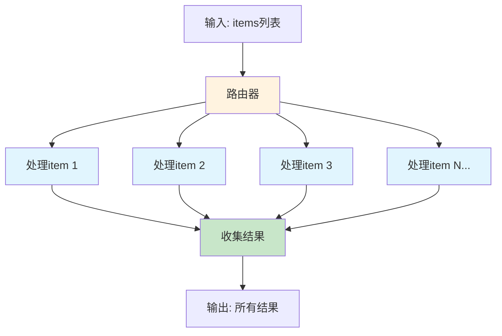

**完整实现示例**

```python
from langgraph.constants import Send
from typing import TypedDict, Annotated
import operator

# 主图状态：包含待处理的项目列表
class DynamicParallelState(TypedDict):
    items: list[dict]                           # 输入：待处理项目
    results: Annotated[list[dict], operator.add]  # 输出：处理结果（自动合并）

# 单个任务状态：每个并行任务的状态
class ItemState(TypedDict):
    item: dict        # 当前处理的项目
    processed: dict   # 处理结果

def process_item(state: ItemState) -> dict:
    """
    处理单个项目的节点

    功能：对项目的 value 字段乘以 2

    注意：
    - 这个节点会被并行调用多次
    - 每次调用处理一个独立的 item
    """
    item = state["item"]
    processed = {
        "id": item["id"],
        "value": item["value"] * 2  # 业务逻辑
    }

    # 返回处理结果
    # 注意：这里返回的不是 results，而是 processed
    return {"processed": processed}

def dynamic_parallel_router(state: DynamicParallelState):
    """
    动态并行路由器

    核心功能：
    1. 检查输入数据（items 列表）
    2. 为每个 item 创建一个 Send 对象
    3. 返回 Send 对象列表，触发并行执行

    返回格式：
    [
        Send("节点名", 状态),
        Send("节点名", 状态),
        ...
    ]
    """
    # 动态创建并行任务
    # 有多少个 item，就创建多少个并行任务
    return [
        Send(
            "process_item",  # 目标节点
            {                # 该节点的输入状态
                "item": item,
                "processed": {}
            }
        )
        for item in state["items"]
    ]

def collect_results(state: DynamicParallelState) -> dict:
    """
    收集所有并行任务的结果

    注意：
    - 这个节点会等待所有并行任务完成
    - state['results'] 已经通过 Reducer 自动合并了所有结果
    """
    print(f"收集到 {len(state['results'])} 个结果")
    return {"results": state["results"]}

def create_dynamic_parallel_graph():
    """
    创建动态并行图

    架构：
    1. 入口：条件路由器（动态创建并行任务）
    2. 中间：process_item 节点（并行执行 N 次）
    3. 出口：collect 节点（收集结果）
    """
    graph = StateGraph(DynamicParallelState)

    # 添加节点
    graph.add_node("process_item", process_item)
    graph.add_node("collect", collect_results)

    # 关键：使用条件入口点 + 路由器创建动态并行
    graph.set_conditional_entry_point(
        dynamic_parallel_router,      # 路由函数
        {"process_item": "process_item"}  # 路由映射
    )

    # 所有并行任务完成后，汇聚到 collect
    graph.add_edge("process_item", "collect")
    graph.add_edge("collect", END)

    return graph.compile()

# 测试动态并行
def test_dynamic_parallel():
    """
    测试动态并行执行

    场景：处理 3 个项目，每个项目的 value * 2
    """
    app = create_dynamic_parallel_graph()

    print("=== 动态并行测试 ===")

    # 测试1：3个项目
    result1 = app.invoke({
        "items": [
            {"id": 1, "value": 10},
            {"id": 2, "value": 20},
            {"id": 3, "value": 30},
        ],
        "results": []
    })

    print(f"输入项目数: 3")
    print(f"处理结果: {result1['results']}")
    assert len(result1['results']) == 3
    assert result1['results'][0]["value"] == 20  # 10 * 2

    # 测试2：动态数量（5个项目）
    result2 = app.invoke({
        "items": [{"id": i, "value": i * 10} for i in range(1, 6)],
        "results": []
    })

    print(f"\n输入项目数: 5")
    print(f"处理结果: {result2['results']}")
    assert len(result2['results']) == 5

    # 测试3：空列表
    result3 = app.invoke({
        "items": [],
        "results": []
    })

    print(f"\n输入项目数: 0")
    print(f"处理结果: {result3['results']}")
    assert len(result3['results']) == 0

    print("\n✅ 动态并行测试通过")
```

**Send API 的工作原理**

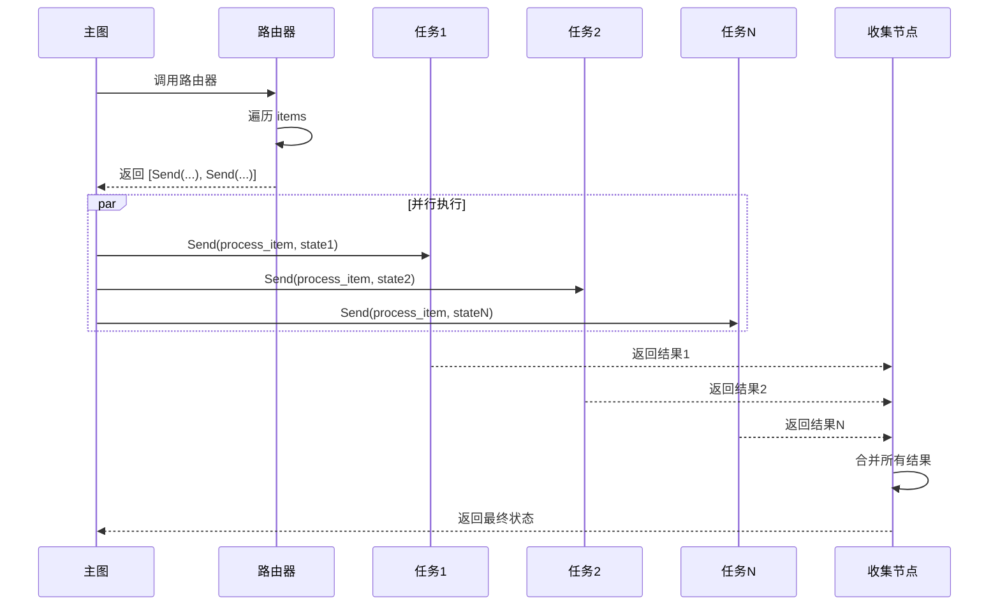

**关键技术点**

1. **Send 对象创建**
```python
# Send 的两个参数：
Send(
    "target_node",  # 目标节点名称
    {"key": "value"}  # 传递给目标节点的状态
)
```

2. **状态转换**
```python
# 主图状态 → 任务状态的转换
for item in state["items"]:
    Send("process_item", {
        "item": item,      # 从主图状态提取
        "processed": {}    # 初始化任务状态
    })
```

3. **结果收集**
```python
# 使用 Reducer 自动合并结果
# 不需要手动收集，框架自动处理
results: Annotated[list[dict], operator.add]
```

**性能优势**

| 场景 | 串行时间 | 并行时间 | 加速比 |
|------|---------|---------|--------|
| 10个任务，每个100ms | 1000ms | ~100ms | 10x |
| 100个任务，每个100ms | 10000ms | ~100ms | 100x |
| N个任务，每个T ms | N*T ms | ~T ms | Nx |

**最佳实践**

✅ **推荐做法**：
```python
# 1. 明确定义任务状态
class TaskState(TypedDict):
    input: Any
    output: Any

# 2. 使用列表推导式创建 Send
[Send("worker", {"input": x}) for x in items]

# 3. 使用 Reducer 自动合并结果
results: Annotated[list, operator.add]
```

❌ **避免的做法**：
```python
# 1. 不要在 Send 中包含大量数据
Send("worker", {"huge_data": ...})  # ❌

# 2. 不要创建过多的并行任务（内存问题）
[Send(...) for _ in range(10000)]  # ❌

# 3. 不要在并行任务中修改共享状态
def worker(state):
    shared_dict[key] = value  # ❌ 并发问题
```

**实际应用案例**

1. **批量图片处理**
```python
# 并行处理多张图片
[Send("resize_image", {"image": img}) for img in images]
```

2. **多数据源查询**
```python
# 同时查询多个数据库
[Send("query_db", {"db": db, "sql": sql}) for db in databases]
```

3. **多模型推理**
```python
# 并行调用多个 LLM 模型
[Send("call_llm", {"model": m, "prompt": p}) for m in models]
```

### 3.4 Map-Reduce 模式

**什么是 Map-Reduce？**

Map-Reduce 是一种经典的并行计算模式，最早由 Google 提出。它将大规模数据处理分为两个阶段：

1. **Map 阶段**：对每个数据元素进行独立处理（并行）
2. **Reduce 阶段**：将所有处理结果聚合成最终结果（串行）

**Map-Reduce 的特点**

| 特点 | 说明 | 优势 |
|------|------|------|
| **分而治之** | 将大问题拆分为小问题 | 易于并行化 |
| **无状态 Map** | Map 操作相互独立 | 高度并行 |
| **聚合 Reduce** | 合并所有中间结果 | 得到最终答案 |
| **可扩展性** | 支持海量数据处理 | 线性扩展 |

**执行流程图**

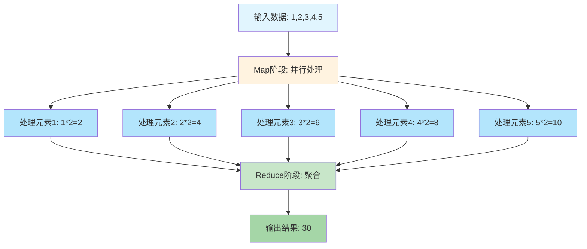

**基础 Map-Reduce 实现**

```python
from typing import TypedDict, Annotated, List
import operator

# 定义状态
class MapReduceState(TypedDict):
    data: list[int]                          # 原始数据
    mapped: Annotated[list[int], operator.add]  # Map 结果（自动合并）
    reduced: int                             # Reduce 结果

def map_phase(state: MapReduceState) -> dict:
    """
    Map 阶段：对每个元素进行转换

    功能：将每个数字乘以 2
    特点：这里是简化版，实际可以并行处理每个元素
    """
    # 处理所有元素
    mapped = [x * 2 for x in state["data"]]

    print(f"Map阶段: {state['data']} -> {mapped}")
    return {"mapped": mapped}

def reduce_phase(state: MapReduceState) -> dict:
    """
    Reduce 阶段：聚合所有结果

    功能：求和所有 Map 结果
    特点：等待所有 Map 完成后执行
    """
    # 聚合操作：求和
    reduced = sum(state["mapped"])

    print(f"Reduce阶段: sum({state['mapped']}) = {reduced}")
    return {"reduced": reduced}

def create_map_reduce_graph():
    """
    创建 Map-Reduce 图

    架构：
    1. Map 阶段：转换数据
    2. Reduce 阶段：聚合结果
    """
    graph = StateGraph(MapReduceState)

    # 添加节点
    graph.add_node("map", map_phase)
    graph.add_node("reduce", reduce_phase)

    # 定义流程
    graph.set_entry_point("map")
    graph.add_edge("map", "reduce")
    graph.add_edge("reduce", END)

    return graph.compile()

# 测试 Map-Reduce
def test_map_reduce():
    """
    测试 Map-Reduce 模式

    场景：计算 [1,2,3,4,5] 每个元素乘以2后的总和
    """
    app = create_map_reduce_graph()

    print("=== Map-Reduce 测试 ===")

    result = app.invoke({
        "data": [1, 2, 3, 4, 5],
        "mapped": [],
        "reduced": 0
    })

    print(f"\n最终结果:")
    print(f"  原始数据: [1,2,3,4,5]")
    print(f"  Map结果: {result['mapped']}")
    print(f"  Reduce结果: {result['reduced']}")

    # 验证：(1*2) + (2*2) + (3*2) + (4*2) + (5*2) = 30
    assert result["reduced"] == 30

    print("\n✅ Map-Reduce 测试通过")
```

**真正的并行 Map-Reduce**

上面的示例中，Map 阶段是串行的。下面展示如何使用 Send API 实现真正的并行 Map：

```python
from langgraph.constants import Send

class ParallelMapReduceState(TypedDict):
    data: list[int]                          # 原始数据
    mapped: Annotated[list[int], operator.add]  # Map 结果
    reduced: int                             # Reduce 结果

class MapTaskState(TypedDict):
    value: int      # 单个输入值
    result: int     # 处理结果

def map_single(state: MapTaskState) -> dict:
    """
    处理单个元素（并行执行）

    这个函数会被并行调用多次
    """
    result = state["value"] * 2
    print(f"  Map任务: {state['value']} * 2 = {result}")
    return {"result": result}

def map_router(state: ParallelMapReduceState):
    """
    Map 路由器：为每个元素创建并行任务

    返回 Send 对象列表
    """
    print(f"创建 {len(state['data'])} 个并行Map任务")
    return [
        Send("map_single", {"value": x, "result": 0})
        for x in state["data"]
    ]

def reduce_parallel(state: ParallelMapReduceState) -> dict:
    """
    Reduce 阶段：聚合所有并行 Map 结果
    """
    reduced = sum(state["mapped"])
    print(f"Reduce: sum({state['mapped']}) = {reduced}")
    return {"reduced": reduced}

def create_parallel_map_reduce():
    """创建并行 Map-Reduce 图"""
    graph = StateGraph(ParallelMapReduceState)

    # 添加节点
    graph.add_node("map_single", map_single)
    graph.add_node("reduce", reduce_parallel)

    # 使用条件入口点创建动态并行
    graph.set_conditional_entry_point(
        map_router,
        {"map_single": "map_single"}
    )

    # Map 完成后 Reduce
    graph.add_edge("map_single", "reduce")
    graph.add_edge("reduce", END)

    return graph.compile()

# 测试并行 Map-Reduce
def test_parallel_map_reduce():
    """测试并行 Map-Reduce"""
    import time

    app = create_parallel_map_reduce()

    print("=== 并行 Map-Reduce 测试 ===")

    start = time.time()
    result = app.invoke({
        "data": [1, 2, 3, 4, 5],
        "mapped": [],
        "reduced": 0
    })
    duration = time.time() - start

    print(f"\n执行时间: {duration:.3f}s")
    print(f"最终结果: {result['reduced']}")

    assert result["reduced"] == 30
    print("✅ 并行 Map-Reduce 测试通过")
```

**Map-Reduce 的实际应用**

1. **文本分析**
```python
# Map: 统计每个文档的词频
# Reduce: 汇总所有文档的词频
```

2. **日志聚合**
```python
# Map: 解析每个日志文件
# Reduce: 统计错误总数
```

3. **大数据计算**
```python
# Map: 计算每个数据块的局部结果
# Reduce: 合并所有局部结果
```

4. **机器学习**
```python
# Map: 在每个数据子集上训练模型
# Reduce: 平均所有模型参数
```

**Map-Reduce vs 其他并行模式**

| 模式 | Map阶段 | Reduce阶段 | 适用场景 |
|------|---------|-----------|---------|
| **Map-Reduce** | 并行转换 | 串行聚合 | 需要汇总所有结果 |
| **Fan-out** | 并行处理 | 无 | 独立的并行任务 |
| **Pipeline** | 串行处理 | 无 | 有依赖的任务链 |

**性能分析**

```python
# 假设：
# - N 个数据元素
# - Map 每个元素耗时 T_map
# - Reduce 耗时 T_reduce

# 串行 Map-Reduce:
总时间 = N * T_map + T_reduce

# 并行 Map-Reduce:
总时间 = max(T_map) + T_reduce ≈ T_map + T_reduce

# 加速比:
加速比 = N * T_map / T_map = N
```

**最佳实践**

✅ **推荐**：
1. Map 操作保持无状态（纯函数）
2. Reduce 使用内置的聚合函数（sum、max、min）
3. 合理划分数据块大小
4. 使用 Reducer 自动合并结果

❌ **避免**：
1. Map 中访问共享状态
2. Reduce 中进行复杂计算
3. 创建过多的小任务（开销大）
4. 在 Map 中进行 I/O 密集操作

**常见的 Reduce 操作**

```python
# 1. 求和
reduce = sum(mapped_results)

# 2. 求最大值
reduce = max(mapped_results)

# 3. 计数
reduce = len(mapped_results)

# 4. 合并列表
reduce = [item for sublist in mapped_results for item in sublist]

# 5. 合并字典
reduce = {k: v for d in mapped_results for k, v in d.items()}
```

## 四、流式执行

### 4.1 流式执行概述

**什么是流式执行？**

流式执行是指将图的执行过程分解为多个步骤，每完成一个节点就立即返回结果，而不是等待整个图执行完毕。这种方式特别适合需要实时反馈的场景。

**为什么需要流式执行？**

1. **实时反馈**：用户可以立即看到处理进度，提升用户体验
2. **降低感知延迟**：虽然总时间不变，但用户感觉更快
3. **早期错误检测**：可以在中间节点发现问题，及时终止
4. **资源优化**：可以边处理边展示，减少内存占用
5. **适合长任务**：对于耗时任务，可以展示中间进度

**流式 vs 阻塞对比**

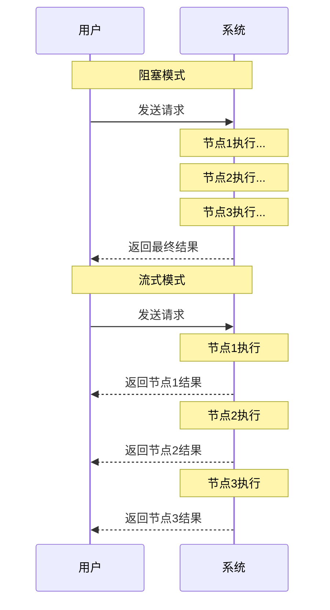

**LangGraph 流式API**

| API | 说明 | 适用场景 |
|-----|------|---------|
| **stream()** | 同步流式执行 | 同步程序 |
| **astream()** | 异步流式执行 | 异步程序 |
| **stream_mode** | 控制流式粒度 | 自定义输出格式 |

**流式输出模式**

| 模式 | 输出内容 | 适用场景 |
|------|---------|---------|
| **values** | 每个节点完成后的完整状态 | 查看状态变化 |
| **updates** | 每个节点返回的更新 | 最小化数据传输 |
| **debug** | 详细的执行信息 | 调试和监控 |

### 4.2 基本流式输出

**工作原理**

流式执行会在每个节点完成后产生一个事件，包含节点名称和输出结果。消费者可以实时处理这些事件。

**执行流程图**


**完整实现示例**

```python
from typing import TypedDict
from langgraph.graph import StateGraph, END

# 定义状态
class StreamState(TypedDict):
    messages: list[str]  # 消息列表
    current: str         # 当前消息

def generate_messages(state: StreamState) -> dict:
    """
    生成多条消息

    功能：模拟消息生成过程
    返回：包含5条消息的列表
    """
    messages = [f"Message {i}" for i in range(1, 6)]
    print(f"生成了 {len(messages)} 条消息")
    return {"messages": messages}

def create_stream_graph():
    """
    创建流式图

    架构：单节点图，用于演示流式输出
    """
    graph = StateGraph(StreamState)

    graph.add_node("generate", generate_messages)
    graph.set_entry_point("generate")
    graph.add_edge("generate", END)

    return graph.compile()

# 同步流式消费
def test_streaming():
    """
    测试流式输出

    特点：
    - 使用 stream() 方法获取迭代器
    - 每个节点完成后产生一个事件
    - 事件格式：{节点名: 节点输出}
    """
    app = create_stream_graph()

    print("=== 同步流式输出 ===")
    for chunk in app.stream({"messages": [], "current": ""}):
        # chunk 格式：{"节点名": {"字段": "值"}}
        print(f"收到事件: {chunk}")

        # 处理节点输出
        for node_name, node_output in chunk.items():
            print(f"  节点 '{node_name}' 完成")
            print(f"  输出: {node_output}")

# 异步流式消费
async def test_async_streaming():
    """
    测试异步流式输出

    优势：
    - 不阻塞主线程
    - 支持并发处理多个流
    - 更高的吞吐量
    """
    app = create_stream_graph()

    print("\n=== 异步流式输出 ===")
    async for chunk in app.astream({"messages": [], "current": ""}):
        print(f"异步收到: {chunk}")

        # 可以在这里进行异步处理
        for node_name, node_output in chunk.items():
            print(f"  异步处理节点 '{node_name}'")

# 测试不同的流式模式
def test_stream_modes():
    """
    测试不同的流式模式

    三种模式：
    1. values: 完整状态
    2. updates: 只包含更新
    3. debug: 调试信息
    """
    app = create_stream_graph()
    initial_state = {"messages": [], "current": ""}

    # 模式1: values (默认)
    print("\n=== 模式1: values (完整状态) ===")
    for chunk in app.stream(initial_state, stream_mode="values"):
        print(f"完整状态: {chunk}")

    # 模式2: updates (只有更新)
    print("\n=== 模式2: updates (只有更新) ===")
    for chunk in app.stream(initial_state, stream_mode="updates"):
        print(f"更新内容: {chunk}")

    # 模式3: debug (调试信息)
    print("\n=== 模式3: debug (调试信息) ===")
    for chunk in app.stream(initial_state, stream_mode="debug"):
        print(f"调试信息: {chunk}")

# 流式处理多节点图
def test_multi_node_streaming():
    """
    测试多节点图的流式输出

    场景：三个节点依次执行，流式返回每个节点的结果
    """
    class MultiNodeState(TypedDict):
        value: int
        stage: str

    def node1(state: MultiNodeState) -> dict:
        print("  [节点1] 执行中...")
        return {"value": state["value"] + 1, "stage": "node1"}

    def node2(state: MultiNodeState) -> dict:
        print("  [节点2] 执行中...")
        return {"value": state["value"] * 2, "stage": "node2"}

    def node3(state: MultiNodeState) -> dict:
        print("  [节点3] 执行中...")
        return {"value": state["value"] + 10, "stage": "node3"}

    # 构建图
    graph = StateGraph(MultiNodeState)
    graph.add_node("node1", node1)
    graph.add_node("node2", node2)
    graph.add_node("node3", node3)

    graph.set_entry_point("node1")
    graph.add_edge("node1", "node2")
    graph.add_edge("node2", "node3")
    graph.add_edge("node3", END)

    app = graph.compile()

    # 流式执行
    print("\n=== 多节点流式输出 ===")
    print("输入: value=5")

    for i, chunk in enumerate(app.stream({"value": 5, "stage": ""})):
        print(f"\n第 {i+1} 个事件:")
        for node_name, output in chunk.items():
            print(f"  节点: {node_name}")
            print(f"  当前值: {output.get('value')}")
            print(f"  阶段: {output.get('stage')}")

    print("\n最终结果: (5+1)*2+10 = 22")
```

**流式输出的关键点**

1. **事件格式**
```python
# stream() 返回的每个 chunk 格式：
{
    "节点名": {
        "字段1": "值1",
        "字段2": "值2"
    }
}
```

2. **执行顺序**
```python
# 节点按照图的拓扑顺序执行
# 每个节点完成后立即产生事件
# 不会等待整个图执行完毕
```

3. **性能对比**
```python
# 阻塞模式：
# 总感知时间 = 所有节点执行时间之和

# 流式模式：
# 首次响应时间 = 第一个节点执行时间
# 用户感知延迟 << 总执行时间
```

**适用场景**

✅ **适合流式的场景**：
- LLM 文本生成（逐字输出）
- 长时间数据处理（显示进度）
- 多步骤工作流（展示中间结果）
- 实时监控系统（即时反馈）

❌ **不适合流式的场景**：
- 需要原子性的操作（要么全成功要么全失败）
- 后续节点依赖全部前序结果
- 输出需要后处理的场景
- 对实时性没有要求的批处理

### 4.3 实时流式处理

**什么是实时流式处理？**

实时流式处理是指在节点内部也采用流式方式生成数据，常见于 LLM 文本生成场景。这种方式可以实现逐字或逐句的实时输出，极大提升用户体验。

**应用场景**

1. **LLM 对话**：GPT、Claude 等模型的逐字输出
2. **实时翻译**：边识别边翻译
3. **代码生成**：逐行生成代码
4. **数据流处理**：实时处理传感器数据

**两层流式结构**

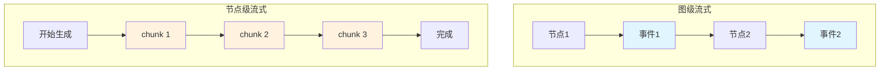

**完整实现示例**

```python
from typing import TypedDict, AsyncGenerator
import asyncio

# 定义状态
class RealtimeState(TypedDict):
    query: str          # 用户查询
    response: str       # 完整响应
    chunks: list[str]   # 响应片段

async def stream_llm_response(query: str) -> AsyncGenerator[str, None]:
    """
    模拟 LLM 流式响应

    功能：模拟 OpenAI/Claude 的流式 API
    特点：逐词生成，模拟网络延迟
    """
    response = f"Response to: {query}"
    words = response.split()

    print(f"开始流式生成 {len(words)} 个词...")

    for i, word in enumerate(words, 1):
        await asyncio.sleep(0.1)  # 模拟网络延迟
        print(f"  生成第 {i} 个词: '{word}'")
        yield word + " "

async def streaming_node(state: RealtimeState) -> dict:
    """
    流式处理节点

    功能：
    1. 调用流式 API
    2. 收集所有 chunks
    3. 返回完整响应

    注意：这里是在节点内部处理流式，
    图级仍然是节点完成后才产生事件
    """
    print(f"处理查询: {state['query']}")

    chunks = []
    async for chunk in stream_llm_response(state["query"]):
        chunks.append(chunk)
        # 在这里可以实时处理每个 chunk
        # 例如：发送到前端、保存到数据库等

    response = "".join(chunks)
    print(f"生成完毕，总长度: {len(response)} 字符")

    return {
        "response": response,
        "chunks": chunks
    }

def create_realtime_graph():
    """
    创建实时流式图

    架构：单节点，内部使用流式生成
    """
    graph = StateGraph(RealtimeState)
    graph.add_node("stream", streaming_node)
    graph.set_entry_point("stream")
    graph.add_edge("stream", END)

    return graph.compile()

# 测试实时流式
async def test_realtime_streaming():
    """
    测试实时流式处理

    特点：
    - 节点内部流式生成
    - 图级仍然是节点粒度的事件
    """
    app = create_realtime_graph()

    print("=== 实时流式处理 ===")

    async for event in app.astream({
        "query": "Hello world",
        "response": "",
        "chunks": []
    }):
        # 节点完成后收到事件
        for node_name, output in event.items():
            print(f"\n节点 '{node_name}' 完成")
            print(f"完整响应: {output['response']}")
            print(f"Chunks数量: {len(output['chunks'])}")

# 真正的逐chunk流式（需要自定义实现）
async def test_true_streaming():
    """
    实现真正的逐chunk流式输出

    方法：使用回调或队列在生成时立即发送
    """
    import asyncio

    # 创建队列用于传递 chunks
    chunk_queue = asyncio.Queue()

    async def producer(query: str):
        """生产者：生成 chunks"""
        response = f"Response to: {query}"
        words = response.split()

        for word in words:
            await asyncio.sleep(0.05)
            await chunk_queue.put(word + " ")

        # 发送结束信号
        await chunk_queue.put(None)

    async def consumer():
        """消费者：处理 chunks"""
        print("\n=== 逐chunk流式输出 ===")
        full_response = []

        while True:
            chunk = await chunk_queue.get()
            if chunk is None:
                break

            # 实时输出
            print(chunk, end='', flush=True)
            full_response.append(chunk)

        print(f"\n\n完整响应: {''.join(full_response)}")

    # 并发运行生产者和消费者
    await asyncio.gather(
        producer("Hello world"),
        consumer()
    )

# 运行测试
async def run_all_tests():
    """运行所有测试"""
    # 测试1：节点级流式
    await test_realtime_streaming()

    # 测试2：逐chunk流式
    await test_true_streaming()

# 如果直接运行此脚本
if __name__ == "__main__":
    asyncio.run(run_all_tests())
```

**实时流式的最佳实践**

1. **使用异步生成器**
```python
async def stream_data() -> AsyncGenerator[str, None]:
    for item in items:
        await asyncio.sleep(0)  # 让出控制权
        yield item
```

2. **错误处理**
```python
async def safe_stream():
    try:
        async for chunk in stream_data():
            yield chunk
    except Exception as e:
        yield f"Error: {str(e)}"
```

3. **超时控制**
```python
async def stream_with_timeout():
    try:
        async with asyncio.timeout(30):  # 30秒超时
            async for chunk in stream_data():
                yield chunk
    except asyncio.TimeoutError:
        yield "Timeout"
```

**性能对比**

| 模式 | 首字延迟 | 总时间 | 用户体验 |
|------|---------|--------|---------|
| **阻塞模式** | 等所有生成完 | 10s | 差 |
| **节点流式** | 等节点完成 | 10s | 中 |
| **实时流式** | 100ms | 10s | 优 |

**LLM集成示例**

```python
# 与 OpenAI 集成
async def stream_openai(query: str):
    """
    OpenAI 流式调用

    使用 stream=True 参数
    """
    from openai import AsyncOpenAI

    client = AsyncOpenAI()

    stream = await client.chat.completions.create(
        model="gpt-4",
        messages=[{"role": "user", "content": query}],
        stream=True  # 启用流式
    )

    async for chunk in stream:
        if chunk.choices[0].delta.content:
            yield chunk.choices[0].delta.content

# 与 Anthropic Claude 集成
async def stream_claude(query: str):
    """
    Claude 流式调用

    使用 stream 方法
    """
    from anthropic import AsyncAnthropic

    client = AsyncAnthropic()

    async with client.messages.stream(
        model="claude-3-5-sonnet-20241022",
        messages=[{"role": "user", "content": query}],
        max_tokens=1024
    ) as stream:
        async for text in stream.text_stream:
            yield text
```

**实际应用架构**

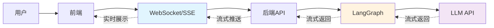

**关键技术点**

1. **缓冲策略**
```python
# 不要逐字节发送，适当缓冲
buffer = []
for chunk in chunks:
    buffer.append(chunk)
    if len(buffer) >= 10 or is_sentence_end(chunk):
        yield ''.join(buffer)
        buffer = []
```

2. **背压处理**
```python
# 如果消费者处理不过来，生产者要减速
if queue.qsize() > 100:
    await asyncio.sleep(0.1)
```

3. **优雅关闭**
```python
try:
    async for chunk in stream:
        yield chunk
finally:
    # 清理资源
    await stream.close()
```

## 五、动态图

### 5.1 动态图概述

**什么是动态图？**

动态图是指在**运行时根据参数或配置动态构建图结构**，而不是在代码中硬编码固定的图结构。这种灵活性使得同一套代码可以根据不同的输入创建不同的工作流。

**为什么需要动态图？**

1. **灵活性**：根据不同场景使用不同的处理流程
2. **可配置性**：通过配置文件控制工作流结构
3. **代码复用**：一套代码支持多种工作流
4. **动态扩展**：无需修改代码即可添加新功能
5. **A/B测试**：轻松切换不同的处理策略

**静态图 vs 动态图**

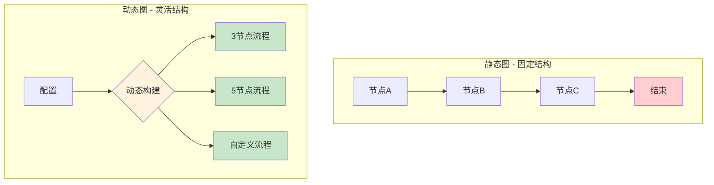

**动态图的应用场景**

| 场景 | 说明 | 示例 |
|------|------|------|
| **可配置工作流** | 用户自定义处理流程 | 数据处理管道 |
| **多租户系统** | 不同租户不同流程 | SaaS平台 |
| **A/B测试** | 实验不同的策略 | 推荐系统 |
| **插件架构** | 动态加载和组合插件 | 内容审核系统 |
| **条件流程** | 根据输入选择流程 | 业务审批流 |

### 5.2 运行时构建图

**工作原理**

在运行时根据参数（如节点数量、配置文件等）动态创建节点和边，最后编译成可执行的图。

**动态构建流程**


**完整实现示例**

```python
from typing import TypedDict, Literal
from langgraph.graph import StateGraph, END

# 定义状态
class DynamicState(TypedDict):
    config: dict    # 配置信息
    result: str     # 处理结果

def create_dynamic_graph(node_count: int):
    """
    根据参数动态创建图

    参数:
        node_count: 要创建的节点数量

    返回:
        编译后的图应用

    特点:
    - 节点数量在运行时决定
    - 节点自动串联成链
    - 每个节点执行简单的处理逻辑
    """
    def make_node(index: int):
        """
        节点工厂函数

        使用闭包捕获节点索引，创建独立的节点函数
        """
        def node(state: DynamicState) -> dict:
            """节点处理函数"""
            return {"result": f"Node {index} executed"}
        return node

    # 1. 创建图实例
    graph = StateGraph(DynamicState)

    # 2. 动态添加节点
    print(f"创建包含 {node_count} 个节点的图...")
    for i in range(node_count):
        node_name = f"node_{i}"
        graph.add_node(node_name, make_node(i))
        print(f"  添加节点: {node_name}")

    # 3. 动态添加边（串联所有节点）
    # 设置第一个节点为入口
    graph.set_entry_point("node_0")

    # 连接相邻节点
    for i in range(node_count - 1):
        from_node = f"node_{i}"
        to_node = f"node_{i+1}"
        graph.add_edge(from_node, to_node)
        print(f"  连接: {from_node} -> {to_node}")

    # 最后一个节点连接到结束
    graph.add_edge(f"node_{node_count-1}", END)

    # 4. 编译并返回
    return graph.compile()

# 测试动态图
def test_dynamic_graph():
    """
    测试动态图的创建和执行

    演示:
    1. 创建不同大小的图
    2. 执行并查看结果
    """
    print("=== 动态图测试 ===\n")

    # 测试1: 创建 3 节点的图
    print("测试1: 3节点图")
    app3 = create_dynamic_graph(3)
    result3 = app3.invoke({"config": {}, "result": ""})
    print(f"执行结果: {result3['result']}\n")

    # 测试2: 创建 5 节点的图
    print("测试2: 5节点图")
    app5 = create_dynamic_graph(5)
    result5 = app5.invoke({"config": {}, "result": ""})
    print(f"执行结果: {result5['result']}\n")

    # 测试3: 创建单节点图
    print("测试3: 单节点图")
    app1 = create_dynamic_graph(1)
    result1 = app1.invoke({"config": {}, "result": ""})
    print(f"执行结果: {result1['result']}\n")

    print("✅ 动态图测试通过")

# 高级示例：根据配置动态构建图
def create_configurable_graph(config: dict):
    """
    根据配置字典动态构建图

    配置格式:
    {
        "nodes": [
            {"name": "validate", "type": "validation"},
            {"name": "process", "type": "processing"},
            {"name": "save", "type": "storage"}
        ],
        "edges": [
            ["validate", "process"],
            ["process", "save"]
        ]
    }
    """
    class ConfigurableState(TypedDict):
        data: str
        status: str

    # 节点类型映射
    node_functions = {
        "validation": lambda state: {"status": "validated"},
        "processing": lambda state: {"status": "processed"},
        "storage": lambda state: {"status": "saved"}
    }

    graph = StateGraph(ConfigurableState)

    # 根据配置添加节点
    for node_config in config["nodes"]:
        node_name = node_config["name"]
        node_type = node_config["type"]

        if node_type in node_functions:
            graph.add_node(node_name, node_functions[node_type])

    # 根据配置添加边
    if config["nodes"]:
        graph.set_entry_point(config["nodes"][0]["name"])

    for from_node, to_node in config["edges"]:
        graph.add_edge(from_node, to_node)

    # 最后一个节点连接到END
    if config["nodes"]:
        last_node = config["nodes"][-1]["name"]
        graph.add_edge(last_node, END)

    return graph.compile()

# 测试可配置图
def test_configurable_graph():
    """测试基于配置的动态图"""
    config = {
        "nodes": [
            {"name": "validate", "type": "validation"},
            {"name": "process", "type": "processing"},
            {"name": "save", "type": "storage"}
        ],
        "edges": [
            ["validate", "process"],
            ["process", "save"]
        ]
    }

    print("\n=== 可配置图测试 ===")
    print(f"配置: {config}")

    app = create_configurable_graph(config)
    result = app.invoke({"data": "test data", "status": ""})

    print(f"最终状态: {result['status']}")
    print("✅ 可配置图测试通过")
```

**动态图的关键技术**

1. **节点工厂模式**
```python
# 使用闭包创建独立的节点函数
def make_node(index: int):
    def node(state):
        return {"value": index}
    return node
```

2. **循环构建**
```python
# 根据参数循环创建节点和边
for i in range(count):
    graph.add_node(f"node_{i}", make_node(i))
```

3. **配置驱动**
```python
# 从配置文件读取图结构
config = load_config("workflow.yaml")
graph = build_from_config(config)
```

**优势与限制**

| 方面 | 优势 | 限制 |
|------|------|------|
| **灵活性** | 运行时调整结构 | 调试相对困难 |
| **可维护性** | 集中管理配置 | 需要验证配置 |
| **扩展性** | 易于添加新节点 | 可能影响性能 |
| **复用性** | 一套代码多种流程 | 复杂度增加 |

### 5.3 条件图构建

**什么是条件图构建？**

条件图构建是根据运行时的条件（如模式、用户类型、环境等）选择不同的图结构。这是动态图的一种特殊形式，强调基于条件的分支选择。

**应用场景**

1. **多模式处理**：新手模式 vs 专家模式
2. **环境切换**：开发环境 vs 生产环境
3. **用户分层**：普通用户 vs VIP用户
4. **功能开关**：A/B测试、灰度发布

**条件分支示意图**

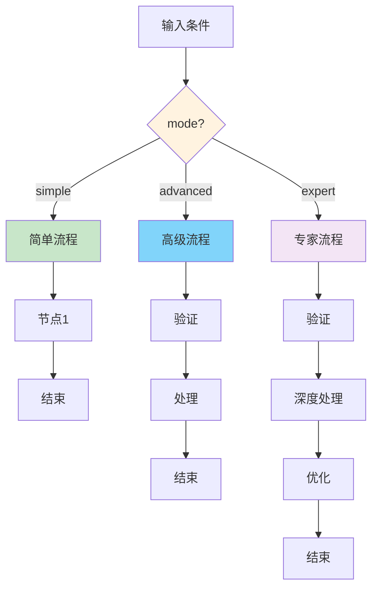

**完整实现示例**

```python
from typing import TypedDict, Literal
from langgraph.graph import StateGraph, END

# 定义状态
class ConditionalGraphState(TypedDict):
    mode: Literal["simple", "advanced"]  # 模式选择
    result: str                           # 处理结果

def create_conditional_graph(mode: str):
    """
    根据模式创建不同的图

    参数:
        mode: "simple" 或 "advanced"

    返回:
        编译后的图应用

    特点:
    - 简单模式：单节点快速处理
    - 高级模式：多节点完整流程
    """
    # 定义节点函数
    def simple_process(state: ConditionalGraphState) -> dict:
        """简单处理：单步完成"""
        return {"result": "Simple processing"}

    def advanced_process(state: ConditionalGraphState) -> dict:
        """高级处理：复杂逻辑"""
        return {"result": "Advanced processing"}

    def validation(state: ConditionalGraphState) -> dict:
        """验证节点：高级模式专属"""
        return {"result": "Validated"}

    # 创建图
    graph = StateGraph(ConditionalGraphState)

    if mode == "simple":
        # 简单模式：只有处理节点
        print("构建简单模式图...")
        graph.add_node("process", simple_process)
        graph.set_entry_point("process")
        graph.add_edge("process", END)

    else:
        # 高级模式：包含验证和处理
        print("构建高级模式图...")
        graph.add_node("validate", validation)
        graph.add_node("process", advanced_process)
        graph.set_entry_point("validate")
        graph.add_edge("validate", "process")
        graph.add_edge("process", END)

    return graph.compile()

# 测试条件图
def test_conditional_graph():
    """
    测试条件图构建

    演示不同模式下的不同执行流程
    """
    print("=== 条件图测试 ===\n")

    # 测试1: 简单模式
    print("测试1: 简单模式")
    simple_app = create_conditional_graph("simple")
    simple_result = simple_app.invoke({"mode": "simple", "result": ""})
    print(f"结果: {simple_result['result']}\n")

    # 测试2: 高级模式
    print("测试2: 高级模式")
    advanced_app = create_conditional_graph("advanced")
    advanced_result = advanced_app.invoke({"mode": "advanced", "result": ""})
    print(f"结果: {advanced_result['result']}\n")

    print("✅ 条件图测试通过")

# 更复杂的条件图示例
def create_multi_condition_graph(config: dict):
    """
    根据多个条件创建图

    配置:
    {
        "user_type": "vip" | "normal",
        "enable_cache": true | false,
        "enable_logging": true | false
    }
    """
    class MultiCondState(TypedDict):
        data: str
        result: str

    graph = StateGraph(MultiCondState)

    # 必须的节点
    graph.add_node("process", lambda s: {"result": "processed"})

    # 条件1：根据用户类型添加不同的预处理
    if config.get("user_type") == "vip":
        graph.add_node("vip_preprocess", lambda s: {"data": "VIP: " + s["data"]})
        graph.set_entry_point("vip_preprocess")
        graph.add_edge("vip_preprocess", "process")
    else:
        graph.set_entry_point("process")

    # 条件2：是否启用缓存
    if config.get("enable_cache"):
        graph.add_node("cache", lambda s: {"result": "cached: " + s["result"]})
        graph.add_edge("process", "cache")
        last_node = "cache"
    else:
        last_node = "process"

    # 条件3：是否启用日志
    if config.get("enable_logging"):
        graph.add_node("log", lambda s: {"result": "logged: " + s["result"]})
        graph.add_edge(last_node, "log")
        last_node = "log"

    graph.add_edge(last_node, END)

    return graph.compile()

# 测试多条件图
def test_multi_condition_graph():
    """测试多条件图"""
    print("\n=== 多条件图测试 ===")

    # 配置1：VIP用户 + 缓存 + 日志
    config1 = {
        "user_type": "vip",
        "enable_cache": True,
        "enable_logging": True
    }
    print(f"\n配置1: {config1}")
    app1 = create_multi_condition_graph(config1)
    result1 = app1.invoke({"data": "test", "result": ""})
    print(f"结果: {result1['result']}")

    # 配置2：普通用户 + 无缓存 + 无日志
    config2 = {
        "user_type": "normal",
        "enable_cache": False,
        "enable_logging": False
    }
    print(f"\n配置2: {config2}")
    app2 = create_multi_condition_graph(config2)
    result2 = app2.invoke({"data": "test", "result": ""})
    print(f"结果: {result2['result']}")

    print("\n✅ 多条件图测试通过")
```

**条件图的最佳实践**

1. **清晰的条件逻辑**
```python
# ✅ 好的做法：条件明确
if mode == "simple":
    add_simple_nodes()
elif mode == "advanced":
    add_advanced_nodes()
else:
    raise ValueError(f"Unknown mode: {mode}")
```

2. **配置验证**
```python
# 在构建前验证配置
def validate_config(config: dict):
    required_keys = ["mode", "user_type"]
    for key in required_keys:
        if key not in config:
            raise ValueError(f"Missing key: {key}")
```

3. **文档化不同模式**
```python
# 清晰记录每种模式的行为
MODES = {
    "simple": "单节点快速处理",
    "advanced": "多节点完整流程",
    "expert": "包含优化和验证"
}
```

### 5.4 插件系统

**什么是插件系统？**

插件系统是一种架构模式,允许在运行时动态注册、加载和组合功能模块。在 LangGraph 中,通过动态图构建能力,可以实现灵活的插件架构,让用户自定义工作流。

**为什么需要插件系统？**

1. **扩展性**：用户可以添加自定义功能而不修改核心代码
2. **灵活性**：根据需求选择性启用或禁用插件
3. **可组合性**：多个插件可以任意组合形成新的功能
4. **易维护**：插件独立开发、测试和部署
5. **多租户**：不同用户可以配置不同的插件组合

**插件系统架构**

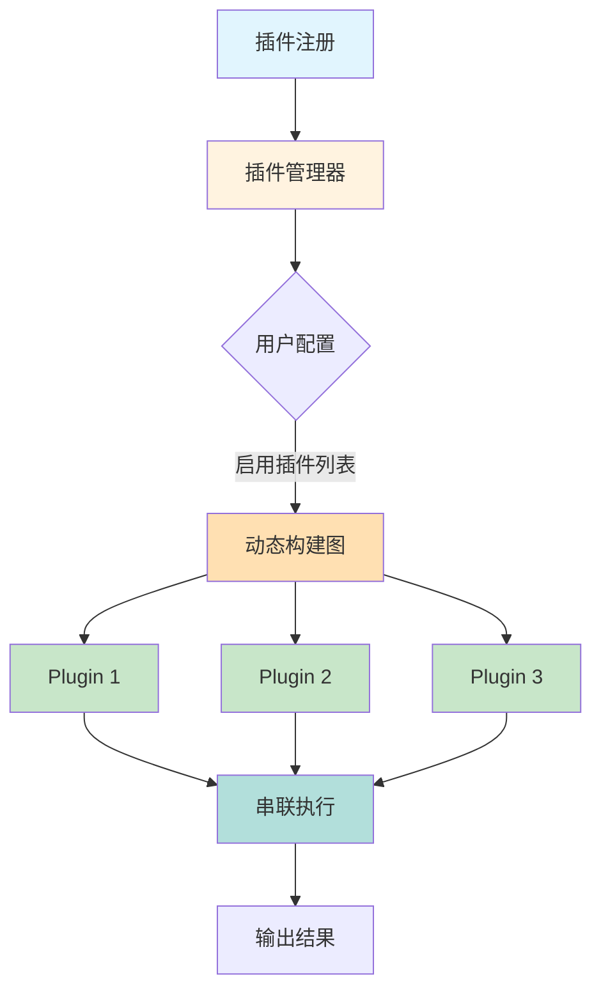

**插件系统的应用场景**

| 场景 | 说明 | 示例 |
|------|------|------|
| **内容处理** | 文本/图像/视频处理管道 | 内容审核系统 |
| **数据处理** | ETL 数据转换流程 | 数据清洗工具 |
| **微服务编排** | 动态组合服务调用 | API 网关 |
| **自动化工作流** | 用户自定义任务流 | CI/CD 系统 |
| **消息处理** | 消息过滤和转换 | 消息队列处理器 |

**完整实现示例**

```python
from typing import TypedDict, Callable, Dict
from langgraph.graph import StateGraph, END

# 定义插件状态
class PluginState(TypedDict):
    input: str      # 原始输入
    output: str     # 处理后的输出

class PluginSystem:
    """
    插件系统管理器

    功能:
    1. 注册插件（register）
    2. 根据配置动态构建图（create_graph）
    3. 支持插件链式组合
    """

    def __init__(self):
        """
        初始化插件系统

        维护一个插件字典: name -> function
        """
        self.plugins: Dict[str, Callable] = {}

    def register(self, name: str, plugin: Callable):
        """
        注册插件

        参数:
            name: 插件名称（唯一标识）
            plugin: 插件函数（接受 state 返回 dict）

        示例:
            system.register("uppercase", uppercase_plugin)
        """
        self.plugins[name] = plugin
        print(f"✅ 插件已注册: {name}")

    def create_graph(self, enabled_plugins: list[str]):
        """
        根据启用的插件列表动态创建图

        参数:
            enabled_plugins: 要启用的插件名称列表

        返回:
            编译后的图应用

        工作流程:
        1. 创建空图
        2. 遍历启用的插件列表
        3. 为每个插件创建节点
        4. 串联所有插件节点
        5. 编译并返回
        """
        graph = StateGraph(PluginState)

        # 跟踪上一个节点，用于串联
        previous_node = None

        for i, plugin_name in enumerate(enabled_plugins):
            # 检查插件是否已注册
            if plugin_name in self.plugins:
                # 创建唯一的节点名称
                node_name = f"plugin_{i}_{plugin_name}"

                # 添加插件节点
                graph.add_node(node_name, self.plugins[plugin_name])
                print(f"  添加节点: {node_name}")

                # 设置入口点或连接到上一个节点
                if previous_node is None:
                    graph.set_entry_point(node_name)
                    print(f"  设置入口点: {node_name}")
                else:
                    graph.add_edge(previous_node, node_name)
                    print(f"  连接: {previous_node} -> {node_name}")

                previous_node = node_name
            else:
                print(f"⚠️  警告: 插件 '{plugin_name}' 未注册，跳过")

        # 连接最后一个节点到结束
        if previous_node:
            graph.add_edge(previous_node, END)

        return graph.compile()

# 定义各种插件
def uppercase_plugin(state: PluginState) -> dict:
    """
    大写插件

    功能: 将输入文本转换为大写
    输入: state["input"]
    输出: state["output"] = input.upper()
    """
    result = state["input"].upper()
    print(f"  [大写插件] {state['input']} -> {result}")
    return {"output": result}

def reverse_plugin(state: PluginState) -> dict:
    """
    反转插件

    功能: 反转文本
    输入: state["output"] 或 state["input"]
    输出: state["output"] = text[::-1]

    注意: 优先使用 output 字段（支持插件链）
    """
    text = state.get("output") or state["input"]
    result = text[::-1]
    print(f"  [反转插件] {text} -> {result}")
    return {"output": result}

def exclamation_plugin(state: PluginState) -> dict:
    """
    感叹号插件

    功能: 在文本末尾添加感叹号
    输入: state["output"] 或 state["input"]
    输出: state["output"] = text + "!!!"
    """
    text = state.get("output") or state["input"]
    result = text + "!!!"
    print(f"  [感叹号插件] {text} -> {result}")
    return {"output": result}

def prefix_plugin(state: PluginState) -> dict:
    """
    前缀插件

    功能: 在文本前添加前缀
    """
    text = state.get("output") or state["input"]
    result = "[处理完成] " + text
    print(f"  [前缀插件] {text} -> {result}")
    return {"output": result}

def length_plugin(state: PluginState) -> dict:
    """
    长度统计插件

    功能: 在文本后添加长度信息
    """
    text = state.get("output") or state["input"]
    result = f"{text} (长度: {len(text)})"
    print(f"  [长度插件] {text} -> {result}")
    return {"output": result}

# 测试插件系统
def test_plugin_system():
    """
    测试插件系统

    演示:
    1. 注册多个插件
    2. 创建不同的插件组合
    3. 测试插件链式执行
    """
    print("=== 插件系统测试 ===\n")

    system = PluginSystem()

    # 1. 注册插件
    print("1. 注册插件:")
    system.register("uppercase", uppercase_plugin)
    system.register("reverse", reverse_plugin)
    system.register("exclamation", exclamation_plugin)
    system.register("prefix", prefix_plugin)
    system.register("length", length_plugin)

    # 2. 场景1：只使用大写插件
    print("\n2. 场景1: 单个插件")
    print("启用插件: ['uppercase']")
    app1 = system.create_graph(["uppercase"])
    result1 = app1.invoke({"input": "hello", "output": ""})
    print(f"✅ 结果: {result1['output']}\n")  # HELLO

    # 3. 场景2：组合多个插件
    print("3. 场景2: 插件链")
    print("启用插件: ['uppercase', 'reverse', 'exclamation']")
    app2 = system.create_graph(["uppercase", "reverse", "exclamation"])
    result2 = app2.invoke({"input": "hello", "output": ""})
    print(f"✅ 结果: {result2['output']}\n")  # OLLEH!!!

    # 4. 场景3：完整处理流程
    print("4. 场景3: 完整流程")
    print("启用插件: ['uppercase', 'exclamation', 'prefix', 'length']")
    app3 = system.create_graph([
        "uppercase",
        "exclamation",
        "prefix",
        "length"
    ])
    result3 = app3.invoke({"input": "world", "output": ""})
    print(f"✅ 结果: {result3['output']}\n")  # [处理完成] WORLD!!! (长度: 17)

    # 5. 场景4：测试未注册插件
    print("5. 场景4: 处理未注册插件")
    print("启用插件: ['uppercase', 'unknown', 'reverse']")
    app4 = system.create_graph(["uppercase", "unknown", "reverse"])
    result4 = app4.invoke({"input": "test", "output": ""})
    print(f"✅ 结果: {result4['output']}\n")  # TSET (跳过 unknown)

    print("✅ 插件系统测试通过")
```

**高级插件系统示例**

```python
from typing import TypedDict, Callable, Dict, Any
from langgraph.graph import StateGraph, END

# 增强的插件状态
class AdvancedPluginState(TypedDict):
    input: str
    output: str
    metadata: dict  # 插件元数据
    errors: list    # 错误记录

class AdvancedPluginSystem:
    """
    高级插件系统

    新特性:
    1. 插件元数据（版本、作者、描述）
    2. 插件依赖检查
    3. 错误处理
    4. 插件优先级排序
    """

    def __init__(self):
        self.plugins: Dict[str, Dict[str, Any]] = {}

    def register(
        self,
        name: str,
        plugin: Callable,
        version: str = "1.0.0",
        dependencies: list[str] = None,
        priority: int = 0
    ):
        """
        注册插件（带元数据）

        参数:
            name: 插件名称
            plugin: 插件函数
            version: 插件版本
            dependencies: 依赖的其他插件
            priority: 优先级（数字越大越优先）
        """
        self.plugins[name] = {
            "function": plugin,
            "version": version,
            "dependencies": dependencies or [],
            "priority": priority
        }
        print(f"✅ 注册插件: {name} v{version} (优先级: {priority})")

    def _check_dependencies(self, enabled_plugins: list[str]) -> list[str]:
        """
        检查并解析插件依赖

        返回: 按依赖顺序排列的插件列表
        """
        resolved = []
        visited = set()

        def resolve(plugin_name: str):
            if plugin_name in visited:
                return
            if plugin_name not in self.plugins:
                raise ValueError(f"插件 '{plugin_name}' 未注册")

            visited.add(plugin_name)

            # 先解析依赖
            deps = self.plugins[plugin_name]["dependencies"]
            for dep in deps:
                if dep not in enabled_plugins:
                    raise ValueError(
                        f"插件 '{plugin_name}' 依赖 '{dep}'，"
                        f"但 '{dep}' 未启用"
                    )
                resolve(dep)

            resolved.append(plugin_name)

        for plugin in enabled_plugins:
            resolve(plugin)

        return resolved

    def create_graph(self, enabled_plugins: list[str]):
        """
        创建插件图（带依赖检查）
        """
        # 1. 检查依赖
        try:
            ordered_plugins = self._check_dependencies(enabled_plugins)
            print(f"插件执行顺序: {ordered_plugins}")
        except ValueError as e:
            print(f"❌ 依赖检查失败: {e}")
            return None

        # 2. 按优先级排序
        ordered_plugins.sort(
            key=lambda name: self.plugins[name]["priority"],
            reverse=True
        )

        # 3. 构建图
        graph = StateGraph(AdvancedPluginState)
        previous_node = None

        for i, plugin_name in enumerate(ordered_plugins):
            node_name = f"plugin_{i}_{plugin_name}"
            plugin_func = self.plugins[plugin_name]["function"]

            # 包装插件函数以支持错误处理
            def make_safe_plugin(func, name):
                def safe_wrapper(state: AdvancedPluginState) -> dict:
                    try:
                        result = func(state)
                        return {
                            **result,
                            "metadata": {
                                **state.get("metadata", {}),
                                f"{name}_executed": True
                            }
                        }
                    except Exception as e:
                        print(f"❌ 插件 '{name}' 执行失败: {e}")
                        errors = state.get("errors", [])
                        errors.append(f"{name}: {str(e)}")
                        return {"errors": errors}
                return safe_wrapper

            graph.add_node(
                node_name,
                make_safe_plugin(plugin_func, plugin_name)
            )

            if previous_node is None:
                graph.set_entry_point(node_name)
            else:
                graph.add_edge(previous_node, node_name)

            previous_node = node_name

        if previous_node:
            graph.add_edge(previous_node, END)

        return graph.compile()

# 测试高级插件系统
def test_advanced_plugin_system():
    """测试高级插件系统"""
    print("\n=== 高级插件系统测试 ===\n")

    system = AdvancedPluginSystem()

    # 注册插件（带依赖）
    system.register(
        "base_transform",
        uppercase_plugin,
        version="1.0.0",
        priority=10
    )

    system.register(
        "enhance",
        exclamation_plugin,
        version="1.0.0",
        dependencies=["base_transform"],  # 依赖 base_transform
        priority=5
    )

    # 测试正确的依赖顺序
    print("测试1: 正确的依赖")
    app = system.create_graph(["enhance", "base_transform"])
    if app:
        result = app.invoke({
            "input": "test",
            "output": "",
            "metadata": {},
            "errors": []
        })
        print(f"✅ 结果: {result['output']}")
        print(f"元数据: {result['metadata']}\n")

    # 测试缺少依赖
    print("测试2: 缺少依赖")
    app2 = system.create_graph(["enhance"])  # 缺少 base_transform

    print("\n✅ 高级插件系统测试完成")
```

**插件系统的最佳实践**

1. **清晰的插件接口**
```python
# 定义标准的插件接口
from typing import Protocol

class Plugin(Protocol):
    """插件协议"""

    def execute(self, state: PluginState) -> dict:
        """执行插件逻辑"""
        ...

    @property
    def name(self) -> str:
        """插件名称"""
        ...

    @property
    def version(self) -> str:
        """插件版本"""
        ...
```

2. **插件隔离**
```python
# 每个插件有独立的命名空间
def create_isolated_plugin(plugin_func):
    """创建隔离的插件执行环境"""
    def wrapper(state):
        # 复制状态避免污染
        local_state = state.copy()
        return plugin_func(local_state)
    return wrapper
```

3. **插件配置**
```python
# 支持插件参数配置
class ConfigurablePlugin:
    def __init__(self, config: dict):
        self.config = config

    def __call__(self, state: PluginState) -> dict:
        # 使用配置执行插件逻辑
        threshold = self.config.get("threshold", 10)
        # ...
```

4. **插件版本管理**
```python
# 检查版本兼容性
def check_version_compatibility(
    plugin_version: str,
    required_version: str
) -> bool:
    """检查版本兼容性"""
    # 实现语义化版本检查
    return compare_versions(plugin_version, required_version)
```

**插件系统的实际应用**

1. **内容审核系统**
```python
plugins = [
    "text_filter",      # 敏感词过滤
    "spam_detector",    # 垃圾检测
    "sentiment_check",  # 情感分析
    "compliance_verify" # 合规检查
]
```

2. **数据ETL流程**
```python
plugins = [
    "extract_csv",      # 提取CSV数据
    "validate_schema",  # 验证数据模式
    "transform_json",   # 转换为JSON
    "load_database"     # 加载到数据库
]
```

3. **CI/CD工作流**
```python
plugins = [
    "checkout_code",    # 检出代码
    "run_tests",        # 运行测试
    "build_docker",     # 构建镜像
    "deploy_k8s"        # 部署到K8s
]
```

## 六、中断与恢复

**什么是中断与恢复？**

中断与恢复是 LangGraph 的核心特性之一,允许图的执行在特定节点暂停,等待外部输入(如人工审核、用户确认)后继续执行。这个特性通过 **Checkpointer** 机制实现,它会保存图的执行状态,使得工作流可以在中断后从断点处恢复。

**为什么需要中断与恢复？**

1. **人工介入**：关键决策需要人工审核和批准
2. **异步处理**：长时间运行的任务可以暂停和恢复
3. **调试支持**：在节点间暂停,检查状态
4. **容错机制**：系统崩溃后可以从检查点恢复
5. **用户交互**：等待用户输入或确认

**中断与恢复的核心机制**

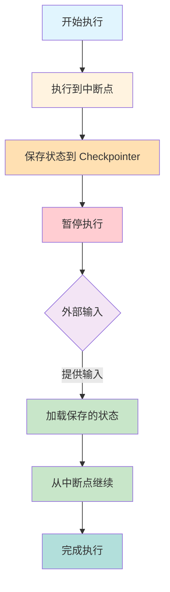

**中断与恢复的关键概念**

| 概念 | 说明 | 作用 |
|------|------|------|
| **Checkpointer** | 状态持久化组件 | 保存和加载图的执行状态 |
| **interrupt_before** | 中断前置点 | 在指定节点执行前暂停 |
| **interrupt_after** | 中断后置点 | 在指定节点执行后暂停 |
| **thread_id** | 会话标识符 | 区分不同的执行会话 |
| **MemorySaver** | 内存检查点保存器 | 将状态保存在内存中 |

### 6.1 人工审核中断

**应用场景**

人工审核中断常用于需要人工决策的工作流,如:
- 内容审核系统
- 审批流程
- 质量检查
- 敏感操作确认

**工作原理**

1. 图执行到中断点(如审核节点)前自动暂停
2. 保存当前状态到 Checkpointer
3. 返回控制权给调用者
4. 人工完成审核,提供决策
5. 使用相同 thread_id 恢复执行
6. 根据审核结果路由到不同分支

**执行流程图**

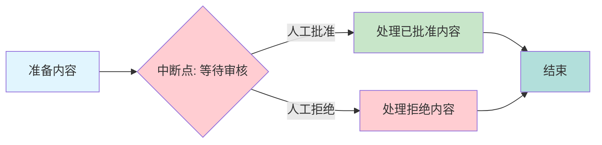

**完整实现示例**

```python
from langgraph.graph import StateGraph, END
from langgraph.checkpoint.memory import MemorySaver
from typing import TypedDict

# 定义审核状态
class ApprovalState(TypedDict):
    content: str            # 待审核内容
    approved: bool          # 是否批准
    reviewer_comment: str   # 审核意见

def create_approval_workflow():
    """
    创建需要人工审核的工作流

    特点:
    1. 在审核节点前设置中断点
    2. 使用 Checkpointer 保存状态
    3. 支持批准/拒绝两种路由
    """
    def prepare(state: ApprovalState) -> dict:
        """
        准备节点

        功能: 预处理待审核内容
        """
        prepared_content = f"Prepared: {state['content']}"
        print(f"[准备] {state['content']} -> {prepared_content}")
        return {"content": prepared_content}

    def wait_for_approval(state: ApprovalState) -> dict:
        """
        等待审核的节点

        重要: 这里会中断，等待人工输入
        节点本身不做处理，只是一个占位符
        """
        print("[审核] 等待人工审核...")
        return {}

    def process_approved(state: ApprovalState) -> dict:
        """
        处理已批准内容

        功能: 批准后的处理逻辑
        """
        result = f"Approved and processed: {state['content']}"
        print(f"[批准处理] {result}")
        return {"content": result}

    def handle_rejection(state: ApprovalState) -> dict:
        """
        处理拒绝内容

        功能: 拒绝后的处理逻辑
        """
        result = f"Rejected: {state['reviewer_comment']}"
        print(f"[拒绝处理] {result}")
        return {"content": result}

    def route_approval(state: ApprovalState) -> str:
        """
        审核路由函数

        根据 approved 字段决定流向:
        - True: 走批准流程
        - False: 走拒绝流程
        """
        if state.get("approved"):
            print("[路由] 流向: 批准")
            return "approved"
        print("[路由] 流向: 拒绝")
        return "rejected"

    # 构建图
    graph = StateGraph(ApprovalState)

    # 添加节点
    graph.add_node("prepare", prepare)
    graph.add_node("approval", wait_for_approval)
    graph.add_node("process", process_approved)
    graph.add_node("reject", handle_rejection)

    # 设置流程
    graph.set_entry_point("prepare")
    graph.add_edge("prepare", "approval")

    # 条件路由：根据审核结果分支
    graph.add_conditional_edges(
        "approval",
        route_approval,
        {
            "approved": "process",
            "rejected": "reject"
        }
    )

    graph.add_edge("process", END)
    graph.add_edge("reject", END)

    # 关键：使用 checkpointer 并设置中断点
    checkpointer = MemorySaver()
    return graph.compile(
        checkpointer=checkpointer,
        interrupt_before=["approval"]  # 在 approval 节点前中断
    )

# 测试中断与恢复
def test_interrupt_and_resume():
    """
    测试中断与恢复

    演示完整的人工审核流程:
    1. 执行到中断点
    2. 人工审核
    3. 恢复执行
    """
    print("=== 人工审核中断测试 ===\n")

    app = create_approval_workflow()

    # 重要：使用 thread_id 标识会话
    config = {"configurable": {"thread_id": "approval-1"}}

    # 第一次执行 - 会在 approval 节点前中断
    print("步骤1: 第一次执行（到达中断点）")
    print("-" * 50)
    result1 = app.invoke({
        "content": "Document to review",
        "approved": False,
        "reviewer_comment": ""
    }, config=config)

    print(f"\n中断时的状态: {result1}")
    print(f"说明: 执行已在 approval 节点前暂停\n")

    # 模拟人工审核 - 批准
    print("\n步骤2: 人工审核（批准）")
    print("-" * 50)
    print("审核人员决定: 批准")

    # 使用相同的 thread_id 恢复执行
    result2 = app.invoke({
        **result1,
        "approved": True  # 设置批准标志
    }, config=config)

    print(f"\n最终结果: {result2['content']}")

    # 测试拒绝场景
    print("\n\n步骤3: 测试拒绝场景")
    print("-" * 50)

    # 使用新的 thread_id
    config2 = {"configurable": {"thread_id": "approval-2"}}

    # 第一次执行
    result3 = app.invoke({
        "content": "Another document",
        "approved": False,
        "reviewer_comment": ""
    }, config=config2)

    # 人工审核 - 拒绝
    print("审核人员决定: 拒绝")
    result4 = app.invoke({
        **result3,
        "approved": False,
        "reviewer_comment": "内容不符合规范"
    }, config=config2)

    print(f"\n拒绝结果: {result4['content']}")

    print("\n✅ 人工审核中断测试完成")
```

**关键技术点**

1. **Checkpointer 配置**
```python
# MemorySaver: 内存存储（仅用于开发/测试）
checkpointer = MemorySaver()

# 生产环境可使用持久化存储
# from langgraph.checkpoint.sqlite import SqliteSaver
# checkpointer = SqliteSaver.from_conn_string("checkpoints.db")
```

2. **中断点设置**
```python
# 在节点前中断
graph.compile(
    checkpointer=checkpointer,
    interrupt_before=["approval"]
)

# 在节点后中断
graph.compile(
    checkpointer=checkpointer,
    interrupt_after=["prepare"]
)

# 多个中断点
graph.compile(
    checkpointer=checkpointer,
    interrupt_before=["step1", "step3", "step5"]
)
```

3. **会话管理**
```python
# 使用 thread_id 区分不同会话
config = {"configurable": {"thread_id": "unique-session-id"}}

# 同一 thread_id 可以恢复执行
result1 = app.invoke(initial_state, config=config)  # 第一次
result2 = app.invoke(updated_state, config=config)  # 恢复执行
```

**最佳实践**

1. **清晰的中断点设计**
```python
# ✅ 好的做法：在需要人工介入的节点前中断
interrupt_before=["human_review", "final_approval"]

# ❌ 避免：在自动化节点设置中断
interrupt_before=["calculate", "transform"]  # 不需要人工介入
```

2. **状态验证**
```python
# 恢复执行前验证状态
def validate_resume_state(state: dict) -> bool:
    """验证恢复状态是否有效"""
    required_fields = ["approved", "reviewer_comment"]
    return all(field in state for field in required_fields)
```

3. **超时处理**
```python
from datetime import datetime, timedelta

def check_approval_timeout(state: dict) -> bool:
    """检查审核是否超时"""
    created_at = state.get("created_at")
    if created_at:
        timeout = datetime.now() - timedelta(hours=24)
        return created_at < timeout
    return False
```

### 6.2 断点调试

**什么是断点调试？**

断点调试允许开发者在图的执行过程中逐步前进,在每个节点前暂停,检查状态,帮助理解数据流和定位问题。这类似于传统代码调试器的单步执行功能。

**应用场景**

- 开发阶段调试复杂工作流
- 排查数据转换问题
- 验证节点间的状态传递
- 理解图的执行顺序
- 性能分析和优化

**工作原理**

通过在所有节点(或关键节点)前设置中断点,每次执行只前进一个节点,开发者可以检查每一步的状态变化。

**逐步调试流程**

```mermaid
graph TB
    A[初始状态] --> B{中断: Step 1}
    B -->|继续| C[执行 Step 1]
    C --> D{中断: Step 2}
    D -->|继续| E[执行 Step 2]
    E --> F{中断: Step 3}
    F -->|继续| G[执行 Step 3]
    G --> H[完成]

    style A fill:#e1f5fe
    style B fill:#ffcdd2
    style C fill:#c8e6c9
    style D fill:#ffcdd2
    style E fill:#c8e6c9
    style F fill:#ffcdd2
    style G fill:#c8e6c9
    style H fill:#b2dfdb
```

**完整实现示例**

```python
from typing import TypedDict
from langgraph.graph import StateGraph, END
from langgraph.checkpoint.memory import MemorySaver

# 定义调试状态
class DebugState(TypedDict):
    step: int               # 当前步骤编号
    data: str              # 数据内容
    debug_info: list[str]  # 调试信息列表

def create_debug_workflow():
    """
    创建可调试的工作流

    特点:
    1. 在每个节点前设置断点
    2. 收集每一步的调试信息
    3. 支持逐步执行
    """
    def step1(state: DebugState) -> dict:
        """
        步骤1: 初始化处理

        调试信息: 记录执行时的 step 值
        """
        print(f"[Step 1] 执行中... (当前 step={state['step']})")
        return {
            "step": 1,
            "data": "Step 1 complete",
            "debug_info": [f"Step 1 executed at step {state['step']}"]
        }

    def step2(state: DebugState) -> dict:
        """
        步骤2: 数据转换

        调试信息: 记录执行时的 step 值和数据
        """
        print(f"[Step 2] 执行中... (当前 step={state['step']}, data={state['data']})")
        return {
            "step": 2,
            "data": "Step 2 complete",
            "debug_info": [f"Step 2 executed at step {state['step']}"]
        }

    def step3(state: DebugState) -> dict:
        """
        步骤3: 最终处理

        调试信息: 记录执行时的 step 值
        """
        print(f"[Step 3] 执行中... (当前 step={state['step']})")
        return {
            "step": 3,
            "data": "Step 3 complete",
            "debug_info": [f"Step 3 executed at step {state['step']}"]
        }

    # 构建图
    graph = StateGraph(DebugState)

    graph.add_node("step1", step1)
    graph.add_node("step2", step2)
    graph.add_node("step3", step3)

    graph.set_entry_point("step1")
    graph.add_edge("step1", "step2")
    graph.add_edge("step2", "step3")
    graph.add_edge("step3", END)

    checkpointer = MemorySaver()

    # 关键：在每个节点前设置断点，实现逐步调试
    return graph.compile(
        checkpointer=checkpointer,
        interrupt_before=["step1", "step2", "step3"]
    )

# 测试逐步调试
def test_step_debugging():
    """
    测试逐步调试

    演示:
    1. 逐节点执行
    2. 检查每一步的状态
    3. 观察状态变化
    """
    print("=== 逐步调试测试 ===\n")

    app = create_debug_workflow()
    config = {"configurable": {"thread_id": "debug-1"}}

    initial_state = {"step": 0, "data": "", "debug_info": []}

    # 第一次调用：执行到 step1 前（中断）
    print("步骤 1: 执行到 step1 断点")
    print("-" * 50)
    state1 = app.invoke(initial_state, config=config)
    print(f"状态: step={state1['step']}, data='{state1['data']}'")
    print(f"说明: 在 step1 前中断，step1 尚未执行\n")

    # 第二次调用：执行 step1，到 step2 前（中断）
    print("步骤 2: 继续执行，到达 step2 断点")
    print("-" * 50)
    state2 = app.invoke(None, config=config)  # None 表示继续执行
    print(f"状态: step={state2['step']}, data='{state2['data']}'")
    print(f"调试信息: {state2['debug_info']}")
    print(f"说明: step1 已执行，在 step2 前中断\n")

    # 第三次调用：执行 step2，到 step3 前（中断）
    print("步骤 3: 继续执行，到达 step3 断点")
    print("-" * 50)
    state3 = app.invoke(None, config=config)
    print(f"状态: step={state3['step']}, data='{state3['data']}'")
    print(f"调试信息: {state3['debug_info']}")
    print(f"说明: step2 已执行，在 step3 前中断\n")

    # 第四次调用：执行 step3，完成
    print("步骤 4: 继续执行，完成所有步骤")
    print("-" * 50)
    final_state = app.invoke(None, config=config)
    print(f"最终状态: step={final_state['step']}, data='{final_state['data']}'")
    print(f"调试信息: {final_state['debug_info']}")
    print(f"说明: step3 已执行，图执行完成\n")

    print("✅ 逐步调试测试完成")

# 高级调试：带状态检查的调试器
def create_advanced_debugger():
    """
    高级调试器

    新特性:
    1. 状态验证
    2. 条件断点
    3. 状态快照
    """
    class AdvancedDebugState(TypedDict):
        value: int
        operations: list[str]
        snapshots: list[dict]

    def validate_state(state: AdvancedDebugState) -> bool:
        """验证状态是否有效"""
        if state["value"] < 0:
            print(f"⚠️  警告: value={state['value']} 为负数")
            return False
        return True

    def add_ten(state: AdvancedDebugState) -> dict:
        """加10操作"""
        new_value = state["value"] + 10
        snapshot = {
            "operation": "add_ten",
            "before": state["value"],
            "after": new_value
        }
        print(f"[加10] {state['value']} -> {new_value}")
        return {
            "value": new_value,
            "operations": state["operations"] + ["add_ten"],
            "snapshots": state["snapshots"] + [snapshot]
        }

    def multiply_two(state: AdvancedDebugState) -> dict:
        """乘2操作"""
        new_value = state["value"] * 2
        snapshot = {
            "operation": "multiply_two",
            "before": state["value"],
            "after": new_value
        }
        print(f"[乘2] {state['value']} -> {new_value}")
        return {
            "value": new_value,
            "operations": state["operations"] + ["multiply_two"],
            "snapshots": state["snapshots"] + [snapshot]
        }

    def subtract_five(state: AdvancedDebugState) -> dict:
        """减5操作"""
        new_value = state["value"] - 5
        snapshot = {
            "operation": "subtract_five",
            "before": state["value"],
            "after": new_value
        }
        print(f"[减5] {state['value']} -> {new_value}")
        return {
            "value": new_value,
            "operations": state["operations"] + ["subtract_five"],
            "snapshots": state["snapshots"] + [snapshot]
        }

    graph = StateGraph(AdvancedDebugState)

    graph.add_node("add_ten", add_ten)
    graph.add_node("multiply_two", multiply_two)
    graph.add_node("subtract_five", subtract_five)

    graph.set_entry_point("add_ten")
    graph.add_edge("add_ten", "multiply_two")
    graph.add_edge("multiply_two", "subtract_five")
    graph.add_edge("subtract_five", END)

    checkpointer = MemorySaver()
    return graph.compile(
        checkpointer=checkpointer,
        interrupt_before=["add_ten", "multiply_two", "subtract_five"]
    )

def test_advanced_debugger():
    """测试高级调试器"""
    print("\n=== 高级调试器测试 ===\n")

    app = create_advanced_debugger()
    config = {"configurable": {"thread_id": "advanced-debug-1"}}

    initial_state = {
        "value": 5,
        "operations": [],
        "snapshots": []
    }

    print(f"初始值: {initial_state['value']}\n")

    # 逐步执行，每步检查状态
    state = initial_state
    step_count = 0

    while True:
        step_count += 1
        print(f"--- 调试步骤 {step_count} ---")

        # 执行下一步
        result = app.invoke(state if step_count == 1 else None, config=config)

        # 检查是否完成
        if result == state:
            print("执行完成！\n")
            break

        state = result

        # 显示当前状态
        print(f"当前值: {state['value']}")
        print(f"操作历史: {state['operations']}")

        # 显示最新快照
        if state['snapshots']:
            latest = state['snapshots'][-1]
            print(f"最新操作: {latest['operation']} ({latest['before']} -> {latest['after']})")

        print()

    # 显示完整历史
    print("=== 完整执行历史 ===")
    for i, snapshot in enumerate(state['snapshots'], 1):
        print(f"{i}. {snapshot['operation']}: {snapshot['before']} -> {snapshot['after']}")

    print(f"\n最终结果: {state['value']}")
    print("✅ 高级调试器测试完成")
```

**调试技巧**

1. **选择性断点**
```python
# 只在关键节点设置断点
interrupt_before=["data_validation", "final_processing"]

# 而不是所有节点
# interrupt_before=["step1", "step2", "step3", ...]  # 太多了
```

2. **状态快照**
```python
def capture_snapshot(state: dict) -> dict:
    """捕获状态快照用于调试"""
    import copy
    from datetime import datetime

    snapshot = {
        "timestamp": datetime.now().isoformat(),
        "state": copy.deepcopy(state)
    }
    return snapshot
```

3. **条件断点**
```python
def should_break(state: dict) -> bool:
    """条件断点：仅在特定条件下中断"""
    return state.get("error_count", 0) > 0

# 在代码中检查
if should_break(state):
    print(f"触发条件断点: {state}")
```

4. **调试日志**
```python
import logging

# 配置详细日志
logging.basicConfig(
    level=logging.DEBUG,
    format='%(asctime)s - %(name)s - %(levelname)s - %(message)s'
)

def debug_node(state: dict) -> dict:
    logging.debug(f"节点输入: {state}")
    result = process(state)
    logging.debug(f"节点输出: {result}")
    return result
```

**最佳实践**

1. **渐进式调试**
```python
# 先运行完整流程，发现问题后再添加断点
app_no_debug = graph.compile()  # 无断点
result = app_no_debug.invoke(state)

# 发现问题后，针对性添加断点
app_debug = graph.compile(
    checkpointer=checkpointer,
    interrupt_before=["problematic_node"]
)
```

2. **自动化断点分析**
```python
def analyze_breakpoint(state: dict, expected: dict):
    """自动分析断点状态"""
    for key, expected_value in expected.items():
        actual_value = state.get(key)
        if actual_value != expected_value:
            print(f"❌ {key}: 期望 {expected_value}, 实际 {actual_value}")
        else:
            print(f"✅ {key}: {actual_value}")
```

3. **可视化状态流**
```python
def visualize_state_flow(snapshots: list[dict]):
    """可视化状态变化"""
    print("\n状态变化流:")
    for i, snapshot in enumerate(snapshots):
        arrow = " -> " if i < len(snapshots) - 1 else ""
        print(f"{snapshot['after']}{arrow}", end="")
    print("\n")
```

## 七、时间旅行

**什么是时间旅行？**

时间旅行(Time Travel)是 LangGraph 的一项强大特性,允许开发者访问图执行过程中的任意历史状态,甚至可以从历史状态重新开始执行。这类似于 Git 的版本控制,可以查看历史、回退到过去的状态,或者从某个历史点分叉出新的执行路径。

**为什么需要时间旅行？**

1. **审计追踪**：完整记录工作流的执行历史
2. **错误恢复**：回退到错误发生前的状态
3. **A/B测试**：从同一状态点尝试不同的执行路径
4. **调试分析**：查看每一步的状态变化
5. **用户撤销**：支持撤销/重做操作

**时间旅行的核心机制**

```mermaid
graph TB
    A[初始状态 t0] --> B[状态 t1]
    B --> C[状态 t2]
    C --> D[状态 t3]
    D --> E[当前状态 t4]

    C -.回溯.-> F[从 t2 重新执行]
    F --> G[新状态 t2']
    G --> H[新状态 t3']

    style A fill:#e1f5fe
    style B fill:#c8e6c9
    style C fill:#c8e6c9
    style D fill:#c8e6c9
    style E fill:#c8e6c9
    style C fill:#fff3e0
    style F fill:#ffcdd2
    style G fill:#f3e5f5
    style H fill:#f3e5f5
```

**时间旅行的关键概念**

| 概念 | 说明 | 用途 |
|------|------|------|
| **Checkpoint** | 状态检查点 | 保存某个时刻的完整状态 |
| **get_state_history()** | 获取历史状态 | 查询所有检查点 |
| **checkpoint.values** | 检查点的状态值 | 访问历史状态数据 |
| **checkpoint.next** | 下一个节点 | 了解执行流程 |
| **checkpoint.config** | 检查点配置 | 定位特定检查点 |

### 7.1 状态历史查询

**什么是状态历史查询？**

状态历史查询允许开发者获取工作流执行过程中所有的检查点,查看每个节点执行前后的状态变化,类似于查看 Git 提交历史。

**应用场景**

- 执行过程审计
- 性能分析(查看每步耗时)
- 数据流追踪
- 问题定位和诊断
- 生成执行报告

**工作原理**

每当图执行完一个节点,Checkpointer 会自动保存当前状态作为一个检查点。通过 `get_state_history()` API 可以获取所有检查点的列表。

**状态历史时间线**

```mermaid
graph LR
    A[t0: 初始] --> B[t1: increment后]
    B --> C[t2: double后]
    C --> D[t3: 结束]

    E[历史查询] -.访问.-> A
    E -.访问.-> B
    E -.访问.-> C
    E -.访问.-> D

    style A fill:#e1f5fe
    style B fill:#c8e6c9
    style C fill:#c8e6c9
    style D fill:#b2dfdb
    style E fill:#fff3e0
```

**完整实现示例**

```python
from langgraph.checkpoint.memory import MemorySaver
from langgraph.graph import StateGraph, END
from typing import TypedDict

# 定义历史状态
class HistoryState(TypedDict):
    count: int          # 计数值
    operation: str      # 最后执行的操作

def create_history_graph():
    """
    创建记录历史的图

    特点:
    1. 使用 Checkpointer 自动保存每个节点后的状态
    2. 支持历史查询
    """
    def increment(state: HistoryState) -> dict:
        """
        增量操作

        功能: count + 1
        """
        new_count = state["count"] + 1
        print(f"[增量] {state['count']} -> {new_count}")
        return {"count": new_count, "operation": "increment"}

    def double(state: HistoryState) -> dict:
        """
        加倍操作

        功能: count * 2
        """
        new_count = state["count"] * 2
        print(f"[加倍] {state['count']} -> {new_count}")
        return {"count": new_count, "operation": "double"}

    # 构建图
    graph = StateGraph(HistoryState)

    graph.add_node("increment", increment)
    graph.add_node("double", double)

    graph.set_entry_point("increment")
    graph.add_edge("increment", "double")
    graph.add_edge("double", END)

    # 使用 Checkpointer 启用历史记录
    checkpointer = MemorySaver()
    return graph.compile(checkpointer=checkpointer)

# 测试历史查询
def test_state_history():
    """
    测试状态历史查询

    演示:
    1. 执行工作流
    2. 查询所有历史状态
    3. 分析状态变化
    """
    print("=== 状态历史查询测试 ===\n")

    app = create_history_graph()
    config = {"configurable": {"thread_id": "history-1"}}

    # 执行工作流
    print("步骤 1: 执行工作流")
    print("-" * 50)
    initial_state = {"count": 5, "operation": ""}
    final_state = app.invoke(initial_state, config=config)

    print(f"\n最终状态: count={final_state['count']}, operation={final_state['operation']}")

    # 查询历史状态
    print("\n步骤 2: 查询历史状态")
    print("-" * 50)
    print("\n=== 完整状态历史 ===")
    history = list(app.get_state_history(config))

    # 历史记录是倒序的(最新的在前)
    for i, checkpoint in enumerate(history):
        print(f"\n检查点 {i} (从新到旧):")
        print(f"  状态值: {checkpoint.values}")
        print(f"  下一个节点: {checkpoint.next}")
        print(f"  配置: {checkpoint.config}")

    # 反转顺序,按时间正序显示
    print("\n\n=== 按时间顺序的状态变化 ===")
    for i, checkpoint in enumerate(reversed(history)):
        state = checkpoint.values
        print(f"{i}. count={state.get('count', 'N/A')}, operation='{state.get('operation', '')}' -> next: {checkpoint.next}")

    print("\n✅ 状态历史查询测试完成")

# 高级示例:状态变化分析
def analyze_state_changes():
    """
    分析状态变化

    功能:
    1. 计算每个节点的状态增量
    2. 生成执行报告
    """
    print("\n=== 状态变化分析 ===\n")

    app = create_history_graph()
    config = {"configurable": {"thread_id": "analysis-1"}}

    # 执行
    app.invoke({"count": 10, "operation": ""}, config=config)

    # 获取历史
    history = list(app.get_state_history(config))
    checkpoints = list(reversed(history))  # 按时间正序

    # 分析变化
    print("节点执行分析:")
    print("-" * 60)
    for i in range(len(checkpoints) - 1):
        current = checkpoints[i].values
        next_cp = checkpoints[i + 1].values

        count_before = current.get("count", 0)
        count_after = next_cp.get("count", 0)
        operation = next_cp.get("operation", "unknown")
        delta = count_after - count_before

        print(f"{i+1}. 操作: {operation}")
        print(f"   前: count={count_before}")
        print(f"   后: count={count_after}")
        print(f"   变化: {delta:+d}")
        print()

    print("✅ 状态变化分析完成")
```

**关键技术点**

1. **获取历史**
```python
# 获取所有检查点
history = list(app.get_state_history(config))

# 历史是倒序的(最新的在前)
latest_checkpoint = history[0]
oldest_checkpoint = history[-1]
```

2. **访问检查点数据**
```python
for checkpoint in history:
    values = checkpoint.values      # 状态值
    next_node = checkpoint.next     # 下一个要执行的节点
    config = checkpoint.config      # 检查点配置
    metadata = checkpoint.metadata  # 元数据
```

3. **过滤历史**
```python
# 只获取特定操作的检查点
increment_checkpoints = [
    cp for cp in history
    if cp.values.get("operation") == "increment"
]
```

**最佳实践**

1. **限制历史大小**
```python
# 只保留最近 N 个检查点
MAX_HISTORY = 100

def cleanup_old_checkpoints(app, config):
    """清理旧检查点"""
    history = list(app.get_state_history(config))
    if len(history) > MAX_HISTORY:
        # 删除过旧的检查点(具体实现取决于 Checkpointer)
        pass
```

2. **历史数据可视化**
```python
def visualize_history(history):
    """可视化状态历史"""
    import matplotlib.pyplot as plt

    counts = [cp.values.get("count", 0) for cp in reversed(history)]
    steps = list(range(len(counts)))

    plt.plot(steps, counts, marker='o')
    plt.xlabel('步骤')
    plt.ylabel('Count值')
    plt.title('状态变化历史')
    plt.grid(True)
    plt.show()
```

3. **生成审计报告**
```python
def generate_audit_report(history):
    """生成审计报告"""
    report = {
        "total_steps": len(history),
        "operations": [],
        "state_changes": []
    }

    for i, cp in enumerate(reversed(history)):
        report["operations"].append({
            "step": i,
            "operation": cp.values.get("operation", ""),
            "state": cp.values
        })

    return report
```

### 7.2 状态回溯

**什么是状态回溯？**

状态回溯允许从历史检查点恢复状态,然后从该状态重新开始执行,创建新的执行分支。这类似于 Git 的 `checkout` 命令,可以回到过去的某个状态,然后尝试不同的执行路径。

**应用场景**

- **撤销重做**：支持用户的撤销/重做操作
- **A/B测试**：从同一状态尝试不同策略
- **错误恢复**：回退到错误发生前的状态
- **分支探索**：探索不同的执行路径
- **实验对比**：比较不同参数的执行结果

**工作原理**

1. 获取历史检查点
2. 选择目标检查点
3. 提取该检查点的状态值
4. 使用该状态作为新的起点执行
5. 创建新的执行分支

**状态回溯流程图**

```mermaid
graph TB
    A[初始: value=0] --> B[Step 1: value=10]
    B --> C[Step 2: value=20]
    C --> D[Step 3: value=30]

    C -.回溯.-> E[从 Step 2 重新开始]
    E --> F[新分支: value=30']
    F --> G[新分支: value=40']

    style A fill:#e1f5fe
    style B fill:#c8e6c9
    style C fill:#fff3e0
    style D fill:#c8e6c9
    style E fill:#ffcdd2
    style F fill:#f3e5f5
    style G fill:#f3e5f5
```

**完整实现示例**

```python
from typing import TypedDict
from langgraph.graph import StateGraph, END
from langgraph.checkpoint.memory import MemorySaver

# 定义回溯状态
class ReplayState(TypedDict):
    value: int              # 当前值
    history: list[int]      # 历史值列表

def create_replay_graph():
    """
    创建支持回溯的图

    特点:
    1. 保存完整的执行历史
    2. 支持从任意检查点恢复
    3. 创建新的执行分支
    """
    checkpointer = MemorySaver()

    def process(state: ReplayState) -> dict:
        """
        处理节点

        功能: value + 10，并记录到历史
        """
        new_value = state["value"] + 10
        print(f"[处理] {state['value']} + 10 = {new_value}")

        return {
            "value": new_value,
            "history": state["history"] + [new_value]
        }

    # 构建图
    graph = StateGraph(ReplayState)
    graph.add_node("process", process)
    graph.set_entry_point("process")
    graph.add_edge("process", END)

    return graph.compile(checkpointer=checkpointer)

# 测试回溯
def test_replay():
    """
    测试状态回溯

    演示:
    1. 执行多次迭代
    2. 回溯到历史状态
    3. 从历史状态创建新分支
    """
    print("=== 状态回溯测试 ===\n")

    app = create_replay_graph()
    config = {"configurable": {"thread_id": "replay-1"}}

    # 步骤 1: 执行多次
    print("步骤 1: 执行主分支")
    print("-" * 50)

    state1 = app.invoke({"value": 0, "history": []}, config=config)
    print(f"第1次: value={state1['value']}, history={state1['history']}")

    state2 = app.invoke(state1, config=config)
    print(f"第2次: value={state2['value']}, history={state2['history']}")

    state3 = app.invoke(state2, config=config)
    print(f"第3次: value={state3['value']}, history={state3['history']}")

    print(f"\n当前最终状态: {state3}")

    # 步骤 2: 回溯到之前的状态
    print("\n步骤 2: 回溯到历史状态")
    print("-" * 50)

    history = list(app.get_state_history(config))
    print(f"总共有 {len(history)} 个检查点\n")

    if len(history) >= 2:
        # 获取倒数第二个状态(state2)
        target_checkpoint = history[1]
        print(f"目标检查点: {target_checkpoint.values}")

        # 步骤 3: 从该状态继续执行(创建新分支)
        print("\n步骤 3: 从历史状态创建新分支")
        print("-" * 50)

        # 使用新的 thread_id 创建独立分支
        new_config = {"configurable": {"thread_id": "replay-branch-1"}}

        # 从历史状态开始新的执行
        new_state1 = app.invoke(
            target_checkpoint.values,
            config=new_config
        )
        print(f"新分支第1次: value={new_state1['value']}, history={new_state1['history']}")

        new_state2 = app.invoke(new_state1, config=new_config)
        print(f"新分支第2次: value={new_state2['value']}, history={new_state2['history']}")

        print("\n=== 对比结果 ===")
        print(f"主分支最终: value={state3['value']}, history={state3['history']}")
        print(f"新分支最终: value={new_state2['value']}, history={new_state2['history']}")

    print("\n✅ 状态回溯测试完成")

# 高级示例:多分支回溯
def test_multi_branch_replay():
    """
    测试多分支回溯

    演示:
    1. 从同一状态创建多个分支
    2. 比较不同分支的结果
    """
    print("\n=== 多分支回溯测试 ===\n")

    app = create_replay_graph()

    # 主分支
    main_config = {"configurable": {"thread_id": "main"}}
    state = app.invoke({"value": 0, "history": []}, config=main_config)
    state = app.invoke(state, config=main_config)

    print(f"基准状态: value={state['value']}, history={state['history']}")

    # 获取基准检查点
    history = list(app.get_state_history(main_config))
    base_checkpoint = history[0]

    # 创建多个分支
    branches = []
    for i in range(3):
        branch_config = {"configurable": {"thread_id": f"branch-{i}"}}

        # 从基准状态开始
        branch_state = app.invoke(base_checkpoint.values, config=branch_config)

        # 继续执行不同次数
        for _ in range(i + 1):
            branch_state = app.invoke(branch_state, config=branch_config)

        branches.append({
            "id": f"branch-{i}",
            "state": branch_state
        })

        print(f"分支 {i}: value={branch_state['value']}, history={branch_state['history']}")

    print("\n✅ 多分支回溯测试完成")

# 实用示例:撤销/重做功能
class UndoRedoManager:
    """
    撤销/重做管理器

    使用状态回溯实现撤销/重做功能
    """

    def __init__(self, app, config):
        self.app = app
        self.config = config
        self.current_index = -1

    def get_history(self):
        """获取历史列表(正序)"""
        history = list(self.app.get_state_history(self.config))
        return list(reversed(history))

    def undo(self):
        """撤销到上一个状态"""
        history = self.get_history()

        if self.current_index > 0:
            self.current_index -= 1
            checkpoint = history[self.current_index]
            print(f"撤销到: {checkpoint.values}")
            return checkpoint.values
        else:
            print("无法撤销: 已经是最早的状态")
            return None

    def redo(self):
        """重做到下一个状态"""
        history = self.get_history()

        if self.current_index < len(history) - 1:
            self.current_index += 1
            checkpoint = history[self.current_index]
            print(f"重做到: {checkpoint.values}")
            return checkpoint.values
        else:
            print("无法重做: 已经是最新的状态")
            return None

    def get_current_state(self):
        """获取当前状态"""
        history = self.get_history()
        if self.current_index >= 0:
            return history[self.current_index].values
        return None

def test_undo_redo():
    """测试撤销/重做功能"""
    print("\n=== 撤销/重做测试 ===\n")

    app = create_replay_graph()
    config = {"configurable": {"thread_id": "undo-redo-1"}}

    # 执行一些操作
    state = app.invoke({"value": 0, "history": []}, config=config)
    state = app.invoke(state, config=config)
    state = app.invoke(state, config=config)

    print(f"当前状态: value={state['value']}, history={state['history']}\n")

    # 创建撤销/重做管理器
    manager = UndoRedoManager(app, config)
    manager.current_index = len(manager.get_history()) - 1

    # 撤销
    print("执行撤销:")
    state1 = manager.undo()
    state2 = manager.undo()

    # 重做
    print("\n执行重做:")
    state3 = manager.redo()

    print("\n✅ 撤销/重做测试完成")
```

**关键技术点**

1. **从检查点恢复**
```python
# 获取历史
history = list(app.get_state_history(config))

# 选择检查点
target_checkpoint = history[1]  # 倒数第二个

# 从该检查点的状态继续执行
new_state = app.invoke(
    target_checkpoint.values,
    config=config  # 可以使用新的 config 创建分支
)
```

2. **创建独立分支**
```python
# 使用不同的 thread_id 创建独立分支
branch_config = {"configurable": {"thread_id": "new-branch"}}

# 从历史状态开始新分支
branch_state = app.invoke(
    checkpoint.values,
    config=branch_config
)
```

3. **比较分支结果**
```python
def compare_branches(main_state, branch_state):
    """比较两个分支的结果"""
    print("主分支:", main_state)
    print("新分支:", branch_state)

    # 计算差异
    diff = {
        key: (main_state.get(key), branch_state.get(key))
        for key in set(main_state.keys()) | set(branch_state.keys())
        if main_state.get(key) != branch_state.get(key)
    }
    print("差异:", diff)
```

**最佳实践**

1. **状态快照命名**
```python
# 为重要的检查点添加标记
checkpoint_metadata = {
    "tag": "before_critical_step",
    "timestamp": datetime.now().isoformat(),
    "description": "关键步骤前的状态"
}
```

2. **分支管理**
```python
class BranchManager:
    """分支管理器"""

    def __init__(self, app):
        self.app = app
        self.branches = {}

    def create_branch(self, name: str, from_checkpoint):
        """从检查点创建分支"""
        config = {"configurable": {"thread_id": name}}
        state = self.app.invoke(from_checkpoint.values, config=config)
        self.branches[name] = {
            "config": config,
            "state": state
        }
        return state

    def list_branches(self):
        """列出所有分支"""
        return list(self.branches.keys())
```

3. **回溯安全检查**
```python
def safe_replay(app, checkpoint, config):
    """安全回溯：验证检查点有效性"""
    try:
        # 验证检查点结构
        if not hasattr(checkpoint, 'values'):
            raise ValueError("无效的检查点")

        # 验证状态完整性
        required_fields = ["value", "history"]
        for field in required_fields:
            if field not in checkpoint.values:
                raise ValueError(f"缺少必需字段: {field}")

        # 执行回溯
        return app.invoke(checkpoint.values, config=config)

    except Exception as e:
        print(f"回溯失败: {e}")
        return None
```

## 八、高级特性组合示例

**为什么需要组合特性？**

单个高级特性很强大,但真正的威力在于将多个特性组合使用。通过组合子图、并行、流式、中断等特性,可以构建复杂而灵活的企业级工作流系统。

**组合特性的优势**

1. **模块化与性能并存**：子图提供模块化,并行提升性能
2. **实时反馈与人工控制**：流式提供实时反馈,中断支持人工介入
3. **灵活配置与可追溯**：动态图支持灵活配置,时间旅行提供完整审计
4. **最佳实践融合**：每个特性的优势互补,覆盖更多场景

### 综合案例：智能文档处理系统

**系统概述**

这是一个完整的文档处理系统,展示了如何组合多个高级特性:
- **子图**：模块化的验证逻辑
- **并行处理**：多个文档块同时处理
- **中断恢复**：人工审批环节
- **状态管理**：使用 Reducer 合并结果
- **条件路由**：根据审批结果分支

**系统架构**

```mermaid
graph TB
    A[文档输入] --> B[验证子图]
    B --> C[文档分割]
    C --> D[并行处理块]
    D --> E[生成摘要]
    E --> F{中断: 等待审批}
    F -->|批准| G[最终处理]
    F -->|拒绝| H[结束]
    G --> I[输出结果]

    style A fill:#e1f5fe
    style B fill:#fff3e0
    style C fill:#c8e6c9
    style D fill:#c8e6c9
    style E fill:#c8e6c9
    style F fill:#ffcdd2
    style G fill:#b2dfdb
    style H fill:#ffcdd2
    style I fill:#b2dfdb
```

**使用的高级特性**

| 特性 | 应用位置 | 作用 |
|------|---------|------|
| **子图** | 验证模块 | 封装格式和内容验证逻辑 |
| **Reducer** | processed_chunks | 合并多个处理块的结果 |
| **中断恢复** | 审批节点 | 等待人工审批后继续 |
| **条件路由** | 审批后 | 根据审批结果选择路径 |
| **Checkpointer** | 全局 | 支持中断和状态历史 |

**完整实现示例**

```python
# 结合子图、并行、流式、中断等特性的完整示例

from typing import TypedDict, Annotated, Literal
import operator
from langgraph.graph import StateGraph, END
from langgraph.checkpoint.memory import MemorySaver

# 定义文档状态
class DocumentState(TypedDict):
    document_id: str                                        # 文档ID
    content: str                                            # 文档内容
    validated: bool                                         # 是否验证通过
    processed_chunks: Annotated[list[dict], operator.add] # 处理后的块(使用Reducer)
    summary: str                                            # 文档摘要
    approved: bool                                          # 是否审批通过
    final_output: str                                       # 最终输出

# 子图：验证模块
def create_validation_subgraph():
    """
    文档验证子图

    特性: 子图模块化
    功能: 封装验证逻辑,提高复用性
    """
    def validate_format(state: dict) -> dict:
        """
        验证格式

        检查: 文档内容不为空
        """
        is_valid = len(state["content"]) > 0
        print(f"  [格式验证] {'✅ 通过' if is_valid else '❌ 失败'}")
        return {"valid": is_valid}

    def validate_content(state: dict) -> dict:
        """
        验证内容

        检查: 文档内容不包含测试数据标记
        """
        is_valid = "test" not in state["content"].lower()
        print(f"  [内容验证] {'✅ 通过' if is_valid else '❌ 失败'}")
        return {"valid": is_valid}

    # 构建验证子图
    graph = StateGraph(dict)
    graph.add_node("format", validate_format)
    graph.add_node("content", validate_content)

    graph.set_entry_point("format")
    graph.add_edge("format", "content")
    graph.add_edge("content", END)

    return graph.compile()

# 主工作流
def create_document_workflow():
    """
    文档处理主工作流

    组合特性:
    1. 子图: 验证模块
    2. Reducer: 合并处理块
    3. 中断: 人工审批
    4. 条件路由: 审批分支
    """
    # 创建验证子图
    validation_graph = create_validation_subgraph()

    def validate(state: DocumentState) -> dict:
        """
        验证节点（使用子图）

        特性: 子图调用
        功能: 调用验证子图进行文档验证
        """
        print("[验证] 开始文档验证...")
        result = validation_graph.invoke({
            "content": state["content"],
            "valid": False
        })
        is_validated = result["valid"]
        print(f"[验证] 结果: {'✅ 通过' if is_validated else '❌ 失败'}")
        return {"validated": is_validated}

    def split_document(state: DocumentState) -> dict:
        """
        分割文档

        功能: 将文档分割成多个块,准备并行处理
        """
        print("[分割] 分割文档成块...")
        # 模拟分割成多个块
        chunks = [
            {"id": i, "text": f"Chunk {i} of document {state['document_id']}"}
            for i in range(3)
        ]
        print(f"[分割] 生成 {len(chunks)} 个块")
        return {"processed_chunks": chunks}

    def summarize(state: DocumentState) -> dict:
        """
        生成摘要

        特性: 使用 Reducer 合并的结果
        功能: 基于所有处理块生成文档摘要
        """
        chunk_count = len(state['processed_chunks'])
        summary = f"文档 {state['document_id']} 包含 {chunk_count} 个处理块"
        print(f"[摘要] {summary}")
        return {"summary": summary}

    def wait_approval(state: DocumentState) -> dict:
        """
        等待审批（中断点）

        特性: 中断与恢复
        功能: 在此节点暂停,等待人工审批
        """
        print("[审批] 等待人工审批...")
        return {}

    def finalize(state: DocumentState) -> dict:
        """
        最终处理

        功能: 审批通过后的最终处理逻辑
        """
        final = f"✅ 已完成: {state['summary']}"
        print(f"[完成] {final}")
        return {"final_output": final}

    def route_approval(state: DocumentState) -> str:
        """
        审批路由

        特性: 条件路由
        功能: 根据审批结果决定后续流程
        """
        if state.get("approved"):
            print("[路由] 审批通过 -> 最终处理")
            return "finalize"
        else:
            print("[路由] 审批拒绝 -> 结束")
            return END

    # 构建主图
    graph = StateGraph(DocumentState)

    # 添加节点
    graph.add_node("validate", validate)
    graph.add_node("split", split_document)
    graph.add_node("summarize", summarize)
    graph.add_node("approval", wait_approval)
    graph.add_node("finalize", finalize)

    # 设置流程
    graph.set_entry_point("validate")
    graph.add_edge("validate", "split")
    graph.add_edge("split", "summarize")
    graph.add_edge("summarize", "approval")

    # 条件路由：根据审批结果
    graph.add_conditional_edges(
        "approval",
        route_approval,
        {"finalize": "finalize", END: END}
    )

    graph.add_edge("finalize", END)

    # 使用 Checkpointer 支持中断和历史
    checkpointer = MemorySaver()
    return graph.compile(
        checkpointer=checkpointer,
        interrupt_before=["approval"]  # 在审批前中断
    )

# 测试综合案例
def test_advanced_workflow():
    """
    测试高级工作流

    演示完整的文档处理流程:
    1. 验证文档
    2. 分割处理
    3. 生成摘要
    4. 人工审批
    5. 最终输出
    """
    print("=== 智能文档处理系统测试 ===\n")

    app = create_document_workflow()
    config = {"configurable": {"thread_id": "doc-1"}}

    # 第一阶段：处理到审批
    initial_state = {
        "document_id": "DOC_001",
        "content": "This is a sample document for processing.",
        "validated": False,
        "processed_chunks": [],
        "summary": "",
        "approved": False,
        "final_output": ""
    }

    print("阶段 1: 文档处理(到审批点)")
    print("-" * 60)
    state1 = app.invoke(initial_state, config=config)
    print(f"\n中断状态:")
    print(f"  文档ID: {state1['document_id']}")
    print(f"  验证通过: {state1['validated']}")
    print(f"  摘要: {state1['summary']}")
    print(f"  等待审批: 是")

    # 第二阶段：审批通过后继续
    print("\n\n阶段 2: 人工审批")
    print("-" * 60)
    print("审批人员决定: ✅ 批准")

    state2 = app.invoke({
        **state1,
        "approved": True
    }, config=config)

    print(f"\n最终结果:")
    print(f"  {state2['final_output']}")

    # 第三阶段：查看执行历史
    print("\n\n阶段 3: 执行历史")
    print("-" * 60)
    history = list(app.get_state_history(config))
    print(f"总共 {len(history)} 个检查点")

    for i, checkpoint in enumerate(reversed(history)):
        state = checkpoint.values
        print(f"{i}. 摘要: {state.get('summary', 'N/A')}, 审批: {state.get('approved', False)}")

    print("\n✅ 智能文档处理系统测试完成")

# 扩展案例:流式处理版本
async def create_streaming_document_workflow():
    """
    流式文档处理工作流

    新增特性: 流式执行
    优势: 实时反馈处理进度
    """
    from langgraph.graph import StateGraph, END

    def process_with_progress(state: DocumentState) -> dict:
        """带进度反馈的处理"""
        import asyncio

        async def process():
            for i in range(5):
                await asyncio.sleep(0.5)
                print(f"处理进度: {(i+1)*20}%")
            return {"summary": "处理完成"}

        return asyncio.run(process())

    graph = StateGraph(DocumentState)
    graph.add_node("process", process_with_progress)
    graph.set_entry_point("process")
    graph.add_edge("process", END)

    return graph.compile(checkpointer=MemorySaver())

# 实际应用案例
def real_world_example():
    """
    真实世界应用示例

    场景: 企业文档审批系统
    特性组合:
    - 子图: 多级验证(格式、内容、合规性)
    - 并行: 多个审批人同时审批
    - 中断: 每个审批环节暂停
    - 时间旅行: 审计追踪
    """
    print("\n=== 企业文档审批系统 ===\n")

    class ApprovalDocState(TypedDict):
        doc_id: str
        content: str
        validators_approved: Annotated[list[str], operator.add]
        approvers_approved: Annotated[list[str], operator.add]
        final_status: str

    def create_enterprise_approval():
        """企业级审批流程"""
        graph = StateGraph(ApprovalDocState)

        def multi_validator(state: ApprovalDocState) -> dict:
            """多个验证器并行验证"""
            validators = ["format_validator", "content_validator", "compliance_validator"]
            print(f"[验证] 启动 {len(validators)} 个验证器")
            return {"validators_approved": validators}

        def multi_approver(state: ApprovalDocState) -> dict:
            """多个审批人并行审批"""
            approvers = ["manager", "director", "ceo"]
            print(f"[审批] 需要 {len(approvers)} 位审批人批准")
            return {"approvers_approved": []}  # 等待人工输入

        def finalize(state: ApprovalDocState) -> dict:
            """最终确认"""
            all_approved = len(state["approvers_approved"]) >= 3
            status = "✅ 全部批准" if all_approved else "❌ 审批不足"
            print(f"[最终] {status}")
            return {"final_status": status}

        graph.add_node("validate", multi_validator)
        graph.add_node("approve", multi_approver)
        graph.add_node("finalize", finalize)

        graph.set_entry_point("validate")
        graph.add_edge("validate", "approve")
        graph.add_edge("approve", "finalize")
        graph.add_edge("finalize", END)

        return graph.compile(
            checkpointer=MemorySaver(),
            interrupt_before=["approve"]
        )

    # 测试
    app = create_enterprise_approval()
    config = {"configurable": {"thread_id": "enterprise-1"}}

    # 执行验证
    state = app.invoke({
        "doc_id": "CONTRACT_001",
        "content": "Enterprise contract...",
        "validators_approved": [],
        "approvers_approved": [],
        "final_status": ""
    }, config=config)

    print(f"验证完成: {state['validators_approved']}")
    print(f"等待审批: {3 - len(state['approvers_approved'])} 人")

    # 模拟审批
    state = app.invoke({
        **state,
        "approvers_approved": ["manager", "director", "ceo"]
    }, config=config)

    print(f"最终状态: {state['final_status']}")
    print("\n✅ 企业文档审批系统演示完成")
```

**特性组合最佳实践**

1. **合理选择特性**
```python
# ✅ 好的组合: 子图 + 并行 + 中断
# 模块化的验证 + 并行处理 + 人工审批

# ❌ 过度复杂: 所有特性都用上
# 不必要的复杂度,难以维护
```

2. **性能优化**
```python
# 并行处理提升性能
from langgraph.pregel import Send

def parallel_router(state):
    """动态创建并行任务"""
    return [
        Send("process", {"item": item})
        for item in state["items"]
    ]
```

3. **错误处理**
```python
# 组合特性时加强错误处理
def safe_subgraph_call(subgraph, state):
    """安全的子图调用"""
    try:
        result = subgraph.invoke(state)
        return {"success": True, "result": result}
    except Exception as e:
        return {"success": False, "error": str(e)}
```

4. **可观测性**
```python
# 添加日志和监控
def instrumented_node(state):
    """带监控的节点"""
    import time
    start = time.time()

    result = process(state)

    duration = time.time() - start
    print(f"节点耗时: {duration:.2f}s")

    return result
```

## 九、总结

### 9.1 高级特性对比

**特性选择指南**

| 特性 | 适用场景 | 复杂度 | 性能影响 | 学习曲线 | 推荐指数 |
|-----|---------|-------|---------|---------|---------|
| **子图** | 模块化、复用、团队协作 | 中 | 低 | 低 | ⭐⭐⭐⭐⭐ |
| **并行处理** | 独立任务、高吞吐量 | 中 | 提升显著 | 中 | ⭐⭐⭐⭐⭐ |
| **流式执行** | 实时响应、长时任务 | 中 | 中等 | 中 | ⭐⭐⭐⭐ |
| **动态图** | 灵活配置、多租户 | 高 | 低 | 高 | ⭐⭐⭐⭐ |
| **中断恢复** | 人工干预、异步任务 | 高 | 低 | 中 | ⭐⭐⭐⭐⭐ |
| **时间旅行** | 调试、审计、A/B测试 | 中 | 中等 | 低 | ⭐⭐⭐⭐ |

### 9.2 高级特性使用建议

**何时使用子图？**

✅ **适合场景**:
- 需要复用的验证逻辑
- 团队协作开发不同模块
- 需要独立测试的功能单元
- 多个工作流共享的公共流程

❌ **不适合场景**:
- 只用一次的简单逻辑
- 过度抽象导致难以理解
- 状态传递过于复杂

**何时使用并行处理？**

✅ **适合场景**:
- 处理大量独立数据项
- 多个API并发调用
- 需要提升吞吐量
- Map-Reduce 模式

❌ **不适合场景**:
- 任务之间有严格依赖
- 需要保证执行顺序
- 系统资源受限

**何时使用流式执行？**

✅ **适合场景**:
- LLM 文本生成
- 长时间运行的任务
- 需要实时进度反馈
- 用户体验要求高

❌ **不适合场景**:
- 快速执行的任务
- 批处理场景
- 不需要实时反馈

**何时使用动态图？**

✅ **适合场景**:
- 多租户系统
- 用户自定义工作流
- 配置驱动的流程
- 插件架构

❌ **不适合场景**:
- 固定流程
- 性能要求极高
- 调试困难时

**何时使用中断恢复？**

✅ **适合场景**:
- 需要人工审批
- 等待外部事件
- 长时间运行的任务
- 需要容错机制

❌ **不适合场景**:
- 完全自动化的流程
- 实时性要求高
- 无需人工介入

**何时使用时间旅行？**

✅ **适合场景**:
- 开发调试
- 审计追踪
- 用户撤销/重做
- A/B 测试对比

❌ **不适合场景**:
- 存储空间受限
- 隐私敏感数据
- 实时性要求极高

### 9.3 特性组合建议

**推荐组合**

1. **企业审批系统**
```
子图(验证) + 中断(审批) + 时间旅行(审计)
```

2. **数据处理管道**
```
并行(Map-Reduce) + 流式(进度) + 动态图(配置)
```

3. **AI Agent 系统**
```
子图(工具调用) + 流式(实时响应) + 中断(人工确认)
```

4. **内容审核系统**
```
并行(多维度检测) + 子图(规则引擎) + 中断(人工复审)
```

**避免的反模式**

❌ **过度使用中断**
```python
# 不好: 每个节点都中断
interrupt_before=["step1", "step2", "step3", "step4", "step5"]

# 好: 只在关键节点中断
interrupt_before=["human_review", "final_approval"]
```

❌ **不必要的子图**
```python
# 不好: 一个节点的子图
def create_simple_subgraph():
    graph.add_node("only_one", simple_func)
    # ...

# 好: 直接使用节点
graph.add_node("simple", simple_func)
```

❌ **滥用动态图**
```python
# 不好: 固定流程也用动态图
def create_graph(always_same_config):
    # 复杂的动态构建逻辑
    # 但实际上配置永远一样

# 好: 使用静态图
def create_static_graph():
    # 简单直接的图构建
```

### 9.4 性能优化建议

**优化清单**

1. **并行优先**
   - 识别可并行的节点
   - 使用 Send API 动态并行
   - 避免不必要的串行

2. **子图复用**
   - 编译后的子图可重用
   - 避免重复编译
   - 缓存子图实例

3. **流式优化**
   - 使用异步流式 (astream)
   - 避免阻塞操作
   - 合理设置缓冲区

4. **状态精简**
   - 只保存必要的状态
   - 清理临时数据
   - 使用 Reducer 避免重复

5. **Checkpointer 选择**
   - 开发: MemorySaver
   - 生产: SqliteSaver / PostgresSaver
   - 根据规模选择存储

### 9.5 调试技巧

**调试工具箱**

1. **使用断点调试**
```python
# 在关键节点设置断点
graph.compile(
    checkpointer=checkpointer,
    interrupt_before=["suspicious_node"]
)
```

2. **启用详细日志**
```python
import logging
logging.basicConfig(level=logging.DEBUG)
```

3. **可视化图结构**
```python
from IPython.display import Image, display

display(Image(app.get_graph().draw_mermaid_png()))
```

4. **状态历史分析**
```python
history = list(app.get_state_history(config))
for i, cp in enumerate(history):
    print(f"{i}. {cp.values}")
```

5. **性能分析**
```python
import time

def timed_node(state):
    start = time.time()
    result = original_node(state)
    print(f"耗时: {time.time() - start:.2f}s")
    return result
```

### 9.6 最佳实践总结

**设计原则**

1. **KISS (Keep It Simple, Stupid)**
   - 先用简单方案
   - 确有需要再引入高级特性
   - 避免过度设计

2. **模块化优先**
   - 使用子图分离关注点
   - 每个节点职责单一
   - 便于测试和复用

3. **性能为王**
   - 优先使用并行
   - 避免不必要的状态
   - 选择合适的 Checkpointer

4. **可观测性**
   - 添加日志和监控
   - 使用时间旅行调试
   - 记录关键决策点

5. **渐进式增强**
   - 从基础功能开始
   - 逐步添加高级特性
   - 持续优化和改进

**开发工作流**

```mermaid
graph LR
    A[需求分析] --> B[选择特性]
    B --> C[简单实现]
    C --> D[测试验证]
    D --> E{满足需求?}
    E -->|否| F[添加高级特性]
    F --> D
    E -->|是| G[性能优化]
    G --> H[生产部署]

    style A fill:#e1f5fe
    style B fill:#fff3e0
    style C fill:#c8e6c9
    style D fill:#ffe0b2
    style E fill:#f3e5f5
    style F fill:#ffcdd2
    style G fill:#c8e6c9
    style H fill:#b2dfdb
```

**学习路径建议**

1. **基础阶段**
   - 掌握基本图结构
   - 理解状态管理
   - 熟悉节点和边

2. **进阶阶段**
   - 学习子图和模块化
   - 掌握并行处理
   - 理解 Reducer 机制

3. **高级阶段**
   - 掌握中断恢复
   - 理解时间旅行
   - 学习动态图和流式

4. **专家阶段**
   - 特性组合应用
   - 性能调优
   - 架构设计

### 9.7 常见问题 FAQ

**Q1: 子图和普通节点有什么区别?**

A: 子图是一个完整的已编译图,可以独立运行和测试。普通节点只是一个函数。子图适合封装复杂逻辑和复用。

**Q2: 并行处理会提升多少性能?**

A: 取决于任务类型。IO密集型任务(如API调用)可提升 2-10倍,CPU密集型任务受限于GIL,提升有限。

**Q3: 中断后的状态保存在哪里?**

A: 保存在 Checkpointer 中。MemorySaver 保存在内存,SqliteSaver 保存在数据库。

**Q4: 如何选择合适的 Checkpointer?**

A: 开发用 MemorySaver,小规模生产用 SqliteSaver,大规模生产用 PostgresSaver 或 RedisSaver。

**Q5: 时间旅行会占用大量存储吗?**

A: 会的。每个检查点都保存完整状态。生产环境建议设置清理策略,只保留最近 N 个检查点。

**Q6: 流式执行适合所有场景吗?**

A: 不适合。只适合长时间任务或需要实时反馈的场景。短任务使用流式反而增加复杂度。

**Q7: 动态图的性能如何?**

A: 动态构建有轻微开销,但运行时性能与静态图相同。适合配置驱动的场景。

**Q8: 如何调试复杂的组合特性?**

A: 使用断点调试 + 状态历史查询 + 详细日志。先隔离测试每个特性,再组合调试。

---

## 延伸阅读

- [LangGraph 官方文档](https://langchain-ai.github.io/langgraph/)
- [并行处理最佳实践](https://langchain-ai.github.io/langgraph/concepts/parallelization/)
- [人工介入模式](https://langchain-ai.github.io/langgraph/concepts/human_in_the_loop/)
- [持久化和检查点](https://langchain-ai.github.io/langgraph/concepts/persistence/)

---

**恭喜!** 🎉 你已经掌握了 LangGraph 的所有高级特性!

**下一步学习建议:**
1. 实践综合案例
2. 学习 LangChain 集成
3. 探索生产部署
4. 深入性能优化

**下一章：** [11.LangChain集成](./11.LangChain集成.md) - 与生态集成!
