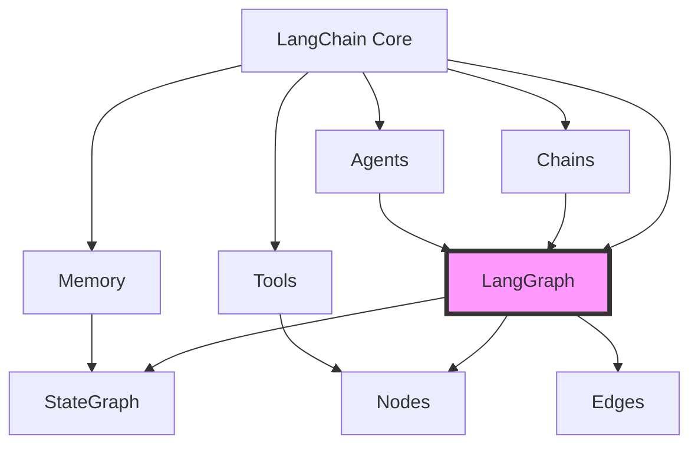

---
title: LangGraph 与 LangChain 集成详解
date: 2025-09-30
permalink: /ai/langgraph/langchain-integration.html
categories:
  - AI
  - LangGraph
---

# LangGraph 与 LangChain 集成详解

## 概述

LangGraph 是 LangChain 生态系统的重要组成部分，两者的集成提供了强大的 AI 应用开发能力。本文将详细介绍如何将 LangGraph 与 LangChain 的各个组件无缝集成。



## 1. LangChain 组件在 LangGraph 中的使用

### 1.1 集成 LLMs 和 Chat Models

```python
from langgraph.graph import StateGraph, END
from langchain_openai import ChatOpenAI, OpenAI
from langchain_anthropic import ChatAnthropic
from typing import TypedDict, Annotated, List
from operator import add

# 定义状态
class ChatState(TypedDict):
    messages: Annotated[List[dict], add]
    model_name: str
    temperature: float

# 创建多模型支持的工作流
def create_multi_model_workflow():
    workflow = StateGraph(ChatState)

    # 模型池
    models = {
        "gpt-4": ChatOpenAI(model="gpt-4", temperature=0.7),
        "gpt-3.5": ChatOpenAI(model="gpt-3.5-turbo", temperature=0.7),
        "claude": ChatAnthropic(model="claude-3-opus-20240229"),
    }

    def model_selector_node(state):
        """根据状态选择合适的模型"""
        model_name = state.get("model_name", "gpt-3.5")
        temperature = state.get("temperature", 0.7)

        # 动态调整模型参数
        selected_model = models[model_name]
        selected_model.temperature = temperature

        # 处理消息
        messages = state["messages"]
        response = selected_model.invoke(messages)

        return {"messages": [response.dict()]}

    def router(state):
        """路由决策"""
        last_message = state["messages"][-1]

        # 根据内容复杂度选择模型
        if "complex" in last_message.get("content", "").lower():
            return "use_advanced"
        return "use_basic"

    # 高级模型节点
    def advanced_model_node(state):
        state["model_name"] = "gpt-4"
        return model_selector_node(state)

    # 基础模型节点
    def basic_model_node(state):
        state["model_name"] = "gpt-3.5"
        return model_selector_node(state)

    # 构建流程
    workflow.add_node("router", router)
    workflow.add_node("advanced", advanced_model_node)
    workflow.add_node("basic", basic_model_node)

    workflow.set_entry_point("router")

    workflow.add_conditional_edges(
        "router",
        lambda s: router(s),
        {
            "use_advanced": "advanced",
            "use_basic": "basic"
        }
    )

    workflow.add_edge("advanced", END)
    workflow.add_edge("basic", END)

    return workflow.compile()
```

### 1.2 集成 LangChain Tools

```python
from langchain.tools import DuckDuckGoSearchRun, WikipediaQueryRun
from langchain.tools import ShellTool, PythonREPLTool
from langchain.agents import Tool
from langgraph.prebuilt import ToolExecutor

class ToolState(TypedDict):
    query: str
    tool_name: str
    tool_args: dict
    tool_results: Annotated[List[dict], add]
    final_answer: str

def create_tool_workflow():
    """创建集成 LangChain 工具的工作流"""
    workflow = StateGraph(ToolState)

    # 初始化工具
    search_tool = DuckDuckGoSearchRun()
    wikipedia_tool = WikipediaQueryRun(api_wrapper=WikipediaAPIWrapper())
    shell_tool = ShellTool()
    python_tool = PythonREPLTool()

    # 工具注册表
    tools = {
        "search": search_tool,
        "wikipedia": wikipedia_tool,
        "shell": shell_tool,
        "python": python_tool
    }

    # 创建工具执行器
    tool_executor = ToolExecutor(tools)

    def tool_selection_node(state):
        """工具选择节点"""
        query = state["query"]

        # 简单的工具选择逻辑
        if "search" in query.lower():
            tool_name = "search"
        elif "wikipedia" in query.lower():
            tool_name = "wikipedia"
        elif "run" in query.lower() or "execute" in query.lower():
            tool_name = "python"
        else:
            tool_name = "search"  # 默认

        return {"tool_name": tool_name}

    def tool_execution_node(state):
        """执行工具"""
        tool_name = state["tool_name"]
        tool = tools[tool_name]
        query = state["query"]

        try:
            result = tool.run(query)
            return {
                "tool_results": [{
                    "tool": tool_name,
                    "input": query,
                    "output": result,
                    "status": "success"
                }]
            }
        except Exception as e:
            return {
                "tool_results": [{
                    "tool": tool_name,
                    "input": query,
                    "error": str(e),
                    "status": "failed"
                }]
            }

    def synthesis_node(state):
        """综合结果"""
        tool_results = state.get("tool_results", [])

        if not tool_results:
            return {"final_answer": "No results found"}

        # 整合所有工具结果
        answers = []
        for result in tool_results:
            if result["status"] == "success":
                answers.append(f"{result['tool']}: {result['output']}")
            else:
                answers.append(f"{result['tool']} failed: {result.get('error', 'Unknown error')}")

        final_answer = "\n".join(answers)
        return {"final_answer": final_answer}

    # 构建流程
    workflow.add_node("select_tool", tool_selection_node)
    workflow.add_node("execute_tool", tool_execution_node)
    workflow.add_node("synthesize", synthesis_node)

    workflow.set_entry_point("select_tool")
    workflow.add_edge("select_tool", "execute_tool")
    workflow.add_edge("execute_tool", "synthesize")
    workflow.add_edge("synthesize", END)

    return workflow.compile()
```

### 1.3 集成 LangChain Memory

```python
from langchain.memory import ConversationBufferMemory, ConversationSummaryMemory
from langchain.memory import ConversationBufferWindowMemory
from langchain.schema import BaseMemory

class MemoryState(TypedDict):
    user_input: str
    memory_key: str
    conversation_history: List[dict]
    summary: str
    response: str

def create_memory_workflow():
    """集成 LangChain Memory 的工作流"""
    workflow = StateGraph(MemoryState)

    # 初始化不同类型的内存
    buffer_memory = ConversationBufferMemory(return_messages=True)
    summary_memory = ConversationSummaryMemory(llm=ChatOpenAI())
    window_memory = ConversationBufferWindowMemory(k=5)  # 只保留最近5轮

    memories = {
        "buffer": buffer_memory,
        "summary": summary_memory,
        "window": window_memory
    }

    def load_memory_node(state):
        """加载内存"""
        memory_key = state.get("memory_key", "buffer")
        memory = memories[memory_key]

        # 获取历史对话
        history = memory.chat_memory.messages

        return {
            "conversation_history": [
                {"role": msg.type, "content": msg.content}
                for msg in history
            ]
        }

    def process_with_memory_node(state):
        """使用内存处理"""
        memory_key = state.get("memory_key", "buffer")
        memory = memories[memory_key]
        user_input = state["user_input"]

        # 添加用户输入到内存
        memory.chat_memory.add_user_message(user_input)

        # 获取上下文
        context = memory.load_memory_variables({})

        # 生成响应（这里简化处理）
        llm = ChatOpenAI()
        messages = [
            {"role": "system", "content": "You are a helpful assistant."},
            {"role": "user", "content": f"Context: {context}\nUser: {user_input}"}
        ]

        response = llm.invoke(messages)

        # 添加响应到内存
        memory.chat_memory.add_ai_message(response.content)

        return {"response": response.content}

    def summarize_memory_node(state):
        """总结内存"""
        memory_key = state.get("memory_key", "buffer")
        memory = memories[memory_key]

        if isinstance(memory, ConversationSummaryMemory):
            summary = memory.predict_new_summary(
                memory.chat_memory.messages,
                ""
            )
        else:
            # 对其他类型内存手动总结
            messages = memory.chat_memory.messages
            if len(messages) > 10:
                llm = ChatOpenAI()
                summary_prompt = f"Summarize this conversation: {messages}"
                summary = llm.invoke(summary_prompt).content
            else:
                summary = "Conversation is too short to summarize"

        return {"summary": summary}

    # 构建流程
    workflow.add_node("load_memory", load_memory_node)
    workflow.add_node("process", process_with_memory_node)
    workflow.add_node("summarize", summarize_memory_node)

    workflow.set_entry_point("load_memory")
    workflow.add_edge("load_memory", "process")
    workflow.add_edge("process", "summarize")
    workflow.add_edge("summarize", END)

    return workflow.compile()
```

## 2. LangChain Chains 转换为 LangGraph

### 2.1 简单链转换

```python
from langchain.chains import LLMChain, SimpleSequentialChain
from langchain.prompts import PromptTemplate

def convert_simple_chain_to_graph():
    """将简单链转换为图"""

    # 原始 LangChain 链
    llm = ChatOpenAI()

    prompt1 = PromptTemplate(
        input_variables=["topic"],
        template="Write a brief introduction about {topic}"
    )
    chain1 = LLMChain(llm=llm, prompt=prompt1)

    prompt2 = PromptTemplate(
        input_variables=["introduction"],
        template="Expand this introduction into a detailed article: {introduction}"
    )
    chain2 = LLMChain(llm=llm, prompt=prompt2)

    # 转换为 LangGraph
    class ChainState(TypedDict):
        topic: str
        introduction: str
        article: str

    workflow = StateGraph(ChainState)

    def intro_node(state):
        """对应 chain1"""
        topic = state["topic"]
        result = chain1.run(topic)
        return {"introduction": result}

    def article_node(state):
        """对应 chain2"""
        introduction = state["introduction"]
        result = chain2.run(introduction)
        return {"article": result}

    workflow.add_node("intro", intro_node)
    workflow.add_node("article", article_node)

    workflow.set_entry_point("intro")
    workflow.add_edge("intro", "article")
    workflow.add_edge("article", END)

    return workflow.compile()
```

### 2.2 复杂链转换

```python
from langchain.chains import ConversationalRetrievalChain
from langchain.vectorstores import FAISS
from langchain.embeddings import OpenAIEmbeddings

def convert_retrieval_chain_to_graph():
    """将检索链转换为图"""

    # 初始化向量存储
    embeddings = OpenAIEmbeddings()
    vectorstore = FAISS.from_texts(
        ["Document 1", "Document 2"],
        embeddings
    )

    class RetrievalState(TypedDict):
        query: str
        retrieved_docs: List[str]
        answer: str
        chat_history: List[tuple]

    workflow = StateGraph(RetrievalState)

    def retrieval_node(state):
        """检索节点"""
        query = state["query"]
        docs = vectorstore.similarity_search(query, k=3)

        return {
            "retrieved_docs": [doc.page_content for doc in docs]
        }

    def qa_node(state):
        """问答节点"""
        query = state["query"]
        docs = state["retrieved_docs"]
        chat_history = state.get("chat_history", [])

        # 构建上下文
        context = "\n".join(docs)

        llm = ChatOpenAI()
        prompt = f"""
        Based on the following context, answer the question.

        Context: {context}

        Chat History: {chat_history}

        Question: {query}

        Answer:
        """

        response = llm.invoke(prompt)

        return {
            "answer": response.content,
            "chat_history": chat_history + [(query, response.content)]
        }

    def validation_node(state):
        """验证答案质量"""
        answer = state["answer"]

        # 简单的质量检查
        if len(answer) < 10:
            return "regenerate"
        return "complete"

    workflow.add_node("retrieve", retrieval_node)
    workflow.add_node("qa", qa_node)

    workflow.set_entry_point("retrieve")
    workflow.add_edge("retrieve", "qa")

    workflow.add_conditional_edges(
        "qa",
        validation_node,
        {
            "regenerate": "retrieve",
            "complete": END
        }
    )

    return workflow.compile()
```

## 3. LangChain Agents 与 LangGraph

### 3.1 Agent 转换为图

```python
from langchain.agents import AgentExecutor, create_react_agent
from langchain.agents import Tool
from langchain import hub

def convert_agent_to_graph():
    """将 LangChain Agent 转换为 LangGraph"""

    # 定义工具
    def calculator(input: str) -> str:
        try:
            return str(eval(input))
        except:
            return "Error in calculation"

    def search(input: str) -> str:
        return f"Search results for: {input}"

    tools = [
        Tool(name="Calculator", func=calculator, description="Useful for math"),
        Tool(name="Search", func=search, description="Useful for searching")
    ]

    class AgentState(TypedDict):
        input: str
        thought: str
        action: str
        action_input: str
        observation: str
        output: str
        steps: Annotated[List[dict], add]

    workflow = StateGraph(AgentState)

    llm = ChatOpenAI()

    def thinking_node(state):
        """思考下一步行动"""
        input_text = state["input"]
        steps = state.get("steps", [])

        # 构建思考提示
        prompt = f"""
        You have access to these tools: {[t.name for t in tools]}

        Previous steps: {steps}

        Question: {input_text}

        What should be the next action?
        Respond with:
        Thought: [your reasoning]
        Action: [tool name or "Final Answer"]
        Action Input: [input to tool or final answer]
        """

        response = llm.invoke(prompt).content

        # 解析响应
        lines = response.split("\n")
        thought = ""
        action = ""
        action_input = ""

        for line in lines:
            if line.startswith("Thought:"):
                thought = line.replace("Thought:", "").strip()
            elif line.startswith("Action:"):
                action = line.replace("Action:", "").strip()
            elif line.startswith("Action Input:"):
                action_input = line.replace("Action Input:", "").strip()

        return {
            "thought": thought,
            "action": action,
            "action_input": action_input
        }

    def tool_execution_node(state):
        """执行工具"""
        action = state["action"]
        action_input = state["action_input"]

        # 查找并执行工具
        for tool in tools:
            if tool.name.lower() == action.lower():
                observation = tool.func(action_input)
                break
        else:
            observation = f"Tool {action} not found"

        # 记录步骤
        step = {
            "thought": state["thought"],
            "action": action,
            "action_input": action_input,
            "observation": observation
        }

        return {
            "observation": observation,
            "steps": [step]
        }

    def decision_node(state):
        """决策节点"""
        action = state.get("action", "")

        if action.lower() == "final answer":
            return "finish"
        else:
            return "use_tool"

    def finish_node(state):
        """完成节点"""
        return {"output": state.get("action_input", "")}

    # 构建流程
    workflow.add_node("think", thinking_node)
    workflow.add_node("tool", tool_execution_node)
    workflow.add_node("finish", finish_node)

    workflow.set_entry_point("think")

    workflow.add_conditional_edges(
        "think",
        decision_node,
        {
            "use_tool": "tool",
            "finish": "finish"
        }
    )

    workflow.add_edge("tool", "think")  # 工具执行后继续思考
    workflow.add_edge("finish", END)

    return workflow.compile()
```

## 4. 高级集成模式

### 4.1 混合架构

```python
def create_hybrid_architecture():
    """创建混合 LangChain 和 LangGraph 的架构"""

    class HybridState(TypedDict):
        mode: str  # "chain" or "graph"
        input_data: dict
        chain_result: dict
        graph_result: dict
        final_output: str

    # LangChain 组件
    chain = SimpleSequentialChain(
        chains=[
            LLMChain(llm=ChatOpenAI(), prompt=PromptTemplate(
                input_variables=["text"],
                template="Summarize: {text}"
            )),
            LLMChain(llm=ChatOpenAI(), prompt=PromptTemplate(
                input_variables=["text"],
                template="Extract key points: {text}"
            ))
        ]
    )

    # LangGraph 工作流
    sub_workflow = StateGraph(HybridState)

    def graph_process_node(state):
        # Graph 特有的处理逻辑
        return {"graph_result": {"processed": True}}

    sub_workflow.add_node("process", graph_process_node)
    sub_workflow.set_entry_point("process")
    sub_workflow.add_edge("process", END)
    sub_graph = sub_workflow.compile()

    # 主工作流
    main_workflow = StateGraph(HybridState)

    def router_node(state):
        """路由到 Chain 或 Graph"""
        mode = state.get("mode", "chain")
        return mode

    def chain_node(state):
        """执行 LangChain"""
        input_text = state["input_data"].get("text", "")
        result = chain.run(input_text)
        return {"chain_result": {"output": result}}

    def graph_node(state):
        """执行子图"""
        result = sub_graph.invoke(state)
        return {"graph_result": result.get("graph_result", {})}

    def merge_node(state):
        """合并结果"""
        chain_result = state.get("chain_result", {})
        graph_result = state.get("graph_result", {})

        final = f"Chain: {chain_result}\nGraph: {graph_result}"
        return {"final_output": final}

    # 构建流程
    main_workflow.add_node("router", router_node)
    main_workflow.add_node("chain", chain_node)
    main_workflow.add_node("graph", graph_node)
    main_workflow.add_node("merge", merge_node)

    main_workflow.set_entry_point("router")

    main_workflow.add_conditional_edges(
        "router",
        lambda s: s.get("mode", "chain"),
        {
            "chain": "chain",
            "graph": "graph"
        }
    )

    main_workflow.add_edge("chain", "merge")
    main_workflow.add_edge("graph", "merge")
    main_workflow.add_edge("merge", END)

    return main_workflow.compile()
```

### 4.2 LangChain Callbacks 集成

```python
from langchain.callbacks.base import BaseCallbackHandler
from typing import Any, Dict, List

class LangGraphCallback(BaseCallbackHandler):
    """LangGraph 回调处理器"""

    def __init__(self, workflow_state: dict):
        self.workflow_state = workflow_state
        self.events = []

    def on_llm_start(self, serialized: Dict[str, Any], prompts: List[str], **kwargs):
        """LLM 开始时触发"""
        self.events.append({
            "type": "llm_start",
            "prompts": prompts,
            "timestamp": time.time()
        })

    def on_llm_end(self, response, **kwargs):
        """LLM 结束时触发"""
        self.events.append({
            "type": "llm_end",
            "response": str(response),
            "timestamp": time.time()
        })

        # 更新工作流状态
        self.workflow_state["llm_events"] = self.events

    def on_chain_start(self, serialized: Dict[str, Any], inputs: Dict[str, Any], **kwargs):
        """链开始时触发"""
        self.events.append({
            "type": "chain_start",
            "inputs": inputs,
            "timestamp": time.time()
        })

    def on_chain_end(self, outputs: Dict[str, Any], **kwargs):
        """链结束时触发"""
        self.events.append({
            "type": "chain_end",
            "outputs": outputs,
            "timestamp": time.time()
        })

def create_callback_integrated_workflow():
    """创建集成回调的工作流"""

    class CallbackState(TypedDict):
        input: str
        llm_events: List[dict]
        output: str

    workflow = StateGraph(CallbackState)

    def process_with_callbacks(state):
        """使用回调处理"""
        callback = LangGraphCallback(state)

        llm = ChatOpenAI(callbacks=[callback])
        chain = LLMChain(
            llm=llm,
            prompt=PromptTemplate(
                input_variables=["input"],
                template="Process this: {input}"
            )
        )

        result = chain.run(state["input"])

        return {
            "output": result,
            "llm_events": callback.events
        }

    workflow.add_node("process", process_with_callbacks)
    workflow.set_entry_point("process")
    workflow.add_edge("process", END)

    return workflow.compile()
```

## 5. 实战示例：RAG + Agent 系统

```python
from langchain.vectorstores import Chroma
from langchain.text_splitter import RecursiveCharacterTextSplitter
from langchain.document_loaders import TextLoader

def create_rag_agent_system():
    """创建 RAG + Agent 的完整系统"""

    ```mermaid
    graph LR
        A[User Query] --> B[Intent Detection]
        B --> C{Need RAG?}
        C -->|Yes| D[Vector Search]
        C -->|No| E[Direct LLM]
        D --> F[Document Retrieval]
        F --> G[Context Building]
        G --> H[Agent Processing]
        E --> H
        H --> I[Tool Selection]
        I --> J[Tool Execution]
        J --> K{Complete?}
        K -->|No| H
        K -->|Yes| L[Response Generation]
        L --> M[User Response]
    ```

    class RAGAgentState(TypedDict):
        query: str
        intent: str
        need_rag: bool
        documents: List[str]
        context: str
        agent_thoughts: Annotated[List[str], add]
        tool_calls: Annotated[List[dict], add]
        final_answer: str

    # 初始化组件
    embeddings = OpenAIEmbeddings()
    text_splitter = RecursiveCharacterTextSplitter(chunk_size=1000, chunk_overlap=200)

    # 创建向量存储（示例）
    texts = ["Document about AI", "Document about ML", "Document about DL"]
    vectorstore = Chroma.from_texts(texts, embeddings)

    # 定义工具
    tools = [
        Tool(name="Calculator", func=lambda x: str(eval(x)), description="Math calculations"),
        Tool(name="Search", func=lambda x: f"Search: {x}", description="Web search"),
    ]

    workflow = StateGraph(RAGAgentState)

    def intent_detection_node(state):
        """意图检测"""
        query = state["query"]
        llm = ChatOpenAI()

        prompt = f"""
        Analyze this query and determine if it needs document retrieval (RAG):
        Query: {query}

        Respond with:
        Intent: [general/specific/calculation/search]
        Need RAG: [true/false]
        """

        response = llm.invoke(prompt).content

        # 简化解析
        need_rag = "true" in response.lower()
        intent = "general"  # 简化处理

        return {"intent": intent, "need_rag": need_rag}

    def rag_retrieval_node(state):
        """RAG 检索"""
        query = state["query"]

        # 向量搜索
        docs = vectorstore.similarity_search(query, k=3)

        return {
            "documents": [doc.page_content for doc in docs],
            "context": "\n".join([doc.page_content for doc in docs])
        }

    def agent_thinking_node(state):
        """Agent 思考"""
        query = state["query"]
        context = state.get("context", "")
        previous_thoughts = state.get("agent_thoughts", [])

        llm = ChatOpenAI()

        prompt = f"""
        Context: {context}
        Previous thoughts: {previous_thoughts}
        Query: {query}

        Available tools: {[t.name for t in tools]}

        Think step by step. What tool should we use next?
        """

        thought = llm.invoke(prompt).content

        return {"agent_thoughts": [thought]}

    def tool_execution_node(state):
        """执行工具"""
        thoughts = state.get("agent_thoughts", [])

        if not thoughts:
            return {}

        last_thought = thoughts[-1]

        # 简化的工具选择
        tool_name = "Calculator" if "calc" in last_thought.lower() else "Search"
        tool_input = state["query"]  # 简化处理

        for tool in tools:
            if tool.name == tool_name:
                result = tool.func(tool_input)
                break
        else:
            result = "No tool found"

        return {
            "tool_calls": [{
                "tool": tool_name,
                "input": tool_input,
                "output": result
            }]
        }

    def response_generation_node(state):
        """生成最终响应"""
        query = state["query"]
        context = state.get("context", "")
        thoughts = state.get("agent_thoughts", [])
        tool_calls = state.get("tool_calls", [])

        llm = ChatOpenAI()

        prompt = f"""
        Query: {query}
        Context: {context}
        Agent thoughts: {thoughts}
        Tool results: {tool_calls}

        Generate a comprehensive answer.
        """

        answer = llm.invoke(prompt).content

        return {"final_answer": answer}

    # 构建流程
    workflow.add_node("intent", intent_detection_node)
    workflow.add_node("rag", rag_retrieval_node)
    workflow.add_node("think", agent_thinking_node)
    workflow.add_node("tool", tool_execution_node)
    workflow.add_node("respond", response_generation_node)

    workflow.set_entry_point("intent")

    # 条件路由
    workflow.add_conditional_edges(
        "intent",
        lambda s: "rag" if s.get("need_rag") else "think",
        {
            "rag": "rag",
            "think": "think"
        }
    )

    workflow.add_edge("rag", "think")
    workflow.add_edge("think", "tool")

    # 工具执行后决策
    def tool_complete_check(state):
        tool_calls = state.get("tool_calls", [])
        if len(tool_calls) >= 3:  # 最多3次工具调用
            return "complete"
        return "continue"

    workflow.add_conditional_edges(
        "tool",
        tool_complete_check,
        {
            "continue": "think",
            "complete": "respond"
        }
    )

    workflow.add_edge("respond", END)

    return workflow.compile()

# 使用示例
app = create_rag_agent_system()

result = app.invoke({
    "query": "What is the difference between AI and ML, and calculate 25 * 4",
    "intent": "",
    "need_rag": False,
    "documents": [],
    "context": "",
    "agent_thoughts": [],
    "tool_calls": [],
    "final_answer": ""
})

print(f"Final Answer: {result['final_answer']}")
```

## 6. 最佳实践

### 6.1 性能优化

```python
def optimized_langchain_integration():
    """优化的 LangChain 集成"""

    # 1. 缓存 LLM 响应
    from langchain.cache import InMemoryCache
    import langchain

    langchain.llm_cache = InMemoryCache()

    # 2. 批处理请求
    class BatchState(TypedDict):
        batch_inputs: List[str]
        batch_outputs: List[str]

    def batch_llm_node(state):
        """批量 LLM 调用"""
        inputs = state["batch_inputs"]
        llm = ChatOpenAI()

        # 批量处理
        outputs = llm.batch(inputs)

        return {"batch_outputs": outputs}

    # 3. 异步调用
    async def async_llm_node(state):
        """异步 LLM 调用"""
        llm = ChatOpenAI()
        response = await llm.ainvoke(state["input"])
        return {"output": response}
```

### 6.2 错误处理

```python
def robust_integration():
    """健壮的集成"""

    class RobustState(TypedDict):
        input: str
        output: str
        error: str
        retry_count: int

    workflow = StateGraph(RobustState)

    def safe_llm_node(state):
        """安全的 LLM 调用"""
        retry_count = state.get("retry_count", 0)

        try:
            llm = ChatOpenAI()
            response = llm.invoke(state["input"])
            return {"output": response.content, "error": ""}

        except Exception as e:
            return {
                "error": str(e),
                "retry_count": retry_count + 1
            }

    def retry_decision(state):
        """重试决策"""
        if state.get("error") and state.get("retry_count", 0) < 3:
            return "retry"
        elif state.get("error"):
            return "fallback"
        return "success"

    def fallback_node(state):
        """降级处理"""
        # 使用更简单的模型或返回默认响应
        return {"output": "Service temporarily unavailable"}

    workflow.add_node("llm", safe_llm_node)
    workflow.add_node("fallback", fallback_node)

    workflow.set_entry_point("llm")

    workflow.add_conditional_edges(
        "llm",
        retry_decision,
        {
            "retry": "llm",
            "fallback": "fallback",
            "success": END
        }
    )

    workflow.add_edge("fallback", END)

    return workflow.compile()
```

## 总结

LangGraph 与 LangChain 的集成提供了：

1. **无缝组件集成**：LLMs、Tools、Memory、Chains、Agents
2. **灵活的架构**：可以将现有 Chain 转换为 Graph
3. **增强的控制流**：条件路由、循环、并行处理
4. **更好的状态管理**：持久化、检查点、回滚
5. **生产级特性**：错误处理、重试、降级

通过合理集成两者，可以构建更强大、更灵活的 AI 应用系统。