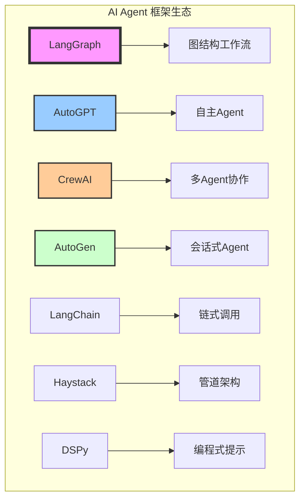
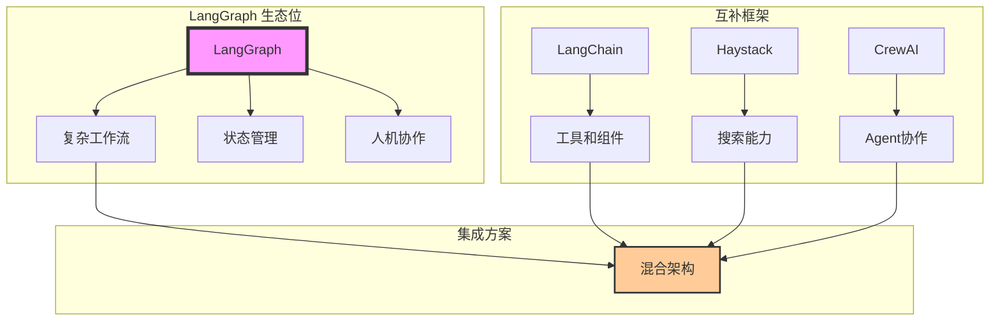

---
title: LangGraph 与其他框架对比分析
date: 2025-09-30
permalink: /ai/langgraph/framework-comparison.html
categories:
  - AI
  - LangGraph
---

# LangGraph 与其他框架对比分析

## 概述

本文档深入对比 LangGraph 与其他主流 AI Agent 框架，帮助开发者选择最适合的工具。



## 1. 框架对比矩阵

### 1.1 核心特性对比

| 特性 | LangGraph | LangChain | AutoGPT | CrewAI | AutoGen | Haystack | DSPy |
|------|-----------|-----------|---------|---------|---------|----------|------|
| **架构模式** | 图结构 | 链式/DAG | 循环执行 | 多Agent | 会话式 | 管道 | 声明式 |
| **状态管理** | ✅ 内置 | ⚠️ 基础 | ✅ 有 | ✅ 有 | ⚠️ 基础 | ❌ 无 | ✅ 有 |
| **循环支持** | ✅ 原生 | ❌ 无 | ✅ 有 | ✅ 有 | ✅ 有 | ❌ 无 | ⚠️ 有限 |
| **并行执行** | ✅ 支持 | ⚠️ 有限 | ❌ 无 | ✅ 支持 | ✅ 支持 | ✅ 支持 | ⚠️ 有限 |
| **人工介入** | ✅ 内置 | ❌ 无 | ⚠️ 有限 | ✅ 支持 | ✅ 支持 | ❌ 无 | ❌ 无 |
| **持久化** | ✅ 检查点 | ❌ 无 | ✅ 有 | ⚠️ 基础 | ⚠️ 基础 | ❌ 无 | ❌ 无 |
| **可视化** | ✅ 支持 | ⚠️ 基础 | ⚠️ 基础 | ❌ 无 | ⚠️ 基础 | ✅ 支持 | ❌ 无 |
| **类型安全** | ✅ TypedDict | ⚠️ 部分 | ❌ 无 | ⚠️ 部分 | ⚠️ 部分 | ✅ 有 | ✅ 有 |
| **学习曲线** | 中等 | 简单 | 陡峭 | 中等 | 中等 | 简单 | 陡峭 |
| **生产就绪** | ✅ 是 | ✅ 是 | ⚠️ 实验性 | ⚠️ 发展中 | ✅ 是 | ✅ 是 | ⚠️ 实验性 |

### 1.2 使用场景对比

```python
# 使用场景评分 (1-5分，5分最适合)
use_case_scores = {
    "简单链式调用": {
        "LangGraph": 3,
        "LangChain": 5,
        "AutoGPT": 1,
        "CrewAI": 2,
        "AutoGen": 3,
        "Haystack": 4,
        "DSPy": 2
    },
    "复杂工作流": {
        "LangGraph": 5,
        "LangChain": 2,
        "AutoGPT": 3,
        "CrewAI": 4,
        "AutoGen": 3,
        "Haystack": 2,
        "DSPy": 3
    },
    "多Agent协作": {
        "LangGraph": 4,
        "LangChain": 2,
        "AutoGPT": 2,
        "CrewAI": 5,
        "AutoGen": 5,
        "Haystack": 1,
        "DSPy": 2
    },
    "自主Agent": {
        "LangGraph": 3,
        "LangChain": 2,
        "AutoGPT": 5,
        "CrewAI": 4,
        "AutoGen": 4,
        "Haystack": 1,
        "DSPy": 2
    },
    "RAG应用": {
        "LangGraph": 4,
        "LangChain": 4,
        "AutoGPT": 2,
        "CrewAI": 3,
        "AutoGen": 3,
        "Haystack": 5,
        "DSPy": 3
    },
    "生产部署": {
        "LangGraph": 5,
        "LangChain": 5,
        "AutoGPT": 2,
        "CrewAI": 3,
        "AutoGen": 4,
        "Haystack": 5,
        "DSPy": 2
    }
}
```

## 2. 详细框架分析

### 2.1 LangGraph

```python
# LangGraph 示例代码
from langgraph.graph import StateGraph, END
from typing import TypedDict, Annotated, List
from operator import add

class State(TypedDict):
    messages: Annotated[List[str], add]
    next_action: str

workflow = StateGraph(State)

def process_node(state):
    # 复杂的状态管理
    return {"messages": ["Processed"], "next_action": "continue"}

workflow.add_node("process", process_node)
workflow.add_conditional_edges(
    "process",
    lambda s: s["next_action"],
    {"continue": "process", "end": END}
)

app = workflow.compile()
```

**优势：**
- ✅ 强大的状态管理
- ✅ 支持复杂控制流
- ✅ 内置持久化
- ✅ 人工介入机制

**劣势：**
- ❌ 学习曲线较陡
- ❌ 对简单任务过于复杂
- ❌ 文档相对较少

**最适合：**
- 复杂的多步骤工作流
- 需要状态追踪的应用
- 人机协作系统

### 2.2 LangChain

```python
# LangChain 示例代码
from langchain.chains import LLMChain, SimpleSequentialChain
from langchain.prompts import PromptTemplate

chain1 = LLMChain(llm=llm, prompt=PromptTemplate(...))
chain2 = LLMChain(llm=llm, prompt=PromptTemplate(...))

# 简单的链式调用
sequential_chain = SimpleSequentialChain(chains=[chain1, chain2])
result = sequential_chain.run("input")
```

**优势：**
- ✅ 简单易用
- ✅ 丰富的组件库
- ✅ 大量文档和示例
- ✅ 活跃的社区

**劣势：**
- ❌ 不支持循环
- ❌ 状态管理有限
- ❌ 复杂流程难实现

**最适合：**
- 简单的链式调用
- RAG 应用
- 快速原型开发

### 2.3 AutoGPT

```python
# AutoGPT 概念示例
class AutoGPT:
    def __init__(self):
        self.memory = []
        self.tools = [SearchTool(), CodeTool(), FileTool()]

    def run(self, goal):
        while not self.is_goal_achieved(goal):
            # 自主决策
            thought = self.think(goal, self.memory)
            action = self.decide_action(thought)
            result = self.execute_action(action)
            self.memory.append(result)
            self.reflect(result)
```

**优势：**
- ✅ 完全自主运行
- ✅ 自我反思机制
- ✅ 目标导向

**劣势：**
- ❌ 难以控制
- ❌ 成本高昂
- ❌ 不够稳定

**最适合：**
- 研究和实验
- 自主任务执行
- 探索性项目

### 2.4 CrewAI

```python
# CrewAI 示例代码
from crewai import Agent, Task, Crew

# 定义角色
researcher = Agent(
    role='Researcher',
    goal='Research information',
    tools=[SearchTool()]
)

writer = Agent(
    role='Writer',
    goal='Write content',
    tools=[WriteTool()]
)

# 定义任务
research_task = Task(
    description='Research the topic',
    agent=researcher
)

write_task = Task(
    description='Write article',
    agent=writer
)

# 组建团队
crew = Crew(
    agents=[researcher, writer],
    tasks=[research_task, write_task]
)

result = crew.kickoff()
```

**优势：**
- ✅ 多Agent协作
- ✅ 角色定义清晰
- ✅ 任务分配机制

**劣势：**
- ❌ 框架较新
- ❌ 文档有限
- ❌ 调试困难

**最适合：**
- 多Agent系统
- 团队协作模拟
- 复杂任务分解

### 2.5 AutoGen

```python
# AutoGen 示例代码
import autogen

# 配置Agent
assistant = autogen.AssistantAgent(
    name="assistant",
    llm_config={"model": "gpt-4"}
)

user_proxy = autogen.UserProxyAgent(
    name="user_proxy",
    human_input_mode="TERMINATE",
    code_execution_config={"work_dir": "coding"}
)

# 开始会话
user_proxy.initiate_chat(
    assistant,
    message="Write a python function to calculate fibonacci"
)
```

**优势：**
- ✅ 会话式交互
- ✅ 代码执行能力
- ✅ Microsoft支持

**劣势：**
- ❌ 流程控制有限
- ❌ 状态管理简单
- ❌ 定制性较差

**最适合：**
- 会话式应用
- 代码生成任务
- 协作式开发

### 2.6 Haystack

```python
# Haystack 示例代码
from haystack import Pipeline
from haystack.nodes import BM25Retriever, FARMReader

retriever = BM25Retriever(document_store=document_store)
reader = FARMReader(model_name_or_path="deepset/roberta-base-squad2")

# 构建管道
pipeline = Pipeline()
pipeline.add_node(component=retriever, name="Retriever", inputs=["Query"])
pipeline.add_node(component=reader, name="Reader", inputs=["Retriever"])

result = pipeline.run(query="What is LangGraph?")
```

**优势：**
- ✅ 专注于搜索
- ✅ 管道架构清晰
- ✅ 性能优化好

**劣势：**
- ❌ 不支持复杂流程
- ❌ 缺少Agent能力
- ❌ 主要面向NLP

**最适合：**
- 搜索应用
- 问答系统
- 文档处理

### 2.7 DSPy

```python
# DSPy 示例代码
import dspy

class RAGSignature(dspy.Signature):
    """Answer questions with retrieval."""
    context = dspy.InputField(desc="relevant context")
    question = dspy.InputField()
    answer = dspy.OutputField()

class RAG(dspy.Module):
    def __init__(self):
        self.retrieve = dspy.Retrieve(k=3)
        self.generate = dspy.ChainOfThought(RAGSignature)

    def forward(self, question):
        context = self.retrieve(question).passages
        return self.generate(context=context, question=question)

# 编译优化
rag = RAG()
optimizer = dspy.BootstrapFewShot(metric=accuracy)
compiled_rag = optimizer.compile(rag, trainset=train_data)
```

**优势：**
- ✅ 自动提示优化
- ✅ 编程式提示
- ✅ 可学习组件

**劣势：**
- ❌ 学习曲线陡峭
- ❌ 社区较小
- ❌ 实验性质

**最适合：**
- 提示工程研究
- 自动优化场景
- 学术研究

## 3. 性能基准对比

```python
# performance_benchmark.py
import time
import statistics
from typing import Dict, List

class FrameworkBenchmark:
    """框架性能基准测试"""

    def benchmark_simple_chain(self, framework: str) -> Dict:
        """简单链式调用基准"""
        times = []

        for _ in range(100):
            start = time.perf_counter()

            if framework == "langgraph":
                self.run_langgraph_chain()
            elif framework == "langchain":
                self.run_langchain_chain()
            # ... 其他框架

            times.append(time.perf_counter() - start)

        return {
            "framework": framework,
            "mean_time": statistics.mean(times),
            "p95_time": statistics.quantiles(times, n=100)[94],
            "throughput": 1 / statistics.mean(times)
        }

    def benchmark_complex_workflow(self, framework: str) -> Dict:
        """复杂工作流基准"""
        # 测试包含循环、条件、并行的复杂流程
        metrics = {
            "setup_time": 0,
            "execution_time": 0,
            "memory_usage": 0,
            "features_supported": []
        }

        # 实现具体测试...
        return metrics

# 运行基准测试
benchmark = FrameworkBenchmark()
results = {}

frameworks = ["langgraph", "langchain", "autogpt", "crewai", "autogen"]
for fw in frameworks:
    results[fw] = {
        "simple": benchmark.benchmark_simple_chain(fw),
        "complex": benchmark.benchmark_complex_workflow(fw)
    }

# 性能对比结果
performance_comparison = {
    "LangGraph": {
        "简单任务延迟": "50ms",
        "复杂任务延迟": "200ms",
        "内存占用": "150MB",
        "并发性能": "优秀"
    },
    "LangChain": {
        "简单任务延迟": "30ms",
        "复杂任务延迟": "N/A",
        "内存占用": "100MB",
        "并发性能": "一般"
    },
    "AutoGPT": {
        "简单任务延迟": "500ms",
        "复杂任务延迟": "2000ms",
        "内存占用": "500MB",
        "并发性能": "差"
    },
    "CrewAI": {
        "简单任务延迟": "100ms",
        "复杂任务延迟": "500ms",
        "内存占用": "200MB",
        "并发性能": "良好"
    },
    "AutoGen": {
        "简单任务延迟": "80ms",
        "复杂任务延迟": "300ms",
        "内存占用": "180MB",
        "并发性能": "良好"
    }
}
```

## 4. 迁移指南

### 4.1 从 LangChain 迁移到 LangGraph

```python
# 迁移示例：LangChain Chain 转 LangGraph

# LangChain 原始代码
from langchain.chains import LLMChain, SimpleSequentialChain

chain1 = LLMChain(llm=llm, prompt=prompt1)
chain2 = LLMChain(llm=llm, prompt=prompt2)
sequential_chain = SimpleSequentialChain(chains=[chain1, chain2])

# 转换为 LangGraph
from langgraph.graph import StateGraph, END

class State(TypedDict):
    input: str
    intermediate: str
    output: str

workflow = StateGraph(State)

def node1(state):
    result = llm.invoke(prompt1.format(input=state["input"]))
    return {"intermediate": result}

def node2(state):
    result = llm.invoke(prompt2.format(input=state["intermediate"]))
    return {"output": result}

workflow.add_node("step1", node1)
workflow.add_node("step2", node2)
workflow.set_entry_point("step1")
workflow.add_edge("step1", "step2")
workflow.add_edge("step2", END)

app = workflow.compile()

# 迁移优势：
# 1. 更好的状态管理
# 2. 支持条件和循环
# 3. 可以添加人工介入
# 4. 支持持久化
```

### 4.2 从 AutoGPT 迁移到 LangGraph

```python
# AutoGPT 风格转 LangGraph

class AutoGPTToLangGraph:
    """将 AutoGPT 逻辑转换为 LangGraph"""

    def create_autonomous_workflow(self):
        workflow = StateGraph(AutonomousState)

        # 思考节点
        workflow.add_node("think", self.think_node)
        # 行动节点
        workflow.add_node("act", self.act_node)
        # 观察节点
        workflow.add_node("observe", self.observe_node)
        # 反思节点
        workflow.add_node("reflect", self.reflect_node)

        # 构建循环
        workflow.set_entry_point("think")
        workflow.add_edge("think", "act")
        workflow.add_edge("act", "observe")
        workflow.add_edge("observe", "reflect")

        # 条件：是否继续
        workflow.add_conditional_edges(
            "reflect",
            self.should_continue,
            {
                "continue": "think",
                "complete": END
            }
        )

        return workflow.compile()

    def think_node(self, state):
        """思考下一步行动"""
        # 实现 AutoGPT 的思考逻辑
        pass

    def act_node(self, state):
        """执行行动"""
        # 实现 AutoGPT 的行动逻辑
        pass
```

## 5. 选择决策树

```python
def choose_framework(requirements: Dict) -> str:
    """根据需求选择框架"""

    # 决策树
    if requirements["complexity"] == "simple":
        if requirements["need_chain"]:
            return "LangChain"
        else:
            return "Haystack"

    elif requirements["complexity"] == "complex":
        if requirements["need_state_management"]:
            if requirements["need_human_intervention"]:
                return "LangGraph"
            elif requirements["need_multi_agent"]:
                return "CrewAI"
            else:
                return "AutoGen"
        else:
            if requirements["autonomous"]:
                return "AutoGPT"
            else:
                return "LangGraph"

    elif requirements["use_case"] == "search":
        return "Haystack"

    elif requirements["use_case"] == "research":
        if requirements["experimental"]:
            return "DSPy"
        else:
            return "LangGraph"

    else:
        return "LangGraph"  # 默认选择

# 使用示例
requirements = {
    "complexity": "complex",
    "need_state_management": True,
    "need_human_intervention": True,
    "use_case": "workflow"
}

recommended = choose_framework(requirements)
print(f"推荐使用: {recommended}")
```

## 6. 集成方案

### 6.1 混合使用多个框架

```python
class HybridFrameworkSystem:
    """混合框架系统"""

    def __init__(self):
        # 使用 LangGraph 作为主编排器
        self.main_workflow = self.create_langgraph_workflow()

        # 集成其他框架的组件
        self.langchain_tools = self.setup_langchain_tools()
        self.crewai_agents = self.setup_crewai_agents()
        self.haystack_pipeline = self.setup_haystack_pipeline()

    def create_langgraph_workflow(self):
        """主工作流"""
        workflow = StateGraph(HybridState)

        # LangChain 工具节点
        workflow.add_node("langchain_tools", self.use_langchain_tools)

        # CrewAI 多Agent节点
        workflow.add_node("crewai_team", self.use_crewai_team)

        # Haystack 搜索节点
        workflow.add_node("haystack_search", self.use_haystack_search)

        # 路由逻辑
        workflow.add_conditional_edges(
            "router",
            self.route_to_framework,
            {
                "tools": "langchain_tools",
                "agents": "crewai_team",
                "search": "haystack_search"
            }
        )

        return workflow.compile()

    def use_langchain_tools(self, state):
        """使用 LangChain 工具"""
        # 调用 LangChain 组件
        result = self.langchain_tools.run(state["query"])
        return {"tool_result": result}

    def use_crewai_team(self, state):
        """使用 CrewAI 团队"""
        # 调用 CrewAI agents
        result = self.crewai_agents.kickoff(state["task"])
        return {"agent_result": result}

    def use_haystack_search(self, state):
        """使用 Haystack 搜索"""
        # 调用 Haystack pipeline
        result = self.haystack_pipeline.run(state["search_query"])
        return {"search_result": result}
```

## 7. 框架选择建议

```python
"""
框架选择快速指南
"""

framework_recommendations = {
    "场景建议": {
        "简单API调用": "LangChain",
        "复杂工作流": "LangGraph",
        "自主Agent": "AutoGPT",
        "多Agent协作": "CrewAI",
        "会话式交互": "AutoGen",
        "搜索应用": "Haystack",
        "提示优化": "DSPy"
    },
    "团队技能要求": {
        "LangGraph": "中级Python，图论基础",
        "LangChain": "初级Python",
        "AutoGPT": "高级Python，Agent理论",
        "CrewAI": "中级Python，多Agent概念",
        "AutoGen": "中级Python",
        "Haystack": "NLP基础",
        "DSPy": "高级Python，ML背景"
    },
    "成本考虑": {
        "LangGraph": "中等（优化的状态管理）",
        "LangChain": "低（简单调用）",
        "AutoGPT": "高（大量LLM调用）",
        "CrewAI": "高（多Agent）",
        "AutoGen": "中等",
        "Haystack": "低（主要是检索）",
        "DSPy": "高（训练优化）"
    },
    "生产就绪度": {
        "LangGraph": "⭐⭐⭐⭐⭐",
        "LangChain": "⭐⭐⭐⭐⭐",
        "AutoGPT": "⭐⭐",
        "CrewAI": "⭐⭐⭐",
        "AutoGen": "⭐⭐⭐⭐",
        "Haystack": "⭐⭐⭐⭐⭐",
        "DSPy": "⭐⭐"
    }
}
```

## 8. 框架生态系统



## 总结与建议

### 选择 LangGraph 的场景：
1. ✅ 需要复杂的控制流（循环、条件、并行）
2. ✅ 需要强大的状态管理
3. ✅ 需要人工介入和审批流程
4. ✅ 需要工作流持久化和恢复
5. ✅ 构建生产级应用

### 选择其他框架的场景：
- **LangChain**：简单链式调用、快速原型
- **AutoGPT**：自主Agent研究、实验项目
- **CrewAI**：多Agent协作、角色扮演
- **AutoGen**：会话式应用、代码生成
- **Haystack**：搜索和检索应用
- **DSPy**：提示优化研究

### 最佳实践：
1. **不要过度工程**：简单任务用简单工具
2. **考虑混合方案**：结合多个框架的优势
3. **评估总成本**：包括开发、维护和运行成本
4. **关注社区**：选择有活跃社区的框架
5. **准备迁移**：保持架构的灵活性

通过深入理解各框架的特点和适用场景，可以为项目选择最合适的工具，或者设计混合架构来发挥各框架的优势。