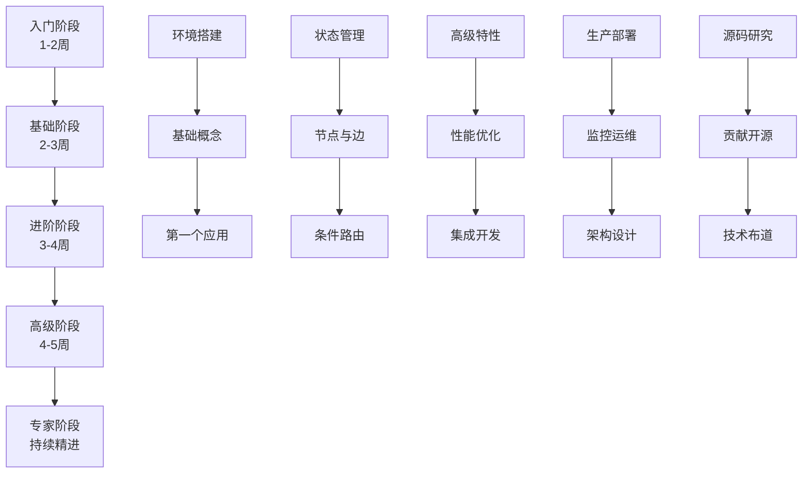
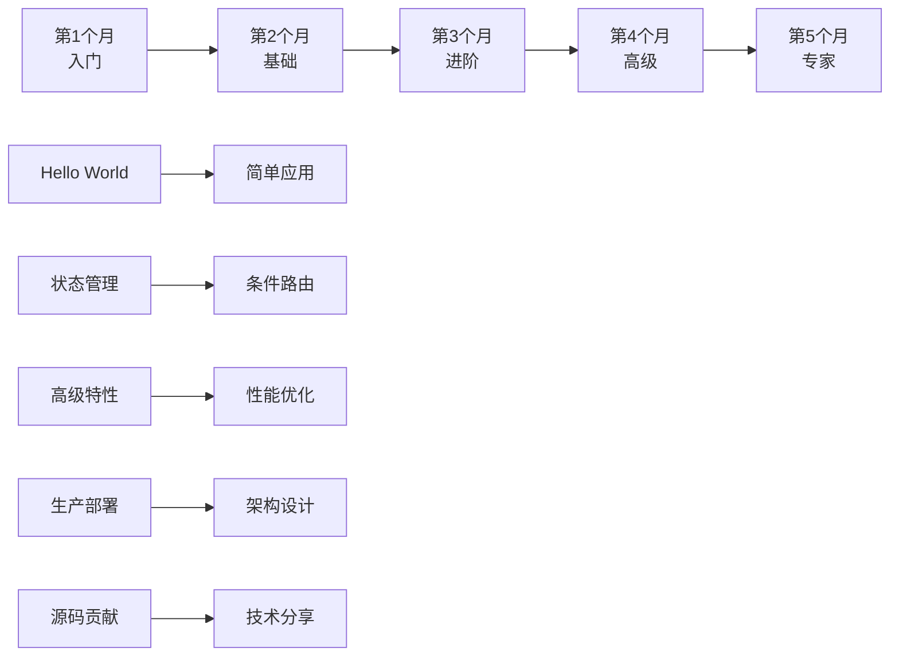

# LangGraph 学习路线图

## 一、学习阶段概览



## 二、第一阶段：入门初探（1-2周）

### 2.1 学习目标
- 理解 LangGraph 的核心概念和应用场景
- 搭建开发环境，运行第一个示例
- 掌握基础 API 的使用

### 2.2 学习内容

#### 第1-3天：概念理解
```python
# 必读文档
- 官方 Quick Start 指南
- 本系列文档 01-02 章节
- LangGraph 核心概念介绍

# 关键概念清单
□ 什么是状态图（StateGraph）
□ 节点（Node）的作用
□ 边（Edge）的类型
□ 状态（State）的定义
□ 工作流的执行流程
```

#### 第4-7天：环境搭建与Hello World
```python
# 环境配置步骤
1. 安装 Python 3.9+
2. 创建虚拟环境
   python -m venv langgraph-env
   source langgraph-env/bin/activate  # Linux/Mac

3. 安装依赖
   pip install langgraph langchain openai

4. 配置 API Keys
   export OPENAI_API_KEY="your-key"
```

#### 第8-14天：第一个应用
```python
# 简单的对话机器人
from langgraph.graph import StateGraph, END
from typing import TypedDict, List

class ConversationState(TypedDict):
    messages: List[str]
    current_speaker: str

def user_node(state: ConversationState):
    user_input = input("用户: ")
    state["messages"].append(f"用户: {user_input}")
    state["current_speaker"] = "assistant"
    return state

def assistant_node(state: ConversationState):
    # 简单的回复逻辑
    last_message = state["messages"][-1]
    response = f"助手: 我理解了 - {last_message}"
    state["messages"].append(response)
    state["current_speaker"] = "user"
    return state

# 构建图
graph = StateGraph(ConversationState)
graph.add_node("user", user_node)
graph.add_node("assistant", assistant_node)
graph.add_edge("user", "assistant")
graph.add_edge("assistant", "user")
graph.set_entry_point("user")

# 运行对话
app = graph.compile()
```

### 2.3 实践项目
- **项目一**：简单的任务管理器
- **项目二**：基础的问答系统
- **项目三**：简单的数据处理流水线

### 2.4 学习资源
- 📚 官方文档：[langgraph.readthedocs.io](https://langgraph.readthedocs.io)
- 📺 视频教程：LangGraph 入门系列
- 💻 代码示例：GitHub 官方示例库
- 🎯 练习题：每日一题挑战

## 三、第二阶段：基础夯实（2-3周）

### 3.1 学习目标
- 深入理解状态管理机制
- 掌握条件路由和循环控制
- 学会错误处理和调试技巧

### 3.2 核心技能树

```python
# 状态管理进阶
class AdvancedState(TypedDict):
    messages: Annotated[List[str], operator.add]
    summary: str
    metadata: Dict[str, Any]
    error_count: int

# 条件路由实现
def route_decision(state):
    if state["error_count"] > 3:
        return "error_handler"
    elif "help" in state["messages"][-1].lower():
        return "help_node"
    else:
        return "process_node"

graph.add_conditional_edges(
    "input",
    route_decision,
    {
        "error_handler": "error_node",
        "help_node": "help_node",
        "process_node": "process_node"
    }
)
```

### 3.3 实战演练

#### 项目：智能客服系统
```python
# 完整的客服系统架构
class CustomerServiceGraph:
    def __init__(self):
        self.graph = StateGraph(ServiceState)
        self._build_nodes()
        self._build_edges()

    def _build_nodes(self):
        # 意图识别节点
        self.graph.add_node("intent_recognition", self.recognize_intent)
        # FAQ 处理节点
        self.graph.add_node("faq_handler", self.handle_faq)
        # 人工转接节点
        self.graph.add_node("human_transfer", self.transfer_to_human)
        # 反馈收集节点
        self.graph.add_node("feedback", self.collect_feedback)

    def _build_edges(self):
        # 构建复杂的路由逻辑
        self.graph.add_conditional_edges(
            "intent_recognition",
            self.route_by_intent,
            {
                "faq": "faq_handler",
                "complex": "human_transfer",
                "feedback": "feedback"
            }
        )
```

### 3.4 技能检查清单
- [ ] 能够设计复杂的状态结构
- [ ] 掌握 5 种以上的路由模式
- [ ] 能够处理异步节点
- [ ] 会使用检查点进行状态持久化
- [ ] 能够进行性能分析和优化

## 四、第三阶段：进阶提升（3-4周）

### 4.1 高级特性掌握

#### 子图（Subgraph）应用
```python
# 创建可重用的子图组件
class SubWorkflow:
    @staticmethod
    def create_validation_subgraph():
        subgraph = StateGraph(ValidationState)

        # 数据验证流程
        subgraph.add_node("format_check", format_validator)
        subgraph.add_node("business_rules", rule_validator)
        subgraph.add_node("data_enrichment", data_enricher)

        subgraph.add_edge("format_check", "business_rules")
        subgraph.add_edge("business_rules", "data_enrichment")

        return subgraph.compile()

# 在主图中使用子图
main_graph.add_node("validation", SubWorkflow.create_validation_subgraph())
```

#### 并行执行优化
```python
# 并行处理多个任务
from concurrent.futures import ThreadPoolExecutor
import asyncio

class ParallelProcessor:
    def __init__(self, max_workers=5):
        self.executor = ThreadPoolExecutor(max_workers=max_workers)

    async def process_parallel_tasks(self, state):
        tasks = [
            self.process_task_a(state),
            self.process_task_b(state),
            self.process_task_c(state)
        ]

        results = await asyncio.gather(*tasks)
        return self.merge_results(results)
```

### 4.2 集成开发

#### 与 LangChain 深度集成
```python
from langchain.chains import LLMChain
from langchain.memory import ConversationBufferMemory
from langchain.agents import AgentExecutor

class LangChainIntegratedGraph:
    def __init__(self):
        self.memory = ConversationBufferMemory()
        self.llm_chain = LLMChain(llm=llm, memory=self.memory)
        self.tools = self._initialize_tools()

    def create_agent_node(self):
        agent = AgentExecutor.from_agent_and_tools(
            agent=self.llm_chain,
            tools=self.tools,
            memory=self.memory
        )

        def agent_node(state):
            result = agent.run(state["query"])
            state["agent_output"] = result
            return state

        return agent_node
```

### 4.3 项目实战
- **RAG 系统**：构建检索增强生成系统
- **多智能体协作**：实现智能体间的协同工作
- **工作流编排器**：开发可视化工作流设计器

## 五、第四阶段：高级应用（4-5周）

### 5.1 生产化部署

#### Docker 容器化
```dockerfile
# Dockerfile
FROM python:3.9-slim

WORKDIR /app

COPY requirements.txt .
RUN pip install --no-cache-dir -r requirements.txt

COPY . .

ENV PYTHONPATH=/app
ENV LANGGRAPH_API_KEY=${LANGGRAPH_API_KEY}

CMD ["uvicorn", "main:app", "--host", "0.0.0.0", "--port", "8000"]
```

#### Kubernetes 编排
```yaml
apiVersion: apps/v1
kind: Deployment
metadata:
  name: langgraph-app
spec:
  replicas: 3
  selector:
    matchLabels:
      app: langgraph
  template:
    metadata:
      labels:
        app: langgraph
    spec:
      containers:
      - name: langgraph
        image: langgraph-app:latest
        ports:
        - containerPort: 8000
        env:
        - name: REDIS_URL
          valueFrom:
            secretKeyRef:
              name: langgraph-secrets
              key: redis-url
```

### 5.2 监控与运维

#### 性能监控系统
```python
import prometheus_client
from prometheus_client import Counter, Histogram, Gauge

# 定义监控指标
request_count = Counter('langgraph_requests_total', 'Total requests')
request_duration = Histogram('langgraph_request_duration_seconds', 'Request duration')
active_workflows = Gauge('langgraph_active_workflows', 'Active workflows')

class MonitoredGraph:
    @request_duration.time()
    @request_count.count_exceptions()
    def execute_workflow(self, input_data):
        with active_workflows.track_inprogress():
            return self.graph.invoke(input_data)
```

### 5.3 架构设计模式

#### 微服务架构
```python
# 服务拆分设计
class MicroserviceArchitecture:
    """
    服务划分：
    1. 网关服务 - API Gateway
    2. 工作流服务 - Workflow Engine
    3. 状态服务 - State Management
    4. 执行服务 - Execution Service
    5. 监控服务 - Monitoring Service
    """

    def __init__(self):
        self.services = {
            "gateway": GatewayService(),
            "workflow": WorkflowService(),
            "state": StateService(),
            "execution": ExecutionService(),
            "monitoring": MonitoringService()
        }

    def handle_request(self, request):
        # 请求路由
        service = self.services["gateway"]
        return service.process(request)
```

## 六、第五阶段：专家之路（持续精进）

### 6.1 源码研究

#### 核心源码分析
```python
# 深入理解 StateGraph 实现
class StateGraphSource:
    """
    关键源码位置：
    - langgraph/graph/graph.py - 图的核心实现
    - langgraph/checkpoint/base.py - 检查点机制
    - langgraph/pregel/pregel.py - 执行引擎
    """

    def analyze_execution_flow(self):
        # 1. 图的编译过程
        # 2. 节点的执行调度
        # 3. 状态的传递机制
        # 4. 错误的处理流程
        pass
```

### 6.2 开源贡献

#### 贡献指南
```markdown
# 如何为 LangGraph 贡献代码

1. **找到合适的 Issue**
   - Good First Issue 标签
   - Help Wanted 标签
   - Feature Request 讨论

2. **开发流程**
   - Fork 仓库
   - 创建特性分支
   - 编写代码和测试
   - 提交 Pull Request

3. **代码规范**
   - 遵循 PEP 8
   - 编写单元测试
   - 更新文档
   - 添加类型注解
```

### 6.3 技术布道

#### 分享经验
1. **撰写技术博客**
   - 实战经验总结
   - 性能优化技巧
   - 架构设计方案

2. **开源项目**
   - 开发 LangGraph 扩展
   - 创建项目模板
   - 贡献工具库

3. **社区参与**
   - 回答技术问题
   - 参与技术讨论
   - 组织线下分享

## 七、学习资源汇总

### 7.1 必读资料
```yaml
基础阶段:
  - LangGraph 官方文档
  - LangChain 基础教程
  - Python 异步编程指南

进阶阶段:
  - 图算法与数据结构
  - 分布式系统设计
  - 微服务架构实战

高级阶段:
  - 系统设计面试指南
  - 生产级 AI 应用开发
  - DevOps 最佳实践
```

### 7.2 实战项目推荐

#### 初级项目（★☆☆）
1. **待办事项管理器** - 基础状态管理
2. **简单聊天机器人** - 对话流程控制
3. **数据验证工具** - 条件路由应用

#### 中级项目（★★☆）
1. **智能客服系统** - 复杂路由逻辑
2. **文档处理流水线** - 并行处理
3. **代码审查助手** - LLM 集成

#### 高级项目（★★★）
1. **多智能体平台** - 智能体协作
2. **工作流引擎** - 可视化编排
3. **实时分析系统** - 流式处理

### 7.3 学习社区

#### 官方渠道
- GitHub: github.com/langchain-ai/langgraph
- Discord: LangChain 官方服务器
- Twitter: @LangChainAI

#### 中文社区
- 知乎专栏：LangGraph 实践
- 微信群：LangGraph 技术交流
- B站教程：LangGraph 从入门到精通

## 八、学习计划模板

### 8.1 每日学习计划
```markdown
# Day X 学习记录

## 今日目标
- [ ] 理解概念：___________
- [ ] 完成练习：___________
- [ ] 阅读文档：___________

## 学习笔记
- 关键概念：
- 代码示例：
- 遇到问题：
- 解决方案：

## 明日计划
- 待学习内容：
- 待完成任务：
```

### 8.2 周度复盘模板
```markdown
# Week X 复盘总结

## 本周成果
1. 掌握技能：
2. 完成项目：
3. 解决问题：

## 经验教训
1. 做得好的：
2. 需要改进：
3. 下周重点：

## 学习时间统计
- 理论学习：__ 小时
- 实践编码：__ 小时
- 项目开发：__ 小时
```

## 九、常见学习误区

### 9.1 避免的陷阱

#### ❌ 错误做法
1. **只看不练** - 光看文档不动手
2. **贪多求快** - 跳过基础直接学高级
3. **闭门造车** - 不参考最佳实践
4. **忽视测试** - 不写测试用例
5. **过度设计** - 简单问题复杂化

#### ✅ 正确做法
1. **动手实践** - 每个概念都写代码验证
2. **循序渐进** - 扎实掌握每个阶段
3. **学习借鉴** - 研究优秀开源项目
4. **测试驱动** - 先写测试再写代码
5. **简单优先** - 先实现再优化

### 9.2 学习建议

```python
class LearningTips:
    """学习建议集锦"""

    @staticmethod
    def for_beginners():
        return [
            "先理解概念，再看代码",
            "从简单示例开始，逐步增加复杂度",
            "多画流程图，帮助理解执行过程",
            "遇到问题先查文档，再问社区"
        ]

    @staticmethod
    def for_intermediate():
        return [
            "阅读源码，理解实现原理",
            "尝试不同的设计模式",
            "关注性能优化",
            "参与开源项目"
        ]

    @staticmethod
    def for_advanced():
        return [
            "设计系统架构",
            "解决生产问题",
            "分享经验心得",
            "培养新人成长"
        ]
```

## 十、结语

### 10.1 学习里程碑



### 10.2 持续学习

LangGraph 的学习是一个持续的过程，技术在不断演进，应用场景在不断扩展。保持好奇心，持续实践，不断创新，你将在这条学习之路上收获满满。

**记住**：
- 🎯 明确目标，制定计划
- 📚 理论实践，相辅相成
- 🤝 开放交流，共同成长
- 🚀 持续精进，永不止步

祝你在 LangGraph 的学习道路上一帆风顺！