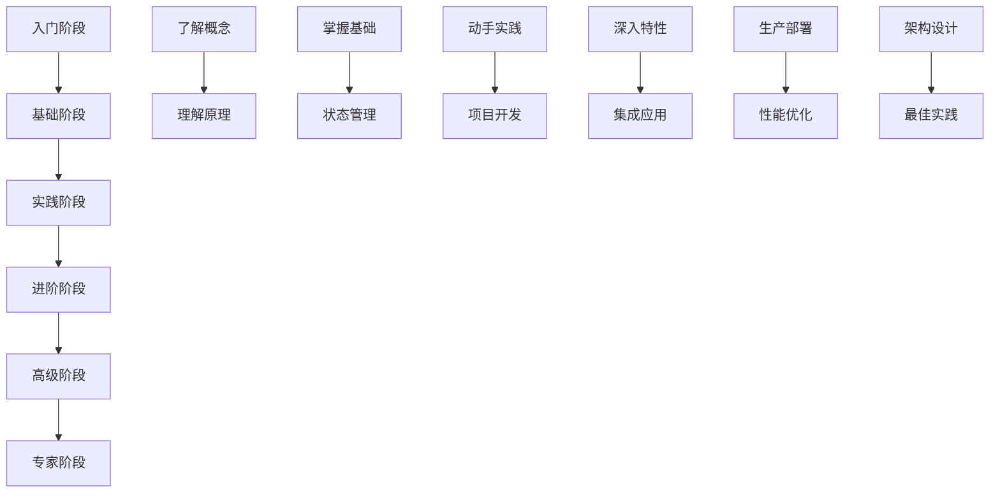

---
title: LangGraph 完整学习指南
date: 2025-01-30
permalink: /ai/langgraph/index.html
categories:
  - AI
  - LangGraph
---

# LangGraph 完整学习指南 - 目录索引

## 📚 学习路径总览

本目录包含 19 个文档，构成了完整的 LangGraph 学习体系。建议按照以下路径由浅入深地学习：



## 🎯 学习阶段划分

### 第一阶段：入门了解（建议 1 周）

适合人群：零基础，想了解 LangGraph 是什么

| 序号 | 文档名称 | 内容概述 | 学习目标 |
|------|---------|---------|---------|
| 1 | [01.入门介绍.md](./01.入门介绍.md) | LangGraph 基本概念、应用场景、快速开始 | 理解 LangGraph 的价值和基本用法 |
| 2 | [16.学习路线图.md](./16.学习路线图.md) | 完整学习路径规划、资源汇总 | 制定个人学习计划 |

### 第二阶段：基础掌握（建议 2 周）

适合人群：有编程基础，想要开始使用 LangGraph

| 序号 | 文档名称 | 内容概述 | 学习目标 |
|------|---------|---------|---------|
| 3 | [02.基础概念深度解析.md](./02.基础概念深度解析.md) | 核心概念详解、基本组件介绍 | 深入理解核心概念 |
| 4 | [09.核心概念详解与作用.md](./09.核心概念详解与作用.md) | 各核心组件的作用和原理 | 理解组件间的关系 |
| 5 | [03.状态管理与数据流.md](./03.状态管理与数据流.md) | 状态设计、数据流转、Reducer 机制 | 掌握状态管理技巧 |
| 6 | [17.API参考文档.md](./17.API参考文档.md) | 完整 API 接口说明、使用示例 | 熟悉常用 API |

### 第三阶段：实战练习（建议 2-3 周）

适合人群：掌握基础，想要动手实践

| 序号 | 文档名称 | 内容概述 | 学习目标 |
|------|---------|---------|---------|
| 7 | [04.实战案例详解.md](./04.实战案例详解.md) | 三个完整案例：聊天机器人、研究助手、代码审查 | 通过案例学习开发流程 |
| 8 | [13.项目模板与脚手架.md](./13.项目模板与脚手架.md) | 项目模板、CLI 工具、快速启动 | 快速搭建项目框架 |
| 9 | [11.测试策略与最佳实践.md](./11.测试策略与最佳实践.md) | 测试方法、调试技巧、质量保证 | 编写高质量代码 |

### 第四阶段：进阶提升（建议 3-4 周）

适合人群：有项目经验，想要深入掌握

| 序号 | 文档名称 | 内容概述 | 学习目标 |
|------|---------|---------|---------|
| 10 | [05.高级特性与优化技巧.md](./05.高级特性与优化技巧.md) | 子图、并行处理、流式执行、性能优化 | 掌握高级特性 |
| 11 | [06.与LangChain集成.md](./06.与LangChain集成.md) | LangChain 组件集成、Agent、Chain、Tool | 实现复杂集成 |
| 12 | [08.常见问题与解决方案.md](./08.常见问题与解决方案.md) | 错误处理、问题诊断、解决方案 | 提升问题解决能力 |
| 13 | [10.性能测试与基准.md](./10.性能测试与基准.md) | 性能指标、测试方法、优化策略 | 优化系统性能 |

### 第五阶段：生产应用（建议 4-5 周）

适合人群：准备在生产环境使用 LangGraph

| 序号 | 文档名称 | 内容概述 | 学习目标 |
|------|---------|---------|---------|
| 14 | [07.生产部署指南.md](./07.生产部署指南.md) | Docker、Kubernetes、监控、运维 | 掌握部署运维 |
| 15 | [15.实际项目案例.md](./15.实际项目案例.md) | 三个企业级项目：AI 平台、文档系统、数据分析 | 学习实际项目架构 |
| 16 | [14.最佳实践总结.md](./14.最佳实践总结.md) | 架构、编码、测试、部署最佳实践 | 掌握最佳实践 |

### 第六阶段：深入研究（持续学习）

适合人群：想要成为 LangGraph 专家

| 序号 | 文档名称 | 内容概述 | 学习目标 |
|------|---------|---------|---------|
| 17 | [12.与其他框架对比分析.md](./12.与其他框架对比分析.md) | 与 7 种框架对比、选型指南 | 理解技术选型 |
| 18 | [langgraph_detailed_guide.md](./langgraph_detailed_guide.md) | 深入技术细节、高级主题 | 深入理解原理 |
| 19 | [langgraph_core_concepts.md](./langgraph_core_concepts.md) | 核心概念原始文档 | 参考原始资料 |

## 📖 文档使用说明

### 1. 初学者路线（4-6 周）
```
第 1 周：01 → 16 → 02
第 2 周：09 → 03 → 17（部分）
第 3-4 周：04 → 13 → 11（基础部分）
第 5-6 周：实践项目 + 08（遇到问题时查阅）
```

### 2. 快速上手路线（2-3 周）
```
第 1 周：01 → 02 → 03 → 04（快速过一遍）
第 2 周：13 → 实战项目 → 08（问题解决）
第 3 周：07 → 14（生产准备）
```

### 3. 深入研究路线（8-10 周）
```
基础（2 周）：01 → 02 → 09 → 03
实践（2 周）：04 → 13 → 11
进阶（2 周）：05 → 06 → 10
生产（2 周）：07 → 15 → 14
研究（2 周）：12 → langgraph_detailed_guide
```

## 🔧 配套资源

### 代码示例
每个文档都包含可运行的代码示例，建议：
1. 先理解代码逻辑
2. 动手运行示例
3. 修改参数观察变化
4. 尝试扩展功能

### 项目模板
- **入门模板**：简单的对话机器人
- **标准模板**：包含测试的完整项目
- **企业模板**：生产级项目架构

### 工具支持
- **CLI 工具**：快速创建项目
- **调试工具**：问题诊断辅助
- **性能工具**：性能分析优化

## 💡 学习建议

### 对于不同背景的学习者

#### Python 开发者
- 重点：LangGraph 特有概念（StateGraph、Node、Edge）
- 快速通道：直接从 04 实战案例开始

#### AI/ML 工程师
- 重点：与 LangChain 集成、Agent 设计
- 推荐路径：02 → 06 → 05 → 15

#### 架构师/技术负责人
- 重点：架构设计、性能优化、生产部署
- 推荐路径：01 → 12 → 07 → 14 → 15

#### 全栈开发者
- 重点：端到端项目实现、API 设计
- 推荐路径：01 → 04 → 13 → 07

## 🚀 下一步行动

1. **评估当前水平**
   - 完全新手 → 从第一阶段开始
   - 有 AI 开发经验 → 从第二阶段开始
   - 有 LangChain 经验 → 从第三阶段开始

2. **制定学习计划**
   - 使用 [16.学习路线图.md](./16.学习路线图.md) 中的模板
   - 设定每周学习目标
   - 跟踪学习进度

3. **动手实践**
   - 每学完一个文档，完成其中的练习
   - 尝试修改示例代码
   - 构建自己的小项目

4. **加入社区**
   - 参与讨论，提出问题
   - 分享学习心得
   - 贡献代码和文档

## 📝 更新日志

- 2025-01-30：创建完整文档体系（19 个文档）
- 持续更新中...

## 🤝 贡献指南

欢迎贡献更多示例、修正错误或改进文档。请通过 Pull Request 提交您的贡献。

---

**祝您学习愉快，在 LangGraph 的世界里收获满满！** 🎉