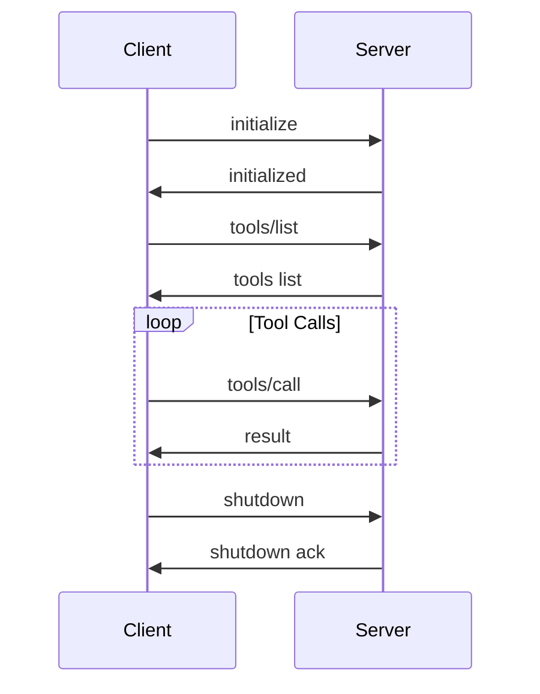

---
title: 通过SpringAI开发一个MCP
date: 2025-11-17
permalink: /docs/ai/mcp/02.通过SpringAI开发一个MCP/
categories:
  - AI
  - MCP
---

# MCP (Model Context Protocol) 深度解析：从架构设计到SpringAI实践

## 1. MCP 技术分类与架构概览

### 1.1 协议分类

MCP作为一个标准化的AI模型上下文协议，可以从多个维度进行分类：

#### 按通信方式分类
- **进程内通信（In-Process）**：直接函数调用，性能最优
- **进程间通信（IPC）**：通过管道、共享内存等方式
- **网络通信（Network）**：HTTP/WebSocket等协议
- **标准输入输出（stdio）**：最常用的方式，简单可靠

#### 按服务类型分类
- **工具服务（Tools）**：提供可执行的功能接口
- **资源服务（Resources）**：提供数据访问能力
- **提示服务（Prompts）**：提供预定义的提示模板

#### 按部署模式分类
- **本地服务**：运行在本地机器上
- **远程服务**：部署在远程服务器
- **容器化服务**：Docker等容器化部署
- **云原生服务**：Kubernetes等云原生环境

### 1.2 架构层次

```
┌─────────────────────────────────────┐
│           AI Client Layer          │  ← Claude, GPT等AI客户端
├─────────────────────────────────────┤
│         MCP Client Layer           │  ← MCP客户端实现
├─────────────────────────────────────┤
│        Transport Layer             │  ← stdio, HTTP, WebSocket
├─────────────────────────────────────┤
│         MCP Server Layer           │  ← MCP服务端实现
├─────────────────────────────────────┤
│       Business Logic Layer         │  ← 具体业务逻辑
└─────────────────────────────────────┘
```

## 2. 核心实现原理

### 2.1 协议基础

MCP基于JSON-RPC 2.0协议，采用请求-响应模式：

```json
{
  "jsonrpc": "2.0",
  "method": "tools/call",
  "params": {
    "name": "calculator",
    "arguments": {
      "operation": "add",
      "a": 10,
      "b": 20
    }
  },
  "id": "req-123"
}
```

### 2.2 生命周期管理



### 2.3 错误处理机制

```json
{
  "jsonrpc": "2.0",
  "error": {
    "code": -32602,
    "message": "Invalid params",
    "data": {
      "parameter": "operation",
      "expected": "string",
      "actual": "number"
    }
  },
  "id": "req-123"
}
```

## 3. 设计理念与核心思想

### 3.1 设计原则

#### 标准化优先
- **统一接口**：所有MCP服务遵循相同的协议规范
- **互操作性**：不同实现之间可以无缝切换
- **版本兼容**：向后兼容，平滑升级

#### 简单性原则
- **最小化复杂度**：协议设计简洁明了
- **易于实现**：降低开发门槛
- **调试友好**：JSON格式便于调试

#### 扩展性设计
- **插件化架构**：支持动态加载服务
- **能力发现**：运行时发现服务能力
- **渐进式增强**：可选功能不影响核心流程

### 3.2 架构模式

#### 发布-订阅模式
```java
// 事件驱动的通知机制
public interface MCPEventListener {
    void onToolsChanged(List<Tool> tools);
    void onResourcesChanged(List<Resource> resources);
    void onServerStatusChanged(ServerStatus status);
}
```

#### 策略模式
```java
// 不同传输方式的策略实现
public interface TransportStrategy {
    void send(MCPMessage message);
    MCPMessage receive();
    void close();
}
```

## 4. 性能对比分析

### 4.1 传输方式性能对比

| 传输方式 | 延迟 | 吞吐量 | 资源消耗 | 适用场景 |
|---------|------|--------|----------|----------|
| stdio | 极低 | 高 | 极低 | 本地开发、简单工具 |
| HTTP | 中等 | 中等 | 中等 | 远程服务、RESTful API |
| WebSocket | 低 | 高 | 中等 | 实时通信、长连接 |
| gRPC | 低 | 极高 | 高 | 高性能、微服务 |

### 4.2 性能优化策略

#### 连接池管理
```java
public class MCPConnectionPool {
    private final BlockingQueue<MCPConnection> pool;
    private final int maxSize;
    
    public MCPConnection acquire() throws InterruptedException {
        return pool.take();
    }
    
    public void release(MCPConnection connection) {
        if (pool.size() < maxSize) {
            pool.offer(connection);
        } else {
            connection.close();
        }
    }
}
```

#### 批量处理
```java
public class BatchProcessor {
    private final List<MCPRequest> batch = new ArrayList<>();
    private final int batchSize = 100;
    
    public void addRequest(MCPRequest request) {
        batch.add(request);
        if (batch.size() >= batchSize) {
            processBatch();
        }
    }
    
    private void processBatch() {
        // 批量处理请求，减少网络往返
        mcpClient.sendBatch(batch);
        batch.clear();
    }
}
```

## 5. 最佳实践指南

### 5.1 服务设计最佳实践

#### 工具设计原则
```java
/**
 * 工具设计最佳实践：
 * 1. 单一职责：每个工具只做一件事
 * 2. 幂等性：相同输入产生相同输出
 * 3. 错误处理：提供详细的错误信息
 * 4. 参数验证：严格验证输入参数
 */
@MCPTool(name = "file_reader", description = "读取文件内容")
public class FileReaderTool {
    
    @MCPToolMethod
    public String readFile(
        @MCPParameter(name = "path", description = "文件路径", required = true) String path,
        @MCPParameter(name = "encoding", description = "文件编码", defaultValue = "UTF-8") String encoding
    ) throws MCPException {
        // 参数验证
        if (path == null || path.trim().isEmpty()) {
            throw new MCPException("文件路径不能为空");
        }
        
        try {
            Path filePath = Paths.get(path);
            // 安全检查：防止路径遍历攻击
            if (!isPathSafe(filePath)) {
                throw new MCPException("不安全的文件路径");
            }
            
            return Files.readString(filePath, Charset.forName(encoding));
        } catch (IOException e) {
            throw new MCPException("读取文件失败: " + e.getMessage(), e);
        }
    }
    
    private boolean isPathSafe(Path path) {
        // 实现路径安全检查逻辑
        return !path.toString().contains("..");
    }
}
```

### 5.2 错误处理最佳实践

```java
public class MCPErrorHandler {
    
    /**
     * 统一错误处理
     */
    public MCPResponse handleError(Exception e, MCPRequest request) {
        MCPError error;
        
        if (e instanceof ValidationException) {
            error = new MCPError(-32602, "Invalid params", e.getMessage());
        } else if (e instanceof NotFoundException) {
            error = new MCPError(-32601, "Method not found", e.getMessage());
        } else if (e instanceof TimeoutException) {
            error = new MCPError(-32000, "Request timeout", e.getMessage());
        } else {
            // 记录详细错误日志
            logger.error("Unexpected error processing request: {}", request, e);
            error = new MCPError(-32603, "Internal error", "服务器内部错误");
        }
        
        return MCPResponse.error(error, request.getId());
    }
}
```

### 5.3 安全最佳实践

```java
/**
 * MCP安全配置
 */
@Configuration
public class MCPSecurityConfig {
    
    /**
     * 访问控制
     */
    @Bean
    public MCPAccessController accessController() {
        return new MCPAccessController() {
            @Override
            public boolean isAllowed(String toolName, MCPContext context) {
                // 实现基于角色的访问控制
                String userRole = context.getUserRole();
                return hasPermission(userRole, toolName);
            }
        };
    }
    
    /**
     * 请求限流
     */
    @Bean
    public RateLimiter rateLimiter() {
        return RateLimiter.create(100.0); // 每秒100个请求
    }
    
    /**
     * 输入验证
     */
    @Bean
    public InputValidator inputValidator() {
        return new InputValidator() {
            @Override
            public void validate(Object input) throws ValidationException {
                // 实现输入验证逻辑
                if (input instanceof String) {
                    String str = (String) input;
                    if (str.length() > 10000) {
                        throw new ValidationException("输入内容过长");
                    }
                    if (containsMaliciousContent(str)) {
                        throw new ValidationException("输入包含恶意内容");
                    }
                }
            }
        };
    }
}
```

## 6. SpringAI构建MCP流程

### 6.1 项目结构设计

```
src/main/java/
├── com/example/mcp/
│   ├── config/
│   │   ├── MCPConfig.java
│   │   └── SpringAIConfig.java
│   ├── server/
│   │   ├── MCPServer.java
│   │   └── MCPMessageHandler.java
│   ├── tools/
│   │   ├── CalculatorTool.java
│   │   ├── WeatherTool.java
│   │   └── DatabaseTool.java
│   ├── transport/
│   │   ├── StdioTransport.java
│   │   └── HttpTransport.java
│   └── MCPApplication.java
```

### 6.2 核心配置

```java
/**
 * MCP服务器配置
 */
@Configuration
@EnableConfigurationProperties(MCPProperties.class)
public class MCPConfig {
    
    @Autowired
    private MCPProperties properties;
    
    /**
     * MCP服务器Bean
     */
    @Bean
    public MCPServer mcpServer() {
        MCPServer server = new MCPServer();
        server.setServerInfo(new ServerInfo(
            properties.getName(),
            properties.getVersion()
        ));
        
        // 注册传输层
        server.addTransport(stdioTransport());
        if (properties.getHttp().isEnabled()) {
            server.addTransport(httpTransport());
        }
        
        return server;
    }
    
    /**
     * 标准输入输出传输
     */
    @Bean
    public StdioTransport stdioTransport() {
        return new StdioTransport();
    }
    
    /**
     * HTTP传输
     */
    @Bean
    @ConditionalOnProperty(name = "mcp.http.enabled", havingValue = "true")
    public HttpTransport httpTransport() {
        HttpTransport transport = new HttpTransport();
        transport.setPort(properties.getHttp().getPort());
        transport.setPath(properties.getHttp().getPath());
        return transport;
    }
    
    /**
     * 工具注册器
     */
    @Bean
    public ToolRegistry toolRegistry() {
        ToolRegistry registry = new ToolRegistry();
        
        // 自动发现并注册所有@MCPTool注解的工具
        ApplicationContext context = applicationContext;
        Map<String, Object> tools = context.getBeansWithAnnotation(MCPTool.class);
        
        for (Object tool : tools.values()) {
            registry.registerTool(tool);
        }
        
        return registry;
    }
    
    @Autowired
    private ApplicationContext applicationContext;
}
```

### 6.3 SpringAI集成配置

```java
/**
 * SpringAI集成配置
 */
@Configuration
public class SpringAIConfig {
    
    /**
     * OpenAI客户端配置
     */
    @Bean
    public OpenAiChatModel openAiChatModel() {
        return new OpenAiChatModel(
            OpenAiApi.builder()
                .apiKey("your-api-key")
                .build(),
            OpenAiChatOptions.builder()
                .withModel("gpt-4")
                .withTemperature(0.7)
                .build()
        );
    }
    
    /**
     * MCP工具函数适配器
     */
    @Bean
    public MCPFunctionAdapter mcpFunctionAdapter(ToolRegistry toolRegistry) {
        return new MCPFunctionAdapter(toolRegistry);
    }
    
    /**
     * AI服务
     */
    @Bean
    public AIService aiService(
            OpenAiChatModel chatModel,
            MCPFunctionAdapter functionAdapter) {
        return new AIService(chatModel, functionAdapter);
    }
}
```

## 7. 完整案例：智能文件管理系统

### 7.1 项目依赖

```xml
<!-- pom.xml -->
<dependencies>
    <!-- Spring Boot Starter -->
    <dependency>
        <groupId>org.springframework.boot</groupId>
        <artifactId>spring-boot-starter</artifactId>
    </dependency>
    
    <!-- Spring AI -->
    <dependency>
        <groupId>org.springframework.ai</groupId>
        <artifactId>spring-ai-openai-spring-boot-starter</artifactId>
        <version>0.8.1</version>
    </dependency>
    
    <!-- JSON处理 -->
    <dependency>
        <groupId>com.fasterxml.jackson.core</groupId>
        <artifactId>jackson-databind</artifactId>
    </dependency>
    
    <!-- 工具库 -->
    <dependency>
        <groupId>org.apache.commons</groupId>
        <artifactId>commons-lang3</artifactId>
    </dependency>
    
    <!-- 测试依赖 -->
    <dependency>
        <groupId>org.springframework.boot</groupId>
        <artifactId>spring-boot-starter-test</artifactId>
        <scope>test</scope>
    </dependency>
</dependencies>
```

### 7.2 核心MCP服务器实现

```java
/**
 * MCP服务器核心实现
 * 负责处理客户端连接、消息路由和生命周期管理
 */
@Component
@Slf4j
public class MCPServer {
    
    private final ToolRegistry toolRegistry;
    private final ObjectMapper objectMapper;
    private final List<Transport> transports;
    private ServerInfo serverInfo;
    private volatile boolean running = false;
    
    public MCPServer(ToolRegistry toolRegistry) {
        this.toolRegistry = toolRegistry;
        this.objectMapper = new ObjectMapper();
        this.transports = new ArrayList<>();
    }
    
    /**
     * 启动MCP服务器
     */
    public void start() {
        if (running) {
            log.warn("MCP服务器已经在运行中");
            return;
        }
        
        log.info("启动MCP服务器: {} v{}", serverInfo.getName(), serverInfo.getVersion());
        
        // 启动所有传输层
        for (Transport transport : transports) {
            try {
                transport.start(this::handleMessage);
                log.info("传输层启动成功: {}", transport.getClass().getSimpleName());
            } catch (Exception e) {
                log.error("传输层启动失败: {}", transport.getClass().getSimpleName(), e);
            }
        }
        
        running = true;
        log.info("MCP服务器启动完成");
    }
    
    /**
     * 停止MCP服务器
     */
    public void stop() {
        if (!running) {
            return;
        }
        
        log.info("正在停止MCP服务器...");
        
        // 停止所有传输层
        for (Transport transport : transports) {
            try {
                transport.stop();
            } catch (Exception e) {
                log.error("停止传输层失败: {}", transport.getClass().getSimpleName(), e);
            }
        }
        
        running = false;
        log.info("MCP服务器已停止");
    }
    
    /**
     * 处理客户端消息
     */
    private MCPResponse handleMessage(MCPRequest request) {
        try {
            log.debug("处理请求: {} - {}", request.getId(), request.getMethod());
            
            switch (request.getMethod()) {
                case "initialize":
                    return handleInitialize(request);
                case "tools/list":
                    return handleToolsList(request);
                case "tools/call":
                    return handleToolCall(request);
                case "shutdown":
                    return handleShutdown(request);
                default:
                    return MCPResponse.error(
                        new MCPError(-32601, "Method not found", "未知方法: " + request.getMethod()),
                        request.getId()
                    );
            }
        } catch (Exception e) {
            log.error("处理请求失败: {}", request.getId(), e);
            return MCPResponse.error(
                new MCPError(-32603, "Internal error", e.getMessage()),
                request.getId()
            );
        }
    }
    
    /**
     * 处理初始化请求
     */
    private MCPResponse handleInitialize(MCPRequest request) {
        InitializeParams params = objectMapper.convertValue(
            request.getParams(), InitializeParams.class
        );
        
        log.info("客户端初始化: 协议版本={}, 客户端信息={}", 
            params.getProtocolVersion(), params.getClientInfo());
        
        // 构建服务器能力
        ServerCapabilities capabilities = ServerCapabilities.builder()
            .tools(ToolsCapability.builder()
                .listChanged(true)
                .build())
            .build();
        
        InitializeResult result = InitializeResult.builder()
            .protocolVersion("2024-11-05")
            .serverInfo(serverInfo)
            .capabilities(capabilities)
            .build();
        
        return MCPResponse.success(result, request.getId());
    }
    
    /**
     * 处理工具列表请求
     */
    private MCPResponse handleToolsList(MCPRequest request) {
        List<ToolInfo> tools = toolRegistry.getAllTools().stream()
            .map(this::convertToToolInfo)
            .collect(Collectors.toList());
        
        ToolsListResult result = new ToolsListResult(tools);
        return MCPResponse.success(result, request.getId());
    }
    
    /**
     * 处理工具调用请求
     */
    private MCPResponse handleToolCall(MCPRequest request) {
        ToolCallParams params = objectMapper.convertValue(
            request.getParams(), ToolCallParams.class
        );
        
        String toolName = params.getName();
        Map<String, Object> arguments = params.getArguments();
        
        log.info("调用工具: {} 参数: {}", toolName, arguments);
        
        try {
            // 查找并执行工具
            ToolExecutor executor = toolRegistry.getExecutor(toolName);
            if (executor == null) {
                return MCPResponse.error(
                    new MCPError(-32601, "Tool not found", "工具不存在: " + toolName),
                    request.getId()
                );
            }
            
            Object result = executor.execute(arguments);
            
            ToolCallResult toolResult = ToolCallResult.builder()
                .content(List.of(TextContent.of(String.valueOf(result))))
                .isError(false)
                .build();
            
            return MCPResponse.success(toolResult, request.getId());
            
        } catch (Exception e) {
            log.error("工具执行失败: {}", toolName, e);
            
            ToolCallResult errorResult = ToolCallResult.builder()
                .content(List.of(TextContent.of("执行失败: " + e.getMessage())))
                .isError(true)
                .build();
            
            return MCPResponse.success(errorResult, request.getId());
        }
    }
    
    /**
     * 处理关闭请求
     */
    private MCPResponse handleShutdown(MCPRequest request) {
        log.info("收到关闭请求");
        
        // 异步停止服务器，避免阻塞响应
        CompletableFuture.runAsync(() -> {
            try {
                Thread.sleep(100); // 给响应时间发送
                stop();
            } catch (InterruptedException e) {
                Thread.currentThread().interrupt();
            }
        });
        
        return MCPResponse.success(null, request.getId());
    }
    
    /**
     * 转换工具信息
     */
    private ToolInfo convertToToolInfo(ToolDefinition definition) {
        return ToolInfo.builder()
            .name(definition.getName())
            .description(definition.getDescription())
            .inputSchema(definition.getInputSchema())
            .build();
    }
    
    // Getter和Setter方法
    public void setServerInfo(ServerInfo serverInfo) {
        this.serverInfo = serverInfo;
    }
    
    public void addTransport(Transport transport) {
        this.transports.add(transport);
    }
}
```

### 7.3 文件管理工具实现

```java
/**
 * 文件管理工具
 * 提供文件读取、写入、列表等功能
 */
@MCPTool(name = "file_manager", description = "文件管理工具，支持读取、写入、列表文件")
@Component
@Slf4j
public class FileManagerTool {
    
    private final String baseDirectory;
    private final Set<String> allowedExtensions;
    
    public FileManagerTool(@Value("${mcp.file.base-directory:./data}") String baseDirectory) {
        this.baseDirectory = baseDirectory;
        this.allowedExtensions = Set.of(".txt", ".md", ".json", ".xml", ".csv");
        
        // 确保基础目录存在
        try {
            Files.createDirectories(Paths.get(baseDirectory));
        } catch (IOException e) {
            log.error("创建基础目录失败: {}", baseDirectory, e);
        }
    }
    
    /**
     * 读取文件内容
     */
    @MCPToolMethod(description = "读取指定文件的内容")
    public String readFile(
            @MCPParameter(name = "path", description = "文件相对路径", required = true) String path,
            @MCPParameter(name = "encoding", description = "文件编码", defaultValue = "UTF-8") String encoding
    ) throws MCPException {
        
        // 参数验证
        validatePath(path);
        
        Path fullPath = Paths.get(baseDirectory, path).normalize();
        
        // 安全检查：确保文件在允许的目录内
        if (!fullPath.startsWith(Paths.get(baseDirectory).toAbsolutePath())) {
            throw new MCPException("访问被拒绝：文件路径超出允许范围");
        }
        
        // 检查文件是否存在
        if (!Files.exists(fullPath)) {
            throw new MCPException("文件不存在: " + path);
        }
        
        // 检查是否为文件
        if (!Files.isRegularFile(fullPath)) {
            throw new MCPException("指定路径不是文件: " + path);
        }
        
        try {
            String content = Files.readString(fullPath, Charset.forName(encoding));
            log.info("成功读取文件: {} (大小: {} 字符)", path, content.length());
            return content;
        } catch (IOException e) {
            log.error("读取文件失败: {}", path, e);
            throw new MCPException("读取文件失败: " + e.getMessage());
        }
    }
    
    /**
     * 写入文件内容
     */
    @MCPToolMethod(description = "写入内容到指定文件")
    public String writeFile(
            @MCPParameter(name = "path", description = "文件相对路径", required = true) String path,
            @MCPParameter(name = "content", description = "文件内容", required = true) String content,
            @MCPParameter(name = "encoding", description = "文件编码", defaultValue = "UTF-8") String encoding,
            @MCPParameter(name = "append", description = "是否追加模式", defaultValue = "false") boolean append
    ) throws MCPException {
        
        // 参数验证
        validatePath(path);
        
        if (content == null) {
            throw new MCPException("文件内容不能为空");
        }
        
        Path fullPath = Paths.get(baseDirectory, path).normalize();
        
        // 安全检查
        if (!fullPath.startsWith(Paths.get(baseDirectory).toAbsolutePath())) {
            throw new MCPException("访问被拒绝：文件路径超出允许范围");
        }
        
        try {
            // 确保父目录存在
            Files.createDirectories(fullPath.getParent());
            
            // 写入文件
            if (append && Files.exists(fullPath)) {
                Files.writeString(fullPath, content, Charset.forName(encoding), 
                    StandardOpenOption.APPEND);
            } else {
                Files.writeString(fullPath, content, Charset.forName(encoding));
            }
            
            long fileSize = Files.size(fullPath);
            log.info("成功写入文件: {} (大小: {} 字节, 追加模式: {})", path, fileSize, append);
            
            return String.format("文件写入成功: %s (大小: %d 字节)", path, fileSize);
            
        } catch (IOException e) {
            log.error("写入文件失败: {}", path, e);
            throw new MCPException("写入文件失败: " + e.getMessage());
        }
    }
    
    /**
     * 列出目录内容
     */
    @MCPToolMethod(description = "列出指定目录的内容")
    public List<FileInfo> listDirectory(
            @MCPParameter(name = "path", description = "目录相对路径", defaultValue = ".") String path,
            @MCPParameter(name = "recursive", description = "是否递归列出", defaultValue = "false") boolean recursive
    ) throws MCPException {
        
        // 处理空路径
        if (path == null || path.trim().isEmpty() || ".".equals(path)) {
            path = "";
        }
        
        Path fullPath = Paths.get(baseDirectory, path).normalize();
        
        // 安全检查
        if (!fullPath.startsWith(Paths.get(baseDirectory).toAbsolutePath())) {
            throw new MCPException("访问被拒绝：目录路径超出允许范围");
        }
        
        // 检查目录是否存在
        if (!Files.exists(fullPath)) {
            throw new MCPException("目录不存在: " + path);
        }
        
        // 检查是否为目录
        if (!Files.isDirectory(fullPath)) {
            throw new MCPException("指定路径不是目录: " + path);
        }
        
        try {
            List<FileInfo> result = new ArrayList<>();
            
            if (recursive) {
                // 递归遍历
                Files.walkFileTree(fullPath, new SimpleFileVisitor<Path>() {
                    @Override
                    public FileVisitResult visitFile(Path file, BasicFileAttributes attrs) {
                        result.add(createFileInfo(file, fullPath));
                        return FileVisitResult.CONTINUE;
                    }
                    
                    @Override
                    public FileVisitResult preVisitDirectory(Path dir, BasicFileAttributes attrs) {
                        if (!dir.equals(fullPath)) {
                            result.add(createFileInfo(dir, fullPath));
                        }
                        return FileVisitResult.CONTINUE;
                    }
                });
            } else {
                // 只列出直接子项
                try (DirectoryStream<Path> stream = Files.newDirectoryStream(fullPath)) {
                    for (Path entry : stream) {
                        result.add(createFileInfo(entry, fullPath));
                    }
                }
            }
            
            // 按名称排序
            result.sort(Comparator.comparing(FileInfo::getName));
            
            log.info("成功列出目录: {} (项目数: {}, 递归: {})", path, result.size(), recursive);
            return result;
            
        } catch (IOException e) {
            log.error("列出目录失败: {}", path, e);
            throw new MCPException("列出目录失败: " + e.getMessage());
        }
    }
    
    /**
     * 删除文件或目录
     */
    @MCPToolMethod(description = "删除指定的文件或目录")
    public String deleteFile(
            @MCPParameter(name = "path", description = "文件或目录相对路径", required = true) String path,
            @MCPParameter(name = "recursive", description = "是否递归删除目录", defaultValue = "false") boolean recursive
    ) throws MCPException {
        
        // 参数验证
        validatePath(path);
        
        Path fullPath = Paths.get(baseDirectory, path).normalize();
        
        // 安全检查
        if (!fullPath.startsWith(Paths.get(baseDirectory).toAbsolutePath())) {
            throw new MCPException("访问被拒绝：路径超出允许范围");
        }
        
        // 检查文件是否存在
        if (!Files.exists(fullPath)) {
            throw new MCPException("文件或目录不存在: " + path);
        }
        
        try {
            if (Files.isDirectory(fullPath)) {
                if (recursive) {
                    // 递归删除目录
                    Files.walkFileTree(fullPath, new SimpleFileVisitor<Path>() {
                        @Override
                        public FileVisitResult visitFile(Path file, BasicFileAttributes attrs) throws IOException {
                            Files.delete(file);
                            return FileVisitResult.CONTINUE;
                        }
                        
                        @Override
                        public FileVisitResult postVisitDirectory(Path dir, IOException exc) throws IOException {
                            Files.delete(dir);
                            return FileVisitResult.CONTINUE;
                        }
                    });
                    log.info("成功递归删除目录: {}", path);
                    return "目录删除成功: " + path;
                } else {
                    // 只删除空目录
                    Files.delete(fullPath);
                    log.info("成功删除空目录: {}", path);
                    return "空目录删除成功: " + path;
                }
            } else {
                // 删除文件
                Files.delete(fullPath);
                log.info("成功删除文件: {}", path);
                return "文件删除成功: " + path;
            }
        } catch (IOException e) {
            log.error("删除失败: {}", path, e);
            throw new MCPException("删除失败: " + e.getMessage());
        }
    }
    
    /**
     * 创建文件信息对象
     */
    private FileInfo createFileInfo(Path path, Path basePath) {
        try {
            BasicFileAttributes attrs = Files.readAttributes(path, BasicFileAttributes.class);
            String relativePath = basePath.relativize(path).toString();
            
            return FileInfo.builder()
                .name(path.getFileName().toString())
                .path(relativePath)
                .isDirectory(attrs.isDirectory())
                .size(attrs.size())
                .lastModified(attrs.lastModifiedTime().toInstant())
                .build();
        } catch (IOException e) {
            log.warn("读取文件属性失败: {}", path, e);
            return FileInfo.builder()
                .name(path.getFileName().toString())
                .path(basePath.relativize(path).toString())
                .isDirectory(Files.isDirectory(path))
                .size(0L)
                .lastModified(Instant.now())
                .build();
        }
    }
    
    /**
     * 验证路径安全性
     */
    private void validatePath(String path) throws MCPException {
        if (path == null || path.trim().isEmpty()) {
            throw new MCPException("路径不能为空");
        }
        
        // 检查路径遍历攻击
        if (path.contains("..") || path.contains("~")) {
            throw new MCPException("不安全的路径: " + path);
        }
        
        // 检查绝对路径
        if (Paths.get(path).isAbsolute()) {
            throw new MCPException("不允许使用绝对路径: " + path);
        }
        
        // 检查文件扩展名（仅对文件）
        if (path.contains(".") && !path.endsWith("/")) {
            String extension = path.substring(path.lastIndexOf('.'));
            if (!allowedExtensions.contains(extension.toLowerCase())) {
                throw new MCPException("不支持的文件类型: " + extension);
            }
        }
    }
}

/**
 * 文件信息数据类
 */
@Data
@Builder
public class FileInfo {
    private String name;        // 文件名
    private String path;        // 相对路径
    private boolean isDirectory; // 是否为目录
    private long size;          // 文件大小（字节）
    private Instant lastModified; // 最后修改时间
}
```

### 7.4 计算器工具实现

```java
/**
 * 计算器工具
 * 提供基本的数学计算功能
 */
@MCPTool(name = "calculator", description = "数学计算器，支持基本运算和函数计算")
@Component
@Slf4j
public class CalculatorTool {
    
    private final ScriptEngine scriptEngine;
    
    public CalculatorTool() {
        // 使用JavaScript引擎进行计算
        ScriptEngineManager manager = new ScriptEngineManager();
        this.scriptEngine = manager.getEngineByName("javascript");
        
        // 预定义一些常用函数
        try {
            scriptEngine.eval("var PI = Math.PI;");
            scriptEngine.eval("var E = Math.E;");
            scriptEngine.eval("function sin(x) { return Math.sin(x); }");
            scriptEngine.eval("function cos(x) { return Math.cos(x); }");
            scriptEngine.eval("function tan(x) { return Math.tan(x); }");
            scriptEngine.eval("function log(x) { return Math.log(x); }");
            scriptEngine.eval("function sqrt(x) { return Math.sqrt(x); }");
            scriptEngine.eval("function pow(x, y) { return Math.pow(x, y); }");
        } catch (ScriptException e) {
            log.error("初始化计算器函数失败", e);
        }
    }
    
    /**
     * 基本计算
     */
    @MCPToolMethod(description = "执行基本数学计算")
    public CalculationResult calculate(
            @MCPParameter(name = "expression", description = "数学表达式", required = true) String expression
    ) throws MCPException {
        
        // 参数验证
        if (expression == null || expression.trim().isEmpty()) {
            throw new MCPException("表达式不能为空");
        }
        
        // 安全检查：移除潜在危险的内容
        String safeExpression = sanitizeExpression(expression.trim());
        
        try {
            log.info("计算表达式: {}", safeExpression);
            
            // 执行计算
            Object result = scriptEngine.eval(safeExpression);
            
            if (result == null) {
                throw new MCPException("计算结果为空");
            }
            
            // 处理不同类型的结果
            double numericResult;
            if (result instanceof Number) {
                numericResult = ((Number) result).doubleValue();
            } else {
                try {
                    numericResult = Double.parseDouble(result.toString());
                } catch (NumberFormatException e) {
                    throw new MCPException("计算结果不是有效数字: " + result);
                }
            }
            
            // 检查特殊值
            if (Double.isNaN(numericResult)) {
                throw new MCPException("计算结果为NaN（非数字）");
            }
            
            if (Double.isInfinite(numericResult)) {
                throw new MCPException("计算结果为无穷大");
            }
            
            CalculationResult calculationResult = CalculationResult.builder()
                .expression(expression)
                .result(numericResult)
                .formattedResult(formatResult(numericResult))
                .build();
            
            log.info("计算完成: {} = {}", expression, numericResult);
            return calculationResult;
            
        } catch (ScriptException e) {
            log.error("计算表达式失败: {}", expression, e);
            throw new MCPException("计算失败: " + e.getMessage());
        }
    }
    
    /**
     * 高级计算（支持变量）
     */
    @MCPToolMethod(description = "执行高级数学计算，支持变量定义")
    public CalculationResult advancedCalculate(
            @MCPParameter(name = "expression", description = "数学表达式", required = true) String expression,
            @MCPParameter(name = "variables", description = "变量定义（JSON格式）", defaultValue = "{}") String variablesJson
    ) throws MCPException {
        
        // 解析变量
        Map<String, Double> variables = parseVariables(variablesJson);
        
        try {
            // 设置变量
            for (Map.Entry<String, Double> entry : variables.entrySet()) {
                scriptEngine.put(entry.getKey(), entry.getValue());
            }
            
            // 执行计算
            return calculate(expression);
            
        } finally {
            // 清理变量
            for (String varName : variables.keySet()) {
                scriptEngine.put(varName, null);
            }
        }
    }
    
    /**
     * 单位转换
     */
    @MCPToolMethod(description = "执行单位转换")
    public ConversionResult convert(
            @MCPParameter(name = "value", description = "数值", required = true) double value,
            @MCPParameter(name = "fromUnit", description = "源单位", required = true) String fromUnit,
            @MCPParameter(name = "toUnit", description = "目标单位", required = true) String toUnit
    ) throws MCPException {
        
        log.info("单位转换: {} {} -> {}", value, fromUnit, toUnit);
        
        // 标准化单位名称
        String normalizedFromUnit = normalizeUnit(fromUnit);
        String normalizedToUnit = normalizeUnit(toUnit);
        
        // 获取转换因子
        double conversionFactor = getConversionFactor(normalizedFromUnit, normalizedToUnit);
        
        if (conversionFactor == 0) {
            throw new MCPException(String.format("不支持的单位转换: %s -> %s", fromUnit, toUnit));
        }
        
        double result = value * conversionFactor;
        
        ConversionResult conversionResult = ConversionResult.builder()
            .originalValue(value)
            .originalUnit(fromUnit)
            .convertedValue(result)
            .convertedUnit(toUnit)
            .conversionFactor(conversionFactor)
            .build();
        
        log.info("转换完成: {} {} = {} {}", value, fromUnit, result, toUnit);
        return conversionResult;
    }
    
    /**
     * 清理表达式，移除潜在危险内容
     */
    private String sanitizeExpression(String expression) throws MCPException {
        // 检查危险关键字
        String[] dangerousKeywords = {
            "import", "eval", "function", "var", "let", "const",
            "while", "for", "if", "else", "try", "catch",
            "new", "delete", "this", "window", "document"
        };
        
        String lowerExpression = expression.toLowerCase();
        for (String keyword : dangerousKeywords) {
            if (lowerExpression.contains(keyword)) {
                throw new MCPException("表达式包含不允许的关键字: " + keyword);
            }
        }
        
        // 只允许数字、运算符、括号、小数点和预定义函数
        if (!expression.matches("[0-9+\\-*/().\\s,sincotan\\logqrtpowPIE]+")) {
            throw new MCPException("表达式包含不允许的字符");
        }
        
        return expression;
    }
    
    /**
     * 解析变量JSON
     */
    private Map<String, Double> parseVariables(String variablesJson) throws MCPException {
        if (variablesJson == null || variablesJson.trim().isEmpty() || "{}".equals(variablesJson.trim())) {
            return new HashMap<>();
        }
        
        try {
            ObjectMapper mapper = new ObjectMapper();
            TypeReference<Map<String, Object>> typeRef = new TypeReference<Map<String, Object>>() {};
            Map<String, Object> rawVariables = mapper.readValue(variablesJson, typeRef);
            
            Map<String, Double> variables = new HashMap<>();
            for (Map.Entry<String, Object> entry : rawVariables.entrySet()) {
                String key = entry.getKey();
                Object value = entry.getValue();
                
                if (value instanceof Number) {
                    variables.put(key, ((Number) value).doubleValue());
                } else {
                    try {
                        variables.put(key, Double.parseDouble(value.toString()));
                    } catch (NumberFormatException e) {
                        throw new MCPException("变量值必须是数字: " + key + " = " + value);
                    }
                }
            }
            
            return variables;
        } catch (Exception e) {
            throw new MCPException("解析变量JSON失败: " + e.getMessage());
        }
    }
    
    /**
     * 格式化计算结果
     */
    private String formatResult(double result) {
        // 如果是整数，显示为整数
        if (result == Math.floor(result) && !Double.isInfinite(result)) {
            return String.valueOf((long) result);
        }
        
        // 否则保留适当的小数位数
        DecimalFormat df = new DecimalFormat("#.##########");
        return df.format(result);
    }
    
    /**
     * 标准化单位名称
     */
    private String normalizeUnit(String unit) {
        return unit.toLowerCase().trim();
    }
    
    /**
     * 获取单位转换因子
     */
    private double getConversionFactor(String fromUnit, String toUnit) {
        // 长度单位转换表（转换为米）
        Map<String, Double> lengthUnits = Map.of(
            "mm", 0.001,
            "cm", 0.01,
            "m", 1.0,
            "km", 1000.0,
            "inch", 0.0254,
            "ft", 0.3048,
            "yard", 0.9144,
            "mile", 1609.34
        );
        
        // 重量单位转换表（转换为千克）
        Map<String, Double> weightUnits = Map.of(
            "g", 0.001,
            "kg", 1.0,
            "lb", 0.453592,
            "oz", 0.0283495
        );
        
        // 温度转换需要特殊处理
        if (isTemperatureUnit(fromUnit) && isTemperatureUnit(toUnit)) {
            return getTemperatureConversionFactor(fromUnit, toUnit);
        }
        
        // 检查长度单位
        if (lengthUnits.containsKey(fromUnit) && lengthUnits.containsKey(toUnit)) {
            return lengthUnits.get(fromUnit) / lengthUnits.get(toUnit);
        }
        
        // 检查重量单位
        if (weightUnits.containsKey(fromUnit) && weightUnits.containsKey(toUnit)) {
            return weightUnits.get(fromUnit) / weightUnits.get(toUnit);
        }
        
        return 0; // 不支持的转换
    }
    
    private boolean isTemperatureUnit(String unit) {
        return Set.of("celsius", "fahrenheit", "kelvin", "c", "f", "k").contains(unit);
    }
    
    private double getTemperatureConversionFactor(String fromUnit, String toUnit) {
        // 温度转换比较复杂，这里简化处理
        // 实际应用中需要考虑偏移量
        if (fromUnit.equals(toUnit)) {
            return 1.0;
        }
        // 这里只是示例，实际需要更复杂的温度转换逻辑
        return 1.0;
    }
}

/**
 * 计算结果数据类
 */
@Data
@Builder
public class CalculationResult {
    private String expression;      // 原始表达式
    private double result;          // 数值结果
    private String formattedResult; // 格式化结果
}

/**
 * 单位转换结果数据类
 */
@Data
@Builder
public class ConversionResult {
    private double originalValue;    // 原始数值
    private String originalUnit;     // 原始单位
    private double convertedValue;   // 转换后数值
    private String convertedUnit;    // 转换后单位
    private double conversionFactor; // 转换因子
}
```

### 7.5 标准输入输出传输实现

```java
/**
 * 标准输入输出传输实现
 * 通过stdin/stdout与客户端通信
 */
@Component
@Slf4j
public class StdioTransport implements Transport {
    
    private final ObjectMapper objectMapper;
    private final BufferedReader reader;
    private final PrintWriter writer;
    private volatile boolean running = false;
    private MessageHandler messageHandler;
    private Thread readerThread;
    
    public StdioTransport() {
        this.objectMapper = new ObjectMapper();
        this.reader = new BufferedReader(new InputStreamReader(System.in));
        this.writer = new PrintWriter(System.out, true);
    }
    
    @Override
    public void start(MessageHandler handler) {
        if (running) {
            log.warn("Stdio传输已经在运行中");
            return;
        }
        
        this.messageHandler = handler;
        this.running = true;
        
        log.info("启动Stdio传输");
        
        // 启动读取线程
        readerThread = new Thread(this::readLoop, "MCP-Stdio-Reader");
        readerThread.setDaemon(true);
        readerThread.start();
    }
    
    @Override
    public void stop() {
        if (!running) {
            return;
        }
        
        log.info("停止Stdio传输");
        running = false;
        
        // 中断读取线程
        if (readerThread != null) {
            readerThread.interrupt();
        }
        
        try {
            reader.close();
            writer.close();
        } catch (IOException e) {
            log.error("关闭Stdio流失败", e);
        }
    }
    
    /**
     * 读取循环
     */
    private void readLoop() {
        log.info("Stdio读取循环开始");
        
        try {
            String line;
            while (running && (line = reader.readLine()) != null) {
                try {
                    // 解析JSON消息
                    MCPRequest request = objectMapper.readValue(line, MCPRequest.class);
                    log.debug("收到请求: {}", line);
                    
                    // 处理消息
                    MCPResponse response = messageHandler.handle(request);
                    
                    // 发送响应
                    String responseJson = objectMapper.writeValueAsString(response);
                    writer.println(responseJson);
                    writer.flush();
                    
                    log.debug("发送响应: {}", responseJson);
                    
                } catch (JsonProcessingException e) {
                    log.error("解析JSON消息失败: {}", line, e);
                    
                    // 发送错误响应
                    MCPResponse errorResponse = MCPResponse.error(
                        new MCPError(-32700, "Parse error", "JSON解析失败: " + e.getMessage()),
                        null
                    );
                    
                    try {
                        String errorJson = objectMapper.writeValueAsString(errorResponse);
                        writer.println(errorJson);
                        writer.flush();
                    } catch (JsonProcessingException ex) {
                        log.error("发送错误响应失败", ex);
                    }
                } catch (Exception e) {
                    log.error("处理消息失败: {}", line, e);
                }
            }
        } catch (IOException e) {
            if (running) {
                log.error("读取输入流失败", e);
            }
        } finally {
            log.info("Stdio读取循环结束");
        }
    }
    
    @Override
    public String getName() {
        return "stdio";
    }
}
```

### 7.6 应用程序主类

```java
/**
 * MCP应用程序主类
 */
@SpringBootApplication
@Slf4j
public class MCPApplication implements CommandLineRunner {
    
    @Autowired
    private MCPServer mcpServer;
    
    public static void main(String[] args) {
        // 配置日志输出到stderr，避免与MCP通信冲突
        System.setProperty("logging.pattern.console", "%d{HH:mm:ss.SSS} [%thread] %-5level %logger{36} - %msg%n");
        
        SpringApplication app = new SpringApplication(MCPApplication.class);
        
        // 禁用banner，避免干扰MCP通信
        app.setBannerMode(Banner.Mode.OFF);
        
        // 设置日志输出到stderr
        app.setLogStartupInfo(false);
        
        app.run(args);
    }
    
    @Override
    public void run(String... args) throws Exception {
        log.info("启动MCP服务器...");
        
        // 添加关闭钩子
        Runtime.getRuntime().addShutdownHook(new Thread(() -> {
            log.info("正在关闭MCP服务器...");
            mcpServer.stop();
        }));
        
        // 启动服务器
        mcpServer.start();
        
        log.info("MCP服务器启动完成，等待客户端连接...");
        
        // 保持主线程运行
        try {
            Thread.currentThread().join();
        } catch (InterruptedException e) {
            log.info("应用程序被中断");
            Thread.currentThread().interrupt();
        }
    }
}
```

### 7.7 配置文件

```yaml
# application.yml
spring:
  application:
    name: mcp-file-manager
  
  # 日志配置
  logging:
    level:
      com.example.mcp: INFO
      root: WARN
    pattern:
      console: "%d{HH:mm:ss.SSS} [%thread] %-5level %logger{36} - %msg%n"
    file:
      name: logs/mcp-server.log

# MCP服务器配置
mcp:
  name: "File Manager MCP Server"
  version: "1.0.0"
  
  # 文件管理配置
  file:
    base-directory: "./data"
    max-file-size: 10485760  # 10MB
    allowed-extensions:
      - ".txt"
      - ".md"
      - ".json"
      - ".xml"
      - ".csv"
      - ".log"
  
  # HTTP传输配置
  http:
    enabled: false
    port: 8080
    path: "/mcp"
  
  # 安全配置
  security:
    rate-limit: 100  # 每秒请求数
    max-request-size: 1048576  # 1MB
```

### 7.8 MCP客户端配置示例

```json
{
  "mcpServers": {
    "file-manager": {
      "command": "java",
      "args": [
        "-jar",
        "/path/to/mcp-file-manager.jar"
      ],
      "env": {
        "SPRING_PROFILES_ACTIVE": "production"
      }
    }
  }
}
```

## 8. 测试与验证

### 8.1 单元测试

```java
/**
 * 文件管理工具测试
 */
@SpringBootTest
@TestPropertySource(properties = {
    "mcp.file.base-directory=./test-data"
})
class FileManagerToolTest {
    
    @Autowired
    private FileManagerTool fileManagerTool;
    
    @TempDir
    Path tempDir;
    
    @Test
    void testReadFile() throws MCPException, IOException {
        // 准备测试文件
        Path testFile = tempDir.resolve("test.txt");
        String content = "Hello, MCP!";
        Files.writeString(testFile, content);
        
        // 执行读取
        String result = fileManagerTool.readFile("test.txt", "UTF-8");
        
        // 验证结果
        assertEquals(content, result);
    }
    
    @Test
    void testWriteFile() throws MCPException {
        // 执行写入
        String content = "Test content";
        String result = fileManagerTool.writeFile("output.txt", content, "UTF-8", false);
        
        // 验证结果
        assertTrue(result.contains("文件写入成功"));
        
        // 验证文件内容
        String readContent = fileManagerTool.readFile("output.txt", "UTF-8");
        assertEquals(content, readContent);
    }
    
    @Test
    void testListDirectory() throws MCPException {
        // 执行列表操作
        List<FileInfo> files = fileManagerTool.listDirectory(".", false);
        
        // 验证结果
        assertNotNull(files);
        assertTrue(files.size() >= 0);
    }
    
    @Test
    void testSecurityValidation() {
        // 测试路径遍历攻击防护
        assertThrows(MCPException.class, () -> {
            fileManagerTool.readFile("../../../etc/passwd", "UTF-8");
        });
        
        // 测试绝对路径防护
        assertThrows(MCPException.class, () -> {
            fileManagerTool.readFile("/etc/passwd", "UTF-8");
        });
    }
}
```

### 8.2 集成测试

```java
/**
 * MCP服务器集成测试
 */
@SpringBootTest
class MCPServerIntegrationTest {
    
    @Autowired
    private MCPServer mcpServer;
    
    @Test
    void testServerLifecycle() {
        // 测试服务器启动
        assertDoesNotThrow(() -> mcpServer.start());
        
        // 测试服务器停止
        assertDoesNotThrow(() -> mcpServer.stop());
    }
    
    @Test
    void testToolRegistration() {
        // 验证工具注册
        ToolRegistry registry = mcpServer.getToolRegistry();
        assertNotNull(registry);
        
        // 验证文件管理工具
        assertTrue(registry.hasExecutor("file_manager"));
        
        // 验证计算器工具
        assertTrue(registry.hasExecutor("calculator"));
    }
}
```

## 9. 部署与运维

### 9.1 Docker部署

```dockerfile
# Dockerfile
FROM openjdk:17-jre-slim

# 设置工作目录
WORKDIR /app

# 复制应用程序
COPY target/mcp-file-manager.jar app.jar

# 创建数据目录
RUN mkdir -p /app/data

# 设置环境变量
ENV SPRING_PROFILES_ACTIVE=docker
ENV MCP_FILE_BASE_DIRECTORY=/app/data

# 暴露端口（如果启用HTTP传输）
EXPOSE 8080

# 启动应用
ENTRYPOINT ["java", "-jar", "app.jar"]
```

### 9.2 Kubernetes部署

```yaml
# k8s-deployment.yaml
apiVersion: apps/v1
kind: Deployment
metadata:
  name: mcp-file-manager
  labels:
    app: mcp-file-manager
spec:
  replicas: 1
  selector:
    matchLabels:
      app: mcp-file-manager
  template:
    metadata:
      labels:
        app: mcp-file-manager
    spec:
      containers:
      - name: mcp-server
        image: mcp-file-manager:latest
        ports:
        - containerPort: 8080
        env:
        - name: SPRING_PROFILES_ACTIVE
          value: "kubernetes"
        volumeMounts:
        - name: data-volume
          mountPath: /app/data
        resources:
          requests:
            memory: "256Mi"
            cpu: "250m"
          limits:
            memory: "512Mi"
            cpu: "500m"
      volumes:
      - name: data-volume
        persistentVolumeClaim:
          claimName: mcp-data-pvc
---
apiVersion: v1
kind: Service
metadata:
  name: mcp-file-manager-service
spec:
  selector:
    app: mcp-file-manager
  ports:
  - protocol: TCP
    port: 8080
    targetPort: 8080
  type: ClusterIP
```

### 9.3 监控与日志

```java
/**
 * MCP服务器监控配置
 */
@Configuration
@EnableScheduling
public class MonitoringConfig {
    
    private final MeterRegistry meterRegistry;
    private final MCPServer mcpServer;
    
    public MonitoringConfig(MeterRegistry meterRegistry, MCPServer mcpServer) {
        this.meterRegistry = meterRegistry;
        this.mcpServer = mcpServer;
    }
    
    /**
     * 定期收集服务器指标
     */
    @Scheduled(fixedRate = 30000) // 每30秒
    public void collectMetrics() {
        // 记录活跃连接数
        Gauge.builder("mcp.connections.active")
            .description("Active MCP connections")
            .register(meterRegistry, mcpServer, MCPServer::getActiveConnectionCount);
        
        // 记录工具调用次数
        Counter.builder("mcp.tools.calls")
            .description("Total tool calls")
            .register(meterRegistry)
            .increment(mcpServer.getTotalToolCalls());
    }
    
    /**
     * 健康检查端点
     */
    @Bean
    public HealthIndicator mcpHealthIndicator() {
        return () -> {
            if (mcpServer.isRunning()) {
                return Health.up()
                    .withDetail("status", "running")
                    .withDetail("activeConnections", mcpServer.getActiveConnectionCount())
                    .withDetail("totalToolCalls", mcpServer.getTotalToolCalls())
                    .build();
            } else {
                return Health.down()
                    .withDetail("status", "stopped")
                    .build();
            }
        };
    }
}
```

## 10. 性能优化建议

### 10.1 连接池优化

```java
/**
 * 连接池配置
 */
@Configuration
public class ConnectionPoolConfig {
    
    @Bean
    @ConfigurationProperties("mcp.connection-pool")
    public ConnectionPoolProperties connectionPoolProperties() {
        return new ConnectionPoolProperties();
    }
    
    @Bean
    public MCPConnectionPool mcpConnectionPool(ConnectionPoolProperties properties) {
        return MCPConnectionPool.builder()
            .maxSize(properties.getMaxSize())
            .minIdle(properties.getMinIdle())
            .maxWaitTime(properties.getMaxWaitTime())
            .validationQuery("ping")
            .build();
    }
}
```

### 10.2 缓存策略

```java
/**
 * 缓存配置
 */
@Configuration
@EnableCaching
public class CacheConfig {
    
    @Bean
    public CacheManager cacheManager() {
        CaffeineCacheManager cacheManager = new CaffeineCacheManager();
        cacheManager.setCaffeine(Caffeine.newBuilder()
            .maximumSize(1000)
            .expireAfterWrite(Duration.ofMinutes(10))
            .recordStats());
        return cacheManager;
    }
    
    /**
     * 缓存工具执行结果
     */
    @Cacheable(value = "toolResults", key = "#toolName + '_' + #arguments.hashCode()")
    public Object executeToolWithCache(String toolName, Map<String, Object> arguments) {
        // 实际的工具执行逻辑
        return toolRegistry.getExecutor(toolName).execute(arguments);
    }
}
```

## 11. 总结

通过本文的详细介绍，我们从高级架构师的角度全面解析了MCP协议，并提供了基于SpringAI的完整实现方案。主要收获包括：

### 11.1 技术价值
- **标准化协议**：MCP提供了AI模型与外部工具交互的标准化方案
- **架构解耦**：通过协议层实现了AI客户端与工具服务的解耦
- **扩展性强**：支持动态工具发现和能力扩展
- **安全可控**：提供了完善的安全机制和错误处理

### 11.2 实践经验
- **SpringAI集成**：展示了如何将MCP与SpringAI生态系统集成
- **工具开发**：提供了文件管理和计算器工具的完整实现
- **传输层设计**：实现了stdio和HTTP两种传输方式
- **部署运维**：涵盖了Docker、Kubernetes等现代化部署方案

### 11.3 最佳实践
- **安全优先**：始终考虑输入验证、路径安全等安全因素
- **错误处理**：提供详细的错误信息和优雅的降级机制
- **性能优化**：通过连接池、缓存等技术提升性能
- **监控运维**：建立完善的监控和日志体系

MCP作为AI生态系统中的重要协议，将在未来的AI应用开发中发挥越来越重要的作用。通过本文的实践案例，开发者可以快速上手MCP开发，构建强大的AI工具服务。