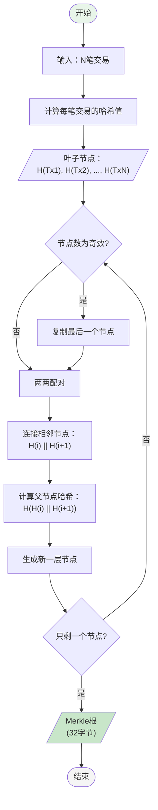

# 比特币系统用到的密码学原理

## 1. 密码学在比特币中的作用

比特币系统的安全性建立在密码学基础之上，主要用于：
- **身份验证**：证明交易发起者确实拥有对应的比特币
- **数据完整性**：确保交易数据在传输过程中不被篡改
- **不可抵赖性**：交易一旦发出，发送者无法否认
- **隐私保护**：通过地址而非真实身份进行交易

## 2. 哈希函数（Hash Function）

### 2.1 什么是哈希函数

哈希函数是一种单向函数，将任意长度的输入数据转换成固定长度的输出（哈希值）。

**特性**：
- **确定性**：相同输入总是产生相同输出
- **雪崩效应**：输入的微小改变导致输出完全不同
- **不可逆性**：无法从哈希值反推原始数据
- **抗碰撞性**：极难找到两个不同输入产生相同哈希值

### 2.2 SHA-256算法

比特币主要使用SHA-256（Secure Hash Algorithm 256-bit）算法：

```python
import hashlib

def sha256_hash(data):
    """SHA-256哈希示例"""
    return hashlib.sha256(data.encode()).hexdigest()

# 示例
message = "Hello Bitcoin"
hash_value = sha256_hash(message)
print(f"原文: {message}")
print(f"SHA-256: {hash_value}")
# 输出: 7ae26e64679abd24e5e39db4126575ba5722b89b324ce96ff572e3e9e0c4e9d3
```

### 2.3 比特币中的应用

#### 工作量证明（Proof of Work）

**什么是工作量证明？**

工作量证明是比特币的核心共识机制，它要求矿工通过消耗计算资源来证明自己付出了工作量，从而获得记账权和区块奖励。这个机制解决了分布式系统中的拜占庭将军问题，确保网络安全。

**工作量证明的作用：**

1. **防止双花攻击**：攻击者需要拥有超过51%的算力才能篡改交易
2. **实现去中心化共识**：无需中央权威即可达成全网共识
3. **控制货币发行速度**：通过难度调整保持约10分钟产生一个区块
4. **防止垃圾交易泛滥**：发起攻击需要付出真实的计算成本
5. **公平分配记账权**：算力越大，获得记账权的概率越高

**核心概念解释：**

- **block_data**：区块数据，包含区块头信息和交易列表的序列化数据
- **difficulty**：难度值，表示哈希值需要满足的条件（前导零的个数）
- **nonce**：随机数（Number Used Once），矿工不断调整这个值来寻找有效哈希
- **target**：目标值，哈希结果必须小于这个值才算有效

**工作量证明流程图：**


**关键说明：**
- **Nonce（Number Used Once）**：一个32位整数（0到4,294,967,295），矿工不断尝试不同的值
- **双重SHA256**：比特币使用两次SHA256哈希来增强安全性，防止长度扩展攻击
- **目标值**：由难度决定的256位数字，哈希结果必须小于此值才有效。难度越高，目标值越小
- **挖矿成功条件**：找到的哈希值在数值上小于目标值，相当于哈希值有足够多的前导零
- **失败处理**：如果尝试完所有Nonce都没找到，需要调整时间戳或交易顺序重新开始

**难度调整机制流程图：**


**关键说明：**
- **调整周期**：每2016个区块调整一次，按10分钟/块计算约为14天
- **目标时间**：2016个区块的目标时间是20160分钟（14天）
- **调整限制**：为防止难度剧烈波动，单次调整最多4倍或1/4
- **计算公式**：新难度 = 旧难度 × (实际时间 / 目标时间)
- **目的**：确保平均出块时间稳定在10分钟，不受全网算力变化影响

**挖矿竞争过程图：**


**关键说明：**
- **并行竞争**：全球所有矿工同时尝试解决同一个数学难题，互不干扰
- **胜者通吃**：第一个找到有效Nonce的矿工获得全部奖励，其他矿工的努力作废
- **立即广播**：找到有效区块后必须尽快广播，否则可能被其他矿工的区块取代
- **验证机制**：其他矿工收到新区块后会验证其有效性，包括工作量证明和交易合法性
- **激励机制**：成功的矿工获得固定区块奖励（目前6.25 BTC）加上区块内所有交易费

**工作量证明安全性分析图：**


**关键说明：**
- **51%攻击**：攻击者需要控制超过50%的算力才能长期控制区块链
- **概率计算**：攻击成功概率随确认数增加呈指数下降，6个确认后几乎不可能被逆转
- **最长链原则**：比特币网络始终认可累积工作量最大（通常是最长）的链为有效链
- **经济成本**：发起51%攻击需要巨大的硬件和电力成本，通常不划算
- **双花攻击**：攻击者试图花费同一笔钱两次，需要创建分叉链并使其成为最长链

**Nonce搜索空间示意图：**


**关键说明：**
- **搜索空间**：32位Nonce提供约43亿种可能，现代矿机几秒内可尝试完
- **线性搜索**：从0开始依次尝试，没有捷径可走，必须暴力计算
- **额外随机性**：Nonce空间耗尽后，可调整时间戳（每秒更新）或Coinbase交易的额外数据字段
- **概率特性**：每次尝试都是独立事件，找到有效哈希的概率相同
- **硬件优化**：ASIC矿机可并行尝试多个Nonce，大幅提高搜索速度

```python
import hashlib
import time
import struct

def detailed_pow(block_header, target_bits):
    """
    详细的工作量证明实现

    参数：
    - block_header: 区块头数据（包含版本、前块哈希、Merkle根、时间戳等）
    - target_bits: 压缩形式的目标难度值（比特币使用的格式）

    返回：
    - nonce: 找到的有效随机数
    - hash_result: 满足条件的哈希值
    - attempts: 尝试次数
    """

    # 将压缩的目标值转换为完整的256位目标值
    def bits_to_target(bits):
        """将比特币的bits格式转换为目标值"""
        exponent = bits >> 24
        mantissa = bits & 0xffffff
        target = mantissa * (256 ** (exponent - 3))
        return target

    target = bits_to_target(target_bits)
    max_target = 0xffff * (256 ** (0x1d - 3))  # 比特币最大目标值
    difficulty = max_target / target  # 计算难度

    print(f"目标值: {hex(target)}")
    print(f"难度: {difficulty:.2f}")
    print(f"预计需要尝试次数: {2**256 / target:.0f}")

    nonce = 0
    start_time = time.time()
    attempts = 0

    while nonce < 2**32:  # nonce是32位整数
        # 构建完整的区块头（80字节）
        header_with_nonce = block_header + struct.pack('<I', nonce)

        # 双重SHA256哈希
        first_hash = hashlib.sha256(header_with_nonce).digest()
        second_hash = hashlib.sha256(first_hash).digest()

        # 将哈希结果转换为整数（注意字节序）
        hash_int = int.from_bytes(second_hash, 'little')

        attempts += 1

        # 检查是否满足难度要求
        if hash_int < target:
            elapsed_time = time.time() - start_time
            hash_rate = attempts / elapsed_time

            print(f"\n✓ 找到有效区块!")
            print(f"  Nonce: {nonce}")
            print(f"  哈希值: {second_hash[::-1].hex()}")
            print(f"  尝试次数: {attempts}")
            print(f"  耗时: {elapsed_time:.2f}秒")
            print(f"  算力: {hash_rate:.0f} H/s")

            return nonce, second_hash[::-1].hex(), attempts

        # 每100000次尝试打印一次进度
        if attempts % 100000 == 0:
            elapsed = time.time() - start_time
            rate = attempts / elapsed
            print(f"尝试 {attempts} 次, 速率: {rate:.0f} H/s", end='\r')

        nonce += 1

    return None, None, attempts

# 模拟真实的区块头结构
class BlockHeader:
    """区块头结构（80字节）"""
    def __init__(self):
        self.version = 0x20000000  # 版本号（4字节）
        self.prev_block = '00' * 32  # 前一个区块哈希（32字节）
        self.merkle_root = '00' * 32  # Merkle树根（32字节）
        self.timestamp = int(time.time())  # 时间戳（4字节）
        self.bits = 0x1d00ffff  # 难度目标（4字节）
        # nonce 将在挖矿时添加（4字节）

    def serialize(self):
        """序列化区块头（不包含nonce）"""
        result = struct.pack('<I', self.version)
        result += bytes.fromhex(self.prev_block)[::-1]
        result += bytes.fromhex(self.merkle_root)[::-1]
        result += struct.pack('<I', self.timestamp)
        result += struct.pack('<I', self.bits)
        return result

# 难度调整算法
def adjust_difficulty(prev_bits, time_taken, target_time=600):
    """
    难度调整算法（简化版）

    参数：
    - prev_bits: 上一个难度值
    - time_taken: 实际花费的时间（秒）
    - target_time: 目标时间（默认600秒=10分钟）

    比特币每2016个区块（约14天）调整一次难度
    """
    # 限制调整幅度（最多4倍或1/4）
    if time_taken < target_time / 4:
        time_taken = target_time / 4
    elif time_taken > target_time * 4:
        time_taken = target_time * 4

    # 计算新难度
    new_target = (prev_bits * time_taken) / target_time

    # 确保不超过最大难度（最小目标值）
    max_target = 0xffff * (256 ** (0x1d - 3))
    if new_target > max_target:
        new_target = max_target

    return int(new_target)

# 演示简化版工作量证明
def simple_pow_with_explanation():
    """带详细解释的简化工作量证明"""

    print("=== 工作量证明演示 ===\n")

    # 模拟区块数据
    block_data = {
        'block_height': 700000,
        'transactions': ['tx1_hash', 'tx2_hash', 'tx3_hash'],
        'prev_hash': '0000000000000000000a1b2c3d4e5f',
        'timestamp': time.time()
    }

    # 将区块数据序列化为字符串
    block_string = str(block_data)

    print(f"区块数据: {block_string[:50]}...")
    print(f"难度要求: 哈希值前4位必须为0\n")

    nonce = 0
    found = False
    start_time = time.time()

    while not found:
        # 步骤1：将nonce添加到区块数据
        candidate = f"{block_string}{nonce}"

        # 步骤2：计算SHA256哈希
        hash_result = hashlib.sha256(candidate.encode()).hexdigest()

        # 步骤3：检查是否满足难度要求
        if hash_result.startswith('0000'):
            elapsed = time.time() - start_time
            print(f"✓ 成功找到有效哈希!")
            print(f"  Nonce值: {nonce}")
            print(f"  哈希结果: {hash_result}")
            print(f"  耗时: {elapsed:.3f}秒")
            print(f"  尝试次数: {nonce + 1}")
            found = True
        else:
            # 显示前几次尝试
            if nonce < 3:
                print(f"尝试 {nonce}: {hash_result[:10]}... ✗")

        nonce += 1

    return nonce - 1, hash_result

# 示例：展示不同难度的影响
def demonstrate_difficulty_levels():
    """演示不同难度级别的影响"""

    print("\n=== 不同难度级别的比较 ===\n")

    test_data = "Test Block #12345"
    difficulties = [1, 2, 3, 4, 5]

    for diff in difficulties:
        start = time.time()
        nonce = 0
        target = '0' * diff

        while True:
            candidate = f"{test_data}{nonce}"
            hash_result = hashlib.sha256(candidate.encode()).hexdigest()

            if hash_result.startswith(target):
                elapsed = time.time() - start
                print(f"难度 {diff} (前{diff}个0):")
                print(f"  尝试次数: {nonce + 1}")
                print(f"  耗时: {elapsed:.4f}秒")
                print(f"  哈希: {hash_result[:20]}...")
                print(f"  预期尝试次数: {16**diff}")
                print()
                break

            nonce += 1

            # 防止运行时间过长
            if nonce > 10000000:
                print(f"难度 {diff}: 超过1000万次尝试，跳过")
                break

# 使用示例
if __name__ == "__main__":
    # 1. 简单演示
    simple_pow_with_explanation()

    # 2. 展示难度级别
    demonstrate_difficulty_levels()

    # 3. 模拟真实区块头挖矿（使用较低难度）
    header = BlockHeader()
    header.bits = 0x1e0fffff  # 较低的难度值
    detailed_pow(header.serialize(), header.bits)
```


#### Merkle树（Merkle Tree）

**什么是Merkle树？**

Merkle树，又称哈希树，是由计算机科学家Ralph Merkle在1979年发明的一种二叉树数据结构。它通过哈希算法将大量数据"浓缩"成一个固定大小的根哈希值，实现了高效的数据完整性验证。

**Merkle树在比特币中的作用：**

1. **高效验证交易**：SPV（简化支付验证）节点无需下载整个区块，只需区块头和Merkle路径即可验证交易
2. **节省存储空间**：区块头只需存储32字节的Merkle根，而非所有交易哈希
3. **数据完整性保护**：任何交易的篡改都会导致Merkle根变化，立即被发现
4. **支持轻量级客户端**：手机钱包等轻客户端可以安全地验证交易
5. **并行计算优化**：树的不同分支可以并行计算，提高效率

**Merkle树构建流程图：**



**关键说明：**
- **二叉树结构**：每个非叶子节点都是其两个子节点哈希值连接后的哈希
- **奇数处理**：如果某层节点数为奇数，最后一个节点会被复制与自己配对
- **递归构建**：从叶子节点开始，逐层向上计算，直到只剩一个根节点
- **固定大小**：无论有多少交易，Merkle根始终是32字节（256位）
- **|| 符号**：表示字符串连接操作，将两个哈希值拼接在一起

**Merkle树结构示意图：**


**关键说明：**
- **层次结构**：以8笔交易为例，需要3层（log₂8=3）即可得到Merkle根
- **节点命名**：H0表示第0笔交易的哈希，H01表示H0和H1连接后的哈希
- **二进制树**：每个父节点恰好有两个子节点（最后一个可能是复制的）
- **验证路径**：验证任意交易只需要log₂N个哈希值，而不是全部N个
- **树的高度**：N笔交易的Merkle树高度为⌈log₂N⌉

**SPV验证流程图：**


**关键说明：**
- **SPV（简化支付验证）**：轻量级客户端只需下载区块头（80字节），不需要完整区块
- **Merkle路径**：从叶子节点到根的路径上所需的兄弟节点哈希值
- **验证步骤**：从交易哈希开始，逐层与路径中的哈希值组合计算，最终得到根
- **安全性**：只要区块头是可信的（通过工作量证明），就能确信交易在区块中
- **效率对比**：验证一笔交易只需约10个哈希（1000笔交易的情况），而非1000个

**Merkle路径生成示意图：**


**关键说明：**
- **路径构建**：验证Tx3需要其兄弟节点H2，父节点的兄弟H01，以及祖父节点的兄弟H4567
- **红色节点**：表示验证过程中需要的辅助哈希值（由全节点提供）
- **绿色节点**：要验证的目标交易
- **黄色节点**：Merkle根，最终计算结果需要与此匹配
- **路径长度**：对于N笔交易，路径长度为⌈log₂N⌉个哈希值

**空间效率对比图：**


**关键说明：**
- **全节点方式**：需要下载完整区块（约1-2MB），包含所有交易数据
- **SPV方式**：只需区块头（80字节）加Merkle证明路径（约320字节）
- **存储需求**：SPV节点只需存储区块头链，约50MB/年
- **带宽节省**：验证单笔交易只需约400字节，而非1MB+
- **适用场景**：手机钱包、物联网设备等资源受限环境

**Merkle树在比特币中的应用流程：**


**关键说明：**
- **交易选择**：矿工按手续费率从高到低选择交易，maximizing收益
- **Coinbase交易**：第一笔特殊交易，包含区块奖励和所有交易费
- **Merkle根作用**：32字节代表所有交易，放入80字节的区块头中
- **挖矿过程**：Merkle根固定后才开始挖矿，改变交易需要重新计算
- **验证重要性**：其他节点必须验证Merkle根的正确性，防止虚假交易

**Merkle树的构建过程：**

```python
import hashlib
import math
from typing import List, Tuple, Optional

class MerkleTree:
    """
    完整的Merkle树实现

    Merkle树构建规则：
    1. 叶子节点是交易的哈希值
    2. 非叶子节点是其两个子节点连接后的哈希值
    3. 如果节点数为奇数，最后一个节点会被复制
    """

    def __init__(self, transactions: List[str]):
        """
        初始化Merkle树

        参数：
        - transactions: 交易列表（可以是交易ID或原始交易数据）
        """
        self.transactions = transactions
        self.leaves = []  # 叶子节点（交易哈希）
        self.levels = []  # 所有层级的节点
        self.root = None  # Merkle根
        self.is_ready = False

        # 构建树
        self.build_tree()

    def double_sha256(self, data: bytes) -> bytes:
        """双重SHA256哈希（比特币标准）"""
        if isinstance(data, str):
            data = data.encode('utf-8')
        first_hash = hashlib.sha256(data).digest()
        second_hash = hashlib.sha256(first_hash).digest()
        return second_hash

    def build_tree(self):
        """构建完整的Merkle树"""
        if not self.transactions:
            return

        # 步骤1：创建叶子节点（交易哈希）
        self.leaves = []
        for tx in self.transactions:
            if isinstance(tx, str):
                tx_hash = self.double_sha256(tx.encode())
            else:
                tx_hash = self.double_sha256(tx)
            self.leaves.append(tx_hash)

        # 如果只有一笔交易，根就是这笔交易的哈希
        if len(self.leaves) == 1:
            self.root = self.leaves[0]
            self.levels = [self.leaves]
            self.is_ready = True
            return

        # 步骤2：逐层构建树
        self.levels = [self.leaves[:]]  # 第0层是叶子节点
        current_level = self.leaves[:]

        while len(current_level) > 1:
            next_level = []

            # 如果当前层节点数为奇数，复制最后一个
            if len(current_level) % 2 == 1:
                current_level.append(current_level[-1])

            # 两两配对，计算父节点哈希
            for i in range(0, len(current_level), 2):
                left_child = current_level[i]
                right_child = current_level[i + 1]

                # 父节点 = Hash(左子节点 + 右子节点)
                combined = left_child + right_child
                parent_hash = self.double_sha256(combined)
                next_level.append(parent_hash)

            self.levels.append(next_level[:])
            current_level = next_level

        # 根节点是最后一层的唯一节点
        self.root = self.levels[-1][0]
        self.is_ready = True

        print(f"✓ Merkle树构建完成")
        print(f"  交易数量: {len(self.transactions)}")
        print(f"  树的高度: {len(self.levels)}")
        print(f"  Merkle根: {self.root.hex()}")

    def get_merkle_path(self, tx_index: int) -> Optional[List[Tuple[str, bytes]]]:
        """
        获取Merkle证明路径（SPV验证所需）

        参数：
        - tx_index: 交易在区块中的索引

        返回：
        - 证明路径：[(方向, 哈希值), ...]
        """
        if not self.is_ready:
            return None

        if tx_index >= len(self.transactions):
            return None

        path = []
        current_index = tx_index

        # 从叶子层开始，向上遍历到根
        for level in range(len(self.levels) - 1):
            current_level = self.levels[level]

            # 处理奇数个节点的情况
            level_size = len(current_level)
            if level_size % 2 == 1 and current_index == level_size - 1:
                # 最后一个节点被复制，兄弟是自己
                sibling = current_level[current_index]
                path.append(('self', sibling))
            else:
                # 找到兄弟节点
                if current_index % 2 == 0:
                    # 当前是左节点，兄弟是右节点
                    sibling_index = current_index + 1
                    direction = 'right'
                else:
                    # 当前是右节点，兄弟是左节点
                    sibling_index = current_index - 1
                    direction = 'left'

                if sibling_index < len(current_level):
                    sibling = current_level[sibling_index]
                    path.append((direction, sibling))

            # 移动到父节点
            current_index = current_index // 2

        return path

    def verify_transaction(self, tx_index: int, tx_hash: bytes,
                          merkle_path: List[Tuple[str, bytes]]) -> bool:
        """
        验证交易是否在区块中（SPV验证）

        参数：
        - tx_index: 交易索引
        - tx_hash: 交易哈希
        - merkle_path: Merkle证明路径

        返回：
        - True如果验证通过，False否则
        """
        if not merkle_path:
            return False

        current_hash = tx_hash

        # 沿着路径向上计算到根
        for direction, sibling_hash in merkle_path:
            if direction == 'left':
                # 兄弟在左边
                combined = sibling_hash + current_hash
            elif direction == 'right':
                # 兄弟在右边
                combined = current_hash + sibling_hash
            else:  # direction == 'self'
                # 节点被复制（奇数个节点的情况）
                combined = current_hash + current_hash

            current_hash = self.double_sha256(combined)

        # 检查计算出的根是否匹配
        return current_hash == self.root

    def visualize_tree(self):
        """可视化打印Merkle树结构"""
        if not self.is_ready:
            print("树尚未构建")
            return

        print("\n=== Merkle树结构 ===\n")

        # 从根开始打印
        for level_idx in range(len(self.levels) - 1, -1, -1):
            level = self.levels[level_idx]
            level_name = "根" if level_idx == len(self.levels) - 1 else f"第{level_idx}层"

            print(f"{level_name}:")
            for i, node in enumerate(level):
                # 显示节点哈希的前8个字符
                node_str = node.hex()[:8]
                print(f"  [{i}] {node_str}...")
            print()

# SPV（简化支付验证）示例
class SPVClient:
    """
    SPV客户端实现

    SPV客户端只需要：
    1. 区块头（80字节）
    2. Merkle证明路径
    就可以验证交易是否被包含在区块中
    """

    def __init__(self):
        self.block_headers = {}  # 存储区块头
        self.verified_transactions = set()

    def verify_transaction_spv(self, tx_hash: str, block_header: dict,
                              merkle_path: List[Tuple[str, bytes]]) -> bool:
        """
        SPV验证交易

        参数：
        - tx_hash: 要验证的交易哈希
        - block_header: 区块头信息（包含merkle_root）
        - merkle_path: Merkle证明路径
        """
        # 从交易哈希开始
        if isinstance(tx_hash, str):
            current_hash = bytes.fromhex(tx_hash)
        else:
            current_hash = tx_hash

        # 沿着Merkle路径计算
        for direction, sibling in merkle_path:
            if direction == 'left':
                combined = sibling + current_hash
            elif direction == 'right':
                combined = current_hash + sibling
            else:
                combined = current_hash + current_hash

            # 双重SHA256
            first = hashlib.sha256(combined).digest()
            current_hash = hashlib.sha256(first).digest()

        # 验证计算出的根是否匹配区块头中的Merkle根
        merkle_root_in_header = bytes.fromhex(block_header['merkle_root'])

        if current_hash == merkle_root_in_header:
            print("✓ SPV验证通过：交易确实在区块中")
            self.verified_transactions.add(tx_hash)
            return True
        else:
            print("✗ SPV验证失败：交易不在区块中")
            return False

    def calculate_proof_size(self, num_transactions: int) -> dict:
        """
        计算Merkle证明的大小

        对于n笔交易，证明大小为 log2(n) * 32 字节
        """
        tree_height = math.ceil(math.log2(num_transactions)) if num_transactions > 0 else 0
        proof_size = tree_height * 32  # 每层一个32字节的哈希

        # 完整区块大小（假设平均每笔交易250字节）
        full_block_size = num_transactions * 250

        # 节省的空间
        space_saved = full_block_size - proof_size
        savings_percent = (space_saved / full_block_size * 100) if full_block_size > 0 else 0

        return {
            'num_transactions': num_transactions,
            'tree_height': tree_height,
            'proof_size_bytes': proof_size,
            'full_block_size_bytes': full_block_size,
            'space_saved_bytes': space_saved,
            'savings_percent': savings_percent
        }

# 演示Merkle树的实际应用
def demonstrate_merkle_tree():
    """完整演示Merkle树的构建和验证"""

    print("=== Merkle树演示 ===\n")

    # 1. 创建一些模拟交易
    transactions = [
        "Alice->Bob:10BTC",
        "Bob->Charlie:5BTC",
        "Charlie->David:3BTC",
        "David->Eve:2BTC",
        "Eve->Frank:1BTC",
        "Frank->Grace:0.5BTC",
        "Grace->Henry:0.3BTC"
    ]

    print(f"区块包含 {len(transactions)} 笔交易:")
    for i, tx in enumerate(transactions):
        print(f"  [{i}] {tx}")
    print()

    # 2. 构建Merkle树
    merkle_tree = MerkleTree(transactions)
    merkle_tree.visualize_tree()

    # 3. 为某笔交易生成Merkle证明
    tx_index = 2  # Charlie->David:3BTC
    print(f"\n为交易 [{tx_index}] '{transactions[tx_index]}' 生成Merkle证明...")

    merkle_path = merkle_tree.get_merkle_path(tx_index)

    if merkle_path:
        print(f"Merkle证明路径（{len(merkle_path)}步）:")
        for i, (direction, hash_val) in enumerate(merkle_path):
            print(f"  步骤{i+1}: 与{direction}侧的 {hash_val.hex()[:8]}... 组合")

    # 4. SPV验证
    print("\n--- SPV客户端验证 ---")
    spv_client = SPVClient()

    # 模拟区块头（实际中从网络获取）
    block_header = {
        'version': 2,
        'prev_block': '00' * 32,
        'merkle_root': merkle_tree.root.hex(),
        'timestamp': 1234567890,
        'bits': 0x1d00ffff,
        'nonce': 123456
    }

    # 计算交易哈希
    tx_hash = merkle_tree.double_sha256(transactions[tx_index].encode())

    # SPV验证
    is_valid = spv_client.verify_transaction_spv(
        tx_hash.hex(),
        block_header,
        merkle_path
    )

    # 5. 展示空间节省
    print("\n--- 空间效率分析 ---")
    for num_tx in [10, 100, 1000, 10000, 100000]:
        stats = spv_client.calculate_proof_size(num_tx)
        print(f"交易数: {num_tx:6d}")
        print(f"  Merkle证明大小: {stats['proof_size_bytes']:,} 字节")
        print(f"  完整区块大小: {stats['full_block_size_bytes']:,} 字节")
        print(f"  节省空间: {stats['savings_percent']:.2f}%")
        print()

# 比特币区块实例分析
def analyze_bitcoin_block_example():
    """分析真实的比特币区块Merkle树示例"""

    print("\n=== 比特币区块 #100000 的Merkle树分析 ===\n")

    # 这是比特币区块 #100000 的部分真实数据（简化）
    block_100000 = {
        'height': 100000,
        'hash': '000000000003ba27aa200b1cecaad478d2b00432346c3f1f3986da1afd33e506',
        'merkle_root': 'f3e94742aca4b5ef85488dc37c06c3282295ffec960994b2c0d5ac2a25a95766',
        'num_transactions': 4,
        'transactions': [
            # Coinbase交易
            '8c14f0db3df150123e6f3dbbf30f8b955a8249b62ac1d1ff16284aefa3d06d87',
            # 普通交易
            'fff2525b8931402dd09222c50775608f75787bd2b87e56995a7bdd30f79702c4',
            '6359f0868171b1d194cbee1af2e64b8e5c4c243b1c8aa8b6821e6c9e6c8e5e5e',
            'e9a66845e05d5abc0ad04cde4e5e29f7e5e29f7e5e29f7e5e29f7e5e29f7e5e2'
        ]
    }

    print(f"区块高度: {block_100000['height']}")
    print(f"区块哈希: {block_100000['hash'][:16]}...")
    print(f"交易数量: {block_100000['num_transactions']}")
    print(f"Merkle根: {block_100000['merkle_root']}")
    print()

    # 构建这个区块的Merkle树
    merkle_tree = MerkleTree(block_100000['transactions'])

    # 验证Merkle根是否匹配
    calculated_root = merkle_tree.root.hex()
    print(f"计算得到的Merkle根: {calculated_root}")

    # 注意：这里的根可能不匹配，因为示例数据是简化的
    # 在实际比特币中，交易需要先进行特定的序列化

# 使用示例
if __name__ == "__main__":
    # 1. 基础演示
    demonstrate_merkle_tree()

    # 2. 分析真实区块
    analyze_bitcoin_block_example()
```

## 3. 非对称加密

### 3.1 椭圆曲线密码学（ECC）

比特币使用椭圆曲线数字签名算法（ECDSA），具体采用secp256k1曲线。

**椭圆曲线方程**：
```
y² = x³ + 7 (mod p)
其中 p = 2²⁵⁶ - 2³² - 977
```

### 3.2 公钥和私钥

#### 密钥生成过程

1. **私钥生成**：随机选择一个256位的数字
2. **公钥生成**：私钥 × G（基点）= 公钥

```python
import secrets
from ecdsa import SigningKey, SECP256k1

def generate_keypair():
    """生成比特币密钥对"""
    # 生成私钥（256位随机数）
    private_key = SigningKey.generate(curve=SECP256k1)

    # 从私钥导出公钥
    public_key = private_key.get_verifying_key()

    return private_key, public_key

# 示例
priv_key, pub_key = generate_keypair()
print(f"私钥长度: {len(priv_key.to_string())} bytes")
print(f"公钥长度: {len(pub_key.to_string())} bytes")
```

### 3.3 比特币地址生成

从公钥到比特币地址的转换过程：

```python
import hashlib
import base58

def public_key_to_address(public_key):
    """将公钥转换为比特币地址"""
    # 1. SHA-256哈希
    sha256_hash = hashlib.sha256(public_key).digest()

    # 2. RIPEMD-160哈希
    ripemd160 = hashlib.new('ripemd160')
    ripemd160.update(sha256_hash)
    public_key_hash = ripemd160.digest()

    # 3. 添加版本前缀（0x00表示主网）
    versioned_key = b'\x00' + public_key_hash

    # 4. 双重SHA-256获取校验和
    checksum = hashlib.sha256(
        hashlib.sha256(versioned_key).digest()
    ).digest()[:4]

    # 5. 拼接并进行Base58编码
    address_bytes = versioned_key + checksum
    address = base58.b58encode(address_bytes)

    return address.decode('utf-8')
```

**地址生成流程图**：
```
公钥 → SHA-256 → RIPEMD-160 → 添加版本号 →
双SHA-256(前4字节作为校验和) → Base58编码 → 比特币地址
```

## 4. 数字签名

### 4.1 签名过程

使用私钥对交易进行签名：

```python
def sign_transaction(private_key, transaction_data):
    """签名交易"""
    # 1. 对交易数据进行哈希
    tx_hash = hashlib.sha256(transaction_data.encode()).digest()

    # 2. 使用私钥签名
    signature = private_key.sign(tx_hash)

    return signature

def verify_signature(public_key, signature, transaction_data):
    """验证签名"""
    # 1. 对交易数据进行哈希
    tx_hash = hashlib.sha256(transaction_data.encode()).digest()

    # 2. 使用公钥验证
    try:
        public_key.verify(signature, tx_hash)
        return True
    except:
        return False
```

### 4.2 交易脚本

比特币使用脚本语言来验证交易：

#### P2PKH（Pay to Public Key Hash）
最常见的交易类型：

**锁定脚本（scriptPubKey）**：
```
OP_DUP OP_HASH160 <公钥哈希> OP_EQUALVERIFY OP_CHECKSIG
```

**解锁脚本（scriptSig）**：
```
<签名> <公钥>
```

**验证过程**：
1. 将解锁脚本和锁定脚本组合
2. 按顺序执行操作码
3. 最终栈顶为True则验证通过

## 5. 零知识证明

### 5.1 概念

零知识证明允许证明者向验证者证明某个陈述是真的，而无需透露任何其他信息。

### 5.2 在区块链中的应用

虽然比特币本身不使用零知识证明，但其他区块链项目（如Zcash）使用zk-SNARKs实现隐私交易：

```python
class SimpleZKProof:
    """简化的零知识证明示例"""

    def prove_knowledge_of_secret(self, secret):
        """证明知道秘密，但不透露秘密本身"""
        # 生成承诺
        commitment = hashlib.sha256(secret.encode()).hexdigest()

        # 生成挑战和响应
        challenge = secrets.token_hex(16)
        response = hashlib.sha256(
            (secret + challenge).encode()
        ).hexdigest()

        return {
            'commitment': commitment,
            'challenge': challenge,
            'response': response
        }

    def verify_proof(self, proof, secret_hash):
        """验证证明"""
        # 验证承诺是否匹配
        return proof['commitment'] == secret_hash
```

## 6. 密码学安全性分析

### 6.1 量子计算威胁

量子计算机对比特币密码学的潜在威胁：

| 算法类型 | 当前安全性 | 量子威胁等级 | 影响 |
|---------|----------|------------|------|
| SHA-256 | 256位 | 中等 | Grover算法可将搜索空间减少到128位 |
| ECDSA | 256位 | 高 | Shor算法可在多项式时间内破解 |
| RIPEMD-160 | 160位 | 中等 | 搜索空间减少到80位 |

### 6.2 应对措施

1. **后量子密码学**：研究抗量子计算攻击的新算法
2. **多重签名**：增加安全层级
3. **定期更新地址**：减少公钥暴露时间

## 7. 实践建议

### 7.1 私钥管理

```python
class SecureWallet:
    """安全钱包示例"""

    def __init__(self):
        self.encrypted_keys = {}

    def generate_new_address(self, password):
        """生成新地址并加密存储私钥"""
        # 生成密钥对
        private_key = secrets.token_hex(32)

        # 使用密码派生密钥加密私钥
        encryption_key = hashlib.pbkdf2_hmac(
            'sha256',
            password.encode(),
            b'salt',  # 实际应用中应使用随机盐
            100000
        )

        # 这里简化了加密过程
        encrypted = self._encrypt(private_key, encryption_key)

        # 生成地址
        address = self._derive_address(private_key)

        self.encrypted_keys[address] = encrypted
        return address

    def _encrypt(self, data, key):
        """加密函数（简化示例）"""
        # 实际应使用AES等对称加密算法
        return hashlib.sha256((data + key.hex()).encode()).hexdigest()

    def _derive_address(self, private_key):
        """从私钥导出地址（简化）"""
        return hashlib.sha256(private_key.encode()).hexdigest()[:34]
```

### 7.2 安全最佳实践

1. **冷存储**：大额资金使用离线钱包
2. **多重签名**：重要交易需要多个密钥授权
3. **硬件钱包**：使用专用硬件设备存储私钥
4. **定期备份**：加密备份助记词和私钥
5. **地址隔离**：不同用途使用不同地址

## 8. 总结

比特币的密码学基础包括：

1. **哈希函数**：确保数据完整性和工作量证明
2. **非对称加密**：实现安全的价值转移
3. **数字签名**：验证交易合法性
4. **地址系统**：提供一定程度的隐私保护

这些密码学原理共同构成了比特币去中心化、安全、可信的基础。理解这些原理对于深入学习区块链技术至关重要。

## 参考资料

- [Bitcoin Whitepaper](https://bitcoin.org/bitcoin.pdf)
- [Mastering Bitcoin](https://github.com/bitcoinbook/bitcoinbook)
- [secp256k1 Specification](https://www.secg.org/sec2-v2.pdf)
- [ECDSA Algorithm](https://en.wikipedia.org/wiki/Elliptic_Curve_Digital_Signature_Algorithm)