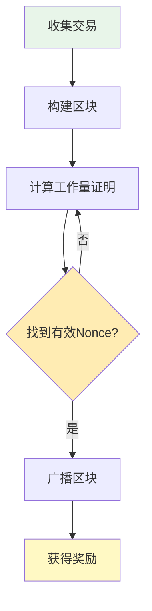
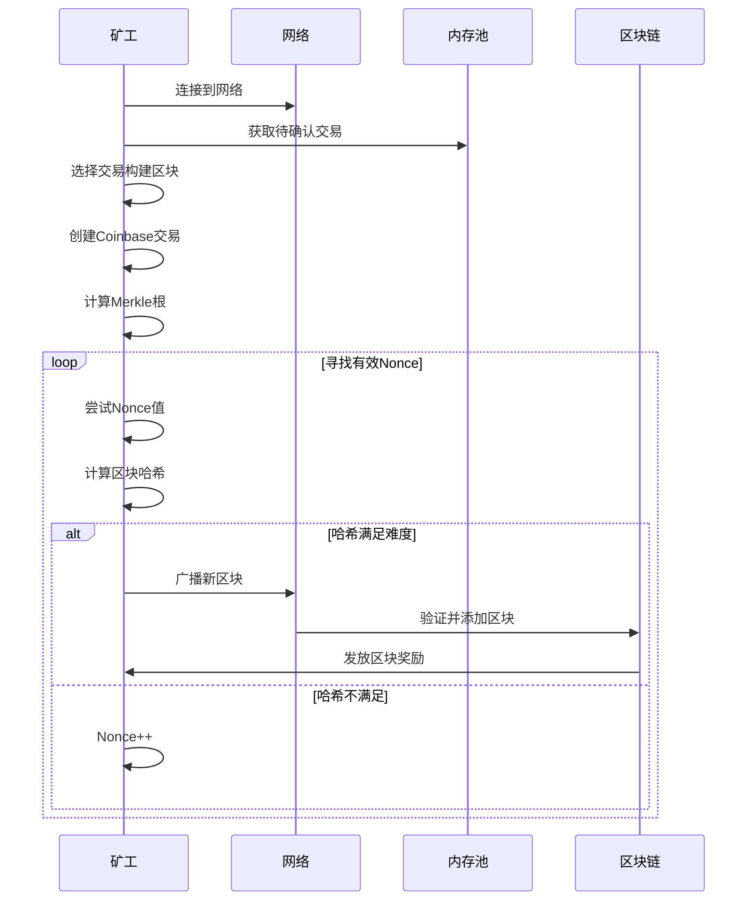

---
title: 比特币挖矿原理
date: 2025-09-29
categories:
  - Technology
  - Learning
---

# 比特币挖矿原理

## 1. 挖矿概述

### 1.1 什么是挖矿？

比特币挖矿是通过解决计算难题来验证交易并将其记录到区块链上的过程。矿工通过提供算力来维护网络安全，并获得区块奖励和交易手续费作为回报。



### 1.2 挖矿的作用

1. **交易验证**：确认交易合法性
2. **网络安全**：通过工作量证明防止攻击
3. **货币发行**：新比特币通过挖矿产生
4. **去中心化**：任何人都可以参与挖矿
5. **共识机制**：决定哪些交易被记录

## 2. 工作量证明（Proof of Work）

### 2.1 PoW原理

```python
import hashlib
import time

class ProofOfWork:
    """
    工作量证明实现
    """
    
    def __init__(self, block, difficulty):
        self.block = block
        self.difficulty = difficulty
        self.target = self.calculate_target()
    
    def calculate_target(self):
        """
        计算目标值
        难度越高，目标值越小
        """
        max_target = 2**256 - 1
        target = max_target // self.difficulty
        return target
    
    def mine(self):
        """
        挖矿过程
        """
        nonce = 0
        start_time = time.time()
        
        while nonce < 2**32:
            # 构建区块头
            block_header = self.serialize_header(nonce)
            
            # 双重SHA256
            hash_result = hashlib.sha256(
                hashlib.sha256(block_header).digest()
            ).digest()
            
            # 转换为整数比较
            hash_int = int.from_bytes(hash_result, 'big')
            
            if hash_int < self.target:
                elapsed = time.time() - start_time
                hash_rate = nonce / elapsed
                
                return {
                    'nonce': nonce,
                    'hash': hash_result.hex(),
                    'attempts': nonce,
                    'time': elapsed,
                    'hashrate': hash_rate
                }
            
            nonce += 1
        
        return None  # 未找到
    
    def serialize_header(self, nonce):
        """
        序列化区块头
        """
        header = (
            self.block['version'].to_bytes(4, 'little') +
            bytes.fromhex(self.block['prev_hash'])[::-1] +
            bytes.fromhex(self.block['merkle_root'])[::-1] +
            self.block['timestamp'].to_bytes(4, 'little') +
            self.block['bits'].to_bytes(4, 'little') +
            nonce.to_bytes(4, 'little')
        )
        return header
```

### 2.2 难度调整算法

```python
class DifficultyAdjustment:
    """
    难度调整算法
    """
    
    # 常量
    TARGET_BLOCK_TIME = 600  # 10分钟
    ADJUSTMENT_INTERVAL = 2016  # 每2016个区块调整
    MAX_ADJUSTMENT = 4  # 最大调整倍数
    
    @staticmethod
    def adjust_difficulty(current_difficulty, actual_time):
        """
        调整难度
        
        参数：
        - current_difficulty: 当前难度
        - actual_time: 实际出块时间（秒）
        """
        target_time = DifficultyAdjustment.TARGET_BLOCK_TIME * \
                     DifficultyAdjustment.ADJUSTMENT_INTERVAL
        
        # 限制调整范围
        if actual_time < target_time / DifficultyAdjustment.MAX_ADJUSTMENT:
            actual_time = target_time / DifficultyAdjustment.MAX_ADJUSTMENT
        elif actual_time > target_time * DifficultyAdjustment.MAX_ADJUSTMENT:
            actual_time = target_time * DifficultyAdjustment.MAX_ADJUSTMENT
        
        # 计算新难度
        new_difficulty = current_difficulty * actual_time / target_time
        
        return int(new_difficulty)
    
    @staticmethod
    def bits_to_target(bits):
        """
        将压缩的bits转换为目标值
        """
        exponent = bits >> 24
        mantissa = bits & 0xffffff
        target = mantissa * (256 ** (exponent - 3))
        return target
    
    @staticmethod
    def target_to_bits(target):
        """
        将目标值转换为压缩的bits
        """
        # 转换为字节
        target_bytes = target.to_bytes((target.bit_length() + 7) // 8, 'big')
        
        # 获取前3个字节作为尾数
        if len(target_bytes) > 3:
            mantissa = int.from_bytes(target_bytes[:3], 'big')
            exponent = len(target_bytes)
        else:
            mantissa = target
            exponent = 3
        
        bits = (exponent << 24) | mantissa
        return bits
```

## 3. 挖矿流程详解

### 3.1 完整挖矿流程



### 3.2 矿工实现

```python
class Miner:
    """
    矿工实现
    """
    
    def __init__(self, address, blockchain, mempool):
        self.address = address  # 矿工地址
        self.blockchain = blockchain
        self.mempool = mempool
        self.mining = False
    
    def mine_block(self):
        """
        挖掘一个区块
        """
        # 1. 获取前一个区块
        prev_block = self.blockchain.get_latest_block()
        prev_hash = prev_block.hash
        
        # 2. 从内存池选择交易
        transactions = self.select_transactions()
        
        # 3. 创建Coinbase交易
        coinbase_tx = self.create_coinbase_transaction()
        transactions.insert(0, coinbase_tx)
        
        # 4. 构建Merkle树
        merkle_root = self.calculate_merkle_root(transactions)
        
        # 5. 创建区块
        block = {
            'version': 0x20000000,
            'prev_hash': prev_hash,
            'merkle_root': merkle_root,
            'timestamp': int(time.time()),
            'bits': self.blockchain.get_current_bits(),
            'transactions': transactions
        }
        
        # 6. 开始挖矿
        pow = ProofOfWork(block, self.blockchain.difficulty)
        result = pow.mine()
        
        if result:
            block['nonce'] = result['nonce']
            block['hash'] = result['hash']
            
            # 7. 广播区块
            self.broadcast_block(block)
            
            print(f"挖矿成功！")
            print(f"区块哈希: {result['hash']}")
            print(f"尝试次数: {result['attempts']}")
            print(f"耗时: {result['time']:.2f}秒")
            print(f"算力: {result['hashrate']:.0f} H/s")
            
            return block
        
        return None
    
    def select_transactions(self, max_size=1_000_000):
        """
        选择交易（贪心算法：优先高手续费率）
        """
        transactions = []
        total_size = 0
        total_fee = 0
        
        # 按手续费率排序
        sorted_txs = sorted(
            self.mempool.get_transactions(),
            key=lambda tx: tx.fee_rate,
            reverse=True
        )
        
        for tx in sorted_txs:
            tx_size = len(tx.serialize())
            
            # 检查区块大小限制
            if total_size + tx_size > max_size:
                continue
            
            transactions.append(tx)
            total_size += tx_size
            total_fee += tx.fee
        
        print(f"选择了 {len(transactions)} 笔交易")
        print(f"总手续费: {total_fee} 聪")
        
        return transactions
    
    def create_coinbase_transaction(self):
        """
        创建Coinbase交易
        """
        # 当前区块奖励
        block_reward = self.get_block_reward()
        
        # 收集的交易手续费
        fees = sum(tx.fee for tx in self.mempool.get_transactions())
        
        # 总奖励
        total_reward = block_reward + fees
        
        coinbase_tx = {
            'version': 2,
            'inputs': [{
                'prev_tx': '00' * 32,
                'prev_index': 0xffffffff,
                'script_sig': self.create_coinbase_script(),
                'sequence': 0xffffffff
            }],
            'outputs': [{
                'value': total_reward,
                'script_pubkey': self.address_to_script(self.address)
            }],
            'locktime': 0
        }
        
        return coinbase_tx
    
    def get_block_reward(self):
        """
        获取当前区块奖励
        """
        height = self.blockchain.get_height()
        halvings = height // 210000
        
        # 初始奖励50 BTC，每210000个区块减半
        reward = 50 * (10**8)  # 转换为聪
        reward = reward >> halvings  # 右移实现减半
        
        return reward
    
    def create_coinbase_script(self):
        """
        创建Coinbase脚本（可包含额外数据）
        """
        height = self.blockchain.get_height()
        
        # BIP34: 高度必须包含在Coinbase中
        script = (
            len(height.to_bytes(4, 'little')).to_bytes(1, 'little') +
            height.to_bytes(4, 'little')
        )
        
        # 可以添加额外数据（如矿池标识）
        extra_data = b"Mined by MyPool"
        script += len(extra_data).to_bytes(1, 'little') + extra_data
        
        return script.hex()
```

## 4. 挖矿硬件演进

### 4.1 硬件发展历程

```python
class MiningHardware:
    """
    挖矿硬件性能对比
    """
    
    # 硬件类型及其性能（H/s）
    HARDWARE_SPECS = {
        'CPU': {
            'hashrate': 10_000_000,  # 10 MH/s
            'power': 100,  # 瓦特
            'cost': 500,  # 美元
            'era': '2009-2010'
        },
        'GPU': {
            'hashrate': 1_000_000_000,  # 1 GH/s
            'power': 300,
            'cost': 1000,
            'era': '2010-2013'
        },
        'FPGA': {
            'hashrate': 10_000_000_000,  # 10 GH/s
            'power': 200,
            'cost': 2000,
            'era': '2011-2013'
        },
        'ASIC': {
            'hashrate': 100_000_000_000_000,  # 100 TH/s
            'power': 3000,
            'cost': 10000,
            'era': '2013-至今'
        }
    }
    
    @staticmethod
    def calculate_profitability(hardware_type, btc_price, electricity_cost):
        """
        计算挖矿收益
        
        参数：
        - hardware_type: 硬件类型
        - btc_price: 比特币价格（美元）
        - electricity_cost: 电费（美元/kWh）
        """
        specs = MiningHardware.HARDWARE_SPECS[hardware_type]
        
        # 每天挖矿收益（简化计算）
        network_hashrate = 500_000_000_000_000_000_000  # 500 EH/s
        block_reward = 6.25  # BTC
        blocks_per_day = 144
        
        # 收益计算
        my_share = specs['hashrate'] / network_hashrate
        btc_per_day = my_share * block_reward * blocks_per_day
        revenue = btc_per_day * btc_price
        
        # 成本计算
        power_cost = specs['power'] / 1000 * 24 * electricity_cost
        
        # 净收益
        profit = revenue - power_cost
        
        # 回本时间
        roi_days = specs['cost'] / profit if profit > 0 else float('inf')
        
        return {
            'revenue_per_day': revenue,
            'cost_per_day': power_cost,
            'profit_per_day': profit,
            'roi_days': roi_days,
            'efficiency': specs['hashrate'] / specs['power']  # H/W
        }
```

### 4.2 ASIC矿机

```python
class ASICMiner:
    """
    ASIC矿机管理
    """
    
    def __init__(self, model, hashrate, power):
        self.model = model
        self.hashrate = hashrate  # TH/s
        self.power = power  # 瓦特
        self.temperature = 25  # 摄氏度
        self.is_running = False
    
    def start_mining(self, pool_url):
        """
        开始挖矿
        """
        self.is_running = True
        self.connect_to_pool(pool_url)
        
        while self.is_running:
            # 获取挖矿任务
            job = self.get_mining_job()
            
            # 计算哈希
            result = self.compute_hash(job)
            
            # 提交结果
            if result:
                self.submit_share(result)
            
            # 监控温度
            self.monitor_temperature()
    
    def monitor_temperature(self):
        """
        温度监控
        """
        if self.temperature > 85:
            print(f"警告：温度过高 {self.temperature}°C")
            self.reduce_frequency()
        elif self.temperature > 95:
            print("错误：温度超限，停止挖矿")
            self.stop_mining()
    
    def optimize_settings(self):
        """
        优化设置
        """
        # 自动调频
        if self.temperature < 70:
            self.increase_frequency()
        elif self.temperature > 80:
            self.reduce_frequency()
        
        # 功耗优化
        self.adjust_voltage()
```

## 5. 矿池挖矿

### 5.1 矿池原理

```python
class MiningPool:
    """
    矿池实现
    """
    
    def __init__(self, name, fee_rate=0.02):
        self.name = name
        self.fee_rate = fee_rate  # 矿池手续费
        self.miners = {}  # 矿工列表
        self.total_hashrate = 0
        self.shares = {}  # 份额记录
        self.current_job = None
    
    def register_miner(self, miner_id, hashrate):
        """
        注册矿工
        """
        self.miners[miner_id] = {
            'hashrate': hashrate,
            'shares': 0,
            'earnings': 0
        }
        self.total_hashrate += hashrate
        
        print(f"矿工 {miner_id} 加入矿池")
        print(f"算力: {hashrate / 1e12:.2f} TH/s")
    
    def create_mining_job(self):
        """
        创建挖矿任务
        """
        # 获取区块模板
        block_template = self.get_block_template()
        
        # 为每个矿工分配不同的nonce范围
        nonce_ranges = self.allocate_nonce_ranges()
        
        self.current_job = {
            'job_id': self.generate_job_id(),
            'block_template': block_template,
            'target': self.calculate_share_target(),
            'nonce_ranges': nonce_ranges
        }
        
        return self.current_job
    
    def submit_share(self, miner_id, nonce, hash_result):
        """
        提交份额
        """
        # 验证份额
        if not self.verify_share(nonce, hash_result):
            return False
        
        # 记录份额
        self.shares[miner_id] = self.shares.get(miner_id, 0) + 1
        
        # 检查是否找到有效区块
        if self.is_valid_block(hash_result):
            self.process_found_block(miner_id)
        
        return True
    
    def calculate_share_target(self):
        """
        计算份额难度（比实际难度低）
        """
        # 份额难度是实际难度的1/1000
        actual_difficulty = self.get_network_difficulty()
        share_difficulty = actual_difficulty // 1000
        
        return share_difficulty
    
    def distribute_rewards(self, block_reward):
        """
        分配奖励
        """
        # 扣除矿池手续费
        pool_fee = block_reward * self.fee_rate
        distributable = block_reward - pool_fee
        
        # 按份额比例分配
        total_shares = sum(self.shares.values())
        
        for miner_id, shares in self.shares.items():
            share_ratio = shares / total_shares
            miner_reward = distributable * share_ratio
            
            self.miners[miner_id]['earnings'] += miner_reward
            
            print(f"矿工 {miner_id} 获得奖励: {miner_reward / 1e8:.8f} BTC")
        
        # 重置份额
        self.shares = {}
```

### 5.2 奖励分配方式

```python
class RewardDistribution:
    """
    矿池奖励分配方式
    """
    
    @staticmethod
    def pps(miner_shares, difficulty, block_reward, pool_fee):
        """
        PPS（Pay Per Share）：按份额支付
        - 固定收益，风险由矿池承担
        """
        expected_shares = difficulty
        reward_per_share = block_reward * (1 - pool_fee) / expected_shares
        
        return miner_shares * reward_per_share
    
    @staticmethod
    def pplns(miner_shares, window_shares, block_reward, pool_fee):
        """
        PPLNS（Pay Per Last N Shares）：按最近N个份额支付
        - 减少跳池行为
        """
        total_shares = sum(window_shares)
        miner_ratio = miner_shares / total_shares
        
        return block_reward * (1 - pool_fee) * miner_ratio
    
    @staticmethod
    def prop(miner_shares, round_shares, block_reward, pool_fee):
        """
        Proportional：按比例分配
        - 简单公平，但易受跳池影响
        """
        miner_ratio = miner_shares / round_shares
        
        return block_reward * (1 - pool_fee) * miner_ratio
```

## 6. 挖矿经济学

### 6.1 挖矿成本分析

```python
class MiningEconomics:
    """
    挖矿经济学分析
    """
    
    @staticmethod
    def calculate_mining_cost(hashrate, power, electricity_price):
        """
        计算挖矿成本
        
        参数：
        - hashrate: 算力（TH/s）
        - power: 功耗（W）
        - electricity_price: 电价（$/kWh）
        """
        # 每天电费
        daily_electricity = power / 1000 * 24 * electricity_price
        
        # 硬件折旧（假设3年）
        hardware_cost = 10000  # ASIC成本
        daily_depreciation = hardware_cost / (3 * 365)
        
        # 运维成本（冷却、场地、人工等）
        daily_operational = daily_electricity * 0.3
        
        # 总成本
        total_daily_cost = (
            daily_electricity +
            daily_depreciation +
            daily_operational
        )
        
        return {
            'electricity': daily_electricity,
            'depreciation': daily_depreciation,
            'operational': daily_operational,
            'total': total_daily_cost
        }
    
    @staticmethod
    def break_even_price(mining_cost, btc_mined_per_day):
        """
        计算盈亏平衡价格
        """
        return mining_cost / btc_mined_per_day
    
    @staticmethod
    def mining_profitability_index(btc_price, mining_cost, btc_mined):
        """
        挖矿盈利指数
        """
        revenue = btc_price * btc_mined
        profit = revenue - mining_cost
        roi = (profit / mining_cost) * 100
        
        return {
            'revenue': revenue,
            'cost': mining_cost,
            'profit': profit,
            'roi_percentage': roi
        }
```

### 6.2 算力分布

```python
class HashrateSistribution:
    """
    全网算力分布分析
    """
    
    def __init__(self):
        self.pools = {}
        self.total_hashrate = 0
    
    def update_pool_hashrate(self, pool_name, hashrate):
        """
        更新矿池算力
        """
        self.pools[pool_name] = hashrate
        self.total_hashrate = sum(self.pools.values())
    
    def get_concentration_index(self):
        """
        计算算力集中度（HHI指数）
        """
        hhi = 0
        
        for pool, hashrate in self.pools.items():
            market_share = hashrate / self.total_hashrate
            hhi += (market_share * 100) ** 2
        
        return hhi
    
    def check_51_attack_risk(self):
        """
        检查51%攻击风险
        """
        risks = []
        
        for pool, hashrate in self.pools.items():
            percentage = (hashrate / self.total_hashrate) * 100
            
            if percentage > 51:
                risks.append({
                    'pool': pool,
                    'percentage': percentage,
                    'risk': 'HIGH - 可能发起51%攻击'
                })
            elif percentage > 40:
                risks.append({
                    'pool': pool,
                    'percentage': percentage,
                    'risk': 'MEDIUM - 接近危险水平'
                })
            elif percentage > 30:
                risks.append({
                    'pool': pool,
                    'percentage': percentage,
                    'risk': 'LOW - 需要关注'
                })
        
        return risks
```

## 7. 挖矿优化策略

### 7.1 能源优化

```python
class EnergyOptimization:
    """
    能源优化策略
    """
    
    @staticmethod
    def use_renewable_energy(solar_capacity, wind_capacity):
        """
        使用可再生能源
        """
        # 太阳能发电（白天）
        solar_daily = solar_capacity * 6  # 平均6小时峰值
        
        # 风能发电（全天）
        wind_daily = wind_capacity * 24 * 0.3  # 30%容量因子
        
        # 总可再生能源
        renewable_daily = solar_daily + wind_daily
        
        # 计算可支持的算力
        power_per_th = 30  # W/TH
        supported_hashrate = renewable_daily * 1000 / power_per_th / 24
        
        return {
            'renewable_kwh': renewable_daily,
            'supported_hashrate_th': supported_hashrate,
            'carbon_saved_kg': renewable_daily * 0.5  # 假设0.5kg CO2/kWh
        }
    
    @staticmethod
    def heat_recovery(mining_power_kw):
        """
        余热回收
        """
        # 假设70%的电能转化为热能
        heat_generated = mining_power_kw * 0.7
        
        # 可用于供暖的热量
        usable_heat = heat_generated * 0.5
        
        # 节省的供暖成本
        heating_value = usable_heat * 0.05  # $/kWh热能
        
        return {
            'heat_generated_kw': heat_generated,
            'usable_heat_kw': usable_heat,
            'heating_value_daily': heating_value * 24
        }
```

### 7.2 固件优化

```python
class FirmwareOptimization:
    """
    矿机固件优化
    """
    
    def __init__(self, miner):
        self.miner = miner
        self.original_settings = {}
    
    def auto_tune(self):
        """
        自动调优
        """
        best_efficiency = 0
        best_settings = {}
        
        # 测试不同频率和电压组合
        for freq in range(500, 800, 25):  # MHz
            for voltage in range(8, 11, 1):  # 0.8-1.0V
                # 应用设置
                self.apply_settings(freq, voltage / 10)
                
                # 测试性能
                hashrate = self.test_hashrate()
                power = self.measure_power()
                
                # 计算效率
                efficiency = hashrate / power
                
                if efficiency > best_efficiency:
                    best_efficiency = efficiency
                    best_settings = {
                        'frequency': freq,
                        'voltage': voltage / 10,
                        'hashrate': hashrate,
                        'power': power,
                        'efficiency': efficiency
                    }
        
        # 应用最佳设置
        self.apply_settings(
            best_settings['frequency'],
            best_settings['voltage']
        )
        
        return best_settings
    
    def under_clock_for_efficiency(self):
        """
        降频提高效率
        """
        # 降低频率20%
        current_freq = self.miner.frequency
        new_freq = current_freq * 0.8
        
        # 降低电压
        current_voltage = self.miner.voltage
        new_voltage = current_voltage * 0.9
        
        self.apply_settings(new_freq, new_voltage)
        
        # 效率提升但算力下降
        return {
            'hashrate_reduction': '20%',
            'power_reduction': '35%',
            'efficiency_improvement': '15%'
        }
```

## 8. 挖矿的未来

### 8.1 技术发展趋势

```python
class MiningFuture:
    """
    挖矿未来发展
    """
    
    @staticmethod
    def quantum_resistance():
        """
        量子抵抗
        """
        # 量子计算机对挖矿的影响
        quantum_advantage = {
            'grover_algorithm': {
                'description': 'Grover算法可加速哈希搜索',
                'speedup': 'sqrt(N)倍',
                'impact': '相当于难度减半'
            },
            'countermeasures': {
                'increase_hash_length': '增加哈希长度到512位',
                'post_quantum_pow': '后量子工作量证明算法',
                'hybrid_consensus': '混合共识机制'
            }
        }
        
        return quantum_advantage
    
    @staticmethod
    def green_mining():
        """
        绿色挖矿
        """
        green_solutions = {
            'carbon_neutral': {
                'renewable_energy': '100%可再生能源',
                'carbon_credits': '碳信用抵消',
                'energy_efficiency': '提高能效比'
            },
            'alternative_consensus': {
                'pos': 'Proof of Stake',
                'poc': 'Proof of Capacity',
                'poet': 'Proof of Elapsed Time'
            },
            'mining_innovations': {
                'immersion_cooling': '浸没式冷却',
                'chip_technology': '更先进的芯片工艺',
                'waste_heat_utilization': '余热利用'
            }
        }
        
        return green_solutions
```

## 9. 实战示例

### 9.1 搭建简单矿工

```python
import asyncio
import aiohttp

class SimpleBitcoinMiner:
    """
    简单的比特币矿工实现
    """
    
    def __init__(self, address):
        self.address = address
        self.running = False
    
    async def start(self):
        """
        开始挖矿
        """
        self.running = True
        
        while self.running:
            # 获取最新区块
            latest_block = await self.get_latest_block()
            
            # 获取待确认交易
            transactions = await self.get_pending_transactions()
            
            # 构建新区块
            new_block = self.build_block(latest_block, transactions)
            
            # 挖矿
            mined_block = await self.mine_block(new_block)
            
            if mined_block:
                # 广播区块
                await self.broadcast_block(mined_block)
                print(f"成功挖出区块: {mined_block['hash']}")
            
            # 短暂休息
            await asyncio.sleep(1)
    
    async def get_latest_block(self):
        """
        获取最新区块
        """
        async with aiohttp.ClientSession() as session:
            async with session.get('https://blockchain.info/latestblock') as resp:
                data = await resp.json()
                return data
    
    async def mine_block(self, block):
        """
        异步挖矿
        """
        nonce = 0
        target = self.calculate_target(block['bits'])
        
        while nonce < 2**32:
            block['nonce'] = nonce
            hash_result = self.calculate_hash(block)
            
            if int(hash_result, 16) < target:
                block['hash'] = hash_result
                return block
            
            nonce += 1
            
            # 每100000次检查是否需要停止
            if nonce % 100000 == 0:
                await asyncio.sleep(0)  # 让出控制权
                if not self.running:
                    break
        
        return None
    
    def calculate_hash(self, block):
        """
        计算区块哈希
        """
        header = self.serialize_block_header(block)
        return hashlib.sha256(
            hashlib.sha256(header).digest()
        ).hexdigest()
    
    def stop(self):
        """
        停止挖矿
        """
        self.running = False

# 使用示例
async def main():
    miner = SimpleBitcoinMiner('1A1zP1eP5QGefi2DMPTfTL5SLmv7DivfNa')
    
    try:
        await miner.start()
    except KeyboardInterrupt:
        miner.stop()
        print("挖矿已停止")

if __name__ == '__main__':
    asyncio.run(main())
```

## 10. 常见问题

### Q1: 个人还能挖比特币吗？
**A:** 单独挖矿几乎不可能，但可以加入矿池。需要专业ASIC矿机和低廉电价才有利润。

### Q2: 挖矿对环境的影响？
**A:** 比特币挖矿确实消耗大量能源，但越来越多矿场使用可再生能源，未来会更加环保。

### Q3: 挖矿难度如何变化？
**A:** 每2016个区块（约14天）调整一次，确保平均出块时间保持在10分钟。

### Q4: 什么是矿池？
**A:** 矿工联合挖矿，共享算力和奖励，降低收益波动性。

### Q5: 挖矿奖励会归零吗？
**A:** 区块奖励约每4年减半，预计2140年后完全依赖交易手续费。

## 总结

比特币挖矿是整个系统的核心机制，它不仅保护网络安全，还控制货币发行。本文详细介绍了：

1. **工作量证明机制**：PoW的原理和实现
2. **挖矿流程**：从交易选择到区块广播
3. **硬件演进**：CPU到ASIC的发展
4. **矿池机制**：联合挖矿和奖励分配
5. **经济分析**：成本收益和盈利模型
6. **优化策略**：能源和效率优化
7. **未来趋势**：绿色挖矿和技术发展

理解挖矿原理对于深入学习区块链技术至关重要，它展示了如何通过经济激励实现去中心化共识。

---

下一篇：[比特币网络协议详解](./06.比特币网络协议详解.md)
