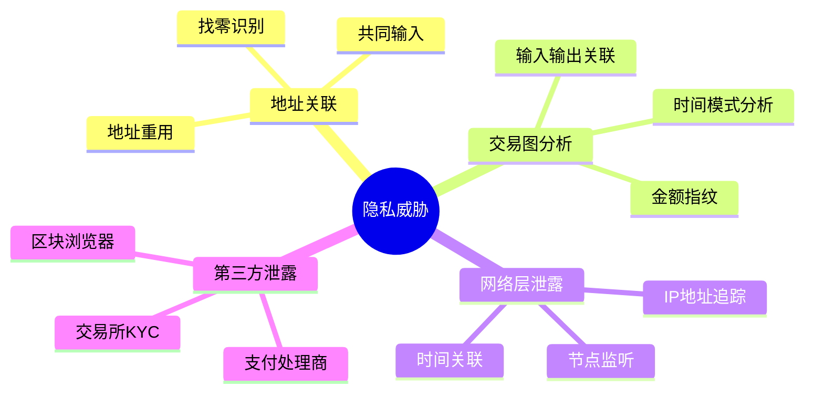

---
title: 比特币隐私技术
date: 2025-09-30
permalink: /blockchain/bitcoin-privacy.html
categories:
  - Technology
  - Learning
---

# 比特币隐私技术

## 比特币的隐私问题

### 假名制 vs 匿名制

比特币是**假名制（Pseudonymous）**而非匿名制。所有交易公开可见，可通过链上分析追踪用户。

```java
public class BitcoinPrivacy {

    public void explainPrivacyModel() {
        System.out.println("=== 比特币隐私模型 ===\n");

        System.out.println("假名制特点：");
        System.out.println("✓ 地址不直接关联身份");
        System.out.println("✓ 可以创建无限个地址");
        System.out.println("✗ 所有交易公开");
        System.out.println("✗ 地址可以被关联");
        System.out.println("✗ IP地址可能暴露");
    }
}
```

### 隐私威胁



## CoinJoin 混币

### 原理

CoinJoin 通过多个用户协作创建一个联合交易，打断地址关联。

```java
public class CoinJoin {

    // CoinJoin交易结构
    public Transaction createCoinJoin(List<Participant> participants) {
        System.out.println("=== CoinJoin 混币 ===\n");

        Transaction tx = new Transaction();

        // 1. 收集所有参与者的输入
        double mixAmount = 0.1;  // 统一混币金额

        for (Participant p : participants) {
            TxInput input = new TxInput();
            input.setPrevTxHash(p.getUTXO().getTxHash());
            input.setOutputIndex(p.getUTXO().getIndex());
            tx.addInput(input);

            System.out.println("输入 " + p.getId() + ": " +
                             p.getUTXO().getAmount() + " BTC");
        }

        // 2. 创建统一金额的输出
        for (Participant p : participants) {
            TxOutput output = new TxOutput();
            output.setAddress(p.getOutputAddress());
            output.setAmount(mixAmount);
            tx.addOutput(output);

            System.out.println("输出到 " + p.getOutputAddress() +
                             ": " + mixAmount + " BTC");
        }

        // 3. 找零输出
        for (Participant p : participants) {
            double change = p.getUTXO().getAmount() - mixAmount - 0.0001;
            if (change > 0.00001) {
                TxOutput changeOutput = new TxOutput();
                changeOutput.setAddress(p.getChangeAddress());
                changeOutput.setAmount(change);
                tx.addOutput(changeOutput);
            }
        }

        System.out.println("\n混币交易创建完成");
        System.out.println("参与者: " + participants.size());
        System.out.println("隐私增强: 无法确定输入输出对应关系");

        return tx;
    }

    // CoinJoin协调流程
    public void coordinateCoinJoin() {
        System.out.println("\n=== CoinJoin 协调流程 ===\n");

        // 1. 参与者注册
        System.out.println("1. 参与者向协调者注册");
        System.out.println("   - 提供输入UTXO");
        System.out.println("   - 提供输出地址（匿名）");

        // 2. 构建交易
        System.out.println("\n2. 协调者构建交易");
        System.out.println("   - 收集所有输入");
        System.out.println("   - 创建统一金额输出");

        // 3. 盲签名
        System.out.println("\n3. 参与者签名");
        System.out.println("   - 每人签名自己的输入");
        System.out.println("   - 协调者无法关联输入输出");

        // 4. 广播
        System.out.println("\n4. 广播交易");
        System.out.println("   - 所有签名完成后");
        System.out.println("   - 交易被广播到网络");
    }

    // CoinJoin变种
    public void coinJoinVariants() {
        System.out.println("\n=== CoinJoin 变种 ===\n");

        System.out.println("1. Wasabi Wallet");
        System.out.println("   - ZeroLink协议");
        System.out.println("   - Tor网络集成");
        System.out.println("   - 最低0.1 BTC");

        System.out.println("\n2. Samourai Whirlpool");
        System.out.println("   - 多轮混币");
        System.out.println("   - 不同面额池");
        System.out.println("   - 移动端友好");

        System.out.println("\n3. JoinMarket");
        System.out.println("   - 市场化混币");
        System.out.println("   - Maker/Taker模式");
        System.out.println("   - 流动性激励");
    }
}
```

### CoinJoin示例

```
输入：
  Alice:  0.5 BTC
  Bob:    0.5 BTC
  Carol:  0.5 BTC

输出（统一金额）：
  地址1:  0.1 BTC  ← 谁的？
  地址2:  0.1 BTC  ← 谁的？
  地址3:  0.1 BTC  ← 谁的？

找零输出：
  地址A:  0.3999 BTC
  地址B:  0.3999 BTC
  地址C:  0.3999 BTC

结果：无法确定0.1 BTC输出属于谁！
```

## Taproot 隐私增强

### Taproot优势

```java
public class TaprootPrivacy {

    public void explainTaprootPrivacy() {
        System.out.println("=== Taproot 隐私优势 ===\n");

        System.out.println("1. 输出无差别");
        System.out.println("   - P2TR输出看起来相同");
        System.out.println("   - 单签、多签、脚本无法区分");
        System.out.println("   - 提高匿名集");

        System.out.println("\n2. 脚本隐私");
        System.out.println("   - 仅暴露执行的脚本路径");
        System.out.println("   - 未使用分支保持私密");
        System.out.println("   - 降低链上足迹");

        System.out.println("\n3. 签名聚合");
        System.out.println("   - 多签看起来像单签");
        System.out.println("   - 减少交易大小");
        System.out.println("   - 增强隐私");
    }

    // 对比示例
    public void comparePrivacy() {
        System.out.println("\n=== 隐私对比 ===\n");

        System.out.println("传统多签（2-of-3）：");
        System.out.println("ScriptPubKey:");
        System.out.println("  OP_2 <pubkey1> <pubkey2> <pubkey3> OP_3 OP_CHECKMULTISIG");
        System.out.println("→ 明确暴露：多签，3个公钥");

        System.out.println("\nTaproot多签（2-of-3）：");
        System.out.println("ScriptPubKey:");
        System.out.println("  OP_1 <tweaked_pubkey>");
        System.out.println("→ 看起来像普通单签");
        System.out.println("→ 只有花费时才知道是多签");
    }
}
```

## 地址管理最佳实践

### HD钱包与地址重用

```java
public class AddressPrivacy {

    // 避免地址重用
    public void avoidAddressReuse() {
        System.out.println("=== 地址重用危害 ===\n");

        System.out.println("危害：");
        System.out.println("✗ 关联所有交易");
        System.out.println("✗ 暴露总余额");
        System.out.println("✗ 追踪交易模式");
        System.out.println("✗ 降低量子安全");

        System.out.println("\n最佳实践：");
        System.out.println("✓ 每次接收使用新地址");
        System.out.println("✓ 使用HD钱包");
        System.out.println("✓ 隔离不同用途地址");
    }

    // 地址派生策略
    public void addressDerivation() {
        System.out.println("\n=== HD钱包地址派生 ===\n");

        // BIP44路径
        String path = "m/44'/0'/0'/0/0";
        System.out.println("标准路径: " + path);
        System.out.println("  44' : 目的（BIP44）");
        System.out.println("  0'  : 币种（比特币）");
        System.out.println("  0'  : 账户");
        System.out.println("  0   : 外部链（接收）");
        System.out.println("  0   : 地址索引");

        System.out.println("\n隐私策略：");
        System.out.println("- 为不同服务使用不同账户");
        System.out.println("- 定期轮换接收地址");
        System.out.println("- 避免关联性暴露");
    }

    // 地址类型选择
    public void addressTypes() {
        System.out.println("\n=== 地址类型与隐私 ===\n");

        System.out.println("1. Legacy (P2PKH) - 1...");
        System.out.println("   隐私: 一般");
        System.out.println("   识别: 易识别");

        System.out.println("\n2. SegWit (P2SH-P2WPKH) - 3...");
        System.out.println("   隐私: 一般");
        System.out.println("   识别: 与其他P2SH混淆");

        System.out.println("\n3. Native SegWit (P2WPKH) - bc1q...");
        System.out.println("   隐私: 较好");
        System.out.println("   识别: 明确");

        System.out.println("\n4. Taproot (P2TR) - bc1p...");
        System.out.println("   隐私: 最佳");
        System.out.println("   识别: 与其他P2TR无差别");

        System.out.println("\n建议: 使用Taproot获得最佳隐私");
    }
}
```

## 交易隐私技术

### 币控制（Coin Control）

```java
public class CoinControl {

    public void demonstrateCoinControl() {
        System.out.println("=== 币控制（Coin Control） ===\n");

        System.out.println("目的：");
        System.out.println("- 手动选择要花费的UTXO");
        System.out.println("- 避免合并不同来源的币");
        System.out.println("- 防止关联性暴露");

        System.out.println("\n场景示例：");
        System.out.println("UTXO1: 来自工作收入");
        System.out.println("UTXO2: 来自朋友转账");
        System.out.println("UTXO3: 来自交易所");

        System.out.println("\n不当操作：");
        System.out.println("❌ 合并UTXO1+UTXO2发送");
        System.out.println("   → 暴露工作和社交关系");

        System.out.println("\n正确操作：");
        System.out.println("✓ 仅使用UTXO1");
        System.out.println("   → 隔离不同来源");
    }

    // UTXO隔离策略
    public void utxoIsolation() {
        System.out.println("\n=== UTXO隔离策略 ===\n");

        System.out.println("1. 标记UTXO");
        System.out.println("   - 工作收入");
        System.out.println("   - 投资收益");
        System.out.println("   - 朋友转账");

        System.out.println("\n2. 分组管理");
        System.out.println("   - 公开身份");
        System.out.println("   - 私密使用");
        System.out.println("   - 临时支付");

        System.out.println("\n3. 避免混合");
        System.out.println("   - 不同组不混合");
        System.out.println("   - 必要时先混币");
    }
}
```

### 交易时机与费用

```java
public class TransactionTiming {

    public void timingPrivacy() {
        System.out.println("=== 交易时机隐私 ===\n");

        System.out.println("时间关联风险：");
        System.out.println("- 相近时间的交易可能被关联");
        System.out.println("- 时区信息可能泄露位置");
        System.out.println("- 定时交易模式可被识别");

        System.out.println("\n缓解措施：");
        System.out.println("✓ 随机延迟发送");
        System.out.println("✓ 批量处理交易");
        System.out.println("✓ 使用nLockTime");
    }

    public void feePrivacy() {
        System.out.println("\n=== 手续费隐私 ===\n");

        System.out.println("手续费指纹：");
        System.out.println("- 特定钱包有固定费用算法");
        System.out.println("- 可能识别钱包软件");

        System.out.println("\n对策：");
        System.out.println("✓ 使用常见费率");
        System.out.println("✓ 避免异常低/高费用");
        System.out.println("✓ 随机化费率选择");
    }
}
```

## 网络层隐私

### Tor集成

```java
public class NetworkPrivacy {

    public void torIntegration() {
        System.out.println("=== Tor网络集成 ===\n");

        System.out.println("优势：");
        System.out.println("✓ 隐藏真实IP地址");
        System.out.println("✓ 防止ISP监控");
        System.out.println("✓ 绕过地理限制");

        System.out.println("\n配置示例：");
        System.out.println("bitcoin.conf:");
        System.out.println("  proxy=127.0.0.1:9050");
        System.out.println("  onlynet=onion");
        System.out.println("  listen=1");
        System.out.println("  bind=127.0.0.1:8333");

        System.out.println("\n注意事项：");
        System.out.println("⚠ 降低连接速度");
        System.out.println("⚠ 可能增加延迟");
        System.out.println("⚠ 需要额外配置");
    }

    public void dandelionProtocol() {
        System.out.println("\n=== Dandelion协议 ===\n");

        System.out.println("传统广播：");
        System.out.println("节点 → 所有邻居");
        System.out.println("→ 可追踪源节点");

        System.out.println("\nDandelion两阶段：");
        System.out.println("1. Stem（茎）阶段");
        System.out.println("   - 随机选择一个邻居");
        System.out.println("   - 线性传播");

        System.out.println("\n2. Fluff（绒毛）阶段");
        System.out.println("   - 广播给所有邻居");
        System.out.println("   - 扩散传播");

        System.out.println("\n结果：难以确定交易来源");
    }
}
```

## 隐私分析工具

### 链上分析对抗

```java
public class ChainAnalysisCountermeasures {

    public void commonHeuristics() {
        System.out.println("=== 常见链上分析启发式 ===\n");

        System.out.println("1. 共同输入所有权");
        System.out.println("   假设：同一交易的输入属于同一实体");
        System.out.println("   对策：CoinJoin打破假设");

        System.out.println("\n2. 找零检测");
        System.out.println("   假设：非整数输出是找零");
        System.out.println("   对策：使用整数金额，CoinJoin");

        System.out.println("\n3. 地址聚类");
        System.out.println("   假设：重用地址属于同一实体");
        System.out.println("   对策：永不重用地址");

        System.out.println("\n4. 时间关联");
        System.out.println("   假设：相近时间交易相关");
        System.out.println("   对策：随机延迟");
    }

    public void privacyScore() {
        System.out.println("\n=== 隐私评分 ===\n");

        double score = 100.0;

        // 地址重用：-30分
        if (addressReused) {
            score -= 30;
            System.out.println("❌ 地址重用: -30");
        }

        // 混币：+20分
        if (usedCoinJoin) {
            score += 20;
            System.out.println("✓ 使用混币: +20");
        }

        // Tor：+15分
        if (usedTor) {
            score += 15;
            System.out.println("✓ 使用Tor: +15");
        }

        // Taproot：+10分
        if (usedTaproot) {
            score += 10;
            System.out.println("✓ 使用Taproot: +10");
        }

        System.out.println("\n隐私评分: " + score);
    }
}
```

## 隐私最佳实践

```java
public class PrivacyBestPractices {

    public void comprehensiveGuide() {
        System.out.println("=== 比特币隐私最佳实践 ===\n");

        System.out.println("【基础级别】");
        System.out.println("✓ 永不重用地址");
        System.out.println("✓ 使用HD钱包");
        System.out.println("✓ 避免KYC交易所（如可能）");

        System.out.println("\n【中级级别】");
        System.out.println("✓ 使用Taproot地址");
        System.out.println("✓ 实施币控制策略");
        System.out.println("✓ 通过Tor连接节点");
        System.out.println("✓ 运行自己的全节点");

        System.out.println("\n【高级级别】");
        System.out.println("✓ 定期使用CoinJoin");
        System.out.println("✓ UTXO隔离管理");
        System.out.println("✓ 使用隐私钱包（Wasabi/Samourai）");
        System.out.println("✓ 批量交易处理");

        System.out.println("\n【专家级别】");
        System.out.println("✓ 多跳CoinJoin");
        System.out.println("✓ PayJoin交易");
        System.out.println("✓ 自托管CoinJoin协调器");
        System.out.println("✓ 离线签名");
    }

    public void privacyChecklist() {
        System.out.println("\n=== 隐私自查清单 ===\n");

        String[] items = {
            "□ 使用HD钱包",
            "□ 从不重用地址",
            "□ 使用最新地址格式（Taproot）",
            "□ 通过Tor连接",
            "□ 运行自己的节点",
            "□ 使用CoinJoin混币",
            "□ 实施币控制",
            "□ UTXO隔离管理",
            "□ 避免小额粉尘",
            "□ 随机化交易时间",
            "□ 谨慎使用交易所",
            "□ 定期审查隐私状况"
        };

        for (String item : items) {
            System.out.println(item);
        }

        System.out.println("\n完成越多，隐私越好！");
    }
}
```

## 隐私工具推荐

```java
public class PrivacyTools {

    public void recommendedTools() {
        System.out.println("=== 隐私工具推荐 ===\n");

        System.out.println("【钱包】");
        System.out.println("1. Wasabi Wallet");
        System.out.println("   - 内置CoinJoin");
        System.out.println("   - Tor集成");
        System.out.println("   - 桌面端");

        System.out.println("\n2. Samourai Wallet");
        System.out.println("   - Whirlpool混币");
        System.out.println("   - Stealth模式");
        System.out.println("   - Android端");

        System.out.println("\n3. Sparrow Wallet");
        System.out.println("   - 币控制");
        System.out.println("   - 隐私分析");
        System.out.println("   - 硬件钱包支持");

        System.out.println("\n【节点】");
        System.out.println("- Bitcoin Core + Tor");
        System.out.println("- RaspiBlitz");
        System.out.println("- myNode");

        System.out.println("\n【分析工具】");
        System.out.println("- BlockSci");
        System.out.println("- OXT.me");
        System.out.println("- Kycp.org");
    }
}
```

## 总结

### 核心要点

✅ **比特币不是匿名的**
- 假名制，非匿名制
- 所有交易公开可查
- 需要主动保护隐私

✅ **隐私增强技术**
- CoinJoin混币
- Taproot脚本隐私
- 地址管理策略
- 网络层保护（Tor）

✅ **最佳实践**
- 永不重用地址
- 使用HD钱包
- UTXO隔离管理
- 定期混币

✅ **工具选择**
- 隐私钱包（Wasabi/Samourai）
- 全节点 + Tor
- 币控制功能

---

**相关文档：**
- [比特币钱包技术实现](./07.比特币钱包技术实现.md)
- [比特币改进提案(BIPs)详解](./18.比特币改进提案(BIPs)详解.md)
- [比特币安全机制](./14.比特币安全机制.md)

隐私是比特币使用的重要方面，理解并实践隐私保护技术至关重要！🔐