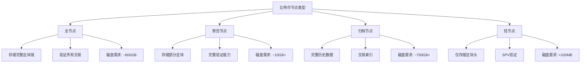

# 比特币节点运维实战

## 1. 节点类型与选择

### 1.1 全节点（Full Node）

```java
/**
 * 全节点配置管理器
 */
public class FullNodeConfig {

    private String dataDir;
    private int maxConnections;
    private boolean pruneMode;
    private long pruneTargetSize; // MB
    private boolean txIndex;
    private boolean enableRpc;

    /**
     * 标准全节点配置
     */
    public static FullNodeConfig standardConfig() {
        FullNodeConfig config = new FullNodeConfig();
        config.dataDir = "/data/bitcoin";
        config.maxConnections = 125;
        config.pruneMode = false;
        config.txIndex = true;
        config.enableRpc = true;
        return config;
    }

    /**
     * 修剪模式全节点配置（节省磁盘空间）
     */
    public static FullNodeConfig prunedConfig(long targetSizeGB) {
        FullNodeConfig config = new FullNodeConfig();
        config.dataDir = "/data/bitcoin";
        config.maxConnections = 125;
        config.pruneMode = true;
        config.pruneTargetSize = targetSizeGB * 1024; // 转换为MB
        config.txIndex = false; // 修剪模式不支持交易索引
        config.enableRpc = true;
        return config;
    }

    /**
     * 生成bitcoin.conf配置文件
     */
    public String generateConfig() {
        StringBuilder sb = new StringBuilder();
        sb.append("# Bitcoin Core Configuration\n\n");

        sb.append("# Data directory\n");
        sb.append("datadir=").append(dataDir).append("\n\n");

        sb.append("# Network settings\n");
        sb.append("maxconnections=").append(maxConnections).append("\n");
        sb.append("listen=1\n");
        sb.append("discover=1\n\n");

        if (pruneMode) {
            sb.append("# Pruning mode\n");
            sb.append("prune=").append(pruneTargetSize).append("\n\n");
        }

        if (txIndex) {
            sb.append("# Transaction index\n");
            sb.append("txindex=1\n\n");
        }

        if (enableRpc) {
            sb.append("# RPC settings\n");
            sb.append("server=1\n");
            sb.append("rpcuser=bitcoinrpc\n");
            sb.append("rpcpassword=changeme\n");
            sb.append("rpcallowip=127.0.0.1\n");
            sb.append("rpcbind=127.0.0.1\n");
            sb.append("rpcport=8332\n\n");
        }

        sb.append("# Logging\n");
        sb.append("debug=0\n");
        sb.append("printtoconsole=0\n");

        return sb.toString();
    }
}
```

### 1.2 节点类型对比



## 2. 节点部署

### 2.1 系统要求

```java
/**
 * 节点系统要求检查器
 */
public class SystemRequirementChecker {

    private static final long MIN_DISK_SPACE_GB = 700;
    private static final long MIN_RAM_GB = 2;
    private static final double MIN_BANDWIDTH_MBPS = 10;

    public static class SystemInfo {
        long diskSpaceGB;
        long ramGB;
        double bandwidthMbps;
        int cpuCores;
        String os;
    }

    public static class CheckResult {
        boolean passed;
        List<String> warnings;
        List<String> errors;

        public CheckResult() {
            this.warnings = new ArrayList<>();
            this.errors = new ArrayList<>();
        }
    }

    /**
     * 检查系统要求
     */
    public CheckResult checkRequirements(SystemInfo info, boolean pruneMode) {
        CheckResult result = new CheckResult();

        // 检查磁盘空间
        long requiredDisk = pruneMode ? 10 : MIN_DISK_SPACE_GB;
        if (info.diskSpaceGB < requiredDisk) {
            result.errors.add(String.format(
                "磁盘空间不足: 需要 %dGB, 当前 %dGB",
                requiredDisk, info.diskSpaceGB
            ));
        } else if (info.diskSpaceGB < requiredDisk * 1.5) {
            result.warnings.add("磁盘空间偏少，建议预留更多空间");
        }

        // 检查内存
        if (info.ramGB < MIN_RAM_GB) {
            result.errors.add(String.format(
                "内存不足: 需要至少 %dGB, 当前 %dGB",
                MIN_RAM_GB, info.ramGB
            ));
        } else if (info.ramGB < 4) {
            result.warnings.add("建议使用4GB以上内存以获得更好性能");
        }

        // 检查带宽
        if (info.bandwidthMbps < MIN_BANDWIDTH_MBPS) {
            result.warnings.add(String.format(
                "网络带宽较低: 建议 %.0fMbps+, 当前 %.1fMbps",
                MIN_BANDWIDTH_MBPS, info.bandwidthMbps
            ));
        }

        // 检查CPU
        if (info.cpuCores < 2) {
            result.warnings.add("建议使用2核以上CPU");
        }

        result.passed = result.errors.isEmpty();
        return result;
    }
}
```

### 2.2 Docker部署

```java
/**
 * Docker节点部署管理器
 */
public class DockerNodeDeployment {

    /**
     * 生成docker-compose.yml
     */
    public String generateDockerCompose(boolean mainnet, boolean pruned) {
        String network = mainnet ? "mainnet" : "testnet";

        return String.format("""
            version: '3.8'

            services:
              bitcoin-node:
                image: lncm/bitcoind:v26.0
                container_name: bitcoin-%s
                restart: unless-stopped
                volumes:
                  - bitcoin-data:/data/.bitcoin
                  - ./bitcoin.conf:/data/.bitcoin/bitcoin.conf:ro
                ports:
                  - "8332:8332"  # RPC
                  - "8333:8333"  # P2P
                environment:
                  - BITCOIN_DATA=/data/.bitcoin
                command: >
                  bitcoind
                  -conf=/data/.bitcoin/bitcoin.conf
                  %s
                networks:
                  - bitcoin-net

                healthcheck:
                  test: ["CMD", "bitcoin-cli", "getblockchaininfo"]
                  interval: 30s
                  timeout: 10s
                  retries: 5

            volumes:
              bitcoin-data:
                driver: local

            networks:
              bitcoin-net:
                driver: bridge
            """,
            network,
            mainnet ? "" : "-testnet"
        );
    }

    /**
     * 部署节点
     */
    public void deployNode(String workDir) throws Exception {
        ProcessBuilder pb = new ProcessBuilder(
            "docker-compose", "up", "-d"
        );
        pb.directory(new File(workDir));
        pb.redirectErrorStream(true);

        Process process = pb.start();

        try (BufferedReader reader = new BufferedReader(
                new InputStreamReader(process.getInputStream()))) {
            String line;
            while ((line = reader.readLine()) != null) {
                System.out.println(line);
            }
        }

        int exitCode = process.waitFor();
        if (exitCode != 0) {
            throw new RuntimeException("Docker部署失败: " + exitCode);
        }
    }
}
```

### 2.3 系统服务配置

```java
/**
 * Systemd服务配置生成器
 */
public class SystemdServiceGenerator {

    /**
     * 生成systemd服务文件
     */
    public String generateServiceFile(String bitcoinDir, String user) {
        return String.format("""
            [Unit]
            Description=Bitcoin Core Node
            After=network.target

            [Service]
            Type=forking
            User=%s
            Group=%s
            ExecStart=%s/bin/bitcoind -daemon -conf=%s/bitcoin.conf -pid=%s/bitcoind.pid
            ExecStop=%s/bin/bitcoin-cli stop
            PIDFile=%s/bitcoind.pid
            Restart=on-failure
            RestartSec=60

            # Process management
            TimeoutStopSec=600
            KillMode=mixed

            # Resource limits
            LimitNOFILE=8192

            # Security
            PrivateTmp=true
            NoNewPrivileges=true
            ProtectSystem=full

            [Install]
            WantedBy=multi-user.target
            """,
            user, user,
            bitcoinDir,
            bitcoinDir,
            bitcoinDir,
            bitcoinDir,
            bitcoinDir
        );
    }
}
```

## 3. 节点监控

### 3.1 节点状态监控

```java
/**
 * 节点状态监控器
 */
public class NodeMonitor {

    private BitcoinRpcClient rpcClient;

    public static class NodeStatus {
        int blockHeight;
        int connections;
        double syncProgress;
        boolean isSyncing;
        long networkHashrate;
        double difficulty;
        int mempoolSize;
        long mempoolBytes;
        double estimatedSmartFee;
    }

    /**
     * 获取节点状态
     */
    public NodeStatus getNodeStatus() throws Exception {
        NodeStatus status = new NodeStatus();

        // 获取区块链信息
        JSONObject blockchainInfo = rpcClient.call("getblockchaininfo");
        status.blockHeight = blockchainInfo.getInt("blocks");
        status.syncProgress = blockchainInfo.getDouble("verificationprogress");
        status.isSyncing = status.syncProgress < 0.9999;
        status.difficulty = blockchainInfo.getDouble("difficulty");

        // 获取网络信息
        JSONObject networkInfo = rpcClient.call("getnetworkinfo");
        status.connections = networkInfo.getInt("connections");

        // 获取内存池信息
        JSONObject mempoolInfo = rpcClient.call("getmempoolinfo");
        status.mempoolSize = mempoolInfo.getInt("size");
        status.mempoolBytes = mempoolInfo.getLong("bytes");

        // 估算网络算力
        JSONObject miningInfo = rpcClient.call("getmininginfo");
        status.networkHashrate = miningInfo.getDouble("networkhashps");

        // 估算手续费
        JSONObject feeEstimate = rpcClient.call("estimatesmartfee", 6);
        if (feeEstimate.has("feerate")) {
            status.estimatedSmartFee = feeEstimate.getDouble("feerate");
        }

        return status;
    }

    /**
     * 检查节点健康状态
     */
    public List<String> checkHealth(NodeStatus status) {
        List<String> issues = new ArrayList<>();

        // 检查连接数
        if (status.connections < 8) {
            issues.add("连接数过少: " + status.connections);
        }

        // 检查同步状态
        if (status.isSyncing) {
            issues.add(String.format(
                "节点正在同步: %.2f%%",
                status.syncProgress * 100
            ));
        }

        // 检查内存池大小
        if (status.mempoolSize > 50000) {
            issues.add("内存池拥堵: " + status.mempoolSize + " 笔交易");
        }

        return issues;
    }
}
```

### 3.2 性能指标监控

```java
/**
 * 性能指标收集器
 */
public class PerformanceMetrics {

    public static class Metrics {
        // 系统指标
        double cpuUsage;
        long memoryUsed;
        long diskUsed;
        long diskAvailable;

        // 网络指标
        long bytesReceived;
        long bytesSent;
        int peersConnected;

        // 区块链指标
        int blocksPerHour;
        double avgBlockTime;
        int txVerifiedPerSec;

        LocalDateTime timestamp;
    }

    private BitcoinRpcClient rpcClient;
    private Queue<Metrics> metricsHistory;
    private static final int HISTORY_SIZE = 1440; // 24小时(分钟级)

    public PerformanceMetrics(BitcoinRpcClient rpcClient) {
        this.rpcClient = rpcClient;
        this.metricsHistory = new ArrayDeque<>(HISTORY_SIZE);
    }

    /**
     * 收集当前指标
     */
    public Metrics collectMetrics() throws Exception {
        Metrics metrics = new Metrics();
        metrics.timestamp = LocalDateTime.now();

        // 获取网络流量统计
        JSONObject netTotals = rpcClient.call("getnettotals");
        metrics.bytesReceived = netTotals.getLong("totalbytesrecv");
        metrics.bytesSent = netTotals.getLong("totalbytessent");

        // 获取peer信息
        JSONArray peerInfo = rpcClient.call("getpeerinfo").getJSONArray("result");
        metrics.peersConnected = peerInfo.length();

        // 计算区块处理速度
        if (!metricsHistory.isEmpty()) {
            Metrics lastMetrics = metricsHistory.peek();
            long timeDiff = Duration.between(
                lastMetrics.timestamp,
                metrics.timestamp
            ).toMinutes();

            if (timeDiff > 0) {
                JSONObject blockchainInfo = rpcClient.call("getblockchaininfo");
                int currentHeight = blockchainInfo.getInt("blocks");
                // 这里需要获取上次的高度进行比较
            }
        }

        // 添加到历史记录
        if (metricsHistory.size() >= HISTORY_SIZE) {
            metricsHistory.poll();
        }
        metricsHistory.offer(metrics);

        return metrics;
    }

    /**
     * 生成性能报告
     */
    public String generateReport() {
        if (metricsHistory.isEmpty()) {
            return "暂无数据";
        }

        StringBuilder report = new StringBuilder();
        report.append("=== 节点性能报告 ===\n\n");

        Metrics latest = metricsHistory.peek();
        report.append(String.format("时间: %s\n", latest.timestamp));
        report.append(String.format("连接节点数: %d\n", latest.peersConnected));
        report.append(String.format("已接收: %.2f GB\n", latest.bytesReceived / 1e9));
        report.append(String.format("已发送: %.2f GB\n", latest.bytesSent / 1e9));

        return report.toString();
    }
}
```

### 3.3 告警系统

```java
/**
 * 节点告警系统
 */
public class NodeAlertSystem {

    public enum AlertLevel {
        INFO, WARNING, ERROR, CRITICAL
    }

    public static class Alert {
        AlertLevel level;
        String message;
        LocalDateTime timestamp;
        String category;

        public Alert(AlertLevel level, String category, String message) {
            this.level = level;
            this.category = category;
            this.message = message;
            this.timestamp = LocalDateTime.now();
        }
    }

    private List<AlertHandler> handlers;
    private Set<String> firedAlerts; // 避免重复告警

    public interface AlertHandler {
        void handle(Alert alert);
    }

    /**
     * 检查并触发告警
     */
    public void checkAndAlert(NodeStatus status, PerformanceMetrics.Metrics metrics) {
        // 检查连接数
        if (status.connections < 3) {
            fireAlert(new Alert(
                AlertLevel.CRITICAL,
                "network",
                "节点连接数严重不足: " + status.connections
            ));
        } else if (status.connections < 8) {
            fireAlert(new Alert(
                AlertLevel.WARNING,
                "network",
                "节点连接数偏低: " + status.connections
            ));
        }

        // 检查同步状态
        if (status.isSyncing && status.syncProgress < 0.5) {
            fireAlert(new Alert(
                AlertLevel.INFO,
                "sync",
                String.format("节点同步中: %.1f%%", status.syncProgress * 100)
            ));
        }

        // 检查磁盘空间
        if (metrics != null && metrics.diskAvailable < 50 * 1024 * 1024 * 1024L) {
            fireAlert(new Alert(
                AlertLevel.CRITICAL,
                "disk",
                String.format("磁盘空间不足: %.1f GB", metrics.diskAvailable / 1e9)
            ));
        }

        // 检查内存池
        if (status.mempoolSize > 100000) {
            fireAlert(new Alert(
                AlertLevel.WARNING,
                "mempool",
                "内存池严重拥堵: " + status.mempoolSize + " 笔交易"
            ));
        }
    }

    /**
     * 触发告警
     */
    private void fireAlert(Alert alert) {
        String alertKey = alert.category + ":" + alert.level;

        // 防止重复告警(1小时内)
        if (firedAlerts.contains(alertKey)) {
            return;
        }

        firedAlerts.add(alertKey);

        // 通知所有处理器
        for (AlertHandler handler : handlers) {
            try {
                handler.handle(alert);
            } catch (Exception e) {
                System.err.println("告警处理失败: " + e.getMessage());
            }
        }

        // 1小时后清除告警标记
        new Timer().schedule(new TimerTask() {
            @Override
            public void run() {
                firedAlerts.remove(alertKey);
            }
        }, 3600000);
    }
}

/**
 * 邮件告警处理器
 */
class EmailAlertHandler implements NodeAlertSystem.AlertHandler {

    private String smtpHost;
    private String from;
    private String to;

    @Override
    public void handle(NodeAlertSystem.Alert alert) {
        if (alert.level == NodeAlertSystem.AlertLevel.CRITICAL ||
            alert.level == NodeAlertSystem.AlertLevel.ERROR) {
            sendEmail(alert);
        }
    }

    private void sendEmail(NodeAlertSystem.Alert alert) {
        String subject = String.format("[%s] 比特币节点告警", alert.level);
        String body = String.format("""
            告警级别: %s
            告警类别: %s
            告警时间: %s
            告警内容: %s
            """,
            alert.level,
            alert.category,
            alert.timestamp,
            alert.message
        );

        // 发送邮件逻辑
        System.out.println("发送告警邮件: " + subject);
    }
}
```

## 4. 节点维护

### 4.1 日志管理

```java
/**
 * 日志分析器
 */
public class LogAnalyzer {

    public static class LogEntry {
        LocalDateTime timestamp;
        String level;
        String category;
        String message;
    }

    /**
     * 解析debug.log文件
     */
    public List<LogEntry> parseLog(Path logFile, int maxLines) throws IOException {
        List<LogEntry> entries = new ArrayList<>();

        try (BufferedReader reader = Files.newBufferedReader(logFile)) {
            String line;
            int count = 0;

            while ((line = reader.readLine()) != null && count < maxLines) {
                LogEntry entry = parseLine(line);
                if (entry != null) {
                    entries.add(entry);
                    count++;
                }
            }
        }

        return entries;
    }

    private LogEntry parseLine(String line) {
        // 示例日志格式: 2024-01-01 12:00:00 [net] Connection established
        Pattern pattern = Pattern.compile(
            "(\\d{4}-\\d{2}-\\d{2} \\d{2}:\\d{2}:\\d{2}) \\[([^\\]]+)\\] (.+)"
        );

        Matcher matcher = pattern.matcher(line);
        if (matcher.matches()) {
            LogEntry entry = new LogEntry();
            entry.timestamp = LocalDateTime.parse(
                matcher.group(1),
                DateTimeFormatter.ofPattern("yyyy-MM-dd HH:mm:ss")
            );
            entry.category = matcher.group(2);
            entry.message = matcher.group(3);
            return entry;
        }

        return null;
    }

    /**
     * 统计错误日志
     */
    public Map<String, Long> countErrors(List<LogEntry> entries) {
        return entries.stream()
            .filter(e -> e.message.toLowerCase().contains("error"))
            .collect(Collectors.groupingBy(
                e -> e.category,
                Collectors.counting()
            ));
    }
}
```

### 4.2 数据备份

```java
/**
 * 节点数据备份管理器
 */
public class BackupManager {

    private String bitcoinDataDir;
    private String backupDir;

    /**
     * 备份钱包文件
     */
    public void backupWallet(String walletName) throws Exception {
        Path sourcePath = Paths.get(bitcoinDataDir, "wallets", walletName);
        Path backupPath = Paths.get(
            backupDir,
            String.format("wallet_%s_%s.dat",
                walletName,
                LocalDate.now().format(DateTimeFormatter.ISO_DATE)
            )
        );

        Files.copy(sourcePath, backupPath, StandardCopyOption.REPLACE_EXISTING);

        // 加密备份文件
        encryptFile(backupPath);
    }

    /**
     * 备份区块链索引
     */
    public void backupChainstate() throws Exception {
        Path chainstateDir = Paths.get(bitcoinDataDir, "chainstate");
        String timestamp = LocalDateTime.now().format(
            DateTimeFormatter.ofPattern("yyyyMMdd_HHmmss")
        );
        Path backupPath = Paths.get(backupDir, "chainstate_" + timestamp + ".tar.gz");

        // 创建压缩包
        ProcessBuilder pb = new ProcessBuilder(
            "tar", "czf",
            backupPath.toString(),
            "-C", bitcoinDataDir,
            "chainstate"
        );

        Process process = pb.start();
        int exitCode = process.waitFor();

        if (exitCode != 0) {
            throw new RuntimeException("备份失败");
        }
    }

    private void encryptFile(Path file) {
        // 使用GPG或其他加密工具加密文件
    }
}
```

### 4.3 升级策略

```java
/**
 * 节点升级管理器
 */
public class UpgradeManager {

    private String currentVersion;
    private String dataDir;

    /**
     * 检查可用更新
     */
    public VersionInfo checkForUpdates() throws Exception {
        // 从GitHub获取最新版本信息
        String apiUrl = "https://api.github.com/repos/bitcoin/bitcoin/releases/latest";

        URL url = new URL(apiUrl);
        HttpURLConnection conn = (HttpURLConnection) url.openConnection();
        conn.setRequestMethod("GET");

        try (BufferedReader reader = new BufferedReader(
                new InputStreamReader(conn.getInputStream()))) {

            StringBuilder response = new StringBuilder();
            String line;
            while ((line = reader.readLine()) != null) {
                response.append(line);
            }

            JSONObject json = new JSONObject(response.toString());

            VersionInfo info = new VersionInfo();
            info.version = json.getString("tag_name").substring(1); // 移除'v'前缀
            info.releaseDate = LocalDate.parse(
                json.getString("published_at").substring(0, 10)
            );
            info.downloadUrl = findDownloadUrl(json);

            return info;
        }
    }

    /**
     * 执行升级
     */
    public void upgrade(VersionInfo newVersion) throws Exception {
        System.out.println("开始升级到版本: " + newVersion.version);

        // 1. 停止节点
        stopNode();

        // 2. 备份当前版本
        backupCurrentVersion();

        // 3. 下载新版本
        Path downloadPath = downloadNewVersion(newVersion);

        // 4. 安装新版本
        installNewVersion(downloadPath);

        // 5. 启动节点
        startNode();

        // 6. 验证升级
        verifyUpgrade(newVersion.version);

        System.out.println("升级完成!");
    }

    private String findDownloadUrl(JSONObject release) {
        // 根据系统架构选择合适的下载链接
        JSONArray assets = release.getJSONArray("assets");
        for (int i = 0; i < assets.length(); i++) {
            JSONObject asset = assets.getJSONObject(i);
            String name = asset.getString("name");
            if (name.contains("x86_64-linux-gnu.tar.gz")) {
                return asset.getString("browser_download_url");
            }
        }
        return null;
    }

    private void stopNode() throws Exception {
        ProcessBuilder pb = new ProcessBuilder("bitcoin-cli", "stop");
        pb.start().waitFor();
        Thread.sleep(10000); // 等待节点完全停止
    }

    private void startNode() throws Exception {
        ProcessBuilder pb = new ProcessBuilder("bitcoind", "-daemon");
        pb.start();
    }

    private void verifyUpgrade(String expectedVersion) throws Exception {
        Thread.sleep(5000); // 等待节点启动

        ProcessBuilder pb = new ProcessBuilder("bitcoin-cli", "--version");
        Process process = pb.start();

        try (BufferedReader reader = new BufferedReader(
                new InputStreamReader(process.getInputStream()))) {
            String version = reader.readLine();
            if (!version.contains(expectedVersion)) {
                throw new RuntimeException("版本验证失败");
            }
        }
    }

    static class VersionInfo {
        String version;
        LocalDate releaseDate;
        String downloadUrl;
    }
}
```

## 5. 故障排查

### 5.1 常见问题诊断

```java
/**
 * 节点诊断工具
 */
public class NodeDiagnostics {

    private BitcoinRpcClient rpcClient;

    public static class DiagnosticReport {
        List<String> issues;
        List<String> suggestions;
        Map<String, Object> details;

        public DiagnosticReport() {
            this.issues = new ArrayList<>();
            this.suggestions = new ArrayList<>();
            this.details = new HashMap<>();
        }
    }

    /**
     * 运行完整诊断
     */
    public DiagnosticReport runDiagnostics() {
        DiagnosticReport report = new DiagnosticReport();

        try {
            // 检查RPC连接
            checkRpcConnection(report);

            // 检查网络连接
            checkNetworkConnections(report);

            // 检查同步状态
            checkSyncStatus(report);

            // 检查磁盘空间
            checkDiskSpace(report);

            // 检查peer质量
            checkPeerQuality(report);

        } catch (Exception e) {
            report.issues.add("诊断过程出错: " + e.getMessage());
        }

        return report;
    }

    private void checkRpcConnection(DiagnosticReport report) {
        try {
            rpcClient.call("getblockchaininfo");
        } catch (Exception e) {
            report.issues.add("无法连接到RPC服务");
            report.suggestions.add("检查bitcoin.conf中的RPC配置");
            report.suggestions.add("确认节点是否正在运行");
        }
    }

    private void checkNetworkConnections(DiagnosticReport report) throws Exception {
        JSONObject networkInfo = rpcClient.call("getnetworkinfo");
        int connections = networkInfo.getInt("connections");

        report.details.put("connections", connections);

        if (connections == 0) {
            report.issues.add("节点没有任何网络连接");
            report.suggestions.add("检查防火墙设置");
            report.suggestions.add("确认8333端口未被占用");
            report.suggestions.add("尝试手动添加节点: bitcoin-cli addnode <ip> add");
        } else if (connections < 8) {
            report.issues.add("网络连接数较少: " + connections);
            report.suggestions.add("等待节点自动发现更多peer");
            report.suggestions.add("检查网络连接质量");
        }
    }

    private void checkSyncStatus(DiagnosticReport report) throws Exception {
        JSONObject blockchainInfo = rpcClient.call("getblockchaininfo");

        int blocks = blockchainInfo.getInt("blocks");
        int headers = blockchainInfo.getInt("headers");
        double progress = blockchainInfo.getDouble("verificationprogress");

        report.details.put("blocks", blocks);
        report.details.put("headers", headers);
        report.details.put("syncProgress", String.format("%.2f%%", progress * 100));

        if (headers - blocks > 100) {
            report.issues.add("节点同步落后: " + (headers - blocks) + " 个区块");
            report.suggestions.add("等待节点继续同步");

            if (progress < 0.5) {
                report.suggestions.add("初次同步可能需要数小时到数天");
            }
        }
    }

    private void checkDiskSpace(DiagnosticReport report) {
        File dataDir = new File(System.getProperty("user.home") + "/.bitcoin");
        long freeSpace = dataDir.getFreeSpace();
        long totalSpace = dataDir.getTotalSpace();

        report.details.put("diskFree", String.format("%.1f GB", freeSpace / 1e9));
        report.details.put("diskTotal", String.format("%.1f GB", totalSpace / 1e9));

        if (freeSpace < 100L * 1024 * 1024 * 1024) {
            report.issues.add("磁盘空间不足");
            report.suggestions.add("清理其他文件释放空间");
            report.suggestions.add("考虑使用pruned mode");
        }
    }

    private void checkPeerQuality(DiagnosticReport report) throws Exception {
        JSONArray peers = rpcClient.call("getpeerinfo").getJSONArray("result");

        int slowPeers = 0;
        int stuckPeers = 0;

        for (int i = 0; i < peers.length(); i++) {
            JSONObject peer = peers.getJSONObject(i);

            long pingTime = peer.optLong("pingtime", 0);
            if (pingTime > 1000) {
                slowPeers++;
            }

            long startingHeight = peer.optLong("startingheight", 0);
            long currentHeight = peer.optLong("synced_headers", 0);
            if (currentHeight < startingHeight - 100) {
                stuckPeers++;
            }
        }

        if (slowPeers > peers.length() / 2) {
            report.issues.add("大部分peer响应较慢");
            report.suggestions.add("检查网络连接质量");
        }

        if (stuckPeers > 0) {
            report.issues.add(stuckPeers + " 个peer同步停滞");
            report.suggestions.add("考虑断开这些peer");
        }
    }
}
```

## 6. 相关文档

- [比特币开发环境搭建](./15.比特币开发环境搭建)
- [比特币网络协议详解](./06.比特币网络协议详解)
- [比特币安全机制](./14.比特币安全机制)

## 参考资源

- [Bitcoin Core Documentation](https://bitcoincore.org/en/doc/)
- [Running a Bitcoin Node](https://bitcoin.org/en/full-node)
- [Bitcoin Operations Guide](https://github.com/bitcoin/bitcoin/blob/master/doc/operating-guide)
