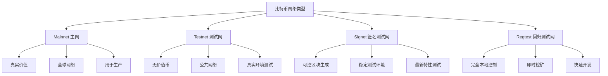

---
title: 比特币测试与调试技巧
date: 2025-09-30
permalink: /blockchain/bitcoin-testing-debugging.html
categories:
  - Technology
  - Learning
---

# 比特币测试与调试技巧

## 1. 测试网络

### 1.1 网络类型对比



### 1.2 Regtest环境管理

```java
/**
 * Regtest网络管理器
 */
public class RegtestManager {

    private String bitcoinCliPath;
    private String dataDir;
    private Process bitcoindProcess;

    /**
     * 启动regtest节点
     */
    public void start() throws Exception {
        String[] command = {
            "bitcoind",
            "-regtest",
            "-daemon",
            "-datadir=" + dataDir,
            "-fallbackfee=0.00001",
            "-server",
            "-rpcuser=test",
            "-rpcpassword=test",
            "-rpcport=18443"
        };

        ProcessBuilder pb = new ProcessBuilder(command);
        pb.redirectErrorStream(true);
        bitcoindProcess = pb.start();

        // 等待节点启动
        Thread.sleep(2000);

        // 验证节点已启动
        if (!isRunning()) {
            throw new RuntimeException("Regtest节点启动失败");
        }

        System.out.println("Regtest节点已启动");
    }

    /**
     * 停止节点
     */
    public void stop() throws Exception {
        executeCommand("bitcoin-cli", "-regtest", "stop");
        if (bitcoindProcess != null) {
            bitcoindProcess.waitFor(10, TimeUnit.SECONDS);
        }
    }

    /**
     * 生成区块
     */
    public List<String> generateBlocks(int count, String address) throws Exception {
        String output = executeCommand(
            "bitcoin-cli", "-regtest",
            "generatetoaddress", String.valueOf(count), address
        );

        // 解析返回的区块哈希列表
        return parseJsonArray(output);
    }

    /**
     * 重置区块链
     */
    public void reset() throws Exception {
        stop();

        // 删除regtest数据
        Path regtestDir = Paths.get(dataDir, "regtest");
        if (Files.exists(regtestDir)) {
            Files.walk(regtestDir)
                .sorted((a, b) -> -a.compareTo(b))
                .forEach(path -> {
                    try {
                        Files.delete(path);
                    } catch (IOException e) {
                        e.printStackTrace();
                    }
                });
        }

        start();
    }

    /**
     * 快速创建测试环境
     */
    public TestEnvironment setupTestEnvironment() throws Exception {
        // 创建钱包
        executeCommand("bitcoin-cli", "-regtest", "createwallet", "testwallet");

        // 生成地址
        String address = executeCommand(
            "bitcoin-cli", "-regtest",
            "-rpcwallet=testwallet",
            "getnewaddress"
        ).trim();

        // 挖100个区块以获得可用余额
        generateBlocks(101, address);

        TestEnvironment env = new TestEnvironment();
        env.address = address;
        env.balance = getBalance();

        return env;
    }

    private double getBalance() throws Exception {
        String output = executeCommand(
            "bitcoin-cli", "-regtest",
            "-rpcwallet=testwallet",
            "getbalance"
        );
        return Double.parseDouble(output.trim());
    }

    private boolean isRunning() {
        try {
            executeCommand("bitcoin-cli", "-regtest", "getblockchaininfo");
            return true;
        } catch (Exception e) {
            return false;
        }
    }

    private String executeCommand(String... command) throws Exception {
        ProcessBuilder pb = new ProcessBuilder(command);
        pb.redirectErrorStream(true);
        Process process = pb.start();

        StringBuilder output = new StringBuilder();
        try (BufferedReader reader = new BufferedReader(
                new InputStreamReader(process.getInputStream()))) {
            String line;
            while ((line = reader.readLine()) != null) {
                output.append(line).append("\n");
            }
        }

        int exitCode = process.waitFor();
        if (exitCode != 0) {
            throw new RuntimeException("命令执行失败: " + output);
        }

        return output.toString();
    }

    private List<String> parseJsonArray(String json) {
        // 简单JSON数组解析
        json = json.trim();
        if (json.startsWith("[") && json.endsWith("]")) {
            json = json.substring(1, json.length() - 1);
            return Arrays.stream(json.split(","))
                .map(s -> s.trim().replace("\"", ""))
                .collect(Collectors.toList());
        }
        return Collections.emptyList();
    }

    public static class TestEnvironment {
        String address;
        double balance;
    }
}
```

### 1.3 Testnet使用

```java
/**
 * Testnet水龙头客户端
 */
public class TestnetFaucet {

    private static final List<String> FAUCET_URLS = Arrays.asList(
        "https://testnet-faucet.mempool.co",
        "https://bitcoinfaucet.uo1.net",
        "https://testnet.help/en/btcfaucet/testnet"
    );

    /**
     * 从水龙头获取测试币
     */
    public boolean requestTestnetCoins(String address) throws Exception {
        for (String faucetUrl : FAUCET_URLS) {
            try {
                boolean success = requestFromFaucet(faucetUrl, address);
                if (success) {
                    System.out.println("成功从水龙头获取测试币: " + faucetUrl);
                    return true;
                }
            } catch (Exception e) {
                System.err.println("水龙头请求失败 " + faucetUrl + ": " + e.getMessage());
            }
        }
        return false;
    }

    private boolean requestFromFaucet(String faucetUrl, String address) throws Exception {
        URL url = new URL(faucetUrl);
        HttpURLConnection conn = (HttpURLConnection) url.openConnection();

        conn.setRequestMethod("POST");
        conn.setRequestProperty("Content-Type", "application/x-www-form-urlencoded");
        conn.setDoOutput(true);

        String params = "address=" + URLEncoder.encode(address, "UTF-8");

        try (OutputStream os = conn.getOutputStream()) {
            os.write(params.getBytes());
            os.flush();
        }

        int responseCode = conn.getResponseCode();
        return responseCode >= 200 && responseCode < 300;
    }

    /**
     * 等待交易确认
     */
    public boolean waitForConfirmation(String txid, int targetConfirmations, int timeoutSeconds)
            throws Exception {
        int waited = 0;
        while (waited < timeoutSeconds) {
            int confirmations = getConfirmations(txid);

            if (confirmations >= targetConfirmations) {
                return true;
            }

            System.out.println(String.format(
                "等待确认: %d/%d (已等待 %d秒)",
                confirmations, targetConfirmations, waited
            ));

            Thread.sleep(10000); // 10秒检查一次
            waited += 10;
        }

        return false;
    }

    private int getConfirmations(String txid) throws Exception {
        ProcessBuilder pb = new ProcessBuilder(
            "bitcoin-cli", "-testnet",
            "gettransaction", txid
        );

        Process process = pb.start();
        StringBuilder output = new StringBuilder();

        try (BufferedReader reader = new BufferedReader(
                new InputStreamReader(process.getInputStream()))) {
            String line;
            while ((line = reader.readLine()) != null) {
                output.append(line);
            }
        }

        // 解析JSON获取confirmations字段
        Pattern pattern = Pattern.compile("\"confirmations\"\\s*:\\s*(\\d+)");
        Matcher matcher = pattern.matcher(output);

        if (matcher.find()) {
            return Integer.parseInt(matcher.group(1));
        }

        return 0;
    }
}
```

## 2. 单元测试

### 2.1 交易测试

```java
/**
 * 比特币交易单元测试
 */
public class TransactionTest {

    private RegtestManager regtest;
    private String testAddress;

    @BeforeEach
    public void setup() throws Exception {
        regtest = new RegtestManager();
        regtest.start();

        RegtestManager.TestEnvironment env = regtest.setupTestEnvironment();
        testAddress = env.address;
    }

    @AfterEach
    public void tearDown() throws Exception {
        regtest.stop();
    }

    @Test
    public void testCreateSimpleTransaction() throws Exception {
        // 创建接收地址
        String recipientAddress = regtest.executeCommand(
            "bitcoin-cli", "-regtest",
            "-rpcwallet=testwallet",
            "getnewaddress"
        ).trim();

        // 发送交易
        String txid = regtest.executeCommand(
            "bitcoin-cli", "-regtest",
            "-rpcwallet=testwallet",
            "sendtoaddress", recipientAddress, "1.0"
        ).trim();

        assertNotNull(txid);
        assertEquals(64, txid.length());

        // 确认交易在内存池中
        String rawMempool = regtest.executeCommand(
            "bitcoin-cli", "-regtest", "getrawmempool"
        );
        assertTrue(rawMempool.contains(txid));

        // 挖一个区块确认交易
        regtest.generateBlocks(1, testAddress);

        // 验证交易已确认
        String txInfo = regtest.executeCommand(
            "bitcoin-cli", "-regtest",
            "gettransaction", txid
        );
        assertTrue(txInfo.contains("\"confirmations\": 1"));
    }

    @Test
    public void testMultipleOutputs() throws Exception {
        // 创建多个输出的交易
        String addr1 = createNewAddress();
        String addr2 = createNewAddress();
        String addr3 = createNewAddress();

        Map<String, Double> outputs = new HashMap<>();
        outputs.put(addr1, 1.0);
        outputs.put(addr2, 2.0);
        outputs.put(addr3, 3.0);

        // 构建交易
        String txid = sendMany(outputs);

        assertNotNull(txid);

        // 确认交易
        regtest.generateBlocks(1, testAddress);

        // 验证每个地址都收到了正确的金额
        assertEquals(1.0, getReceivedByAddress(addr1), 0.0001);
        assertEquals(2.0, getReceivedByAddress(addr2), 0.0001);
        assertEquals(3.0, getReceivedByAddress(addr3), 0.0001);
    }

    @Test
    public void testRBF() throws Exception {
        // 测试Replace-By-Fee (RBF)

        // 创建可替换交易(低手续费)
        String recipientAddr = createNewAddress();
        String originalTxid = createRBFTransaction(recipientAddr, 0.5, 0.0001);

        // 替换为高手续费交易
        String replacementTxid = replaceTransaction(originalTxid, 0.0002);

        assertNotEquals(originalTxid, replacementTxid);

        // 确认替换交易
        regtest.generateBlocks(1, testAddress);

        // 原交易应该被拒绝
        assertThrows(Exception.class, () -> {
            regtest.executeCommand(
                "bitcoin-cli", "-regtest",
                "gettransaction", originalTxid
            );
        });

        // 替换交易应该确认
        String txInfo = regtest.executeCommand(
            "bitcoin-cli", "-regtest",
            "gettransaction", replacementTxid
        );
        assertTrue(txInfo.contains("\"confirmations\": 1"));
    }

    private String createNewAddress() throws Exception {
        return regtest.executeCommand(
            "bitcoin-cli", "-regtest",
            "-rpcwallet=testwallet",
            "getnewaddress"
        ).trim();
    }

    private String sendMany(Map<String, Double> outputs) throws Exception {
        StringBuilder json = new StringBuilder("{");
        boolean first = true;
        for (Map.Entry<String, Double> entry : outputs.entrySet()) {
            if (!first) json.append(",");
            json.append("\"").append(entry.getKey()).append("\":")
                .append(entry.getValue());
            first = false;
        }
        json.append("}");

        return regtest.executeCommand(
            "bitcoin-cli", "-regtest",
            "-rpcwallet=testwallet",
            "sendmany", "\"\"", json.toString()
        ).trim();
    }

    private double getReceivedByAddress(String address) throws Exception {
        String result = regtest.executeCommand(
            "bitcoin-cli", "-regtest",
            "-rpcwallet=testwallet",
            "getreceivedbyaddress", address
        );
        return Double.parseDouble(result.trim());
    }

    private String createRBFTransaction(String recipient, double amount, double fee)
            throws Exception {
        // 使用RPC创建可替换交易
        // 实际实现需要使用createrawtransaction和相关RPC
        return null; // 简化示例
    }

    private String replaceTransaction(String txid, double newFee) throws Exception {
        // 使用bumpfee RPC替换交易
        String result = regtest.executeCommand(
            "bitcoin-cli", "-regtest",
            "-rpcwallet=testwallet",
            "bumpfee", txid
        );
        // 解析返回的新txid
        return null; // 简化示例
    }
}
```

### 2.2 脚本测试

```java
/**
 * 比特币脚本测试
 */
public class ScriptTest {

    @Test
    public void testP2PKHScript() {
        // 测试Pay-to-PubKey-Hash脚本
        byte[] pubKeyHash = Hash.hash160(publicKey);

        // 锁定脚本
        Script lockingScript = new ScriptBuilder()
            .op(OP_DUP)
            .op(OP_HASH160)
            .data(pubKeyHash)
            .op(OP_EQUALVERIFY)
            .op(OP_CHECKSIG)
            .build();

        // 解锁脚本
        byte[] signature = sign(txData, privateKey);
        Script unlockingScript = new ScriptBuilder()
            .data(signature)
            .data(publicKey)
            .build();

        // 执行脚本
        ScriptExecutor executor = new ScriptExecutor();
        boolean result = executor.execute(unlockingScript, lockingScript);

        assertTrue(result, "P2PKH脚本验证失败");
    }

    @Test
    public void testMultisigScript() {
        // 测试2-of-3多签脚本
        byte[] pubKey1 = generatePublicKey();
        byte[] pubKey2 = generatePublicKey();
        byte[] pubKey3 = generatePublicKey();

        // 2-of-3 多签锁定脚本
        Script lockingScript = new ScriptBuilder()
            .number(2)
            .data(pubKey1)
            .data(pubKey2)
            .data(pubKey3)
            .number(3)
            .op(OP_CHECKMULTISIG)
            .build();

        // 使用key1和key3签名
        byte[] sig1 = sign(txData, privateKey1);
        byte[] sig3 = sign(txData, privateKey3);

        Script unlockingScript = new ScriptBuilder()
            .op(OP_0) // CHECKMULTISIG的bug修复
            .data(sig1)
            .data(sig3)
            .build();

        ScriptExecutor executor = new ScriptExecutor();
        boolean result = executor.execute(unlockingScript, lockingScript);

        assertTrue(result, "多签脚本验证失败");
    }

    @Test
    public void testTimeLock() {
        // 测试CHECKLOCKTIMEVERIFY
        long locktime = System.currentTimeMillis() / 1000 + 3600; // 1小时后

        Script lockingScript = new ScriptBuilder()
            .number(locktime)
            .op(OP_CHECKLOCKTIMEVERIFY)
            .op(OP_DROP)
            .data(pubKeyHash)
            .op(OP_CHECKSIG)
            .build();

        // 测试时间未到时失败
        ScriptExecutor executor = new ScriptExecutor();
        executor.setLockTime(locktime - 1);

        assertFalse(executor.execute(unlockingScript, lockingScript));

        // 测试时间已到时成功
        executor.setLockTime(locktime);
        assertTrue(executor.execute(unlockingScript, lockingScript));
    }
}

/**
 * 脚本执行器(简化版)
 */
class ScriptExecutor {

    private Stack<byte[]> stack;
    private long lockTime;

    public boolean execute(Script unlocking, Script locking) {
        stack = new Stack<>();

        // 执行解锁脚本
        if (!executeScript(unlocking)) {
            return false;
        }

        // 执行锁定脚本
        return executeScript(locking);
    }

    private boolean executeScript(Script script) {
        for (ScriptOp op : script.getOps()) {
            if (!executeOp(op)) {
                return false;
            }
        }
        return !stack.isEmpty() && isTrue(stack.peek());
    }

    private boolean executeOp(ScriptOp op) {
        switch (op.opcode) {
            case OP_DUP:
                stack.push(stack.peek());
                break;

            case OP_HASH160:
                byte[] data = stack.pop();
                stack.push(Hash.hash160(data));
                break;

            case OP_EQUALVERIFY:
                byte[] a = stack.pop();
                byte[] b = stack.pop();
                if (!Arrays.equals(a, b)) {
                    return false;
                }
                break;

            case OP_CHECKSIG:
                byte[] pubKey = stack.pop();
                byte[] signature = stack.pop();
                boolean valid = verifySig(signature, pubKey);
                stack.push(valid ? new byte[]{1} : new byte[]{0});
                break;

            case OP_CHECKLOCKTIMEVERIFY:
                long requiredLocktime = bytesToLong(stack.peek());
                if (lockTime < requiredLocktime) {
                    return false;
                }
                break;

            default:
                if (op.data != null) {
                    stack.push(op.data);
                }
        }

        return true;
    }

    private boolean isTrue(byte[] data) {
        for (byte b : data) {
            if (b != 0) return true;
        }
        return false;
    }

    public void setLockTime(long lockTime) {
        this.lockTime = lockTime;
    }
}
```

## 3. 集成测试

### 3.1 端到端交易测试

```java
/**
 * 端到端交易测试框架
 */
public class E2ETransactionTest {

    private RegtestManager regtest;
    private BitcoinWallet aliceWallet;
    private BitcoinWallet bobWallet;

    @BeforeEach
    public void setup() throws Exception {
        regtest = new RegtestManager();
        regtest.start();

        // 创建两个钱包
        aliceWallet = new BitcoinWallet("alice", regtest);
        bobWallet = new BitcoinWallet("bob", regtest);

        // 给Alice一些币
        String aliceAddr = aliceWallet.getNewAddress();
        regtest.generateBlocks(101, aliceAddr);
    }

    @Test
    public void testCompletePaymentFlow() throws Exception {
        // 1. Alice创建发票
        String bobAddr = bobWallet.getNewAddress();
        double amount = 1.0;

        // 2. Alice发送支付
        String txid = aliceWallet.send(bobAddr, amount);
        assertNotNull(txid);

        // 3. 交易在内存池中
        assertTrue(regtest.isInMempool(txid));

        // 4. 挖矿确认
        regtest.generateBlocks(1, aliceWallet.getNewAddress());

        // 5. Bob验证收款
        double bobBalance = bobWallet.getBalance();
        assertEquals(amount, bobBalance, 0.0001);

        // 6. 获取交易详情
        Transaction tx = regtest.getTransaction(txid);
        assertEquals(1, tx.getConfirmations());
    }

    @Test
    public void testAtomicSwap() throws Exception {
        // 测试原子交换

        // 1. Alice生成秘密和哈希
        byte[] secret = generateSecret();
        byte[] secretHash = Hash.sha256(secret);

        // 2. Alice创建HTLC锁定到Bob
        String aliceHTLC = aliceWallet.createHTLC(
            bobWallet.getPublicKey(),
            secretHash,
            100 // 100区块超时
        );

        aliceWallet.send(aliceHTLC, 1.0);

        // 3. Bob创建对应的HTLC锁定到Alice
        String bobHTLC = bobWallet.createHTLC(
            aliceWallet.getPublicKey(),
            secretHash,
            50 // 50区块超时,更短
        );

        bobWallet.send(bobHTLC, 2.0);

        // 4. Alice揭示秘密并赎回Bob的HTLC
        String redeemTx1 = aliceWallet.redeemHTLC(bobHTLC, secret);
        assertNotNull(redeemTx1);

        // 5. Bob观察到秘密,赎回Alice的HTLC
        byte[] observedSecret = extractSecretFromTx(redeemTx1);
        assertArrayEquals(secret, observedSecret);

        String redeemTx2 = bobWallet.redeemHTLC(aliceHTLC, observedSecret);
        assertNotNull(redeemTx2);

        // 6. 确认交易
        regtest.generateBlocks(1, aliceWallet.getNewAddress());

        // 7. 验证最终状态
        assertTrue(aliceWallet.getBalance() > 0);
        assertTrue(bobWallet.getBalance() > 0);
    }

    @Test
    public void testBatchPayment() throws Exception {
        // 测试批量支付

        // 创建10个接收地址
        List<String> recipients = new ArrayList<>();
        for (int i = 0; i < 10; i++) {
            recipients.add(bobWallet.getNewAddress());
        }

        // 批量支付
        Map<String, Double> payments = new HashMap<>();
        for (int i = 0; i < recipients.size(); i++) {
            payments.put(recipients.get(i), 0.1 * (i + 1));
        }

        String txid = aliceWallet.sendMany(payments);
        assertNotNull(txid);

        // 确认交易
        regtest.generateBlocks(1, aliceWallet.getNewAddress());

        // 验证每个地址收到正确金额
        for (int i = 0; i < recipients.size(); i++) {
            double expected = 0.1 * (i + 1);
            double actual = bobWallet.getReceivedByAddress(recipients.get(i));
            assertEquals(expected, actual, 0.0001);
        }
    }
}
```

### 3.2 网络测试

```java
/**
 * P2P网络测试
 */
public class NetworkTest {

    @Test
    public void testNodeConnection() throws Exception {
        // 启动两个节点
        RegtestManager node1 = new RegtestManager("node1", 18444);
        RegtestManager node2 = new RegtestManager("node2", 18445);

        node1.start();
        node2.start();

        try {
            // Node1连接到Node2
            node1.addNode("127.0.0.1:18445", "add");

            // 等待连接建立
            Thread.sleep(2000);

            // 验证连接
            int connections = node1.getConnectionCount();
            assertTrue(connections > 0, "节点未建立连接");

            // 在node1上生成区块
            String addr1 = node1.getNewAddress();
            node1.generateBlocks(10, addr1);

            // 等待同步
            Thread.sleep(2000);

            // 验证node2同步了区块
            int height1 = node1.getBlockCount();
            int height2 = node2.getBlockCount();
            assertEquals(height1, height2, "区块未同步");

        } finally {
            node1.stop();
            node2.stop();
        }
    }

    @Test
    public void testTransactionPropagation() throws Exception {
        // 测试交易传播

        RegtestManager node1 = new RegtestManager("node1", 18444);
        RegtestManager node2 = new RegtestManager("node2", 18445);

        node1.start();
        node2.start();

        try {
            // 建立连接
            node1.addNode("127.0.0.1:18445", "add");
            Thread.sleep(2000);

            // 在node1创建交易
            String addr = node2.getNewAddress();
            String txid = node1.sendToAddress(addr, 1.0);

            // 等待传播
            Thread.sleep(1000);

            // 验证node2接收到交易
            assertTrue(node2.isInMempool(txid), "交易未传播到node2");

        } finally {
            node1.stop();
            node2.stop();
        }
    }
}
```

## 4. 性能测试

### 4.1 交易吞吐量测试

```java
/**
 * 性能基准测试
 */
public class PerformanceBenchmark {

    private RegtestManager regtest;

    @Test
    public void benchmarkTransactionCreation() throws Exception {
        int txCount = 1000;
        long startTime = System.currentTimeMillis();

        for (int i = 0; i < txCount; i++) {
            String addr = regtest.getNewAddress();
            regtest.sendToAddress(addr, 0.001);
        }

        long duration = System.currentTimeMillis() - startTime;
        double txPerSec = txCount * 1000.0 / duration;

        System.out.printf("创建 %d 笔交易耗时: %d ms%n", txCount, duration);
        System.out.printf("吞吐量: %.2f tx/s%n", txPerSec);

        assertTrue(txPerSec > 10, "交易创建速度过慢");
    }

    @Test
    public void benchmarkBlockValidation() throws Exception {
        // 创建包含大量交易的区块
        for (int i = 0; i < 1000; i++) {
            String addr = regtest.getNewAddress();
            regtest.sendToAddress(addr, 0.001);
        }

        // 测试区块验证时间
        long startTime = System.currentTimeMillis();
        regtest.generateBlocks(1, regtest.getNewAddress());
        long duration = System.currentTimeMillis() - startTime;

        System.out.printf("验证包含1000笔交易的区块耗时: %d ms%n", duration);

        assertTrue(duration < 5000, "区块验证时间过长");
    }

    @Test
    public void benchmarkScriptVerification() {
        // 测试脚本验证性能
        int iterations = 10000;

        ScriptExecutor executor = new ScriptExecutor();
        long startTime = System.nanoTime();

        for (int i = 0; i < iterations; i++) {
            // 验证P2PKH脚本
            executor.execute(unlockingScript, lockingScript);
        }

        long duration = System.nanoTime() - startTime;
        double opsPerSec = iterations * 1e9 / duration;

        System.out.printf("脚本验证速度: %.0f ops/s%n", opsPerSec);
        assertTrue(opsPerSec > 1000, "脚本验证速度过慢");
    }
}
```

## 5. 调试工具

### 5.1 交易调试器

```java
/**
 * 交易调试工具
 */
public class TransactionDebugger {

    /**
     * 分析交易详情
     */
    public void analyzeTransaction(String txHex) {
        Transaction tx = Transaction.fromHex(txHex);

        System.out.println("=== 交易分析 ===");
        System.out.println("TXID: " + tx.getTxid());
        System.out.println("版本: " + tx.getVersion());
        System.out.println("锁定时间: " + tx.getLockTime());

        System.out.println("\n输入 (" + tx.getInputs().size() + "):");
        for (int i = 0; i < tx.getInputs().size(); i++) {
            TxInput input = tx.getInputs().get(i);
            System.out.println("  Input #" + i);
            System.out.println("    TXID: " + input.getPrevTxid());
            System.out.println("    Vout: " + input.getPrevVout());
            System.out.println("    ScriptSig: " + Hex.encode(input.getScriptSig()));
            System.out.println("    Sequence: " + input.getSequence());

            // 反汇编脚本
            System.out.println("    脚本反汇编:");
            disassembleScript(input.getScriptSig());
        }

        System.out.println("\n输出 (" + tx.getOutputs().size() + "):");
        for (int i = 0; i < tx.getOutputs().size(); i++) {
            TxOutput output = tx.getOutputs().get(i);
            System.out.println("  Output #" + i);
            System.out.println("    Value: " + output.getValue() + " satoshis");
            System.out.println("    ScriptPubKey: " + Hex.encode(output.getScriptPubKey()));

            // 识别脚本类型
            String scriptType = identifyScriptType(output.getScriptPubKey());
            System.out.println("    类型: " + scriptType);

            // 提取地址
            String address = extractAddress(output.getScriptPubKey());
            if (address != null) {
                System.out.println("    地址: " + address);
            }
        }

        System.out.println("\n交易大小: " + tx.getSize() + " bytes");
        System.out.println("虚拟大小: " + tx.getVirtualSize() + " vbytes");
        System.out.println("权重: " + tx.getWeight());
    }

    /**
     * 反汇编脚本
     */
    private void disassembleScript(byte[] script) {
        ScriptParser parser = new ScriptParser(script);

        while (parser.hasMore()) {
            ScriptOp op = parser.readNext();

            if (op.opcode >= 1 && op.opcode <= 75) {
                // 数据推送
                System.out.println("      PUSH " + Hex.encode(op.data));
            } else {
                // 操作码
                String opName = getOpName(op.opcode);
                System.out.println("      " + opName);
            }
        }
    }

    /**
     * 识别脚本类型
     */
    private String identifyScriptType(byte[] script) {
        if (script.length == 25 &&
            script[0] == OP_DUP &&
            script[1] == OP_HASH160 &&
            script[23] == OP_EQUALVERIFY &&
            script[24] == OP_CHECKSIG) {
            return "P2PKH";
        }

        if (script.length == 23 &&
            script[0] == OP_HASH160 &&
            script[22] == OP_EQUAL) {
            return "P2SH";
        }

        if (script.length == 22 &&
            script[0] == OP_0 &&
            script[1] == 20) {
            return "P2WPKH";
        }

        if (script.length == 34 &&
            script[0] == OP_0 &&
            script[1] == 32) {
            return "P2WSH";
        }

        return "Unknown";
    }

    /**
     * 追踪UTXO
     */
    public void traceUTXO(String txid, int vout) throws Exception {
        System.out.println("=== UTXO追踪 ===");
        System.out.println("起点: " + txid + ":" + vout);

        String currentTxid = txid;
        int currentVout = vout;

        while (true) {
            // 查找花费这个UTXO的交易
            String spendingTxid = findSpendingTx(currentTxid, currentVout);

            if (spendingTxid == null) {
                System.out.println("UTXO未被花费");
                break;
            }

            System.out.println("被花费于: " + spendingTxid);

            // 继续追踪
            currentTxid = spendingTxid;
            // 这里需要知道在花费交易中创建了哪个新的UTXO
        }
    }

    private String findSpendingTx(String txid, int vout) throws Exception {
        // 使用RPC查找花费交易
        // 需要节点开启txindex
        return null;
    }
}
```

### 5.2 脚本调试器

```java
/**
 * 比特币脚本调试器
 */
public class ScriptDebugger {

    /**
     * 单步执行脚本
     */
    public void stepThroughScript(byte[] scriptSig, byte[] scriptPubKey) {
        Stack<byte[]> stack = new Stack<>();
        Stack<byte[]> altStack = new Stack<>();

        System.out.println("=== 脚本执行追踪 ===\n");

        System.out.println("执行 ScriptSig:");
        executeWithTrace(scriptSig, stack, altStack);

        System.out.println("\n执行 ScriptPubKey:");
        executeWithTrace(scriptPubKey, stack, altStack);

        System.out.println("\n最终结果:");
        if (stack.isEmpty()) {
            System.out.println("失败: 栈为空");
        } else {
            byte[] top = stack.peek();
            boolean success = isTrue(top);
            System.out.println(success ? "成功" : "失败");
        }
    }

    private void executeWithTrace(byte[] script, Stack<byte[]> stack, Stack<byte[]> altStack) {
        ScriptParser parser = new ScriptParser(script);
        int step = 0;

        while (parser.hasMore()) {
            ScriptOp op = parser.readNext();
            step++;

            System.out.println("步骤 " + step + ": " + getOpName(op.opcode));

            // 执行操作
            executeOp(op, stack, altStack);

            // 显示栈状态
            System.out.println("  栈: " + formatStack(stack));
            if (!altStack.isEmpty()) {
                System.out.println("  Alt栈: " + formatStack(altStack));
            }
        }
    }

    private String formatStack(Stack<byte[]> stack) {
        if (stack.isEmpty()) {
            return "[]";
        }

        List<String> items = new ArrayList<>();
        for (byte[] item : stack) {
            if (item.length <= 4) {
                items.add(String.valueOf(bytesToInt(item)));
            } else {
                items.add(Hex.encode(item).substring(0, 16) + "...");
            }
        }

        return String.join(", ", items);
    }

    private void executeOp(ScriptOp op, Stack<byte[]> stack, Stack<byte[]> altStack) {
        // 执行操作码
        // 实现各种操作码的逻辑
    }

    private boolean isTrue(byte[] data) {
        for (byte b : data) {
            if (b != 0) return true;
        }
        return false;
    }
}
```

## 6. 相关文档

- [比特币开发环境搭建](./15.比特币开发环境搭建.md)
- [比特币脚本语言详解](./09.比特币脚本语言详解.md)
- [比特币节点运维实战](./22.比特币节点运维实战.md)

## 参考资源

- [Bitcoin Core Testing Guide](https://github.com/bitcoin/bitcoin/blob/master/test/README.md)
- [btcdeb - Bitcoin Script Debugger](https://github.com/bitcoin-core/btcdeb)
- [Bitcoin Testnet Guide](https://developer.bitcoin.org/examples/testing.html)