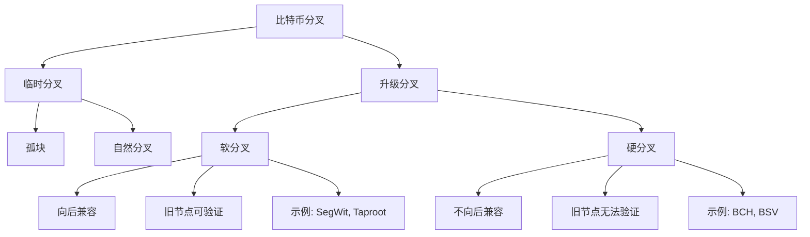

# 比特币分叉详解

## 1. 分叉基础概念

### 1.1 分叉类型



### 1.2 分叉检测器

```java
/**
 * 区块链分叉检测器
 */
public class ForkDetector {

    private BitcoinRpcClient rpcClient;
    private Map<Integer, List<BlockHeader>> blocksByHeight;

    public static class Fork {
        int forkHeight;
        List<String> branches;
        int longestChainLength;
        String longestChainTip;
        LocalDateTime detectedAt;
    }

    public static class BlockHeader {
        String hash;
        int height;
        String previousHash;
        long timestamp;
        int confirmations;
    }

    /**
     * 检测当前是否存在分叉
     */
    public Fork detectFork() throws Exception {
        // 获取当前最佳链
        JSONObject blockchainInfo = rpcClient.call("getblockchaininfo");
        int bestHeight = blockchainInfo.getInt("blocks");
        String bestHash = blockchainInfo.getString("bestblockhash");

        // 检查最近100个区块
        int checkDepth = Math.min(100, bestHeight);

        blocksByHeight = new HashMap<>();

        // 收集区块信息
        for (int height = bestHeight; height > bestHeight - checkDepth; height--) {
            List<BlockHeader> blocksAtHeight = getBlocksAtHeight(height);
            if (blocksAtHeight.size() > 1) {
                // 发现分叉
                return analyzeFork(height, blocksAtHeight);
            }
            blocksByHeight.put(height, blocksAtHeight);
        }

        return null; // 未检测到分叉
    }

    private List<BlockHeader> getBlocksAtHeight(int height) throws Exception {
        List<BlockHeader> blocks = new ArrayList<>();

        // 获取指定高度的区块哈希
        String blockHash = rpcClient.call("getblockhash", height)
            .getString("result");

        JSONObject blockInfo = rpcClient.call("getblock", blockHash);

        BlockHeader header = new BlockHeader();
        header.hash = blockHash;
        header.height = height;
        header.previousHash = blockInfo.getString("previousblockhash");
        header.timestamp = blockInfo.getLong("time");
        header.confirmations = blockInfo.getInt("confirmations");

        blocks.add(header);

        // 检查是否有其他区块在同一高度（通过扫描孤块）
        // 实际实现需要维护孤块池
        blocks.addAll(findOrphansAtHeight(height));

        return blocks;
    }

    private List<BlockHeader> findOrphansAtHeight(int height) {
        // 在孤块池中查找相同高度的区块
        return new ArrayList<>();
    }

    private Fork analyzeFork(int forkHeight, List<BlockHeader> competingBlocks) {
        Fork fork = new Fork();
        fork.forkHeight = forkHeight;
        fork.branches = new ArrayList<>();
        fork.detectedAt = LocalDateTime.now();

        // 分析每个分支
        int maxLength = 0;
        for (BlockHeader block : competingBlocks) {
            fork.branches.add(block.hash);

            if (block.confirmations > maxLength) {
                maxLength = block.confirmations;
                fork.longestChainTip = block.hash;
            }
        }

        fork.longestChainLength = maxLength;

        return fork;
    }

    /**
     * 计算重组深度
     */
    public int calculateReorgDepth(String oldTip, String newTip) throws Exception {
        // 找到共同祖先
        Set<String> oldChain = new HashSet<>();

        String current = oldTip;
        while (current != null) {
            oldChain.add(current);

            JSONObject block = rpcClient.call("getblock", current);
            if (!block.has("previousblockhash")) {
                break;
            }
            current = block.getString("previousblockhash");
        }

        // 从新链往回找
        int depth = 0;
        current = newTip;

        while (current != null) {
            if (oldChain.contains(current)) {
                return depth;
            }

            depth++;
            JSONObject block = rpcClient.call("getblock", current);
            if (!block.has("previousblockhash")) {
                break;
            }
            current = block.getString("previousblockhash");
        }

        return -1; // 未找到共同祖先
    }
}
```

## 2. 软分叉

### 2.1 软分叉实现原理

```java
/**
 * 软分叉激活管理器
 */
public class SoftForkActivation {

    public enum ActivationMethod {
        BIP9,      // 版本位信号
        BIP8,      // 强制激活
        BURIED     // 已埋藏的分叉
    }

    public static class SoftFork {
        String name;
        int bit;              // BIP9使用的信号位
        long startTime;       // 激活开始时间
        long timeout;         // 超时时间
        int minActivationHeight; // 最小激活高度
        ActivationMethod method;
    }

    public enum ForkStatus {
        DEFINED,    // 已定义
        STARTED,    // 已开始
        LOCKED_IN,  // 已锁定
        ACTIVE,     // 已激活
        FAILED      // 失败
    }

    private BitcoinRpcClient rpcClient;

    /**
     * BIP9版本位信号检测
     */
    public ForkStatus checkBIP9Status(SoftFork fork) throws Exception {
        JSONObject blockchainInfo = rpcClient.call("getblockchaininfo");
        JSONObject softforks = blockchainInfo.getJSONObject("softforks");

        if (!softforks.has(fork.name)) {
            return ForkStatus.DEFINED;
        }

        JSONObject forkInfo = softforks.getJSONObject(fork.name);
        String status = forkInfo.getString("status");

        return ForkStatus.valueOf(status.toUpperCase());
    }

    /**
     * 计算信号百分比
     */
    public double calculateSignalPercentage(SoftFork fork, int checkBlocks) throws Exception {
        JSONObject blockchainInfo = rpcClient.call("getblockchaininfo");
        int currentHeight = blockchainInfo.getInt("blocks");

        int signalCount = 0;

        for (int i = 0; i < checkBlocks; i++) {
            int height = currentHeight - i;
            String blockHash = rpcClient.call("getblockhash", height)
                .getString("result");

            JSONObject block = rpcClient.call("getblock", blockHash);
            long version = block.getLong("version");

            // 检查版本位
            if (isSignaling(version, fork.bit)) {
                signalCount++;
            }
        }

        return (signalCount * 100.0) / checkBlocks;
    }

    /**
     * 检查区块是否在信号
     */
    private boolean isSignaling(long version, int bit) {
        // BIP9: 版本号的第29位为1表示使用BIP9
        long bip9Mask = 0x20000000L;
        if ((version & bip9Mask) == 0) {
            return false;
        }

        // 检查指定的信号位
        return (version & (1L << bit)) != 0;
    }

    /**
     * 创建支持软分叉的区块
     */
    public Block createSignalingBlock(Block template, SoftFork fork) {
        Block block = new Block(template);

        // 设置版本号以支持软分叉
        long version = block.getVersion();

        // 设置BIP9标志位
        version |= 0x20000000L;

        // 设置软分叉信号位
        version |= (1L << fork.bit);

        block.setVersion(version);

        return block;
    }

    /**
     * 验证软分叉规则
     */
    public boolean validateSoftForkRules(Block block, SoftFork fork) {
        switch (fork.name) {
            case "segwit":
                return validateSegWitRules(block);
            case "taproot":
                return validateTaprootRules(block);
            default:
                return true;
        }
    }

    private boolean validateSegWitRules(Block block) {
        for (Transaction tx : block.getTransactions()) {
            // 检查witness数据
            if (tx.hasWitness()) {
                // 验证witness规则
                if (!verifyWitness(tx)) {
                    return false;
                }
            }
        }
        return true;
    }

    private boolean validateTaprootRules(Block block) {
        for (Transaction tx : block.getTransactions()) {
            for (TxInput input : tx.getInputs()) {
                // 检查Taproot输入
                if (isTaprootInput(input)) {
                    if (!verifyTaprootSignature(input, tx)) {
                        return false;
                    }
                }
            }
        }
        return true;
    }

    private boolean verifyWitness(Transaction tx) {
        // SegWit验证逻辑
        return true;
    }

    private boolean isTaprootInput(TxInput input) {
        // 检查是否为Taproot输入
        return false;
    }

    private boolean verifyTaprootSignature(TxInput input, Transaction tx) {
        // Taproot签名验证
        return true;
    }
}
```

### 2.2 重要软分叉历史

```java
/**
 * 比特币软分叉历史记录
 */
public class BitcoinSoftForks {

    public static final List<HistoricalSoftFork> SOFT_FORKS = Arrays.asList(
        // BIP34: 区块高度在coinbase中
        new HistoricalSoftFork(
            "BIP34",
            227931,
            LocalDate.of(2013, 3, 24),
            "区块高度必须在coinbase交易中",
            ActivationMethod.VERSION_BITS
        ),

        // BIP66: 严格DER签名
        new HistoricalSoftFork(
            "BIP66",
            363725,
            LocalDate.of(2015, 7, 4),
            "要求严格的DER编码签名",
            ActivationMethod.VERSION_BITS
        ),

        // BIP65: CHECKLOCKTIMEVERIFY
        new HistoricalSoftFork(
            "BIP65",
            388381,
            LocalDate.of(2015, 12, 13),
            "引入OP_CHECKLOCKTIMEVERIFY操作码",
            ActivationMethod.VERSION_BITS
        ),

        // BIP141/143/147: 隔离见证
        new HistoricalSoftFork(
            "SegWit",
            481824,
            LocalDate.of(2017, 8, 24),
            "隔离见证,修复交易可塑性,增加容量",
            ActivationMethod.BIP9
        ),

        // BIP340/341/342: Taproot
        new HistoricalSoftFork(
            "Taproot",
            709632,
            LocalDate.of(2021, 11, 14),
            "Schnorr签名,Taproot输出,Tapscript",
            ActivationMethod.BIP8
        )
    );

    public static class HistoricalSoftFork {
        String name;
        int activationHeight;
        LocalDate activationDate;
        String description;
        ActivationMethod method;

        public HistoricalSoftFork(String name, int height, LocalDate date,
                                  String desc, ActivationMethod method) {
            this.name = name;
            this.activationHeight = height;
            this.activationDate = date;
            this.description = desc;
            this.method = method;
        }
    }

    /**
     * 检查区块是否需要遵循特定软分叉规则
     */
    public static boolean isSoftForkActive(String forkName, int blockHeight) {
        return SOFT_FORKS.stream()
            .filter(fork -> fork.name.equals(forkName))
            .anyMatch(fork -> blockHeight >= fork.activationHeight);
    }

    /**
     * 生成软分叉时间线报告
     */
    public static String generateTimeline() {
        StringBuilder sb = new StringBuilder();
        sb.append("比特币软分叉历史\n");
        sb.append("=".repeat(50)).append("\n\n");

        for (HistoricalSoftFork fork : SOFT_FORKS) {
            sb.append(String.format("%-15s 高度: %7d  日期: %s\n",
                fork.name,
                fork.activationHeight,
                fork.activationDate
            ));
            sb.append(String.format("  %s\n", fork.description));
            sb.append(String.format("  激活方式: %s\n\n", fork.method));
        }

        return sb.toString();
    }
}
```

## 3. 硬分叉

### 3.1 硬分叉链分离

```java
/**
 * 硬分叉链分离处理
 */
public class HardForkHandler {

    public static class ChainSplit {
        String chainName;
        int splitHeight;
        LocalDate splitDate;
        String splitBlockHash;
        List<String> changes;
    }

    /**
     * 比特币历史上的主要硬分叉
     */
    public static final List<ChainSplit> MAJOR_HARD_FORKS = Arrays.asList(
        new ChainSplit() {{
            chainName = "Bitcoin Cash (BCH)";
            splitHeight = 478558;
            splitDate = LocalDate.of(2017, 8, 1);
            splitBlockHash = "000000000000000000651ef99cb9fcbe0dadde1d424bd9f15ff20136191a5eec";
            changes = Arrays.asList(
                "区块大小增加到8MB",
                "移除RBF",
                "新的难度调整算法",
                "重放保护"
            );
        }},

        new ChainSplit() {{
            chainName = "Bitcoin SV (BSV)";
            splitHeight = 556766;
            splitDate = LocalDate.of(2018, 11, 15);
            splitBlockHash = "0000000000000000004626ff6e3b936941d341c5932ece4357eeccac44e6d56c";
            changes = Arrays.asList(
                "区块大小增加到128MB",
                "恢复原始操作码",
                "移除区块大小限制"
            );
        }},

        new ChainSplit() {{
            chainName = "Bitcoin Gold (BTG)";
            splitHeight = 491407;
            splitDate = LocalDate.of(2017, 10, 24);
            splitBlockHash = "00000000000000000096a8f45a63c8e4ce8c87e9f7f4bfc7f70e67b7a4fc48b7";
            changes = Arrays.asList(
                "算法改为Equihash",
                "抗ASIC挖矿",
                "重放保护"
            );
        }}
    );

    /**
     * 检测是否在硬分叉点
     */
    public boolean isAtHardForkHeight(int currentHeight) {
        return MAJOR_HARD_FORKS.stream()
            .anyMatch(fork -> fork.splitHeight == currentHeight);
    }

    /**
     * 实现重放保护
     */
    public static class ReplayProtection {

        /**
         * 为交易添加重放保护标记
         */
        public Transaction addReplayProtection(Transaction tx, String chainId) {
            // 方法1: 修改签名哈希类型
            tx.setSigHashType(getSigHashType(chainId));

            // 方法2: 添加特殊输出(OP_RETURN)
            TxOutput marker = new TxOutput();
            marker.setValue(0);
            marker.setScriptPubKey(createChainMarker(chainId));
            tx.addOutput(marker);

            return tx;
        }

        /**
         * 验证重放保护
         */
        public boolean verifyReplayProtection(Transaction tx, String expectedChain) {
            // 检查签名哈希类型
            int sigHashType = tx.getSigHashType();
            if (!isValidSigHashForChain(sigHashType, expectedChain)) {
                return false;
            }

            // 检查链标记
            for (TxOutput output : tx.getOutputs()) {
                byte[] script = output.getScriptPubKey();
                if (isChainMarker(script, expectedChain)) {
                    return true;
                }
            }

            return false;
        }

        private int getSigHashType(String chainId) {
            // BCH使用SIGHASH_FORKID (0x40)
            if ("BCH".equals(chainId)) {
                return 0x41; // SIGHASH_ALL | SIGHASH_FORKID
            }
            return 0x01; // SIGHASH_ALL
        }

        private byte[] createChainMarker(String chainId) {
            // 创建OP_RETURN输出标记链
            ByteArrayOutputStream baos = new ByteArrayOutputStream();
            baos.write(OP_RETURN);
            byte[] marker = chainId.getBytes();
            baos.write(marker.length);
            baos.writeBytes(marker);
            return baos.toByteArray();
        }

        private boolean isValidSigHashForChain(int sigHashType, String chain) {
            if ("BCH".equals(chain) || "BSV".equals(chain)) {
                return (sigHashType & 0x40) != 0; // 必须有FORKID标志
            }
            return (sigHashType & 0x40) == 0; // 不能有FORKID标志
        }

        private boolean isChainMarker(byte[] script, String chain) {
            if (script.length < 2 || script[0] != OP_RETURN) {
                return false;
            }

            int dataLen = script[1];
            if (script.length < 2 + dataLen) {
                return false;
            }

            byte[] data = Arrays.copyOfRange(script, 2, 2 + dataLen);
            String marker = new String(data);

            return marker.equals(chain);
        }
    }
}
```

### 3.2 硬分叉代币提取

```java
/**
 * 硬分叉代币提取工具
 */
public class ForkCoinClaimer {

    /**
     * 从分叉链提取代币
     */
    public static class ClaimProcess {

        /**
         * 步骤1: 导出比特币私钥
         */
        public List<String> exportPrivateKeys(String walletPath) throws Exception {
            List<String> privateKeys = new ArrayList<>();

            // 从Bitcoin Core钱包导出
            ProcessBuilder pb = new ProcessBuilder(
                "bitcoin-cli",
                "dumpwallet",
                "wallet_backup.txt"
            );

            Process process = pb.start();
            process.waitFor();

            // 解析导出的私钥
            try (BufferedReader reader = Files.newBufferedReader(
                    Paths.get("wallet_backup.txt"))) {
                String line;
                while ((line = reader.readLine()) != null) {
                    if (line.contains("# addr=")) {
                        String[] parts = line.split(" ");
                        String privateKey = parts[0];
                        privateKeys.add(privateKey);
                    }
                }
            }

            return privateKeys;
        }

        /**
         * 步骤2: 在分叉链上导入私钥
         */
        public void importToForkChain(List<String> privateKeys, String forkRpcUrl)
                throws Exception {
            BitcoinRpcClient forkClient = new BitcoinRpcClient(forkRpcUrl);

            for (String privateKey : privateKeys) {
                try {
                    // 导入私钥(不重新扫描)
                    forkClient.call("importprivkey", privateKey, "", false);
                } catch (Exception e) {
                    System.err.println("导入失败: " + privateKey);
                }
            }

            // 最后触发一次区块链扫描
            forkClient.call("rescanblockchain");
        }

        /**
         * 步骤3: 构建分叉链交易
         */
        public String createForkTransaction(
                BitcoinRpcClient forkClient,
                String recipientAddress,
                double amount) throws Exception {

            // 列出所有UTXO
            JSONArray utxos = forkClient.call("listunspent").getJSONArray("result");

            if (utxos.length() == 0) {
                throw new RuntimeException("没有可用的UTXO");
            }

            // 选择UTXO
            List<UTXO> selectedUtxos = selectUTXOs(utxos, amount);

            // 创建原始交易
            JSONArray inputs = new JSONArray();
            for (UTXO utxo : selectedUtxos) {
                JSONObject input = new JSONObject();
                input.put("txid", utxo.txid);
                input.put("vout", utxo.vout);
                inputs.put(input);
            }

            JSONObject outputs = new JSONObject();
            outputs.put(recipientAddress, amount);

            // 添加找零
            double totalInput = selectedUtxos.stream()
                .mapToDouble(u -> u.amount)
                .sum();
            double fee = 0.0001;
            double change = totalInput - amount - fee;

            if (change > 0.00001) {
                String changeAddr = forkClient.call("getrawchangeaddress")
                    .getString("result");
                outputs.put(changeAddr, change);
            }

            // 创建交易
            String rawTx = forkClient.call("createrawtransaction", inputs, outputs)
                .getString("result");

            // 签名交易
            JSONObject signResult = forkClient.call("signrawtransactionwithwallet", rawTx);
            String signedTx = signResult.getString("hex");

            // 广播交易
            String txid = forkClient.call("sendrawtransaction", signedTx)
                .getString("result");

            return txid;
        }

        private List<UTXO> selectUTXOs(JSONArray utxos, double targetAmount) {
            List<UTXO> selected = new ArrayList<>();
            double total = 0;

            for (int i = 0; i < utxos.length(); i++) {
                JSONObject utxo = utxos.getJSONObject(i);

                UTXO u = new UTXO();
                u.txid = utxo.getString("txid");
                u.vout = utxo.getInt("vout");
                u.amount = utxo.getDouble("amount");

                selected.add(u);
                total += u.amount;

                if (total >= targetAmount + 0.0001) {
                    break;
                }
            }

            return selected;
        }

        static class UTXO {
            String txid;
            int vout;
            double amount;
        }
    }

    /**
     * 安全建议
     */
    public static class SecurityAdvice {

        public static List<String> getSecurityChecklist() {
            return Arrays.asList(
                "1. 在提取分叉币之前,先将BTC转移到新地址",
                "2. 使用专用的分叉链节点,不要泄露私钥到未知节点",
                "3. 验证分叉链的重放保护机制",
                "4. 小额测试后再进行大额操作",
                "5. 使用硬件钱包进行签名操作",
                "6. 注意分叉链可能存在的安全漏洞",
                "7. 备份所有私钥和助记词",
                "8. 分叉币提取完成后立即转移到新地址"
            );
        }

        /**
         * 验证分叉链节点安全性
         */
        public boolean verifyForkNodeSafety(String rpcUrl) {
            try {
                BitcoinRpcClient client = new BitcoinRpcClient(rpcUrl);

                // 检查节点信息
                JSONObject info = client.call("getblockchaininfo");
                String chain = info.getString("chain");

                // 验证是否为预期的分叉链
                if (!isKnownForkChain(chain)) {
                    System.err.println("警告: 未知的区块链: " + chain);
                    return false;
                }

                // 检查节点是否完全同步
                double progress = info.getDouble("verificationprogress");
                if (progress < 0.9999) {
                    System.err.println("警告: 节点未完全同步");
                    return false;
                }

                return true;

            } catch (Exception e) {
                System.err.println("节点验证失败: " + e.getMessage());
                return false;
            }
        }

        private boolean isKnownForkChain(String chain) {
            return Arrays.asList("main", "test", "regtest", "bch", "bsv", "btg")
                .contains(chain.toLowerCase());
        }
    }
}
```

## 4. 分叉风险与应对

### 4.1 链重组处理

```java
/**
 * 区块链重组处理器
 */
public class ReorgHandler {

    private BitcoinRpcClient rpcClient;
    private List<ReorgListener> listeners;

    public interface ReorgListener {
        void onReorg(ReorgEvent event);
    }

    public static class ReorgEvent {
        int depth;              // 重组深度
        String oldTip;          // 旧链顶
        String newTip;          // 新链顶
        String commonAncestor;  // 共同祖先
        List<String> orphanedBlocks;  // 被孤立的区块
        List<String> orphanedTxs;     // 被孤立的交易
        LocalDateTime occurredAt;
    }

    /**
     * 监控区块链重组
     */
    public void monitorReorgs() {
        String lastTip = null;

        while (true) {
            try {
                String currentTip = getCurrentTip();

                if (lastTip != null && !isDescendantOf(currentTip, lastTip)) {
                    // 检测到重组
                    ReorgEvent event = analyzeReorg(lastTip, currentTip);
                    handleReorg(event);
                }

                lastTip = currentTip;
                Thread.sleep(10000); // 每10秒检查一次

            } catch (Exception e) {
                System.err.println("重组监控错误: " + e.getMessage());
            }
        }
    }

    private String getCurrentTip() throws Exception {
        return rpcClient.call("getbestblockhash").getString("result");
    }

    private boolean isDescendantOf(String descendant, String ancestor) throws Exception {
        String current = descendant;

        // 最多回溯100个区块
        for (int i = 0; i < 100; i++) {
            if (current.equals(ancestor)) {
                return true;
            }

            JSONObject block = rpcClient.call("getblock", current);
            if (!block.has("previousblockhash")) {
                return false;
            }

            current = block.getString("previousblockhash");
        }

        return false;
    }

    private ReorgEvent analyzeReorg(String oldTip, String newTip) throws Exception {
        ReorgEvent event = new ReorgEvent();
        event.oldTip = oldTip;
        event.newTip = newTip;
        event.occurredAt = LocalDateTime.now();
        event.orphanedBlocks = new ArrayList<>();
        event.orphanedTxs = new ArrayList<>();

        // 找到共同祖先
        Set<String> oldChain = new HashSet<>();
        String current = oldTip;

        while (current != null) {
            oldChain.add(current);
            event.orphanedBlocks.add(current);

            JSONObject block = rpcClient.call("getblock", current);
            if (!block.has("previousblockhash")) {
                break;
            }
            current = block.getString("previousblockhash");
        }

        // 从新链查找共同祖先
        current = newTip;
        event.depth = 0;

        while (current != null) {
            if (oldChain.contains(current)) {
                event.commonAncestor = current;
                break;
            }

            event.depth++;
            JSONObject block = rpcClient.call("getblock", current);
            if (!block.has("previousblockhash")) {
                break;
            }
            current = block.getString("previousblockhash");
        }

        // 收集被孤立的交易
        for (String blockHash : event.orphanedBlocks) {
            if (blockHash.equals(event.commonAncestor)) {
                break;
            }

            JSONObject block = rpcClient.call("getblock", blockHash);
            JSONArray txs = block.getJSONArray("tx");

            for (int i = 1; i < txs.length(); i++) { // 跳过coinbase
                event.orphanedTxs.add(txs.getString(i));
            }
        }

        return event;
    }

    private void handleReorg(ReorgEvent event) {
        System.err.println("检测到链重组!");
        System.err.println("重组深度: " + event.depth);
        System.err.println("共同祖先: " + event.commonAncestor);
        System.err.println("孤立交易数: " + event.orphanedTxs.size());

        // 通知所有监听器
        for (ReorgListener listener : listeners) {
            try {
                listener.onReorg(event);
            } catch (Exception e) {
                System.err.println("监听器处理失败: " + e.getMessage());
            }
        }

        // 检查孤立交易是否需要重新广播
        recheckOrphanedTransactions(event.orphanedTxs);
    }

    private void recheckOrphanedTransactions(List<String> txids) {
        for (String txid : txids) {
            try {
                // 检查交易是否在新链中
                rpcClient.call("gettransaction", txid);
                // 交易已在新链中,无需处理

            } catch (Exception e) {
                // 交易不在新链中,可能需要重新广播
                System.out.println("交易 " + txid + " 需要重新广播");
                // 实际应用中可能需要重新构建和广播交易
            }
        }
    }
}
```

### 4.2 交易确认策略

```java
/**
 * 分叉环境下的交易确认策略
 */
public class ConfirmationStrategy {

    /**
     * 根据交易金额推荐确认数
     */
    public int getRecommendedConfirmations(double amountBTC) {
        if (amountBTC < 0.01) {
            return 1;  // 小额交易
        } else if (amountBTC < 1.0) {
            return 3;  // 中等金额
        } else if (amountBTC < 10.0) {
            return 6;  // 大额交易
        } else {
            return 12; // 特大额交易
        }
    }

    /**
     * 评估交易被重组的风险
     */
    public double assessReorgRisk(String txid, int confirmations) throws Exception {
        // 基础风险随确认数指数下降
        double baseRisk = Math.pow(0.5, confirmations);

        // 检查是否有竞争链
        if (hasCompetingChain()) {
            baseRisk *= 2.0; // 风险加倍
        }

        // 检查网络算力变化
        double hashRateChange = getHashRateChange24h();
        if (Math.abs(hashRateChange) > 0.2) {
            baseRisk *= 1.5; // 算力大幅波动增加风险
        }

        return Math.min(baseRisk, 1.0);
    }

    /**
     * 等待足够确认
     */
    public boolean waitForSafeConfirmations(
            String txid,
            double amountBTC,
            int timeoutMinutes) throws Exception {

        int required = getRecommendedConfirmations(amountBTC);
        long startTime = System.currentTimeMillis();
        long timeout = timeoutMinutes * 60 * 1000;

        while (System.currentTimeMillis() - startTime < timeout) {
            int confirmations = getConfirmations(txid);

            if (confirmations >= required) {
                // 额外检查是否有重组风险
                double risk = assessReorgRisk(txid, confirmations);

                if (risk < 0.01) { // 风险低于1%
                    return true;
                }
            }

            Thread.sleep(60000); // 每分钟检查一次
        }

        return false;
    }

    private boolean hasCompetingChain() {
        // 检查是否有竞争链(通过监控网络中的孤块)
        return false;
    }

    private double getHashRateChange24h() {
        // 计算24小时算力变化
        return 0.0;
    }

    private int getConfirmations(String txid) throws Exception {
        // 获取交易确认数
        return 0;
    }
}
```

## 5. 相关文档

- [比特币共识机制详解](./12.比特币共识机制详解)
- [比特币改进提案(BIPs)详解](./18.比特币改进提案(BIPs)详解)
- [比特币安全机制](./14.比特币安全机制)

## 参考资源

- [BIP9: Version bits with timeout and delay](https://github.com/bitcoin/bips/blob/master/bip-0009.mediawiki)
- [BIP8: Version bits with lock-in by height](https://github.com/bitcoin/bips/blob/master/bip-0008.mediawiki)
- [Bitcoin Forks History](https://forkdrop.io)