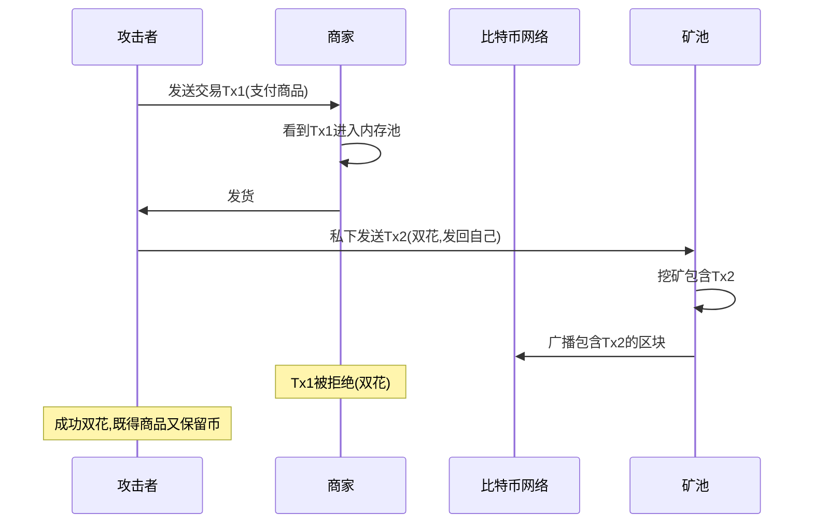

---
title: 比特币攻击案例分析
date: 2025-09-30
permalink: /blockchain/bitcoin-attack-cases.html
categories:
  - Technology
  - Learning
---

# 比特币攻击案例分析

## 1. 双花攻击

### 1.1 双花攻击原理



### 1.2 双花攻击检测

```java
/**
 * 双花攻击检测器
 */
public class DoubleSpendDetector {

    private BitcoinRpcClient rpcClient;
    private Map<String, Set<String>> utxoSpenders; // UTXO -> 花费它的交易

    /**
     * 检测交易是否存在双花风险
     */
    public DoubleSpendRisk assessDoubleSpendRisk(String txid) throws Exception {
        JSONObject tx = rpcClient.call("getrawtransaction", txid, true);
        JSONArray inputs = tx.getJSONArray("vin");

        DoubleSpendRisk risk = new DoubleSpendRisk();
        risk.txid = txid;
        risk.risk = RiskLevel.LOW;

        // 检查每个输入
        for (int i = 0; i < inputs.length(); i++) {
            JSONObject input = inputs.getJSONObject(i);
            String prevTxid = input.getString("txid");
            int prevVout = input.getInt("vout");
            String utxoKey = prevTxid + ":" + prevVout;

            // 检查是否有其他交易也在花费这个UTXO
            Set<String> spenders = utxoSpenders.getOrDefault(utxoKey, new HashSet<>());
            spenders.add(txid);

            if (spenders.size() > 1) {
                // 发现双花!
                risk.risk = RiskLevel.CRITICAL;
                risk.conflictingTxs.addAll(spenders);
                risk.conflictingUTXO = utxoKey;
            }

            utxoSpenders.put(utxoKey, spenders);
        }

        // 检查是否使用RBF
        if (isRBFEnabled(tx)) {
            risk.rbfEnabled = true;
            if (risk.risk == RiskLevel.LOW) {
                risk.risk = RiskLevel.MEDIUM;
            }
        }

        // 检查确认数
        int confirmations = tx.optInt("confirmations", 0);
        if (confirmations == 0) {
            risk.risk = Math.max(risk.risk.ordinal(), RiskLevel.MEDIUM.ordinal())
                == RiskLevel.MEDIUM.ordinal() ? RiskLevel.MEDIUM : risk.risk;
        }

        return risk;
    }

    /**
     * 检查是否启用RBF
     */
    private boolean isRBFEnabled(JSONObject tx) {
        JSONArray inputs = tx.getJSONArray("vin");
        for (int i = 0; i < inputs.length(); i++) {
            JSONObject input = inputs.getJSONObject(i);
            long sequence = input.getLong("sequence");
            // 如果sequence < 0xfffffffe,表示启用了RBF
            if (sequence < 0xfffffffeL) {
                return true;
            }
        }
        return false;
    }

    /**
     * 监控双花攻击
     */
    public void monitorDoubleSpends() {
        // 监听内存池中的所有交易
        while (true) {
            try {
                JSONArray mempool = rpcClient.call("getrawmempool")
                    .getJSONArray("result");

                for (int i = 0; i < mempool.length(); i++) {
                    String txid = mempool.getString(i);
                    DoubleSpendRisk risk = assessDoubleSpendRisk(txid);

                    if (risk.risk == RiskLevel.CRITICAL) {
                        alertDoubleSpend(risk);
                    }
                }

                Thread.sleep(5000);
            } catch (Exception e) {
                System.err.println("监控错误: " + e.getMessage());
            }
        }
    }

    /**
     * 发送双花告警
     */
    private void alertDoubleSpend(DoubleSpendRisk risk) {
        System.err.println("⚠️ 检测到双花攻击!");
        System.err.println("交易: " + risk.txid);
        System.err.println("冲突交易: " + risk.conflictingTxs);
        System.err.println("冲突UTXO: " + risk.conflictingUTXO);

        // 发送告警通知
        sendAlert(risk);
    }

    private void sendAlert(DoubleSpendRisk risk) {
        // 实现告警通知(邮件、短信、Webhook等)
    }

    public enum RiskLevel {
        LOW, MEDIUM, HIGH, CRITICAL
    }

    public static class DoubleSpendRisk {
        String txid;
        RiskLevel risk;
        boolean rbfEnabled;
        Set<String> conflictingTxs = new HashSet<>();
        String conflictingUTXO;
    }
}
```

### 1.3 真实案例: 2019年BTG 51%攻击

```java
/**
 * BTG 51%攻击案例分析
 */
public class BTG51AttackCase {

    /**
     * 攻击时间线
     */
    public static void analyzeAttack() {
        System.out.println("=== Bitcoin Gold 51%攻击分析 ===\n");

        System.out.println("时间: 2019年1月");
        System.out.println("目标: Bitcoin Gold (BTG)");
        System.out.println("损失: 约7,000 BTG (约$70,000)\n");

        System.out.println("攻击过程:");
        System.out.println("1. 攻击者租用算力达到网络51%以上");
        System.out.println("2. 向交易所充值BTG");
        System.out.println("3. 在交易所卖出BTG换成其他币");
        System.out.println("4. 提现其他币");
        System.out.println("5. 使用控制的算力进行链重组");
        System.out.println("6. 重组后的链中,充值交易被替换为发回自己的交易");
        System.out.println("7. 攻击者既得到了交易所的币,又保留了原BTG\n");

        System.out.println("攻击成本:");
        System.out.println("- 租用算力成本: 约$10,000/小时");
        System.out.println("- 攻击时长: 约12小时");
        System.out.println("- 总成本: 约$120,000");
        System.out.println("- 盈利: 负$50,000 (但造成信誉损失)\n");

        System.out.println("防御措施:");
        System.out.println("1. 增加确认数要求(从6个提高到20+)");
        System.out.println("2. 监控大额充值");
        System.out.println("3. 检测链重组");
        System.out.println("4. 算法改为抗ASIC");
    }

    /**
     * 链重组检测
     */
    public static class ReorgDetector {

        /**
         * 检测深度重组
         */
        public boolean detectDeepReorg(int depth) {
            if (depth > 6) {
                System.err.println("⚠️ 检测到深度链重组: " + depth + " 个区块");
                System.err.println("可能存在51%攻击!");
                return true;
            }
            return false;
        }

        /**
         * 监控算力变化
         */
        public void monitorHashrateChange() {
            // 监控网络算力突然大幅增加
            // 可能表示有人租用大量算力准备攻击
        }
    }
}
```

## 2. 交易可塑性攻击

### 2.1 交易可塑性原理

```java
/**
 * 交易可塑性攻击演示
 */
public class TransactionMalleability {

    /**
     * 演示交易可塑性问题(SegWit之前)
     */
    public void demonstrateMalleability() {
        System.out.println("=== 交易可塑性攻击 ===\n");

        // 原始交易
        Transaction originalTx = new Transaction();
        originalTx.setVersion(1);
        // ... 添加输入输出

        // 计算交易ID(包含签名)
        String originalTxid = originalTx.calculateTxid();
        System.out.println("原始TXID: " + originalTxid);

        // 攻击者修改签名(不影响有效性)
        Transaction malleatedTx = malleateTransaction(originalTx);
        String malleatedTxid = malleatedTx.calculateTxid();
        System.out.println("修改后TXID: " + malleatedTxid);

        System.out.println("\n⚠️ 交易ID改变但交易仍然有效!");
        System.out.println("这导致:");
        System.out.println("1. 依赖TXID的系统失效");
        System.out.println("2. 闪电网络等二层协议无法工作");
        System.out.println("3. 可能导致重复支付\n");

        System.out.println("解决方案: SegWit (BIP141)");
        System.out.println("- 将签名移出交易ID计算");
        System.out.println("- TXID不再受签名影响");
    }

    /**
     * 修改交易(保持有效性)
     */
    private Transaction malleateTransaction(Transaction tx) {
        Transaction malleated = tx.clone();

        // 修改签名中的某些字节(DER编码填充等)
        // 不影响签名有效性,但改变交易哈希

        for (TxInput input : malleated.getInputs()) {
            byte[] scriptSig = input.getScriptSig();
            // 在DER编码的签名前添加额外的0字节
            byte[] modifiedSig = addPadding(scriptSig);
            input.setScriptSig(modifiedSig);
        }

        return malleated;
    }

    private byte[] addPadding(byte[] scriptSig) {
        // 添加不必要但合法的填充
        byte[] padded = new byte[scriptSig.length + 1];
        padded[0] = 0x00;
        System.arraycopy(scriptSig, 0, padded, 1, scriptSig.length);
        return padded;
    }

    /**
     * Mt.Gox交易可塑性案例
     */
    public static void mtGoxCase() {
        System.out.println("=== Mt.Gox交易可塑性案例 ===\n");

        System.out.println("时间: 2014年2月");
        System.out.println("受害者: Mt.Gox交易所\n");

        System.out.println("攻击过程:");
        System.out.println("1. 用户请求提现,Mt.Gox创建交易Tx1");
        System.out.println("2. 攻击者获取Tx1,修改签名创建Tx2");
        System.out.println("3. Tx2被矿工先打包确认");
        System.out.println("4. Mt.Gox查询Tx1状态,发现未确认");
        System.out.println("5. Mt.Gox认为提现失败,重新发送");
        System.out.println("6. 攻击者重复此过程,多次提现\n");

        System.out.println("损失: 约850,000 BTC");
        System.out.println("根本原因: 依赖TXID追踪交易状态\n");

        System.out.println("教训:");
        System.out.println("- 不要仅依赖TXID追踪交易");
        System.out.println("- 使用输入UTXO作为唯一标识");
        System.out.println("- 升级到SegWit");
    }
}
```

## 3. 时间盗窃攻击

### 3.1 时间戳篡改

```java
/**
 * 时间盗窃攻击
 */
public class TimeTheftAttack {

    /**
     * 分析时间戳攻击
     */
    public void analyzeTimeAttack() {
        System.out.println("=== 时间盗窃攻击 ===\n");

        System.out.println("攻击原理:");
        System.out.println("矿工可以在一定范围内伪造区块时间戳\n");

        System.out.println("比特币时间戳规则:");
        System.out.println("1. 必须大于前11个区块时间的中位数");
        System.out.println("2. 必须小于网络调整时间 + 2小时\n");

        System.out.println("攻击方式:");
        System.out.println("1. 矿工故意将时间戳设置得更早");
        System.out.println("2. 影响难度调整算法");
        System.out.println("3. 降低挖矿难度,获得不公平优势\n");

        System.out.println("实际案例:");
        System.out.println("- 2018年,某矿池被发现系统性地操纵时间戳");
        System.out.println("- 通过将时间戳提前约1小时");
        System.out.println("- 在难度调整时获得约0.5%的优势");
    }

    /**
     * 检测时间戳异常
     */
    public static class TimestampAnomalyDetector {

        public void detectAnomalies(List<Block> blocks) {
            System.out.println("检测时间戳异常...\n");

            for (int i = 11; i < blocks.size(); i++) {
                Block current = blocks.get(i);

                // 检查中位数规则
                long medianTime = calculateMedianTime(blocks, i);
                if (current.getTimestamp() <= medianTime) {
                    System.err.println("⚠️ 区块 " + current.getHeight() +
                        " 违反中位数规则!");
                }

                // 检查是否异常提前
                Block previous = blocks.get(i - 1);
                long timeDiff = current.getTimestamp() - previous.getTimestamp();

                if (timeDiff < -600) { // 早于前一个区块10分钟以上
                    System.err.println("⚠️ 区块 " + current.getHeight() +
                        " 时间戳异常提前: " + timeDiff + "秒");
                }

                // 检查是否异常滞后
                if (timeDiff > 7200) { // 晚于前一个区块2小时以上
                    System.err.println("⚠️ 区块 " + current.getHeight() +
                        " 时间戳异常滞后: " + timeDiff + "秒");
                }
            }
        }

        private long calculateMedianTime(List<Block> blocks, int currentIndex) {
            List<Long> times = new ArrayList<>();
            for (int i = currentIndex - 11; i < currentIndex; i++) {
                times.add(blocks.get(i).getTimestamp());
            }
            Collections.sort(times);
            return times.get(5); // 中位数
        }
    }
}
```

## 4. 自私挖矿

### 4.1 自私挖矿策略

```java
/**
 * 自私挖矿分析
 */
public class SelfishMining {

    /**
     * 自私挖矿模拟
     */
    public void simulateSelfishMining() {
        System.out.println("=== 自私挖矿策略 ===\n");

        System.out.println("策略:");
        System.out.println("1. 矿工挖到区块后不立即广播");
        System.out.println("2. 继续在私有链上挖矿");
        System.out.println("3. 当诚实矿工找到区块时:");
        System.out.println("   - 如果私有链更长,立即广播私有链");
        System.out.println("   - 如果长度相同,广播制造分叉");
        System.out.println("   - 如果私有链更短,放弃私有链\n");

        System.out.println("理论收益:");
        System.out.println("- 拥有33%算力时,可获得约37%的区块奖励");
        System.out.println("- 但实际中很少见,因为:");
        System.out.println("  1. 风险高(可能白费算力)");
        System.out.println("  2. 需要持续投入");
        System.out.println("  3. 损害网络价值\n");
    }

    /**
     * 检测自私挖矿
     */
    public static class SelfishMiningDetector {

        /**
         * 检测异常的孤块率
         */
        public void detectSelfishMining(List<Block> recentBlocks) {
            Map<String, Integer> minerBlocks = new HashMap<>();
            Map<String, Integer> minerOrphans = new HashMap<>();

            for (Block block : recentBlocks) {
                String miner = block.getMiner();

                minerBlocks.merge(miner, 1, Integer::sum);

                if (block.isOrphan()) {
                    minerOrphans.merge(miner, 1, Integer::sum);
                }
            }

            // 分析每个矿工的孤块率
            System.out.println("矿工孤块率分析:\n");

            for (String miner : minerBlocks.keySet()) {
                int total = minerBlocks.get(miner);
                int orphans = minerOrphans.getOrDefault(miner, 0);
                double orphanRate = (orphans * 100.0) / total;

                System.out.printf("矿工: %s, 孤块率: %.2f%%", miner, orphanRate);

                // 正常孤块率约1-2%
                if (orphanRate > 5.0) {
                    System.out.print(" ⚠️ 异常!");
                }
                System.out.println();
            }
        }

        /**
         * 检测异常的区块发布延迟
         */
        public void detectBlockWithholding(List<Block> blocks) {
            System.out.println("\n检测区块扣留...\n");

            for (int i = 1; i < blocks.size(); i++) {
                Block block = blocks.get(i);
                Block previous = blocks.get(i - 1);

                // 检查区块发现时间 vs 传播时间
                long miningTime = block.getTimestamp() - previous.getTimestamp();
                long propagationDelay = block.getFirstSeenTime() - block.getTimestamp();

                // 正常传播延迟应该在几秒内
                if (propagationDelay > 60) {
                    System.err.printf(
                        "⚠️ 区块 %d 传播延迟异常: %d秒\n",
                        block.getHeight(),
                        propagationDelay
                    );
                    System.err.println("   可能的区块扣留!");
                }
            }
        }
    }
}
```

## 5. Eclipse攻击

### 5.1 Eclipse攻击原理

```java
/**
 * Eclipse攻击分析
 */
public class EclipseAttack {

    /**
     * Eclipse攻击演示
     */
    public void demonstrateEclipseAttack() {
        System.out.println("=== Eclipse攻击 ===\n");

        System.out.println("攻击目标: 隔离目标节点");
        System.out.println("攻击方式:");
        System.out.println("1. 攻击者控制大量IP地址");
        System.out.println("2. 填充目标节点的地址管理器");
        System.out.println("3. 目标节点只连接到攻击者节点");
        System.out.println("4. 攻击者控制目标节点看到的区块链视图\n");

        System.out.println("攻击后果:");
        System.out.println("- 目标节点接收虚假交易");
        System.out.println("- 双花攻击更容易成功");
        System.out.println("- 可能导致挖矿浪费算力\n");

        System.out.println("真实案例:");
        System.out.println("2015年,研究人员证明:");
        System.out.println("- 使用约2000个IP可以eclipse比特币节点");
        System.out.println("- 攻击成本相对较低");
    }

    /**
     * Eclipse攻击防御
     */
    public static class EclipseDefense {

        /**
         * 检测Eclipse攻击
         */
        public boolean detectEclipse(NodeInfo nodeInfo) {
            System.out.println("检测Eclipse攻击...\n");

            boolean suspected = false;

            // 检查1: 连接的节点IP段是否过于集中
            Map<String, Integer> ipPrefixCount = new HashMap<>();
            for (String peer : nodeInfo.getPeers()) {
                String prefix = peer.substring(0, peer.lastIndexOf('.'));
                ipPrefixCount.merge(prefix, 1, Integer::sum);
            }

            for (int count : ipPrefixCount.values()) {
                if (count > nodeInfo.getPeers().size() * 0.5) {
                    System.err.println("⚠️ IP段过于集中!");
                    suspected = true;
                }
            }

            // 检查2: 是否长时间无新peer发现
            if (nodeInfo.getNewPeersLast24h() < 10) {
                System.err.println("⚠️ 新peer发现异常少!");
                suspected = true;
            }

            // 检查3: 区块传播延迟是否异常
            if (nodeInfo.getAvgBlockDelay() > 60) {
                System.err.println("⚠️ 区块传播延迟异常!");
                suspected = true;
            }

            // 检查4: 比较区块高度与多个区块浏览器
            int localHeight = nodeInfo.getBlockHeight();
            int explorerHeight = queryBlockExplorer();

            if (Math.abs(localHeight - explorerHeight) > 6) {
                System.err.println("⚠️ 区块高度与公共区块链不一致!");
                suspected = true;
            }

            return suspected;
        }

        /**
         * 防御措施
         */
        public void implementDefense() {
            System.out.println("\nEclipse攻击防御措施:\n");

            System.out.println("1. 连接多样化:");
            System.out.println("   - 确保连接来自不同IP段");
            System.out.println("   - 连接到已知的可信节点");

            System.out.println("\n2. 地址管理:");
            System.out.println("   - 限制每个IP段的地址数量");
            System.out.println("   - 定期轮换连接");

            System.out.println("\n3. 监控:");
            System.out.println("   - 监控peer连接模式");
            System.out.println("   - 对比多个数据源");
            System.out.println("   - 使用多个节点验证");

            System.out.println("\n4. 网络层保护:");
            System.out.println("   - 使用VPN或Tor");
            System.out.println("   - 部署多个节点");
        }

        private int queryBlockExplorer() {
            // 从区块浏览器API查询当前高度
            return 800000;
        }
    }

    public static class NodeInfo {
        private List<String> peers;
        private int newPeersLast24h;
        private long avgBlockDelay;
        private int blockHeight;

        public List<String> getPeers() { return peers; }
        public int getNewPeersLast24h() { return newPeersLast24h; }
        public long getAvgBlockDelay() { return avgBlockDelay; }
        public int getBlockHeight() { return blockHeight; }
    }
}
```

## 6. 粉尘攻击

### 6.1 粉尘攻击分析

```java
/**
 * 粉尘攻击
 */
public class DustAttack {

    /**
     * 粉尘攻击原理
     */
    public void analyzeDustAttack() {
        System.out.println("=== 粉尘攻击 ===\n");

        System.out.println("攻击目的: 去匿名化");
        System.out.println("攻击方式:");
        System.out.println("1. 向大量地址发送极小额比特币(粉尘)");
        System.out.println("2. 等待接收者在交易中使用这些粉尘");
        System.out.println("3. 分析交易模式,关联不同地址");
        System.out.println("4. 追踪用户的交易活动\n");

        System.out.println("真实案例:");
        System.out.println("2019年,币安用户收到粉尘攻击");
        System.out.println("攻击者试图追踪用户资金流向\n");
    }

    /**
     * 检测粉尘交易
     */
    public static class DustDetector {

        private static final long DUST_THRESHOLD = 546; // satoshis

        /**
         * 检测收到的粉尘
         */
        public List<DustUTXO> detectDust(List<UTXO> utxos) {
            List<DustUTXO> dustUTXOs = new ArrayList<>();

            for (UTXO utxo : utxos) {
                if (utxo.amount <= DUST_THRESHOLD) {
                    DustUTXO dust = new DustUTXO();
                    dust.utxo = utxo;
                    dust.timestamp = System.currentTimeMillis();

                    // 分析发送者
                    dust.suspiciousPattern = analyzeSenderPattern(utxo);

                    dustUTXOs.add(dust);
                }
            }

            return dustUTXOs;
        }

        /**
         * 分析发送者模式
         */
        private boolean analyzeSenderPattern(UTXO utxo) {
            // 检查是否同一发送者向多个地址发送粉尘
            // 这是典型的粉尘攻击模式
            return false;
        }

        /**
         * 防御建议
         */
        public void defenseRecommendation(List<DustUTXO> dustUTXOs) {
            if (dustUTXOs.isEmpty()) {
                System.out.println("未检测到粉尘");
                return;
            }

            System.out.println("⚠️ 检测到 " + dustUTXOs.size() + " 个粉尘UTXO\n");

            System.out.println("防御建议:");
            System.out.println("1. 不要花费这些粉尘UTXO");
            System.out.println("2. 使用UTXO控制功能隔离粉尘");
            System.out.println("3. 使用新地址接收资金");
            System.out.println("4. 考虑使用隐私增强技术(CoinJoin等)");
        }

        public static class DustUTXO {
            UTXO utxo;
            long timestamp;
            boolean suspiciousPattern;
        }
    }
}
```

## 7. 防御最佳实践

### 7.1 综合防御策略

```java
/**
 * 比特币安全防御框架
 */
public class BitcoinSecurityFramework {

    /**
     * 交易所安全检查清单
     */
    public static class ExchangeSecurityChecklist {

        public void performSecurityAudit() {
            System.out.println("=== 交易所安全检查清单 ===\n");

            checkItem("双花防护", () -> {
                System.out.println("✓ 大额充值需要6+确认");
                System.out.println("✓ 监控链重组");
                System.out.println("✓ 检测冲突交易");
            });

            checkItem("热钱包安全", () -> {
                System.out.println("✓ 限制热钱包余额");
                System.out.println("✓ 使用多签控制");
                System.out.println("✓ 定期审计");
            });

            checkItem("冷存储", () -> {
                System.out.println("✓ 95%+资金离线存储");
                System.out.println("✓ 多重签名保护");
                System.out.println("✓ 地理分散");
            });

            checkItem("提现安全", () -> {
                System.out.println("✓ 多重审批流程");
                System.out.println("✓ 提现限额");
                System.out.println("✓ 时间延迟");
            });

            checkItem("监控告警", () -> {
                System.out.println("✓ 实时交易监控");
                System.out.println("✓ 异常行为检测");
                System.out.println("✓ 24/7安全团队");
            });
        }

        private void checkItem(String item, Runnable check) {
            System.out.println("【" + item + "】");
            check.run();
            System.out.println();
        }
    }

    /**
     * 用户安全建议
     */
    public static class UserSecurityGuide {

        public void printSecurityGuide() {
            System.out.println("=== 用户安全指南 ===\n");

            System.out.println("1. 钱包安全:");
            System.out.println("   - 使用硬件钱包存储大额资金");
            System.out.println("   - 备份助记词并离线保存");
            System.out.println("   - 永远不要分享私钥\n");

            System.out.println("2. 交易安全:");
            System.out.println("   - 仔细核对接收地址");
            System.out.println("   - 小额测试后再大额转账");
            System.out.println("   - 使用适当的手续费\n");

            System.out.println("3. 网络安全:");
            System.out.println("   - 使用HTTPS连接");
            System.out.println("   - 验证网站证书");
            System.out.println("   - 避免公共WiFi\n");

            System.out.println("4. 隐私保护:");
            System.out.println("   - 每次交易使用新地址");
            System.out.println("   - 考虑使用混币服务");
            System.out.println("   - 注意粉尘攻击");
        }
    }
}
```

## 8. 相关文档

- [比特币安全机制](./14.比特币安全机制.md)
- [比特币分叉详解](./24.比特币分叉详解.md)
- [比特币冷钱包方案](./29.比特币冷钱包方案.md)

## 参考资源

- [Bitcoin Wiki: Weaknesses](https://en.bitcoin.it/wiki/Weaknesses)
- [Selfish Mining Paper](https://arxiv.org/abs/1311.0243)
- [Eclipse Attacks Paper](https://eprint.iacr.org/2015/263.pdf)