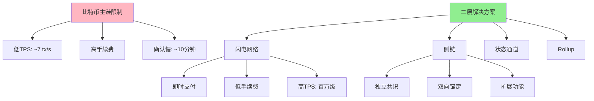

---
title: 比特币二层生态全景
date: 2025-09-30
permalink: /blockchain/bitcoin-layer2-ecosystem.html
categories:
  - Technology
  - Learning
---

# 比特币二层生态全景

## 1. 二层网络概述

### 1.1 为什么需要二层网络



### 1.2 二层网络分类

```java
/**
 * 比特币二层网络分类
 */
public class Layer2Classification {

    public enum Layer2Type {
        PAYMENT_CHANNEL("支付通道", "闪电网络"),
        SIDECHAIN("侧链", "Liquid, RSK"),
        STATE_CHANNEL("状态通道", "通用状态通道"),
        ROLLUP("Rollup", "BitVM"),
        DRIVECHAINS("驱动链", "BIP300/301");

        private String name;
        private String examples;

        Layer2Type(String name, String examples) {
            this.name = name;
            this.examples = examples;
        }

        public String getName() { return name; }
        public String getExamples() { return examples; }
    }

    /**
     * 二层方案对比
     */
    public void compareLayer2Solutions() {
        System.out.println("=== 比特币二层方案对比 ===\n");

        System.out.println("1. 闪电网络 (Lightning Network)");
        System.out.println("   优势: 即时支付, 低手续费, 去中心化");
        System.out.println("   劣势: 需要在线, 流动性限制");
        System.out.println("   适用: 小额高频支付\n");

        System.out.println("2. Liquid侧链");
        System.out.println("   优势: 快速结算, 保密交易, 资产发行");
        System.out.println("   劣势: 联盟链, 部分中心化");
        System.out.println("   适用: 交易所之间转账, 资产发行\n");

        System.out.println("3. RSK (Rootstock)");
        System.out.println("   优势: 智能合约, EVM兼容");
        System.out.println("   劣势: 合并挖矿, 安全性依赖");
        System.out.println("   适用: DeFi应用\n");

        System.out.println("4. Stacks");
        System.out.println("   优势: 原生智能合约, 微块快速确认");
        System.out.println("   劣势: 新链, 生态较小");
        System.out.println("   适用: NFT, DeFi\n");
    }

    /**
     * 性能对比
     */
    public static class PerformanceComparison {
        String solution;
        int tps;
        int confirmationTime; // 秒
        double avgFee;        // satoshi
        String trust;

        public static List<PerformanceComparison> getComparisons() {
            return Arrays.asList(
                new PerformanceComparison("Bitcoin L1", 7, 600, 50000, "去中心化"),
                new PerformanceComparison("Lightning", 1000000, 1, 1, "通道对手"),
                new PerformanceComparison("Liquid", 100, 60, 100, "联盟"),
                new PerformanceComparison("RSK", 20, 30, 1000, "合并挖矿"),
                new PerformanceComparison("Stacks", 40, 10, 2000, "PoX共识")
            );
        }

        PerformanceComparison(String solution, int tps, int time, double fee, String trust) {
            this.solution = solution;
            this.tps = tps;
            this.confirmationTime = time;
            this.avgFee = fee;
            this.trust = trust;
        }
    }
}
```

## 2. 闪电网络详解

### 2.1 支付通道实现

```java
/**
 * 闪电网络支付通道
 */
public class LightningChannel {

    /**
     * 通道状态
     */
    public static class ChannelState {
        String channelId;
        PublicKey nodeA;
        PublicKey nodeB;
        long capacityA;  // A的余额
        long capacityB;  // B的余额
        int commitmentNumber;
        boolean active;
    }

    /**
     * 打开支付通道
     */
    public ChannelState openChannel(
            PublicKey nodeA,
            PublicKey nodeB,
            long fundingAmount) throws Exception {

        // 1. 创建2-of-2多签地址
        String multiSigAddress = createMultiSigAddress(nodeA, nodeB);

        // 2. 创建资金交易
        Transaction fundingTx = new Transaction();
        // ... 添加输入
        TxOutput fundingOutput = new TxOutput();
        fundingOutput.setAddress(multiSigAddress);
        fundingOutput.setValue(fundingAmount);
        fundingTx.addOutput(fundingOutput);

        // 3. 创建初始承诺交易(在资金交易广播前)
        CommitmentTransaction commitment = createInitialCommitment(
            fundingTx, nodeA, nodeB, fundingAmount
        );

        // 4. 双方签名资金交易
        String fundingTxid = broadcastTransaction(fundingTx);

        // 5. 等待确认
        waitForConfirmations(fundingTxid, 3);

        // 6. 通道已打开
        ChannelState state = new ChannelState();
        state.channelId = generateChannelId(fundingTxid);
        state.nodeA = nodeA;
        state.nodeB = nodeB;
        state.capacityA = fundingAmount;
        state.capacityB = 0;
        state.commitmentNumber = 0;
        state.active = true;

        System.out.println("✓ 通道已打开: " + state.channelId);

        return state;
    }

    /**
     * 发送支付
     */
    public ChannelState sendPayment(
            ChannelState state,
            long amount,
            boolean fromAtoB) throws Exception {

        if (!state.active) {
            throw new IllegalStateException("通道未激活");
        }

        // 检查余额
        long senderBalance = fromAtoB ? state.capacityA : state.capacityB;
        if (senderBalance < amount) {
            throw new InsufficientFundsException("余额不足");
        }

        // 更新余额
        if (fromAtoB) {
            state.capacityA -= amount;
            state.capacityB += amount;
        } else {
            state.capacityB -= amount;
            state.capacityA += amount;
        }

        // 创建新的承诺交易
        state.commitmentNumber++;
        CommitmentTransaction newCommitment = createCommitment(state);

        // 撤销旧的承诺交易
        revokeOldCommitment(state.commitmentNumber - 1);

        System.out.printf("✓ 支付完成: %d satoshi, 新余额 A:%d B:%d\n",
            amount, state.capacityA, state.capacityB);

        return state;
    }

    /**
     * 关闭通道(协作关闭)
     */
    public String closeChannel(ChannelState state) throws Exception {
        if (!state.active) {
            throw new IllegalStateException("通道已关闭");
        }

        // 创建最终结算交易
        Transaction closingTx = new Transaction();

        // 输出A的余额
        if (state.capacityA > 0) {
            TxOutput outputA = new TxOutput();
            outputA.setAddress(getAddress(state.nodeA));
            outputA.setValue(state.capacityA);
            closingTx.addOutput(outputA);
        }

        // 输出B的余额
        if (state.capacityB > 0) {
            TxOutput outputB = new TxOutput();
            outputB.setAddress(getAddress(state.nodeB));
            outputB.setValue(state.capacityB);
            closingTx.addOutput(outputB);
        }

        // 双方签名
        signTransaction(closingTx, state.nodeA);
        signTransaction(closingTx, state.nodeB);

        // 广播
        String txid = broadcastTransaction(closingTx);

        state.active = false;

        System.out.println("✓ 通道已关闭: " + txid);

        return txid;
    }

    /**
     * 单方面强制关闭(使用最新承诺交易)
     */
    public String forceClose(ChannelState state) throws Exception {
        System.out.println("⚠️ 强制关闭通道...");

        // 广播最新的承诺交易
        CommitmentTransaction commitment = getLatestCommitment(state);
        String txid = broadcastTransaction(commitment.transaction);

        // 等待时间锁到期
        System.out.println("等待时间锁到期(通常144区块)...");

        return txid;
    }

    /**
     * 创建承诺交易
     */
    private CommitmentTransaction createCommitment(ChannelState state) {
        Transaction tx = new Transaction();

        // 输入: 资金交易输出
        TxInput input = new TxInput();
        input.setPrevTxid(state.channelId);
        input.setPrevVout(0);
        tx.addInput(input);

        // 输出A的余额(带时间锁)
        if (state.capacityA > 0) {
            TxOutput outputA = new TxOutput();
            outputA.setValue(state.capacityA);
            // 使用RSMC (可撤销序列成熟度合约)
            byte[] scriptA = createRSMCScript(
                state.nodeA,
                state.nodeB,
                state.commitmentNumber
            );
            outputA.setScriptPubKey(scriptA);
            tx.addOutput(outputA);
        }

        // 输出B的余额(立即可用)
        if (state.capacityB > 0) {
            TxOutput outputB = new TxOutput();
            outputB.setValue(state.capacityB);
            outputB.setAddress(getAddress(state.nodeB));
            tx.addOutput(outputB);
        }

        CommitmentTransaction commitment = new CommitmentTransaction();
        commitment.transaction = tx;
        commitment.commitmentNumber = state.commitmentNumber;

        return commitment;
    }

    /**
     * 创建RSMC脚本(可撤销序列成熟度合约)
     */
    private byte[] createRSMCScript(
            PublicKey owner,
            PublicKey partner,
            int commitmentNumber) {

        ScriptBuilder builder = new ScriptBuilder();

        // IF (对方撤销)
        builder.op(OP_IF);
        builder.data(partner.getEncoded());
        builder.op(OP_CHECKSIG);

        // ELSE (时间锁后自己取回)
        builder.op(OP_ELSE);
        builder.number(144); // ~1天
        builder.op(OP_CHECKSEQUENCEVERIFY);
        builder.op(OP_DROP);
        builder.data(owner.getEncoded());
        builder.op(OP_CHECKSIG);

        builder.op(OP_ENDIF);

        return builder.build().getBytes();
    }

    /**
     * HTLC (哈希时间锁定合约) - 用于路由支付
     */
    public static class HTLC {
        byte[] paymentHash;
        long amount;
        int expiryHeight;

        /**
         * 创建HTLC脚本
         */
        public byte[] createHTLCScript(
                PublicKey sender,
                PublicKey receiver,
                byte[] paymentHash,
                int locktime) {

            ScriptBuilder builder = new ScriptBuilder();

            // IF (接收方提供原像)
            builder.op(OP_IF);
            builder.op(OP_SHA256);
            builder.data(paymentHash);
            builder.op(OP_EQUALVERIFY);
            builder.data(receiver.getEncoded());
            builder.op(OP_CHECKSIG);

            // ELSE (超时后发送方取回)
            builder.op(OP_ELSE);
            builder.number(locktime);
            builder.op(OP_CHECKLOCKTIMEVERIFY);
            builder.op(OP_DROP);
            builder.data(sender.getEncoded());
            builder.op(OP_CHECKSIG);

            builder.op(OP_ENDIF);

            return builder.build().getBytes();
        }

        /**
         * 使用原像赎回
         */
        public Transaction redeemWithPreimage(byte[] preimage) {
            // 验证原像
            byte[] hash = Hash.sha256(preimage);
            if (!Arrays.equals(hash, paymentHash)) {
                throw new IllegalArgumentException("原像不匹配");
            }

            // 构建赎回交易
            Transaction tx = new Transaction();
            // ... 添加输入输出

            return tx;
        }
    }

    private String createMultiSigAddress(PublicKey a, PublicKey b) {
        return "";
    }

    private CommitmentTransaction createInitialCommitment(
            Transaction fundingTx, PublicKey a, PublicKey b, long amount) {
        return new CommitmentTransaction();
    }

    private String broadcastTransaction(Transaction tx) {
        return "txid";
    }

    private void waitForConfirmations(String txid, int confirmations) {
    }

    private String generateChannelId(String fundingTxid) {
        return fundingTxid.substring(0, 16);
    }

    private void revokeOldCommitment(int commitmentNumber) {
    }

    private String getAddress(PublicKey pubKey) {
        return "";
    }

    private void signTransaction(Transaction tx, PublicKey key) {
    }

    private CommitmentTransaction getLatestCommitment(ChannelState state) {
        return new CommitmentTransaction();
    }

    static class CommitmentTransaction {
        Transaction transaction;
        int commitmentNumber;
    }

    static class InsufficientFundsException extends Exception {
        InsufficientFundsException(String message) {
            super(message);
        }
    }
}
```

### 2.2 路由支付

```java
/**
 * 闪电网络路由
 */
public class LightningRouter {

    /**
     * 路由支付
     */
    public PaymentRoute findRoute(
            PublicKey source,
            PublicKey destination,
            long amount) {

        // 使用Dijkstra算法寻找最优路径
        Graph<PublicKey> graph = buildChannelGraph();

        List<PublicKey> path = dijkstra(graph, source, destination, amount);

        if (path == null) {
            throw new NoRouteFoundException("未找到路由");
        }

        PaymentRoute route = new PaymentRoute();
        route.path = path;
        route.totalFee = calculateRouteFee(path, amount);

        return route;
    }

    /**
     * 执行多跳支付
     */
    public String executeMultiHopPayment(
            PaymentRoute route,
            long amount,
            byte[] paymentSecret) throws Exception {

        // 1. 生成支付哈希
        byte[] paymentHash = Hash.sha256(paymentSecret);

        // 2. 从目标节点向源节点反向设置HTLC
        List<HTLC> htlcs = new ArrayList<>();

        for (int i = route.path.size() - 1; i > 0; i--) {
            PublicKey from = route.path.get(i - 1);
            PublicKey to = route.path.get(i);

            // 计算该跳的超时时间(递减)
            int locktime = 100 + (route.path.size() - i) * 10;

            HTLC htlc = new HTLC();
            htlc.from = from;
            htlc.to = to;
            htlc.amount = amount;
            htlc.paymentHash = paymentHash;
            htlc.locktime = locktime;

            // 在通道中设置HTLC
            setupHTLC(htlc);

            htlcs.add(htlc);
        }

        // 3. 目标节点验证并揭示原像
        System.out.println("目标节点揭示原像...");
        broadcastPreimage(paymentSecret);

        // 4. 各节点依次使用原像赎回
        for (HTLC htlc : htlcs) {
            redeemHTLC(htlc, paymentSecret);
        }

        System.out.println("✓ 多跳支付完成");

        return Hex.encode(paymentHash);
    }

    /**
     * 洋葱路由加密
     */
    public byte[] createOnionPacket(
            List<PublicKey> route,
            long amount,
            byte[] paymentHash) {

        ByteArrayOutputStream packet = new ByteArrayOutputStream();

        // 从最后一跳开始,逐层加密
        byte[] payload = createFinalPayload(amount, paymentHash);

        for (int i = route.size() - 1; i >= 0; i--) {
            PublicKey hop = route.get(i);

            // 创建该跳的指令
            byte[] hopData = createHopData(
                i < route.size() - 1 ? route.get(i + 1) : null,
                amount
            );

            // 使用该节点公钥加密
            payload = encryptLayer(payload, hop);
        }

        return payload;
    }

    /**
     * 解析洋葱包
     */
    public OnionPacket decryptOnionLayer(
            byte[] packet,
            PrivateKey nodeKey) {

        // 使用私钥解密一层
        byte[] decrypted = decryptLayer(packet, nodeKey);

        OnionPacket result = new OnionPacket();
        result.nextHop = parseNextHop(decrypted);
        result.amount = parseAmount(decrypted);
        result.remainingPacket = parseRemainingPacket(decrypted);

        return result;
    }

    private Graph<PublicKey> buildChannelGraph() {
        return new Graph<>();
    }

    private List<PublicKey> dijkstra(
            Graph<PublicKey> graph,
            PublicKey source,
            PublicKey dest,
            long amount) {
        return new ArrayList<>();
    }

    private long calculateRouteFee(List<PublicKey> path, long amount) {
        return path.size() * 1000; // 简化计算
    }

    private void setupHTLC(HTLC htlc) {
    }

    private void redeemHTLC(HTLC htlc, byte[] preimage) {
    }

    private void broadcastPreimage(byte[] preimage) {
    }

    private byte[] createFinalPayload(long amount, byte[] hash) {
        return new byte[0];
    }

    private byte[] createHopData(PublicKey nextHop, long amount) {
        return new byte[0];
    }

    private byte[] encryptLayer(byte[] data, PublicKey pubKey) {
        return data;
    }

    private byte[] decryptLayer(byte[] data, PrivateKey key) {
        return data;
    }

    private PublicKey parseNextHop(byte[] data) {
        return null;
    }

    private long parseAmount(byte[] data) {
        return 0;
    }

    private byte[] parseRemainingPacket(byte[] data) {
        return new byte[0];
    }

    static class PaymentRoute {
        List<PublicKey> path;
        long totalFee;
    }

    static class HTLC {
        PublicKey from;
        PublicKey to;
        long amount;
        byte[] paymentHash;
        int locktime;
    }

    static class OnionPacket {
        PublicKey nextHop;
        long amount;
        byte[] remainingPacket;
    }

    static class NoRouteFoundException extends RuntimeException {
        NoRouteFoundException(String message) {
            super(message);
        }
    }

    static class Graph<T> {
    }
}
```

## 3. 侧链技术

### 3.1 Liquid侧链

```java
/**
 * Liquid侧链实现
 */
public class LiquidSidechain {

    /**
     * Peg-in: 从比特币主链转入Liquid
     */
    public String pegIn(String btcAddress, double amount) throws Exception {
        System.out.println("=== Peg-in 到 Liquid ===\n");

        // 1. 发送BTC到联盟多签地址
        String federationAddress = getLiquidFederationAddress();

        System.out.println("发送 " + amount + " BTC 到联盟地址...");
        String btcTxid = sendBitcoin(btcAddress, federationAddress, amount);

        // 2. 等待确认
        System.out.println("等待102个确认...");
        waitForConfirmations(btcTxid, 102);

        // 3. 联盟签名并在Liquid上铸造L-BTC
        System.out.println("联盟处理peg-in...");
        String liquidTxid = federationMintLBTC(btcTxid, amount);

        System.out.println("✓ Peg-in完成");
        System.out.println("Liquid TXID: " + liquidTxid);

        return liquidTxid;
    }

    /**
     * Peg-out: 从Liquid转回比特币主链
     */
    public String pegOut(String liquidAddress, String btcAddress, double amount)
            throws Exception {
        System.out.println("=== Peg-out 到 Bitcoin ===\n");

        // 1. 在Liquid上销毁L-BTC
        System.out.println("销毁 " + amount + " L-BTC...");
        String burnTxid = burnLBTC(liquidAddress, amount, btcAddress);

        // 2. 联盟签名比特币交易
        System.out.println("联盟处理peg-out请求...");

        // 3. 广播比特币交易
        String btcTxid = federationReleaseBTC(burnTxid, btcAddress, amount);

        System.out.println("✓ Peg-out完成");
        System.out.println("Bitcoin TXID: " + btcTxid);

        return btcTxid;
    }

    /**
     * 保密交易 (Confidential Transactions)
     */
    public String createConfidentialTransaction(
            String sender,
            String recipient,
            double amount) {

        System.out.println("创建保密交易...");

        // 1. 使用Pedersen承诺隐藏金额
        PedersenCommitment commitment = commitAmount(amount);

        // 2. 使用范围证明证明金额为正
        RangeProof rangeProof = createRangeProof(amount);

        // 3. 构建交易
        ConfidentialTransaction tx = new ConfidentialTransaction();
        tx.sender = sender;
        tx.recipient = recipient;
        tx.amountCommitment = commitment;
        tx.rangeProof = rangeProof;

        System.out.println("✓ 保密交易已创建");
        System.out.println("金额对外部观察者不可见");

        return tx.getTxid();
    }

    /**
     * 发行资产
     */
    public String issueAsset(
            String issuerAddress,
            String assetName,
            long totalSupply) throws Exception {

        System.out.println("=== 在Liquid上发行资产 ===\n");

        System.out.println("资产名称: " + assetName);
        System.out.println("总供应量: " + totalSupply);

        // 创建资产发行交易
        AssetIssuance issuance = new AssetIssuance();
        issuance.assetName = assetName;
        issuance.totalSupply = totalSupply;
        issuance.issuer = issuerAddress;

        String assetId = generateAssetId(issuance);
        String txid = broadcastIssuance(issuance);

        System.out.println("✓ 资产已发行");
        System.out.println("Asset ID: " + assetId);
        System.out.println("TXID: " + txid);

        return assetId;
    }

    private String getLiquidFederationAddress() {
        return "3LiquidFederationMultiSigAddress";
    }

    private String sendBitcoin(String from, String to, double amount) {
        return "btc_txid";
    }

    private void waitForConfirmations(String txid, int confirmations) {
    }

    private String federationMintLBTC(String btcTxid, double amount) {
        return "liquid_txid";
    }

    private String burnLBTC(String address, double amount, String btcAddress) {
        return "burn_txid";
    }

    private String federationReleaseBTC(String burnTxid, String btcAddress, double amount) {
        return "btc_txid";
    }

    private PedersenCommitment commitAmount(double amount) {
        return new PedersenCommitment();
    }

    private RangeProof createRangeProof(double amount) {
        return new RangeProof();
    }

    private String generateAssetId(AssetIssuance issuance) {
        return Hash.sha256(issuance.toString().getBytes()).substring(0, 16);
    }

    private String broadcastIssuance(AssetIssuance issuance) {
        return "issuance_txid";
    }

    static class PedersenCommitment {
        byte[] commitment;
    }

    static class RangeProof {
        byte[] proof;
    }

    static class ConfidentialTransaction {
        String sender;
        String recipient;
        PedersenCommitment amountCommitment;
        RangeProof rangeProof;

        String getTxid() {
            return "conf_tx_id";
        }
    }

    static class AssetIssuance {
        String assetName;
        long totalSupply;
        String issuer;
    }
}
```

### 3.2 RSK智能合约

```java
/**
 * RSK (Rootstock) 智能合约平台
 */
public class RSKSmartContracts {

    /**
     * 部署智能合约
     */
    public String deployContract(String solidityCode, String deployerAddress) {
        System.out.println("=== 在RSK上部署智能合约 ===\n");

        // 编译Solidity代码
        byte[] bytecode = compileSolidity(solidityCode);

        // 创建部署交易
        Transaction deployTx = new Transaction();
        deployTx.setFrom(deployerAddress);
        deployTx.setData(bytecode);
        deployTx.setGas(3000000);

        // 广播交易
        String txHash = broadcastTransaction(deployTx);

        // 计算合约地址
        String contractAddress = calculateContractAddress(deployerAddress, txHash);

        System.out.println("✓ 合约已部署");
        System.out.println("合约地址: " + contractAddress);

        return contractAddress;
    }

    /**
     * 调用智能合约
     */
    public Object callContract(
            String contractAddress,
            String method,
            Object[] params) throws Exception {

        System.out.println("调用合约方法: " + method);

        // 编码函数调用
        byte[] callData = encodeMethod(method, params);

        // 创建交易
        Transaction tx = new Transaction();
        tx.setTo(contractAddress);
        tx.setData(callData);

        // 执行
        byte[] result = executeTransaction(tx);

        // 解码返回值
        return decodeResult(result);
    }

    /**
     * RSK与比特币的桥接
     */
    public String bridgeBTCtoRSK(String btcAddress, double amount) throws Exception {
        System.out.println("=== 桥接BTC到RSK ===\n");

        // 1. 发送BTC到RSK桥接地址
        String bridgeAddress = getRSKBridgeAddress();
        String btcTxid = sendBitcoin(btcAddress, bridgeAddress, amount);

        // 2. 等待确认
        waitForConfirmations(btcTxid, 100);

        // 3. RSK桥接合约铸造RBTC
        String rbtcTxid = mintRBTC(btcTxid, amount);

        System.out.println("✓ 桥接完成,收到 " + amount + " RBTC");

        return rbtcTxid;
    }

    private byte[] compileSolidity(String code) {
        return new byte[0];
    }

    private String broadcastTransaction(Transaction tx) {
        return "tx_hash";
    }

    private String calculateContractAddress(String deployer, String txHash) {
        return "0x" + Hash.keccak256((deployer + txHash).getBytes()).substring(0, 40);
    }

    private byte[] encodeMethod(String method, Object[] params) {
        return new byte[0];
    }

    private byte[] executeTransaction(Transaction tx) {
        return new byte[0];
    }

    private Object decodeResult(byte[] result) {
        return null;
    }

    private String getRSKBridgeAddress() {
        return "0xRSKBridgeAddress";
    }

    private String sendBitcoin(String from, String to, double amount) {
        return "btc_txid";
    }

    private void waitForConfirmations(String txid, int confirmations) {
    }

    private String mintRBTC(String btcTxid, double amount) {
        return "rbtc_txid";
    }
}
```

## 4. 新兴Layer 2方案

### 4.1 Stacks

```java
/**
 * Stacks: 比特币智能合约层
 */
public class StacksLayer {

    /**
     * Clarity智能合约示例
     */
    public String deployClarityContract(String contractCode) {
        System.out.println("=== 部署Clarity合约 ===\n");

        // Clarity是一种可判定语言
        String sampleContract = """
            (define-data-var counter int 0)

            (define-public (increment)
              (begin
                (var-set counter (+ (var-get counter) 1))
                (ok (var-get counter))))

            (define-read-only (get-counter)
              (ok (var-get counter)))
            """;

        // 部署合约
        String contractId = deployToStacks(sampleContract);

        System.out.println("✓ Clarity合约已部署: " + contractId);

        return contractId;
    }

    /**
     * 微块(Microblocks)快速确认
     */
    public String sendWithMicroblock(String recipient, long amount) {
        System.out.println("使用微块发送交易...");

        // Stacks使用微块实现快速确认
        Transaction tx = new Transaction();
        tx.setRecipient(recipient);
        tx.setAmount(amount);

        String txid = broadcastToMicroblock(tx);

        System.out.println("✓ 交易在微块中确认(~秒级)");
        System.out.println("将在下一个比特币区块中最终确认");

        return txid;
    }

    /**
     * PoX (Proof of Transfer) 挖矿
     */
    public void stackSTX(String address, long amount, int cycles) {
        System.out.println("=== Stacking STX ===\n");

        System.out.println("锁定 " + amount + " STX");
        System.out.println("周期: " + cycles + " (每周期约2周)");

        // 参与PoX共识,锁定STX获得BTC奖励
        String stackingTxid = lockSTX(address, amount, cycles);

        long estimatedBTCReward = calculateBTCReward(amount, cycles);

        System.out.println("✓ STX已锁定");
        System.out.printf("预计获得 %.8f BTC奖励\n", estimatedBTCReward / 1e8);
    }

    private String deployToStacks(String code) {
        return "SP123...contract-name";
    }

    private String broadcastToMicroblock(Transaction tx) {
        return "txid";
    }

    private String lockSTX(String address, long amount, int cycles) {
        return "stacking_txid";
    }

    private long calculateBTCReward(long amount, int cycles) {
        return amount / 100 * cycles;
    }
}
```

### 4.2 RGB协议

```java
/**
 * RGB: 客户端验证协议
 */
public class RGBProtocol {

    /**
     * RGB资产发行
     */
    public String issueRGBAsset(
            String assetName,
            long totalSupply,
            String utxo) {

        System.out.println("=== 发行RGB资产 ===\n");

        // RGB将资产状态绑定到UTXO
        RGBContract contract = new RGBContract();
        contract.assetName = assetName;
        contract.totalSupply = totalSupply;
        contract.genesisUTXO = utxo;

        // 生成合约
        String contractId = generateRGBContract(contract);

        System.out.println("✓ RGB资产已发行");
        System.out.println("Contract ID: " + contractId);
        System.out.println("绑定UTXO: " + utxo);

        return contractId;
    }

    /**
     * RGB转账
     */
    public String transferRGBAsset(
            String contractId,
            String fromUTXO,
            String toUTXO,
            long amount) {

        System.out.println("RGB资产转账...");

        // 创建状态转换
        StateTransition transition = new StateTransition();
        transition.contractId = contractId;
        transition.inputUTXO = fromUTXO;
        transition.outputUTXO = toUTXO;
        transition.amount = amount;

        // 生成证明
        byte[] proof = generateTransitionProof(transition);

        // 仅将证明哈希提交到比特币链
        String btcTxid = commitToBlockchain(Hash.sha256(proof));

        System.out.println("✓ RGB转账完成");
        System.out.println("状态转换链外存储");
        System.out.println("比特币锚定: " + btcTxid);

        return btcTxid;
    }

    /**
     * 客户端验证
     */
    public boolean verifyRGBState(
            String contractId,
            StateTransition[] history) {

        System.out.println("验证RGB状态...");

        // 从创世状态开始验证
        RGBContract genesis = loadContract(contractId);
        long balance = genesis.totalSupply;

        // 验证每个状态转换
        for (StateTransition transition : history) {
            if (!verifyTransition(transition)) {
                return false;
            }

            // 更新余额
            balance -= transition.amount;
        }

        System.out.println("✓ 状态验证通过");
        System.out.println("当前余额: " + balance);

        return true;
    }

    private String generateRGBContract(RGBContract contract) {
        return Hash.sha256(contract.toString().getBytes()).substring(0, 16);
    }

    private byte[] generateTransitionProof(StateTransition transition) {
        return new byte[32];
    }

    private String commitToBlockchain(byte[] hash) {
        return "btc_txid";
    }

    private RGBContract loadContract(String contractId) {
        return new RGBContract();
    }

    private boolean verifyTransition(StateTransition transition) {
        return true;
    }

    static class RGBContract {
        String assetName;
        long totalSupply;
        String genesisUTXO;

        @Override
        public String toString() {
            return assetName + totalSupply + genesisUTXO;
        }
    }

    static class StateTransition {
        String contractId;
        String inputUTXO;
        String outputUTXO;
        long amount;
    }
}
```

## 5. 二层生态展望

```java
/**
 * 比特币二层生态展望
 */
public class Layer2Future {

    /**
     * 技术趋势
     */
    public void analyzeTrends() {
        System.out.println("=== 比特币二层技术趋势 ===\n");

        System.out.println("1. 闪电网络");
        System.out.println("   - 流动性提供服务(LSP)");
        System.out.println("   - 异步支付");
        System.out.println("   - Taproot通道\n");

        System.out.println("2. 侧链发展");
        System.out.println("   - 驱动链(BIP300/301)");
        System.out.println("   - zkRollup for Bitcoin");
        System.out.println("   - Optimistic Rollup\n");

        System.out.println("3. 客户端验证");
        System.out.println("   - RGB扩展应用");
        System.out.println("   - Taproot Assets");
        System.out.println("   - DLC (Discreet Log Contracts)\n");

        System.out.println("4. 虚拟机");
        System.out.println("   - BitVM");
        System.out.println("   - 比特币智能合约扩展");
        System.out.println("   - 零知识证明集成\n");
    }

    /**
     * 生态对比
     */
    public void compareEcosystems() {
        System.out.println("=== Layer 2生态成熟度 ===\n");

        System.out.println("闪电网络:");
        System.out.println("  节点数: 15,000+");
        System.out.println("  通道数: 70,000+");
        System.out.println("  容量: 5,000+ BTC");
        System.out.println("  成熟度: ★★★★☆\n");

        System.out.println("Liquid:");
        System.out.println("  交易所: 50+");
        System.out.println("  资产: 100+");
        System.out.println("  日交易量: $100M+");
        System.out.println("  成熟度: ★★★★☆\n");

        System.out.println("RSK:");
        System.out.println("  合约数: 10,000+");
        System.out.println("  TVL: $100M+");
        System.out.println("  DApp: 100+");
        System.out.println("  成熟度: ★★★☆☆\n");

        System.out.println("Stacks:");
        System.out.println("  合约数: 5,000+");
        System.out.println("  NFT: 50,000+");
        System.out.println("  TVL: $50M+");
        System.out.println("  成熟度: ★★★☆☆\n");
    }
}
```

## 6. 相关文档

- [闪电网络原理详解](./08.闪电网络原理详解.md)
- [比特币智能合约](./21.比特币智能合约.md)
- [比特币扩展方案](./20.比特币扩展方案.md)

## 参考资源

- [Lightning Network](https://lightning.network/)
- [Liquid Network](https://liquid.net/)
- [RSK](https://www.rsk.co/)
- [Stacks](https://www.stacks.co/)
- [RGB Protocol](https://rgb.tech/)