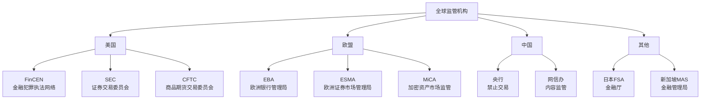
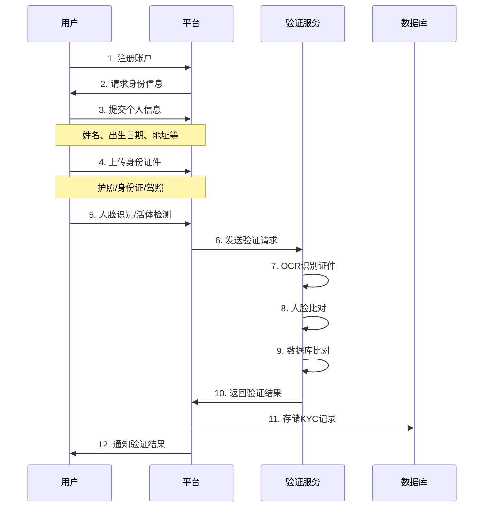

# 比特币监管合规实践

## 1. 全球监管框架概览

### 1.1 主要监管机构



### 1.2 监管分类

```java
/**
 * 比特币监管分类
 */
public class BitcoinRegulatoryFramework {

    /**
     * 监管态度枚举
     */
    public enum RegulatoryStance {
        FRIENDLY("友好", "明确法律框架,鼓励创新"),
        NEUTRAL("中立", "允许但严格监管"),
        RESTRICTIVE("限制", "严格限制但未全面禁止"),
        BANNED("禁止", "全面禁止交易和持有");

        private String name;
        private String description;

        RegulatoryStance(String name, String description) {
            this.name = name;
            this.description = description;
        }

        public String getName() {
            return name;
        }

        public String getDescription() {
            return description;
        }
    }

    /**
     * 国家/地区监管态度
     */
    public static class CountryRegulation {
        private String country;
        private RegulatoryStance stance;
        private String legalStatus;
        private boolean kycRequired;
        private boolean amlCompliance;
        private String taxTreatment;

        public CountryRegulation(String country, RegulatoryStance stance,
                String legalStatus, boolean kycRequired,
                boolean amlCompliance, String taxTreatment) {
            this.country = country;
            this.stance = stance;
            this.legalStatus = legalStatus;
            this.kycRequired = kycRequired;
            this.amlCompliance = amlCompliance;
            this.taxTreatment = taxTreatment;
        }

        @Override
        public String toString() {
            return String.format("%-15s | %-10s | %-30s | KYC:%-5s | AML:%-5s | %s",
                country, stance.getName(), legalStatus,
                kycRequired ? "是" : "否",
                amlCompliance ? "是" : "否",
                taxTreatment);
        }
    }

    /**
     * 获取主要国家监管情况
     */
    public static List<CountryRegulation> getGlobalRegulations() {
        List<CountryRegulation> regulations = new ArrayList<>();

        regulations.add(new CountryRegulation(
            "美国",
            RegulatoryStance.NEUTRAL,
            "商品/证券(取决于情况)",
            true, true,
            "资本利得税"
        ));

        regulations.add(new CountryRegulation(
            "欧盟",
            RegulatoryStance.NEUTRAL,
            "MiCA监管框架",
            true, true,
            "各国不同"
        ));

        regulations.add(new CountryRegulation(
            "日本",
            RegulatoryStance.FRIENDLY,
            "合法支付手段",
            true, true,
            "杂项收入税"
        ));

        regulations.add(new CountryRegulation(
            "新加坡",
            RegulatoryStance.FRIENDLY,
            "支付型代币受监管",
            true, true,
            "资本利得免税"
        ));

        regulations.add(new CountryRegulation(
            "中国",
            RegulatoryStance.BANNED,
            "禁止交易,持有不违法",
            false, false,
            "未明确"
        ));

        regulations.add(new CountryRegulation(
            "萨尔瓦多",
            RegulatoryStance.FRIENDLY,
            "法定货币",
            false, false,
            "免税"
        ));

        regulations.add(new CountryRegulation(
            "瑞士",
            RegulatoryStance.FRIENDLY,
            "资产,明确监管框架",
            true, true,
            "财富税+资本利得"
        ));

        regulations.add(new CountryRegulation(
            "印度",
            RegulatoryStance.RESTRICTIVE,
            "正在制定监管框架",
            true, true,
            "30%税率"
        ));

        return regulations;
    }

    /**
     * 显示监管概览
     */
    public static void displayRegulations() {
        System.out.println("=== 全球比特币监管概览 ===\n");

        List<CountryRegulation> regulations = getGlobalRegulations();

        System.out.println("国家/地区      | 态度       | 法律地位                       | KYC   | AML   | 税收政策");
        System.out.println("---------------|------------|--------------------------------|-------|-------|------------------");

        for (CountryRegulation reg : regulations) {
            System.out.println(reg);
        }

        System.out.println();
        System.out.println("💡 趋势:");
        System.out.println("• 大多数国家倾向于监管而非禁止");
        System.out.println("• KYC/AML成为主流要求");
        System.out.println("• 税收框架逐渐明确");
        System.out.println("• 机构采用推动监管完善");
    }

    public static void main(String[] args) {
        displayRegulations();
    }
}
```

## 2. KYC (Know Your Customer)

### 2.1 KYC流程



### 2.2 KYC实现

```java
import java.time.LocalDate;
import java.util.*;

/**
 * KYC (Know Your Customer) 实现
 */
public class KYCSystem {

    /**
     * KYC等级
     */
    public enum KYCLevel {
        UNVERIFIED(0, "未验证", 0),
        LEVEL1(1, "基础验证", 1000),      // 邮箱+手机
        LEVEL2(2, "身份验证", 10000),     // 身份证件
        LEVEL3(3, "高级验证", 100000);    // 地址证明+视频验证

        private int level;
        private String name;
        private double dailyLimit; // 每日限额(USD)

        KYCLevel(int level, String name, double dailyLimit) {
            this.level = level;
            this.name = name;
            this.dailyLimit = dailyLimit;
        }

        public int getLevel() {
            return level;
        }

        public String getName() {
            return name;
        }

        public double getDailyLimit() {
            return dailyLimit;
        }
    }

    /**
     * KYC信息
     */
    public static class KYCInfo {
        // 基础信息
        private String userId;
        private String email;
        private String phone;
        private KYCLevel level;

        // Level 2信息
        private String fullName;
        private LocalDate dateOfBirth;
        private String nationality;
        private String idType;          // 证件类型
        private String idNumber;        // 证件号码
        private byte[] idFrontImage;    // 证件正面
        private byte[] idBackImage;     // 证件背面
        private byte[] selfieImage;     // 自拍照

        // Level 3信息
        private String address;
        private byte[] addressProof;    // 地址证明
        private byte[] videoVerification; // 视频验证

        // 验证状态
        private VerificationStatus status;
        private LocalDate verifiedDate;
        private String verifiedBy;
        private String rejectReason;

        public KYCInfo(String userId, String email, String phone) {
            this.userId = userId;
            this.email = email;
            this.phone = phone;
            this.level = KYCLevel.UNVERIFIED;
            this.status = VerificationStatus.PENDING;
        }
    }

    /**
     * 验证状态
     */
    public enum VerificationStatus {
        PENDING("待审核"),
        APPROVED("已通过"),
        REJECTED("已拒绝"),
        EXPIRED("已过期");

        private String name;

        VerificationStatus(String name) {
            this.name = name;
        }

        public String getName() {
            return name;
        }
    }

    /**
     * KYC验证器
     */
    public static class KYCVerifier {

        /**
         * Level 1验证: 邮箱和手机
         */
        public VerificationResult verifyLevel1(KYCInfo info) {
            VerificationResult result = new VerificationResult();

            // 1. 验证邮箱格式
            if (!isValidEmail(info.email)) {
                result.success = false;
                result.message = "邮箱格式无效";
                return result;
            }

            // 2. 验证手机格式
            if (!isValidPhone(info.phone)) {
                result.success = false;
                result.message = "手机号格式无效";
                return result;
            }

            // 3. 发送验证码(实际实现)
            // sendEmailVerification(info.email);
            // sendSMSVerification(info.phone);

            result.success = true;
            result.message = "Level 1验证通过";
            result.level = KYCLevel.LEVEL1;

            return result;
        }

        /**
         * Level 2验证: 身份证件
         */
        public VerificationResult verifyLevel2(KYCInfo info) {
            VerificationResult result = new VerificationResult();

            // 1. 验证年龄(必须18岁以上)
            if (!isAdult(info.dateOfBirth)) {
                result.success = false;
                result.message = "年龄不满18岁";
                return result;
            }

            // 2. OCR识别证件
            OCRResult ocrResult = performOCR(info.idFrontImage);
            if (!ocrResult.success) {
                result.success = false;
                result.message = "证件识别失败";
                return result;
            }

            // 3. 验证证件信息一致性
            if (!ocrResult.name.equals(info.fullName)) {
                result.success = false;
                result.message = "姓名与证件不符";
                return result;
            }

            // 4. 人脸比对
            FaceMatchResult faceMatch = compareFaces(
                info.idFrontImage, info.selfieImage);

            if (faceMatch.similarity < 0.85) {
                result.success = false;
                result.message = "人脸比对失败: " +
                    String.format("%.2f%%", faceMatch.similarity * 100);
                return result;
            }

            // 5. 活体检测
            if (!faceMatch.isLive) {
                result.success = false;
                result.message = "活体检测失败";
                return result;
            }

            // 6. 黑名单检查
            if (isInBlacklist(info.idNumber)) {
                result.success = false;
                result.message = "该证件在黑名单中";
                return result;
            }

            // 7. 制裁名单检查(OFAC, UN等)
            SanctionCheckResult sanctionCheck =
                checkSanctions(info.fullName, info.nationality);

            if (sanctionCheck.isMatch) {
                result.success = false;
                result.message = "该用户在制裁名单中";
                return result;
            }

            result.success = true;
            result.message = "Level 2验证通过";
            result.level = KYCLevel.LEVEL2;

            return result;
        }

        /**
         * Level 3验证: 地址证明
         */
        public VerificationResult verifyLevel3(KYCInfo info) {
            VerificationResult result = new VerificationResult();

            // 1. 验证地址证明(水电费账单、银行对账单等)
            AddressProofResult proofResult = verifyAddressProof(
                info.addressProof, info.address);

            if (!proofResult.valid) {
                result.success = false;
                result.message = "地址证明无效";
                return result;
            }

            // 2. 地址证明不能超过3个月
            if (!proofResult.isRecent) {
                result.success = false;
                result.message = "地址证明已过期(超过3个月)";
                return result;
            }

            // 3. 视频验证(可选,针对高风险用户)
            if (info.videoVerification != null) {
                VideoVerificationResult videoResult =
                    verifyVideo(info.videoVerification);

                if (!videoResult.valid) {
                    result.success = false;
                    result.message = "视频验证失败";
                    return result;
                }
            }

            result.success = true;
            result.message = "Level 3验证通过";
            result.level = KYCLevel.LEVEL3;

            return result;
        }

        // 辅助方法
        private boolean isValidEmail(String email) {
            return email != null && email.matches("^[A-Za-z0-9+_.-]+@(.+)$");
        }

        private boolean isValidPhone(String phone) {
            return phone != null && phone.matches("^[0-9]{10,15}$");
        }

        private boolean isAdult(LocalDate dateOfBirth) {
            return LocalDate.now().minusYears(18).isAfter(dateOfBirth);
        }

        private OCRResult performOCR(byte[] image) {
            // 实际应调用OCR服务(如AWS Textract, Google Vision)
            OCRResult result = new OCRResult();
            result.success = true;
            result.name = "张三";
            result.idNumber = "123456789012345678";
            return result;
        }

        private FaceMatchResult compareFaces(byte[] idImage, byte[] selfie) {
            // 实际应调用人脸识别服务(如Face++, AWS Rekognition)
            FaceMatchResult result = new FaceMatchResult();
            result.similarity = 0.92;
            result.isLive = true;
            return result;
        }

        private boolean isInBlacklist(String idNumber) {
            // 检查内部黑名单
            return false;
        }

        private SanctionCheckResult checkSanctions(String name, String nationality) {
            // 实际应查询OFAC、UN制裁名单等
            SanctionCheckResult result = new SanctionCheckResult();
            result.isMatch = false;
            return result;
        }

        private AddressProofResult verifyAddressProof(byte[] proof, String address) {
            AddressProofResult result = new AddressProofResult();
            result.valid = true;
            result.isRecent = true;
            return result;
        }

        private VideoVerificationResult verifyVideo(byte[] video) {
            VideoVerificationResult result = new VideoVerificationResult();
            result.valid = true;
            return result;
        }
    }

    // 结果类
    public static class VerificationResult {
        boolean success;
        String message;
        KYCLevel level;
    }

    public static class OCRResult {
        boolean success;
        String name;
        String idNumber;
    }

    public static class FaceMatchResult {
        double similarity;
        boolean isLive;
    }

    public static class SanctionCheckResult {
        boolean isMatch;
        String matchedList;
    }

    public static class AddressProofResult {
        boolean valid;
        boolean isRecent;
    }

    public static class VideoVerificationResult {
        boolean valid;
    }

    /**
     * 使用示例
     */
    public static void main(String[] args) {
        System.out.println("=== KYC系统示例 ===\n");

        // 创建用户KYC信息
        KYCInfo kyc = new KYCInfo(
            "user123",
            "user@example.com",
            "13800138000"
        );

        KYCVerifier verifier = new KYCVerifier();

        // Level 1验证
        System.out.println("1️⃣  Level 1验证 (邮箱+手机)");
        VerificationResult result1 = verifier.verifyLevel1(kyc);
        System.out.println("结果: " + (result1.success ? "✓ " : "✗ ") + result1.message);
        if (result1.success) {
            kyc.level = result1.level;
            System.out.println("每日限额: $" + result1.level.getDailyLimit());
        }
        System.out.println();

        // Level 2验证
        System.out.println("2️⃣  Level 2验证 (身份证件)");
        kyc.fullName = "张三";
        kyc.dateOfBirth = LocalDate.of(1990, 1, 1);
        kyc.nationality = "CN";
        kyc.idType = "身份证";
        kyc.idNumber = "123456789012345678";
        kyc.idFrontImage = new byte[1024];
        kyc.selfieImage = new byte[1024];

        VerificationResult result2 = verifier.verifyLevel2(kyc);
        System.out.println("结果: " + (result2.success ? "✓ " : "✗ ") + result2.message);
        if (result2.success) {
            kyc.level = result2.level;
            System.out.println("每日限额: $" + String.format("%,d", (int)result2.level.getDailyLimit()));
        }
        System.out.println();

        // Level 3验证
        System.out.println("3️⃣  Level 3验证 (地址证明)");
        kyc.address = "北京市朝阳区xxx路xxx号";
        kyc.addressProof = new byte[2048];

        VerificationResult result3 = verifier.verifyLevel3(kyc);
        System.out.println("结果: " + (result3.success ? "✓ " : "✗ ") + result3.message);
        if (result3.success) {
            kyc.level = result3.level;
            System.out.println("每日限额: $" + String.format("%,d", (int)result3.level.getDailyLimit()));
        }
        System.out.println();

        // KYC等级对比
        System.out.println("4️⃣  KYC等级对比");
        System.out.println("------------------------------------------------");
        System.out.println("等级     | 要求              | 每日限额");
        System.out.println("------------------------------------------------");
        for (KYCLevel level : KYCLevel.values()) {
            System.out.printf("%-8s | %-17s | $%,d%n",
                level.getName(),
                getRequirement(level),
                (int)level.getDailyLimit());
        }

        System.out.println();
        System.out.println("💡 最佳实践:");
        System.out.println("• 采用分级KYC,降低用户门槛");
        System.out.println("• 自动化验证流程,提升效率");
        System.out.println("• 定期重新验证(如每年)");
        System.out.println("• 妥善保管KYC数据,符合GDPR等隐私法规");
    }

    private static String getRequirement(KYCLevel level) {
        switch (level) {
            case UNVERIFIED: return "无";
            case LEVEL1: return "邮箱+手机";
            case LEVEL2: return "身份证件";
            case LEVEL3: return "地址证明";
            default: return "";
        }
    }
}
```

## 3. AML (Anti-Money Laundering)

### 3.1 AML基本概念

```java
/**
 * AML (反洗钱) 系统
 */
public class AMLSystem {

    /**
     * 可疑活动类型
     */
    public enum SuspiciousActivityType {
        STRUCTURING("结构化交易", "故意拆分交易以规避报告要求"),
        RAPID_MOVEMENT("快进快出", "资金快速转入转出"),
        HIGH_RISK_COUNTRY("高风险国家", "与高风险国家有资金往来"),
        MIXER_TUMBLER("混币服务", "使用混币服务隐藏资金来源"),
        DARKNET("暗网", "与暗网市场相关"),
        RANSOMWARE("勒索软件", "与勒索软件地址相关"),
        SANCTION("制裁", "与被制裁实体相关"),
        UNUSUAL_PATTERN("异常模式", "交易模式与历史行为不符");

        private String name;
        private String description;

        SuspiciousActivityType(String name, String description) {
            this.name = name;
            this.description = description;
        }

        public String getName() {
            return name;
        }

        public String getDescription() {
            return description;
        }
    }

    /**
     * 交易监控
     */
    public static class TransactionMonitor {

        private static final double DAILY_THRESHOLD = 10000; // USD
        private static final double SINGLE_TX_THRESHOLD = 3000; // USD

        /**
         * 监控交易
         */
        public List<Alert> monitorTransaction(Transaction tx, User user) {
            List<Alert> alerts = new ArrayList<>();

            // 1. 金额阈值检查
            if (tx.amountUSD >= SINGLE_TX_THRESHOLD) {
                alerts.add(createAlert(
                    AlertLevel.MEDIUM,
                    SuspiciousActivityType.UNUSUAL_PATTERN,
                    "单笔交易超过$" + SINGLE_TX_THRESHOLD,
                    tx, user
                ));
            }

            // 2. 累计金额检查
            double dailyTotal = getDailyTotal(user.userId, tx.timestamp);
            if (dailyTotal >= DAILY_THRESHOLD) {
                alerts.add(createAlert(
                    AlertLevel.HIGH,
                    SuspiciousActivityType.STRUCTURING,
                    "日累计交易超过$" + DAILY_THRESHOLD,
                    tx, user
                ));
            }

            // 3. 结构化交易检测
            if (isStructuring(user.userId, tx)) {
                alerts.add(createAlert(
                    AlertLevel.HIGH,
                    SuspiciousActivityType.STRUCTURING,
                    "检测到可能的结构化交易",
                    tx, user
                ));
            }

            // 4. 快进快出检测
            if (isRapidMovement(tx, user)) {
                alerts.add(createAlert(
                    AlertLevel.MEDIUM,
                    SuspiciousActivityType.RAPID_MOVEMENT,
                    "资金快速转入转出",
                    tx, user
                ));
            }

            // 5. 地址风险检查
            RiskScore riskScore = checkAddressRisk(tx.toAddress);
            if (riskScore.score >= 70) {
                alerts.add(createAlert(
                    AlertLevel.CRITICAL,
                    riskScore.type,
                    "目标地址风险评分: " + riskScore.score,
                    tx, user
                ));
            }

            // 6. 地理位置检查
            if (isHighRiskCountry(user.country)) {
                alerts.add(createAlert(
                    AlertLevel.MEDIUM,
                    SuspiciousActivityType.HIGH_RISK_COUNTRY,
                    "用户来自高风险国家: " + user.country,
                    tx, user
                ));
            }

            return alerts;
        }

        /**
         * 结构化交易检测
         *
         * 特征:
         * - 多笔金额相近的交易
         * - 金额略低于报告阈值
         * - 短时间内密集发生
         */
        private boolean isStructuring(String userId, Transaction tx) {
            // 获取最近24小时的交易
            List<Transaction> recentTxs = getRecentTransactions(userId, 86400);

            // 检查是否有多笔金额相近的交易
            int similarCount = 0;
            for (Transaction recent : recentTxs) {
                double diff = Math.abs(recent.amountUSD - tx.amountUSD);
                if (diff / tx.amountUSD < 0.1) { // 金额差异<10%
                    similarCount++;
                }
            }

            // 如果有3笔以上相近金额的交易,且都略低于阈值
            return similarCount >= 3 &&
                   tx.amountUSD < SINGLE_TX_THRESHOLD * 0.95;
        }

        /**
         * 快进快出检测
         */
        private boolean isRapidMovement(Transaction tx, User user) {
            // 检查资金在平台停留时间
            long depositTime = getLastDepositTime(user.userId);
            long stayDuration = tx.timestamp - depositTime;

            // 如果资金停留少于1小时就转出,标记为可疑
            return stayDuration < 3600 && tx.type == TransactionType.WITHDRAWAL;
        }

        /**
         * 地址风险检查
         */
        private RiskScore checkAddressRisk(String address) {
            RiskScore score = new RiskScore();
            score.address = address;
            score.score = 0;

            // 检查已知风险地址数据库
            if (isInDarknetMarket(address)) {
                score.score = 100;
                score.type = SuspiciousActivityType.DARKNET;
                score.details = "暗网市场地址";
                return score;
            }

            if (isRansomwareAddress(address)) {
                score.score = 100;
                score.type = SuspiciousActivityType.RANSOMWARE;
                score.details = "勒索软件地址";
                return score;
            }

            if (isMixerAddress(address)) {
                score.score = 80;
                score.type = SuspiciousActivityType.MIXER_TUMBLER;
                score.details = "混币服务地址";
                return score;
            }

            if (isSanctionedAddress(address)) {
                score.score = 100;
                score.type = SuspiciousActivityType.SANCTION;
                score.details = "被制裁地址";
                return score;
            }

            return score;
        }

        private Alert createAlert(AlertLevel level,
                SuspiciousActivityType type,
                String message, Transaction tx, User user) {
            Alert alert = new Alert();
            alert.level = level;
            alert.type = type;
            alert.message = message;
            alert.userId = user.userId;
            alert.txId = tx.txId;
            alert.timestamp = System.currentTimeMillis();
            return alert;
        }

        // 辅助方法(简化实现)
        private double getDailyTotal(String userId, long timestamp) {
            return 8000; // 示例
        }

        private List<Transaction> getRecentTransactions(String userId, int seconds) {
            return new ArrayList<>();
        }

        private long getLastDepositTime(String userId) {
            return System.currentTimeMillis() - 1800000; // 30分钟前
        }

        private boolean isHighRiskCountry(String country) {
            List<String> highRiskCountries = Arrays.asList(
                "KP", "IR", "SY" // 朝鲜、伊朗、叙利亚等
            );
            return highRiskCountries.contains(country);
        }

        private boolean isInDarknetMarket(String address) {
            // 实际应查询Chainalysis、CipherTrace等服务
            return false;
        }

        private boolean isRansomwareAddress(String address) {
            return false;
        }

        private boolean isMixerAddress(String address) {
            return false;
        }

        private boolean isSanctionedAddress(String address) {
            // 查询OFAC SDN列表
            return false;
        }
    }

    /**
     * 警报级别
     */
    public enum AlertLevel {
        LOW("低", "记录但无需立即处理"),
        MEDIUM("中", "需要审查"),
        HIGH("高", "需要立即审查"),
        CRITICAL("严重", "立即冻结并上报");

        private String name;
        private String action;

        AlertLevel(String name, String action) {
            this.name = name;
            this.action = action;
        }

        public String getName() {
            return name;
        }

        public String getAction() {
            return action;
        }
    }

    /**
     * 警报
     */
    public static class Alert {
        AlertLevel level;
        SuspiciousActivityType type;
        String message;
        String userId;
        String txId;
        long timestamp;
        boolean reviewed;
        String reviewerNotes;

        @Override
        public String toString() {
            return String.format("[%s] %s - %s (User: %s, Tx: %s)",
                level.getName(),
                type.getName(),
                message,
                userId,
                txId != null ? txId.substring(0, 8) + "..." : "N/A");
        }
    }

    public static class RiskScore {
        String address;
        int score;
        SuspiciousActivityType type;
        String details;
    }

    // 简化的数据结构
    public enum TransactionType {
        DEPOSIT, WITHDRAWAL, TRADE
    }

    public static class Transaction {
        String txId;
        String userId;
        TransactionType type;
        String fromAddress;
        String toAddress;
        double amountBTC;
        double amountUSD;
        long timestamp;
    }

    public static class User {
        String userId;
        String country;
        KYCSystem.KYCLevel kycLevel;
    }

    /**
     * 使用示例
     */
    public static void main(String[] args) {
        System.out.println("=== AML系统示例 ===\n");

        TransactionMonitor monitor = new TransactionMonitor();

        // 场景1: 正常交易
        System.out.println("场景1: 正常交易");
        User user1 = new User();
        user1.userId = "user001";
        user1.country = "US";
        user1.kycLevel = KYCSystem.KYCLevel.LEVEL2;

        Transaction tx1 = new Transaction();
        tx1.txId = "tx001";
        tx1.userId = user1.userId;
        tx1.type = TransactionType.WITHDRAWAL;
        tx1.amountUSD = 500;
        tx1.timestamp = System.currentTimeMillis();

        List<Alert> alerts1 = monitor.monitorTransaction(tx1, user1);
        System.out.println("警报数: " + alerts1.size());
        System.out.println();

        // 场景2: 大额交易
        System.out.println("场景2: 大额交易 (>$3000)");
        Transaction tx2 = new Transaction();
        tx2.txId = "tx002";
        tx2.userId = user1.userId;
        tx2.type = TransactionType.WITHDRAWAL;
        tx2.amountUSD = 5000;
        tx2.timestamp = System.currentTimeMillis();

        List<Alert> alerts2 = monitor.monitorTransaction(tx2, user1);
        System.out.println("警报数: " + alerts2.size());
        for (Alert alert : alerts2) {
            System.out.println("  " + alert);
        }
        System.out.println();

        // 场景3: 结构化交易
        System.out.println("场景3: 结构化交易 (多笔2900元交易)");
        for (int i = 0; i < 4; i++) {
            Transaction tx = new Transaction();
            tx.txId = "tx00" + (3 + i);
            tx.userId = user1.userId;
            tx.type = TransactionType.WITHDRAWAL;
            tx.amountUSD = 2900;
            tx.timestamp = System.currentTimeMillis() + i * 1000;

            List<Alert> alerts = monitor.monitorTransaction(tx, user1);
            if (!alerts.isEmpty()) {
                System.out.println("  第" + (i + 1) + "笔交易触发警报:");
                for (Alert alert : alerts) {
                    System.out.println("    " + alert);
                }
            }
        }
        System.out.println();

        // SAR报告要求
        System.out.println("💡 SAR (Suspicious Activity Report) 报告要求:");
        System.out.println();
        System.out.println("美国FinCEN要求:");
        System.out.println("• 单笔可疑交易≥$5,000: 必须报告");
        System.out.println("• 报告时限: 发现后30天内");
        System.out.println("• 不得告知客户已被报告");
        System.out.println();
        System.out.println("欧盟5AMLD要求:");
        System.out.println("• 任何金额的可疑交易都应报告");
        System.out.println("• 加强对高风险第三国的监控");
    }
}
```

### 3.2 链上分析

```java
import java.util.*;

/**
 * 链上交易分析
 */
public class OnChainAnalysis {

    /**
     * 交易图分析
     */
    public static class TransactionGraphAnalyzer {

        /**
         * 追踪资金流向
         */
        public FundFlow traceFunds(String startAddress, int depth) {
            FundFlow flow = new FundFlow();
            flow.startAddress = startAddress;

            Queue<AddressNode> queue = new LinkedList<>();
            Set<String> visited = new HashSet<>();

            AddressNode start = new AddressNode();
            start.address = startAddress;
            start.depth = 0;

            queue.offer(start);
            visited.add(startAddress);

            System.out.println("追踪资金流向 (起始地址: " +
                startAddress.substring(0, 10) + "...):\n");

            while (!queue.isEmpty() && flow.nodes.size() < 100) {
                AddressNode current = queue.poll();

                if (current.depth >= depth) continue;

                // 获取该地址的所有输出交易
                List<String> outputs = getOutputAddresses(current.address);

                for (String output : outputs) {
                    if (!visited.contains(output)) {
                        visited.add(output);

                        AddressNode node = new AddressNode();
                        node.address = output;
                        node.depth = current.depth + 1;
                        node.parent = current.address;

                        flow.nodes.add(node);
                        queue.offer(node);

                        // 检查风险
                        RiskScore risk = checkAddressRisk(output);
                        if (risk.score >= 50) {
                            flow.riskAddresses.add(output);
                            System.out.printf("  深度%d: %s... [风险: %d - %s]%n",
                                node.depth,
                                output.substring(0, 10),
                                risk.score,
                                risk.details);
                        }
                    }
                }
            }

            System.out.println("\n追踪结果:");
            System.out.println("  总地址数: " + flow.nodes.size());
            System.out.println("  风险地址数: " + flow.riskAddresses.size());

            return flow;
        }

        /**
         * 聚类分析 - 识别同一实体控制的地址
         */
        public List<AddressCluster> clusterAddresses(List<String> addresses) {
            List<AddressCluster> clusters = new ArrayList<>();

            System.out.println("\n聚类分析 (识别关联地址):\n");

            // 1. 共同输入启发式 (Common Input Heuristic)
            //    同一交易中的多个输入通常属于同一实体
            Map<String, Set<String>> commonInputs = findCommonInputs(addresses);

            // 2. 零钱地址启发式 (Change Address Heuristic)
            //    找零地址与输入地址属于同一实体
            Map<String, String> changeAddresses = findChangeAddresses(addresses);

            // 3. 构建聚类
            UnionFind uf = new UnionFind(addresses);

            for (Map.Entry<String, Set<String>> entry : commonInputs.entrySet()) {
                List<String> inputs = new ArrayList<>(entry.getValue());
                for (int i = 1; i < inputs.size(); i++) {
                    uf.union(inputs.get(0), inputs.get(i));
                }
            }

            for (Map.Entry<String, String> entry : changeAddresses.entrySet()) {
                uf.union(entry.getKey(), entry.getValue());
            }

            // 4. 提取聚类
            Map<String, List<String>> clusterMap = new HashMap<>();
            for (String addr : addresses) {
                String root = uf.find(addr);
                clusterMap.computeIfAbsent(root, k -> new ArrayList<>()).add(addr);
            }

            int clusterId = 1;
            for (List<String> members : clusterMap.values()) {
                if (members.size() > 1) {
                    AddressCluster cluster = new AddressCluster();
                    cluster.clusterId = clusterId++;
                    cluster.addresses = members;
                    cluster.size = members.size();
                    clusters.add(cluster);

                    System.out.println("聚类 #" + cluster.clusterId +
                        " (共" + cluster.size + "个地址):");
                    for (int i = 0; i < Math.min(3, members.size()); i++) {
                        System.out.println("  - " + members.get(i).substring(0, 16) + "...");
                    }
                    if (members.size() > 3) {
                        System.out.println("  - ... (还有" + (members.size() - 3) + "个)");
                    }
                    System.out.println();
                }
            }

            return clusters;
        }

        /**
         * 混币服务检测
         */
        public MixerDetectionResult detectMixer(String txId) {
            MixerDetectionResult result = new MixerDetectionResult();
            result.txId = txId;

            // 混币服务特征:
            // 1. 大量输入和输出
            // 2. 金额分散
            // 3. 使用CoinJoin模式

            TransactionDetails tx = getTransactionDetails(txId);

            // 检查输入/输出数量
            if (tx.inputs.size() > 10 && tx.outputs.size() > 10) {
                result.score += 30;
                result.indicators.add("大量输入/输出");
            }

            // 检查金额分布
            Set<Long> uniqueAmounts = new HashSet<>();
            for (long amount : tx.outputAmounts) {
                uniqueAmounts.add(amount);
            }

            if (uniqueAmounts.size() < tx.outputs.size() * 0.3) {
                // 很多输出金额相同 - CoinJoin特征
                result.score += 40;
                result.indicators.add("相同金额输出(CoinJoin)");
            }

            // 检查已知混币服务地址
            for (String addr : tx.outputs) {
                if (isKnownMixerAddress(addr)) {
                    result.score += 50;
                    result.indicators.add("已知混币服务地址");
                    break;
                }
            }

            result.isMixer = result.score >= 50;

            return result;
        }

        // 辅助方法
        private List<String> getOutputAddresses(String address) {
            // 简化: 返回模拟数据
            return Arrays.asList("addr" + (int)(Math.random() * 1000));
        }

        private AMLSystem.RiskScore checkAddressRisk(String address) {
            AMLSystem.RiskScore score = new AMLSystem.RiskScore();
            score.address = address;
            score.score = (int)(Math.random() * 100);
            score.details = "示例风险";
            return score;
        }

        private Map<String, Set<String>> findCommonInputs(List<String> addresses) {
            // 简化实现
            return new HashMap<>();
        }

        private Map<String, String> findChangeAddresses(List<String> addresses) {
            // 简化实现
            return new HashMap<>();
        }

        private TransactionDetails getTransactionDetails(String txId) {
            TransactionDetails tx = new TransactionDetails();
            tx.txId = txId;
            tx.inputs = Arrays.asList("input1", "input2");
            tx.outputs = Arrays.asList("output1", "output2");
            tx.outputAmounts = Arrays.asList(100000L, 100000L);
            return tx;
        }

        private boolean isKnownMixerAddress(String address) {
            return false;
        }
    }

    // 并查集 (用于聚类)
    public static class UnionFind {
        private Map<String, String> parent;

        public UnionFind(List<String> addresses) {
            parent = new HashMap<>();
            for (String addr : addresses) {
                parent.put(addr, addr);
            }
        }

        public String find(String x) {
            if (!parent.get(x).equals(x)) {
                parent.put(x, find(parent.get(x)));
            }
            return parent.get(x);
        }

        public void union(String x, String y) {
            String rootX = find(x);
            String rootY = find(y);
            if (!rootX.equals(rootY)) {
                parent.put(rootX, rootY);
            }
        }
    }

    public static class FundFlow {
        String startAddress;
        List<AddressNode> nodes = new ArrayList<>();
        List<String> riskAddresses = new ArrayList<>();
    }

    public static class AddressNode {
        String address;
        int depth;
        String parent;
    }

    public static class AddressCluster {
        int clusterId;
        List<String> addresses;
        int size;
    }

    public static class MixerDetectionResult {
        String txId;
        int score;
        boolean isMixer;
        List<String> indicators = new ArrayList<>();

        @Override
        public String toString() {
            return String.format("Mixer检测结果: %s (评分: %d, 是混币: %s)\n特征: %s",
                txId, score, isMixer ? "是" : "否",
                String.join(", ", indicators));
        }
    }

    public static class TransactionDetails {
        String txId;
        List<String> inputs;
        List<String> outputs;
        List<Long> outputAmounts;
    }

    /**
     * 使用示例
     */
    public static void main(String[] args) {
        System.out.println("=== 链上分析示例 ===\n");

        TransactionGraphAnalyzer analyzer = new TransactionGraphAnalyzer();

        // 1. 资金流向追踪
        System.out.println("1️⃣  资金流向追踪");
        System.out.println("-------------------");
        analyzer.traceFunds("bc1qxy2kgdygjrsqtzq2n0yrf2493p83kkfjhx0wlh", 3);

        // 2. 地址聚类分析
        System.out.println("\n2️⃣  地址聚类分析");
        System.out.println("-------------------");
        List<String> addresses = Arrays.asList(
            "addr1", "addr2", "addr3", "addr4", "addr5"
        );
        analyzer.clusterAddresses(addresses);

        // 3. 混币服务检测
        System.out.println("\n3️⃣  混币服务检测");
        System.out.println("-------------------");
        MixerDetectionResult mixerResult = analyzer.detectMixer("tx12345");
        System.out.println(mixerResult);

        System.out.println();
        System.out.println("💡 链上分析工具:");
        System.out.println("• Chainalysis - 行业领先的链上分析平台");
        System.out.println("• CipherTrace - 加密货币情报");
        System.out.println("• Elliptic - 区块链分析和合规");
        System.out.println("• TRM Labs - 区块链情报");
    }
}
```

## 4. FATF Travel Rule

### 4.1 Travel Rule概述

**FATF (Financial Action Task Force) Travel Rule**要求虚拟资产服务提供商(VASP)在转账时传递发送方和接收方信息:

```java
/**
 * FATF Travel Rule实现
 */
public class TravelRuleCompliance {

    /**
     * Travel Rule信息
     */
    public static class TravelRuleInfo {
        // 发送方信息(Originator)
        private String originatorName;
        private String originatorAddress;      // 物理地址
        private String originatorAccountNumber;
        private String originatorWalletAddress; // 区块链地址
        private String originatorDOB;
        private String originatorCountry;

        // 接收方信息(Beneficiary)
        private String beneficiaryName;
        private String beneficiaryAccountNumber;
        private String beneficiaryWalletAddress;

        // 交易信息
        private double amount;
        private String currency;
        private long timestamp;

        // VASP信息
        private String originatorVASP;  // 发送方VASP
        private String beneficiaryVASP; // 接收方VASP

        @Override
        public String toString() {
            return String.format(
                "Travel Rule信息:\n" +
                "发送方: %s (%s)\n" +
                "  地址: %s\n" +
                "  钱包: %s\n" +
                "接收方: %s\n" +
                "  钱包: %s\n" +
                "金额: %.2f %s\n" +
                "发送VASP: %s\n" +
                "接收VASP: %s",
                originatorName, originatorCountry,
                originatorAddress,
                originatorWalletAddress != null ?
                    originatorWalletAddress.substring(0, 10) + "..." : "N/A",
                beneficiaryName,
                beneficiaryWalletAddress != null ?
                    beneficiaryWalletAddress.substring(0, 10) + "..." : "N/A",
                amount, currency,
                originatorVASP,
                beneficiaryVASP
            );
        }
    }

    /**
     * Travel Rule实施
     */
    public static class TravelRuleHandler {

        private static final double THRESHOLD = 1000; // USD阈值

        /**
         * 处理出金交易
         */
        public TravelRuleResult handleWithdrawal(
                User sender,
                String recipientAddress,
                double amountUSD) {

            TravelRuleResult result = new TravelRuleResult();

            // 1. 检查是否需要Travel Rule
            if (amountUSD < THRESHOLD) {
                result.required = false;
                result.message = "金额低于阈值,无需Travel Rule";
                return result;
            }

            result.required = true;

            // 2. 检查接收地址是否属于已知VASP
            VASPInfo beneficiaryVASP = identifyVASP(recipientAddress);

            if (beneficiaryVASP == null) {
                // 接收方不是VASP(如个人钱包)
                result.canProceed = true;
                result.message = "接收方非VASP,记录发送方信息";

                // 记录发送方信息(但无法传递给接收方)
                TravelRuleInfo info = new TravelRuleInfo();
                info.originatorName = sender.fullName;
                info.originatorAddress = sender.address;
                info.originatorWalletAddress = recipientAddress;
                info.originatorCountry = sender.country;
                info.amount = amountUSD;
                info.currency = "USD";
                info.originatorVASP = "OurExchange";

                result.travelRuleInfo = info;
                return result;
            }

            // 3. 接收方是VASP - 需要传递信息
            result.canProceed = false;
            result.requiresInfoExchange = true;
            result.beneficiaryVASP = beneficiaryVASP;

            // 4. 构建Travel Rule信息
            TravelRuleInfo info = new TravelRuleInfo();
            info.originatorName = sender.fullName;
            info.originatorAddress = sender.address;
            info.originatorAccountNumber = sender.userId;
            info.originatorWalletAddress = recipientAddress;
            info.originatorDOB = sender.dateOfBirth.toString();
            info.originatorCountry = sender.country;

            info.beneficiaryWalletAddress = recipientAddress;
            info.beneficiaryVASP = beneficiaryVASP.name;

            info.amount = amountUSD;
            info.currency = "USD";
            info.timestamp = System.currentTimeMillis();
            info.originatorVASP = "OurExchange";

            result.travelRuleInfo = info;
            result.message = "需要与接收VASP交换信息";

            return result;
        }

        /**
         * 接收入金交易
         */
        public TravelRuleResult handleDeposit(
                String senderAddress,
                User recipient,
                double amountUSD,
                TravelRuleInfo receivedInfo) {

            TravelRuleResult result = new TravelRuleResult();

            if (amountUSD < THRESHOLD) {
                result.required = false;
                result.canProceed = true;
                return result;
            }

            result.required = true;

            // 验证接收到的Travel Rule信息
            if (receivedInfo == null) {
                VASPInfo senderVASP = identifyVASP(senderAddress);

                if (senderVASP != null) {
                    // 发送方是VASP但未提供信息 - 拒绝
                    result.canProceed = false;
                    result.message = "缺少Travel Rule信息,拒绝交易";
                    return result;
                }

                // 发送方不是VASP - 接受
                result.canProceed = true;
                result.message = "发送方非VASP,接受交易";
                return result;
            }

            // 验证信息完整性
            if (!validateTravelRuleInfo(receivedInfo)) {
                result.canProceed = false;
                result.message = "Travel Rule信息不完整";
                return result;
            }

            // 存储Travel Rule信息
            storeTravelRuleInfo(receivedInfo);

            result.canProceed = true;
            result.travelRuleInfo = receivedInfo;
            result.message = "Travel Rule信息已验证并存储";

            return result;
        }

        /**
         * 识别VASP
         */
        private VASPInfo identifyVASP(String address) {
            // 实际应查询VASP注册表
            // 可以使用:
            // - OpenVASP目录
            // - Netki TransactID
            // - Sygna Bridge

            // 简化: 检查地址是否属于已知交易所
            Map<String, VASPInfo> knownVASPs = getKnownVASPs();

            for (VASPInfo vasp : knownVASPs.values()) {
                if (vasp.addressRanges.contains(address)) {
                    return vasp;
                }
            }

            return null;
        }

        private Map<String, VASPInfo> getKnownVASPs() {
            Map<String, VASPInfo> vasps = new HashMap<>();

            VASPInfo binance = new VASPInfo();
            binance.name = "Binance";
            binance.country = "MT";
            binance.addressRanges = new ArrayList<>();
            vasps.put("binance", binance);

            VASPInfo coinbase = new VASPInfo();
            coinbase.name = "Coinbase";
            coinbase.country = "US";
            coinbase.addressRanges = new ArrayList<>();
            vasps.put("coinbase", coinbase);

            return vasps;
        }

        private boolean validateTravelRuleInfo(TravelRuleInfo info) {
            return info.originatorName != null &&
                   info.originatorAddress != null &&
                   info.amount > 0;
        }

        private void storeTravelRuleInfo(TravelRuleInfo info) {
            // 存储到数据库,保留至少5年
            System.out.println("存储Travel Rule信息: " + info.originatorName);
        }
    }

    public static class TravelRuleResult {
        boolean required;
        boolean canProceed;
        boolean requiresInfoExchange;
        String message;
        TravelRuleInfo travelRuleInfo;
        VASPInfo beneficiaryVASP;
    }

    public static class VASPInfo {
        String name;
        String country;
        List<String> addressRanges;
    }

    public static class User {
        String userId;
        String fullName;
        String address;
        String country;
        java.time.LocalDate dateOfBirth;
    }

    /**
     * 使用示例
     */
    public static void main(String[] args) {
        System.out.println("=== FATF Travel Rule示例 ===\n");

        TravelRuleHandler handler = new TravelRuleHandler();

        // 场景1: 小额转账(<$1000)
        System.out.println("场景1: 小额转账 ($500)");
        System.out.println("-----------------------------");
        User user1 = new User();
        user1.userId = "user001";
        user1.fullName = "张三";
        user1.address = "北京市朝阳区xxx路xxx号";
        user1.country = "CN";

        TravelRuleResult result1 = handler.handleWithdrawal(
            user1,
            "bc1qxy2kgdygjrsqtzq2n0yrf2493p83kkfjhx0wlh",
            500
        );

        System.out.println("需要Travel Rule: " + result1.required);
        System.out.println("可以继续: " + result1.canProceed);
        System.out.println("消息: " + result1.message);
        System.out.println();

        // 场景2: 大额转账到个人钱包(≥$1000)
        System.out.println("场景2: 大额转账到个人钱包 ($5000)");
        System.out.println("------------------------------------");
        TravelRuleResult result2 = handler.handleWithdrawal(
            user1,
            "bc1qar0srrr7xfkvy5l643lydnw9re59gtzzwf5mdq",
            5000
        );

        System.out.println("需要Travel Rule: " + result2.required);
        System.out.println("可以继续: " + result2.canProceed);
        System.out.println("需要信息交换: " + result2.requiresInfoExchange);
        System.out.println("消息: " + result2.message);
        System.out.println();

        // 场景3: 大额转账到其他VASP
        System.out.println("场景3: 大额转账到Coinbase ($5000)");
        System.out.println("-----------------------------------");
        TravelRuleResult result3 = handler.handleWithdrawal(
            user1,
            "coinbase_address_123",
            5000
        );

        System.out.println("需要Travel Rule: " + result3.required);
        System.out.println("可以继续: " + result3.canProceed);
        System.out.println("需要信息交换: " + result3.requiresInfoExchange);

        if (result3.travelRuleInfo != null) {
            System.out.println();
            System.out.println(result3.travelRuleInfo);
        }

        System.out.println();
        System.out.println("💡 Travel Rule解决方案:");
        System.out.println("• OpenVASP - 开源Travel Rule协议");
        System.out.println("• Sygna Bridge - Travel Rule消息传递");
        System.out.println("• Notabene - VASP合规网络");
        System.out.println("• Netki TransactID - 身份验证");
    }
}
```

## 5. 税务合规

```java
/**
 * 税务合规
 */
public class TaxCompliance {

    /**
     * 税务事件类型
     */
    public enum TaxEvent {
        BUY("购买", "买入加密货币"),
        SELL("出售", "卖出加密货币,产生资本利得/损失"),
        TRADE("交易", "加密货币间交易,视为处置"),
        MINING("挖矿", "挖矿收入,按市价计入普通收入"),
        STAKING("质押", "质押奖励,按市价计入普通收入"),
        AIRDROP("空投", "空投代币,按市价计入普通收入"),
        FORK("分叉", "分叉代币,按市价计入普通收入"),
        GIFT_RECEIVED("收到赠与", "可能需要缴纳赠与税"),
        GIFT_SENT("赠与他人", "视为处置,可能产生资本利得"),
        LOST("丢失", "可能可以申报资本损失");

        private String name;
        private String description;

        TaxEvent(String name, String description) {
            this.name = name;
            this.description = description;
        }

        public String getName() {
            return name;
        }

        public String getDescription() {
            return description;
        }
    }

    /**
     * 税务记录
     */
    public static class TaxRecord {
        String userId;
        TaxEvent event;
        java.time.LocalDate date;
        String asset;
        double quantity;
        double costBasis;     // 成本基础
        double proceeds;      // 收益
        double capitalGain;   // 资本利得/损失
        double fairMarketValue; // 公允市场价值
        String notes;

        @Override
        public String toString() {
            return String.format("%s | %s | %s | %.8f | 成本:$%.2f | 收益:$%.2f | 利得:$%.2f",
                date, event.getName(), asset, quantity,
                costBasis, proceeds, capitalGain);
        }
    }

    /**
     * 税务计算器
     */
    public static class TaxCalculator {

        /**
         * 计算资本利得 - FIFO方法
         */
        public TaxRecord calculateCapitalGain_FIFO(
                List<Purchase> purchases,
                Sale sale) {

            TaxRecord record = new TaxRecord();
            record.event = TaxEvent.SELL;
            record.date = sale.date;
            record.asset = sale.asset;
            record.quantity = sale.quantity;
            record.proceeds = sale.totalPrice;

            // FIFO: 先进先出
            double remainingQty = sale.quantity;
            double totalCost = 0;

            for (Purchase purchase : purchases) {
                if (remainingQty <= 0) break;

                double qtyFromThisPurchase = Math.min(
                    remainingQty,
                    purchase.quantity
                );

                totalCost += qtyFromThisPurchase * purchase.pricePerUnit;
                remainingQty -= qtyFromThisPurchase;
            }

            record.costBasis = totalCost;
            record.capitalGain = record.proceeds - record.costBasis;

            // 判断短期/长期资本利得
            Purchase firstPurchase = purchases.get(0);
            long holdingDays = java.time.temporal.ChronoUnit.DAYS.between(
                firstPurchase.date, sale.date);

            if (holdingDays > 365) {
                record.notes = "长期资本利得 (持有" + holdingDays + "天)";
            } else {
                record.notes = "短期资本利得 (持有" + holdingDays + "天)";
            }

            return record;
        }

        /**
         * 生成税务报告
         */
        public TaxReport generateAnnualReport(
                String userId,
                int year,
                List<TaxRecord> records) {

            TaxReport report = new TaxReport();
            report.userId = userId;
            report.year = year;

            double shortTermGain = 0;
            double longTermGain = 0;
            double ordinaryIncome = 0;

            for (TaxRecord record : records) {
                if (record.date.getYear() != year) continue;

                switch (record.event) {
                    case SELL:
                    case TRADE:
                        if (record.notes != null &&
                            record.notes.contains("长期")) {
                            longTermGain += record.capitalGain;
                        } else {
                            shortTermGain += record.capitalGain;
                        }
                        break;

                    case MINING:
                    case STAKING:
                    case AIRDROP:
                        ordinaryIncome += record.fairMarketValue;
                        break;
                }
            }

            report.shortTermCapitalGain = shortTermGain;
            report.longTermCapitalGain = longTermGain;
            report.ordinaryIncome = ordinaryIncome;

            // 简化的税额计算(实际税率取决于总收入和国家)
            // 美国税率示例:
            // - 短期资本利得: 按普通收入税率(10%-37%)
            // - 长期资本利得: 0%, 15%, 或 20%

            report.estimatedTax = shortTermGain * 0.24 +  // 假设24%税率
                                  longTermGain * 0.15 +    // 15%长期税率
                                  ordinaryIncome * 0.24;   // 24%普通收入税率

            return report;
        }
    }

    public static class Purchase {
        java.time.LocalDate date;
        String asset;
        double quantity;
        double pricePerUnit;
        double totalPrice;
    }

    public static class Sale {
        java.time.LocalDate date;
        String asset;
        double quantity;
        double pricePerUnit;
        double totalPrice;
    }

    public static class TaxReport {
        String userId;
        int year;
        double shortTermCapitalGain;
        double longTermCapitalGain;
        double ordinaryIncome;
        double estimatedTax;

        @Override
        public String toString() {
            return String.format(
                "=== %d年度税务报告 ===\n" +
                "短期资本利得: $%.2f\n" +
                "长期资本利得: $%.2f\n" +
                "普通收入: $%.2f\n" +
                "----------------------------\n" +
                "预估税额: $%.2f",
                year,
                shortTermCapitalGain,
                longTermCapitalGain,
                ordinaryIncome,
                estimatedTax
            );
        }
    }

    /**
     * 使用示例
     */
    public static void main(String[] args) {
        System.out.println("=== 税务合规示例 ===\n");

        TaxCalculator calculator = new TaxCalculator();

        // 模拟交易历史
        List<Purchase> purchases = new ArrayList<>();

        // 2023年1月购买
        Purchase p1 = new Purchase();
        p1.date = java.time.LocalDate.of(2023, 1, 15);
        p1.asset = "BTC";
        p1.quantity = 0.5;
        p1.pricePerUnit = 20000;
        p1.totalPrice = 10000;
        purchases.add(p1);

        // 2023年6月购买
        Purchase p2 = new Purchase();
        p2.date = java.time.LocalDate.of(2023, 6, 10);
        p2.asset = "BTC";
        p2.quantity = 0.3;
        p2.pricePerUnit = 30000;
        p2.totalPrice = 9000;
        purchases.add(p2);

        // 2024年3月出售 (持有>1年)
        Sale sale1 = new Sale();
        sale1.date = java.time.LocalDate.of(2024, 3, 20);
        sale1.asset = "BTC";
        sale1.quantity = 0.4;
        sale1.pricePerUnit = 60000;
        sale1.totalPrice = 24000;

        TaxRecord record = calculator.calculateCapitalGain_FIFO(
            purchases, sale1);

        System.out.println("交易记录:");
        System.out.println(record);
        System.out.println();

        // 生成年度报告
        List<TaxRecord> records = Arrays.asList(record);
        TaxReport report = calculator.generateAnnualReport(
            "user001", 2024, records);

        System.out.println(report);

        System.out.println();
        System.out.println("💡 税务合规要点:");
        System.out.println("• 保留所有交易记录");
        System.out.println("• 区分短期/长期资本利得");
        System.out.println("• 挖矿和质押收入按普通收入征税");
        System.out.println("• 使用税务软件(CoinTracker, Koinly等)");
        System.out.println("• 咨询专业税务顾问");
    }
}
```

## 6. 相关文档

- [26.比特币支付集成实战.md](./26.比特币支付集成实战) - 支付合规
- [28.比特币攻击案例分析.md](./28.比特币攻击案例分析) - 安全防护
- [37.比特币交易所架构设计.md](./37.比特币交易所架构设计) - 交易所合规

## 7. 参考资料

- [FATF虚拟资产指南](https://www.fatf-gafi.org/publications/fatfrecommendations/documents/guidance-rba-virtual-assets.html)
- [FinCEN虚拟货币监管](https://www.fincen.gov/resources/statutes-and-regulations/guidance/application-fincens-regulations-certain-business-models)
- [欧盟MiCA法规](https://www.esma.europa.eu/policy-activities/digital-finance-and-innovation/markets-crypto-assets-regulation-mica)