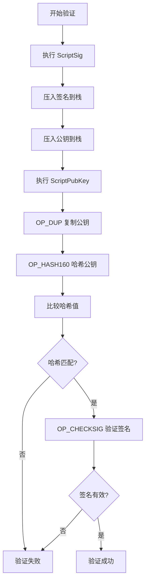
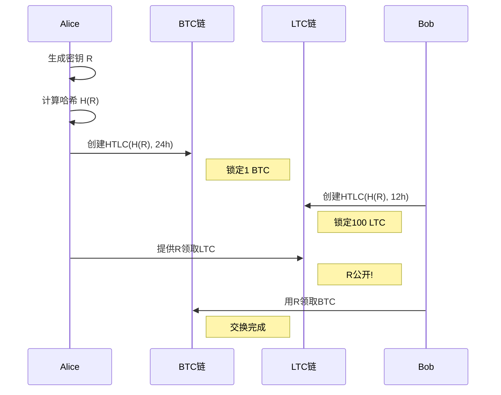

---
title: 比特币智能合约 - 10分钟讲解脚本
date: 2025-10-23
permalink: /blockchain/bitcoin-smart-contracts-script.html
categories:
  - Technology
  - Learning
---

# 比特币智能合约 - 10分钟讲解脚本

## 开场 (30秒)

大家好,今天咱们聊聊一个有意思的话题——比特币上的智能合约。

很多人一听智能合约,第一反应是以太坊。但其实比特币才是最早支持智能合约的区块链,只是它的智能合约跟以太坊那种截然不同。以太坊是个图灵完备的计算机,啥都能干;而比特币呢,更像是一把瑞士军刀——功能不多,但每一个都很实用,而且稳定可靠。

## 第一部分:Bitcoin Script到底是什么 (2分钟)

首先说说比特币的脚本语言 Bitcoin Script。

这个语言设计得非常简单——它是基于栈的。什么叫基于栈?你可以把它想象成一摞盘子,数据只能从上面放进去,从上面拿出来,后进先出。比如我要算 2+3,脚本会这么执行:先把 2 压进栈,再把 3 压进栈,然后执行加法操作,把栈顶的两个数弹出来相加,结果 5 再压回栈里。

这个设计有个很重要的特点——非图灵完备。什么意思?就是它不能写循环,不能做递归。听起来像是缺陷对吧?但这恰恰是比特币的安全设计。想想看,如果允许循环,有人写个死循环脚本,整个网络就卡死了。所以中本聪当初设计的时候就禁用了这些功能,保证每个脚本的执行时间都是可预测的。

再举个实际的例子。一个典型的比特币转账脚本长这样:先复制公钥,然后对公钥做哈希,检查是不是跟地址匹配,最后验证签名。整个过程就像验证你的身份证——先看照片像不像,再验证防伪标记,一步一步来,不会有意外。

Bitcoin Script 里有很多操作码,比如 OP_DUP 是复制,OP_HASH160 是做哈希,OP_CHECKSIG 是验证签名。这些操作码就像乐高积木,你可以把它们组合起来,搭建出各种功能。虽然每个积木都很简单,但组合起来能玩出不少花样。

## 第二部分:标准的转账是怎么实现的 (2分钟)

现在说说最常见的两种转账方式。

第一种叫 P2PKH,就是 Pay-to-PubKey-Hash,转账给公钥哈希。这是比特币最经典的转账方式,咱们平时用的钱包地址,大部分都是这种。

它的原理很直观:你收到一笔钱,这笔钱被锁定了,锁定脚本说"谁能提供公钥和对应的签名,谁就能花这笔钱"。等你要花的时候,你的钱包会自动提供签名和公钥,然后比特币网络验证一下,没问题就放行。

整个流程就像银行取款——你拿着银行卡(公钥)和密码(签名)去取钱,银行验证一下是你本人,就把钱给你。

第二种是 P2SH,Pay-to-Script-Hash,转账给脚本哈希。这个就高级一点了。

P2SH 的妙处在于它把复杂度隐藏起来了。比如说,你想做一个 2-of-3 的多签钱包,需要 3 个人中的 2 个签名才能花钱。如果用传统方式,这个脚本会很长,而且别人一看就知道你在用多签。但用 P2SH,你只需要把脚本做个哈希,别人看到的就是一个普通地址,根本不知道背后是多签还是别的什么复杂逻辑。

这就像保险箱——外面看起来都一样,但打开的方式各不相同,有的需要钥匙,有的需要密码,有的需要指纹,外人根本不知道。

## 第三部分:时间锁——给比特币加上时间维度 (2分钟)

接下来讲讲时间锁,这是比特币智能合约里很实用的功能。

时间锁有两种:绝对时间锁和相对时间锁。

绝对时间锁叫 CLTV,CheckLockTimeVerify。它的作用是设定一个具体时间,在这个时间之前,钱锁死了,谁都花不了。想象一下,你给儿子留一笔钱,但规定他 18 岁才能用,这就是绝对时间锁的典型应用。

相对时间锁叫 CSV,CheckSequenceVerify。它不看具体日期,而是看区块高度。比如你可以设定"从这笔钱被确认开始,要等 100 个区块才能花"。这个在闪电网络里用得特别多,因为需要给对方留出反应时间。

举个实际的例子——遗嘱合约。假设 Alice 想给自己的比特币做个保险,正常情况下她自己能花,但如果她一年没有任何活动,她儿子 Bob 就能继承这笔钱。这个用脚本怎么写?很简单:如果提供 Alice 的签名,直接放行;如果提供 Bob 的签名,要先检查时间锁,确保已经过了一年。Alice 只需要定期"刷新"一下,创建一笔新交易,就能证明自己还在,Bob 就拿不走钱。

这个设计很巧妙吧?不需要律师,不需要公证,代码就是法律。

## 第四部分:HTLC——比特币的"原子交换" (2分钟)

现在说一个更酷的东西——HTLC,哈希时间锁合约。

HTLC 是闪电网络和跨链交易的核心技术。它的原理是这样的:我把钱锁住,你要拿走必须提供一个密钥,而这个密钥的哈希值我已经知道了。同时设个时间锁,如果你一直不拿,时间到了钱自动退给我。

听起来有点抽象,咱们用一个实际场景来理解。

假设 Alice 有比特币,Bob 有莱特币,两人想交换。但他们互不信任,怎么办?

首先,Alice 生成一个随机密钥,然后把密钥的哈希告诉 Bob。接着 Alice 创建一个比特币 HTLC:"Bob,如果你提供这个密钥,就能拿走我的 1 个比特币;如果 24 小时你不拿,钱退给我"。

然后 Bob 也创建一个莱特币 HTLC,用同样的哈希:"Alice,如果你提供密钥,就能拿走我的 100 个莱特币;如果 12 小时你不拿,钱退给我"。

注意 Bob 的超时时间更短,这是关键!

现在 Alice 先去领莱特币,她一旦提供密钥,密钥就公开了。Bob 看到密钥后,赶紧用同样的密钥去领比特币。交换完成!

如果中途任何一方不配合,时间到了钱会自动退回,没人会亏。这就是"原子性"——要么全成功,要么全失败,不存在中间状态。

这个机制现在被广泛应用在跨链交易和闪电网络路由里。你在闪电网络里转账,即使中间经过好几个节点,也不用担心哪个节点会吞钱,因为 HTLC 保证了要么钱到账,要么退回来。

## 第五部分:更多可能性——DLC 和 Taproot (1.5分钟)

时间关系,我再快速介绍两个前沿技术。

第一个是 DLC,离散日志合约。它引入了"预言机"的概念。什么是预言机?就是把链外的真实世界数据引入到链上。比如你和朋友打赌比特币价格会不会涨到 5 万美元,那就需要一个可信的数据源来告诉合约"现在价格是多少"。DLC 就是干这个的。

它的玩法是这样:双方提前把所有可能的结果都签名好,然后锁定资金。等到约定时间,预言机公布价格,赢家拿着对应的签名去取钱。整个过程不需要信任预言机不作恶,因为预言机只负责提供数据,不能动你的钱。

第二个是 Taproot,这是 2021 年比特币的重大升级。Taproot 引入了脚本树的概念——你可以把好几种花费条件放在一棵树里,用的时候只暴露你实际使用的那一条路径,其他的都隐藏起来。

举个例子,一个公司钱包可以设计成:正常情况 3 个高管联合签名,异常情况可以降级成 2-of-3 多签,紧急情况可以 CEO 单签。但外界看起来,这就是个普通钱包,完全看不出背后有这么多花样。隐私性和灵活性都提升了一大截。

## 结尾总结 (30秒)

好,最后总结一下。

比特币的智能合约虽然简单,但设计精妙。它不像以太坊那样追求"万能",而是专注于"可靠"。通过时间锁、哈希锁、多签这些基础组件,我们可以搭建出遗嘱、托管、原子交换、闪电网络等各种实用功能。

比特币的哲学是"少即是多"——功能少一点,安全性就高一点;复杂度低一点,可靠性就强一点。这也是为什么比特币运行了 16 年,从来没出过大的安全事故。

好了,今天就分享到这里。谢谢大家!

---

## 补充资料(可选展开)

### 实际案例:闪电网络支付

Alice 想通过闪电网络给 Dave 转账,但他们之间没有直接通道,需要经过 Bob 和 Carol 两个中间节点:

```
Alice -> Bob -> Carol -> Dave
```

流程:
1. Dave 生成密钥 R,把哈希 H(R) 告诉 Alice
2. Alice 向 Bob 创建 HTLC:提供 R 可得 1 BTC,1小时超时
3. Bob 向 Carol 创建 HTLC:提供 R 可得 1 BTC,50分钟超时
4. Carol 向 Dave 创建 HTLC:提供 R 可得 1 BTC,40分钟超时
5. Dave 提供 R 向 Carol 取钱,R 公开
6. Carol 用 R 向 Bob 取钱
7. Bob 用 R 向 Alice 取钱

整个过程自动完成,任何人都没法吞钱!

### 技术对比表

| 特性 | 比特币 Script | 以太坊 Solidity |
|------|--------------|----------------|
| 图灵完备 | 否 | 是 |
| 循环 | 不支持 | 支持 |
| 状态存储 | 最小化 | 丰富 |
| Gas费用 | 可预测 | 波动大 |
| 安全性 | 极高 | 较高 |
| 灵活性 | 有限 | 很强 |
| 应用场景 | 支付、多签、时间锁 | DeFi、NFT、DAO |

### Mermaid 流程图:P2PKH 验证流程



### Mermaid 流程图:HTLC 原子交换


