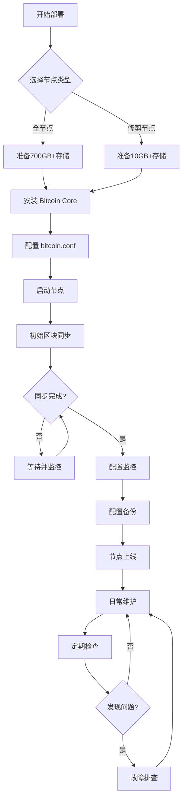
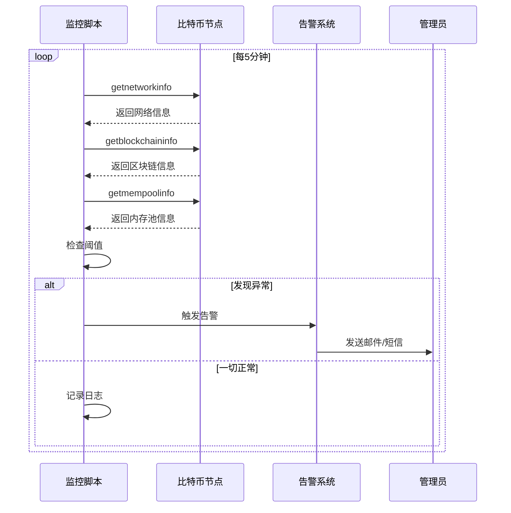
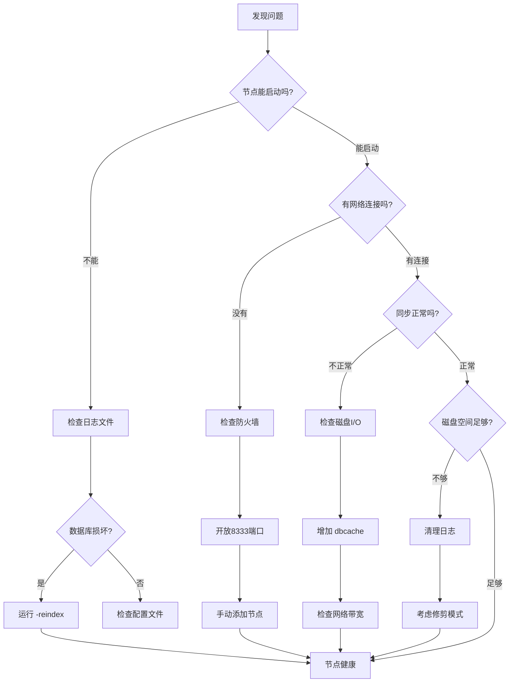

---
title: 比特币节点运维实战 - 10分钟讲解脚本
date: 2025-10-23
permalink: /blockchain/bitcoin-node-operations-script.html
categories:
  - Technology
  - Learning
---

# 比特币节点运维实战 - 10分钟讲解脚本

## 开场 (30秒)

大家好,今天咱们聊点实战的——怎么运维一个比特币节点。

可能有人会问,我又不挖矿,为什么要跑节点?这就好比你存钱在银行,你可以每次都打电话问银行"我还有多少钱",也可以自己在家里记账本。跑节点就是自己记账——不依赖别人,完全掌控自己的资产,这才是真正的"去中心化"。

不过呢,跑节点可不是装个软件那么简单,里面有不少门道。今天我就从选节点、装节点、监控到维护,给大家讲讲这些年踩过的坑。

## 第一部分:选择合适的节点类型 (1.5分钟)

首先要搞清楚,比特币节点不是只有一种。

最常见的是**全节点**,也就是 Full Node。这种节点存储整个区块链的所有数据,从 2009 年创世区块到现在的每一笔交易,一个都不少。听起来很霸气对吧?但现实是,现在比特币区块链已经有 600 多个 G 了,而且每天还在增长。就像你收集从小到大的所有照片,家里得准备个大硬盘。

如果你硬盘不够,还有个选择叫**修剪节点**,Pruned Node。这种节点也会验证所有区块,但验证完就把老数据删了,只保留最近的。打个比方,就像你只保留最近一年的账单,更早的账单验证完就扔掉。这样你只需要 10 个 G 左右的空间,但该验证的一样不少,安全性没打折扣。

还有一种叫**归档节点**,Archive Node。这是给那些需要查询历史数据的人用的,比如区块链浏览器、交易所、数据分析公司。它不仅存完整区块链,还建了各种索引,方便快速查询任意一笔历史交易。当然,存储空间要 700G 起步。

最后是**轻节点**,也叫 SPV 节点。这种节点只下载区块头,不下载完整区块,手机钱包大多用的就是这种。但是轻节点没法完全验证交易,需要信任别的节点,所以不在我们今天的讨论范围。

我的建议是:如果你是个人用户,硬盘够的话就跑全节点;如果硬盘紧张,修剪节点完全够用。除非你是做数据分析或者提供服务,不然归档节点没必要。

## 第二部分:节点部署实战 (2分钟)

选好了节点类型,接下来就是部署。

先说硬件要求。别听网上那些"树莓派也能跑节点"的说法,那是能跑,但体验很差。我的建议是:至少 4 核 CPU、8G 内存、1TB 硬盘,最好是 SSD。网络带宽的话,10Mbps 上下行差不多够了,但要注意,节点每个月会传输几百 G 的数据,如果你的宽带有流量限制,可能会超。

部署方式有两种:直接装在系统上,或者用 Docker。

我推荐用 Docker,原因很简单——隔离性好,升级方便,出问题了重新拉个镜像就行。给大家看个最简单的 docker-compose 配置:

```yaml
services:
  bitcoin-node:
    image: lncm/bitcoind:v26.0
    restart: unless-stopped
    volumes:
      - bitcoin-data:/data/.bitcoin
      - ./bitcoin.conf:/data/.bitcoin/bitcoin.conf
    ports:
      - "8332:8332"  # RPC端口
      - "8333:8333"  # P2P端口
```

三行配置,一键启动,是不是很简单?

然后是配置文件 `bitcoin.conf`。这个文件决定了节点的行为,我说几个关键参数:

- `prune=10000`:修剪模式,保留 10GB 数据
- `txindex=1`:建立交易索引,查历史交易更快
- `maxconnections=125`:最大连接数,默认就好
- `rpcuser` 和 `rpcpassword`:RPC 认证信息,一定要改成强密码

配置好之后,执行 `docker-compose up -d`,节点就跑起来了。但是,别急着高兴,还有最重要的一步——**初始同步**。

第一次启动节点,它会从创世区块开始同步,验证 16 年来的每一个区块、每一笔交易。这个过程在我的机器上大概花了两天。这两天你要保持网络畅通、电脑不关机。就像搬家,东西得一件一件搬过来,急不得。

同步的时候你可以用 `bitcoin-cli getblockchaininfo` 查看进度,有个 `verificationprogress` 字段,显示 0.9999 就算同步完了。

这里有个小技巧:如果你有朋友已经跑了全节点,可以直接拷贝他的 `blocks` 和 `chainstate` 目录,能省不少时间。当然,拷贝完了节点还是会验证一遍,确保数据没问题。

## 第三部分:节点监控——别让节点"失联" (2分钟)

节点跑起来之后,不是说放着不管就行了,你得盯着点,免得哪天"失联"了自己都不知道。

最基本的,你要监控这几个指标:

**第一,连接数**。一个健康的节点应该有 8 个以上的连接。如果连接数是 0,说明网络有问题,可能是防火墙挡了,也可能是你的 ISP 把 P2P 流量给限了。如果连接数只有 1-2 个,也不正常,可能需要手动添加一些节点。

查连接数很简单:
```bash
bitcoin-cli getnetworkinfo
```

**第二,同步状态**。你得确保节点一直跟上最新的区块,别落后太多。用 `getblockchaininfo` 可以看到当前区块高度和同步进度。如果你的区块高度比区块浏览器上显示的少了几十个,说明同步滞后了,可能是网络不稳定,也可能是 CPU 或磁盘 I/O 跟不上。

**第三,内存池状态**。内存池就是那些等待打包的交易。正常情况下内存池有几千到几万笔交易,这很正常。但如果突然暴涨到十几万笔,说明网络拥堵了,手续费会飙升。监控内存池能帮你了解当前网络状况:

```bash
bitcoin-cli getmempoolinfo
```

**第四,磁盘空间**。这个很关键,尤其是跑全节点的。如果磁盘满了,节点会停止同步,甚至可能损坏数据库。所以要定期检查,至少保留 50G 的空闲空间。

我自己写了个监控脚本,每 5 分钟检查一次这些指标,如果发现问题就发邮件通知我。代码不复杂,就是定时调用 `bitcoin-cli` 然后判断阈值,有兴趣的可以自己试试。

除了这些基础指标,你还可以看看 peer 的质量。有些 peer 响应很慢,或者一直不发数据,这种 peer 就可以断开连接。用 `getpeerinfo` 可以看到每个 peer 的详细信息,包括延迟、上传下载量、连接时间等等。

还有个有意思的指标——网络算力。虽然这跟你的节点运维关系不大,但能帮你了解整个比特币网络的安全程度。算力越高,攻击网络的成本越高。

## 第四部分:节点维护——让节点长期稳定运行 (2分钟)

节点跑起来了,监控也配好了,但运维工作还没结束,日常维护同样重要。

**首先是日志管理**。比特币节点会把所有事件记录到 `debug.log` 文件里,这个文件会越来越大。我见过有人的日志文件涨到几十个 G,严重占用磁盘。所以要定期清理,或者配置日志轮转,比如只保留最近一周的日志。

看日志的时候,重点关注 ERROR 和 WARNING 级别的消息。比如你看到很多 "connection timeout" 错误,说明网络有问题;看到 "database corruption" 警告,那就要赶紧备份数据了。

**其次是备份**。这个千万不能省。虽然区块链数据本身是公开的,坏了可以重新同步,但你的钱包文件必须备份!钱包文件丢了,币就真的丢了,没人能帮你找回来。

我的备份策略是:每周自动备份一次钱包文件,加密后存到另一块硬盘,同时上传一份到云端(当然也是加密的)。用的是 `bitcoin-cli backupwallet` 命令,非常简单:

```bash
bitcoin-cli backupwallet /backup/wallet_20240101.dat
gpg -c /backup/wallet_20240101.dat
```

记住,备份文件一定要加密,别明文存储!

**第三是版本升级**。比特币核心团队每年会发布几个版本,有的是小修小补,有的是重大升级。一般来说,不是每个版本都必须升级,但如果是安全补丁或者共识规则变化,那就得赶紧升级,不然可能会跟主网分叉。

升级流程很简单:停节点,备份数据,替换二进制文件,重启节点,验证版本。整个过程 5 分钟搞定。用 Docker 的话就更简单了,改一下镜像版本号,`docker-compose up -d` 就行。

我有个习惯,每次升级前先在测试网试一遍,确保没问题再升级主网节点。毕竟主网上可是真金白银,宁可麻烦点,也不能出差错。

**最后是资源优化**。如果你的节点跟其他服务跑在同一台机器上,要注意资源分配。比如可以限制比特币节点的 CPU 使用率、内存上限,避免影响其他服务。Docker 里配置 `cpus` 和 `memory` 就行:

```yaml
deploy:
  resources:
    limits:
      cpus: '2'
      memory: 4G
```

## 第五部分:故障排查——常见问题和解决方案 (1.5分钟)

跑节点时间长了,总会遇到各种问题,我说几个最常见的。

**问题一:节点启动不了**。这通常是因为上次没正常关闭,数据库文件损坏了。解决办法是加上 `-reindex` 参数重新建立索引,或者 `-rescan` 重新扫描区块链。严重的话,可能需要删除 `chainstate` 目录重新同步。

**问题二:连接数为 0**。首先检查防火墙,确保 8333 端口开放。然后用 `telnet` 或 `nc` 测试端口是否能连通。如果防火墙没问题,可能是 ISP 封了 P2P 协议,这种情况可以试试改端口,或者用 VPN。

实在不行,可以手动添加节点:
```bash
bitcoin-cli addnode "ip:8333" "add"
```

网上有很多公开的节点列表,找几个延迟低的加上就行。

**问题三:同步速度很慢**。这可能是硬盘 I/O 瓶颈,尤其是机械硬盘。换 SSD 能大幅提升速度。如果已经是 SSD 了,那就检查网络带宽,确保上下行都足够。还有就是 `dbcache` 参数,这个是数据库缓存大小,内存够的话可以调大点,比如 `dbcache=4096`。

**问题四:内存池爆了**。这种情况通常发生在网络拥堵的时候,几十万笔交易积压着。如果你不需要接收所有交易,可以设置最低手续费率,拒绝低手续费的交易:
```
minrelaytxfee=0.0001
```

**问题五:磁盘满了**。如果你跑的是全节点,可以考虑切换到修剪模式,或者清理一些不必要的文件,比如老版本的备份、过大的日志文件。实在不行就加硬盘吧。

最后一个通用的排查技巧:多看日志!90% 的问题在日志里都能找到线索。实在解决不了,拿着日志到 Bitcoin 社区论坛或者 Stack Exchange 上问,通常都能得到帮助。

## 结尾总结 (30秒)

好了,今天就分享到这。

运维比特币节点看起来复杂,但其实掌握了这几个要点——选对节点类型、做好监控、定期维护、快速排查问题——就能让节点稳定运行,成为比特币网络的一份子。

跑节点不仅能让你完全掌控自己的资产,也是在为整个网络做贡献。毕竟,比特币的去中心化,靠的就是成千上万个像你一样的节点运营者。

如果你还没试过,不妨找台闲置电脑,花个周末时间搭一个,亲身体验一下什么叫"不依赖任何人,只相信代码"。

谢谢大家!

---

## 补充资料(可选展开)

### 实战案例:从零搭建一个全节点

#### 准备工作
```bash
# 1. 创建数据目录
mkdir -p ~/bitcoin-node/{data,config,backup}

# 2. 编写配置文件
cat > ~/bitcoin-node/config/bitcoin.conf << EOF
# 网络设置
maxconnections=125
listen=1

# RPC设置
server=1
rpcuser=your_username
rpcpassword=your_strong_password
rpcallowip=127.0.0.1

# 性能优化
dbcache=4096
maxmempool=300

# 日志设置
debug=0
shrinkdebugfile=1
EOF

# 3. 创建 docker-compose.yml
cat > ~/bitcoin-node/docker-compose.yml << EOF
version: '3.8'
services:
  bitcoin:
    image: lncm/bitcoind:v26.0
    container_name: bitcoin-node
    restart: unless-stopped
    volumes:
      - ./data:/data/.bitcoin
      - ./config/bitcoin.conf:/data/.bitcoin/bitcoin.conf:ro
    ports:
      - "8332:8332"
      - "8333:8333"
    deploy:
      resources:
        limits:
          cpus: '2'
          memory: 4G
EOF

# 4. 启动节点
cd ~/bitcoin-node
docker-compose up -d

# 5. 查看日志
docker-compose logs -f
```

#### 监控脚本示例

```bash
#!/bin/bash
# bitcoin-monitor.sh

# 配置
ALERT_EMAIL="your@email.com"
MIN_CONNECTIONS=8

# 获取节点信息
CONNECTIONS=$(bitcoin-cli getnetworkinfo | jq .connections)
BLOCKS=$(bitcoin-cli getblockchaininfo | jq .blocks)
HEADERS=$(bitcoin-cli getblockchaininfo | jq .headers)
MEMPOOL_SIZE=$(bitcoin-cli getmempoolinfo | jq .size)

# 检查连接数
if [ $CONNECTIONS -lt $MIN_CONNECTIONS ]; then
    echo "警告: 连接数过低 ($CONNECTIONS)" | mail -s "Bitcoin Node Alert" $ALERT_EMAIL
fi

# 检查同步状态
BLOCKS_BEHIND=$((HEADERS - BLOCKS))
if [ $BLOCKS_BEHIND -gt 10 ]; then
    echo "警告: 节点落后 $BLOCKS_BEHIND 个区块" | mail -s "Bitcoin Node Alert" $ALERT_EMAIL
fi

# 检查磁盘空间
DISK_FREE=$(df -h /data/.bitcoin | awk 'NR==2 {print $4}' | sed 's/G//')
if [ $(echo "$DISK_FREE < 50" | bc) -eq 1 ]; then
    echo "警告: 磁盘空间不足 (${DISK_FREE}G)" | mail -s "Bitcoin Node Alert" $ALERT_EMAIL
fi

# 输出状态
echo "=== Bitcoin Node Status ==="
echo "时间: $(date)"
echo "连接数: $CONNECTIONS"
echo "区块高度: $BLOCKS / $HEADERS"
echo "内存池: $MEMPOOL_SIZE 笔交易"
echo "磁盘剩余: ${DISK_FREE}G"
```

### Mermaid 流程图:节点部署流程



### Mermaid 流程图:节点监控流程



### Mermaid 流程图:故障排查流程



### 常用命令速查表

| 功能 | 命令 | 说明 |
|------|------|------|
| 查看区块高度 | `bitcoin-cli getblockcount` | 当前同步的区块数 |
| 查看连接数 | `bitcoin-cli getconnectioncount` | 当前peer连接数 |
| 查看同步状态 | `bitcoin-cli getblockchaininfo` | 详细的区块链信息 |
| 查看内存池 | `bitcoin-cli getmempoolinfo` | 待确认交易统计 |
| 查看peer详情 | `bitcoin-cli getpeerinfo` | 所有peer的详细信息 |
| 手动添加节点 | `bitcoin-cli addnode "ip:port" "add"` | 添加特定节点连接 |
| 断开节点 | `bitcoin-cli disconnectnode "ip:port"` | 断开特定peer |
| 备份钱包 | `bitcoin-cli backupwallet "path"` | 备份钱包文件 |
| 估算手续费 | `bitcoin-cli estimatesmartfee 6` | 估算6个区块确认的费率 |
| 验证区块链 | `bitcoind -reindex` | 重建索引 |

### 性能优化建议

1. **硬件优化**
   - 使用 NVMe SSD,随机读写性能比 SATA SSD 强
   - 内存够用的话设置 `dbcache=4096` 或更高
   - CPU 多核心对初始同步有帮助

2. **网络优化**
   - 设置 `maxconnections=40` 限制连接数,避免占用过多资源
   - 使用 `maxuploadtarget=144` 限制每日上传流量(单位MB)
   - 配置 `bind` 绑定特定网卡

3. **系统优化**
   - 增加文件描述符限制: `ulimit -n 8192`
   - 使用 systemd 管理自动重启
   - 配置日志轮转避免日志文件过大

4. **安全优化**
   - 只在本地监听 RPC: `rpcallowip=127.0.0.1`
   - 使用强密码或 cookie 认证
   - 定期更新到最新版本
   - 钱包文件加密: `bitcoin-cli encryptwallet "passphrase"`
