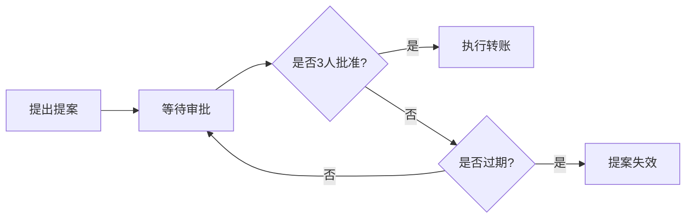
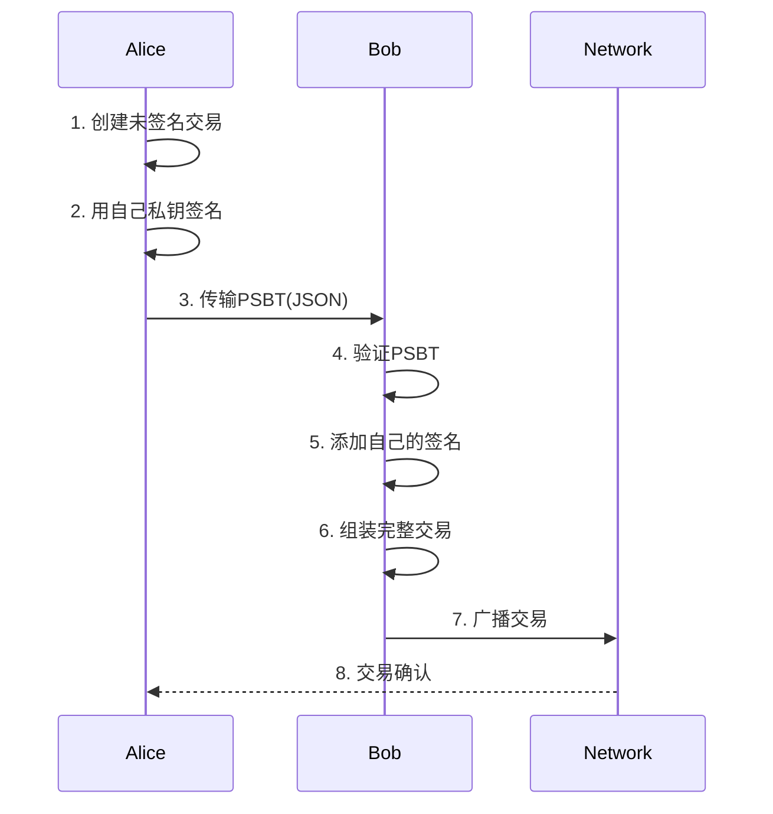

---
title: 比特币多签钱包开发-10分钟脚本
date: 2025-09-30
permalink: /blockchain/bitcoin-multisig-wallet-script.html
categories:
  - Technology
  - Learning
---

# 比特币多签钱包开发 - 10分钟演讲脚本

## 开场白 (30秒)

大家好!今天咱们聊聊多签钱包这个话题。你们有没有遇到过这种情况:公司账上躺着几百个BTC,但老板担心财务一个人把私钥跑路了?或者买卖双方都不信任对方,钱打过去万一对方不发货怎么办?

我见过太多这样的案例了。有个创业公司,CTO一个人掌握所有比特币私钥,结果某天突然失联,200多个BTC就这么锁死了,谁也动不了。还有个做OTC的朋友,被买家骗了50个BTC——收了钱就不给币。

这些问题,多签钱包都能解决。今天咱们用10分钟,从原理到代码,手把手教你开发一个生产级的多签钱包。

## 第一部分:多签原理——不是谁都能动公司的钱 (2分钟)

### 什么是多签?

多签,全称是"M-of-N多重签名"。简单说,就是设置N个钥匙持有者,至少要M个人同意才能花钱。

最常见的有这么几种:
- **2-of-2**: 两个人都得签名,适合夫妻共管账户
- **2-of-3**: 三个人里任意两个签名就行,适合买卖双方+仲裁的托管场景
- **3-of-5**: 五个董事里至少三个同意,适合公司治理

我之前服务过一家交易所,他们用的是5-of-9的超级多签——9个高管,至少5个人同意才能转账。听起来麻烦,但安全啊!有次他们的运维被钓鱼攻击,黑客拿到了一个私钥,结果屁用没有,因为黑客凑不齐5个签名。

### 技术实现方式

比特币支持三种多签地址:

1. **P2SH (Pay-to-Script-Hash)**: 最经典的方式,地址以`3`开头
   - 优点: 兼容性好,所有钱包都支持
   - 缺点: 手续费稍高

2. **P2WSH (SegWit多签)**: 地址以`bc1q`开头
   - 优点: 手续费便宜30%
   - 缺点: 老钱包可能不支持

3. **P2TR (Taproot多签)**: 最新的方式,地址以`bc1p`开头
   - 优点: 隐私更好,看起来和普通地址一样
   - 缺点: 需要新版本bitcoind支持

我个人建议:如果是新项目直接上P2WSH,省钱又够用;如果需要极致隐私,可以考虑P2TR。

### 地址生成核心逻辑

生成多签地址的关键是构建**赎回脚本(Redeem Script)**:

```
OP_2                    # 需要2个签名
<公钥A>                 # 第一个公钥
<公钥B>                 # 第二个公钥
<公钥C>                 # 第三个公钥
OP_3                    # 总共3个公钥
OP_CHECKMULTISIG        # 检查多签
```

然后对赎回脚本做Hash160,前面加版本号`0x05`,就得到了P2SH地址。

**重点提醒**: 公钥必须按字典序排序!我当年就踩过这个坑,三个人各自生成的地址不一致,搞了半天才发现是排序问题。

## 第二部分:交易签名流程——像接力赛一样传递签名 (2.5分钟)

多签交易的签名流程有点像接力赛,一个人签完传给下一个人,直到凑够M个签名。

### PSBT:部分签名交易格式

现代比特币开发都用PSBT(Partially Signed Bitcoin Transaction)标准,这是BIP174定义的。

简单说,PSBT是一个JSON对象,里面包含:
- 原始交易
- 赎回脚本
- 已收集的签名
- 待签名的输入信息

第一个人签名后,把PSBT传给第二个人;第二个人加上自己的签名,继续传递;凑够M个签名后,最后一个人组装成完整交易并广播。

### 实战流程

我用一个2-of-3托管场景来演示:
- 买家Alice、卖家Bob、仲裁Charlie
- 需要任意两人签名才能花钱

**步骤1: 创建未签名交易**

```java
Transaction tx = builder.createMultiSigTransaction(
    wallet,
    utxos,    // 多签地址的UTXO
    outputs   // 付款目标
);
```

**步骤2: Alice首签**

```java
PartiallySignedTransaction psbt = builder.firstSign(
    tx,
    wallet,
    alicePrivateKey,
    utxos
);

// 序列化为JSON传给Bob
String json = psbt.toJSON();
```

**步骤3: Bob添加签名**

```java
PartiallySignedTransaction psbt =
    PartiallySignedTransaction.fromJSON(json);

psbt = builder.addSignature(
    psbt,
    bobPrivateKey,
    utxos
);
```

**步骤4: 完成并广播**

```java
Transaction finalTx = builder.finalizeTransaction(psbt);
String txid = broadcastTransaction(finalTx);
```

### 关键细节

有几个细节必须注意:

1. **CHECKMULTISIG的bug**: 这个操作码有个历史遗留bug,会多pop一个元素,所以scriptSig开头要加个`OP_0`

2. **签名顺序**: 签名必须按公钥在赎回脚本中的顺序排列,不能乱

3. **安全传输**: PSBT包含敏感信息,传输时一定要加密,我一般用PGP或者HTTPS

我见过有人把PSBT用微信明文传输,结果被中间人截获,黑客替换了收款地址。所以一定要验证PSBT的完整性!

## 第三部分:企业金库实战——让公司账户更安全 (2.5分钟)

咱们来看一个实际场景:一家区块链公司要管理价值几千万美金的比特币资产。

### 治理架构设计

他们用的是**3-of-5多签架构**:
- CEO、CFO、CTO各持一把密钥
- 两位独立董事各持一把密钥
- 任意三人同意即可转账

这样的好处是:
- 单人无法作恶
- 两人串通也不行
- 即使有人丢失密钥,剩余四人照样能用

### 提案审批流程

他们开发了一套提案系统:

**流程图:**



**代码实现:**

```java
// 1. CFO提出提案
WithdrawalProposal proposal = treasury.createProposal(
    "CFO",
    "bc1q...",  // 收款地址
    10.5,       // 金额(BTC)
    "支付供应商款项"
);

// 2. CEO批准
treasury.approveProposal(proposal, "CEO", ceoPrivateKey);

// 3. CTO批准
treasury.approveProposal(proposal, "CTO", ctoPrivateKey);

// 4. 自动执行(凑够3个签名)
String txid = treasury.executeProposal(proposal, wallet);
```

### 关键设计要点

1. **提案有效期**: 设置7天有效期,过期自动作废
2. **审批记录**: 每个审批都记录时间戳和签名,可追溯
3. **金额限制**: 超过100 BTC的提案需要4-of-5,更加保险

我服务过的那家公司,还加了一个规则:如果是转到白名单地址(比如常用的交易所),只需要2-of-5;如果是陌生地址,必须3-of-5。这样既保证安全,又不会太繁琐。

### 冷热钱包结合

他们的实际部署方案:
- **热钱包**: 2-of-3多签,CEO+CFO+运营总监,管理日常支出(<10 BTC)
- **温钱包**: 3-of-5多签,高管团队,管理中等金额(10-100 BTC)
- **冷钱包**: 4-of-7多签,包含外部安全顾问,管理大额储备(>100 BTC)

这个分层设计非常实用,既保证安全,又不会每次转账都要召集一堆人。

## 第四部分:托管与继承——多签的高级玩法 (2分钟)

### 2-of-3托管服务

这是我觉得最酷的应用场景——不需要信任中介的托管交易。

场景:Alice要从Bob手里买一个域名,价值5个BTC。

**流程:**

1. 三方各持一把密钥(Alice、Bob、仲裁Charlie)
2. Alice向多签地址充值5 BTC
3. 如果交易顺利:
   - Alice确认收到域名
   - Alice + Bob签名,资金释放给Bob
4. 如果有纠纷:
   - Alice申请退款
   - Charlie仲裁后决定站哪边
   - Alice + Charlie签名退款,或 Bob + Charlie签名放行

关键是:Charlie只在纠纷时出场,正常交易他根本不需要参与。而且,Charlie一个人也动不了钱,所以可以信任。

我见过一个平台用这个模式做二手显卡交易,一年处理了几千万美金,纠纷率只有2%,Charlie只调解了几十单。

### 时间锁继承钱包

最后分享一个温馨的应用:继承钱包。

设计思路:
- 正常情况:所有者一个人就能花费
- 如果所有者6个月没有活动:继承人可以取走资金

**脚本结构:**

```
IF
  <所有者公钥> CHECKSIG
ELSE
  <6个月> CHECKSEQUENCEVERIFY DROP
  <继承人公钥> CHECKSIG
ENDIF
```

所有者可以随时花费(走IF分支);继承人只有在6个月后才能花费(走ELSE分支,需要等待CSV时间锁)。

实际使用中,所有者可以定期"刷新"这个时间锁——每隔3个月给自己转一次账,重置计时器。这样只要所有者还活着,继承人就永远无法花费;一旦所有者出事,6个月后继承人自动获得访问权。

我有个客户用这个给儿子留了遗产,他说这样心里踏实多了——不用担心突然出事,也不用提前把私钥告诉儿子(怕儿子提前败家😄)。

## 结尾总结 (30秒)

好了,10分钟时间到。咱们今天讲了:
1. 多签原理和三种地址类型
2. PSBT签名流程
3. 企业金库的治理架构
4. 托管服务和继承钱包

多签钱包不是什么高深技术,但用好了能解决大问题——公司资产管理、去信任交易、遗产继承,都离不开它。

我的建议是:先从2-of-3的小项目练手,理解清楚签名流程;然后再尝试企业级的3-of-5方案。代码方面,BIP174的PSBT标准已经很成熟了,直接用现成库就行。

记住:多签的核心是"分权制衡",技术只是手段,制度设计才是关键。祝大家都能开发出安全可靠的多签钱包!

---

## 补充材料

### 1. 完整代码示例:2-of-3多签钱包

```java
import org.bitcoinj.core.*;
import org.bitcoinj.script.*;
import java.util.*;

/**
 * 2-of-3多签钱包完整示例
 */
public class MultiSigWalletDemo {

    public static void main(String[] args) {
        NetworkParameters params = MainNetParams.get();

        // 1. 生成三个密钥对
        ECKey key1 = new ECKey();
        ECKey key2 = new ECKey();
        ECKey key3 = new ECKey();

        System.out.println("公钥1: " + key1.getPublicKeyAsHex());
        System.out.println("公钥2: " + key2.getPublicKeyAsHex());
        System.out.println("公钥3: " + key3.getPublicKeyAsHex());

        // 2. 创建赎回脚本
        List<ECKey> keys = Arrays.asList(key1, key2, key3);
        Script redeemScript = ScriptBuilder.createMultiSigOutputScript(2, keys);

        System.out.println("赎回脚本: " + redeemScript);

        // 3. 生成P2SH地址
        Script scriptPubKey = ScriptBuilder.createP2SHOutputScript(redeemScript);
        Address multiSigAddress = Address.fromP2SHScript(params, scriptPubKey);

        System.out.println("多签地址: " + multiSigAddress);

        // 4. 构建花费交易(假设已有UTXO)
        Transaction tx = new Transaction(params);

        // 添加输入(从多签地址)
        tx.addInput(
            Sha256Hash.wrap("上一笔交易的txid"),
            0,  // vout索引
            redeemScript
        );

        // 添加输出(付款目标)
        tx.addOutput(
            Coin.valueOf(100000000),  // 1 BTC
            Address.fromString(params, "bc1q...")
        );

        // 5. 签名(key1和key2)
        Sha256Hash sigHash = tx.hashForSignature(
            0,
            redeemScript,
            Transaction.SigHash.ALL,
            false
        );

        ECKey.ECDSASignature sig1 = key1.sign(sigHash);
        ECKey.ECDSASignature sig2 = key2.sign(sigHash);

        // 6. 构建scriptSig
        ScriptBuilder scriptSig = new ScriptBuilder()
            .smallNum(0)  // CHECKMULTISIG bug workaround
            .data(sig1.encodeToDER())
            .data(sig2.encodeToDER())
            .data(redeemScript.getProgram());

        tx.getInput(0).setScriptSig(scriptSig.build());

        // 7. 验证并广播
        tx.verify();
        System.out.println("交易已构建: " + tx.getTxId());
    }
}
```

### 2. 多签钱包类型对比表

| 类型 | M-of-N | 适用场景 | 优点 | 缺点 |
|------|--------|----------|------|------|
| 2-of-2 | 2/2 | 夫妻账户、合伙人 | 双方平等 | 一方丢失密钥即失效 |
| 2-of-3 | 2/3 | 托管交易 | 容错性强 | 需要第三方参与 |
| 3-of-5 | 3/5 | 公司治理 | 高安全性 | 操作较复杂 |
| 5-of-9 | 5/9 | 大型机构 | 极高安全性 | 非常繁琐 |

### 3. PSBT签名流程图



### 4. 企业多签钱包安全检查清单

**部署前检查:**
- [ ] 所有公钥已按字典序排序
- [ ] 赎回脚本已多方验证一致
- [ ] 测试网环境已完整测试
- [ ] 私钥已离线保存在多个物理位置
- [ ] 提案系统已设置合理的审批流程

**运维检查:**
- [ ] 每季度进行一次应急演练
- [ ] 密钥持有者定期轮换
- [ ] 审计日志完整可追溯
- [ ] 灾难恢复方案已文档化
- [ ] 冷热钱包比例合理(建议90%冷/10%热)

**紧急情况处理:**
- [ ] 某个密钥泄露:立即迁移资金到新地址
- [ ] 某个密钥丢失:用剩余密钥转移资金
- [ ] 签名人离职:立即创建新多签钱包并迁移

### 5. 常见问题FAQ

**Q1: 多签地址如何验证?**

A: 三方各自用相同的公钥和参数生成地址,对比一致性。建议用多个独立工具交叉验证,比如bitcoinj库和bitcoin-core都算一遍。

**Q2: PSBT如何安全传输?**

A: 推荐方案:
1. 使用PGP加密后通过邮件传输
2. 使用HTTPS + JWT的专用API
3. 线下场景可用U盘物理传递

绝对不要明文传输!

**Q3: 如果签名人数不够怎么办?**

A: 这是多签的"致命弱点"。防范措施:
- 使用M-of-N时保证N-M≥2(至少允许2人缺席)
- 定期进行签名演练,确保所有人都能正常签名
- 保留应急方案,比如6个月时间锁后的降级处理

**Q4: 多签手续费比单签贵多少?**

A: 大约贵30-50%,因为:
- scriptSig更大(包含多个签名+赎回脚本)
- 如果用P2WSH可以省一些

实测数据:
- 普通P2PKH交易: ~250 vbytes
- 2-of-3 P2SH交易: ~370 vbytes
- 2-of-3 P2WSH交易: ~310 vbytes

**Q5: 可以中途修改M或N吗?**

A: 不可以!多签地址一旦生成,M和N就固定了。如果要修改,必须:
1. 创建新的多签地址(新的M和N)
2. 把旧地址的资金转移到新地址

这是个容易踩的坑,设计时一定要想清楚。

### 6. 推荐工具和库

**开发库:**
- `bitcoinj` (Java): 最成熟的Java库
- `btcd` (Go): 比特币全节点的Go实现
- `python-bitcoinlib` (Python): 适合快速原型开发

**钱包软件:**
- `Electrum`: 支持多签,操作简单
- `Bitcoin Core`: 官方客户端,最安全
- `Sparrow Wallet`: 开源,对PSBT支持最好

**测试工具:**
- Bitcoin Testnet: 免费测试币
- Regtest: 本地私链,可自己挖矿
- Signet: 更稳定的测试网

### 7. 进阶学习资源

**必读BIP:**
- BIP11: M-of-N多签标准
- BIP16: P2SH地址定义
- BIP141: SegWit(P2WSH基础)
- BIP174: PSBT格式标准
- BIP340-342: Taproot/Schnorr签名

**推荐书籍:**
- 《Mastering Bitcoin》第7章:高级交易和脚本
- 《Programming Bitcoin》第8章:Pay-to-Script-Hash

**在线资源:**
- Bitcoin Developer Guide: https://developer.bitcoin.org/
- Bitcoin Stack Exchange: 遇到问题先搜这里
- Bitcoin Core源码: `src/script/`目录下的多签实现

---

**演讲者备注:**
- 重点强调"3-of-5企业金库"场景,这是听众最感兴趣的
- 如果时间紧张,可以跳过"继承钱包"部分
- 准备一个真实的多签地址展示,扫码查看余额和交易历史
- 建议准备Demo视频:从创建地址到完成签名的完整流程
