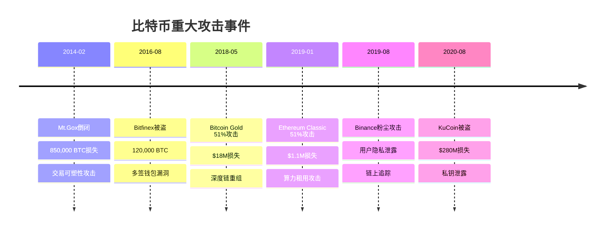

---
title: 比特币攻击案例分析-10分钟脚本
date: 2025-09-30
permalink: /blockchain/bitcoin-attack-cases-script.html
categories:
  - Technology
  - Learning
---

# 比特币攻击案例分析 - 10分钟演讲脚本

## 开场白 (30秒)

大家好!今天咱们聊一个刺激的话题——比特币攻击案例。

先问个问题:你们知道有史以来最大的比特币损失是多少吗?不是几个、几十个,而是**85万个BTC**!按当年价值约4.5亿美金,现在的话...大概400多亿美金。这就是2014年Mt.Gox交易所的惨案。

我做区块链安全这些年,见过太多血淋淋的教训。有交易所被双花攻击损失700万美金,有矿池被自私挖矿榨干利润,还有普通用户被粉尘攻击追踪到实名身份。

今天咱们用10分钟,盘点比特币世界里最经典的几种攻击手法。不是教你作恶,而是让你知道坑在哪,怎么避开它。毕竟,知道怎么攻击才能知道怎么防御,对吧?

## 第一部分:双花攻击——一鱼两吃的艺术 (2.5分钟)

### 什么是双花?

"双花"就是把同一笔钱花两次,就像你用同一张钞票既买了奶茶又买了炸鸡——听起来不可能,但比特币早期还真有人做到了。

**攻击原理很简单:**

1. 攻击者向商家发送一笔交易Tx1:付10个BTC买商品
2. 商家看到Tx1进入内存池,觉得安全,就发货了
3. 攻击者暗地里联系矿池,发送交易Tx2:把同样的10个BTC转给自己
4. 矿池挖出包含Tx2的区块,广播到网络
5. Tx1被网络拒绝(双花冲突),商家的钱没了,货也发出去了

攻击者完美实现了"一鱼两吃"——既拿到了货,又保留了币。

### 真实案例:2019年BTG(Bitcoin Gold) 51%攻击

这个案例特别经典,因为它证明了**51%攻击不是理论,是可以实操的**。

**时间线:**
- 2019年1月,某攻击者租用算力达到BTG网络的51%以上
- 向交易所充值约7000个BTG
- 在交易所卖出BTG,换成其他币并提现
- 然后用控制的算力进行**深度链重组**,重组了至少24个区块!
- 重组后的链上,充值交易变成了"发回自己"
- 攻击者既从交易所套现了,又保留了原来的BTG

**攻击成本:**
- 租用算力: 约$10,000/小时
- 攻击时长: 12小时
- 总成本: ~$120,000

看起来不划算,因为只赚了$70,000,但重点是:这证明了小币种容易被攻击!BTG当时算力只有比特币的几百分之一,租用51%算力并不难。

### 如何检测双花?

我当年给一家交易所做风控时,写了个双花检测系统,核心逻辑是:

**监控内存池中的冲突交易**

```java
// 伪代码
Map<String, Set<String>> utxoSpenders = new HashMap<>();

for (Transaction tx : mempool) {
    for (Input input : tx.getInputs()) {
        String utxo = input.prevTxid + ":" + input.prevVout;

        Set<String> spenders = utxoSpenders.get(utxo);
        if (spenders == null) {
            spenders = new HashSet<>();
            utxoSpenders.put(utxo, spenders);
        }

        spenders.add(tx.txid);

        if (spenders.size() > 1) {
            // 发现双花!同一个UTXO被两笔交易花费
            alert("检测到双花攻击!", utxo, spenders);
        }
    }
}
```

**关键防御措施:**
1. **增加确认数**: 大额充值要求20+确认(BTG攻击后从6提高到20)
2. **监控链重组**: 如果发生深度重组(>6个块),立即暂停充值
3. **算力监控**: 检测网络算力突然大幅波动

我的经验是:对于算力较低的小币种,交易所应该要求至少50个确认,甚至直接下架。安全比上币费更重要。

## 第二部分:Mt.Gox悲剧——交易可塑性的代价 (2.5分钟)

### 交易可塑性是什么?

简单说,就是**交易内容不变,但交易ID(TXID)可以被修改**。

这怎么可能?因为TXID是对整个交易(包括签名)做哈希计算的。而ECDSA签名有个特性:同一个消息可以有多个有效签名。

比如:
- 原始交易Tx1,TXID = `abc123...`
- 攻击者修改签名(内容不变),得到Tx2,TXID = `def456...`
- Tx1和Tx2都是有效的,但TXID不同

这就像你开了一张支票,别人把签名位置稍微挪了一下,支票号变了,但金额、收款人都没变——支票照样有效。

### Mt.Gox案例:85万BTC是怎么丢的?

Mt.Gox是当时全球最大的比特币交易所,处理全球70%的比特币交易。2014年2月,它突然宣布破产,85万BTC不翼而飞。

**攻击过程(简化版):**

1. 用户Alice请求提现1 BTC
2. Mt.Gox创建交易Tx1,发送给Alice
3. 攻击者拦截Tx1,修改签名得到Tx2,抢先广播
4. 矿工打包了Tx2(因为更早收到)
5. Alice收到1 BTC(通过Tx2)
6. Mt.Gox查询Tx1的状态:未确认!
7. Mt.Gox以为提现失败,重新给Alice发1 BTC...
8. Alice重复此过程,每次提现都能提2次

这就像银行转账,你收到了钱,但银行系统显示"转账失败",于是银行又给你转了一次——双倍到账!

**根本原因:**

Mt.Gox的系统设计有个致命缺陷:**只用TXID追踪交易状态**。

正确做法应该是:追踪**UTXO是否被花费**,而不是TXID是否确认。因为TXID可以变,但UTXO要么被花了,要么没花,不会骗人。

### SegWit:终结交易可塑性

2017年比特币升级了SegWit(隔离见证),彻底解决了这个问题。

**SegWit的核心思想:**

把签名数据从交易中"隔离"出去,计算TXID时不包含签名。这样签名怎么变,TXID都不变。

```
旧格式(可塑性):
TXID = Hash(版本 + 输入 + 输出 + 签名 + 锁定时间)
       ↑ 签名可变,TXID就可变

新格式(SegWit):
TXID = Hash(版本 + 输入 + 输出 + 锁定时间)
签名存在Witness中,不影响TXID
```

我当时第一时间把公司的系统全部升级到SegWit地址(bc1开头),从此告别了交易可塑性的噩梦。

**教训总结:**
1. 永远不要只依赖TXID追踪交易
2. 尽快升级到SegWit
3. 使用UTXO作为唯一标识

## 第三部分:隐秘战争——自私挖矿与Eclipse攻击 (2.5分钟)

### 自私挖矿:不跟大家分享的矿工

正常矿工挖到区块后会立即广播,让大家知道"我赢了"。但自私矿工不这样——他挖到区块后藏着不说,继续在自己的私链上挖。

**策略:**

1. 自私矿工挖到区块A,不广播,继续挖
2. 诚实矿工也挖到了区块A',广播了
3. 自私矿工这时候:
   - 如果私链更长(已经挖到A+B),立即广播私链,诚实链作废
   - 如果一样长,广播A制造分叉,有50%概率赢
   - 如果私链更短,放弃私链,认栽

**理论收益:**

根据2013年康奈尔大学的论文,拥有33%算力的自私矿工,可以获得约37%的区块奖励——多赚4个百分点!

听起来不多,但如果是大矿池,这可是每年几千万美金的额外收益。

**实际中少见的原因:**
1. **风险大**: 如果私链输了,白费算力
2. **容易被发现**: 孤块率会异常高
3. **损害网络**: 长期来看会降低币价,得不偿失

我见过有矿池尝试过,被社区发现后立即被抵制,损失比赚的多得多。

### Eclipse攻击:把你的节点关进小黑屋

这个攻击手法非常阴险——攻击者控制你节点的所有网络连接,让你只能连到攻击者的节点。

就像把你关在一个房间里,房间里只有攻击者的人,你以为外面的世界就是他们展示给你的样子。

**攻击步骤:**

1. 攻击者控制大量IP地址(比如2000个)
2. 疯狂连接目标节点,填满它的peer列表
3. 目标节点重启后,只会连接到攻击者的节点
4. 攻击者控制目标节点看到的区块链视图

**后果:**
- 可以让目标节点接收假交易(0确认双花更容易)
- 让矿工在废链上挖矿,浪费算力
- 配合51%攻击,降低所需算力

**真实研究:**

2015年波士顿大学的研究证明:用大约2000个IP地址,可以eclipse一个比特币节点,攻击成本相对较低。

**防御方法:**

我的节点配置:
1. 固定连接到几个可信节点(公司内部节点、朋友节点)
2. 限制每个IP段的连接数
3. 定期对比多个区块浏览器的高度
4. 如果发现peer全都来自同一IP段,立即告警

### 粉尘攻击:隐私杀手

最后说个不那么激烈但很恶心的攻击——**粉尘攻击**。

**攻击原理:**

1. 攻击者向成千上万个地址发送极小额BTC(比如546聪,约0.0001美金)
2. 等你在交易中不小心用了这个"粉尘"UTXO
3. 攻击者通过链上分析,把这个地址和你其他地址关联起来
4. 逐步追踪你的所有资金和交易

就像在你口袋里偷偷塞了个GPS定位器,等你带着它回家,攻击者就知道你住哪了。

**真实案例:**

2019年币安用户大规模收到粉尘攻击,攻击者试图追踪大户的资金流向。币安后来增加了"粉尘转换"功能,可以把小额UTXO转成BNB,避免使用。

**防御方法:**

我的建议:
1. **不要花费可疑的小额UTXO** (尤其是<1000聪的)
2. 钱包设置"UTXO控制",手动选择要花费的UTXO
3. 定期更换接收地址
4. 使用隐私增强技术(CoinJoin等)

## 第四部分:防御策略——如何保护自己 (2分钟)

说了这么多攻击,最后咱们聊聊怎么防。

### 如果你是交易所

**双花防护:**
- 大额充值(>10 BTC):至少6确认,小币种要20+
- 实时监控链重组,深度>3立即暂停
- 内存池双花检测系统24/7运行

**热钱包安全:**
- 限制热钱包余额<总资产的5%
- 使用3-of-5多签,CEO+CFO+CTO+2个安全官
- 每日审计,异常立即告警

**冷存储:**
- 95%以上资金放冷钱包
- 多重签名+地理分散(不要放在一个地方)
- 定期演练冷钱包提取流程

**提现安全:**
- 大额提现(>100 BTC):人工审核+时间延迟(24小时)
- 白名单地址制度,陌生地址要验证
- 提现限额:单日/单笔都要限制

我服务过的交易所,用这套方案运营了5年,没出过一次安全事故。

### 如果你是普通用户

**钱包安全:**
- 大额资金用硬件钱包(Ledger、Trezor)
- 备份助记词,抄在纸上,分多份存放
- 永远不要把私钥输入网页或拍照

**交易安全:**
- 转账前仔细核对地址(至少看前6位和后6位)
- 大额转账先测试:发0.001 BTC确认地址正确
- 使用合理手续费,别为了省几块钱等几天

**隐私保护:**
- 每次收款用新地址(HD钱包自动生成)
- 不要在社交媒体晒交易记录
- 警惕粉尘攻击,不花费小额UTXO

我自己的习惯:手机装个热钱包放生活费(<0.1 BTC),硬件钱包放长期持有的币,冷钱包(离线电脑)放养老金——分层管理,降低风险。

### 核心原则:假设一切都可能被攻击

这是我做安全这么多年最大的体会:**永远不要相信单点**。

- 不要只相信一个节点(运行多个,交叉验证)
- 不要只用一个地址(HD钱包,每次换新)
- 不要只看TXID(看UTXO是否被花费)
- 不要只信任一个人(多签治理)

比特币本身很安全,但攻击者很聪明,他们不会攻击协议,而是攻击**人和系统**。只要你足够谨慎,大部分攻击都能避免。

## 结尾总结 (30秒)

好了,10分钟到了。今天咱们盘点了比特币世界的几大经典攻击:
1. **双花攻击**(BTG 51%攻击,深度重组)
2. **交易可塑性**(Mt.Gox 85万BTC损失,SegWit解决)
3. **自私挖矿**(矿工的黑暗策略,收益vs风险)
4. **Eclipse攻击**(隔离节点,控制视图)
5. **粉尘攻击**(追踪隐私,去匿名化)

这些攻击听起来可怕,但都是可以防御的。关键是:**保持警惕,多层防护,永远不要相信单点**。

我的建议:先搞懂攻击原理,才能设计好防御系统。安全不是一次性的工作,而是持续的过程。

记住:在区块链世界,**你就是你自己的银行**。银行会被抢,但好银行不会。祝大家都能守住自己的数字资产!

---

## 补充材料

### 1. 攻击时间线图



### 2. 双花攻击检测代码

```java
import java.util.*;
import java.util.concurrent.*;

/**
 * 双花攻击实时检测系统
 */
public class DoubleSpendDetector {

    private BitcoinRpcClient rpcClient;

    // UTXO -> 花费它的交易集合
    private ConcurrentHashMap<String, Set<String>> utxoSpenders;

    // 已检测到的双花事件
    private List<DoubleSpendEvent> detectedEvents;

    public DoubleSpendDetector(BitcoinRpcClient client) {
        this.rpcClient = client;
        this.utxoSpenders = new ConcurrentHashMap<>();
        this.detectedEvents = new ArrayList<>();
    }

    /**
     * 启动实时监控
     */
    public void startMonitoring() {
        ScheduledExecutorService executor = Executors.newScheduledThreadPool(1);

        executor.scheduleAtFixedRate(() -> {
            try {
                scanMempool();
            } catch (Exception e) {
                System.err.println("监控异常: " + e.getMessage());
            }
        }, 0, 5, TimeUnit.SECONDS);
    }

    /**
     * 扫描内存池
     */
    private void scanMempool() throws Exception {
        JSONArray mempool = rpcClient.call("getrawmempool").getJSONArray("result");

        for (int i = 0; i < mempool.length(); i++) {
            String txid = mempool.getString(i);
            checkTransaction(txid);
        }
    }

    /**
     * 检查单笔交易
     */
    private void checkTransaction(String txid) throws Exception {
        JSONObject tx = rpcClient.call("getrawtransaction", txid, true);
        JSONArray inputs = tx.getJSONArray("vin");

        for (int i = 0; i < inputs.length(); i++) {
            JSONObject input = inputs.getJSONObject(i);

            // 跳过coinbase交易
            if (input.has("coinbase")) continue;

            String prevTxid = input.getString("txid");
            int prevVout = input.getInt("vout");
            String utxoKey = prevTxid + ":" + prevVout;

            // 记录这个UTXO的花费者
            utxoSpenders.putIfAbsent(utxoKey, ConcurrentHashMap.newKeySet());
            Set<String> spenders = utxoSpenders.get(utxoKey);

            boolean newSpender = spenders.add(txid);

            // 检测双花
            if (spenders.size() > 1 && newSpender) {
                handleDoubleSpend(utxoKey, spenders);
            }
        }
    }

    /**
     * 处理检测到的双花
     */
    private void handleDoubleSpend(String utxo, Set<String> conflictingTxs) {
        DoubleSpendEvent event = new DoubleSpendEvent();
        event.timestamp = System.currentTimeMillis();
        event.utxo = utxo;
        event.conflictingTransactions = new ArrayList<>(conflictingTxs);

        detectedEvents.add(event);

        // 告警
        System.err.println("⚠️⚠️⚠️ 检测到双花攻击!");
        System.err.println("冲突UTXO: " + utxo);
        System.err.println("冲突交易: " + conflictingTxs);

        // 发送告警通知
        sendAlert(event);
    }

    /**
     * 发送告警
     */
    private void sendAlert(DoubleSpendEvent event) {
        // 实现邮件、短信、Webhook等告警通知
        // ...
    }

    /**
     * 双花事件记录
     */
    public static class DoubleSpendEvent {
        long timestamp;
        String utxo;
        List<String> conflictingTransactions;

        public String toString() {
            return String.format("[%s] UTXO: %s, 冲突交易: %s",
                new Date(timestamp), utxo, conflictingTransactions);
        }
    }
}
```

### 3. 攻击类型对比表

| 攻击类型 | 难度 | 成本 | 目标 | 典型损失 | 防御方法 |
|---------|------|------|------|---------|---------|
| 双花攻击(0确认) | ⭐ | 低 | 商家 | 单笔损失 | 等待确认 |
| 51%攻击 | ⭐⭐⭐⭐⭐ | 极高 | 交易所 | 百万美金级 | 增加确认数、监控重组 |
| 交易可塑性 | ⭐⭐ | 低 | 交易所 | 重复提现 | 升级SegWit、追踪UTXO |
| 自私挖矿 | ⭐⭐⭐⭐ | 高 | 全网 | 长期利润损失 | 检测孤块率 |
| Eclipse攻击 | ⭐⭐⭐ | 中 | 个人节点 | 双花、隐私 | 连接可信节点 |
| 粉尘攻击 | ⭐ | 极低 | 隐私 | 去匿名化 | 不花费粉尘UTXO |
| 时间盗窃 | ⭐⭐⭐ | 中 | 挖矿公平性 | 难度调整偏差 | 检测时间戳异常 |

### 4. 链重组检测脚本

```java
/**
 * 链重组监控系统
 */
public class ChainReorgMonitor {

    private BitcoinRpcClient rpcClient;
    private Map<Integer, String> knownBlocks; // 高度 -> 区块哈希

    public void monitorReorg() {
        while (true) {
            try {
                int currentHeight = rpcClient.getBlockCount();

                // 检查最近100个区块是否发生重组
                for (int i = Math.max(0, currentHeight - 100); i <= currentHeight; i++) {
                    String currentHash = rpcClient.getBlockHash(i);
                    String knownHash = knownBlocks.get(i);

                    if (knownHash != null && !knownHash.equals(currentHash)) {
                        // 检测到重组!
                        int reorgDepth = currentHeight - i;
                        handleReorg(i, reorgDepth, knownHash, currentHash);
                    }

                    knownBlocks.put(i, currentHash);
                }

                Thread.sleep(10000); // 每10秒检查一次

            } catch (Exception e) {
                System.err.println("监控错误: " + e.getMessage());
            }
        }
    }

    private void handleReorg(int height, int depth, String oldHash, String newHash) {
        System.err.println("⚠️ 检测到链重组!");
        System.err.println("重组高度: " + height);
        System.err.println("重组深度: " + depth + " 个区块");
        System.err.println("旧区块: " + oldHash);
        System.err.println("新区块: " + newHash);

        if (depth > 6) {
            System.err.println("🚨 深度重组!可能存在51%攻击!");

            // 立即暂停充值/提现
            pauseOperations();

            // 发送紧急告警
            sendEmergencyAlert(depth);
        }
    }

    private void pauseOperations() {
        // 暂停所有充值和提现操作
    }

    private void sendEmergencyAlert(int depth) {
        // 发送紧急告警给管理员
    }
}
```

### 5. 交易所安全配置示例

```yaml
# 比特币节点安全配置
security:
  # 充值确认数要求
  deposit_confirmations:
    default: 6
    high_risk_coins:  # 小算力币种
      BTG: 50
      ETC: 100
    large_amount:  # 大额充值
      threshold: 10  # BTC
      confirmations: 20

  # 双花检测
  double_spend_detection:
    enabled: true
    mempool_scan_interval: 5  # 秒
    alert_channels:
      - email: security@exchange.com
      - slack: #security-alerts
      - sms: +1234567890

  # 链重组监控
  reorg_monitoring:
    enabled: true
    max_safe_depth: 6
    emergency_threshold: 10  # 深度>10立即暂停
    check_interval: 10  # 秒

  # 热钱包限额
  hot_wallet:
    max_balance: 100  # BTC
    daily_withdrawal_limit: 50  # BTC
    single_tx_limit: 10  # BTC
    multisig: 3-of-5

  # 冷钱包策略
  cold_wallet:
    percentage: 95  # 总资产的95%
    multisig: 5-of-9
    geographic_distribution:
      - location: US
        percentage: 40
      - location: EU
        percentage: 35
      - location: ASIA
        percentage: 25

  # 提现审核
  withdrawal:
    manual_review_threshold: 100  # BTC
    time_delay:  # 时间延迟
      large_amount: 24h  # >100 BTC
      whitelist_address: 1h
      new_address: 48h
```

### 6. 常见问题FAQ

**Q1: 0确认交易安全吗?**

A: 对小额交易(如咖啡店)可以接受,但一定要:
- 检查手续费是否合理(太低可能被RBF替换)
- 检查是否启用了RBF(sequence < 0xfffffffe)
- 检查是否存在双花(内存池中的冲突交易)

大额交易必须等确认!我的经验:
- <$100: 0确认可接受
- $100-$1000: 1-3确认
- >$1000: 6+确认

**Q2: SegWit钱包一定安全吗?**

A: SegWit解决了交易可塑性,但不能解决所有问题:
- 双花攻击照样可能
- 私钥泄露照样完蛋
- Eclipse攻击照样有效

SegWit只是更好的交易格式,不是万能防护罩。

**Q3: 小币种真的容易被51%攻击吗?**

A: 是的!经验数据:
- 算力<比特币1%的币种,攻击成本<$10万
- 算力<比特币0.1%的币种,攻击成本<$1万

建议:
- 交易所对小币种要求更多确认(50-100个)
- 投资者谨慎投资小算力币种
- 矿工不要挖小币种(容易被攻击白费算力)

**Q4: 硬件钱包绝对安全吗?**

A: 更安全,但不是绝对:
- 供应链攻击(买到被篡改的设备)
- 物理攻击(有人偷了你的硬件钱包)
- 社会工程学(骗你输入PIN或助记词)

建议:
- 从官方渠道购买
- 收到后检查封条和固件
- 永远不要输入助记词到任何电子设备
- 物理安全:存放在保险柜

**Q5: 收到粉尘攻击怎么办?**

A: 立即隔离!
1. 在钱包中标记这些UTXO为"不可花费"
2. 如果钱包支持,使用"UTXO控制"功能
3. 转移其他资金到新地址
4. 永远不要花费那些粉尘UTXO

有些钱包(如Samourai Wallet)有"粉尘防御"功能,自动标记和隔离可疑UTXO。

### 7. 推荐资源

**安全工具:**
- **Blockchair**: 区块链浏览器,可追踪交易
- **OXT.me**: 隐私分析工具,检测地址关联
- **Mempool.space**: 内存池可视化,检测双花
- **Bitcoin Core**: 官方全节点,最安全

**学习资源:**
- **Bitcoin Wiki - Weaknesses**: 官方漏洞列表
- **Bitcoin Security 101**: Andreas Antonopoulos的课程
- **"Mastering Bitcoin" Chapter 10**: 安全最佳实践
- **Selfish Mining论文**: https://arxiv.org/abs/1311.0243
- **Eclipse Attack论文**: https://eprint.iacr.org/2015/263.pdf

**监控服务:**
- **Chainalysis**: 链上分析,反洗钱
- **CipherTrace**: 交易追踪,合规工具
- **Elliptic**: 风险评估服务

---

**演讲者备注:**
- 重点讲Mt.Gox案例,这是最有故事性的
- BTG 51%攻击可以详细讲攻击成本计算,很震撼
- 粉尘攻击可以用GPS定位器的比喻,容易理解
- 如果时间不够,可以快速跳过"自私挖矿"和"时间盗窃"
- 准备一个双花攻击的动画演示,会更直观
- 结尾强调"你就是你自己的银行"这句话,很有力量
