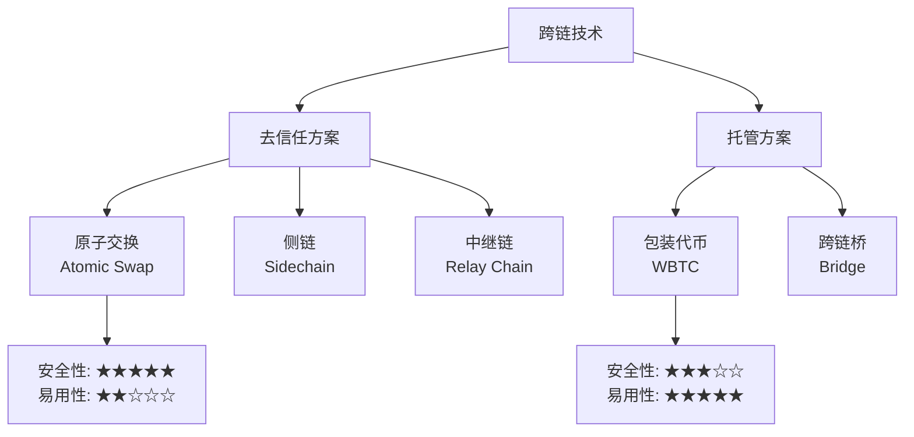
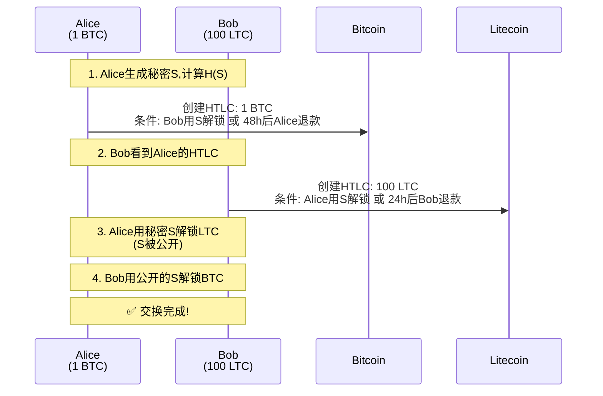
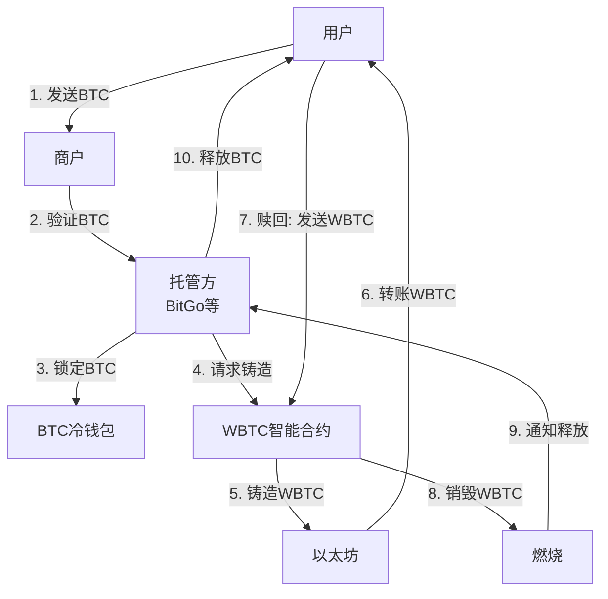
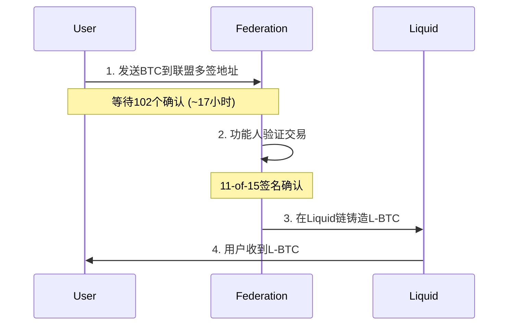

---
title: 比特币跨链技术 - 视频脚本
date: 2025-01-26
categories:
  - Technology
  - Learning
---

# 比特币跨链技术 - 10分钟视频脚本

## [0:00-0:30] 开场 (75词)

**[画面: 孤岛动画 → 桥梁连接]**

想象一下,你有10个BTC,想参与以太坊上火热的DeFi,怎么办?直接卖掉BTC买ETH?那你就失去了BTC的升值潜力。

这就是"区块链孤岛问题"——每条链都是独立的世界,资产无法自由流通。

但现在,**跨链技术**正在打破这些壁垒。从原子交换到WBTC,从闪电网络到Liquid侧链,比特币正在连接整个加密世界。今天,我将用10分钟带你掌握比特币跨链的全部核心技术。

**[字幕: 比特币跨链技术 | 从原子交换到侧链全解析]**

---

## [0:30-1:30] 背景:为什么需要跨链 (250词)

**[画面: 区块链生态地图]**

让我们先看一组数据:

```
比特币: 市值$800B+, 但智能合约能力有限
以太坊: DeFi TVL $50B+, 但缺乏比特币流动性
Solana: 高性能, 但用户想用BTC支付

→ 问题: 资产和功能分散在不同链上
```

**[画面切换: WBTC增长曲线]**

**WBTC的崛起揭示了需求:**
- 2020年: WBTC市值 $50M
- 2021年牛市峰值: $15B (超过25万BTC被锁定)
- 2024年: ~$8B (约13万BTC)

**为什么会有这么多人把BTC转到以太坊?**

因为以太坊有比特币没有的东西:
- **DeFi**: Uniswap, Aave, Compound
- **NFT**: OpenSea, Blur
- **稳定币**: USDC, DAI与BTC交易对

**[画面: 跨链技术分类图]**

**跨链技术分类:**



**核心问题:**
1. 如何确保跨链交换的原子性? (要么成功,要么失败,不会一方收到另一方没收到)
2. 如何在不同链之间验证资产? (比特币链不知道以太坊的状态)
3. 如何平衡安全性和易用性?

今天我们将逐一攻克这些问题!

---

## [1:30-7:00] 核心内容:三大跨链方案详解 (1650词)

### 第一部分: 原子交换 (Atomic Swap) - 最安全的去信任交换 [1:30-3:15]

**[画面: 原子交换流程动画]**

原子交换是最优雅的跨链方案——完全去信任,不需要第三方。

**核心原理: HTLC (Hash Time Locked Contract)**



**[画面: HTLC脚本代码]**

这是一个真实的Bitcoin HTLC脚本:

```
OP_IF
  OP_SHA256 <secretHash> OP_EQUALVERIFY
  <recipientPubKey> OP_CHECKSIG
OP_ELSE
  <lockTime> OP_CHECKLOCKTIMEVERIFY OP_DROP
  <refundPubKey> OP_CHECKSIG
OP_ENDIF
```

翻译成人话:
```
如果 (提供正确的秘密S):
    验证SHA256(S) == secretHash
    验证接收方签名
    → 接收方可以取走资金
否则:
    等到超时时间lockTime
    验证原主人签名
    → 原主人可以退款
```

**[画面: Java代码演示]**

```java
public class HTLC {
    private byte[] secretHash;      // H(secret)
    private String recipientPubKey; // 接收方
    private String refundPubKey;    // 退款方
    private long lockTime;          // 锁定时间

    // 用秘密解锁
    public Transaction redeem(byte[] secret) {
        // 验证: SHA256(secret) == secretHash
        if (!Arrays.equals(sha256(secret), secretHash)) {
            throw new Exception("秘密不正确");
        }

        // 构建解锁交易
        Transaction tx = new Transaction();
        // ... 添加签名和秘密到witness
        return tx;
    }

    // 超时退款
    public Transaction refund() {
        // 只有在超时后才能执行
        if (System.currentTimeMillis() < lockTime) {
            throw new Exception("还未超时");
        }

        Transaction tx = new Transaction();
        tx.lockTime = lockTime;
        // ... 添加退款方签名
        return tx;
    }
}
```

**[画面: 时间轴动画]**

**时间设置至关重要:**

```
Alice HTLC (Bitcoin): 超时时间 48小时
Bob HTLC (Litecoin):  超时时间 24小时

为什么Alice的超时更长?
├─ 保证Alice有足够时间在Bob的链上解锁
├─ 如果Alice解锁了LTC,秘密S就公开了
└─ Bob可以在48小时超时前用S解锁BTC

如果设置相反会怎样?
├─ Alice的BTC先超时 → Alice退款
├─ 但Alice已经在LTC链上公开了S
└─ Bob也用S解锁了LTC → Alice亏损!
```

**原子交换的优缺点:**

✅ **优点:**
- 完全去信任,不需要第三方
- 原子性保证,不会有一方损失
- 点对点交换,隐私性好
- 无需托管,自己掌控私钥

❌ **缺点:**
- 需要双方同时在线,协调成本高
- 只支持有类似脚本能力的链 (BTC ↔ LTC可以, BTC ↔ ETH需要额外工作)
- 用户体验复杂,不适合小白
- 没有价格发现机制,需要链下协商价格

**实际应用:**
- 2017年,首次BTC-LTC原子交换成功
- DEX项目: Atomex, AtomicDEX (Komodo)
- 闪电网络的HTLC就是原子交换的变种

---

### 第二部分: WBTC (Wrapped Bitcoin) - 最流行的托管方案 [3:15-5:00]

**[画面: WBTC铸造流程图]**

如果说原子交换是"理想主义",那WBTC就是"实用主义"——用中心化托管换取简单易用。

**WBTC运作机制:**



**[画面: 数据仪表板]**

**WBTC现状 (2024数据):**

```
总供应量: ~130,000 WBTC
市值: $8B+
托管方: BitGo (美国加密货币托管公司)
商户: 50+ (包括Kyber, Ren等)

储备证明:
├─ 链上地址公开: 可以在Bitcoin区块链上验证
├─ 每日审计报告: https://wbtc.network/dashboard/audit
└─ 1:1抵押比例: 每1 WBTC对应1 BTC储备
```

**[画面: 代码演示]**

```java
public class WBTCCustodian {
    private Map<String, CustodyRecord> custodyRecords;
    private double totalLockedBTC = 0;

    // 锁定BTC并铸造WBTC
    public MintRequest lockAndMint(
            String userBTCAddress,
            double btcAmount,
            String userETHAddress) {

        // 1. KYC验证
        if (!performKYC(userETHAddress)) {
            throw new Exception("KYC验证失败");
        }

        // 2. 生成托管地址
        String custodyAddress = generateCustodyAddress();

        // 3. 等待BTC交易确认 (6个确认)
        waitForBTCConfirmation(userBTCAddress, custodyAddress, btcAmount);

        // 4. 锁定BTC
        CustodyRecord record = new CustodyRecord();
        record.btcAmount = btcAmount;
        record.status = CustodyStatus.LOCKED;
        custodyRecords.put(custodyAddress, record);
        totalLockedBTC += btcAmount;

        // 5. 在以太坊上铸造WBTC
        MintRequest mintRequest = new MintRequest();
        mintRequest.amount = btcAmount;
        mintRequest.recipientETHAddress = userETHAddress;

        // 调用WBTC合约的mint函数
        ethereumContract.mint(userETHAddress, btcAmount);

        return mintRequest;
    }

    // 销毁WBTC并释放BTC
    public void unlockAndBurn(
            String userETHAddress,
            double wbtcAmount,
            String recipientBTCAddress) {

        // 1. 验证用户在以太坊上销毁了WBTC
        if (!verifyWBTCBurned(userETHAddress, wbtcAmount)) {
            throw new Exception("WBTC未销毁");
        }

        // 2. 从冷钱包发送BTC
        sendBTCFromColdWallet(recipientBTCAddress, wbtcAmount);

        // 3. 更新记录
        totalLockedBTC -= wbtcAmount;
    }

    // 储备证明
    public ProofOfReserve getProofOfReserve() {
        ProofOfReserve proof = new ProofOfReserve();
        proof.totalWBTCSupply = getWBTCSupplyFromEthereum();
        proof.totalBTCLocked = totalLockedBTC;
        proof.ratio = proof.totalBTCLocked / proof.totalWBTCSupply;

        // 理想情况: ratio ≥ 1.0
        return proof;
    }
}
```

**[画面: WBTC在DeFi中的应用]**

**WBTC为什么成功?**

因为它打开了BTC进入DeFi的大门:

```
Uniswap: WBTC/ETH 流动性池 $500M+
Aave: 用WBTC作抵押借DAI
Curve: WBTC/renBTC/sBTC 稳定池
MakerDAO: WBTC作为抵押品铸造DAI

→ BTC持有者可以在不卖币的情况下获得流动性
```

**WBTC的风险:**

⚠️ **中心化风险:**
- 托管方BitGo控制私钥,理论上可以作恶
- 商户层面可能出现欺诈
- 美国政府可以冻结BitGo的资产

⚠️ **智能合约风险:**
- WBTC合约有管理员权限,可以暂停转账
- 升级合约可能引入漏洞

⚠️ **审计风险:**
- 储备证明是自证,不是第三方强制审计
- 历史上曾出现短期储备不足情况

**WBTC替代品:**

```
renBTC (Ren Protocol):
├─ 去中心化托管 (Darknodes)
├─ 更去信任,但流动性较小
└─ 2024年Ren团队解散,存在风险

tBTC (Threshold Network):
├─ 最去中心化的BTC锚定币
├─ 使用tECDSA门限签名
└─ 流动性较小,但安全性最高

sBTC (Stacks):
├─ 基于Stacks链的原生BTC锚定
├─ 通过Stacks与Bitcoin的PoX连接
└─ 2024年推出,尚在早期
```

---

### 第三部分: Liquid Network - 比特币的企业级侧链 [5:00-7:00]

**[画面: Liquid Network架构图]**

如果WBTC是"托管型",原子交换是"P2P型",那Liquid就是"联盟型"——由15个机构共同运营的比特币侧链。

**Liquid是什么?**

```
创建者: Blockstream (Bitcoin Core开发者团队)
上线时间: 2018年
共识机制: 联盟共识 (Federated Consensus)
功能人: 15个机构 (Bitfinex, Tether, Coinone等)
签名要求: 11-of-15多签

核心功能:
├─ 快速结算: 1分钟区块,2个确认即最终
├─ 保密交易: 隐藏交易金额和资产类型
├─ 资产发行: 发行USDt, EURt等稳定币
└─ 原子交换: 支持Liquid资产之间的原子交换
```

**[画面: 双向锚定流程]**

**Peg-in: BTC → L-BTC (Liquid Bitcoin)**



**为什么需要102个确认?**
- 防止比特币链重组攻击
- 102个区块后,重组成本极高 (~$1B+)
- 确保Liquid上铸造的L-BTC有真实BTC支撑

**Peg-out: L-BTC → BTC**

```
1. 用户在Liquid上销毁L-BTC
2. 功能人检测到Peg-out请求
3. 11-of-15功能人签名授权
4. 从联盟多签地址发送BTC给用户
5. 耗时: ~2小时
```

**[画面: 保密交易演示]**

**Liquid的杀手功能: 保密交易 (Confidential Transactions)**

普通比特币交易:
```
发送方: bc1q...
接收方: bc1p...
金额: 1.5 BTC  ← 所有人可见

→ 隐私问题: 任何人都能追踪你的财富
```

Liquid保密交易:
```
发送方: VJL...
接收方: VTp...
金额: ***隐藏*** (使用Pedersen Commitment)
资产类型: ***隐藏*** (可能是L-BTC, 也可能是USDt)

→ 只有发送方和接收方知道金额
→ 但网络能验证: 输入 = 输出 (不能凭空印钱)
```

**技术原理: Pedersen Commitment**

```
承诺值 C = amount * G + blinding_factor * H

其中:
├─ G, H 是椭圆曲线上的点
├─ amount 是真实金额
├─ blinding_factor 是随机数 (盲化因子)
└─ 外人看到C,但推导不出amount

同态性:
C1 + C2 = (amount1 + amount2) * G + (bf1 + bf2) * H

→ 可以验证输入总和 = 输出总和
→ 但不知道具体金额
```

**[画面: Liquid应用场景]**

**Liquid的实际应用:**

```
1. 交易所之间结算
   Bitfinex ↔ Coinone ↔ BTCMarkets
   ├─ 好处: 1分钟到账,节省链上手续费
   └─ 保密交易隐藏结算金额

2. 稳定币发行
   ├─ Tether USDt (最大Liquid资产)
   ├─ Bitfinex LEO token
   └─ 好处: 快速发行,低成本

3. 证券型代币
   ├─ Blockstream Mining Notes (BMN)
   ├─ 挖矿收益代币化
   └─ 好处: 合规,可编程

4. OTC大额交易
   ├─ 机构间大额BTC转账
   └─ 好处: 隐藏金额,防止市场影响
```

**Liquid vs Bitcoin vs Ethereum对比:**

| 特性 | Bitcoin | Liquid | Ethereum |
|------|---------|--------|----------|
| 区块时间 | 10分钟 | 1分钟 | 12秒 |
| 最终性 | 6确认(~60分钟) | 2确认(~2分钟) | 12秒 |
| 隐私 | 公开 | 保密交易 | 公开 |
| 智能合约 | 有限 | 有限+ | 图灵完备 |
| 去中心化 | 最高 | 联盟 | 高 |
| TPS | ~7 | ~10 | ~15 |

**Liquid的局限:**

❌ **中心化程度高:**
- 只有15个功能人,远低于Bitcoin/Ethereum
- 如果11个功能人合谋,可以冻结网络

❌ **流动性较小:**
- L-BTC供应量: ~3,500 BTC (vs WBTC ~130,000)
- 主要用于机构,散户使用少

❌ **用户体验:**
- Peg-in需要102确认(17小时)
- 需要专用钱包 (不是所有钱包都支持Liquid)

---

## [7:00-9:00] 深度分析:跨链技术的未来 (500词)

**[画面: 跨链技术演进图]**

### 趋势1: 去信任跨链的突破

**2024年最激动人心的进展: BitVM**

```
BitVM (Bitcoin Virtual Machine)
├─ 创始人: Robin Linus
├─ 核心思想: 在Bitcoin上验证任意计算
├─ 无需改变Bitcoin共识层
└─ 实现方法: 欺诈证明 + Bitcoin Script

应用场景:
├─ BTC ↔ ETH 去信任桥
├─ Bitcoin上的ZK-SNARK验证
└─ 轻客户端验证其他链
```

**BitVM工作原理 (简化):**

```
Alice 想证明她在以太坊上锁定了10 ETH

传统方法:
├─ 需要Bitcoin能读以太坊区块
└─ 不可能,Bitcoin没这功能

BitVM方法:
├─ Alice: "我锁定了10 ETH,这是证明"
├─ Bob (挑战者): "不对,让我验证"
├─ Alice: 提交欺诈证明 (指出Bob错在哪)
└─ Bitcoin Script验证欺诈证明

→ 只要有一个诚实的挑战者,系统就安全
```

### 趋势2: Layer 2成为跨链枢纽

**闪电网络作为跨链层:**

```
BTC Lightning Network ↔ LTC Lightning
└─ 通过HTLC实现原子交换
└─ 即时,低成本

Taproot Assets (前身Taro):
├─ 在闪电网络上发行稳定币
├─ 使用Taproot隐藏资产信息
└─ 实现: BTC ↔ USDT 即时交换
```

### 趋势3: 多签桥的安全升级

**新一代多签桥: tBTC v2, Nomic**

```
传统多签桥 (WBTC):
├─ 单一托管方 (BitGo)
└─ 风险: 单点故障

tBTC v2:
├─ 去中心化签名者网络
├─ tECDSA门限签名 (51-of-100)
├─ 随机分配签名者
└─ 保证金惩罚机制

Nomic (连接Bitcoin & Cosmos):
├─ IBC跨链协议
├─ Tendermint共识
└─ 100+验证者多签
```

### 趋势4: 监管推动合规跨链

**2024-2025监管要求:**

```
FATF Travel Rule:
├─ 跨链转账>$1000需要传递身份信息
├─ WBTC等托管方必须实施
└─ 去中心化桥面临合规挑战

MiCA法规 (欧盟):
├─ 跨链桥视为"加密资产服务提供商"
├─ 需要欧盟牌照
└─ 储备金审计要求
```

**跨链桥的黑暗面: 黑客的ATM机**

```
跨链桥被盗统计 (2021-2024):
├─ Poly Network: $611M (2021)
├─ Ronin Bridge: $625M (2022)
├─ Wormhole: $326M (2022)
├─ Nomad Bridge: $190M (2022)
└─ 总计: $2B+

为什么跨链桥容易被攻击?
├─ 智能合约复杂度高
├─ 多签私钥管理困难
├─ 大量资金锁定在桥上 (蜜罐效应)
└─ 跨链验证逻辑难以审计
```

**最佳实践:**
- ✅ 多次小额转账,分散风险
- ✅ 使用经过审计的桥 (Chainalysis审计)
- ✅ 检查桥的TVL和历史记录
- ⚠️ 避免使用新上线、未经实战检验的桥

---

## [9:00-10:00] 总结:如何选择跨链方案 (250词)

**[画面: 决策树动画]**

**跨链方案选择指南:**

```
你的需求是什么?

├─ 需要最高安全性,不在乎复杂度?
│   └─ ✅ 原子交换 (Atomic Swap)
│       ├─ 适合: 技术极客,大额OTC交易
│       └─ 工具: AtomicDEX, Komodo
│
├─ 需要简单易用,参与以太坊DeFi?
│   └─ ✅ WBTC
│       ├─ 适合: DeFi用户,流动性挖矿
│       └─ 风险: 中心化托管
│
├─ 需要隐私,机构间结算?
│   └─ ✅ Liquid Network
│       ├─ 适合: 交易所,OTC平台
│       └─ 好处: 保密交易,快速确认
│
├─ 需要去中心化且简单?
│   └─ ✅ tBTC v2
│       ├─ 适合: 平衡安全和易用
│       └─ 缺点: 流动性较小
│
└─ 需要跨到非EVM链 (如Cosmos, Polkadot)?
    └─ ✅ Nomic, IBC
        ├─ 适合: 跨生态操作
        └─ 状态: 早期,但潜力大
```

**[画面: 数据对比表]**

**2024年跨链数据快照:**

| 方案 | TVL/供应量 | 去中心化 | 用户体验 | 应用场景 |
|------|------------|----------|----------|----------|
| WBTC | $8B+ | ★☆☆☆☆ | ★★★★★ | DeFi主流 |
| tBTC | $100M | ★★★★☆ | ★★★☆☆ | DeFi安全选择 |
| Liquid | $500M | ★★☆☆☆ | ★★★☆☆ | 机构结算 |
| 原子交换 | N/A | ★★★★★ | ★★☆☆☆ | P2P,小众 |

**关键要点回顾:**

1. **原子交换**: 最安全,完全去信任,但用户体验差
2. **WBTC**: 最流行,易用,但中心化托管风险
3. **Liquid**: 企业级,保密交易,但联盟模式
4. **未来方向**: BitVM等去信任桥,监管推动合规

**最后建议:**

```
新手: 用WBTC,流动性好,生态完善
进阶: 尝试tBTC,体验去中心化
机构: 考虑Liquid,隐私+速度
极客: 研究原子交换和BitVM,这是未来
```

**[画面: 结尾动画]**

跨链不是"要不要",而是"怎么做"。随着技术进步,比特币正在从"数字黄金"演变为"跨链枢纽"。

下一个十年,比特币将不再孤立,而是连接整个Web3世界的价值网络。

**感谢观看!下期我们聊聊比特币时间锁的高级应用。**

---

**视频制作提示:**
- 使用Mermaid生成流程图 (原子交换序列图,Liquid架构图)
- HTLC脚本部分使用代码高亮+逐行解释
- WBTC铸造流程用动画展示
- Liquid保密交易用加密/解密视觉效果
- 对比表格用动态图表展示
