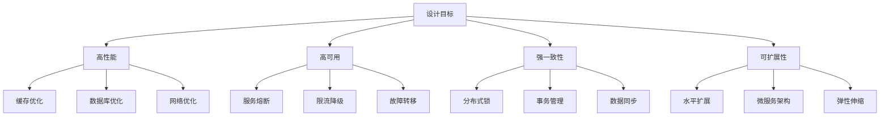
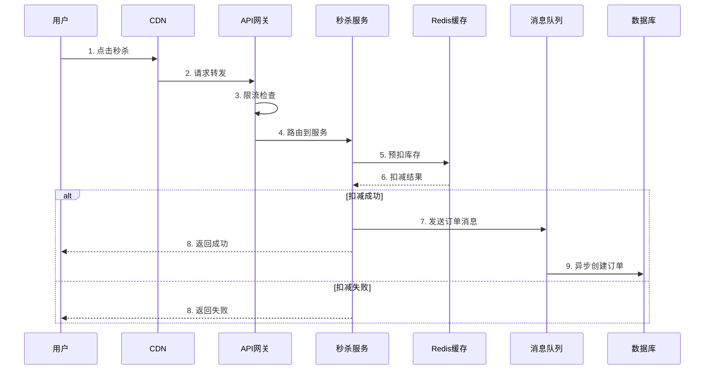
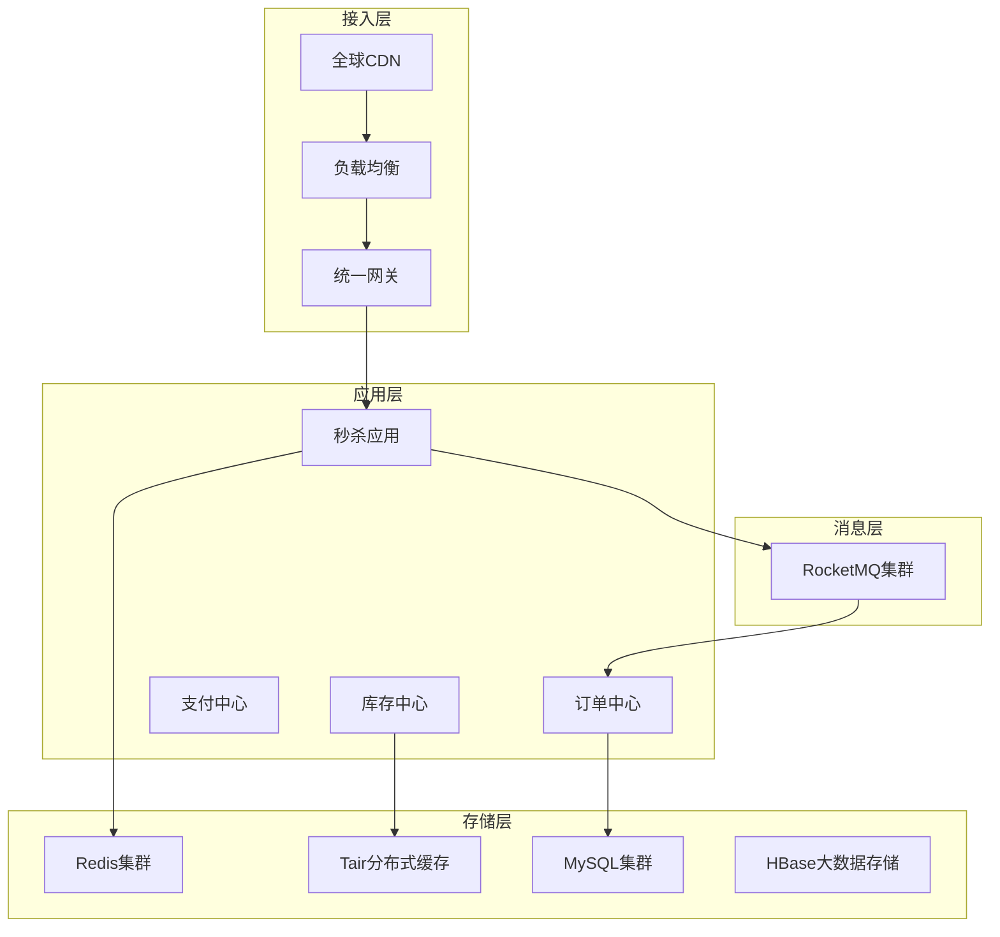

---
title: 秒杀系统设计
date: 2025-11-17
permalink: /docs/场景题/11.秒杀系统设计/
categories:
  - Technology
  - Learning
---

# 秒杀系统设计详解

## 目录

1. [业务分析与需求](#1-业务分析与需求)
2. [系统设计目标](#2-系统设计目标)
3. [架构设计](#3-架构设计)
4. [核心技术方案](#4-核心技术方案)
5. [实现细节](#5-实现细节)
6. [性能优化](#6-性能优化)
7. [监控与运维](#7-监控与运维)
8. [实际案例分析](#8-实际案例分析)
9. [常见问题与解决方案](#9-常见问题与解决方案)
10. [总结与最佳实践](#10-总结与最佳实践)

---

## 1. 业务分析与需求

### 1.1 业务背景

秒杀系统是电商平台的核心营销工具，在特定时间以极低价格限量销售商品。典型场景包括：

- **双11、618等大促活动**：瞬间百万用户涌入
- **限量版商品发售**：iPhone新品、限量球鞋等
- **品牌营销活动**：新用户专享、会员特权等

### 1.2 业务特征

| 特征 | 描述 | 影响 |
|------|------|------|
| **高并发** | 瞬间百万级QPS | 系统压力巨大 |
| **低库存** | 商品数量 << 用户数量 | 99%用户注定失败 |
| **时间敏感** | 固定时间开始抢购 | 流量高度集中 |
| **公平性要求** | 先到先得机制 | 需要精确时序控制 |

### 1.3 核心挑战

#### 1.3.1 技术挑战
```
┌─ 高并发冲击 ─────────────────────────────────────┐
│ • 瞬间流量是平时的1000倍以上                      │
│ • 数据库连接池瞬间耗尽                           │
│ • CPU、内存、网络带宽全面告急                     │
└─────────────────────────────────────────────────┘

┌─ 数据一致性 ─────────────────────────────────────┐
│ • 库存扣减的原子性保证                           │
│ • 订单状态的最终一致性                           │
│ • 分布式环境下的事务处理                         │
└─────────────────────────────────────────────────┘

┌─ 系统稳定性 ─────────────────────────────────────┐
│ • 避免服务雪崩效应                               │
│ • 快速故障恢复能力                               │
│ • 优雅降级机制                                   │
└─────────────────────────────────────────────────┘
```

#### 1.3.2 业务挑战
- **用户体验**：高并发下仍需快速响应
- **黄牛防护**：防止机器人恶意刷单
- **公平性保证**：确保真实用户有公平机会

---

## 2. 系统设计目标

### 2.1 性能目标

| 指标 | 目标值 | 说明 |
|------|--------|------|
| **并发量** | 100万QPS | 峰值请求处理能力 |
| **响应时间** | <200ms | 99%请求响应时间 |
| **可用性** | 99.99% | 年宕机时间<53分钟 |
| **一致性** | 强一致 | 库存数据绝对准确 |

### 2.2 技术目标



---

## 3. 架构设计

### 3.1 整体架构

```
┌─────────────────────────────────────────────────────────────────┐
│                           用户层                                 │
│               Web端 / 移动端 / 小程序                          │
├─────────────────────────────────────────────────────────────────┤
│                         接入层                                   │
│            CDN + SLB + API网关 + 防火墙                         │
│        (静态加速 + 负载均衡 + 限流鉴权 + 安全防护)              │
├─────────────────────────────────────────────────────────────────┤
│                        应用层                                    │
│  ┌─────────────┐ ┌─────────────┐ ┌─────────────┐                │
│  │  秒杀服务   │ │  订单服务   │ │  库存服务   │                │
│  │ (核心逻辑)  │ │ (订单处理)  │ │ (库存管理)  │                │
│  └─────────────┘ └─────────────┘ └─────────────┘                │
├─────────────────────────────────────────────────────────────────┤
│                        缓存层                                    │
│        Redis集群 + 本地缓存 + 分布式缓存                       │
│         (热点数据 + 快速访问 + 数据预热)                        │
├─────────────────────────────────────────────────────────────────┤
│                      消息队列                                    │
│              Kafka / RocketMQ 集群                             │
│           (异步解耦 + 削峰填谷 + 可靠投递)                      │
├─────────────────────────────────────────────────────────────────┤
│                      存储层                                      │
│    MySQL主从集群 + 分库分表 + 读写分离                         │
│         (数据持久化 + 高可用 + 性能优化)                        │
└─────────────────────────────────────────────────────────────────┘
```

### 3.2 核心组件详解

#### 3.2.1 API网关 (Kong/Nginx)
```yaml
功能职责:
  - 统一入口管理
  - 身份认证与授权
  - 请求限流与熔断
  - 协议转换与路由

配置示例:
  rate_limit: 1000/s per user
  timeout: 5s
  retry: 3 times
  circuit_breaker: 50% error rate
```

#### 3.2.2 秒杀服务 (Spring Boot)
```java
@RestController
@RequestMapping("/seckill")
public class SeckillController {

    @Autowired
    private SeckillService seckillService;

    @PostMapping("/execute")
    @RateLimiter(value = 1000) // 限流
    @CircuitBreaker(name = "seckill") // 熔断
    public ResponseEntity<SeckillResult> seckill(
            @RequestBody @Valid SeckillRequest request) {

        return ResponseEntity.ok(seckillService.doSeckill(request));
    }
}
```

#### 3.2.3 分布式缓存 (Redis Cluster)
```redis
# 库存缓存设计
HSET seckill:stock:1001 total 1000 sold 0 version 1

# 用户购买记录
SADD seckill:users:1001 user123 user456

# 分布式锁
SET seckill:lock:1001 threadId PX 5000 NX
```

---

## 4. 核心技术方案

### 4.1 库存扣减方案

#### 4.1.1 Redis + Lua脚本实现
```lua
-- 原子扣减库存脚本
local key = KEYS[1]           -- 库存key
local userid = ARGV[1]        -- 用户ID
local quantity = tonumber(ARGV[2])  -- 购买数量

-- 检查用户是否已购买
local userKey = "seckill:users:" .. string.match(key, "%d+")
if redis.call("SISMEMBER", userKey, userid) == 1 then
    return {0, "用户已购买"}
end

-- 获取当前库存
local stock = redis.call("HGET", key, "remaining")
if not stock then
    return {0, "商品不存在"}
end

stock = tonumber(stock)
if stock < quantity then
    return {0, "库存不足"}
end

-- 扣减库存
redis.call("HINCRBY", key, "remaining", -quantity)
redis.call("HINCRBY", key, "sold", quantity)

-- 记录用户购买
redis.call("SADD", userKey, userid)
redis.call("EXPIRE", userKey, 86400)

return {1, "success"}
```

#### 4.1.2 数据库最终一致性保证
```java
@Service
@Transactional
public class StockService {

    @Autowired
    private RedisTemplate<String, Object> redisTemplate;

    @Autowired
    private StockMapper stockMapper;

    @Autowired
    private MessageProducer messageProducer;

    public boolean deductStock(Long productId, Integer quantity, Long userId) {
        // 1. Redis预扣减
        String script = loadLuaScript("stock-deduct.lua");
        List<Object> result = redisTemplate.execute(
            new DefaultRedisScript<>(script, List.class),
            Arrays.asList("seckill:stock:" + productId),
            userId.toString(), quantity.toString()
        );

        if ((Integer) result.get(0) != 1) {
            return false; // 扣减失败
        }

        // 2. 异步更新数据库
        StockDeductMessage message = new StockDeductMessage();
        message.setProductId(productId);
        message.setQuantity(quantity);
        message.setUserId(userId);
        message.setTimestamp(System.currentTimeMillis());

        messageProducer.send("stock-deduct-topic", message);

        return true;
    }

    // 补偿机制：定时同步Redis和数据库
    @Scheduled(fixedDelay = 30000)
    public void syncStockData() {
        // 同步逻辑实现
    }
}
```

### 4.2 分布式限流方案

#### 4.2.1 滑动窗口限流
```java
@Component
public class SlidingWindowRateLimiter {

    private static final String LIMIT_KEY = "rate_limit:sliding:";

    @Autowired
    private RedisTemplate<String, Object> redisTemplate;

    public boolean isAllowed(String key, int limit, int windowSize) {
        String redisKey = LIMIT_KEY + key;
        long now = System.currentTimeMillis();
        long windowStart = now - windowSize * 1000;

        // Lua脚本实现滑动窗口
        String script =
            "local key = KEYS[1] " +
            "local now = tonumber(ARGV[1]) " +
            "local window = tonumber(ARGV[2]) " +
            "local limit = tonumber(ARGV[3]) " +

            // 清理过期数据
            "redis.call('zremrangebyscore', key, 0, now - window) " +

            // 获取当前窗口内请求数
            "local current = redis.call('zcard', key) " +

            "if current < limit then " +
                // 记录当前请求
                "redis.call('zadd', key, now, now) " +
                "redis.call('expire', key, math.ceil(window / 1000)) " +
                "return 1 " +
            "else " +
                "return 0 " +
            "end";

        List<Object> result = redisTemplate.execute(
            new DefaultRedisScript<>(script, List.class),
            Collections.singletonList(redisKey),
            String.valueOf(now),
            String.valueOf(windowSize),
            String.valueOf(limit)
        );

        return (Long) result.get(0) == 1;
    }
}
```

#### 4.2.2 令牌桶限流
```java
@Component
public class TokenBucketRateLimiter {

    public boolean tryAcquire(String key, int capacity, int refillRate) {
        String script =
            "local key = KEYS[1] " +
            "local capacity = tonumber(ARGV[1]) " +
            "local refillRate = tonumber(ARGV[2]) " +
            "local now = tonumber(ARGV[3]) " +

            "local bucket = redis.call('hmget', key, 'tokens', 'lastRefill') " +
            "local tokens = tonumber(bucket[1]) or capacity " +
            "local lastRefill = tonumber(bucket[2]) or now " +

            // 计算需要补充的令牌数
            "local elapsed = now - lastRefill " +
            "local tokensToAdd = math.floor(elapsed / 1000 * refillRate) " +
            "tokens = math.min(capacity, tokens + tokensToAdd) " +

            "if tokens > 0 then " +
                "tokens = tokens - 1 " +
                "redis.call('hmset', key, 'tokens', tokens, 'lastRefill', now) " +
                "redis.call('expire', key, 3600) " +
                "return 1 " +
            "else " +
                "redis.call('hmset', key, 'tokens', tokens, 'lastRefill', now) " +
                "return 0 " +
            "end";

        // 执行脚本...
    }
}
```

### 4.3 防刷机制

#### 4.3.1 多维度风控
```java
@Component
public class AntiSpamService {

    private static final String USER_REQUEST_COUNT = "anti_spam:user:";
    private static final String IP_REQUEST_COUNT = "anti_spam:ip:";
    private static final String DEVICE_REQUEST_COUNT = "anti_spam:device:";

    public boolean checkAntiSpam(SeckillRequest request) {
        String userId = request.getUserId();
        String clientIp = request.getClientIp();
        String deviceId = request.getDeviceId();

        // 1. 用户维度限制
        if (!checkUserLimit(userId)) {
            return false;
        }

        // 2. IP维度限制
        if (!checkIpLimit(clientIp)) {
            return false;
        }

        // 3. 设备维度限制
        if (!checkDeviceLimit(deviceId)) {
            return false;
        }

        // 4. 行为分析
        if (!behaviorAnalysis(request)) {
            return false;
        }

        return true;
    }

    private boolean behaviorAnalysis(SeckillRequest request) {
        // 分析用户行为模式
        UserBehavior behavior = getUserBehavior(request.getUserId());

        // 检查点击间隔（人工点击通常有间隔）
        if (behavior.getLastClickInterval() < 100) {
            return false;
        }

        // 检查鼠标轨迹（机器人通常是直线）
        if (!behavior.hasValidMouseTrack()) {
            return false;
        }

        // 检查验证码通过率（机器人通常很低）
        if (behavior.getCaptchaPassRate() < 0.3) {
            return false;
        }

        return true;
    }
}
```

---

## 5. 实现细节

### 5.1 完整秒杀流程



### 5.2 关键代码实现

#### 5.2.1 秒杀服务核心逻辑
```java
@Service
public class SeckillService {

    @Autowired
    private RedisTemplate<String, Object> redisTemplate;

    @Autowired
    private AntiSpamService antiSpamService;

    @Autowired
    private MessageProducer messageProducer;

    public SeckillResult doSeckill(SeckillRequest request) {
        // 1. 参数验证
        if (!validateRequest(request)) {
            return SeckillResult.fail("参数错误");
        }

        // 2. 防刷检查
        if (!antiSpamService.checkAntiSpam(request)) {
            return SeckillResult.fail("请求异常，请稍后重试");
        }

        // 3. 活动时间检查
        if (!isActivityActive(request.getProductId())) {
            return SeckillResult.fail("活动未开始或已结束");
        }

        // 4. 用户资格检查
        if (!checkUserEligibility(request.getUserId(), request.getProductId())) {
            return SeckillResult.fail("您已参与过该活动");
        }

        // 5. 库存预扣减
        StockDeductResult deductResult = deductStock(request);
        if (!deductResult.isSuccess()) {
            return SeckillResult.fail(deductResult.getMessage());
        }

        // 6. 生成预订单
        try {
            String orderId = generatePreOrder(request);

            // 7. 发送订单处理消息
            OrderMessage orderMessage = new OrderMessage();
            orderMessage.setOrderId(orderId);
            orderMessage.setUserId(request.getUserId());
            orderMessage.setProductId(request.getProductId());
            orderMessage.setQuantity(request.getQuantity());

            messageProducer.send("order-create-topic", orderMessage);

            return SeckillResult.success(orderId);

        } catch (Exception e) {
            // 异常情况回滚库存
            rollbackStock(request);
            throw e;
        }
    }

    private StockDeductResult deductStock(SeckillRequest request) {
        String stockKey = "seckill:stock:" + request.getProductId();
        String userKey = "seckill:users:" + request.getProductId();

        String script = loadLuaScript("stock-deduct.lua");

        List<Object> result = redisTemplate.execute(
            new DefaultRedisScript<>(script, List.class),
            Arrays.asList(stockKey, userKey),
            request.getUserId().toString(),
            request.getQuantity().toString()
        );

        Integer code = (Integer) result.get(0);
        String message = (String) result.get(1);

        return new StockDeductResult(code == 1, message);
    }
}
```

#### 5.2.2 订单异步处理
```java
@RocketMQMessageListener(
    topic = "order-create-topic",
    consumerGroup = "order-consumer-group",
    consumeMode = ConsumeMode.CONCURRENTLY
)
@Component
public class OrderCreateConsumer implements RocketMQListener<OrderMessage> {

    @Autowired
    private OrderService orderService;

    @Autowired
    private StockService stockService;

    @Override
    public void onMessage(OrderMessage message) {
        try {
            // 1. 创建正式订单
            Order order = createOrder(message);

            // 2. 数据库扣减库存
            boolean stockDeducted = stockService.deductStockInDB(
                message.getProductId(),
                message.getQuantity()
            );

            if (!stockDeducted) {
                // 库存不足，取消订单
                orderService.cancelOrder(order.getOrderId());

                // 回滚Redis库存
                stockService.rollbackRedisStock(
                    message.getProductId(),
                    message.getQuantity()
                );
                return;
            }

            // 3. 更新订单状态
            orderService.updateOrderStatus(order.getOrderId(), OrderStatus.PENDING_PAYMENT);

            // 4. 发送支付超时消息（15分钟后）
            sendPaymentTimeoutMessage(order.getOrderId());

        } catch (Exception e) {
            log.error("订单处理失败", e);
            // 重试机制或死信队列处理
        }
    }

    private Order createOrder(OrderMessage message) {
        Order order = new Order();
        order.setOrderId(message.getOrderId());
        order.setUserId(message.getUserId());
        order.setProductId(message.getProductId());
        order.setQuantity(message.getQuantity());
        order.setStatus(OrderStatus.CREATED);
        order.setCreateTime(new Date());

        orderService.save(order);
        return order;
    }
}
```

---

## 6. 性能优化

### 6.1 数据预热策略

#### 6.1.1 活动预热
```java
@Component
public class SeckillPreWarmService {

    @Autowired
    private RedisTemplate<String, Object> redisTemplate;

    @Autowired
    private ProductService productService;

    // 活动开始前30分钟预热
    @Scheduled(cron = "0 30 * * * *")
    public void preWarmSeckillData() {
        List<SeckillActivity> activities = getSoonStartActivities();

        for (SeckillActivity activity : activities) {
            preWarmActivity(activity);
        }
    }

    private void preWarmActivity(SeckillActivity activity) {
        String productId = activity.getProductId().toString();

        // 1. 预热商品基础信息
        Product product = productService.getById(activity.getProductId());
        redisTemplate.opsForValue().set(
            "product:" + productId,
            product,
            Duration.ofHours(2)
        );

        // 2. 初始化库存信息
        Map<String, Object> stockInfo = new HashMap<>();
        stockInfo.put("total", activity.getStock());
        stockInfo.put("remaining", activity.getStock());
        stockInfo.put("sold", 0);
        stockInfo.put("version", 1);

        redisTemplate.opsForHash().putAll("seckill:stock:" + productId, stockInfo);

        // 3. 初始化用户购买记录集合
        String userSetKey = "seckill:users:" + productId;
        redisTemplate.delete(userSetKey);
        redisTemplate.expire(userSetKey, Duration.ofDays(1));

        // 4. 预热静态资源到CDN
        preWarmStaticResources(activity);

        log.info("活动预热完成: {}", activity.getId());
    }

    private void preWarmStaticResources(SeckillActivity activity) {
        // 调用CDN预热接口
        List<String> urls = Arrays.asList(
            "/images/products/" + activity.getProductId() + ".jpg",
            "/pages/seckill/" + activity.getId() + ".html",
            "/js/seckill.min.js",
            "/css/seckill.min.css"
        );

        cdnService.preWarm(urls);
    }
}
```

#### 6.1.2 本地缓存优化
```java
@Component
public class LocalCacheManager {

    // 使用Caffeine实现本地缓存
    private final Cache<String, Object> localCache = Caffeine.newBuilder()
        .maximumSize(10000)
        .expireAfterWrite(Duration.ofMinutes(5))
        .recordStats()
        .build();

    public <T> T get(String key, Class<T> type) {
        return type.cast(localCache.getIfPresent(key));
    }

    public void put(String key, Object value) {
        localCache.put(key, value);
    }

    // L1(本地) + L2(Redis) 双级缓存
    public <T> T getWithDoubleCache(String key, Class<T> type, Supplier<T> loader) {
        // 1. 先查本地缓存
        T value = get(key, type);
        if (value != null) {
            return value;
        }

        // 2. 查Redis缓存
        value = type.cast(redisTemplate.opsForValue().get(key));
        if (value != null) {
            // 回写本地缓存
            put(key, value);
            return value;
        }

        // 3. 查数据库并缓存
        value = loader.get();
        if (value != null) {
            // 写入Redis和本地缓存
            redisTemplate.opsForValue().set(key, value, Duration.ofMinutes(30));
            put(key, value);
        }

        return value;
    }
}
```

### 6.2 数据库优化

#### 6.2.1 读写分离配置
```java
@Configuration
public class DataSourceConfig {

    @Bean
    @Primary
    public DataSource routingDataSource() {
        RoutingDataSource routingDataSource = new RoutingDataSource();

        Map<Object, Object> dataSourceMap = new HashMap<>();
        dataSourceMap.put("master", masterDataSource());
        dataSourceMap.put("slave1", slave1DataSource());
        dataSourceMap.put("slave2", slave2DataSource());

        routingDataSource.setTargetDataSources(dataSourceMap);
        routingDataSource.setDefaultTargetDataSource(masterDataSource());

        return routingDataSource;
    }

    @Bean
    public DataSource masterDataSource() {
        HikariConfig config = new HikariConfig();
        config.setJdbcUrl("jdbc:mysql://master:3306/seckill");
        config.setUsername("root");
        config.setPassword("password");
        config.setMaximumPoolSize(50);
        config.setMinimumIdle(10);
        config.setConnectionTimeout(30000);
        config.setIdleTimeout(600000);
        config.setMaxLifetime(1800000);
        return new HikariDataSource(config);
    }
}

// 动态数据源路由
public class RoutingDataSource extends AbstractRoutingDataSource {

    @Override
    protected Object determineCurrentLookupKey() {
        return DataSourceContextHolder.getDataSourceType();
    }
}

// 数据源上下文
public class DataSourceContextHolder {

    private static final ThreadLocal<String> contextHolder = new ThreadLocal<>();

    public static void setDataSourceType(String dataSourceType) {
        contextHolder.set(dataSourceType);
    }

    public static String getDataSourceType() {
        return contextHolder.get();
    }

    public static void clearDataSourceType() {
        contextHolder.remove();
    }
}

// 注解驱动的数据源切换
@Target({ElementType.METHOD, ElementType.TYPE})
@Retention(RetentionPolicy.RUNTIME)
public @interface DataSource {
    String value() default "master";
}

@Aspect
@Component
public class DataSourceAspect {

    @Around("@annotation(dataSource)")
    public Object around(ProceedingJoinPoint point, DataSource dataSource) throws Throwable {
        try {
            DataSourceContextHolder.setDataSourceType(dataSource.value());
            return point.proceed();
        } finally {
            DataSourceContextHolder.clearDataSourceType();
        }
    }
}
```

#### 6.2.2 分库分表策略
```java
// ShardingSphere配置
@Configuration
public class ShardingConfig {

    @Bean
    public DataSource shardingDataSource() throws SQLException {
        ShardingRuleConfiguration shardingRuleConfig = new ShardingRuleConfiguration();

        // 订单表分片规则
        shardingRuleConfig.getTableRuleConfigs().add(getOrderTableRuleConfiguration());
        // 库存表分片规则
        shardingRuleConfig.getTableRuleConfigs().add(getStockTableRuleConfiguration());

        return ShardingDataSourceFactory.createDataSource(
            createDataSourceMap(),
            shardingRuleConfig,
            new Properties()
        );
    }

    private TableRuleConfiguration getOrderTableRuleConfiguration() {
        TableRuleConfiguration config = new TableRuleConfiguration("t_order");

        // 分库策略：按用户ID取模
        config.setDatabaseShardingStrategyConfig(
            new InlineShardingStrategyConfiguration("user_id", "ds${user_id % 4}")
        );

        // 分表策略：按订单ID取模
        config.setTableShardingStrategyConfig(
            new InlineShardingStrategyConfiguration("order_id", "t_order_${order_id % 16}")
        );

        config.setActualDataNodes("ds${0..3}.t_order_${0..15}");
        config.setKeyGeneratorConfig(new KeyGeneratorConfiguration("SNOWFLAKE", "order_id"));

        return config;
    }
}
```

---

## 7. 监控与运维

### 7.1 监控体系

#### 7.1.1 多维度监控指标
```java
@Component
public class SeckillMetrics {

    private final MeterRegistry meterRegistry;
    private final Counter seckillRequestCounter;
    private final Counter seckillSuccessCounter;
    private final Counter seckillFailureCounter;
    private final Timer seckillTimer;
    private final Gauge stockGauge;

    public SeckillMetrics(MeterRegistry meterRegistry) {
        this.meterRegistry = meterRegistry;

        // 请求计数器
        this.seckillRequestCounter = Counter.builder("seckill.requests.total")
            .description("秒杀请求总数")
            .register(meterRegistry);

        // 成功计数器
        this.seckillSuccessCounter = Counter.builder("seckill.success.total")
            .description("秒杀成功总数")
            .register(meterRegistry);

        // 失败计数器
        this.seckillFailureCounter = Counter.builder("seckill.failure.total")
            .description("秒杀失败总数")
            .tag("reason", "unknown")
            .register(meterRegistry);

        // 响应时间
        this.seckillTimer = Timer.builder("seckill.duration")
            .description("秒杀处理时间")
            .register(meterRegistry);

        // 库存监控
        this.stockGauge = Gauge.builder("seckill.stock.remaining")
            .description("剩余库存")
            .register(meterRegistry, this, SeckillMetrics::getCurrentStock);
    }

    public void recordSeckillRequest() {
        seckillRequestCounter.increment();
    }

    public void recordSeckillSuccess() {
        seckillSuccessCounter.increment();
    }

    public void recordSeckillFailure(String reason) {
        seckillFailureCounter.increment(Tags.of("reason", reason));
    }

    private double getCurrentStock() {
        // 从Redis获取当前库存
        return stockService.getTotalRemainingStock();
    }
}
```

#### 7.1.2 实时大屏监控
```java
@RestController
@RequestMapping("/monitor")
public class MonitorController {

    @Autowired
    private SeckillMetrics seckillMetrics;

    @Autowired
    private RedisTemplate<String, Object> redisTemplate;

    @GetMapping("/dashboard")
    public MonitorDashboard getDashboard() {
        MonitorDashboard dashboard = new MonitorDashboard();

        // 实时QPS
        dashboard.setCurrentQps(getCurrentQps());

        // 成功率
        dashboard.setSuccessRate(getSuccessRate());

        // 平均响应时间
        dashboard.setAvgResponseTime(getAvgResponseTime());

        // 剩余库存
        dashboard.setRemainingStock(getRemainingStock());

        // 当前在线用户数
        dashboard.setOnlineUsers(getOnlineUsers());

        // 系统资源使用率
        dashboard.setSystemResources(getSystemResources());

        return dashboard;
    }

    @GetMapping("/realtime")
    public SseEmitter getRealTimeMetrics() {
        SseEmitter emitter = new SseEmitter(Long.MAX_VALUE);

        // 定时推送实时数据
        ScheduledExecutorService executor = Executors.newSingleThreadScheduledExecutor();
        executor.scheduleAtFixedRate(() -> {
            try {
                MonitorData data = collectRealTimeData();
                emitter.send(SseEmitter.event()
                    .name("metrics")
                    .data(data));
            } catch (Exception e) {
                emitter.completeWithError(e);
            }
        }, 0, 1, TimeUnit.SECONDS);

        return emitter;
    }
}
```

### 7.2 日志体系

#### 7.2.1 结构化日志
```java
@Slf4j
@Component
public class SeckillLogger {

    private static final String SECKILL_LOG_PATTERN =
        "SECKILL_LOG|{}|{}|{}|{}|{}|{}|{}";

    public void logSeckillRequest(SeckillRequest request) {
        log.info(SECKILL_LOG_PATTERN,
            "REQUEST",
            request.getUserId(),
            request.getProductId(),
            request.getClientIp(),
            request.getUserAgent(),
            request.getTimestamp(),
            JsonUtils.toJson(request)
        );
    }

    public void logSeckillResult(Long userId, Long productId, SeckillResult result) {
        log.info(SECKILL_LOG_PATTERN,
            "RESULT",
            userId,
            productId,
            result.isSuccess() ? "SUCCESS" : "FAILURE",
            result.getMessage(),
            System.currentTimeMillis(),
            JsonUtils.toJson(result)
        );
    }

    public void logStockChange(Long productId, Integer beforeStock, Integer afterStock, String operation) {
        log.info(SECKILL_LOG_PATTERN,
            "STOCK_CHANGE",
            productId,
            operation,
            beforeStock,
            afterStock,
            afterStock - beforeStock,
            System.currentTimeMillis()
        );
    }
}
```

#### 7.2.2 ELK日志分析
```yaml
# Logstash配置
input {
  beats {
    port => 5044
  }
}

filter {
  if [fields][service] == "seckill" {
    grok {
      match => {
        "message" => "SECKILL_LOG\|%{DATA:log_type}\|%{DATA:user_id}\|%{DATA:product_id}\|%{DATA:client_ip}\|%{DATA:user_agent}\|%{NUMBER:timestamp}\|%{GREEDYDATA:detail}"
      }
    }

    date {
      match => [ "timestamp", "UNIX_MS" ]
    }

    if [log_type] == "REQUEST" {
      mutate {
        add_tag => [ "seckill_request" ]
      }
    }

    if [log_type] == "RESULT" {
      mutate {
        add_tag => [ "seckill_result" ]
      }
    }
  }
}

output {
  elasticsearch {
    hosts => ["elasticsearch:9200"]
    index => "seckill-logs-%{+YYYY.MM.dd}"
  }
}
```

### 7.3 告警机制

#### 7.3.1 多级告警策略
```java
@Component
public class AlertService {

    private static final Map<String, AlertConfig> ALERT_CONFIGS = Map.of(
        "qps_high", new AlertConfig(0.8, 0.9, 0.95),
        "success_rate_low", new AlertConfig(0.95, 0.9, 0.8),
        "response_time_high", new AlertConfig(200, 500, 1000),
        "stock_low", new AlertConfig(1000, 500, 100),
        "error_rate_high", new AlertConfig(0.01, 0.05, 0.1)
    );

    @EventListener
    public void handleMetricsEvent(MetricsEvent event) {
        checkAndSendAlert("qps_high", event.getCurrentQps() / event.getMaxQps());
        checkAndSendAlert("success_rate_low", event.getSuccessRate());
        checkAndSendAlert("response_time_high", event.getAvgResponseTime());
        checkAndSendAlert("stock_low", event.getRemainingStock());
        checkAndSendAlert("error_rate_high", event.getErrorRate());
    }

    private void checkAndSendAlert(String metricName, double currentValue) {
        AlertConfig config = ALERT_CONFIGS.get(metricName);
        AlertLevel level = determineAlertLevel(config, currentValue);

        if (level != null && shouldSendAlert(metricName, level)) {
            sendAlert(metricName, level, currentValue);
        }
    }

    private void sendAlert(String metricName, AlertLevel level, double value) {
        AlertMessage alert = AlertMessage.builder()
            .metric(metricName)
            .level(level)
            .value(value)
            .timestamp(System.currentTimeMillis())
            .service("seckill-service")
            .build();

        // 多渠道发送
        switch (level) {
            case INFO:
                notificationService.sendDingTalk(alert);
                break;
            case WARNING:
                notificationService.sendDingTalk(alert);
                notificationService.sendEmail(alert);
                break;
            case CRITICAL:
                notificationService.sendDingTalk(alert);
                notificationService.sendEmail(alert);
                notificationService.sendSms(alert);
                break;
        }
    }
}
```

---

## 8. 实际案例分析

### 8.1 淘宝双11秒杀系统

#### 8.1.1 业务规模
```
- 峰值QPS: 54.4万/秒 (2023年)
- 并发用户: 5.8亿
- 成交金额: 5403亿元
- 响应时间: <100ms (99%)
- 可用性: 99.99%
```

#### 8.1.2 核心技术架构


#### 8.1.3 关键优化策略

**1. 分层限流**
```java
// 第一层：接入层限流（基于Nginx）
upstream seckill_backend {
    server 192.168.1.10:8080 max_fails=3 fail_timeout=30s;
    server 192.168.1.11:8080 max_fails=3 fail_timeout=30s;
    keepalive 300;
}

// 限制每个IP的连接数
limit_conn_zone $binary_remote_addr zone=perip:10m;
limit_conn perip 20;

// 限制请求频率
limit_req_zone $binary_remote_addr zone=allips:10m rate=20r/s;
limit_req zone=allips burst=5 nodelay;

// 第二层：应用层限流（基于Sentinel）
@SentinelResource(value = "seckill", blockHandler = "handleBlock")
public SeckillResult seckill(SeckillRequest request) {
    // 业务逻辑
}

public SeckillResult handleBlock(SeckillRequest request, BlockException ex) {
    return SeckillResult.fail("系统繁忙，请稍后重试");
}
```

**2. 多级缓存**
```java
// L1: 客户端缓存（App本地存储）
// L2: CDN缓存（边缘节点）
// L3: 服务端本地缓存（JVM堆内存）
// L4: 分布式缓存（Redis集群）
// L5: 数据库缓存（MySQL Buffer Pool）

@Component
public class MultiLevelCache {

    public <T> T get(String key, Class<T> type) {
        // L3: 本地缓存
        T value = localCache.get(key, type);
        if (value != null) return value;

        // L4: Redis缓存
        value = redisTemplate.opsForValue().get(key);
        if (value != null) {
            localCache.put(key, value);
            return value;
        }

        // L5: 数据库查询
        value = databaseService.query(key, type);
        if (value != null) {
            redisTemplate.opsForValue().set(key, value, Duration.ofMinutes(30));
            localCache.put(key, value);
        }

        return value;
    }
}
```

### 8.2 京东618秒杀系统

#### 8.2.1 业务特点
- **商品品类丰富**：数码、家电、服饰等
- **价格策略复杂**：满减、优惠券、会员价
- **库存分布式**：多仓库、多区域
- **用户群体广泛**：一二线到五六线城市

#### 8.2.2 技术创新点

**1. 预热系统**
```java
@Component
public class SeckillPreHeatSystem {

    // 活动开始前2小时开始预热
    @Scheduled(cron = "0 0 */2 * * *")
    public void preHeatSeckillData() {
        List<SeckillActivity> activities = getUpcomingActivities(2);

        activities.parallelStream().forEach(activity -> {
            // 1. 预热商品数据
            preHeatProductData(activity);

            // 2. 预热库存数据
            preHeatStockData(activity);

            // 3. 预热静态资源
            preHeatStaticResources(activity);

            // 4. 预热计算资源
            preHeatComputeResources(activity);
        });
    }

    private void preHeatProductData(SeckillActivity activity) {
        // 将商品数据加载到所有缓存节点
        Product product = productService.getById(activity.getProductId());

        // 批量写入所有Redis节点
        List<String> redisNodes = getRedisClusterNodes();
        redisNodes.parallelStream().forEach(node -> {
            RedisTemplate<String, Object> nodeTemplate = getRedisTemplate(node);
            nodeTemplate.opsForValue().set(
                "product:" + activity.getProductId(),
                product,
                Duration.ofHours(3)
            );
        });
    }
}
```

**2. 智能路由**
```java
@Component
public class IntelligentRouting {

    private final LoadBalancer loadBalancer;

    public String routeRequest(SeckillRequest request) {
        // 1. 根据商品热度路由
        ProductHotness hotness = getProductHotness(request.getProductId());
        if (hotness == ProductHotness.SUPER_HOT) {
            return "super-hot-cluster";
        }

        // 2. 根据用户地理位置路由
        String userRegion = getUserRegion(request.getUserId());
        String nearestCluster = findNearestCluster(userRegion);

        // 3. 根据集群负载情况路由
        ClusterHealth health = getClusterHealth(nearestCluster);
        if (health.getCpuUsage() > 0.8 || health.getMemoryUsage() > 0.8) {
            return loadBalancer.chooseAlternativeCluster(nearestCluster);
        }

        return nearestCluster;
    }
}
```

### 8.3 小米手机秒杀系统

#### 8.3.1 业务特点
- **用户基数大**：千万级米粉用户
- **商品价值高**：手机单价较高，用户购买决策谨慎
- **品牌忠诚度高**：复购率高，用户粘性强
- **营销策略独特**：饥饿营销，限量发售

#### 8.3.2 核心优化

**1. 排队系统**
```java
@Component
public class QueueingSystem {

    private static final String QUEUE_KEY = "seckill:queue:";
    private static final int MAX_QUEUE_SIZE = 100000;

    public QueueResult joinQueue(Long userId, Long productId) {
        String queueKey = QUEUE_KEY + productId;

        // 检查用户是否已在队列中
        Double score = redisTemplate.opsForZSet().score(queueKey, userId.toString());
        if (score != null) {
            return QueueResult.alreadyInQueue(score.longValue());
        }

        // 检查队列是否已满
        Long queueSize = redisTemplate.opsForZSet().zCard(queueKey);
        if (queueSize >= MAX_QUEUE_SIZE) {
            return QueueResult.queueFull();
        }

        // 加入队列
        long timestamp = System.currentTimeMillis();
        redisTemplate.opsForZSet().add(queueKey, userId.toString(), timestamp);

        // 计算排队位置
        Long position = redisTemplate.opsForZSet().rank(queueKey, userId.toString()) + 1;

        return QueueResult.success(position);
    }

    // 定时处理队列
    @Scheduled(fixedDelay = 1000)
    public void processQueue() {
        Set<String> queueKeys = redisTemplate.keys(QUEUE_KEY + "*");

        queueKeys.parallelStream().forEach(queueKey -> {
            // 每次处理前100个用户
            Set<ZSetOperations.TypedTuple<Object>> users =
                redisTemplate.opsForZSet().rangeWithScores(queueKey, 0, 99);

            users.forEach(user -> {
                try {
                    processSeckillForUser(user.getValue().toString(), queueKey);
                    // 处理完成后从队列中移除
                    redisTemplate.opsForZSet().remove(queueKey, user.getValue());
                } catch (Exception e) {
                    log.error("处理用户秒杀失败: {}", user.getValue(), e);
                }
            });
        });
    }
}
```

**2. 反作弊系统**
```java
@Component
public class AntiFraudSystem {

    private static final String USER_BEHAVIOR_KEY = "user:behavior:";

    public boolean isValidUser(SeckillRequest request) {
        String userKey = USER_BEHAVIOR_KEY + request.getUserId();

        // 1. 检查用户行为模式
        UserBehavior behavior = getUserBehavior(userKey);

        // 2. 设备指纹验证
        if (!validateDeviceFingerprint(request.getDeviceFingerprint())) {
            return false;
        }

        // 3. IP地理位置验证
        if (!validateIpLocation(request.getClientIp(), request.getUserId())) {
            return false;
        }

        // 4. 验证码验证
        if (!validateCaptcha(request.getCaptchaId(), request.getCaptchaValue())) {
            return false;
        }

        // 5. 用户信誉评分
        double creditScore = calculateCreditScore(request.getUserId());
        if (creditScore < 0.6) {
            return false;
        }

        return true;
    }

    private boolean validateDeviceFingerprint(String fingerprint) {
        // 检查设备指纹是否在黑名单中
        return !redisTemplate.opsForSet().isMember("blacklist:device", fingerprint);
    }

    private double calculateCreditScore(Long userId) {
        // 综合用户的历史行为计算信誉分
        UserProfile profile = userService.getUserProfile(userId);

        double score = 0.5; // 基础分

        // 账号年龄权重
        long accountAge = System.currentTimeMillis() - profile.getCreateTime().getTime();
        score += Math.min(0.2, accountAge / (365 * 24 * 60 * 60 * 1000L) * 0.1);

        // 购买历史权重
        int orderCount = profile.getOrderCount();
        score += Math.min(0.2, orderCount / 100.0 * 0.2);

        // 违规记录扣分
        int violationCount = profile.getViolationCount();
        score -= violationCount * 0.1;

        return Math.max(0, Math.min(1, score));
    }
}
```

---

## 9. 常见问题与解决方案

### 9.1 超卖问题

#### 9.1.1 问题描述
在高并发场景下，可能出现库存扣减超过实际库存的情况，导致超卖。

#### 9.1.2 解决方案

**方案一：数据库悲观锁**
```sql
-- 悲观锁方式
SELECT stock FROM t_product WHERE id = 1001 FOR UPDATE;
UPDATE t_product SET stock = stock - 1 WHERE id = 1001 AND stock > 0;
```

**方案二：数据库乐观锁**
```sql
-- 乐观锁方式
UPDATE t_product
SET stock = stock - 1, version = version + 1
WHERE id = 1001 AND stock > 0 AND version = #{currentVersion};
```

**方案三：Redis原子操作**
```lua
-- Lua脚本保证原子性
local key = KEYS[1]
local stock = redis.call('GET', key)
if not stock then
    return {0, '商品不存在'}
end

stock = tonumber(stock)
if stock <= 0 then
    return {0, '库存不足'}
end

redis.call('DECR', key)
return {1, 'success'}
```

**方案四：分段库存**
```java
@Service
public class SegmentStockService {

    private static final int SEGMENT_COUNT = 10;

    public boolean deductStock(Long productId, Integer quantity) {
        // 随机选择一个库存段
        int segment = ThreadLocalRandom.current().nextInt(SEGMENT_COUNT);
        String segmentKey = "stock:segment:" + productId + ":" + segment;

        // 尝试从该段扣减库存
        String script =
            "local stock = redis.call('GET', KEYS[1]) " +
            "if not stock or tonumber(stock) < tonumber(ARGV[1]) then " +
                "return 0 " +
            "else " +
                "redis.call('DECRBY', KEYS[1], ARGV[1]) " +
                "return 1 " +
            "end";

        Long result = redisTemplate.execute(
            new DefaultRedisScript<>(script, Long.class),
            Collections.singletonList(segmentKey),
            quantity.toString()
        );

        if (result == 1) {
            // 异步更新总库存
            updateTotalStock(productId, -quantity);
            return true;
        }

        // 如果当前段库存不足，尝试其他段
        for (int i = 0; i < SEGMENT_COUNT; i++) {
            if (i != segment) {
                String otherSegmentKey = "stock:segment:" + productId + ":" + i;
                result = redisTemplate.execute(
                    new DefaultRedisScript<>(script, Long.class),
                    Collections.singletonList(otherSegmentKey),
                    quantity.toString()
                );

                if (result == 1) {
                    updateTotalStock(productId, -quantity);
                    return true;
                }
            }
        }

        return false;
    }
}
```

### 9.2 缓存击穿问题

#### 9.2.1 问题描述
热点数据缓存失效时，大量请求同时访问数据库，可能导致数据库压力过大。

#### 9.2.2 解决方案

**方案一：分布式锁**
```java
@Service
public class CacheService {

    private static final String LOCK_PREFIX = "cache:lock:";

    public <T> T getWithCache(String key, Class<T> type, Supplier<T> loader) {
        // 1. 尝试从缓存获取
        T value = redisTemplate.opsForValue().get(key);
        if (value != null) {
            return value;
        }

        // 2. 缓存不存在，尝试获取分布式锁
        String lockKey = LOCK_PREFIX + key;
        boolean lockAcquired = false;

        try {
            lockAcquired = redisTemplate.opsForValue()
                .setIfAbsent(lockKey, "locked", Duration.ofSeconds(10));

            if (lockAcquired) {
                // 获取锁成功，查询数据库
                value = loader.get();
                if (value != null) {
                    // 写入缓存，设置随机过期时间防止同时失效
                    Duration expireTime = Duration.ofMinutes(30 +
                        ThreadLocalRandom.current().nextInt(10));
                    redisTemplate.opsForValue().set(key, value, expireTime);
                }
                return value;
            } else {
                // 获取锁失败，等待100ms后重试
                Thread.sleep(100);
                return getWithCache(key, type, loader);
            }
        } catch (InterruptedException e) {
            Thread.currentThread().interrupt();
            return loader.get();
        } finally {
            if (lockAcquired) {
                redisTemplate.delete(lockKey);
            }
        }
    }
}
```

**方案二：异步更新**
```java
@Component
public class AsyncCacheRefresh {

    @Async("cacheRefreshExecutor")
    public void refreshCache(String key, Supplier<Object> loader) {
        try {
            Object value = loader.get();
            if (value != null) {
                redisTemplate.opsForValue().set(key, value, Duration.ofMinutes(30));
            }
        } catch (Exception e) {
            log.error("缓存刷新失败: {}", key, e);
        }
    }

    public <T> T getWithAsyncRefresh(String key, Class<T> type, Supplier<T> loader) {
        T value = redisTemplate.opsForValue().get(key);

        if (value != null) {
            // 检查是否需要异步刷新（距离过期时间还有5分钟时）
            Long ttl = redisTemplate.getExpire(key, TimeUnit.SECONDS);
            if (ttl != null && ttl < 300) {
                // 异步刷新缓存
                refreshCache(key, () -> loader.get());
            }
            return value;
        }

        // 缓存不存在，同步加载
        value = loader.get();
        if (value != null) {
            redisTemplate.opsForValue().set(key, value, Duration.ofMinutes(30));
        }
        return value;
    }
}
```

### 9.3 数据不一致问题

#### 9.3.1 问题描述
在分布式环境下，缓存和数据库的数据可能不一致。

#### 9.3.2 解决方案

**方案一：延迟双删**
```java
@Service
@Transactional
public class ConsistencyService {

    @Autowired
    private RedisTemplate<String, Object> redisTemplate;

    @Autowired
    private ProductMapper productMapper;

    @Async
    @EventListener
    public void handleDelayedCacheDelete(ProductUpdateEvent event) {
        try {
            // 延迟500ms删除缓存
            Thread.sleep(500);
            String cacheKey = "product:" + event.getProductId();
            redisTemplate.delete(cacheKey);
            log.info("延迟删除缓存: {}", cacheKey);
        } catch (InterruptedException e) {
            Thread.currentThread().interrupt();
        }
    }

    public void updateProduct(Product product) {
        String cacheKey = "product:" + product.getId();

        // 1. 删除缓存
        redisTemplate.delete(cacheKey);

        // 2. 更新数据库
        productMapper.updateById(product);

        // 3. 发布延迟删除事件
        applicationEventPublisher.publishEvent(
            new ProductUpdateEvent(product.getId()));
    }
}
```

**方案二：Canal监听binlog**
```java
@CanalTable("t_product")
@Component
public class ProductCanalClient {

    @Autowired
    private RedisTemplate<String, Object> redisTemplate;

    @InsertListenPoint
    public void onInsert(Product product) {
        String cacheKey = "product:" + product.getId();
        redisTemplate.opsForValue().set(cacheKey, product, Duration.ofMinutes(30));
        log.info("缓存新增: {}", cacheKey);
    }

    @UpdateListenPoint
    public void onUpdate(Product before, Product after) {
        String cacheKey = "product:" + after.getId();
        redisTemplate.delete(cacheKey);
        log.info("缓存删除: {}", cacheKey);
    }

    @DeleteListenPoint
    public void onDelete(Product product) {
        String cacheKey = "product:" + product.getId();
        redisTemplate.delete(cacheKey);
        log.info("缓存删除: {}", cacheKey);
    }
}
```

---

## 10. 总结与最佳实践

### 10.1 架构设计原则

#### 10.1.1 设计原则总结
```
1. 分层解耦原则
   ├── 接入层：流量控制、安全防护
   ├── 应用层：业务逻辑、服务编排
   ├── 缓存层：热点数据、快速访问
   └── 存储层：数据持久化、一致性保证

2. 防御性设计原则
   ├── 多级限流：前端 → 网关 → 应用 → 数据库
   ├── 熔断降级：快速失败、优雅降级
   └── 兜底方案：每个环节都有备用方案

3. 数据一致性原则
   ├── 最终一致性：在性能和一致性间平衡
   ├── 补偿机制：通过补偿事务保证一致性
   └── 幂等设计：支持重试，避免重复处理
```

#### 10.1.2 技术选型建议

| 层次 | 组件 | 推荐技术 | 理由 |
|------|------|----------|------|
| **接入层** | CDN | 阿里云CDN | 全球节点覆盖，价格合理 |
| | 负载均衡 | Nginx/HAProxy | 成熟稳定，性能优秀 |
| | API网关 | Kong/Zuul | 功能丰富，扩展性好 |
| **应用层** | 微服务框架 | Spring Cloud | 生态完善，社区活跃 |
| | 注册中心 | Nacos/Eureka | 服务发现，配置管理 |
| | 配置中心 | Apollo/Nacos | 动态配置，版本管理 |
| **缓存层** | 分布式缓存 | Redis Cluster | 高性能，数据结构丰富 |
| | 本地缓存 | Caffeine | JVM内缓存，性能优秀 |
| **消息层** | 消息队列 | RocketMQ/Kafka | 高可靠，低延迟 |
| **存储层** | 关系数据库 | MySQL | 成熟稳定，生态完善 |
| | 分库分表 | ShardingSphere | 透明分片，易于使用 |

### 10.2 最佳实践清单

#### 10.2.1 开发阶段
```yaml
代码质量:
  - 使用统一的代码规范和格式化工具
  - 编写完整的单元测试和集成测试
  - 进行代码审查，确保质量
  - 使用静态分析工具检查潜在问题

性能优化:
  - 合理使用缓存，避免缓存穿透和雪崩
  - 优化数据库查询，使用索引
  - 异步处理非核心业务逻辑
  - 使用连接池管理数据库连接

安全考虑:
  - 输入参数验证和过滤
  - SQL注入防护
  - 敏感数据加密存储
  - 接口访问频率限制
```

#### 10.2.2 部署阶段
```yaml
环境配置:
  - 使用容器化部署，提高部署效率
  - 配置健康检查，及时发现问题
  - 设置资源限制，避免资源耗尽
  - 配置日志收集和监控

高可用保证:
  - 多实例部署，避免单点故障
  - 跨机房部署，提高容灾能力
  - 配置自动扩缩容
  - 设置熔断和降级机制

数据保护:
  - 定期备份数据
  - 主从复制配置
  - 数据库连接池配置
  - 事务超时设置
```

#### 10.2.3 运维阶段
```yaml
监控告警:
  - 配置全方位监控指标
  - 设置合理的告警阈值
  - 建立完善的告警机制
  - 定期回顾和优化监控策略

性能调优:
  - 定期分析性能瓶颈
  - 优化JVM参数配置
  - 调整数据库参数
  - 优化网络配置

故障处理:
  - 建立故障处理流程
  - 准备应急预案
  - 进行故障演练
  - 总结故障经验
```

### 10.3 未来发展趋势

#### 10.3.1 技术发展方向
```
1. 云原生架构
   ├── Kubernetes容器编排
   ├── Service Mesh服务网格
   ├── Serverless无服务器计算
   └── 多云部署策略

2. 人工智能应用
   ├── 智能限流和熔断
   ├── 异常检测和预警
   ├── 性能优化建议
   └── 用户行为分析

3. 边缘计算
   ├── CDN边缘节点计算
   ├── 5G网络边缘部署
   ├── IoT设备就近处理
   └── 实时数据处理
```

#### 10.3.2 业务发展趋势
```
1. 场景多元化
   ├── 直播带货秒杀
   ├── 社交电商拼团
   ├── 会员专享活动
   └── 跨境电商秒杀

2. 用户体验升级
   ├── 个性化推荐
   ├── 智能客服支持
   ├── 沉浸式购物体验
   └── 多端统一体验

3. 技术融合创新
   ├── 区块链溯源
   ├── AR/VR购物
   ├── 语音购物
   └── 智能合约
```

---

**总结**

秒杀系统作为高并发系统的典型代表，其设计和实现涉及架构设计、缓存优化、数据库优化、消息队列、监控运维等多个技术领域。成功的秒杀系统需要在高性能、高可用、强一致性之间找到平衡点，并通过合理的技术方案和工程实践来保证系统的稳定性和用户体验。

本文通过详细的技术分析、代码实现和实际案例，为读者提供了一个完整的秒杀系统设计参考。在实际项目中，需要根据具体的业务场景、用户规模和技术栈来选择合适的方案，并持续优化和改进。

随着技术的不断发展，秒杀系统也在向更加智能化、自动化的方向演进。未来的秒杀系统将更好地服务于用户，为企业创造更大的价值。