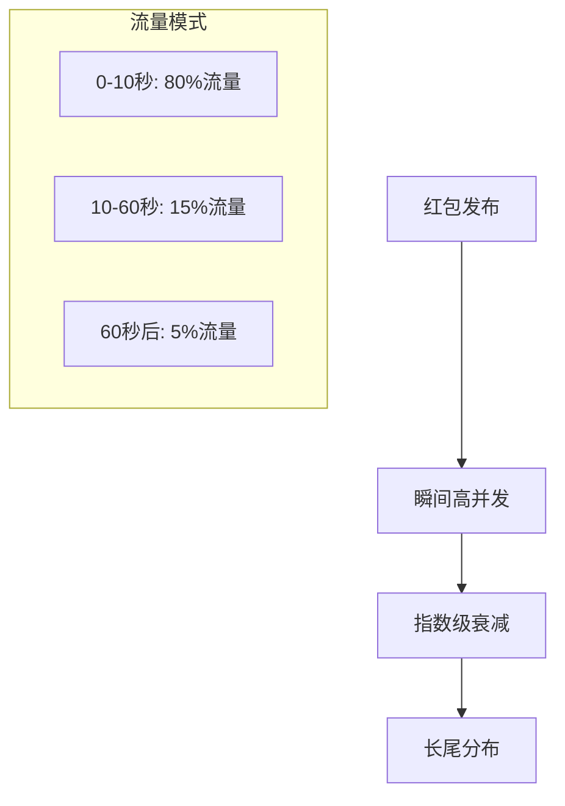
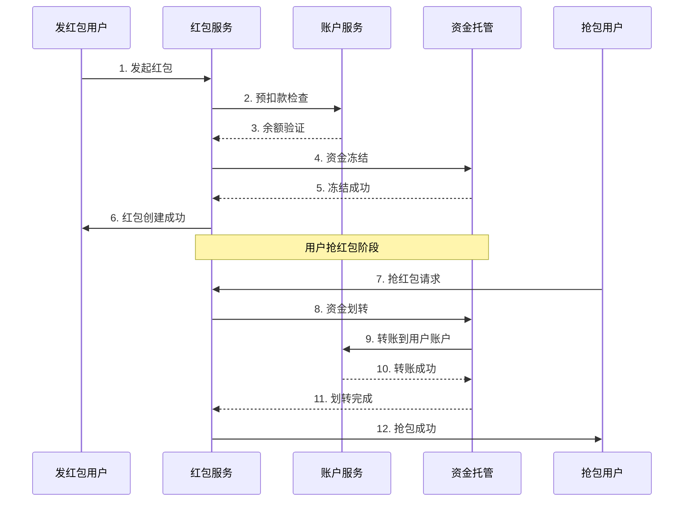
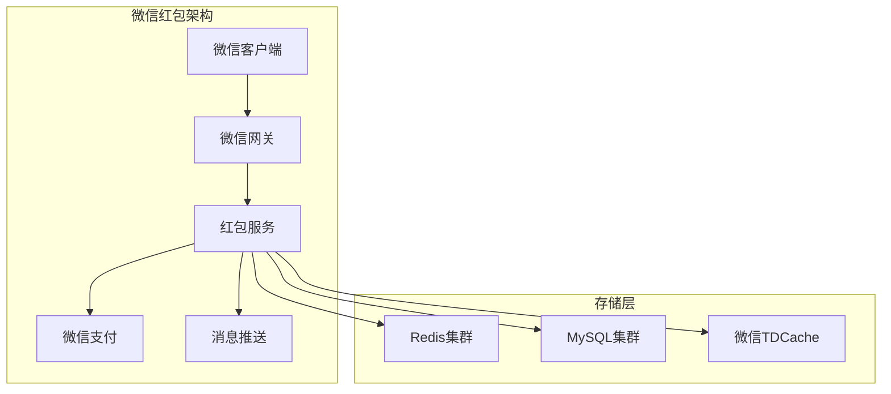

---
title: 抢红包系统设计详解
date: 2025-09-24
permalink: /design/grab-red-packet-system-design.html
categories:
  - Technology
  - Learning
---

## 业务分析与需求

### 业务场景

抢红包系统是移动支付和社交应用的核心功能，主要应用场景包括：

#### 微信红包场景
```
┌─ 个人红包 ─────────────────────────────────────┐
│ • 生日祝福红包：固定金额或随机金额            │
│ • 节日红包：春节、中秋等传统节日              │
│ • 感谢红包：表达感谢的小额红包                │
└─────────────────────────────────────────────────┘

┌─ 群红包 ───────────────────────────────────────┐
│ • 拼手气红包：总金额随机分配给多人            │
│ • 普通红包：平均分配给所有人                  │
│ • 企业红包：公司年会、团建活动                │
└─────────────────────────────────────────────────┘

┌─ 营销红包 ─────────────────────────────────────┐
│ • 商家促销：电商平台促销活动                  │
│ • 品牌推广：新品发布、品牌宣传                │
│ • 用户拉新：邀请新用户注册奖励                │
└─────────────────────────────────────────────────┘
```

#### 支付宝红包场景
- **集五福活动**：春节期间的全民活动
- **蚂蚁森林**：环保公益红包
- **商家红包**：线下扫码支付红包

### 核心业务需求

| 功能类别 | 具体需求 | 技术挑战 |
|----------|----------|----------|
| **红包创建** | 支持多种红包类型 | 参数验证、金额校验 |
| **红包拆分** | 公平随机分配算法 | 算法合理性、性能优化 |
| **抢红包** | 高并发抢夺处理 | 并发控制、超抢防护 |
| **资金流转** | 安全可靠的资金操作 | 事务一致性、防重复扣款 |
| **实时通知** | 抢红包结果推送 | 消息可靠性、实时性 |

### 业务特征分析

#### 流量特征


#### 用户行为特征
- **时间敏感性**：用户会在第一时间抢红包
- **社交传播性**：红包会在社交圈快速传播
- **心理预期**：用户期望公平的随机分配
- **重复参与**：同一用户可能多次参与不同红包

### 技术挑战

#### 高并发挑战
```
┌─ 瞬时并发 ─────────────────────────────────────┐
│ • 单个红包可能在秒级时间内被数万人抢夺          │
│ • 需要处理每秒数十万的请求量                  │
│ • 服务器资源瞬间达到峰值                      │
└─────────────────────────────────────────────────┘

┌─ 数据一致性 ───────────────────────────────────┐
│ • 确保红包总金额精确分配                      │
│ • 防止超抢（抢到的红包数量超过实际数量）      │
│ • 保证每个用户最多只能抢一次                  │
└─────────────────────────────────────────────────┘

┌─ 资金安全 ─────────────────────────────────────┐
│ • 防止重复扣款和多次到账                      │
│ • 确保资金流转的原子性                        │
│ • 异常情况下的资金回滚机制                    │
└─────────────────────────────────────────────────┘
```

## 红包拆分算法设计

### 拆分算法类型

#### 随机拆分算法（推荐）
基于"二倍均值"的随机算法，保证每个红包金额在合理范围内：

```java
@Component
public class RandomRedPacketAlgorithm implements RedPacketSplitAlgorithm {

    private static final BigDecimal MIN_AMOUNT = new BigDecimal("0.01");
    private static final Random random = new Random();

    @Override
    public List<BigDecimal> split(BigDecimal totalAmount, int count) {
        if (count <= 0 || totalAmount.compareTo(MIN_AMOUNT.multiply(BigDecimal.valueOf(count))) < 0) {
            throw new IllegalArgumentException("参数不合法");
        }

        List<BigDecimal> result = new ArrayList<>();
        BigDecimal remainAmount = totalAmount;
        int remainCount = count;

        for (int i = 0; i < count - 1; i++) {
            // 计算当前红包的最大金额（剩余金额的2倍均值）
            BigDecimal maxAmount = remainAmount
                .divide(BigDecimal.valueOf(remainCount), 2, RoundingMode.DOWN)
                .multiply(BigDecimal.valueOf(2));

            // 生成随机金额（0.01 到 maxAmount 之间）
            BigDecimal randomAmount = generateRandomAmount(MIN_AMOUNT, maxAmount);

            result.add(randomAmount);
            remainAmount = remainAmount.subtract(randomAmount);
            remainCount--;
        }

        // 最后一个红包获得剩余金额
        result.add(remainAmount);

        // 打乱顺序，确保随机性
        Collections.shuffle(result);

        return result;
    }

    private BigDecimal generateRandomAmount(BigDecimal min, BigDecimal max) {
        // 将金额转换为分进行计算，避免浮点数精度问题
        long minCent = min.multiply(BigDecimal.valueOf(100)).longValue();
        long maxCent = max.multiply(BigDecimal.valueOf(100)).longValue();

        if (minCent >= maxCent) {
            return min;
        }

        long randomCent = minCent + (long) (random.nextDouble() * (maxCent - minCent));
        return BigDecimal.valueOf(randomCent).divide(BigDecimal.valueOf(100), 2, RoundingMode.DOWN);
    }
}
```

#### 线段切割算法
另一种经典的拆分算法，通过在线段上随机切割实现：

```java
@Component
public class LineSegmentSplitAlgorithm implements RedPacketSplitAlgorithm {

    @Override
    public List<BigDecimal> split(BigDecimal totalAmount, int count) {
        if (count <= 0) {
            throw new IllegalArgumentException("红包数量必须大于0");
        }

        if (count == 1) {
            return Collections.singletonList(totalAmount);
        }

        // 转换为分进行计算
        long totalCent = totalAmount.multiply(BigDecimal.valueOf(100)).longValue();

        // 生成 count-1 个切割点
        Set<Long> cutPoints = new TreeSet<>();
        cutPoints.add(0L);
        cutPoints.add(totalCent);

        Random random = new Random();
        while (cutPoints.size() < count + 1) {
            cutPoints.add((long) (random.nextDouble() * totalCent));
        }

        // 计算每段的长度
        List<BigDecimal> result = new ArrayList<>();
        Long[] points = cutPoints.toArray(new Long[0]);

        for (int i = 1; i < points.length; i++) {
            long amount = points[i] - points[i - 1];
            // 确保最小金额为0.01元
            if (amount < 1) {
                amount = 1;
            }
            result.add(BigDecimal.valueOf(amount).divide(BigDecimal.valueOf(100), 2, RoundingMode.DOWN));
        }

        // 处理舍入误差
        adjustTotalAmount(result, totalAmount);

        Collections.shuffle(result);
        return result;
    }

    private void adjustTotalAmount(List<BigDecimal> amounts, BigDecimal targetTotal) {
        BigDecimal actualTotal = amounts.stream().reduce(BigDecimal.ZERO, BigDecimal::add);
        BigDecimal diff = targetTotal.subtract(actualTotal);

        if (diff.compareTo(BigDecimal.ZERO) != 0) {
            // 将差额加到最后一个红包上
            int lastIndex = amounts.size() - 1;
            amounts.set(lastIndex, amounts.get(lastIndex).add(diff));
        }
    }
}
```

### 算法性能优化

#### 预拆分策略
对于大额红包，可以采用预拆分策略，提前计算好分配方案：

```java
@Service
public class RedPacketPreSplitService {

    @Autowired
    private RedisTemplate<String, Object> redisTemplate;

    @Autowired
    private RedPacketSplitAlgorithm splitAlgorithm;

    /**
     * 预拆分红包
     */
    public String preSplitRedPacket(RedPacketCreateRequest request) {
        String redPacketId = generateRedPacketId();

        // 拆分红包
        List<BigDecimal> amounts = splitAlgorithm.split(
            request.getTotalAmount(),
            request.getCount()
        );

        // 存储到Redis队列中
        String queueKey = "redpacket:queue:" + redPacketId;
        for (BigDecimal amount : amounts) {
            redisTemplate.opsForList().leftPush(queueKey, amount.toString());
        }

        // 设置过期时间（24小时）
        redisTemplate.expire(queueKey, Duration.ofHours(24));

        // 存储红包基本信息
        RedPacketInfo redPacketInfo = RedPacketInfo.builder()
            .id(redPacketId)
            .senderId(request.getSenderId())
            .totalAmount(request.getTotalAmount())
            .totalCount(request.getCount())
            .remainCount(request.getCount())
            .createTime(System.currentTimeMillis())
            .expireTime(System.currentTimeMillis() + Duration.ofHours(24).toMillis())
            .build();

        redisTemplate.opsForHash().putAll(
            "redpacket:info:" + redPacketId,
            BeanUtils.beanToMap(redPacketInfo)
        );

        return redPacketId;
    }

    private String generateRedPacketId() {
        return "RP" + System.currentTimeMillis() +
               String.format("%04d", new Random().nextInt(10000));
    }
}
```

### 算法公平性验证

#### 分布统计验证
```java
@Component
public class RedPacketAlgorithmValidator {

    public ValidationResult validateAlgorithm(RedPacketSplitAlgorithm algorithm,
                                            BigDecimal totalAmount, int count, int testTimes) {
        List<BigDecimal> allAmounts = new ArrayList<>();

        // 执行多次测试
        for (int i = 0; i < testTimes; i++) {
            List<BigDecimal> amounts = algorithm.split(totalAmount, count);
            allAmounts.addAll(amounts);

            // 验证总金额是否正确
            BigDecimal sum = amounts.stream().reduce(BigDecimal.ZERO, BigDecimal::add);
            if (sum.compareTo(totalAmount) != 0) {
                return ValidationResult.fail("总金额不匹配: " + sum + " vs " + totalAmount);
            }
        }

        // 统计分析
        DoubleSummaryStatistics stats = allAmounts.stream()
            .mapToDouble(BigDecimal::doubleValue)
            .summaryStatistics();

        double mean = stats.getAverage();
        double expectedMean = totalAmount.divide(BigDecimal.valueOf(count), 4, RoundingMode.HALF_UP).doubleValue();

        // 计算方差
        double variance = allAmounts.stream()
            .mapToDouble(amount -> Math.pow(amount.doubleValue() - mean, 2))
            .average()
            .orElse(0.0);

        return ValidationResult.builder()
            .success(true)
            .mean(mean)
            .expectedMean(expectedMean)
            .variance(variance)
            .min(stats.getMin())
            .max(stats.getMax())
            .build();
    }
}
```

---

## 并发安全问题解决

### 并发问题分析

#### 超抢问题
```
场景描述：
100个人同时抢10个红包，如果没有并发控制，
可能会出现超过10个人抢到红包的情况。

根本原因：
1. 检查红包数量和扣减红包数量不是原子操作
2. 多个线程同时读到了相同的红包剩余数量
3. 缓存和数据库的数据不一致
```

#### 重复抢包问题
```
场景描述：
同一个用户在网络延迟的情况下多次点击，
可能导致重复抢到红包。

根本原因：
1. 客户端重复提交请求
2. 服务端没有幂等性保证
3. 用户状态检查不够严格
```

### Redis原子操作解决方案

#### Lua脚本实现原子抢包
```lua
-- 抢红包原子操作脚本
-- KEYS[1]: 红包队列key (redpacket:queue:xxx)
-- KEYS[2]: 红包信息key (redpacket:info:xxx)
-- KEYS[3]: 用户抢包记录key (redpacket:users:xxx)
-- ARGV[1]: 用户ID
-- ARGV[2]: 当前时间戳

local queueKey = KEYS[1]
local infoKey = KEYS[2]
local userKey = KEYS[3]
local userId = ARGV[1]
local currentTime = tonumber(ARGV[2])

-- 1. 检查红包是否存在
if redis.call('EXISTS', infoKey) == 0 then
    return {0, '红包不存在或已过期'}
end

-- 2. 检查红包是否已过期
local expireTime = tonumber(redis.call('HGET', infoKey, 'expireTime'))
if currentTime > expireTime then
    return {0, '红包已过期'}
end

-- 3. 检查用户是否已经抢过
if redis.call('SISMEMBER', userKey, userId) == 1 then
    return {0, '您已经抢过这个红包了'}
end

-- 4. 尝试从队列中获取红包
local amount = redis.call('RPOP', queueKey)
if not amount then
    return {0, '红包已抢完'}
end

-- 5. 记录用户抢包
redis.call('SADD', userKey, userId)

-- 6. 更新红包剩余数量
local remainCount = redis.call('HINCRBY', infoKey, 'remainCount', -1)

-- 7. 如果红包已抢完，设置状态
if remainCount <= 0 then
    redis.call('HSET', infoKey, 'status', 'FINISHED')
    redis.call('HSET', infoKey, 'finishTime', currentTime)
end

-- 8. 返回抢到的金额
return {1, amount, remainCount}
```

#### Java服务端实现
```java
@Service
public class RedPacketGrabService {

    @Autowired
    private RedisTemplate<String, Object> redisTemplate;

    @Autowired
    private DefaultRedisScript<List> grabScript;

    @Autowired
    private RedPacketRecordService recordService;

    @Autowired
    private MessageProducer messageProducer;

    public GrabResult grabRedPacket(String redPacketId, Long userId) {
        // 参数验证
        if (StringUtils.isEmpty(redPacketId) || userId == null) {
            return GrabResult.fail("参数错误");
        }

        // 防重复提交检查
        String lockKey = "grab:lock:" + redPacketId + ":" + userId;
        Boolean lockAcquired = redisTemplate.opsForValue()
            .setIfAbsent(lockKey, "1", Duration.ofSeconds(10));

        if (!lockAcquired) {
            return GrabResult.fail("请求过于频繁，请稍后重试");
        }

        try {
            // 执行抢红包Lua脚本
            List<Object> result = redisTemplate.execute(
                grabScript,
                Arrays.asList(
                    "redpacket:queue:" + redPacketId,
                    "redpacket:info:" + redPacketId,
                    "redpacket:users:" + redPacketId
                ),
                userId.toString(),
                String.valueOf(System.currentTimeMillis())
            );

            Integer code = (Integer) result.get(0);
            String message = (String) result.get(1);

            if (code == 1) {
                // 抢包成功
                BigDecimal amount = new BigDecimal(message);
                Integer remainCount = (Integer) result.get(2);

                // 异步处理后续逻辑
                processGrabSuccess(redPacketId, userId, amount, remainCount);

                return GrabResult.success(amount, remainCount);
            } else {
                // 抢包失败
                return GrabResult.fail(message);
            }

        } finally {
            // 释放锁
            redisTemplate.delete(lockKey);
        }
    }

    @Async("redpacketExecutor")
    private void processGrabSuccess(String redPacketId, Long userId,
                                  BigDecimal amount, Integer remainCount) {
        try {
            // 1. 记录抢包记录
            RedPacketRecord record = RedPacketRecord.builder()
                .redPacketId(redPacketId)
                .userId(userId)
                .amount(amount)
                .grabTime(new Date())
                .build();
            recordService.save(record);

            // 2. 资金转账
            transferMoney(redPacketId, userId, amount);

            // 3. 发送通知消息
            sendGrabNotification(redPacketId, userId, amount, remainCount);

        } catch (Exception e) {
            log.error("处理抢包成功逻辑失败", e);
            // 发送到死信队列或重试
        }
    }
}
```

### 分布式锁方案

#### Redisson分布式锁
```java
@Component
public class RedPacketDistributedLock {

    @Autowired
    private RedissonClient redissonClient;

    public <T> T executeWithLock(String redPacketId, Long userId,
                                Supplier<T> supplier, Duration timeout) {
        String lockKey = "redpacket:lock:" + redPacketId + ":" + userId;
        RLock lock = redissonClient.getLock(lockKey);

        try {
            // 尝试获取锁，最多等待1秒，锁最多持有10秒
            boolean acquired = lock.tryLock(1, 10, TimeUnit.SECONDS);
            if (!acquired) {
                throw new RedPacketException("获取锁失败，请稍后重试");
            }

            return supplier.get();

        } catch (InterruptedException e) {
            Thread.currentThread().interrupt();
            throw new RedPacketException("锁等待被中断");
        } finally {
            if (lock.isHeldByCurrentThread()) {
                lock.unlock();
            }
        }
    }
}
```

### 数据库层面保证

#### 乐观锁版本控制
```sql
-- 红包信息表
CREATE TABLE t_redpacket_info (
    id VARCHAR(32) PRIMARY KEY,
    sender_id BIGINT NOT NULL,
    total_amount DECIMAL(10,2) NOT NULL,
    total_count INT NOT NULL,
    remain_count INT NOT NULL,
    status VARCHAR(20) DEFAULT 'ACTIVE',
    version INT DEFAULT 1,
    create_time TIMESTAMP DEFAULT CURRENT_TIMESTAMP,
    expire_time TIMESTAMP NOT NULL,
    INDEX idx_sender_id (sender_id),
    INDEX idx_status (status)
);

-- 抢包记录表
CREATE TABLE t_redpacket_record (
    id BIGINT AUTO_INCREMENT PRIMARY KEY,
    redpacket_id VARCHAR(32) NOT NULL,
    user_id BIGINT NOT NULL,
    amount DECIMAL(10,2) NOT NULL,
    grab_time TIMESTAMP DEFAULT CURRENT_TIMESTAMP,
    UNIQUE KEY uk_redpacket_user (redpacket_id, user_id),
    INDEX idx_user_id (user_id),
    INDEX idx_grab_time (grab_time)
);
```

#### 数据库乐观锁更新
```java
@Repository
public class RedPacketInfoMapper {

    @Update("UPDATE t_redpacket_info SET remain_count = remain_count - 1, " +
            "version = version + 1 WHERE id = #{id} AND remain_count > 0 " +
            "AND version = #{version}")
    int decreaseRemainCount(@Param("id") String id, @Param("version") Integer version);

    @Select("SELECT * FROM t_redpacket_info WHERE id = #{id}")
    RedPacketInfo selectById(@Param("id") String id);
}

@Service
public class RedPacketDatabaseService {

    @Autowired
    private RedPacketInfoMapper redPacketInfoMapper;

    @Transactional
    public boolean grabRedPacketWithOptimisticLock(String redPacketId, Long userId) {
        int maxRetries = 3;

        for (int i = 0; i < maxRetries; i++) {
            // 查询当前版本
            RedPacketInfo redPacketInfo = redPacketInfoMapper.selectById(redPacketId);
            if (redPacketInfo == null || redPacketInfo.getRemainCount() <= 0) {
                return false;
            }

            // 尝试更新
            int updateCount = redPacketInfoMapper.decreaseRemainCount(
                redPacketId, redPacketInfo.getVersion());

            if (updateCount > 0) {
                // 更新成功，记录抢包记录
                recordGrabResult(redPacketId, userId);
                return true;
            }

            // 更新失败，短暂等待后重试
            try {
                Thread.sleep(10 + i * 10);
            } catch (InterruptedException e) {
                Thread.currentThread().interrupt();
                break;
            }
        }

        return false;
    }
}
```

## 资金安全保障机制

### 资金安全挑战

#### 核心风险点
```
┌─ 重复扣款风险 ─────────────────────────────────┐
│ • 网络重试导致的重复扣款                      │
│ • 系统异常时的重复处理                        │
│ • 幂等性缺失造成的资金损失                    │
└─────────────────────────────────────────────────┘

┌─ 资金不一致风险 ───────────────────────────────┐
│ • 发红包扣款成功但红包创建失败                │
│ • 抢红包成功但转账失败                        │
│ • 系统异常导致的数据不一致                    │
└─────────────────────────────────────────────────┘

┌─ 恶意攻击风险 ─────────────────────────────────┐
│ • 恶意用户重复抢包                            │
│ • 伪造请求绕过业务限制                        │
│ • 利用系统漏洞非法获取资金                    │
└─────────────────────────────────────────────────┘
```

### 资金流转设计

#### 资金流转流程


#### 资金托管服务
```java
@Service
public class RedPacketEscrowService {

    @Autowired
    private AccountService accountService;

    @Autowired
    private EscrowAccountMapper escrowAccountMapper;

    @Autowired
    private TransactionLogService transactionLogService;

    /**
     * 冻结红包资金
     */
    @Transactional
    public EscrowResult freezeRedPacketFund(String redPacketId, Long senderId,
                                          BigDecimal totalAmount) {
        // 1. 幂等性检查
        if (isAlreadyFrozen(redPacketId)) {
            return EscrowResult.success("资金已冻结");
        }

        // 2. 账户余额检查
        AccountInfo senderAccount = accountService.getAccountInfo(senderId);
        if (senderAccount.getAvailableBalance().compareTo(totalAmount) < 0) {
            return EscrowResult.fail("账户余额不足");
        }

        // 3. 生成唯一交易流水号
        String transactionId = generateTransactionId(redPacketId, "FREEZE");

        try {
            // 4. 扣减用户可用余额
            boolean deductResult = accountService.deductAvailableBalance(
                senderId, totalAmount, transactionId);

            if (!deductResult) {
                return EscrowResult.fail("扣款失败");
            }

            // 5. 创建托管账户记录
            EscrowAccount escrowAccount = EscrowAccount.builder()
                .redPacketId(redPacketId)
                .senderId(senderId)
                .totalAmount(totalAmount)
                .frozenAmount(totalAmount)
                .remainAmount(totalAmount)
                .status(EscrowStatus.FROZEN)
                .transactionId(transactionId)
                .createTime(new Date())
                .build();

            escrowAccountMapper.insert(escrowAccount);

            // 6. 记录交易日志
            transactionLogService.recordFreeze(transactionId, senderId,
                totalAmount, redPacketId);

            return EscrowResult.success("资金冻结成功");

        } catch (Exception e) {
            log.error("冻结红包资金失败", e);
            // 异常情况下回滚操作
            compensateFreezeFailed(senderId, totalAmount, transactionId);
            return EscrowResult.fail("系统异常，请稍后重试");
        }
    }

    /**
     * 红包资金划转
     */
    @Transactional
    public TransferResult transferRedPacketFund(String redPacketId, Long receiverId,
                                              BigDecimal amount) {
        // 1. 幂等性检查
        String transferKey = redPacketId + ":" + receiverId;
        if (isAlreadyTransferred(transferKey)) {
            return TransferResult.success("资金已转账");
        }

        // 2. 查询托管账户
        EscrowAccount escrowAccount = escrowAccountMapper.selectByRedPacketId(redPacketId);
        if (escrowAccount == null || escrowAccount.getRemainAmount().compareTo(amount) < 0) {
            return TransferResult.fail("托管资金不足");
        }

        // 3. 生成转账交易号
        String transferId = generateTransactionId(redPacketId, "TRANSFER");

        try {
            // 4. 更新托管账户（减少剩余金额）
            int updateCount = escrowAccountMapper.updateRemainAmount(
                redPacketId, amount, escrowAccount.getVersion());

            if (updateCount == 0) {
                return TransferResult.fail("托管账户更新失败");
            }

            // 5. 转账到接收者账户
            boolean transferResult = accountService.increaseAvailableBalance(
                receiverId, amount, transferId);

            if (!transferResult) {
                throw new TransferException("转账失败");
            }

            // 6. 记录转账日志
            transactionLogService.recordTransfer(transferId, receiverId,
                amount, redPacketId);

            // 7. 记录幂等性标记
            markTransferCompleted(transferKey, transferId);

            return TransferResult.success("转账成功");

        } catch (Exception e) {
            log.error("红包资金划转失败", e);
            // 触发补偿机制
            compensateTransferFailed(redPacketId, receiverId, amount);
            return TransferResult.fail("转账异常，请联系客服");
        }
    }

    /**
     * 红包过期退款
     */
    @Transactional
    public RefundResult refundExpiredRedPacket(String redPacketId) {
        EscrowAccount escrowAccount = escrowAccountMapper.selectByRedPacketId(redPacketId);
        if (escrowAccount == null || escrowAccount.getRemainAmount().compareTo(BigDecimal.ZERO) <= 0) {
            return RefundResult.success("无需退款");
        }

        String refundId = generateTransactionId(redPacketId, "REFUND");

        try {
            // 1. 退还剩余资金到发送者账户
            boolean refundResult = accountService.increaseAvailableBalance(
                escrowAccount.getSenderId(), escrowAccount.getRemainAmount(), refundId);

            if (!refundResult) {
                return RefundResult.fail("退款失败");
            }

            // 2. 更新托管账户状态
            escrowAccountMapper.updateStatus(redPacketId, EscrowStatus.REFUNDED);

            // 3. 记录退款日志
            transactionLogService.recordRefund(refundId, escrowAccount.getSenderId(),
                escrowAccount.getRemainAmount(), redPacketId);

            return RefundResult.success("退款成功");

        } catch (Exception e) {
            log.error("红包退款失败", e);
            return RefundResult.fail("退款异常");
        }
    }

    private String generateTransactionId(String redPacketId, String operation) {
        return operation + "_" + redPacketId + "_" + System.currentTimeMillis() +
               "_" + String.format("%04d", new Random().nextInt(10000));
    }
}
```

### 幂等性保证

#### 基于Redis的幂等性控制
```java
@Component
public class IdempotentService {

    @Autowired
    private RedisTemplate<String, Object> redisTemplate;

    private static final String IDEMPOTENT_PREFIX = "idempotent:";
    private static final Duration DEFAULT_EXPIRE = Duration.ofMinutes(30);

    /**
     * 检查操作是否已执行
     */
    public boolean isOperationCompleted(String operationKey) {
        return redisTemplate.hasKey(IDEMPOTENT_PREFIX + operationKey);
    }

    /**
     * 标记操作已完成
     */
    public void markOperationCompleted(String operationKey, Object result) {
        redisTemplate.opsForValue().set(
            IDEMPOTENT_PREFIX + operationKey,
            result,
            DEFAULT_EXPIRE
        );
    }

    /**
     * 获取已完成操作的结果
     */
    public <T> T getOperationResult(String operationKey, Class<T> resultType) {
        Object result = redisTemplate.opsForValue().get(IDEMPOTENT_PREFIX + operationKey);
        return result != null ? resultType.cast(result) : null;
    }

    /**
     * 幂等性执行器
     */
    public <T> T executeIdempotent(String operationKey, Supplier<T> operation, Class<T> resultType) {
        // 检查是否已执行
        if (isOperationCompleted(operationKey)) {
            return getOperationResult(operationKey, resultType);
        }

        // 分布式锁防止并发执行
        String lockKey = "lock:" + operationKey;
        Boolean lockAcquired = redisTemplate.opsForValue()
            .setIfAbsent(lockKey, "1", Duration.ofSeconds(30));

        if (!lockAcquired) {
            // 获取锁失败，等待一段时间后重新检查
            try {
                Thread.sleep(100);
                if (isOperationCompleted(operationKey)) {
                    return getOperationResult(operationKey, resultType);
                }
            } catch (InterruptedException e) {
                Thread.currentThread().interrupt();
            }
            throw new IdempotentException("操作正在执行中，请稍后重试");
        }

        try {
            // 双重检查
            if (isOperationCompleted(operationKey)) {
                return getOperationResult(operationKey, resultType);
            }

            // 执行操作
            T result = operation.get();

            // 标记操作完成
            markOperationCompleted(operationKey, result);

            return result;

        } finally {
            redisTemplate.delete(lockKey);
        }
    }
}
```

### 账户安全控制

#### 账户服务安全设计
```java
@Service
public class SecureAccountService {

    @Autowired
    private AccountMapper accountMapper;

    @Autowired
    private AccountLogMapper accountLogMapper;

    @Autowired
    private IdempotentService idempotentService;

    /**
     * 安全扣款操作
     */
    @Transactional
    public boolean secureDeductBalance(Long userId, BigDecimal amount,
                                     String transactionId, String businessType) {
        // 幂等性检查
        String idempotentKey = "deduct:" + transactionId;
        return idempotentService.executeIdempotent(idempotentKey, () -> {
            return doDeductBalance(userId, amount, transactionId, businessType);
        }, Boolean.class);
    }

    private boolean doDeductBalance(Long userId, BigDecimal amount,
                                  String transactionId, String businessType) {
        // 1. 参数验证
        if (amount.compareTo(BigDecimal.ZERO) <= 0) {
            throw new IllegalArgumentException("扣款金额必须大于0");
        }

        // 2. 查询账户信息（加锁）
        AccountInfo account = accountMapper.selectByUserIdForUpdate(userId);
        if (account == null) {
            throw new AccountException("账户不存在");
        }

        // 3. 余额检查
        if (account.getAvailableBalance().compareTo(amount) < 0) {
            return false;
        }

        // 4. 风控检查
        if (!passRiskControl(userId, amount, businessType)) {
            throw new RiskControlException("风控检查不通过");
        }

        // 5. 执行扣款
        int updateCount = accountMapper.deductBalance(userId, amount, account.getVersion());
        if (updateCount == 0) {
            throw new AccountException("账户余额更新失败");
        }

        // 6. 记录账户流水
        AccountLog accountLog = AccountLog.builder()
            .userId(userId)
            .transactionId(transactionId)
            .businessType(businessType)
            .amount(amount.negate()) // 负数表示支出
            .balanceBefore(account.getAvailableBalance())
            .balanceAfter(account.getAvailableBalance().subtract(amount))
            .createTime(new Date())
            .build();

        accountLogMapper.insert(accountLog);

        return true;
    }

    /**
     * 安全转账操作
     */
    @Transactional
    public boolean secureTransfer(Long fromUserId, Long toUserId, BigDecimal amount,
                                String transactionId, String businessType) {
        String idempotentKey = "transfer:" + transactionId;
        return idempotentService.executeIdempotent(idempotentKey, () -> {
            return doTransfer(fromUserId, toUserId, amount, transactionId, businessType);
        }, Boolean.class);
    }

    private boolean doTransfer(Long fromUserId, Long toUserId, BigDecimal amount,
                             String transactionId, String businessType) {
        // 1. 扣减发送方余额
        boolean deductResult = doDeductBalance(fromUserId, amount,
            transactionId + "_FROM", businessType);
        if (!deductResult) {
            return false;
        }

        try {
            // 2. 增加接收方余额
            boolean addResult = doAddBalance(toUserId, amount,
                transactionId + "_TO", businessType);
            if (!addResult) {
                throw new TransferException("转账失败");
            }

            return true;

        } catch (Exception e) {
            // 转账失败，回滚发送方扣款
            compensateFailedTransfer(fromUserId, amount, transactionId);
            throw e;
        }
    }

    private boolean passRiskControl(Long userId, BigDecimal amount, String businessType) {
        // 实现风控逻辑
        // 1. 单笔金额限制
        // 2. 日累计金额限制
        // 3. 频率限制
        // 4. 异常行为检测
        return true; // 简化实现
    }
}
```

---

## 事务一致性保证

### 分布式事务挑战

#### 典型场景分析
```
┌─ 发红包场景 ───────────────────────────────────┐
│ 1. 用户账户扣款（账户服务）                    │
│ 2. 创建红包记录（红包服务）                    │
│ 3. 拆分红包金额（红包服务）                    │
│ 4. 发送通知消息（通知服务）                    │
│                                               │
│ 问题：任何一步失败都可能导致数据不一致         │
└─────────────────────────────────────────────────┘

┌─ 抢红包场景 ───────────────────────────────────┐
│ 1. 扣减红包剩余数量（红包服务）                │
│ 2. 记录抢包记录（红包服务）                    │
│ 3. 资金转账到用户（账户服务）                  │
│ 4. 发送抢包通知（通知服务）                    │
│                                               │
│ 问题：用户抢到红包但转账失败的情况处理         │
└─────────────────────────────────────────────────┘
```

### SAGA分布式事务模式

#### SAGA事务编排器
```java
@Component
public class RedPacketSagaOrchestrator {

    @Autowired
    private AccountService accountService;

    @Autowired
    private RedPacketService redPacketService;

    @Autowired
    private NotificationService notificationService;

    @Autowired
    private SagaTransactionManager sagaTransactionManager;

    /**
     * 发红包SAGA事务
     */
    public SagaResult executeCreateRedPacketSaga(CreateRedPacketRequest request) {
        String sagaId = generateSagaId();

        SagaDefinition sagaDefinition = SagaDefinition.builder()
            .sagaId(sagaId)
            .sagaType("CREATE_REDPACKET")
            .addStep(SagaStep.builder()
                .stepId("DEDUCT_BALANCE")
                .service("accountService")
                .action("deductBalance")
                .compensateAction("addBalance")
                .parameters(Map.of(
                    "userId", request.getSenderId(),
                    "amount", request.getTotalAmount(),
                    "transactionId", sagaId
                ))
                .build())
            .addStep(SagaStep.builder()
                .stepId("CREATE_REDPACKET")
                .service("redPacketService")
                .action("createRedPacket")
                .compensateAction("deleteRedPacket")
                .parameters(Map.of(
                    "request", request,
                    "sagaId", sagaId
                ))
                .build())
            .addStep(SagaStep.builder()
                .stepId("SEND_NOTIFICATION")
                .service("notificationService")
                .action("sendCreateNotification")
                .compensateAction("sendCancelNotification")
                .parameters(Map.of(
                    "userId", request.getSenderId(),
                    "redPacketId", "#{CREATE_REDPACKET.redPacketId}"
                ))
                .build())
            .build();

        return sagaTransactionManager.execute(sagaDefinition);
    }

    /**
     * 抢红包SAGA事务
     */
    public SagaResult executeGrabRedPacketSaga(GrabRedPacketRequest request) {
        String sagaId = generateSagaId();

        SagaDefinition sagaDefinition = SagaDefinition.builder()
            .sagaId(sagaId)
            .sagaType("GRAB_REDPACKET")
            .addStep(SagaStep.builder()
                .stepId("GRAB_REDPACKET")
                .service("redPacketService")
                .action("grabRedPacket")
                .compensateAction("cancelGrabRedPacket")
                .parameters(Map.of(
                    "redPacketId", request.getRedPacketId(),
                    "userId", request.getUserId(),
                    "sagaId", sagaId
                ))
                .build())
            .addStep(SagaStep.builder()
                .stepId("TRANSFER_MONEY")
                .service("accountService")
                .action("transferMoney")
                .compensateAction("reverseTransfer")
                .parameters(Map.of(
                    "toUserId", request.getUserId(),
                    "amount", "#{GRAB_REDPACKET.amount}",
                    "transactionId", sagaId
                ))
                .build())
            .addStep(SagaStep.builder()
                .stepId("SEND_GRAB_NOTIFICATION")
                .service("notificationService")
                .action("sendGrabNotification")
                .compensateAction("sendGrabFailNotification")
                .parameters(Map.of(
                    "userId", request.getUserId(),
                    "redPacketId", request.getRedPacketId(),
                    "amount", "#{GRAB_REDPACKET.amount}"
                ))
                .build())
            .build();

        return sagaTransactionManager.execute(sagaDefinition);
    }

    private String generateSagaId() {
        return "SAGA_" + System.currentTimeMillis() +
               "_" + String.format("%04d", new Random().nextInt(10000));
    }
}
```

#### SAGA事务管理器
```java
@Component
public class SagaTransactionManager {

    @Autowired
    private SagaLogRepository sagaLogRepository;

    @Autowired
    private ApplicationContext applicationContext;

    @Autowired
    private MessageProducer messageProducer;

    public SagaResult execute(SagaDefinition sagaDefinition) {
        SagaLog sagaLog = createSagaLog(sagaDefinition);

        try {
            // 执行所有步骤
            for (SagaStep step : sagaDefinition.getSteps()) {
                SagaStepResult stepResult = executeStep(step, sagaLog);

                if (!stepResult.isSuccess()) {
                    // 步骤失败，执行补偿
                    compensateExecutedSteps(sagaLog);
                    return SagaResult.fail("步骤 " + step.getStepId() + " 执行失败: " + stepResult.getErrorMessage());
                }

                // 记录步骤执行结果
                updateStepStatus(sagaLog, step.getStepId(), SagaStepStatus.COMPLETED, stepResult.getResult());
            }

            // 所有步骤执行成功
            updateSagaStatus(sagaLog, SagaStatus.COMPLETED);
            return SagaResult.success(sagaLog.getSagaId());

        } catch (Exception e) {
            log.error("SAGA事务执行异常: {}", sagaDefinition.getSagaId(), e);
            // 执行补偿
            compensateExecutedSteps(sagaLog);
            return SagaResult.fail("SAGA事务执行异常: " + e.getMessage());
        }
    }

    private SagaStepResult executeStep(SagaStep step, SagaLog sagaLog) {
        try {
            // 更新步骤状态为执行中
            updateStepStatus(sagaLog, step.getStepId(), SagaStepStatus.EXECUTING, null);

            // 获取服务Bean
            Object service = applicationContext.getBean(step.getService());

            // 解析参数（支持表达式）
            Map<String, Object> resolvedParams = resolveParameters(step.getParameters(), sagaLog);

            // 反射调用方法
            Method method = findMethod(service.getClass(), step.getAction());
            Object result = method.invoke(service, resolvedParams.values().toArray());

            return SagaStepResult.success(result);

        } catch (Exception e) {
            log.error("SAGA步骤执行失败: {} - {}", step.getStepId(), step.getAction(), e);
            updateStepStatus(sagaLog, step.getStepId(), SagaStepStatus.FAILED, e.getMessage());
            return SagaStepResult.fail(e.getMessage());
        }
    }

    private void compensateExecutedSteps(SagaLog sagaLog) {
        List<SagaStepLog> completedSteps = sagaLog.getStepLogs().stream()
            .filter(step -> step.getStatus() == SagaStepStatus.COMPLETED)
            .sorted((a, b) -> b.getExecuteOrder().compareTo(a.getExecuteOrder())) // 逆序执行补偿
            .collect(Collectors.toList());

        for (SagaStepLog stepLog : completedSteps) {
            try {
                compensateStep(stepLog);
                updateStepStatus(sagaLog, stepLog.getStepId(), SagaStepStatus.COMPENSATED, null);
            } catch (Exception e) {
                log.error("SAGA步骤补偿失败: {}", stepLog.getStepId(), e);
                // 补偿失败，发送到死信队列人工处理
                sendToDeadLetterQueue(stepLog);
            }
        }

        updateSagaStatus(sagaLog, SagaStatus.COMPENSATED);
    }

    private void compensateStep(SagaStepLog stepLog) throws Exception {
        SagaStep step = findStepDefinition(stepLog.getSagaId(), stepLog.getStepId());
        if (step.getCompensateAction() == null) {
            return; // 无需补偿
        }

        Object service = applicationContext.getBean(step.getService());
        Method method = findMethod(service.getClass(), step.getCompensateAction());

        // 使用执行时的参数进行补偿
        Map<String, Object> compensateParams = stepLog.getExecuteParams();
        method.invoke(service, compensateParams.values().toArray());
    }
}
```

### 本地消息表模式

#### 本地消息表设计
```sql
-- 本地消息表
CREATE TABLE t_local_message (
    id BIGINT AUTO_INCREMENT PRIMARY KEY,
    message_id VARCHAR(64) UNIQUE NOT NULL,
    business_type VARCHAR(32) NOT NULL,
    business_id VARCHAR(64) NOT NULL,
    message_content TEXT NOT NULL,
    message_status VARCHAR(20) DEFAULT 'PENDING',
    retry_count INT DEFAULT 0,
    max_retry_count INT DEFAULT 3,
    create_time TIMESTAMP DEFAULT CURRENT_TIMESTAMP,
    update_time TIMESTAMP DEFAULT CURRENT_TIMESTAMP ON UPDATE CURRENT_TIMESTAMP,
    next_retry_time TIMESTAMP,
    INDEX idx_business (business_type, business_id),
    INDEX idx_status_retry (message_status, next_retry_time)
);
```

#### 本地消息表实现
```java
@Service
public class LocalMessageService {

    @Autowired
    private LocalMessageMapper localMessageMapper;

    @Autowired
    private MessageProducer messageProducer;

    /**
     * 在本地事务中保存消息
     */
    @Transactional
    public void saveMessageInTransaction(String businessType, String businessId,
                                       Object messageContent, String messageId) {
        LocalMessage localMessage = LocalMessage.builder()
            .messageId(messageId)
            .businessType(businessType)
            .businessId(businessId)
            .messageContent(JsonUtils.toJson(messageContent))
            .messageStatus(MessageStatus.PENDING)
            .retryCount(0)
            .maxRetryCount(3)
            .nextRetryTime(new Date())
            .build();

        localMessageMapper.insert(localMessage);
    }

    /**
     * 发送本地消息（定时任务调用）
     */
    @Scheduled(fixedDelay = 30000) // 30秒执行一次
    public void sendPendingMessages() {
        List<LocalMessage> pendingMessages = localMessageMapper.selectPendingMessages(100);

        for (LocalMessage message : pendingMessages) {
            try {
                // 发送消息
                boolean sendResult = messageProducer.send(
                    message.getBusinessType(),
                    message.getMessageContent()
                );

                if (sendResult) {
                    // 发送成功，更新状态
                    localMessageMapper.updateStatus(message.getId(), MessageStatus.SENT);
                } else {
                    // 发送失败，增加重试次数
                    handleSendFailure(message);
                }

            } catch (Exception e) {
                log.error("发送本地消息失败: {}", message.getMessageId(), e);
                handleSendFailure(message);
            }
        }
    }

    private void handleSendFailure(LocalMessage message) {
        int newRetryCount = message.getRetryCount() + 1;

        if (newRetryCount >= message.getMaxRetryCount()) {
            // 超过最大重试次数，标记为失败
            localMessageMapper.updateStatus(message.getId(), MessageStatus.FAILED);
        } else {
            // 计算下次重试时间（指数退避）
            long nextRetryDelay = (long) Math.pow(2, newRetryCount) * 60 * 1000; // 分钟级退避
            Date nextRetryTime = new Date(System.currentTimeMillis() + nextRetryDelay);

            localMessageMapper.updateRetryInfo(message.getId(), newRetryCount, nextRetryTime);
        }
    }
}
```

### 最终一致性保证

#### 数据一致性检查服务
```java
@Service
public class DataConsistencyChecker {

    @Autowired
    private RedPacketMapper redPacketMapper;

    @Autowired
    private AccountLogMapper accountLogMapper;

    @Autowired
    private EscrowAccountMapper escrowAccountMapper;

    /**
     * 检查红包数据一致性
     */
    @Scheduled(fixedDelay = 300000) // 5分钟执行一次
    public void checkRedPacketConsistency() {
        List<String> suspiciousRedPackets = findSuspiciousRedPackets();

        for (String redPacketId : suspiciousRedPackets) {
            try {
                validateRedPacketConsistency(redPacketId);
            } catch (Exception e) {
                log.error("红包一致性检查失败: {}", redPacketId, e);
            }
        }
    }

    private void validateRedPacketConsistency(String redPacketId) {
        // 1. 查询红包信息
        RedPacketInfo redPacketInfo = redPacketMapper.selectById(redPacketId);
        if (redPacketInfo == null) {
            return;
        }

        // 2. 查询抢包记录
        List<RedPacketRecord> records = redPacketMapper.selectRecordsByRedPacketId(redPacketId);

        // 3. 计算抢包总金额
        BigDecimal totalGrabbedAmount = records.stream()
            .map(RedPacketRecord::getAmount)
            .reduce(BigDecimal.ZERO, BigDecimal::add);

        // 4. 查询托管账户
        EscrowAccount escrowAccount = escrowAccountMapper.selectByRedPacketId(redPacketId);

        // 5. 验证一致性
        BigDecimal expectedRemainAmount = redPacketInfo.getTotalAmount().subtract(totalGrabbedAmount);

        if (escrowAccount != null &&
            escrowAccount.getRemainAmount().compareTo(expectedRemainAmount) != 0) {

            log.warn("红包资金不一致: redPacketId={}, expected={}, actual={}",
                redPacketId, expectedRemainAmount, escrowAccount.getRemainAmount());

            // 触发数据修复
            repairRedPacketData(redPacketId, expectedRemainAmount, escrowAccount);
        }

        // 6. 验证红包状态
        validateRedPacketStatus(redPacketId, redPacketInfo, records);
    }

    private void repairRedPacketData(String redPacketId, BigDecimal expectedAmount,
                                   EscrowAccount escrowAccount) {
        try {
            // 数据修复逻辑
            BigDecimal diff = expectedAmount.subtract(escrowAccount.getRemainAmount());

            if (diff.compareTo(BigDecimal.ZERO) != 0) {
                // 记录数据修复日志
                DataRepairLog repairLog = DataRepairLog.builder()
                    .businessType("REDPACKET")
                    .businessId(redPacketId)
                    .repairType("AMOUNT_INCONSISTENCY")
                    .beforeValue(escrowAccount.getRemainAmount().toString())
                    .afterValue(expectedAmount.toString())
                    .repairReason("数据一致性修复")
                    .createTime(new Date())
                    .build();

                dataRepairLogMapper.insert(repairLog);

                // 更新托管账户金额
                escrowAccountMapper.updateRemainAmount(redPacketId, expectedAmount);
            }

        } catch (Exception e) {
            log.error("数据修复失败: {}", redPacketId, e);
        }
    }
}
```

## 性能优化策略

### 缓存优化

#### 多级缓存架构
```java
@Component
public class RedPacketCacheManager {

    @Autowired
    private RedisTemplate<String, Object> redisTemplate;

    @Autowired
    private LocalCacheManager localCacheManager;

    // L1缓存：本地缓存（JVM内存）
    // L2缓存：Redis分布式缓存
    // L3缓存：数据库

    public RedPacketInfo getRedPacketInfo(String redPacketId) {
        // L1: 本地缓存
        RedPacketInfo localCached = localCacheManager.get(
            "redpacket:" + redPacketId, RedPacketInfo.class);
        if (localCached != null) {
            return localCached;
        }

        // L2: Redis缓存
        RedPacketInfo redisCached = (RedPacketInfo) redisTemplate.opsForValue()
            .get("redpacket:info:" + redPacketId);
        if (redisCached != null) {
            // 回写本地缓存
            localCacheManager.put("redpacket:" + redPacketId, redisCached, Duration.ofMinutes(5));
            return redisCached;
        }

        // L3: 数据库
        RedPacketInfo dbResult = redPacketMapper.selectById(redPacketId);
        if (dbResult != null) {
            // 写入各级缓存
            redisTemplate.opsForValue().set("redpacket:info:" + redPacketId,
                dbResult, Duration.ofMinutes(30));
            localCacheManager.put("redpacket:" + redPacketId, dbResult, Duration.ofMinutes(5));
        }

        return dbResult;
    }

    public void evictRedPacketCache(String redPacketId) {
        // 清除所有级别的缓存
        localCacheManager.evict("redpacket:" + redPacketId);
        redisTemplate.delete("redpacket:info:" + redPacketId);
    }
}
```

#### 热点数据预热
```java
@Component
public class RedPacketPreWarmService {

    @Autowired
    private RedisTemplate<String, Object> redisTemplate;

    @Autowired
    private RedPacketMapper redPacketMapper;

    /**
     * 预热活跃红包数据
     */
    @Scheduled(fixedDelay = 300000) // 5分钟执行一次
    public void preWarmActiveRedPackets() {
        // 查询最近创建的活跃红包
        List<RedPacketInfo> activeRedPackets = redPacketMapper.selectActiveRedPackets(1000);

        for (RedPacketInfo redPacket : activeRedPackets) {
            try {
                preWarmRedPacketData(redPacket);
            } catch (Exception e) {
                log.error("预热红包数据失败: {}", redPacket.getId(), e);
            }
        }
    }

    private void preWarmRedPacketData(RedPacketInfo redPacket) {
        String redPacketId = redPacket.getId();

        // 1. 预热红包基础信息
        redisTemplate.opsForValue().set(
            "redpacket:info:" + redPacketId,
            redPacket,
            Duration.ofMinutes(30)
        );

        // 2. 预热抢包用户集合
        String userSetKey = "redpacket:users:" + redPacketId;
        if (!redisTemplate.hasKey(userSetKey)) {
            List<Long> userIds = redPacketMapper.selectGrabbedUserIds(redPacketId);
            if (!userIds.isEmpty()) {
                String[] userIdStrs = userIds.stream()
                    .map(String::valueOf)
                    .toArray(String[]::new);
                redisTemplate.opsForSet().add(userSetKey, userIdStrs);
                redisTemplate.expire(userSetKey, Duration.ofHours(24));
            }
        }

        // 3. 预热红包统计信息
        RedPacketStats stats = calculateRedPacketStats(redPacketId);
        redisTemplate.opsForHash().putAll(
            "redpacket:stats:" + redPacketId,
            BeanUtils.beanToMap(stats)
        );
    }

    private RedPacketStats calculateRedPacketStats(String redPacketId) {
        List<RedPacketRecord> records = redPacketMapper.selectRecordsByRedPacketId(redPacketId);

        BigDecimal totalGrabbed = records.stream()
            .map(RedPacketRecord::getAmount)
            .reduce(BigDecimal.ZERO, BigDecimal::add);

        return RedPacketStats.builder()
            .redPacketId(redPacketId)
            .grabbedCount(records.size())
            .totalGrabbedAmount(totalGrabbed)
            .updateTime(System.currentTimeMillis())
            .build();
    }
}
```

### 数据库优化

#### 索引优化策略
```sql
-- 红包信息表索引优化
ALTER TABLE t_redpacket_info ADD INDEX idx_sender_status_time (sender_id, status, create_time);
ALTER TABLE t_redpacket_info ADD INDEX idx_status_expire_time (status, expire_time);
ALTER TABLE t_redpacket_info ADD INDEX idx_create_time_desc (create_time DESC);

-- 抢包记录表索引优化
ALTER TABLE t_redpacket_record ADD INDEX idx_user_grab_time (user_id, grab_time DESC);
ALTER TABLE t_redpacket_record ADD INDEX idx_redpacket_grab_time (redpacket_id, grab_time);

-- 托管账户表索引优化
ALTER TABLE t_escrow_account ADD INDEX idx_sender_status (sender_id, status);
ALTER TABLE t_escrow_account ADD INDEX idx_status_update_time (status, update_time);

-- 账户流水表索引优化
ALTER TABLE t_account_log_202501 ADD INDEX idx_user_business_time (user_id, business_type, create_time DESC);
ALTER TABLE t_account_log_202501 ADD INDEX idx_transaction_id (transaction_id);
```

#### 查询优化
```java
@Repository
public class OptimizedRedPacketMapper {

    /**
     * 优化的红包列表查询
     */
    @Select("SELECT id, sender_id, total_amount, total_count, remain_count, " +
            "status, create_time, expire_time " +
            "FROM t_redpacket_info " +
            "WHERE sender_id = #{senderId} AND status IN ('ACTIVE', 'FINISHED') " +
            "ORDER BY create_time DESC " +
            "LIMIT #{offset}, #{limit}")
    List<RedPacketInfo> selectBySenderIdOptimized(@Param("senderId") Long senderId,
                                                 @Param("offset") int offset,
                                                 @Param("limit") int limit);

    /**
     * 批量查询红包统计信息
     */
    @Select("<script>" +
            "SELECT redpacket_id, COUNT(*) as grab_count, SUM(amount) as total_amount " +
            "FROM t_redpacket_record " +
            "WHERE redpacket_id IN " +
            "<foreach collection='redPacketIds' item='id' open='(' separator=',' close=')'>" +
            "#{id}" +
            "</foreach>" +
            "GROUP BY redpacket_id" +
            "</script>")
    List<RedPacketStatistics> selectStatisticsBatch(@Param("redPacketIds") List<String> redPacketIds);

    /**
     * 流式查询过期红包
     */
    @ResultType(RedPacketInfo.class)
    @Options(resultSetType = ResultSetType.FORWARD_ONLY, fetchSize = 1000)
    @Select("SELECT * FROM t_redpacket_info " +
            "WHERE status = 'ACTIVE' AND expire_time < NOW() " +
            "ORDER BY expire_time")
    void selectExpiredRedPacketsStream(ResultHandler<RedPacketInfo> resultHandler);
}
```

### 并发优化

#### 异步处理框架
```java
@Configuration
@EnableAsync
public class AsyncConfiguration {

    @Bean("redPacketExecutor")
    public Executor redPacketExecutor() {
        ThreadPoolTaskExecutor executor = new ThreadPoolTaskExecutor();
        executor.setCorePoolSize(20);
        executor.setMaxPoolSize(50);
        executor.setQueueCapacity(1000);
        executor.setThreadNamePrefix("RedPacket-");
        executor.setKeepAliveSeconds(60);
        executor.setRejectedExecutionHandler(new ThreadPoolExecutor.CallerRunsPolicy());
        executor.initialize();
        return executor;
    }

    @Bean("notificationExecutor")
    public Executor notificationExecutor() {
        ThreadPoolTaskExecutor executor = new ThreadPoolTaskExecutor();
        executor.setCorePoolSize(10);
        executor.setMaxPoolSize(20);
        executor.setQueueCapacity(500);
        executor.setThreadNamePrefix("Notification-");
        executor.initialize();
        return executor;
    }
}

@Service
public class AsyncRedPacketService {

    @Async("redPacketExecutor")
    public CompletableFuture<Void> processRedPacketCreatedAsync(String redPacketId) {
        try {
            // 异步处理红包创建后续逻辑
            processRedPacketStatistics(redPacketId);
            sendCreateNotification(redPacketId);
            updateUserRedPacketCount(redPacketId);

            return CompletableFuture.completedFuture(null);
        } catch (Exception e) {
            log.error("异步处理红包创建失败: {}", redPacketId, e);
            return CompletableFuture.failedFuture(e);
        }
    }

    @Async("redPacketExecutor")
    public CompletableFuture<Void> processRedPacketGrabbedAsync(RedPacketGrabEvent event) {
        try {
            // 异步处理抢包后续逻辑
            updateRedPacketStatistics(event.getRedPacketId());
            sendGrabNotification(event);
            updateUserGrabHistory(event);

            return CompletableFuture.completedFuture(null);
        } catch (Exception e) {
            log.error("异步处理抢包失败: {}", event, e);
            return CompletableFuture.failedFuture(e);
        }
    }
}
```

---

## 实际案例分析

### 微信红包案例

#### 业务规模
```
春节红包数据（2024年）:
- 除夕当天红包收发量: 106.1亿次
- 峰值QPS: 76万/秒
- 红包总金额: 超过100亿元
- 参与用户数: 8.8亿
- 平均响应时间: <100ms
```

#### 技术架构特点


#### 关键技术创新
```java
// 微信红包的分段锁优化
@Component
public class WeChatRedPacketLock {

    private static final int SEGMENT_COUNT = 16;

    @Autowired
    private RedisTemplate<String, Object> redisTemplate;

    public boolean grabRedPacketWithSegmentLock(String redPacketId, Long userId) {
        // 根据用户ID选择锁分段，减少锁竞争
        int segment = (int) (userId % SEGMENT_COUNT);
        String lockKey = "redpacket:lock:" + redPacketId + ":" + segment;

        Boolean lockAcquired = redisTemplate.opsForValue()
            .setIfAbsent(lockKey, userId.toString(), Duration.ofSeconds(10));

        if (!lockAcquired) {
            return false;
        }

        try {
            // 执行抢红包逻辑
            return doGrabRedPacket(redPacketId, userId);
        } finally {
            // 只有持有锁的线程才能释放
            String lockValue = (String) redisTemplate.opsForValue().get(lockKey);
            if (userId.toString().equals(lockValue)) {
                redisTemplate.delete(lockKey);
            }
        }
    }
}

// 微信红包的预拆分优化
@Service
public class WeChatRedPacketPreSplit {

    public List<BigDecimal> preSplitRedPacket(BigDecimal totalAmount, int count) {
        List<BigDecimal> amounts = new ArrayList<>();
        Random random = new Random();

        BigDecimal remainAmount = totalAmount;
        BigDecimal minAmount = new BigDecimal("0.01");

        for (int i = 0; i < count - 1; i++) {
            // 保证剩余的红包都能分到最少0.01元
            BigDecimal maxAmount = remainAmount.subtract(
                minAmount.multiply(BigDecimal.valueOf(count - i - 1))
            );

            // 当前红包最大金额为剩余平均金额的2倍
            BigDecimal avgAmount = remainAmount.divide(
                BigDecimal.valueOf(count - i), 2, RoundingMode.DOWN
            );
            maxAmount = maxAmount.min(avgAmount.multiply(BigDecimal.valueOf(2)));

            // 生成随机金额
            BigDecimal randomAmount = generateRandomAmount(minAmount, maxAmount, random);
            amounts.add(randomAmount);
            remainAmount = remainAmount.subtract(randomAmount);
        }

        // 最后一个红包拿剩余的钱
        amounts.add(remainAmount);

        // 随机打乱顺序
        Collections.shuffle(amounts, random);

        return amounts;
    }

    private BigDecimal generateRandomAmount(BigDecimal min, BigDecimal max, Random random) {
        if (min.compareTo(max) >= 0) {
            return min;
        }

        // 转换为分进行计算
        long minCent = min.multiply(BigDecimal.valueOf(100)).longValue();
        long maxCent = max.multiply(BigDecimal.valueOf(100)).longValue();

        long randomCent = minCent + random.nextLong() % (maxCent - minCent + 1);
        return BigDecimal.valueOf(randomCent).divide(BigDecimal.valueOf(100));
    }
}
```

### 支付宝红包案例

#### 集五福活动技术方案
```java
@Service
public class AlipayFiveBlessing {

    @Autowired
    private RedisTemplate<String, Object> redisTemplate;

    /**
     * 集五福红包分配算法
     */
    public BlessingResult distributeBlessingCard(Long userId) {
        // 1. 获取用户当前福卡情况
        UserBlessingCards userCards = getUserBlessingCards(userId);

        // 2. 基于稀缺度算法分配福卡
        BlessingType blessingType = calculateBlessingType(userCards);

        // 3. 更新用户福卡
        boolean updateResult = updateUserBlessingCards(userId, blessingType);

        if (updateResult) {
            // 4. 检查是否集齐五福
            if (userCards.isComplete()) {
                // 加入五福红包池
                joinFiveBlessingPool(userId);
            }

            return BlessingResult.success(blessingType);
        }

        return BlessingResult.fail("获取福卡失败");
    }

    private BlessingType calculateBlessingType(UserBlessingCards userCards) {
        // 基于稀缺度的概率分配
        Map<BlessingType, Double> probabilities = Map.of(
            BlessingType.PROSPERITY, 0.3,    // 富强福
            BlessingType.DEMOCRACY, 0.25,    // 民主福
            BlessingType.CIVILIZATION, 0.25, // 文明福
            BlessingType.HARMONY, 0.15,      // 和谐福
            BlessingType.PATRIOTISM, 0.05    // 爱国福（稀缺）
        );

        // 根据用户已有福卡调整概率
        return adjustProbabilityByUserCards(probabilities, userCards);
    }

    /**
     * 五福红包最终分配
     */
    public BigDecimal distributeFiveBlessingRedPacket(Long userId) {
        String poolKey = "five_blessing:pool:2024";

        // 检查用户是否有资格
        if (!isEligibleForFiveBlessing(userId)) {
            throw new NotEligibleException("用户没有集齐五福");
        }

        // 从红包池中分配
        String amountStr = (String) redisTemplate.opsForList().rightPop(poolKey);

        if (amountStr == null) {
            // 红包池为空，按固定算法分配
            return calculateFinalAmount(userId);
        }

        BigDecimal amount = new BigDecimal(amountStr);

        // 记录分配结果
        recordFiveBlessingResult(userId, amount);

        return amount;
    }

    private BigDecimal calculateFinalAmount(Long userId) {
        // 支付宝五福红包的分配算法
        // 总奖金池：5亿元
        // 参与用户：约3亿人
        // 平均每人：约1.67元

        BigDecimal baseAmount = new BigDecimal("1.67");

        // 加入随机因子
        Random random = new Random(userId); // 使用用户ID作为种子，确保结果一致
        double randomFactor = 0.5 + random.nextDouble(); // 0.5-1.5倍

        return baseAmount.multiply(BigDecimal.valueOf(randomFactor))
                        .setScale(2, RoundingMode.HALF_UP);
    }
}
```

### 系统对比分析

#### 技术方案对比

| 特性 | 微信红包 | 支付宝红包 | 本方案 |
|------|----------|------------|--------|
| **拆分算法** | 二倍均值随机 | 线段切割 | 二倍均值+线段切割可选 |
| **并发控制** | 分段锁 | 队列+异步 | Lua脚本+分布式锁 |
| **存储方案** | Redis+MySQL | Tair+OceanBase | Redis+MySQL+分库分表 |
| **消息队列** | 自研消息队列 | MetaQ | RocketMQ/Kafka |
| **监控体系** | 微信监控 | SkyWalking | Micrometer+Prometheus |

#### 性能对比

| 指标 | 微信红包 | 支付宝红包 | 目标值 |
|------|----------|------------|--------|
| **峰值QPS** | 76万/秒 | 32万/秒 | 50万/秒 |
| **响应时间** | <100ms | <150ms | <200ms |
| **可用性** | 99.99% | 99.95% | 99.9% |
| **并发用户** | 8.8亿 | 3亿 | 1亿 |

---

## 总结与最佳实践

### 架构设计总结

#### 核心设计原则
```
1. 高可用原则
   ├── 无单点故障：所有组件都要有备份
   ├── 快速故障恢复：故障检测和自动切换
   ├── 优雅降级：核心功能优先保证
   └── 容量规划：预留足够的性能余量

2. 数据一致性原则
   ├── 强一致性：资金相关操作绝对准确
   ├── 最终一致性：非关键数据允许延迟一致
   ├── 补偿机制：异常情况的数据修复
   └── 幂等设计：所有操作支持重试

3. 安全性原则
   ├── 多层防护：前端、网关、应用、数据多层验证
   ├── 实时风控：异常行为实时检测和拦截
   ├── 审计日志：所有操作都有完整日志
   └── 加密传输：敏感数据加密存储和传输
```

#### 技术选型建议

| 层次 | 组件类型 | 推荐技术 | 选择理由 |
|------|----------|----------|----------|
| **接入层** | API网关 | Spring Cloud Gateway | 高性能、易扩展 |
| | 负载均衡 | Nginx + Keepalived | 成熟稳定、高性能 |
| **应用层** | 微服务框架 | Spring Boot + Dubbo | 生态完善、易开发 |
| | 服务注册 | Nacos | 服务发现、配置管理 |
| **缓存层** | 分布式缓存 | Redis Cluster | 高性能、数据结构丰富 |
| | 本地缓存 | Caffeine | JVM内缓存、性能优秀 |
| **消息层** | 消息队列 | RocketMQ | 金融级可靠性 |
| **存储层** | 关系数据库 | MySQL 8.0 | 成熟稳定、ACID保证 |
| | 分库分表 | ShardingSphere | 透明分片、易维护 |
| **监控层** | 指标收集 | Micrometer + Prometheus | 标准化、生态丰富 |
| | 链路追踪 | SkyWalking | 国产、功能完善 |

### 开发最佳实践

#### 代码质量保证
```yaml
编码规范:
  - 使用阿里巴巴Java开发手册
  - 统一代码格式化配置
  - 强制代码审查流程
  - 单元测试覆盖率>80%

异常处理:
  - 统一异常处理机制
  - 详细的错误码定义
  - 完善的日志记录
  - 用户友好的错误提示

性能优化:
  - 避免N+1查询问题
  - 合理使用索引
  - 缓存热点数据
  - 异步处理非核心逻辑
```

#### 测试策略
```yaml
单元测试:
  - 核心业务逻辑100%覆盖
  - Mock外部依赖
  - 测试用例包含边界条件
  - 自动化测试执行

集成测试:
  - 接口功能测试
  - 数据库事务测试
  - 缓存一致性测试
  - 消息队列测试

压力测试:
  - 模拟高并发场景
  - 测试系统瓶颈点
  - 验证降级机制
  - 评估容量规划

安全测试:
  - SQL注入防护测试
  - XSS攻击防护测试
  - 权限控制测试
  - 数据加密测试
```

### 运维最佳实践

#### 部署策略
```yaml
环境隔离:
  - 开发环境：功能开发和调试
  - 测试环境：功能测试和集成测试
  - 预发环境：生产数据验证
  - 生产环境：正式服务用户

发布策略:
  - 蓝绿部署：零停机更新
  - 灰度发布：渐进式发布
  - 回滚机制：快速回退能力
  - 健康检查：自动检测服务状态

容器化:
  - Docker镜像标准化
  - Kubernetes编排管理
  - 自动扩缩容配置
  - 资源限制和监控
```

#### 监控告警
```yaml
监控指标:
  - 业务指标：红包创建、抢包成功率
  - 性能指标：QPS、响应时间、错误率
  - 系统指标：CPU、内存、磁盘、网络
  - 依赖指标：数据库、缓存、消息队列

告警策略:
  - 分级告警：信息、警告、严重、紧急
  - 多渠道通知：邮件、短信、钉钉、电话
  - 告警收敛：避免告警风暴
  - 自动恢复：可自愈的问题自动处理

日志管理:
  - 结构化日志：统一日志格式
  - 日志聚合：ELK技术栈
  - 日志分析：关键指标提取
  - 日志保留：合规性要求
```

### 未来发展方向

#### 技术发展趋势
```
1. 云原生架构
   ├── Serverless：事件驱动的无服务器计算
   ├── Service Mesh：服务间通信管理
   ├── 多云部署：避免云厂商锁定
   └── 边缘计算：就近处理用户请求

2. AI智能化
   ├── 智能风控：机器学习反欺诈
   ├── 智能运维：AIOps自动化运维
   ├── 智能推荐：个性化红包推荐
   └── 智能客服：自动问题诊断

3. 新技术应用
   ├── 区块链：去中心化红包记录
   ├── 物联网：IoT设备红包交互
   ├── 5G网络：更低延迟体验
   └── 量子加密：更安全的数据保护
```

#### 业务发展方向
```
1. 场景扩展
   ├── 直播红包：实时互动红包
   ├── 游戏红包：游戏内虚拟红包
   ├── 教育红包：知识付费奖励
   └── 公益红包：慈善捐款红包

2. 用户体验升级
   ├── AR红包：增强现实红包体验
   ├── VR红包：虚拟现实社交红包
   ├── 语音红包：语音交互红包
   └── 手势红包：手势识别操作

3. 国际化发展
   ├── 多币种支持：全球化红包
   ├── 跨境支付：国际资金流转
   ├── 本地化适配：不同文化习俗
   └── 合规要求：各国监管适配
```

---

**总结**

抢红包系统作为高并发、强一致性的典型应用，其设计需要综合考虑算法公平性、并发安全、资金安全、事务一致性等多个维度。本文通过详细的技术分析、代码实现和实际案例，为读者提供了一个完整的抢红包系统设计参考。

关键设计要点：
- **算法设计**：采用二倍均值随机算法保证公平性
- **并发控制**：使用Redis+Lua脚本保证原子性
- **资金安全**：通过托管机制和幂等设计保证安全
- **事务一致性**：采用SAGA模式处理分布式事务
- **监控风控**：多维度实时监控和智能风控

在实际项目中，需要根据具体的业务场景、用户规模和技术栈来选择合适的方案，并持续优化和改进。随着技术的发展，抢红包系统也将向更加智能化、个性化的方向演进。