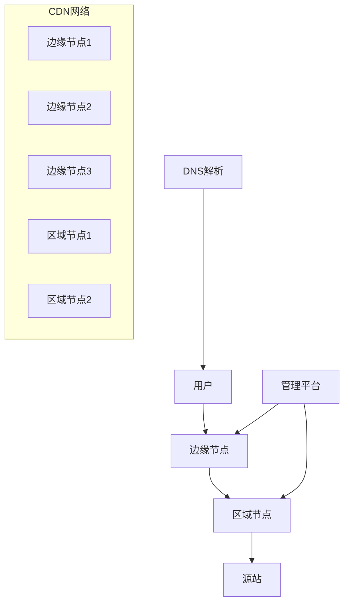
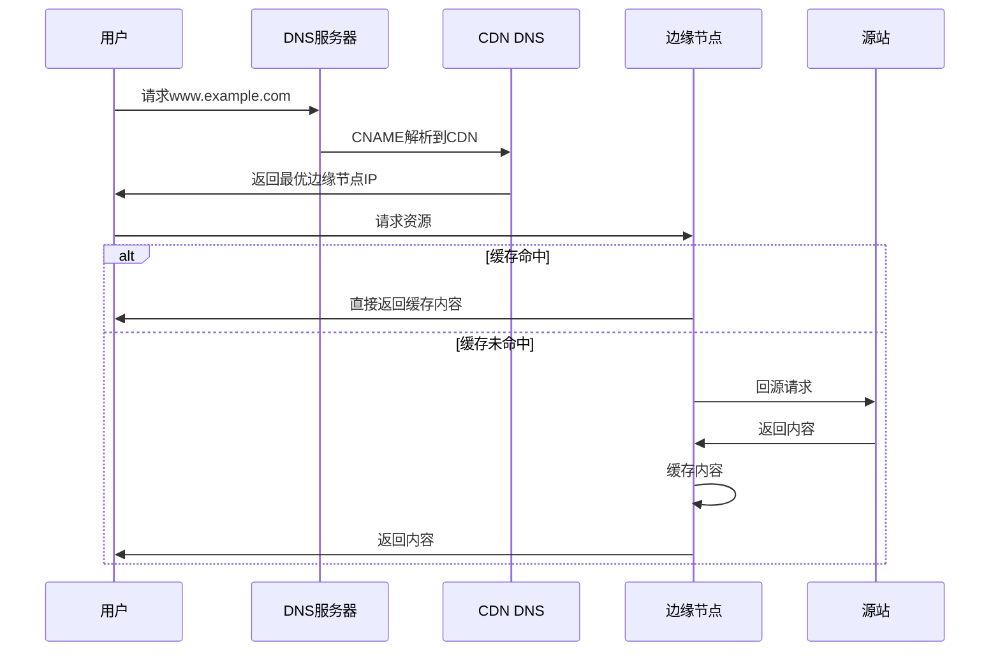
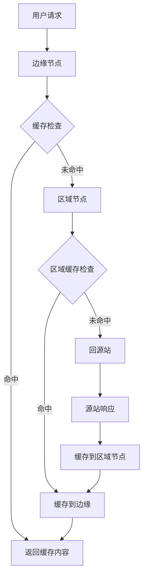

---
title: CDN实现原理详解
date: 2025-11-17
permalink: /system-design/cdn.html
categories:
  - Architecture
  - System Design
---

# CDN实现原理详解

## 概述

CDN（Content Delivery Network，内容分发网络）是一种分布式服务架构，通过在全球各地部署边缘服务器节点，将内容缓存到离用户最近的节点，从而提高内容访问速度、减少源站压力、提升用户体验。

## 1. CDN基本架构

### 1.1 核心组件


### 1.2 节点层级结构
- **边缘节点（Edge）**：最接近用户的缓存节点
- **区域节点（Regional）**：中间层缓存节点
- **源站（Origin）**：原始内容服务器
- **管理平台**：监控、配置、调度中心

## 2. CDN工作原理

### 2.1 请求流程详解


### 2.2 智能调度算法
```python
class CDNScheduler:
    def select_best_node(self, user_ip, content_url):
        """选择最优CDN节点"""
        candidate_nodes = self.get_candidate_nodes(user_ip)
        best_node = None
        best_score = 0

        for node in candidate_nodes:
            score = self.calculate_node_score(node, user_ip, content_url)
            if score > best_score:
                best_score = score
                best_node = node

        return best_node

    def calculate_node_score(self, node, user_ip, content_url):
        """计算节点评分"""
        # 地理距离权重
        distance_score = self.geo_distance_score(node, user_ip)

        # 网络延迟权重
        latency_score = self.network_latency_score(node, user_ip)

        # 节点负载权重
        load_score = self.node_load_score(node)

        # 缓存命中率权重
        hit_ratio_score = self.cache_hit_ratio_score(node, content_url)

        # 加权计算总分
        total_score = (distance_score * 0.3 +
                      latency_score * 0.3 +
                      load_score * 0.2 +
                      hit_ratio_score * 0.2)

        return total_score
```

## 3. DNS解析与调度

### 3.1 DNS解析过程
```bash
# 用户请求解析过程
dig www.example.com

# 返回CNAME记录
www.example.com.    300    IN    CNAME    www.example.com.cdn.provider.com.

# CDN DNS返回最优节点IP
www.example.com.cdn.provider.com.    60    IN    A    203.208.60.1
```

### 3.2 智能DNS调度策略
```java
@Service
public class CDNDNSService {

    @Autowired
    private NodeService nodeService;

    @Autowired
    private GeoIPService geoIPService;

    public String resolveOptimalNode(String domain, String clientIP) {
        // 1. 获取客户端地理位置
        Location clientLocation = geoIPService.getLocation(clientIP);

        // 2. 获取候选节点列表
        List<CDNNode> candidateNodes = nodeService.getCandidateNodes(
            clientLocation, domain);

        // 3. 基于多因素选择最优节点
        CDNNode optimalNode = selectOptimalNode(candidateNodes, clientIP);

        // 4. 返回节点IP地址
        return optimalNode.getIPAddress();
    }

    private CDNNode selectOptimalNode(List<CDNNode> nodes, String clientIP) {
        return nodes.stream()
            .min(Comparator.comparingDouble(node -> calculateCost(node, clientIP)))
            .orElse(nodes.get(0));
    }

    private double calculateCost(CDNNode node, String clientIP) {
        double latency = measureLatency(node, clientIP);
        double load = node.getCurrentLoad();
        double hitRatio = node.getCacheHitRatio();

        // 综合评分：延迟权重50%，负载权重30%，命中率权重20%
        return latency * 0.5 + load * 0.3 + (1 - hitRatio) * 0.2;
    }
}
```

## 4. 缓存机制与策略

### 4.1 缓存层级
```yaml
# CDN缓存配置示例
cache_levels:
  - level: 1
    name: "L1 Memory Cache"
    size: "32GB"
    ttl: "5min"

  - level: 2
    name: "L2 SSD Cache"
    size: "2TB"
    ttl: "1hour"

  - level: 3
    name: "L3 HDD Cache"
    size: "50TB"
    ttl: "24hour"
```

### 4.2 缓存淘汰算法
```java
public class CDNCacheManager {

    // LRU缓存实现
    private final LinkedHashMap<String, CacheItem> lruCache =
        new LinkedHashMap<String, CacheItem>(16, 0.75f, true) {
            @Override
            protected boolean removeEldestEntry(Map.Entry<String, CacheItem> eldest) {
                return size() > maxCacheSize;
            }
        };

    // LFU缓存实现
    private final Map<String, Integer> frequencies = new HashMap<>();
    private final Map<Integer, LinkedHashSet<String>> frequencyGroups = new HashMap<>();

    public void put(String key, byte[] content, long ttl) {
        CacheItem item = new CacheItem(content, System.currentTimeMillis() + ttl);

        // 根据内容类型选择缓存策略
        if (isStaticContent(key)) {
            putToStaticCache(key, item);
        } else if (isDynamicContent(key)) {
            putToDynamicCache(key, item);
        }

        // 更新访问频率
        updateFrequency(key);
    }

    public byte[] get(String key) {
        CacheItem item = lruCache.get(key);

        if (item != null && !item.isExpired()) {
            updateFrequency(key);
            return item.getContent();
        }

        // 缓存未命中，记录统计信息
        recordCacheMiss(key);
        return null;
    }

    private void updateFrequency(String key) {
        int freq = frequencies.getOrDefault(key, 0);
        frequencies.put(key, freq + 1);

        // 更新频率分组
        if (freq > 0) {
            frequencyGroups.get(freq).remove(key);
        }
        frequencyGroups.computeIfAbsent(freq + 1, k -> new LinkedHashSet<>()).add(key);
    }
}
```

### 4.3 缓存预热策略
```python
class CDNCacheWarming:
    def __init__(self):
        self.warming_scheduler = schedule.Scheduler()
        self.popular_content_analyzer = PopularContentAnalyzer()

    def schedule_warming(self):
        """调度缓存预热任务"""
        # 每小时分析热门内容
        self.warming_scheduler.every().hour.do(self.analyze_popular_content)

        # 每天凌晨进行全量预热
        self.warming_scheduler.every().day.at("02:00").do(self.full_warming)

        # 实时预热热点内容
        self.warming_scheduler.every(5).minutes.do(self.realtime_warming)

    def analyze_popular_content(self):
        """分析热门内容"""
        # 从访问日志分析热门URL
        popular_urls = self.popular_content_analyzer.get_popular_urls(
            time_range='1hour',
            min_requests=100
        )

        # 预热到所有边缘节点
        for url in popular_urls:
            self.warm_content_to_edges(url)

    def warm_content_to_edges(self, url):
        """将内容预热到边缘节点"""
        edge_nodes = self.get_all_edge_nodes()

        for node in edge_nodes:
            # 异步预热请求
            self.send_warming_request(node, url)

    def send_warming_request(self, node, url):
        """发送预热请求"""
        warming_url = f"http://{node.ip}/warming?url={url}"

        try:
            response = requests.get(warming_url, timeout=30)
            if response.status_code == 200:
                logger.info(f"Successfully warmed {url} on node {node.ip}")
            else:
                logger.error(f"Failed to warm {url} on node {node.ip}")
        except Exception as e:
            logger.error(f"Warming request failed: {e}")
```

## 5. 回源机制

### 5.1 回源策略


### 5.2 回源优化
```java
@Component
public class OriginPullService {

    @Autowired
    private CircuitBreaker circuitBreaker;

    @Autowired
    private RetryTemplate retryTemplate;

    public ResponseEntity<byte[]> pullFromOrigin(String url) {
        return circuitBreaker.executeSupplier(() -> {
            return retryTemplate.execute(context -> {
                return performOriginRequest(url);
            });
        });
    }

    private ResponseEntity<byte[]> performOriginRequest(String url) {
        RestTemplate restTemplate = new RestTemplate();

        // 设置请求头
        HttpHeaders headers = new HttpHeaders();
        headers.set("User-Agent", "CDN-EdgeServer/1.0");
        headers.set("X-Forwarded-For", getCurrentEdgeNodeIP());

        HttpEntity<Void> entity = new HttpEntity<>(headers);

        try {
            return restTemplate.exchange(url, HttpMethod.GET, entity, byte[].class);
        } catch (HttpClientErrorException e) {
            if (e.getStatusCode() == HttpStatus.NOT_FOUND) {
                // 404错误也要缓存，避免重复回源
                cacheNegativeResponse(url, 300); // 缓存5分钟
            }
            throw e;
        }
    }

    @Async
    public void prefetchContent(List<String> urls) {
        """异步预取内容"""
        for (String url : urls) {
            CompletableFuture.runAsync(() -> {
                try {
                    ResponseEntity<byte[]> response = pullFromOrigin(url);
                    if (response.getStatusCode().is2xxSuccessful()) {
                        cacheResponse(url, response);
                    }
                } catch (Exception e) {
                    logger.warn("Prefetch failed for URL: " + url, e);
                }
            });
        }
    }
}
```

## 6. 负载均衡与故障转移

### 6.1 负载均衡算法
```python
class CDNLoadBalancer:
    def __init__(self):
        self.algorithms = {
            'round_robin': self.round_robin,
            'weighted_round_robin': self.weighted_round_robin,
            'least_connections': self.least_connections,
            'ip_hash': self.ip_hash,
            'geo_proximity': self.geo_proximity
        }
        self.current_index = 0

    def round_robin(self, servers, client_ip=None):
        """轮询算法"""
        available_servers = [s for s in servers if s.is_healthy()]
        if not available_servers:
            return None

        server = available_servers[self.current_index % len(available_servers)]
        self.current_index += 1
        return server

    def weighted_round_robin(self, servers, client_ip=None):
        """加权轮询算法"""
        available_servers = [s for s in servers if s.is_healthy()]
        if not available_servers:
            return None

        # 计算总权重
        total_weight = sum(s.weight for s in available_servers)

        # 根据权重选择服务器
        random_weight = random.randint(1, total_weight)
        current_weight = 0

        for server in available_servers:
            current_weight += server.weight
            if random_weight <= current_weight:
                return server

        return available_servers[0]

    def least_connections(self, servers, client_ip=None):
        """最少连接算法"""
        available_servers = [s for s in servers if s.is_healthy()]
        if not available_servers:
            return None

        return min(available_servers, key=lambda s: s.active_connections)

    def ip_hash(self, servers, client_ip):
        """IP哈希算法"""
        available_servers = [s for s in servers if s.is_healthy()]
        if not available_servers:
            return None

        hash_value = hash(client_ip)
        return available_servers[hash_value % len(available_servers)]

    def geo_proximity(self, servers, client_ip):
        """地理位置就近算法"""
        available_servers = [s for s in servers if s.is_healthy()]
        if not available_servers:
            return None

        client_location = self.get_client_location(client_ip)

        def distance(server):
            return self.calculate_distance(client_location, server.location)

        return min(available_servers, key=distance)
```

### 6.2 健康检查机制
```java
@Component
public class HealthCheckService {

    @Scheduled(fixedRate = 30000) // 每30秒检查一次
    public void performHealthCheck() {
        List<CDNNode> nodes = nodeService.getAllNodes();

        for (CDNNode node : nodes) {
            CompletableFuture.runAsync(() -> checkNodeHealth(node));
        }
    }

    private void checkNodeHealth(CDNNode node) {
        HealthCheckResult result = new HealthCheckResult();
        result.setNodeId(node.getId());
        result.setCheckTime(System.currentTimeMillis());

        try {
            // HTTP健康检查
            ResponseEntity<String> response = restTemplate.getForEntity(
                "http://" + node.getIp() + "/health", String.class);

            result.setHttpStatus(response.getStatusCode().value());
            result.setResponseTime(measureResponseTime(node));

            // 系统指标检查
            SystemMetrics metrics = getSystemMetrics(node);
            result.setCpuUsage(metrics.getCpuUsage());
            result.setMemoryUsage(metrics.getMemoryUsage());
            result.setDiskUsage(metrics.getDiskUsage());

            // 评估健康状态
            boolean isHealthy = evaluateHealth(result);
            node.setHealthy(isHealthy);

            if (!isHealthy) {
                // 触发故障转移
                triggerFailover(node);
            }

        } catch (Exception e) {
            result.setError(e.getMessage());
            node.setHealthy(false);
            triggerFailover(node);
        }

        // 记录健康检查结果
        healthCheckRepository.save(result);
    }

    private void triggerFailover(CDNNode failedNode) {
        // 1. 从负载均衡中移除故障节点
        loadBalancer.removeNode(failedNode);

        // 2. 将流量切换到健康节点
        List<CDNNode> healthyNodes = nodeService.getHealthyNodes(
            failedNode.getRegion());

        if (healthyNodes.isEmpty()) {
            // 区域内无健康节点，切换到其他区域
            healthyNodes = nodeService.getHealthyNodesInOtherRegions();
        }

        // 3. 发送告警通知
        alertService.sendFailoverAlert(failedNode, healthyNodes);

        // 4. 记录故障转移事件
        logFailoverEvent(failedNode, healthyNodes);
    }
}
```

## 7. 安全机制

### 7.1 DDoS防护
```python
class DDoSProtection:
    def __init__(self):
        self.rate_limiter = RateLimiter()
        self.ip_blacklist = set()
        self.suspicious_patterns = SuspiciousPatternDetector()

    def process_request(self, request):
        client_ip = self.get_client_ip(request)

        # 1. 黑名单检查
        if client_ip in self.ip_blacklist:
            return self.block_request("IP blacklisted")

        # 2. 频率限制检查
        if not self.rate_limiter.is_allowed(client_ip):
            return self.block_request("Rate limit exceeded")

        # 3. 可疑模式检测
        if self.suspicious_patterns.detect(request):
            self.add_to_blacklist(client_ip, duration=3600)  # 临时拉黑1小时
            return self.block_request("Suspicious pattern detected")

        # 4. 流量清洗
        cleaned_request = self.clean_request(request)

        return self.forward_request(cleaned_request)

    def adaptive_rate_limiting(self, client_ip, request):
        """自适应限流"""
        # 根据历史行为调整限流策略
        client_behavior = self.analyze_client_behavior(client_ip)

        if client_behavior.is_legitimate():
            # 正常用户，提高限流阈值
            return self.rate_limiter.check(client_ip, rate=100)
        elif client_behavior.is_suspicious():
            # 可疑用户，降低限流阈值
            return self.rate_limiter.check(client_ip, rate=10)
        else:
            # 新用户，使用默认阈值
            return self.rate_limiter.check(client_ip, rate=50)
```

### 7.2 内容安全
```java
@Service
public class ContentSecurityService {

    @Autowired
    private VirusScanningService virusScanner;

    @Autowired
    private ContentFilterService contentFilter;

    public boolean validateContent(String url, byte[] content) {
        // 1. 病毒扫描
        if (virusScanner.containsVirus(content)) {
            logger.warn("Virus detected in content: " + url);
            return false;
        }

        // 2. 内容过滤
        if (contentFilter.isBlocked(url, content)) {
            logger.warn("Content blocked by filter: " + url);
            return false;
        }

        // 3. 文件类型验证
        String contentType = detectContentType(content);
        if (!isAllowedContentType(contentType)) {
            logger.warn("Disallowed content type: " + contentType);
            return false;
        }

        // 4. 文件大小检查
        if (content.length > MAX_FILE_SIZE) {
            logger.warn("File too large: " + content.length);
            return false;
        }

        return true;
    }

    public void sanitizeContent(byte[] content) {
        // 对HTML内容进行XSS防护
        if (isHtmlContent(content)) {
            String html = new String(content);
            String sanitized = Jsoup.clean(html, Whitelist.relaxed());
            return sanitized.getBytes();
        }

        return content;
    }
}
```

## 8. 监控与运维

### 8.1 实时监控指标
```yaml
monitoring_metrics:
  performance:
    - cache_hit_ratio
    - response_time
    - throughput
    - bandwidth_usage

  availability:
    - uptime_percentage
    - error_rate
    - timeout_rate

  resource:
    - cpu_usage
    - memory_usage
    - disk_usage
    - network_usage

  business:
    - request_count
    - unique_visitors
    - geographic_distribution
    - popular_content
```

### 8.2 监控实现
```java
@Component
public class CDNMonitoringService {

    @Autowired
    private MeterRegistry meterRegistry;

    @EventListener
    public void handleRequest(CDNRequestEvent event) {
        // 记录请求指标
        Timer.Sample sample = Timer.start(meterRegistry);

        try {
            // 处理请求
            processRequest(event.getRequest());

            // 记录成功指标
            meterRegistry.counter("cdn.requests.success",
                "node", event.getNodeId(),
                "region", event.getRegion()
            ).increment();

        } catch (Exception e) {
            // 记录失败指标
            meterRegistry.counter("cdn.requests.error",
                "node", event.getNodeId(),
                "error", e.getClass().getSimpleName()
            ).increment();

        } finally {
            // 记录响应时间
            sample.stop(Timer.builder("cdn.request.duration")
                .tag("node", event.getNodeId())
                .register(meterRegistry));
        }
    }

    @Scheduled(fixedRate = 60000) // 每分钟统计一次
    public void collectMetrics() {
        // 缓存命中率
        double hitRatio = calculateCacheHitRatio();
        meterRegistry.gauge("cdn.cache.hit_ratio", hitRatio);

        // 带宽使用量
        long bandwidthUsage = getBandwidthUsage();
        meterRegistry.gauge("cdn.bandwidth.usage", bandwidthUsage);

        // 节点健康状态
        long healthyNodes = getHealthyNodeCount();
        meterRegistry.gauge("cdn.nodes.healthy", healthyNodes);
    }
}
```

### 8.3 自动化运维
```python
class CDNAutoOps:
    def __init__(self):
        self.threshold_config = {
            'cpu_usage': 80,
            'memory_usage': 85,
            'cache_hit_ratio': 0.8,
            'error_rate': 0.05
        }

    def auto_scaling(self):
        """自动扩缩容"""
        for region in self.get_all_regions():
            metrics = self.get_region_metrics(region)

            if self.should_scale_out(metrics):
                self.scale_out_region(region)
            elif self.should_scale_in(metrics):
                self.scale_in_region(region)

    def should_scale_out(self, metrics):
        """判断是否需要扩容"""
        return (metrics.cpu_usage > self.threshold_config['cpu_usage'] or
                metrics.memory_usage > self.threshold_config['memory_usage'] or
                metrics.error_rate > self.threshold_config['error_rate'])

    def cache_optimization(self):
        """缓存优化"""
        # 1. 清理过期缓存
        self.clean_expired_cache()

        # 2. 预热热门内容
        popular_content = self.analyze_popular_content()
        self.prefetch_content(popular_content)

        # 3. 调整缓存策略
        self.adjust_cache_policy()

    def traffic_migration(self, source_region, target_region):
        """流量迁移"""
        # 1. 预热目标区域
        self.warm_up_region(target_region)

        # 2. 渐进式流量切换
        for percentage in [10, 30, 50, 80, 100]:
            self.migrate_traffic(source_region, target_region, percentage)
            time.sleep(300)  # 等待5分钟观察效果

            if self.check_migration_health(target_region):
                continue
            else:
                # 回滚流量
                self.rollback_traffic(source_region, target_region)
                break
```

## 9. CDN性能优化

### 9.1 内容优化
```javascript
// 前端优化配置
const cdnOptimization = {
    // 图片优化
    imageOptimization: {
        formats: ['webp', 'avif', 'jpeg'],
        quality: 85,
        sizes: [300, 600, 1200, 1800],
        lazyLoading: true
    },

    // 资源压缩
    compression: {
        gzip: true,
        brotli: true,
        minification: true
    },

    // 缓存策略
    caching: {
        static: '1y',      // 静态资源缓存1年
        dynamic: '5m',     // 动态内容缓存5分钟
        api: '30s'         // API响应缓存30秒
    }
};
```

### 9.2 协议优化
```nginx
# Nginx CDN配置优化
server {
    listen 443 ssl http2;
    server_name cdn.example.com;

    # HTTP/2 推送
    location / {
        http2_push /css/style.css;
        http2_push /js/app.js;

        # 缓存控制
        location ~* \.(css|js|png|jpg|jpeg|gif|ico|svg)$ {
            expires 1y;
            add_header Cache-Control "public, immutable";
            add_header CDN-Cache "HIT";
        }

        # Gzip压缩
        gzip on;
        gzip_vary on;
        gzip_min_length 1024;
        gzip_types text/plain text/css application/json application/javascript;

        # Brotli压缩
        brotli on;
        brotli_comp_level 6;
        brotli_types text/plain text/css application/json application/javascript;
    }

    # 缓存清理API
    location /purge/ {
        allow 10.0.0.0/8;
        deny all;

        set $purge_path $request_uri;
        content_by_lua_block {
            local cache_key = ngx.var.purge_path
            ngx.shared.cache_dict:delete(cache_key)
            ngx.say("Purged: " .. cache_key)
        }
    }
}
```

## 10. 全球部署策略

### 10.1 节点部署规划
```yaml
global_deployment:
  regions:
    - name: "Asia Pacific"
      countries: ["China", "Japan", "Singapore", "Australia"]
      edge_nodes: 50
      regional_nodes: 5

    - name: "Europe"
      countries: ["Germany", "UK", "France", "Netherlands"]
      edge_nodes: 40
      regional_nodes: 4

    - name: "North America"
      countries: ["USA", "Canada"]
      edge_nodes: 45
      regional_nodes: 5

    - name: "South America"
      countries: ["Brazil", "Argentina"]
      edge_nodes: 20
      regional_nodes: 2

node_specifications:
  edge_node:
    cpu: "32 cores"
    memory: "128GB"
    storage: "10TB SSD"
    bandwidth: "10Gbps"

  regional_node:
    cpu: "64 cores"
    memory: "256GB"
    storage: "50TB SSD + 200TB HDD"
    bandwidth: "40Gbps"
```

### 10.2 跨地域同步
```java
@Service
public class GlobalSyncService {

    @Autowired
    private List<RegionalNode> regionalNodes;

    @Async
    public void syncContentGlobally(String contentUrl, byte[] content) {
        // 并行同步到所有区域节点
        List<CompletableFuture<Void>> syncTasks = regionalNodes.stream()
            .map(node -> CompletableFuture.runAsync(() ->
                syncToRegionalNode(node, contentUrl, content)))
            .collect(Collectors.toList());

        // 等待所有同步完成
        CompletableFuture.allOf(syncTasks.toArray(new CompletableFuture[0]))
            .thenRun(() -> {
                logger.info("Global sync completed for: " + contentUrl);
                notifyContentAvailable(contentUrl);
            });
    }

    private void syncToRegionalNode(RegionalNode node, String url, byte[] content) {
        try {
            HttpHeaders headers = new HttpHeaders();
            headers.setContentType(MediaType.APPLICATION_OCTET_STREAM);
            headers.set("X-Content-URL", url);

            HttpEntity<byte[]> entity = new HttpEntity<>(content, headers);

            ResponseEntity<String> response = restTemplate.postForEntity(
                "http://" + node.getIp() + "/sync", entity, String.class);

            if (response.getStatusCode().is2xxSuccessful()) {
                logger.info("Synced {} to regional node {}", url, node.getId());
            }

        } catch (Exception e) {
            logger.error("Failed to sync {} to regional node {}", url, node.getId(), e);
            // 重试机制
            scheduleRetrySync(node, url, content);
        }
    }
}
```

## 11. CDN成本优化

### 11.1 智能缓存策略
```python
class CostOptimizedCaching:
    def __init__(self):
        self.cost_model = CostModel()
        self.analytics = ContentAnalytics()

    def optimize_caching_strategy(self):
        """优化缓存策略以降低成本"""
        # 1. 分析内容访问模式
        content_analytics = self.analytics.analyze_content_patterns()

        # 2. 计算内容价值
        for content in content_analytics:
            content.value_score = self.calculate_content_value(content)

        # 3. 基于价值调整缓存策略
        self.adjust_cache_policies(content_analytics)

    def calculate_content_value(self, content):
        """计算内容价值评分"""
        # 访问频率权重
        frequency_score = content.access_frequency * 0.4

        # 文件大小成本权重（大文件成本高）
        size_penalty = (content.size / 1024 / 1024) * 0.2  # MB

        # 地理分布权重（全球访问价值高）
        geo_score = len(content.access_regions) * 0.3

        # 时效性权重（时效性强的内容价值高）
        freshness_score = content.freshness_requirement * 0.1

        return frequency_score + geo_score + freshness_score - size_penalty

    def adjust_cache_policies(self, content_analytics):
        """调整缓存策略"""
        for content in content_analytics:
            if content.value_score > 0.8:
                # 高价值内容：全球缓存，长期保留
                self.set_cache_policy(content.url,
                                    ttl='24h',
                                    replicas='all_regions')
            elif content.value_score > 0.5:
                # 中等价值内容：区域缓存，中期保留
                self.set_cache_policy(content.url,
                                    ttl='4h',
                                    replicas='primary_regions')
            else:
                # 低价值内容：按需缓存，短期保留
                self.set_cache_policy(content.url,
                                    ttl='30m',
                                    replicas='origin_region_only')
```

## 12. 未来发展趋势

### 12.1 边缘计算集成
```javascript
// 边缘计算函数示例
class EdgeFunction {
    async processRequest(request, context) {
        const userLocation = context.geoLocation;
        const userAgent = request.headers['user-agent'];

        // 在边缘节点进行个性化处理
        if (isMobileDevice(userAgent)) {
            return await this.serveMobileOptimized(request);
        }

        // 根据地理位置提供本地化内容
        const localizedContent = await this.getLocalizedContent(
            request.url, userLocation);

        return new Response(localizedContent, {
            headers: {
                'Content-Type': 'text/html',
                'Cache-Control': 'max-age=300'
            }
        });
    }

    async serveMobileOptimized(request) {
        // 移动端优化逻辑
        const content = await this.getOriginalContent(request.url);
        const optimized = this.optimizeForMobile(content);

        return new Response(optimized);
    }
}
```

### 12.2 AI驱动优化
```python
class AIOptimizedCDN:
    def __init__(self):
        self.prediction_model = TrafficPredictionModel()
        self.optimization_engine = OptimizationEngine()

    async def predictive_caching(self):
        """基于AI预测进行缓存预热"""
        # 预测未来1小时的热门内容
        predicted_hot_content = await self.prediction_model.predict_hot_content(
            time_horizon='1h'
        )

        # 预测各地区流量模式
        traffic_patterns = await self.prediction_model.predict_traffic_patterns()

        # 基于预测进行智能预缓存
        for region, pattern in traffic_patterns.items():
            await self.smart_prefetch(region, predicted_hot_content, pattern)

    async def dynamic_optimization(self):
        """动态优化CDN配置"""
        current_performance = await self.get_current_performance()

        # AI推荐优化策略
        optimization_strategy = await self.optimization_engine.recommend(
            current_performance
        )

        # 自动应用优化配置
        await self.apply_optimization(optimization_strategy)
```

## 总结

CDN作为现代互联网基础设施的重要组成部分，通过以下核心机制提供服务：

### 核心价值
1. **加速访问**：就近服务，减少延迟
2. **减轻压力**：分流源站请求
3. **提高可用性**：分布式容灾
4. **节省带宽**：缓存减少传输

### 关键技术
1. **智能调度**：DNS解析和负载均衡
2. **分层缓存**：多级存储优化
3. **安全防护**：DDoS防护和内容安全
4. **监控运维**：实时监控和自动化

### 发展趋势
1. **边缘计算**：计算能力下沉
2. **AI优化**：智能预测和优化
3. **5G集成**：更低延迟和更高带宽
4. **绿色节能**：环保和成本优化

CDN技术仍在不断演进，从单纯的内容分发向边缘计算平台转变，为用户提供更快、更安全、更智能的网络服务体验。