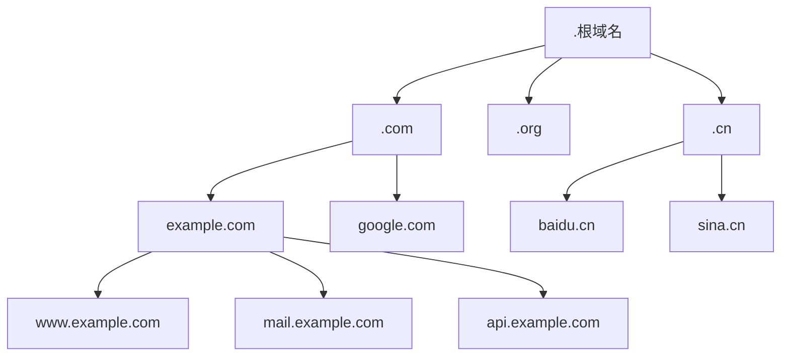
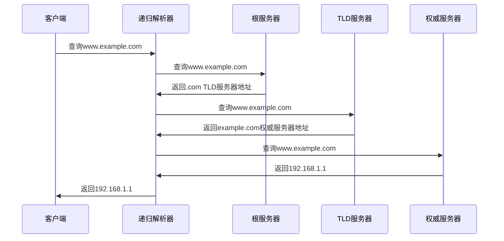
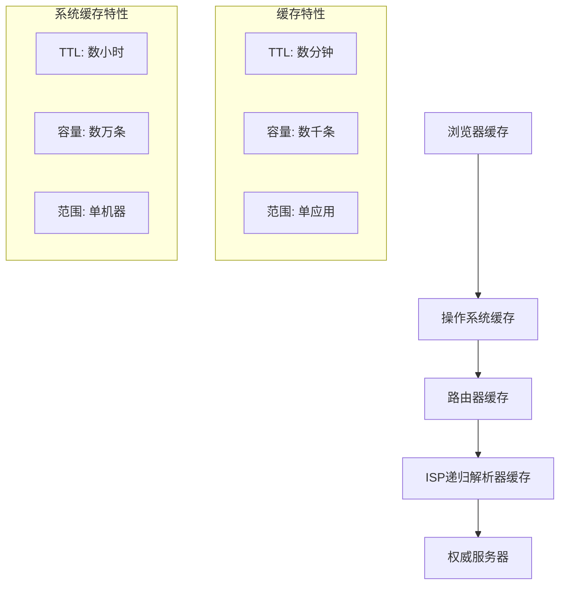

# DNS实现原理详解

## 概述

DNS（Domain Name System，域名系统）是互联网的基础设施之一，负责将人类可读的域名（如www.example.com）转换为机器可识别的IP地址（如192.168.1.1）。它是一个分布式、分层次的命名系统，为互联网上的设备提供命名服务。

## 1. DNS基本概念

### 1.1 DNS层次结构


### 1.2 域名组成
```
www.example.com.
│   │       │   │
│   │       │   └── 根域名（通常省略）
│   │       └────── 顶级域名（TLD）
│   └────────────── 二级域名
└────────────────── 主机名/子域名
```

### 1.3 DNS记录类型
```yaml
dns_record_types:
  A:     # IPv4地址记录
    description: "将域名指向IPv4地址"
    example: "www.example.com. 300 IN A 192.168.1.1"

  AAAA:  # IPv6地址记录
    description: "将域名指向IPv6地址"
    example: "www.example.com. 300 IN AAAA 2001:db8::1"

  CNAME: # 别名记录
    description: "将域名指向另一个域名"
    example: "www.example.com. 300 IN CNAME example.com."

  MX:    # 邮件交换记录
    description: "指定邮件服务器"
    example: "example.com. 300 IN MX 10 mail.example.com."

  NS:    # 名称服务器记录
    description: "指定权威DNS服务器"
    example: "example.com. 300 IN NS ns1.example.com."

  TXT:   # 文本记录
    description: "存储文本信息"
    example: "example.com. 300 IN TXT \"v=spf1 include:_spf.google.com ~all\""

  SRV:   # 服务记录
    description: "指定服务的位置"
    example: "_sip._tcp.example.com. 300 IN SRV 10 5 5060 sip.example.com."

  PTR:   # 反向解析记录
    description: "IP地址反向解析为域名"
    example: "1.1.168.192.in-addr.arpa. 300 IN PTR www.example.com."
```

## 2. DNS解析过程

### 2.1 DNS查询流程


### 2.2 查询类型
```python
class DNSQueryType:
    RECURSIVE = "recursive"    # 递归查询
    ITERATIVE = "iterative"   # 迭代查询

class DNSQuery:
    def __init__(self, domain, query_type=DNSQueryType.RECURSIVE):
        self.domain = domain
        self.query_type = query_type
        self.query_id = self.generate_query_id()

    def recursive_query(self, domain):
        """递归查询 - DNS解析器代为查询"""
        resolver = DNSResolver()
        return resolver.resolve(domain)

    def iterative_query(self, domain):
        """迭代查询 - 客户端自己逐级查询"""
        current_servers = self.get_root_servers()
        labels = domain.split('.')
        labels.reverse()  # 从根域开始

        for label in labels:
            if not label:  # 跳过空标签（根域）
                continue

            response = self.query_servers(current_servers, label)
            if response.is_answer():
                return response.get_answer()
            else:
                current_servers = response.get_authority_servers()

        return None

    def query_servers(self, servers, label):
        """向服务器列表查询"""
        for server in servers:
            try:
                response = self.send_query(server, label)
                if response:
                    return response
            except Exception as e:
                continue  # 尝试下一个服务器

        raise DNSException("All servers failed")
```

## 3. DNS服务器架构

### 3.1 服务器类型
```yaml
dns_server_types:
  recursive_resolver:
    description: "递归解析器"
    function: "代理客户端进行完整的DNS查询"
    examples: ["8.8.8.8", "1.1.1.1", "114.114.114.114"]

  root_nameserver:
    description: "根名称服务器"
    function: "提供顶级域名服务器信息"
    count: 13
    operators: ["VeriSign", "ICANN", "Cogent", "etc."]

  tld_nameserver:
    description: "顶级域名服务器"
    function: "管理特定顶级域名"
    examples: [".com", ".org", ".cn", ".net"]

  authoritative_nameserver:
    description: "权威名称服务器"
    function: "提供域名的最终解析结果"
    scope: "特定域名或域名集合"
```

### 3.2 DNS服务器实现
```java
@Service
public class DNSServer {

    @Autowired
    private DNSCache dnsCache;

    @Autowired
    private ZoneFileManager zoneManager;

    public DNSResponse handleQuery(DNSQuery query) {
        String domain = query.getDomain();
        DNSRecordType type = query.getType();

        // 1. 检查缓存
        DNSRecord cachedRecord = dnsCache.get(domain, type);
        if (cachedRecord != null && !cachedRecord.isExpired()) {
            return createResponse(query, cachedRecord, true);
        }

        // 2. 检查权威区域
        if (isAuthoritative(domain)) {
            DNSRecord record = zoneManager.getRecord(domain, type);
            if (record != null) {
                // 缓存结果
                dnsCache.put(record);
                return createResponse(query, record, false);
            }
        }

        // 3. 递归查询
        if (query.isRecursionDesired()) {
            DNSRecord record = performRecursiveQuery(domain, type);
            if (record != null) {
                // 缓存结果
                dnsCache.put(record);
                return createResponse(query, record, true);
            }
        }

        // 4. 返回NXDOMAIN
        return createNXDomainResponse(query);
    }

    private DNSRecord performRecursiveQuery(String domain, DNSRecordType type) {
        // 从根服务器开始递归查询
        List<String> rootServers = getRootServers();

        for (String rootServer : rootServers) {
            try {
                return recursiveResolve(domain, type, rootServer);
            } catch (Exception e) {
                // 尝试下一个根服务器
                continue;
            }
        }

        return null;
    }

    private DNSRecord recursiveResolve(String domain, DNSRecordType type, String server) {
        DNSQuery query = new DNSQuery(domain, type);
        DNSResponse response = sendQuery(server, query);

        if (response.isAnswer()) {
            return response.getAnswer();
        }

        if (response.hasAuthority()) {
            // 继续查询权威服务器
            List<String> authServers = response.getAuthorityServers();
            for (String authServer : authServers) {
                try {
                    return recursiveResolve(domain, type, authServer);
                } catch (Exception e) {
                    continue;
                }
            }
        }

        return null;
    }
}
```

## 4. DNS缓存机制

### 4.1 缓存层级


### 4.2 缓存实现
```java
@Component
public class DNSCache {

    private final ConcurrentHashMap<String, CacheEntry> cache = new ConcurrentHashMap<>();
    private final ScheduledExecutorService cleanupExecutor = Executors.newScheduledThreadPool(1);

    @PostConstruct
    public void initCleanup() {
        // 每分钟清理过期缓存
        cleanupExecutor.scheduleAtFixedRate(this::cleanExpiredEntries, 1, 1, TimeUnit.MINUTES);
    }

    public DNSRecord get(String domain, DNSRecordType type) {
        String key = createCacheKey(domain, type);
        CacheEntry entry = cache.get(key);

        if (entry != null && !entry.isExpired()) {
            entry.updateAccessTime();
            return entry.getRecord();
        }

        // 清理过期条目
        if (entry != null) {
            cache.remove(key);
        }

        return null;
    }

    public void put(DNSRecord record) {
        String key = createCacheKey(record.getDomain(), record.getType());
        long expiryTime = System.currentTimeMillis() + (record.getTTL() * 1000);

        CacheEntry entry = new CacheEntry(record, expiryTime);
        cache.put(key, entry);

        // 限制缓存大小
        if (cache.size() > MAX_CACHE_SIZE) {
            evictOldestEntries();
        }
    }

    private void cleanExpiredEntries() {
        long currentTime = System.currentTimeMillis();

        cache.entrySet().removeIf(entry ->
            entry.getValue().getExpiryTime() < currentTime);
    }

    private void evictOldestEntries() {
        // LRU淘汰策略
        List<Map.Entry<String, CacheEntry>> entries = cache.entrySet()
            .stream()
            .sorted(Comparator.comparing(e -> e.getValue().getLastAccessTime()))
            .collect(Collectors.toList());

        // 删除最老的10%条目
        int toRemove = (int) (cache.size() * 0.1);
        for (int i = 0; i < toRemove && i < entries.size(); i++) {
            cache.remove(entries.get(i).getKey());
        }
    }

    @Data
    private static class CacheEntry {
        private final DNSRecord record;
        private final long expiryTime;
        private long lastAccessTime;

        public CacheEntry(DNSRecord record, long expiryTime) {
            this.record = record;
            this.expiryTime = expiryTime;
            this.lastAccessTime = System.currentTimeMillis();
        }

        public boolean isExpired() {
            return System.currentTimeMillis() > expiryTime;
        }

        public void updateAccessTime() {
            this.lastAccessTime = System.currentTimeMillis();
        }
    }
}
```

## 5. DNS安全机制

### 5.1 DNSSEC（DNS安全扩展）
```yaml
dnssec_components:
  zone_signing:
    description: "区域签名"
    keys:
      - type: "ZSK (Zone Signing Key)"
        purpose: "签名区域数据"
      - type: "KSK (Key Signing Key)"
        purpose: "签名ZSK"

  validation_chain:
    description: "验证链"
    process:
      1. "验证根区域签名"
      2. "验证TLD区域签名"
      3. "验证二级域名区域签名"
      4. "验证最终记录签名"

  record_types:
    RRSIG: "资源记录签名"
    DNSKEY: "DNS公钥记录"
    DS: "授权签名者记录"
    NSEC: "下一个安全记录"
    NSEC3: "散列化的下一个安全记录"
```

### 5.2 DNSSEC实现
```python
import cryptography.hazmat.primitives.hashes as hashes
import cryptography.hazmat.primitives.asymmetric.rsa as rsa
import cryptography.hazmat.primitives.serialization as serialization

class DNSSECValidator:
    def __init__(self):
        self.trust_anchors = self.load_trust_anchors()

    def validate_response(self, dns_response):
        """验证DNS响应的DNSSEC签名"""
        # 1. 检查是否包含RRSIG记录
        if not dns_response.has_rrsig():
            return ValidationResult(False, "No RRSIG record found")

        # 2. 验证签名链
        validation_chain = self.build_validation_chain(dns_response)

        for link in validation_chain:
            if not self.validate_signature(link):
                return ValidationResult(False, f"Invalid signature in {link.domain}")

        return ValidationResult(True, "DNSSEC validation successful")

    def validate_signature(self, dns_record):
        """验证单个记录的签名"""
        rrsig = dns_record.get_rrsig()
        dnskey = self.get_dnskey(rrsig.signer_name)

        if not dnskey:
            return False

        # 重建签名数据
        signature_data = self.build_signature_data(dns_record, rrsig)

        # 验证签名
        try:
            public_key = self.extract_public_key(dnskey)
            public_key.verify(
                rrsig.signature,
                signature_data,
                hashes.SHA256()
            )
            return True
        except Exception as e:
            logger.error(f"Signature validation failed: {e}")
            return False

    def build_signature_data(self, record, rrsig):
        """构建用于签名验证的数据"""
        data = bytearray()

        # RRSIG RDATA (excluding signature)
        data.extend(rrsig.type_covered.to_bytes(2, 'big'))
        data.extend(rrsig.algorithm.to_bytes(1, 'big'))
        data.extend(rrsig.labels.to_bytes(1, 'big'))
        data.extend(rrsig.original_ttl.to_bytes(4, 'big'))
        data.extend(rrsig.signature_expiration.to_bytes(4, 'big'))
        data.extend(rrsig.signature_inception.to_bytes(4, 'big'))
        data.extend(rrsig.key_tag.to_bytes(2, 'big'))
        data.extend(self.domain_to_wire(rrsig.signer_name))

        # RRset data
        rrset = record.get_rrset()
        for rr in sorted(rrset):
            data.extend(self.domain_to_wire(rr.name))
            data.extend(rr.type.to_bytes(2, 'big'))
            data.extend(rr.class.to_bytes(2, 'big'))
            data.extend(rrsig.original_ttl.to_bytes(4, 'big'))
            rdata = rr.to_wire()
            data.extend(len(rdata).to_bytes(2, 'big'))
            data.extend(rdata)

        return bytes(data)
```

### 5.3 DNS攻击与防护
```java
@Component
public class DNSSecurityService {

    @Autowired
    private BlacklistService blacklistService;

    @Autowired
    private RateLimitService rateLimitService;

    public boolean isSecureQuery(DNSQuery query, String clientIP) {
        // 1. 检查客户端IP黑名单
        if (blacklistService.isBlacklisted(clientIP)) {
            logger.warn("Blocked query from blacklisted IP: " + clientIP);
            return false;
        }

        // 2. 速率限制检查
        if (!rateLimitService.isAllowed(clientIP)) {
            logger.warn("Rate limit exceeded for IP: " + clientIP);
            return false;
        }

        // 3. 检查恶意域名
        if (isMaliciousDomain(query.getDomain())) {
            logger.warn("Blocked query for malicious domain: " + query.getDomain());
            return false;
        }

        // 4. 检查DNS隧道攻击
        if (isDNSTunnelingAttack(query)) {
            logger.warn("Potential DNS tunneling attack detected");
            return false;
        }

        return true;
    }

    private boolean isMaliciousDomain(String domain) {
        // 检查恶意域名数据库
        return maliciousDomainDatabase.contains(domain) ||
               isDGA(domain) ||  // 域名生成算法检测
               isSuspiciousPattern(domain);
    }

    private boolean isDGA(String domain) {
        // 域名生成算法检测
        // 1. 检查熵值
        double entropy = calculateEntropy(domain);
        if (entropy > DGA_ENTROPY_THRESHOLD) {
            return true;
        }

        // 2. 检查字符模式
        if (hasRandomPattern(domain)) {
            return true;
        }

        // 3. 检查长度异常
        if (domain.length() > NORMAL_DOMAIN_LENGTH) {
            return true;
        }

        return false;
    }

    private boolean isDNSTunnelingAttack(DNSQuery query) {
        String domain = query.getDomain();

        // 1. 检查异常长的子域名
        String[] labels = domain.split("\\.");
        for (String label : labels) {
            if (label.length() > MAX_LABEL_LENGTH) {
                return true;
            }
        }

        // 2. 检查异常数量的子域名
        if (labels.length > MAX_SUBDOMAIN_LEVELS) {
            return true;
        }

        // 3. 检查Base64编码模式
        if (hasBase64Pattern(domain)) {
            return true;
        }

        return false;
    }

    private double calculateEntropy(String domain) {
        Map<Character, Integer> charCount = new HashMap<>();
        for (char c : domain.toCharArray()) {
            charCount.put(c, charCount.getOrDefault(c, 0) + 1);
        }

        double entropy = 0.0;
        int length = domain.length();

        for (int count : charCount.values()) {
            double probability = (double) count / length;
            entropy -= probability * (Math.log(probability) / Math.log(2));
        }

        return entropy;
    }
}
```

## 6. DNS负载均衡

### 6.1 基于DNS的负载均衡
```python
class DNSLoadBalancer:
    def __init__(self):
        self.algorithms = {
            'round_robin': self.round_robin,
            'weighted': self.weighted_round_robin,
            'geographic': self.geographic_based,
            'health_check': self.health_check_based
        }
        self.server_health = {}

    def resolve_with_load_balancing(self, domain, client_ip, algorithm='round_robin'):
        """基于负载均衡算法解析域名"""
        servers = self.get_backend_servers(domain)

        if not servers:
            return None

        # 过滤健康的服务器
        healthy_servers = [s for s in servers if self.is_server_healthy(s)]

        if not healthy_servers:
            # 如果没有健康服务器，返回所有服务器
            healthy_servers = servers

        # 应用负载均衡算法
        selected_server = self.algorithms[algorithm](healthy_servers, client_ip)

        return selected_server.ip_address

    def round_robin(self, servers, client_ip=None):
        """轮询算法"""
        current_index = getattr(self, '_rr_index', 0)
        selected = servers[current_index % len(servers)]
        self._rr_index = (current_index + 1) % len(servers)
        return selected

    def weighted_round_robin(self, servers, client_ip=None):
        """加权轮询算法"""
        total_weight = sum(s.weight for s in servers)
        random_weight = random.randint(1, total_weight)

        current_weight = 0
        for server in servers:
            current_weight += server.weight
            if random_weight <= current_weight:
                return server

        return servers[0]

    def geographic_based(self, servers, client_ip):
        """基于地理位置的负载均衡"""
        client_location = self.get_client_location(client_ip)

        def distance(server):
            return self.calculate_distance(client_location, server.location)

        # 返回最近的服务器
        return min(servers, key=distance)

    def health_check_based(self, servers, client_ip=None):
        """基于健康检查的负载均衡"""
        # 按健康度和响应时间排序
        def health_score(server):
            health = self.server_health.get(server.id, {})
            response_time = health.get('response_time', float('inf'))
            error_rate = health.get('error_rate', 1.0)

            # 健康度评分（响应时间越低越好，错误率越低越好）
            return response_time * (1 + error_rate)

        return min(servers, key=health_score)

    async def perform_health_checks(self):
        """执行健康检查"""
        servers = self.get_all_servers()

        tasks = []
        for server in servers:
            task = asyncio.create_task(self.check_server_health(server))
            tasks.append(task)

        await asyncio.gather(*tasks)

    async def check_server_health(self, server):
        """检查单个服务器健康状态"""
        start_time = time.time()

        try:
            async with aiohttp.ClientSession() as session:
                async with session.get(
                    f"http://{server.ip_address}/health",
                    timeout=aiohttp.ClientTimeout(total=5)
                ) as response:

                    response_time = time.time() - start_time

                    if response.status == 200:
                        self.server_health[server.id] = {
                            'healthy': True,
                            'response_time': response_time,
                            'error_rate': 0.0,
                            'last_check': time.time()
                        }
                    else:
                        self.mark_server_unhealthy(server, response_time)

        except Exception as e:
            response_time = time.time() - start_time
            self.mark_server_unhealthy(server, response_time, str(e))

    def mark_server_unhealthy(self, server, response_time, error=None):
        """标记服务器为不健康"""
        current_health = self.server_health.get(server.id, {})
        error_count = current_health.get('error_count', 0) + 1

        self.server_health[server.id] = {
            'healthy': False,
            'response_time': response_time,
            'error_rate': min(error_count / 10.0, 1.0),  # 最近10次请求的错误率
            'error_count': error_count,
            'last_error': error,
            'last_check': time.time()
        }
```

## 7. DNS协议详解

### 7.1 DNS协议格式
```
DNS报文格式:
+--+--+--+--+--+--+--+--+--+--+--+--+--+--+--+--+
|                      ID                       |
+--+--+--+--+--+--+--+--+--+--+--+--+--+--+--+--+
|QR|   Opcode  |AA|TC|RD|RA|   Z    |   RCODE   |
+--+--+--+--+--+--+--+--+--+--+--+--+--+--+--+--+
|                    QDCOUNT                    |
+--+--+--+--+--+--+--+--+--+--+--+--+--+--+--+--+
|                    ANCOUNT                    |
+--+--+--+--+--+--+--+--+--+--+--+--+--+--+--+--+
|                    NSCOUNT                    |
+--+--+--+--+--+--+--+--+--+--+--+--+--+--+--+--+
|                    ARCOUNT                    |
+--+--+--+--+--+--+--+--+--+--+--+--+--+--+--+--+
```

### 7.2 DNS协议实现
```java
public class DNSProtocol {

    public static class DNSHeader {
        private short id;          // 标识符
        private boolean qr;        // 查询/响应标志
        private byte opcode;       // 操作码
        private boolean aa;        // 权威答案标志
        private boolean tc;        // 截断标志
        private boolean rd;        // 递归期望标志
        private boolean ra;        // 递归可用标志
        private byte rcode;        // 响应码

        private short qdcount;     // 问题数
        private short ancount;     // 答案数
        private short nscount;     // 权威记录数
        private short arcount;     // 附加记录数

        public byte[] toBytes() {
            ByteBuffer buffer = ByteBuffer.allocate(12);

            buffer.putShort(id);

            // 标志位
            short flags = 0;
            if (qr) flags |= 0x8000;
            flags |= (opcode & 0x0F) << 11;
            if (aa) flags |= 0x0400;
            if (tc) flags |= 0x0200;
            if (rd) flags |= 0x0100;
            if (ra) flags |= 0x0080;
            flags |= rcode & 0x0F;

            buffer.putShort(flags);
            buffer.putShort(qdcount);
            buffer.putShort(ancount);
            buffer.putShort(nscount);
            buffer.putShort(arcount);

            return buffer.array();
        }

        public static DNSHeader fromBytes(byte[] data) {
            ByteBuffer buffer = ByteBuffer.wrap(data);
            DNSHeader header = new DNSHeader();

            header.id = buffer.getShort();

            short flags = buffer.getShort();
            header.qr = (flags & 0x8000) != 0;
            header.opcode = (byte) ((flags >>> 11) & 0x0F);
            header.aa = (flags & 0x0400) != 0;
            header.tc = (flags & 0x0200) != 0;
            header.rd = (flags & 0x0100) != 0;
            header.ra = (flags & 0x0080) != 0;
            header.rcode = (byte) (flags & 0x0F);

            header.qdcount = buffer.getShort();
            header.ancount = buffer.getShort();
            header.nscount = buffer.getShort();
            header.arcount = buffer.getShort();

            return header;
        }
    }

    public static class DNSQuestion {
        private String qname;      // 查询名称
        private short qtype;       // 查询类型
        private short qclass;      // 查询类别

        public byte[] toBytes() {
            ByteArrayOutputStream baos = new ByteArrayOutputStream();

            // 编码域名
            byte[] encodedName = encodeDomainName(qname);
            baos.write(encodedName, 0, encodedName.length);

            // 添加类型和类别
            try {
                baos.write((qtype >>> 8) & 0xFF);
                baos.write(qtype & 0xFF);
                baos.write((qclass >>> 8) & 0xFF);
                baos.write(qclass & 0xFF);
            } catch (IOException e) {
                throw new RuntimeException(e);
            }

            return baos.toByteArray();
        }

        private byte[] encodeDomainName(String domain) {
            ByteArrayOutputStream baos = new ByteArrayOutputStream();
            String[] labels = domain.split("\\.");

            for (String label : labels) {
                if (label.length() > 63) {
                    throw new IllegalArgumentException("Label too long: " + label);
                }

                baos.write(label.length());
                try {
                    baos.write(label.getBytes("UTF-8"));
                } catch (IOException e) {
                    throw new RuntimeException(e);
                }
            }

            baos.write(0); // 根标签
            return baos.toByteArray();
        }
    }

    public static class DNSResourceRecord {
        private String name;       // 资源记录名称
        private short type;        // 资源记录类型
        private short clazz;       // 资源记录类别
        private int ttl;           // 生存时间
        private byte[] rdata;      // 资源数据

        public byte[] toBytes() {
            ByteArrayOutputStream baos = new ByteArrayOutputStream();

            // 编码名称
            byte[] encodedName = encodeDomainName(name);
            baos.write(encodedName, 0, encodedName.length);

            try {
                // 类型
                baos.write((type >>> 8) & 0xFF);
                baos.write(type & 0xFF);

                // 类别
                baos.write((clazz >>> 8) & 0xFF);
                baos.write(clazz & 0xFF);

                // TTL
                baos.write((ttl >>> 24) & 0xFF);
                baos.write((ttl >>> 16) & 0xFF);
                baos.write((ttl >>> 8) & 0xFF);
                baos.write(ttl & 0xFF);

                // 数据长度
                baos.write((rdata.length >>> 8) & 0xFF);
                baos.write(rdata.length & 0xFF);

                // 数据
                baos.write(rdata);

            } catch (IOException e) {
                throw new RuntimeException(e);
            }

            return baos.toByteArray();
        }
    }
}
```

## 8. 高性能DNS优化

### 8.1 性能优化策略
```yaml
performance_optimization:
  caching:
    - "多级缓存架构"
    - "智能缓存预热"
    - "缓存分片策略"

  networking:
    - "UDP协议优化"
    - "TCP连接复用"
    - "多路径传输"

  data_structure:
    - "Patricia Trie查找"
    - "Bloom Filter过滤"
    - "压缩存储格式"

  computation:
    - "异步处理模型"
    - "并行查询处理"
    - "SIMD指令优化"
```

### 8.2 高性能DNS服务器实现
```go
package main

import (
    "context"
    "net"
    "sync"
    "time"

    "github.com/miekg/dns"
)

type HighPerformanceDNSServer struct {
    cache     *DNSCache
    workers   int
    queryPool sync.Pool
}

func NewHighPerformanceDNSServer(workers int) *HighPerformanceDNSServer {
    return &HighPerformanceDNSServer{
        cache:   NewDNSCache(),
        workers: workers,
        queryPool: sync.Pool{
            New: func() interface{} {
                return &dns.Msg{}
            },
        },
    }
}

func (s *HighPerformanceDNSServer) Start(addr string) error {
    // UDP服务器
    udpAddr, err := net.ResolveUDPAddr("udp", addr)
    if err != nil {
        return err
    }

    udpConn, err := net.ListenUDP("udp", udpAddr)
    if err != nil {
        return err
    }

    // 启动工作协程池
    for i := 0; i < s.workers; i++ {
        go s.worker(udpConn)
    }

    // TCP服务器
    tcpAddr, err := net.ResolveTCPAddr("tcp", addr)
    if err != nil {
        return err
    }

    tcpListener, err := net.ListenTCP("tcp", tcpAddr)
    if err != nil {
        return err
    }

    go s.handleTCP(tcpListener)

    return nil
}

func (s *HighPerformanceDNSServer) worker(conn *net.UDPConn) {
    buffer := make([]byte, 4096)

    for {
        n, clientAddr, err := conn.ReadFromUDP(buffer)
        if err != nil {
            continue
        }

        // 异步处理请求
        go s.handleUDPQuery(conn, clientAddr, buffer[:n])
    }
}

func (s *HighPerformanceDNSServer) handleUDPQuery(conn *net.UDPConn,
    clientAddr *net.UDPAddr, data []byte) {

    // 从对象池获取消息对象
    msg := s.queryPool.Get().(*dns.Msg)
    defer s.queryPool.Put(msg)

    // 重置消息对象
    msg.Id = 0
    msg.Question = msg.Question[:0]
    msg.Answer = msg.Answer[:0]
    msg.Ns = msg.Ns[:0]
    msg.Extra = msg.Extra[:0]

    // 解析DNS查询
    if err := msg.Unpack(data); err != nil {
        return
    }

    // 处理查询
    response := s.processQuery(msg)

    // 发送响应
    responseData, err := response.Pack()
    if err != nil {
        return
    }

    conn.WriteToUDP(responseData, clientAddr)
}

func (s *HighPerformanceDNSServer) processQuery(query *dns.Msg) *dns.Msg {
    response := &dns.Msg{}
    response.SetReply(query)

    for _, question := range query.Question {
        // 检查缓存
        if cachedAnswer := s.cache.Get(question.Name, question.Qtype); cachedAnswer != nil {
            response.Answer = append(response.Answer, cachedAnswer)
            continue
        }

        // 执行查询
        answer := s.resolveQuery(question.Name, question.Qtype)
        if answer != nil {
            // 缓存结果
            s.cache.Set(question.Name, question.Qtype, answer)
            response.Answer = append(response.Answer, answer)
        }
    }

    return response
}

// Patricia Trie实现用于快速域名查找
type PatriciaTrie struct {
    root *TrieNode
    mu   sync.RWMutex
}

type TrieNode struct {
    children map[byte]*TrieNode
    isLeaf   bool
    value    interface{}
    prefix   []byte
}

func (pt *PatriciaTrie) Insert(key []byte, value interface{}) {
    pt.mu.Lock()
    defer pt.mu.Unlock()

    pt.root = pt.insertNode(pt.root, key, value)
}

func (pt *PatriciaTrie) Search(key []byte) interface{} {
    pt.mu.RLock()
    defer pt.mu.RUnlock()

    return pt.searchNode(pt.root, key)
}

func (pt *PatriciaTrie) insertNode(node *TrieNode, key []byte, value interface{}) *TrieNode {
    if node == nil {
        return &TrieNode{
            children: make(map[byte]*TrieNode),
            isLeaf:   true,
            value:    value,
            prefix:   key,
        }
    }

    // 找到公共前缀
    commonLen := pt.findCommonPrefixLength(node.prefix, key)

    if commonLen == len(node.prefix) {
        // 当前节点的前缀是key的前缀
        if commonLen == len(key) {
            // 完全匹配
            node.isLeaf = true
            node.value = value
        } else {
            // 继续向下插入
            remainingKey := key[commonLen:]
            firstByte := remainingKey[0]
            node.children[firstByte] = pt.insertNode(node.children[firstByte], remainingKey, value)
        }
    } else {
        // 需要分裂节点
        newNode := &TrieNode{
            children: make(map[byte]*TrieNode),
            isLeaf:   false,
            prefix:   key[:commonLen],
        }

        // 原节点变成新节点的子节点
        if commonLen < len(node.prefix) {
            oldPrefix := node.prefix[commonLen:]
            firstByte := oldPrefix[0]
            node.prefix = oldPrefix
            newNode.children[firstByte] = node
        }

        // 插入新值
        if commonLen < len(key) {
            remainingKey := key[commonLen:]
            firstByte := remainingKey[0]
            newNode.children[firstByte] = &TrieNode{
                children: make(map[byte]*TrieNode),
                isLeaf:   true,
                value:    value,
                prefix:   remainingKey,
            }
        } else {
            newNode.isLeaf = true
            newNode.value = value
        }

        return newNode
    }

    return node
}
```

## 9. DNS监控与运维

### 9.1 监控指标
```yaml
dns_monitoring_metrics:
  performance:
    - query_latency       # 查询延迟
    - queries_per_second  # 每秒查询数
    - cache_hit_ratio     # 缓存命中率
    - resolution_success_rate  # 解析成功率

  availability:
    - server_uptime       # 服务器正常运行时间
    - service_availability # 服务可用性
    - error_rate          # 错误率

  security:
    - malicious_queries   # 恶意查询数
    - dnssec_validation_rate # DNSSEC验证率
    - blacklist_hits      # 黑名单命中数

  resource:
    - cpu_usage          # CPU使用率
    - memory_usage       # 内存使用率
    - network_bandwidth  # 网络带宽
    - disk_io           # 磁盘I/O
```

### 9.2 监控实现
```python
import prometheus_client
from prometheus_client import Counter, Histogram, Gauge
import time
import asyncio

class DNSMonitoring:
    def __init__(self):
        # Prometheus指标
        self.query_counter = Counter('dns_queries_total',
                                   'Total DNS queries',
                                   ['query_type', 'response_code'])

        self.query_duration = Histogram('dns_query_duration_seconds',
                                      'DNS query duration',
                                      ['query_type'])

        self.cache_hit_ratio = Gauge('dns_cache_hit_ratio',
                                   'DNS cache hit ratio')

        self.active_connections = Gauge('dns_active_connections',
                                      'Number of active connections')

    def record_query(self, query_type, response_code, duration):
        """记录DNS查询指标"""
        self.query_counter.labels(
            query_type=query_type,
            response_code=response_code
        ).inc()

        self.query_duration.labels(query_type=query_type).observe(duration)

    def update_cache_metrics(self, hits, total):
        """更新缓存指标"""
        if total > 0:
            ratio = hits / total
            self.cache_hit_ratio.set(ratio)

    async def collect_system_metrics(self):
        """收集系统指标"""
        while True:
            try:
                # CPU使用率
                cpu_usage = psutil.cpu_percent()
                self.cpu_usage_gauge.set(cpu_usage)

                # 内存使用率
                memory = psutil.virtual_memory()
                self.memory_usage_gauge.set(memory.percent)

                # 网络统计
                net_io = psutil.net_io_counters()
                self.network_bytes_sent.set(net_io.bytes_sent)
                self.network_bytes_recv.set(net_io.bytes_recv)

                await asyncio.sleep(10)  # 每10秒收集一次

            except Exception as e:
                logger.error(f"Failed to collect system metrics: {e}")
                await asyncio.sleep(60)  # 出错时等待更长时间

class DNSAlerting:
    def __init__(self):
        self.alert_rules = {
            'high_latency': {
                'threshold': 100,  # 100ms
                'condition': 'greater_than'
            },
            'low_cache_hit_ratio': {
                'threshold': 0.8,
                'condition': 'less_than'
            },
            'high_error_rate': {
                'threshold': 0.05,  # 5%
                'condition': 'greater_than'
            }
        }

    async def check_alerts(self):
        """检查告警条件"""
        while True:
            try:
                # 检查平均延迟
                avg_latency = await self.get_average_latency()
                if avg_latency > self.alert_rules['high_latency']['threshold']:
                    await self.send_alert('high_latency',
                                        f'Average latency: {avg_latency}ms')

                # 检查缓存命中率
                cache_hit_ratio = await self.get_cache_hit_ratio()
                if cache_hit_ratio < self.alert_rules['low_cache_hit_ratio']['threshold']:
                    await self.send_alert('low_cache_hit_ratio',
                                        f'Cache hit ratio: {cache_hit_ratio:.2%}')

                # 检查错误率
                error_rate = await self.get_error_rate()
                if error_rate > self.alert_rules['high_error_rate']['threshold']:
                    await self.send_alert('high_error_rate',
                                        f'Error rate: {error_rate:.2%}')

                await asyncio.sleep(60)  # 每分钟检查一次

            except Exception as e:
                logger.error(f"Alert checking failed: {e}")
                await asyncio.sleep(60)

    async def send_alert(self, alert_type, message):
        """发送告警"""
        alert_data = {
            'type': alert_type,
            'message': message,
            'timestamp': time.time(),
            'severity': self.get_alert_severity(alert_type)
        }

        # 发送到多个通道
        await asyncio.gather(
            self.send_email_alert(alert_data),
            self.send_slack_alert(alert_data),
            self.send_webhook_alert(alert_data)
        )
```

## 10. DNS未来发展

### 10.1 DNS over HTTPS (DoH)
```python
import aiohttp
import json
import base64

class DoHResolver:
    def __init__(self, doh_server="https://1.1.1.1/dns-query"):
        self.doh_server = doh_server
        self.session = None

    async def __aenter__(self):
        self.session = aiohttp.ClientSession()
        return self

    async def __aexit__(self, exc_type, exc_val, exc_tb):
        if self.session:
            await self.session.close()

    async def resolve(self, domain, record_type="A"):
        """使用DoH解析域名"""
        # 构建DNS查询参数
        params = {
            'name': domain,
            'type': record_type,
            'ct': 'application/dns-json'
        }

        headers = {
            'Accept': 'application/dns-json',
            'Content-Type': 'application/dns-json'
        }

        try:
            async with self.session.get(
                self.doh_server,
                params=params,
                headers=headers,
                timeout=aiohttp.ClientTimeout(total=10)
            ) as response:

                if response.status == 200:
                    data = await response.json()
                    return self.parse_doh_response(data)
                else:
                    raise DNSException(f"DoH query failed: {response.status}")

        except Exception as e:
            raise DNSException(f"DoH resolution failed: {e}")

    def parse_doh_response(self, data):
        """解析DoH响应"""
        if data.get('Status') != 0:
            raise DNSException(f"DNS query failed: {data.get('Status')}")

        answers = data.get('Answer', [])
        results = []

        for answer in answers:
            results.append({
                'name': answer.get('name'),
                'type': answer.get('type'),
                'data': answer.get('data'),
                'ttl': answer.get('TTL')
            })

        return results
```

### 10.2 DNS over TLS (DoT)
```python
import ssl
import socket
import struct

class DoTResolver:
    def __init__(self, server="1.1.1.1", port=853):
        self.server = server
        self.port = port

    async def resolve(self, domain, record_type="A"):
        """使用DoT解析域名"""
        # 创建TLS上下文
        context = ssl.create_default_context()
        context.check_hostname = False
        context.verify_mode = ssl.CERT_REQUIRED

        # 建立TLS连接
        sock = socket.socket(socket.AF_INET, socket.SOCK_STREAM)
        tls_sock = context.wrap_socket(sock, server_hostname=self.server)

        try:
            tls_sock.connect((self.server, self.port))

            # 构建DNS查询
            query = self.build_dns_query(domain, record_type)

            # 发送查询（TCP格式需要长度前缀）
            query_length = struct.pack('!H', len(query))
            tls_sock.send(query_length + query)

            # 接收响应
            response_length_data = tls_sock.recv(2)
            response_length = struct.unpack('!H', response_length_data)[0]

            response_data = b''
            while len(response_data) < response_length:
                chunk = tls_sock.recv(response_length - len(response_data))
                if not chunk:
                    break
                response_data += chunk

            return self.parse_dns_response(response_data)

        finally:
            tls_sock.close()

    def build_dns_query(self, domain, record_type):
        """构建DNS查询报文"""
        # 实现DNS查询报文构建
        pass

    def parse_dns_response(self, data):
        """解析DNS响应报文"""
        # 实现DNS响应解析
        pass
```

## 总结

DNS作为互联网的基础设施，其实现原理涉及多个层面：

### 核心功能
1. **域名解析**：将域名转换为IP地址
2. **分布式架构**：分层次的全球分布式系统
3. **缓存机制**：多级缓存提高性能
4. **负载均衡**：基于DNS的流量分发

### 关键技术
1. **递归与迭代查询**：两种不同的查询模式
2. **DNSSEC安全扩展**：确保DNS响应的完整性
3. **高性能优化**：缓存、异步处理、数据结构优化
4. **监控运维**：实时监控和自动化管理

### 发展趋势
1. **加密传输**：DoH、DoT等加密DNS协议
2. **隐私保护**：减少DNS查询中的隐私泄露
3. **边缘计算**：DNS解析能力向边缘下沉
4. **智能调度**：基于AI的智能DNS调度

DNS系统的设计和实现体现了分布式系统的核心原则：可扩展性、可用性、一致性和性能优化。随着互联网的发展，DNS也在不断演进，以满足更高的性能、安全和隐私要求。