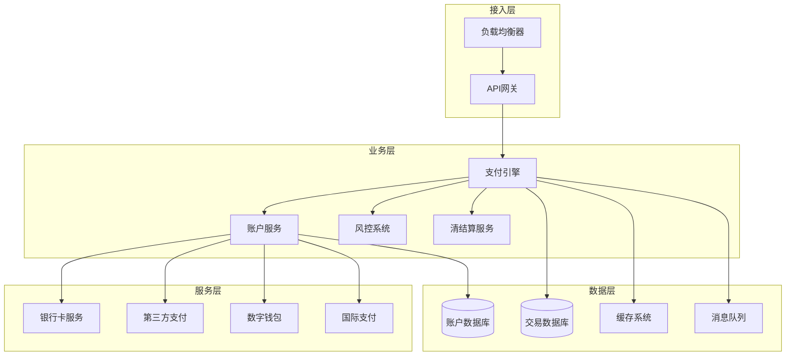
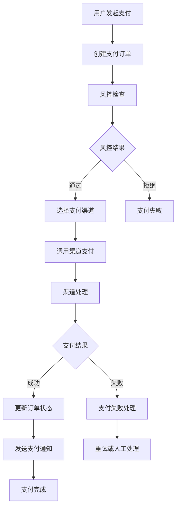
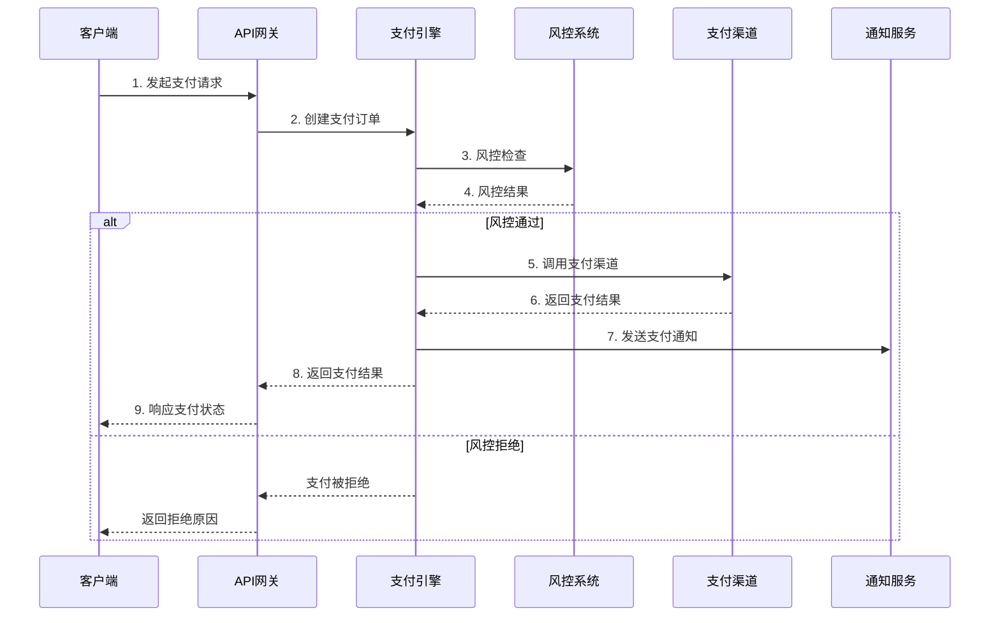
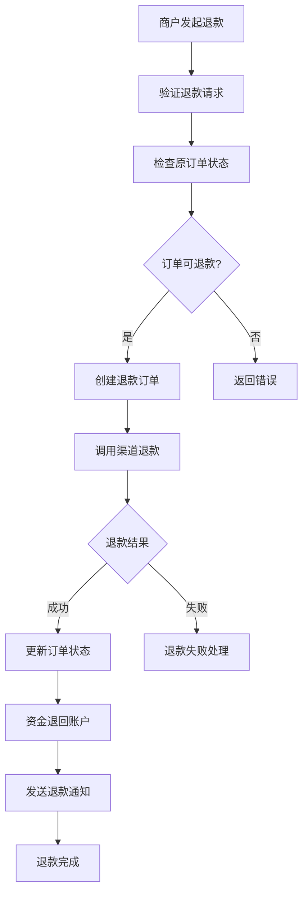
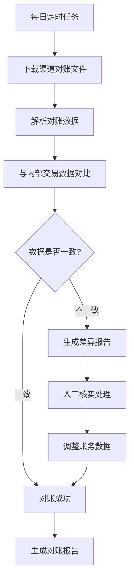

---
title: payment_system_design
date: 2025-11-17
permalink: /docs/场景题/payment_system_design/
categories:
  - Technology
  - Learning
---

# 支付系统架构设计文档

## 目录
- [1. 系统概述](#1-系统概述)
- [2. 整体架构](#2-整体架构)
- [3. 核心模块设计](#3-核心模块设计)
- [4. 数据库设计](#4-数据库设计)
- [5. 业务流程](#5-业务流程)
- [6. 安全与风控](#6-安全与风控)
- [7. 性能与监控](#7-性能与监控)

## 1. 系统概述

### 1.1 系统目标
设计一套高可用、高性能、安全可靠的支付系统，支持多种支付方式，满足C端和B端客户的支付需求。

### 1.2 核心指标
- **可用性**: 99.99%
- **并发处理能力**: 10,000+ TPS
- **响应时间**: <200ms (P95)
- **数据一致性**: 强一致性
- **安全级别**: 符合PCI-DSS标准

## 2. 整体架构

### 2.1 系统架构图



### 2.2 核心组件

```python
# 支付系统核心架构
class PaymentSystem:
    def __init__(self):
        self.account_service = AccountService()        # 账户服务
        self.wallet_service = WalletService()          # 钱包服务
        self.payment_engine = PaymentEngine()          # 支付引擎
        self.risk_control = RiskControlService()       # 风控系统
        self.settlement_service = SettlementService()  # 清结算
        self.channel_manager = ChannelManager()        # 渠道管理
```

### 2.3 分层设计

#### 接入层
- **API网关**: 统一入口、限流、认证、协议转换
- **多渠道适配**: Web、APP、H5、OpenAPI
- **协议支持**: HTTP、gRPC、WebSocket

#### 业务层
- **支付核心引擎**: 订单处理、状态管理、路由分发
- **账户管理系统**: 用户账户、商户账户、虚拟账户
- **风险控制系统**: 实时风控、反欺诈检测
- **清结算系统**: 资金清算、对账处理

#### 服务层
- **支付渠道**: 银行直连、第三方支付、国际支付
- **基础服务**: 用户认证、消息通知、日志审计

#### 数据层
- **关系数据库**: MySQL主从集群
- **缓存系统**: Redis集群
- **消息队列**: Kafka/RabbitMQ
- **搜索引擎**: Elasticsearch

## 3. 核心模块设计

### 3.1 账户和钱包管理

#### 账户实体模型

```python
class Account:
    def __init__(self):
        self.account_id: str           # 账户ID
        self.user_id: str             # 用户ID
        self.account_type: AccountType # 账户类型
        self.balance: Decimal         # 可用余额
        self.frozen_balance: Decimal  # 冻结余额
        self.currency: str           # 币种
        self.status: AccountStatus   # 账户状态
        self.created_at: datetime
        self.updated_at: datetime

# 账户类型枚举
class AccountType(Enum):
    BASIC = "basic"           # 基础账户
    MERCHANT = "merchant"     # 商户账户
    ESCROW = "escrow"        # 担保账户
    SETTLEMENT = "settlement" # 结算账户
```

#### 余额管理机制

```python
class BalanceManager:
    def transfer(self, from_account, to_account, amount):
        # 原子性转账操作 - 采用复式记账原理
        with transaction():
            # 1. 冻结源账户余额
            self.freeze_balance(from_account, amount)
            # 2. 增加目标账户余额
            self.add_balance(to_account, amount)
            # 3. 扣减源账户冻结余额
            self.unfreeze_balance(from_account, amount)
            # 4. 记录交易流水
            self.create_transaction_record()
```

### 3.2 支付流程和状态管理

#### 支付状态机

```python
class PaymentStatus(Enum):
    CREATED = "created"           # 订单创建
    PENDING = "pending"           # 待支付
    PROCESSING = "processing"     # 支付处理中
    SUCCESS = "success"           # 支付成功
    FAILED = "failed"            # 支付失败
    CANCELLED = "cancelled"       # 已取消
    REFUNDING = "refunding"       # 退款中
    REFUNDED = "refunded"         # 已退款

# 状态流转规则
STATE_TRANSITIONS = {
    PaymentStatus.CREATED: [PaymentStatus.PENDING, PaymentStatus.CANCELLED],
    PaymentStatus.PENDING: [PaymentStatus.PROCESSING, PaymentStatus.CANCELLED],
    PaymentStatus.PROCESSING: [PaymentStatus.SUCCESS, PaymentStatus.FAILED],
    PaymentStatus.SUCCESS: [PaymentStatus.REFUNDING],
    PaymentStatus.REFUNDING: [PaymentStatus.REFUNDED]
}
```

#### 支付流程图



#### 核心支付引擎

```python
class PaymentEngine:
    def process_payment(self, payment_request):
        # 1. 订单创建和验证
        order = self.create_order(payment_request)

        # 2. 风险控制检查
        risk_result = self.risk_control.evaluate(order)
        if risk_result.is_blocked():
            return self.handle_risk_block(order, risk_result)

        # 3. 路由到合适的支付渠道
        channel = self.channel_manager.select_channel(order)

        # 4. 执行支付
        payment_result = channel.execute_payment(order)

        # 5. 状态更新和通知
        self.update_payment_status(order, payment_result)
        self.notify_merchant(order, payment_result)

        return payment_result
```

### 3.3 异步处理架构

#### 消息队列设计

```python
class AsyncPaymentProcessor:
    def __init__(self):
        self.payment_queue = Queue("payment_requests")      # 支付请求队列
        self.callback_queue = Queue("payment_callbacks")    # 回调通知队列
        self.reconcile_queue = Queue("reconciliation")      # 对账处理队列
        self.dead_letter_queue = Queue("dead_letters")      # 死信队列

    def handle_async_payment(self, payment_msg):
        try:
            result = self.payment_engine.process_payment(payment_msg.data)
            self.callback_queue.push(CallbackMessage(result))
        except Exception as e:
            self.handle_payment_exception(payment_msg, e)
```

#### 重试策略

```python
class RetryStrategy:
    def __init__(self):
        self.retry_configs = {
            "network_error": {"max_retries": 3, "intervals": [1, 2, 4]},
            "system_busy": {"max_retries": 5, "intervals": [1, 2, 4, 8, 16]},
            "business_error": {"max_retries": 0, "manual_process": True}
        }
```

## 4. 数据库设计

### 4.1 核心表结构

#### 账户表 (accounts)
```sql
CREATE TABLE accounts (
    id BIGINT AUTO_INCREMENT PRIMARY KEY,
    account_no VARCHAR(32) UNIQUE NOT NULL COMMENT '账户号',
    user_id BIGINT NOT NULL COMMENT '用户ID',
    account_type ENUM('basic', 'merchant', 'escrow', 'settlement') DEFAULT 'basic',
    balance DECIMAL(20,2) DEFAULT 0.00 COMMENT '可用余额',
    frozen_balance DECIMAL(20,2) DEFAULT 0.00 COMMENT '冻结余额',
    currency VARCHAR(3) DEFAULT 'CNY' COMMENT '币种',
    status TINYINT DEFAULT 1 COMMENT '账户状态 1:正常 2:冻结 3:关闭',
    created_at TIMESTAMP DEFAULT CURRENT_TIMESTAMP,
    updated_at TIMESTAMP DEFAULT CURRENT_TIMESTAMP ON UPDATE CURRENT_TIMESTAMP,
    version INT DEFAULT 0 COMMENT '乐观锁版本号',

    INDEX idx_user_id (user_id),
    INDEX idx_account_no (account_no),
    INDEX idx_status (status),
    INDEX idx_created_at (created_at)
) ENGINE=InnoDB DEFAULT CHARSET=utf8mb4 COMMENT='账户表';
```

#### 支付订单表 (payment_orders)
```sql
CREATE TABLE payment_orders (
    id BIGINT AUTO_INCREMENT PRIMARY KEY,
    order_no VARCHAR(64) UNIQUE NOT NULL COMMENT '订单号',
    merchant_id BIGINT NOT NULL COMMENT '商户ID',
    user_id BIGINT COMMENT '用户ID',
    amount DECIMAL(20,2) NOT NULL COMMENT '支付金额',
    currency VARCHAR(3) DEFAULT 'CNY' COMMENT '币种',
    subject VARCHAR(256) NOT NULL COMMENT '订单标题',
    body TEXT COMMENT '订单描述',
    payment_method VARCHAR(32) COMMENT '支付方式',
    channel_code VARCHAR(32) COMMENT '支付渠道',
    status ENUM('created', 'pending', 'processing', 'success', 'failed', 'cancelled', 'refunding', 'refunded') DEFAULT 'created',
    channel_order_no VARCHAR(128) COMMENT '渠道订单号',
    notify_url VARCHAR(512) COMMENT '异步通知地址',
    return_url VARCHAR(512) COMMENT '同步跳转地址',
    client_ip VARCHAR(15) COMMENT '客户端IP',
    expire_time TIMESTAMP COMMENT '订单过期时间',
    paid_at TIMESTAMP NULL COMMENT '支付完成时间',
    created_at TIMESTAMP DEFAULT CURRENT_TIMESTAMP,
    updated_at TIMESTAMP DEFAULT CURRENT_TIMESTAMP ON UPDATE CURRENT_TIMESTAMP,

    INDEX idx_order_no (order_no),
    INDEX idx_merchant_id (merchant_id),
    INDEX idx_user_id (user_id),
    INDEX idx_status (status),
    INDEX idx_channel_code (channel_code),
    INDEX idx_created_at (created_at),
    INDEX idx_paid_at (paid_at)
) ENGINE=InnoDB DEFAULT CHARSET=utf8mb4 COMMENT='支付订单表';
```

#### 交易流水表 (transactions)
```sql
CREATE TABLE transactions (
    id BIGINT AUTO_INCREMENT PRIMARY KEY,
    transaction_no VARCHAR(64) UNIQUE NOT NULL COMMENT '交易流水号',
    order_no VARCHAR(64) NOT NULL COMMENT '订单号',
    account_id BIGINT NOT NULL COMMENT '账户ID',
    transaction_type ENUM('payment', 'refund', 'transfer', 'withdraw', 'deposit') NOT NULL COMMENT '交易类型',
    amount DECIMAL(20,2) NOT NULL COMMENT '交易金额',
    balance_before DECIMAL(20,2) NOT NULL COMMENT '交易前余额',
    balance_after DECIMAL(20,2) NOT NULL COMMENT '交易后余额',
    currency VARCHAR(3) DEFAULT 'CNY',
    status ENUM('pending', 'success', 'failed') DEFAULT 'pending',
    remark VARCHAR(512) COMMENT '备注',
    created_at TIMESTAMP DEFAULT CURRENT_TIMESTAMP,

    INDEX idx_transaction_no (transaction_no),
    INDEX idx_order_no (order_no),
    INDEX idx_account_id (account_id),
    INDEX idx_transaction_type (transaction_type),
    INDEX idx_status (status),
    INDEX idx_created_at (created_at)
) ENGINE=InnoDB DEFAULT CHARSET=utf8mb4 COMMENT='交易流水表';
```

#### 支付渠道表 (payment_channels)
```sql
CREATE TABLE payment_channels (
    id INT AUTO_INCREMENT PRIMARY KEY,
    channel_code VARCHAR(32) UNIQUE NOT NULL COMMENT '渠道编码',
    channel_name VARCHAR(64) NOT NULL COMMENT '渠道名称',
    channel_type ENUM('bank', 'third_party', 'wallet', 'international') NOT NULL COMMENT '渠道类型',
    config JSON COMMENT '渠道配置',
    priority INT DEFAULT 0 COMMENT '优先级',
    status TINYINT DEFAULT 1 COMMENT '状态 1:启用 0:禁用',
    min_amount DECIMAL(10,2) DEFAULT 0.01 COMMENT '最小金额',
    max_amount DECIMAL(20,2) DEFAULT 999999999.99 COMMENT '最大金额',
    fee_rate DECIMAL(6,4) DEFAULT 0.0000 COMMENT '费率',
    created_at TIMESTAMP DEFAULT CURRENT_TIMESTAMP,
    updated_at TIMESTAMP DEFAULT CURRENT_TIMESTAMP ON UPDATE CURRENT_TIMESTAMP,

    INDEX idx_channel_code (channel_code),
    INDEX idx_channel_type (channel_type),
    INDEX idx_status (status),
    INDEX idx_priority (priority)
) ENGINE=InnoDB DEFAULT CHARSET=utf8mb4 COMMENT='支付渠道表';
```

#### 商户信息表 (merchants)
```sql
CREATE TABLE merchants (
    id BIGINT AUTO_INCREMENT PRIMARY KEY,
    merchant_no VARCHAR(32) UNIQUE NOT NULL COMMENT '商户号',
    merchant_name VARCHAR(128) NOT NULL COMMENT '商户名称',
    contact_name VARCHAR(64) COMMENT '联系人',
    contact_phone VARCHAR(20) COMMENT '联系电话',
    contact_email VARCHAR(64) COMMENT '联系邮箱',
    business_license VARCHAR(64) COMMENT '营业执照号',
    api_key VARCHAR(128) COMMENT 'API密钥',
    public_key TEXT COMMENT '公钥',
    private_key TEXT COMMENT '私钥',
    status TINYINT DEFAULT 1 COMMENT '状态 1:正常 2:冻结 3:关闭',
    created_at TIMESTAMP DEFAULT CURRENT_TIMESTAMP,
    updated_at TIMESTAMP DEFAULT CURRENT_TIMESTAMP ON UPDATE CURRENT_TIMESTAMP,

    INDEX idx_merchant_no (merchant_no),
    INDEX idx_status (status),
    INDEX idx_created_at (created_at)
) ENGINE=InnoDB DEFAULT CHARSET=utf8mb4 COMMENT='商户信息表';
```

### 4.2 分库分表策略

#### 分库规则
```sql
-- 按商户ID进行分库
-- 库数: 16个
-- 分库函数: merchant_id % 16

-- 数据库命名规则
payment_db_00, payment_db_01, ..., payment_db_15
```

#### 分表规则
```sql
-- 支付订单表按时间分表
-- 表名格式: payment_orders_YYYYMM
-- 例如: payment_orders_202501, payment_orders_202502

-- 交易流水表按账户ID分表
-- 表数: 256个
-- 分表函数: account_id % 256
-- 表名格式: transactions_000, transactions_001, ..., transactions_255
```

## 5. 业务流程

### 5.1 标准支付流程



### 5.2 退款流程



### 5.3 对账流程



## 6. 安全与风控

### 6.1 安全防护机制

#### 数据加密
```python
class SecurityManager:
    def __init__(self):
        self.aes_key = self.load_aes_key()
        self.rsa_private_key = self.load_rsa_private_key()
        self.rsa_public_key = self.load_rsa_public_key()

    def encrypt_sensitive_data(self, data):
        # AES加密敏感数据
        return self.aes_encrypt(data, self.aes_key)

    def sign_request(self, data):
        # RSA签名请求数据
        return self.rsa_sign(data, self.rsa_private_key)

    def verify_signature(self, data, signature):
        # 验证RSA签名
        return self.rsa_verify(data, signature, self.rsa_public_key)
```

#### 接口安全
- **HTTPS强制**: 所有接口必须使用HTTPS
- **API签名**: 基于RSA或HMAC的请求签名
- **防重放攻击**: 时间戳+随机数验证
- **限流控制**: 基于IP、用户、商户的多维限流

### 6.2 风控系统设计

#### 实时风控引擎
```python
class RiskControlEngine:
    def __init__(self):
        self.rule_engine = RuleEngine()
        self.ml_model = MachineLearningModel()
        self.blacklist_service = BlacklistService()

    def evaluate_risk(self, payment_request):
        # 1. 黑名单检查
        if self.blacklist_service.is_blocked(payment_request):
            return RiskResult.BLOCK

        # 2. 规则引擎检查
        rule_result = self.rule_engine.evaluate(payment_request)
        if rule_result.score > 80:
            return RiskResult.BLOCK

        # 3. 机器学习模型预测
        ml_result = self.ml_model.predict(payment_request)
        if ml_result.fraud_probability > 0.8:
            return RiskResult.REVIEW

        return RiskResult.PASS
```

#### 风控规则示例
```python
RISK_RULES = {
    "amount_limit": {
        "single_limit": 50000,      # 单笔限额
        "daily_limit": 200000,      # 日限额
        "monthly_limit": 1000000    # 月限额
    },
    "frequency_limit": {
        "per_minute": 10,           # 每分钟最多10笔
        "per_hour": 100,            # 每小时最多100笔
        "per_day": 1000             # 每天最多1000笔
    },
    "device_check": {
        "new_device_limit": 1000,   # 新设备限额
        "high_risk_device_block": True  # 高风险设备拦截
    }
}
```

## 7. 性能与监控

### 7.1 性能优化策略

#### 缓存设计
```python
class CacheManager:
    def __init__(self):
        self.redis_client = Redis()
        self.local_cache = LocalCache()

    def get_account_info(self, account_id):
        # 三级缓存策略
        # L1: 本地缓存 (1秒过期)
        result = self.local_cache.get(f"account:{account_id}")
        if result:
            return result

        # L2: Redis缓存 (5分钟过期)
        result = self.redis_client.get(f"account:{account_id}")
        if result:
            self.local_cache.set(f"account:{account_id}", result, 1)
            return result

        # L3: 数据库查询
        result = self.db.query_account(account_id)
        self.redis_client.setex(f"account:{account_id}", 300, result)
        self.local_cache.set(f"account:{account_id}", result, 1)
        return result
```

#### 数据库优化
- **读写分离**: 主库写入，从库查询
- **连接池**: 合理配置连接池大小
- **索引优化**: 基于查询模式设计索引
- **分区表**: 按时间分区存储历史数据

### 7.2 监控告警体系

#### 关键指标监控
```python
MONITORING_METRICS = {
    "business_metrics": {
        "payment_success_rate": {"threshold": 0.995, "alert": "low"},
        "avg_response_time": {"threshold": 200, "unit": "ms", "alert": "high"},
        "transaction_volume": {"threshold": 10000, "unit": "tps", "alert": "high"}
    },
    "system_metrics": {
        "cpu_usage": {"threshold": 80, "unit": "%", "alert": "high"},
        "memory_usage": {"threshold": 85, "unit": "%", "alert": "high"},
        "disk_usage": {"threshold": 90, "unit": "%", "alert": "high"}
    },
    "error_metrics": {
        "error_rate": {"threshold": 0.01, "alert": "high"},
        "timeout_rate": {"threshold": 0.005, "alert": "high"}
    }
}
```

#### 告警规则配置
```yaml
# 告警规则配置
alert_rules:
  - name: payment_success_rate_low
    condition: payment_success_rate < 99.5%
    duration: 2m
    severity: critical

  - name: response_time_high
    condition: avg_response_time > 500ms
    duration: 1m
    severity: warning

  - name: system_error_rate_high
    condition: error_rate > 1%
    duration: 1m
    severity: critical
```

### 7.3 容灾与备份

#### 容灾架构
- **双机房部署**: 主备机房，自动切换
- **数据实时同步**: 基于Binlog的数据同步
- **应用无状态**: 支持水平扩展和快速恢复
- **定期演练**: 每月进行容灾切换演练

#### 备份策略
- **数据库备份**: 每小时增量备份，每天全量备份
- **文件备份**: 重要配置文件定期备份
- **异地备份**: 备份数据存储在不同地域
- **恢复测试**: 定期验证备份数据可用性

## 8. 部署与运维

### 8.1 部署架构

```yaml
# Docker Compose 部署示例
version: '3.8'
services:
  payment-gateway:
    image: payment/gateway:latest
    ports:
      - "8080:8080"
    environment:
      - DB_HOST=mysql-master
      - REDIS_HOST=redis-cluster
    depends_on:
      - mysql-master
      - redis-cluster

  payment-engine:
    image: payment/engine:latest
    environment:
      - DB_HOST=mysql-master
      - MQ_HOST=kafka-cluster
    depends_on:
      - mysql-master
      - kafka-cluster

  mysql-master:
    image: mysql:8.0
    environment:
      MYSQL_ROOT_PASSWORD: payment123
    volumes:
      - mysql-data:/var/lib/mysql

  redis-cluster:
    image: redis:6.2
    command: redis-server --cluster-enabled yes
```

### 8.2 运维工具

#### 日志管理
- **ELK Stack**: Elasticsearch + Logstash + Kibana
- **日志级别**: DEBUG、INFO、WARN、ERROR、FATAL
- **结构化日志**: JSON格式，便于检索和分析
- **日志轮转**: 按大小和时间轮转，避免磁盘满

#### 配置管理
- **配置中心**: Apollo/Nacos统一配置管理
- **环境隔离**: 开发、测试、生产环境配置分离
- **动态配置**: 支持配置热更新
- **配置审计**: 记录配置变更历史

## 9. 总结

本支付系统设计文档涵盖了从架构设计到具体实现的各个方面，主要特点包括：

### 9.1 核心优势
- **高可用性**: 通过微服务架构、容器化部署、多机房容灾保证系统高可用
- **高性能**: 采用缓存、分库分表、异步处理等技术提升系统性能
- **强安全性**: 多层次安全防护，符合金融级安全标准
- **易扩展性**: 微服务架构支持业务快速迭代和扩展

### 9.2 技术栈
- **后端框架**: Spring Boot + Spring Cloud
- **数据库**: MySQL 8.0 (主从集群)
- **缓存**: Redis Cluster
- **消息队列**: Apache Kafka
- **容器化**: Docker + Kubernetes
- **监控**: Prometheus + Grafana
- **日志**: ELK Stack

### 9.3 下一步工作
1. 完善风控和安全防护机制
2. 实现对账和清结算系统
3. 搭建监控告警体系
4. 进行性能压测和优化
5. 编写详细的API文档

---

**文档版本**: v1.0
**创建时间**: 2024-09-24
**作者**: Payment System Team