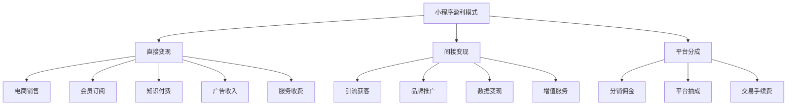
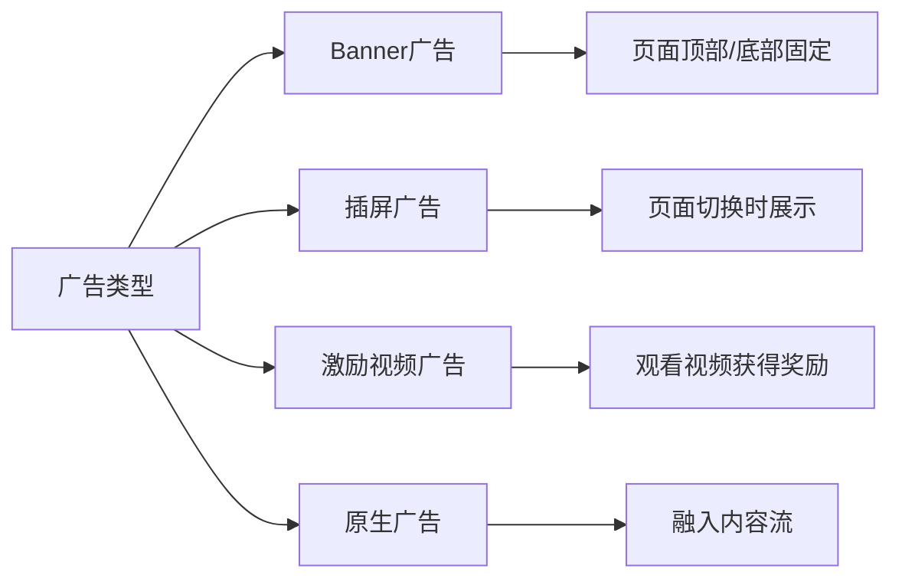
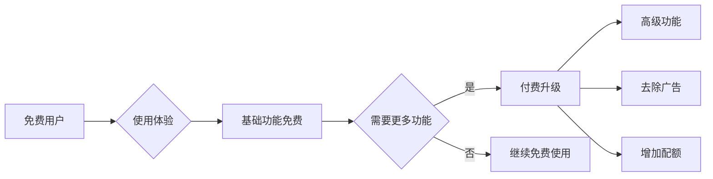

---
title: 如何利用小程序赚钱
date: 2025-01-13
permalink: /miniprogram/monetization.html
categories:
  - Technology
  - Learning
---

# 如何利用小程序赚钱

本文详细介绍小程序的各种盈利模式、变现方法和实战案例,帮助开发者和创业者找到适合自己的商业模式。

## 盈利模式概览



## 一、电商销售模式

### 1.1 自营电商

**核心模式:**
通过小程序直接销售商品,赚取商品差价和利润。

**适用场景:**
- 有自己的产品或货源
- 品牌商、制造商
- 本地实体店转型线上

**盈利方式:**
```
利润 = 销售额 - 成本 - 运营费用
```

**实现方案:**

```java
/**
 * 商品订单处理
 */
public class OrderService {

    /**
     * 创建订单
     */
    public OrderDTO createOrder(CreateOrderRequest request) {
        // 1. 验证商品库存
        validateStock(request.getProductId(), request.getQuantity());

        // 2. 计算订单金额
        BigDecimal totalAmount = calculateAmount(request);

        // 3. 创建订单记录
        Order order = new Order();
        order.setUserId(request.getUserId());
        order.setTotalAmount(totalAmount);
        order.setStatus(OrderStatus.PENDING);
        orderRepository.save(order);

        // 4. 扣减库存
        deductStock(request.getProductId(), request.getQuantity());

        // 5. 返回订单信息
        return convertToDTO(order);
    }

    /**
     * 计算订单金额(含优惠)
     */
    private BigDecimal calculateAmount(CreateOrderRequest request) {
        // 商品原价
        BigDecimal originalPrice = getProductPrice(request.getProductId());
        BigDecimal subtotal = originalPrice.multiply(
            new BigDecimal(request.getQuantity())
        );

        // 应用优惠券
        if (request.getCouponId() != null) {
            BigDecimal discount = applyCoupon(request.getCouponId(), subtotal);
            subtotal = subtotal.subtract(discount);
        }

        // 会员折扣
        if (isVipUser(request.getUserId())) {
            subtotal = subtotal.multiply(new BigDecimal("0.95")); // 95折
        }

        return subtotal;
    }
}
```

**成功案例:**
- **拼多多**: 社交电商,通过拼团模式降低获客成本
- **小红书商城**: 内容+电商,种草+拔草闭环
- **有赞**: 为商家提供小程序电商解决方案

**关键成功因素:**
- ✅ 选品能力: 找到有市场需求的产品
- ✅ 供应链管理: 保证货源稳定和成本优势
- ✅ 用户运营: 提高复购率和客单价
- ✅ 营销推广: 流量获取和转化

### 1.2 分销/代理模式

**核心模式:**
帮助其他商家销售商品,赚取佣金。

**盈利公式:**
```
收入 = 销售额 × 佣金比例
```

**实现方案:**

```java
/**
 * 分销系统
 */
public class DistributionService {

    /**
     * 用户注册成为分销员
     */
    public DistributorDTO registerDistributor(Long userId) {
        // 检查用户资格
        validateUserQualification(userId);

        // 创建分销员记录
        Distributor distributor = new Distributor();
        distributor.setUserId(userId);
        distributor.setLevel(1); // 初级分销员
        distributor.setCommissionRate(new BigDecimal("0.10")); // 10%佣金
        distributorRepository.save(distributor);

        // 生成专属推广码
        String promoCode = generatePromoCode(userId);
        distributor.setPromoCode(promoCode);

        return convertToDTO(distributor);
    }

    /**
     * 计算分销佣金
     */
    public void calculateCommission(Order order) {
        // 获取推荐人
        Long referrerId = order.getReferrerId();
        if (referrerId == null) {
            return;
        }

        Distributor distributor = distributorRepository.findByUserId(referrerId);

        // 计算佣金金额
        BigDecimal orderAmount = order.getTotalAmount();
        BigDecimal commission = orderAmount.multiply(distributor.getCommissionRate());

        // 记录佣金
        CommissionRecord record = new CommissionRecord();
        record.setDistributorId(distributor.getId());
        record.setOrderId(order.getId());
        record.setAmount(commission);
        record.setStatus(CommissionStatus.PENDING);
        commissionRepository.save(record);

        // 多级分销(如果有上级)
        if (distributor.getParentId() != null) {
            calculateSecondLevelCommission(order, distributor.getParentId());
        }
    }

    /**
     * 二级分销佣金
     */
    private void calculateSecondLevelCommission(Order order, Long parentId) {
        Distributor parent = distributorRepository.findById(parentId).orElse(null);
        if (parent == null) {
            return;
        }

        // 上级分销员获得5%佣金
        BigDecimal commission = order.getTotalAmount()
            .multiply(new BigDecimal("0.05"));

        CommissionRecord record = new CommissionRecord();
        record.setDistributorId(parent.getId());
        record.setOrderId(order.getId());
        record.setAmount(commission);
        record.setLevel(2); // 二级佣金
        commissionRepository.save(record);
    }
}
```

**优势:**
- 无需囤货,零库存风险
- 启动成本低
- 可批量对接多个供应商

**适合人群:**
- 有一定粉丝基础的个人
- 社群运营者
- KOC(关键意见消费者)

## 二、会员订阅模式

### 2.1 付费会员体系

**核心模式:**
用户支付会员费,享受专属权益和服务。

**盈利方式:**
```
收入 = 会员数量 × 会员单价
```

**会员权益设计:**

```java
/**
 * 会员体系
 */
public class MembershipService {

    /**
     * 会员等级定义
     */
    public enum MemberLevel {
        FREE(0, "免费会员", BigDecimal.ZERO),
        SILVER(1, "银卡会员", new BigDecimal("29.9")),
        GOLD(2, "金卡会员", new BigDecimal("99")),
        PLATINUM(3, "铂金会员", new BigDecimal("299"));

        private int level;
        private String name;
        private BigDecimal price;

        MemberLevel(int level, String name, BigDecimal price) {
            this.level = level;
            this.name = name;
            this.price = price;
        }
    }

    /**
     * 会员权益配置
     */
    public class MemberBenefits {
        private boolean freeShipping;        // 免运费
        private BigDecimal discountRate;     // 折扣率
        private int monthlyFreebies;         // 每月免费次数
        private boolean prioritySupport;     // 优先客服
        private boolean exclusiveContent;    // 专属内容

        public static MemberBenefits getByLevel(MemberLevel level) {
            MemberBenefits benefits = new MemberBenefits();

            switch (level) {
                case PLATINUM:
                    benefits.setFreeShipping(true);
                    benefits.setDiscountRate(new BigDecimal("0.85")); // 85折
                    benefits.setMonthlyFreebies(30);
                    benefits.setPrioritySupport(true);
                    benefits.setExclusiveContent(true);
                    break;
                case GOLD:
                    benefits.setFreeShipping(true);
                    benefits.setDiscountRate(new BigDecimal("0.90")); // 9折
                    benefits.setMonthlyFreebies(15);
                    benefits.setPrioritySupport(true);
                    break;
                case SILVER:
                    benefits.setDiscountRate(new BigDecimal("0.95")); // 95折
                    benefits.setMonthlyFreebies(5);
                    break;
                default:
                    break;
            }

            return benefits;
        }
    }

    /**
     * 开通会员
     */
    public void activateMembership(Long userId, MemberLevel level, int months) {
        // 创建会员订单
        MembershipOrder order = new MembershipOrder();
        order.setUserId(userId);
        order.setLevel(level);
        order.setMonths(months);
        order.setAmount(level.getPrice().multiply(new BigDecimal(months)));

        // 保存订单
        membershipOrderRepository.save(order);

        // 更新用户会员信息
        UserMembership membership = userMembershipRepository
            .findByUserId(userId)
            .orElse(new UserMembership());

        membership.setUserId(userId);
        membership.setLevel(level);
        membership.setExpireTime(calculateExpireTime(months));
        userMembershipRepository.save(membership);

        // 发送开通通知
        sendActivationNotification(userId, level, months);
    }

    /**
     * 检查会员权益
     */
    public boolean hasPermission(Long userId, String permission) {
        UserMembership membership = userMembershipRepository
            .findByUserId(userId)
            .orElse(null);

        // 未开通会员或已过期
        if (membership == null || membership.isExpired()) {
            return false;
        }

        MemberBenefits benefits = MemberBenefits.getByLevel(membership.getLevel());

        // 根据权益类型判断
        switch (permission) {
            case "FREE_SHIPPING":
                return benefits.isFreeShipping();
            case "PRIORITY_SUPPORT":
                return benefits.isPrioritySupport();
            case "EXCLUSIVE_CONTENT":
                return benefits.isExclusiveContent();
            default:
                return false;
        }
    }
}
```

**定价策略:**
- **月度会员**: 19.9-49.9元/月
- **季度会员**: 49.9-99元/季(打9折)
- **年度会员**: 149-299元/年(打7-8折)

**成功案例:**
- **樊登读书**: 年费365元,每年解读52本书
- **得到**: 199元/年,专栏+课程+电子书
- **腾讯视频**: 会员观看独播内容

### 2.2 订阅制服务

**核心模式:**
定期提供产品或服务,用户按月/季/年订阅。

**适用场景:**
- 内容订阅(杂志、专栏、课程)
- 商品订阅(鲜花、咖啡、水果)
- 服务订阅(健身、美容、咨询)

**实现示例:**

```java
/**
 * 订阅服务
 */
public class SubscriptionService {

    /**
     * 订阅计划
     */
    public class SubscriptionPlan {
        private Long id;
        private String name;           // 计划名称
        private String description;    // 计划描述
        private BigDecimal price;      // 价格
        private int duration;          // 周期(天)
        private int deliveryCount;     // 配送次数
        private String deliveryRule;   // 配送规则(每周一、周三)
    }

    /**
     * 创建订阅
     */
    public SubscriptionDTO subscribe(Long userId, Long planId) {
        SubscriptionPlan plan = planRepository.findById(planId).orElseThrow();

        // 创建订阅记录
        Subscription subscription = new Subscription();
        subscription.setUserId(userId);
        subscription.setPlanId(planId);
        subscription.setStartDate(LocalDate.now());
        subscription.setEndDate(LocalDate.now().plusDays(plan.getDuration()));
        subscription.setStatus(SubscriptionStatus.ACTIVE);
        subscription.setRemainingDeliveries(plan.getDeliveryCount());

        subscriptionRepository.save(subscription);

        // 生成配送计划
        generateDeliverySchedule(subscription, plan);

        return convertToDTO(subscription);
    }

    /**
     * 生成配送计划
     */
    private void generateDeliverySchedule(Subscription subscription,
                                         SubscriptionPlan plan) {
        LocalDate currentDate = subscription.getStartDate();
        LocalDate endDate = subscription.getEndDate();
        int deliveryCount = 0;

        while (currentDate.isBefore(endDate) &&
               deliveryCount < plan.getDeliveryCount()) {

            // 根据配送规则判断是否配送
            if (shouldDeliverOnDate(currentDate, plan.getDeliveryRule())) {
                DeliverySchedule schedule = new DeliverySchedule();
                schedule.setSubscriptionId(subscription.getId());
                schedule.setScheduledDate(currentDate);
                schedule.setStatus(DeliveryStatus.PENDING);
                deliveryScheduleRepository.save(schedule);

                deliveryCount++;
            }

            currentDate = currentDate.plusDays(1);
        }
    }

    /**
     * 自动续费
     */
    @Scheduled(cron = "0 0 2 * * ?") // 每天凌晨2点执行
    public void autoRenewal() {
        // 查找即将到期的订阅(3天内)
        LocalDate expiryDate = LocalDate.now().plusDays(3);
        List<Subscription> expiringSubs = subscriptionRepository
            .findByEndDateAndAutoRenewal(expiryDate, true);

        for (Subscription sub : expiringSubs) {
            try {
                // 扣费
                paymentService.charge(sub.getUserId(), sub.getPlanPrice());

                // 续期
                sub.setEndDate(sub.getEndDate().plusDays(sub.getPlanDuration()));
                subscriptionRepository.save(sub);

                // 发送续费成功通知
                notificationService.sendRenewalSuccess(sub.getUserId());

            } catch (PaymentException e) {
                // 扣费失败,发送通知
                notificationService.sendRenewalFailed(sub.getUserId());
            }
        }
    }
}
```

**优势:**
- 稳定的现金流
- 用户生命周期价值(LTV)高
- 降低获客成本

## 三、知识付费模式

### 3.1 在线课程

**核心模式:**
制作和销售在线课程,用户一次性购买或订阅学习。

**盈利方式:**
```
收入 = 课程销量 × 课程单价
```

**课程体系设计:**

```java
/**
 * 课程系统
 */
public class CourseService {

    /**
     * 课程类型
     */
    public enum CourseType {
        FREE,          // 免费课程
        PAID,          // 付费课程
        MEMBERSHIP     // 会员专享
    }

    /**
     * 课程定价策略
     */
    public class CoursePricing {
        private BigDecimal originalPrice;   // 原价
        private BigDecimal currentPrice;    // 现价
        private BigDecimal memberPrice;     // 会员价
        private LocalDateTime promotionEnd; // 促销截止时间

        public BigDecimal getPrice(Long userId) {
            // 会员价
            if (membershipService.isVip(userId)) {
                return memberPrice;
            }

            // 促销价
            if (promotionEnd != null &&
                LocalDateTime.now().isBefore(promotionEnd)) {
                return currentPrice;
            }

            // 原价
            return originalPrice;
        }
    }

    /**
     * 购买课程
     */
    public CourseOrderDTO purchaseCourse(Long userId, Long courseId) {
        Course course = courseRepository.findById(courseId).orElseThrow();

        // 检查是否已购买
        if (userCourseRepository.existsByUserIdAndCourseId(userId, courseId)) {
            throw new BusinessException("已购买该课程");
        }

        // 计算价格
        CoursePricing pricing = course.getPricing();
        BigDecimal price = pricing.getPrice(userId);

        // 创建订单
        CourseOrder order = new CourseOrder();
        order.setUserId(userId);
        order.setCourseId(courseId);
        order.setAmount(price);
        order.setStatus(OrderStatus.PENDING);
        courseOrderRepository.save(order);

        return convertToDTO(order);
    }

    /**
     * 解锁课程
     */
    public void unlockCourse(Long userId, Long courseId) {
        UserCourse userCourse = new UserCourse();
        userCourse.setUserId(userId);
        userCourse.setCourseId(courseId);
        userCourse.setPurchaseTime(LocalDateTime.now());
        userCourse.setProgress(0);
        userCourseRepository.save(userCourse);

        // 发送购买成功通知
        notificationService.sendPurchaseSuccess(userId, courseId);
    }

    /**
     * 学习进度跟踪
     */
    public void updateProgress(Long userId, Long courseId, Long lessonId) {
        UserCourse userCourse = userCourseRepository
            .findByUserIdAndCourseId(userId, courseId)
            .orElseThrow();

        // 记录学习记录
        LearningRecord record = new LearningRecord();
        record.setUserId(userId);
        record.setCourseId(courseId);
        record.setLessonId(lessonId);
        record.setCompletedAt(LocalDateTime.now());
        learningRecordRepository.save(record);

        // 更新总进度
        int totalLessons = lessonRepository.countByCourseId(courseId);
        int completedLessons = learningRecordRepository
            .countByUserIdAndCourseId(userId, courseId);

        int progress = (completedLessons * 100) / totalLessons;
        userCourse.setProgress(progress);
        userCourseRepository.save(userCourse);

        // 完成课程时发送证书
        if (progress == 100) {
            certificateService.issueCertificate(userId, courseId);
        }
    }
}
```

**定价参考:**
- **入门课程**: 9.9-49元
- **系统课程**: 99-299元
- **专业课程**: 299-999元
- **训练营**: 1999-9999元

**成功案例:**
- **网易云课堂**: 职业技能课程
- **知乎Live**: 付费问答和讲座
- **千聊**: 知识付费工具平台

### 3.2 付费咨询

**核心模式:**
提供一对一或一对多的专业咨询服务。

**盈利方式:**
```
收入 = 咨询次数 × 单次价格
或
收入 = 咨询时长 × 时薪
```

**实现方案:**

```java
/**
 * 咨询服务
 */
public class ConsultationService {

    /**
     * 咨询师资料
     */
    public class Consultant {
        private Long id;
        private String name;
        private String title;           // 职称
        private String expertise;       // 专长领域
        private BigDecimal pricePerHour; // 时薪
        private int rating;             // 评分
        private int consultationCount;  // 咨询次数
    }

    /**
     * 预约咨询
     */
    public ConsultationDTO bookConsultation(BookingRequest request) {
        Consultant consultant = consultantRepository
            .findById(request.getConsultantId())
            .orElseThrow();

        // 检查时间是否可用
        if (!isTimeSlotAvailable(request.getConsultantId(),
                                  request.getScheduledTime())) {
            throw new BusinessException("该时间段已被预约");
        }

        // 计算费用
        int duration = request.getDuration(); // 分钟
        BigDecimal amount = consultant.getPricePerHour()
            .multiply(new BigDecimal(duration))
            .divide(new BigDecimal(60), 2, RoundingMode.HALF_UP);

        // 创建咨询记录
        Consultation consultation = new Consultation();
        consultation.setUserId(request.getUserId());
        consultation.setConsultantId(request.getConsultantId());
        consultation.setScheduledTime(request.getScheduledTime());
        consultation.setDuration(duration);
        consultation.setAmount(amount);
        consultation.setStatus(ConsultationStatus.PENDING);
        consultationRepository.save(consultation);

        return convertToDTO(consultation);
    }

    /**
     * 开始咨询
     */
    public void startConsultation(Long consultationId) {
        Consultation consultation = consultationRepository
            .findById(consultationId)
            .orElseThrow();

        consultation.setStatus(ConsultationStatus.IN_PROGRESS);
        consultation.setActualStartTime(LocalDateTime.now());
        consultationRepository.save(consultation);

        // 通知双方
        notificationService.notifyConsultationStart(consultation);
    }

    /**
     * 结束咨询
     */
    public void completeConsultation(Long consultationId) {
        Consultation consultation = consultationRepository
            .findById(consultationId)
            .orElseThrow();

        consultation.setStatus(ConsultationStatus.COMPLETED);
        consultation.setActualEndTime(LocalDateTime.now());
        consultationRepository.save(consultation);

        // 结算给咨询师(平台抽成20%)
        BigDecimal consultantIncome = consultation.getAmount()
            .multiply(new BigDecimal("0.80"));

        settlementService.settle(
            consultation.getConsultantId(),
            consultantIncome
        );

        // 请求用户评价
        notificationService.requestReview(
            consultation.getUserId(),
            consultationId
        );
    }
}
```

**适用场景:**
- 法律咨询
- 心理咨询
- 职业规划
- 健康咨询
- 技术支持

## 四、广告收入模式

### 4.1 流量变现

**核心模式:**
在小程序中展示广告,按展示或点击收费。

**盈利方式:**
```
收入 = 广告展示量 × CPM / 1000
或
收入 = 广告点击量 × CPC
```

**广告类型:**



**实现方案:**

```java
/**
 * 广告系统
 */
public class AdvertisementService {

    /**
     * 广告位配置
     */
    public class AdPlacement {
        private String placementId;     // 广告位ID
        private String type;            // 广告类型
        private String position;        // 位置
        private BigDecimal cpm;         // 千次展示收益
        private BigDecimal cpc;         // 单次点击收益
    }

    /**
     * 获取广告
     */
    public AdDTO getAd(String placementId, Long userId) {
        AdPlacement placement = adPlacementRepository
            .findById(placementId)
            .orElseThrow();

        // 根据用户画像匹配广告
        List<Advertisement> matchedAds = matchAds(userId, placement);

        if (matchedAds.isEmpty()) {
            return null;
        }

        // 选择出价最高的广告
        Advertisement selectedAd = selectHighestBidAd(matchedAds);

        // 记录广告展示
        recordAdImpression(selectedAd.getId(), userId, placementId);

        return convertToDTO(selectedAd);
    }

    /**
     * 记录广告展示
     */
    private void recordAdImpression(Long adId, Long userId, String placementId) {
        AdImpression impression = new AdImpression();
        impression.setAdId(adId);
        impression.setUserId(userId);
        impression.setPlacementId(placementId);
        impression.setTimestamp(LocalDateTime.now());
        adImpressionRepository.save(impression);

        // 异步更新统计数据
        asyncUpdateAdStats(adId, "impression");
    }

    /**
     * 记录广告点击
     */
    public void recordAdClick(Long adId, Long userId) {
        AdClick click = new AdClick();
        click.setAdId(adId);
        click.setUserId(userId);
        click.setTimestamp(LocalDateTime.now());
        adClickRepository.save(click);

        // 异步更新统计数据
        asyncUpdateAdStats(adId, "click");
    }

    /**
     * 计算广告收益
     */
    @Scheduled(cron = "0 0 3 * * ?") // 每天凌晨3点结算
    public void calculateAdRevenue() {
        LocalDate yesterday = LocalDate.now().minusDays(1);

        // 统计每个广告的展示和点击
        List<AdStats> statsList = adStatsRepository.findByDate(yesterday);

        for (AdStats stats : statsList) {
            Advertisement ad = advertisementRepository
                .findById(stats.getAdId())
                .orElse(null);

            if (ad == null) continue;

            // 计算收益
            BigDecimal revenue = BigDecimal.ZERO;

            // CPM收益
            if (ad.getCpm() != null) {
                revenue = revenue.add(
                    ad.getCpm()
                        .multiply(new BigDecimal(stats.getImpressions()))
                        .divide(new BigDecimal(1000), 2, RoundingMode.HALF_UP)
                );
            }

            // CPC收益
            if (ad.getCpc() != null) {
                revenue = revenue.add(
                    ad.getCpc().multiply(new BigDecimal(stats.getClicks()))
                );
            }

            // 保存收益记录
            AdRevenue revenueRecord = new AdRevenue();
            revenueRecord.setDate(yesterday);
            revenueRecord.setAdId(stats.getAdId());
            revenueRecord.setImpressions(stats.getImpressions());
            revenueRecord.setClicks(stats.getClicks());
            revenueRecord.setRevenue(revenue);
            adRevenueRepository.save(revenueRecord);
        }
    }
}
```

**收益参考:**
- **Banner广告**: CPM 5-20元
- **插屏广告**: CPM 20-50元
- **激励视频**: CPC 0.5-2元
- **原生广告**: CPM 10-30元

**接入平台:**
- **微信广告**: 官方广告平台
- **腾讯广告联盟**: 更多广告资源
- **穿山甲**: 字节跳动广告平台

### 4.2 品牌合作

**核心模式:**
与品牌方合作,在小程序中进行软性推广。

**盈利方式:**
- 固定广告费
- CPS(按销售分成)
- CPL(按潜在客户数收费)

## 五、服务收费模式

### 5.1 工具/SaaS服务

**核心模式:**
提供在线工具或SaaS服务,按使用次数或功能收费。

**盈利方式:**
```
收入 = 付费用户数 × 客单价
```

**定价模型:**

```java
/**
 * SaaS定价系统
 */
public class SaasPricingService {

    /**
     * 订阅套餐
     */
    public enum SubscriptionTier {
        FREE("免费版", BigDecimal.ZERO,
             100, false, false),
        BASIC("基础版", new BigDecimal("29"),
              1000, true, false),
        PRO("专业版", new BigDecimal("99"),
            10000, true, true),
        ENTERPRISE("企业版", new BigDecimal("499"),
                   -1, true, true);

        private String name;
        private BigDecimal monthlyPrice;
        private int quota;              // 每月配额(-1表示无限)
        private boolean prioritySupport; // 优先支持
        private boolean advancedFeatures; // 高级功能

        SubscriptionTier(String name, BigDecimal monthlyPrice,
                        int quota, boolean prioritySupport,
                        boolean advancedFeatures) {
            this.name = name;
            this.monthlyPrice = monthlyPrice;
            this.quota = quota;
            this.prioritySupport = prioritySupport;
            this.advancedFeatures = advancedFeatures;
        }
    }

    /**
     * 使用量计费
     */
    public class UsageBasedPricing {

        public BigDecimal calculateCost(int usage, SubscriptionTier tier) {
            // 套餐内免费
            if (tier.getQuota() == -1 || usage <= tier.getQuota()) {
                return BigDecimal.ZERO;
            }

            // 超出部分按量收费
            int excessUsage = usage - tier.getQuota();
            BigDecimal unitPrice = getUnitPrice(tier);

            return unitPrice.multiply(new BigDecimal(excessUsage));
        }

        private BigDecimal getUnitPrice(SubscriptionTier tier) {
            switch (tier) {
                case FREE:
                case BASIC:
                    return new BigDecimal("0.10");  // 每次0.1元
                case PRO:
                    return new BigDecimal("0.05");  // 每次0.05元
                case ENTERPRISE:
                    return new BigDecimal("0.02");  // 每次0.02元
                default:
                    return BigDecimal.ZERO;
            }
        }
    }

    /**
     * 检查使用额度
     */
    public boolean checkQuota(Long userId, String feature) {
        UserSubscription subscription = subscriptionRepository
            .findByUserId(userId)
            .orElse(null);

        SubscriptionTier tier = subscription != null
            ? subscription.getTier()
            : SubscriptionTier.FREE;

        // 检查功能权限
        if (isAdvancedFeature(feature) && !tier.isAdvancedFeatures()) {
            return false;
        }

        // 检查使用配额
        UsageRecord usage = usageRepository
            .findByUserIdAndMonth(userId, LocalDate.now())
            .orElse(new UsageRecord());

        int currentUsage = usage.getCount();
        int quota = tier.getQuota();

        // 无限配额
        if (quota == -1) {
            return true;
        }

        return currentUsage < quota;
    }
}
```

**适用场景:**
- 图片处理工具
- PDF转换工具
- 数据分析工具
- 设计工具
- 开发者工具

**成功案例:**
- **创客贴**: 在线设计工具
- **石墨文档**: 在线协作文档
- **有道云笔记**: 云端笔记服务

### 5.2 预约服务

**核心模式:**
提供线上预约,线下服务的O2O模式。

**盈利方式:**
```
收入 = 订单数量 × 服务单价
或
收入 = 平台服务费(订单金额 × 抽成比例)
```

**实现示例:**

```java
/**
 * 预约服务系统
 */
public class BookingService {

    /**
     * 服务提供者
     */
    public class ServiceProvider {
        private Long id;
        private String name;
        private String category;        // 服务类目
        private BigDecimal basePrice;   // 基础价格
        private String location;        // 服务地点
        private int rating;             // 评分
        private List<TimeSlot> availableSlots; // 可用时段
    }

    /**
     * 创建预约
     */
    public BookingDTO createBooking(BookingRequest request) {
        ServiceProvider provider = providerRepository
            .findById(request.getProviderId())
            .orElseThrow();

        // 验证时间段是否可用
        if (!isTimeSlotAvailable(request.getProviderId(),
                                  request.getScheduledTime())) {
            throw new BusinessException("该时间段不可用");
        }

        // 计算服务费用
        BigDecimal serviceCharge = calculateServiceCharge(
            provider,
            request.getServiceType()
        );

        // 创建预约订单
        Booking booking = new Booking();
        booking.setUserId(request.getUserId());
        booking.setProviderId(request.getProviderId());
        booking.setScheduledTime(request.getScheduledTime());
        booking.setServiceType(request.getServiceType());
        booking.setAmount(serviceCharge);
        booking.setStatus(BookingStatus.PENDING);
        bookingRepository.save(booking);

        // 锁定时间段
        lockTimeSlot(request.getProviderId(), request.getScheduledTime());

        return convertToDTO(booking);
    }

    /**
     * 确认预约
     */
    public void confirmBooking(Long bookingId, boolean accepted) {
        Booking booking = bookingRepository.findById(bookingId).orElseThrow();

        if (accepted) {
            booking.setStatus(BookingStatus.CONFIRMED);

            // 发送确认通知
            notificationService.sendBookingConfirmation(
                booking.getUserId(),
                booking
            );
        } else {
            booking.setStatus(BookingStatus.REJECTED);

            // 释放时间段
            releaseTimeSlot(
                booking.getProviderId(),
                booking.getScheduledTime()
            );

            // 退款
            refundService.refund(bookingId);
        }

        bookingRepository.save(booking);
    }

    /**
     * 服务完成
     */
    public void completeService(Long bookingId) {
        Booking booking = bookingRepository.findById(bookingId).orElseThrow();

        booking.setStatus(BookingStatus.COMPLETED);
        booking.setCompletedAt(LocalDateTime.now());
        bookingRepository.save(booking);

        // 结算给服务提供者(平台抽成15%)
        BigDecimal providerIncome = booking.getAmount()
            .multiply(new BigDecimal("0.85"));

        settlementService.settle(booking.getProviderId(), providerIncome);

        // 请求用户评价
        notificationService.requestReview(booking.getUserId(), bookingId);
    }
}
```

**适用行业:**
- 美容美发
- 家政服务
- 健身教练
- 摄影服务
- 维修服务
- 医疗预约

## 六、平台抽成模式

### 6.1 交易平台

**核心模式:**
搭建交易平台,撮合买卖双方,从交易中抽成。

**盈利方式:**
```
收入 = 交易总额 × 抽成比例
```

**抽成比例参考:**
- **电商平台**: 3-8%
- **服务平台**: 10-20%
- **知识付费**: 10-30%
- **房产中介**: 1-3%

**实现方案:**

```java
/**
 * 平台交易系统
 */
public class PlatformTransactionService {

    /**
     * 处理交易
     */
    public void processTransaction(Transaction transaction) {
        BigDecimal totalAmount = transaction.getAmount();

        // 获取抽成比例配置
        CommissionConfig config = commissionConfigRepository
            .findByCategory(transaction.getCategory())
            .orElseThrow();

        BigDecimal commissionRate = config.getRate();

        // 计算各方金额
        BigDecimal platformCommission = totalAmount
            .multiply(commissionRate)
            .setScale(2, RoundingMode.HALF_UP);

        BigDecimal sellerAmount = totalAmount
            .subtract(platformCommission);

        // 创建分账记录
        TransactionSplit split = new TransactionSplit();
        split.setTransactionId(transaction.getId());
        split.setPlatformAmount(platformCommission);
        split.setSellerAmount(sellerAmount);
        split.setSellerId(transaction.getSellerId());
        transactionSplitRepository.save(split);

        // 结算给卖家
        settlementService.settle(
            transaction.getSellerId(),
            sellerAmount
        );

        // 记录平台收入
        revenueService.recordRevenue(
            transaction.getId(),
            platformCommission
        );
    }

    /**
     * 佣金配置
     */
    public class CommissionConfig {
        private String category;        // 类目
        private BigDecimal rate;        // 抽成比例
        private BigDecimal minAmount;   // 最低抽成金额
        private BigDecimal maxAmount;   // 最高抽成金额

        public BigDecimal calculateCommission(BigDecimal amount) {
            BigDecimal commission = amount.multiply(rate);

            // 限制在最小和最大值之间
            if (minAmount != null && commission.compareTo(minAmount) < 0) {
                return minAmount;
            }

            if (maxAmount != null && commission.compareTo(maxAmount) > 0) {
                return maxAmount;
            }

            return commission;
        }
    }
}
```

### 6.2 CPS联盟

**核心模式:**
推广其他平台的商品或服务,按成交获得佣金。

**盈利方式:**
```
收入 = 成交额 × 佣金比例
```

**常见平台:**
- **淘宝联盟**: 淘宝/天猫商品推广
- **京东联盟**: 京东商品推广
- **拼多多推广**: 拼多多商品推广
- **美团联盟**: 美团服务推广

**实现示例:**

```java
/**
 * CPS推广系统
 */
public class AffiliateService {

    /**
     * 生成推广链接
     */
    public String generateAffiliateLink(Long userId, String productUrl) {
        // 创建推广记录
        AffiliateLink link = new AffiliateLink();
        link.setUserId(userId);
        link.setProductUrl(productUrl);
        link.setCode(generateUniqueCode());
        link.setCreatedAt(LocalDateTime.now());
        affiliateLinkRepository.save(link);

        // 生成带推广码的链接
        return String.format(
            "%s?aff=%s",
            productUrl,
            link.getCode()
        );
    }

    /**
     * 跟踪转化
     */
    public void trackConversion(String affiliateCode, BigDecimal orderAmount) {
        AffiliateLink link = affiliateLinkRepository
            .findByCode(affiliateCode)
            .orElse(null);

        if (link == null) {
            return;
        }

        // 创建转化记录
        Conversion conversion = new Conversion();
        conversion.setAffiliateLinkId(link.getId());
        conversion.setUserId(link.getUserId());
        conversion.setOrderAmount(orderAmount);
        conversion.setConvertedAt(LocalDateTime.now());
        conversionRepository.save(conversion);

        // 计算佣金
        BigDecimal commission = orderAmount
            .multiply(new BigDecimal("0.05")); // 5%佣金

        // 记录佣金
        CommissionRecord record = new CommissionRecord();
        record.setUserId(link.getUserId());
        record.setConversionId(conversion.getId());
        record.setAmount(commission);
        record.setStatus(CommissionStatus.PENDING);
        commissionRepository.save(record);
    }

    /**
     * 佣金提现
     */
    public void withdrawCommission(Long userId, BigDecimal amount) {
        // 检查可提现余额
        BigDecimal availableBalance = getAvailableBalance(userId);

        if (availableBalance.compareTo(amount) < 0) {
            throw new BusinessException("余额不足");
        }

        // 创建提现申请
        WithdrawalRequest request = new WithdrawalRequest();
        request.setUserId(userId);
        request.setAmount(amount);
        request.setStatus(WithdrawalStatus.PENDING);
        withdrawalRepository.save(request);

        // 扣减余额
        deductBalance(userId, amount);
    }
}
```

## 七、数据变现模式

### 7.1 用户画像

**核心模式:**
收集和分析用户数据,为商家提供精准营销服务。

**盈利方式:**
- 售卖用户画像报告
- 提供精准广告投放
- 数据分析咨询服务

**注意事项:**
⚠️ **必须遵守法律法规,保护用户隐私**
- 获得用户明确授权
- 数据脱敏处理
- 符合《个人信息保护法》要求

### 7.2 市场研究

**核心模式:**
基于小程序的用户行为数据,提供行业报告和市场洞察。

**盈利方式:**
- 售卖行业研究报告
- 提供定制化调研服务
- 企业咨询服务

## 八、盈利模式组合策略

### 8.1 免费+增值模式



**典型案例:**
- **印象笔记**: 免费版+高级版
- **幕布**: 基础功能免费,高级功能付费
- **石墨文档**: 个人免费,团队付费

### 8.2 多元化盈利

**组合策略:**
```
主营收入 + 辅助收入
```

**示例:**
1. **电商小程序**
   - 主收入: 商品销售
   - 辅助收入: 广告、会员、分销

2. **内容小程序**
   - 主收入: 知识付费
   - 辅助收入: 广告、会员、咨询

3. **工具小程序**
   - 主收入: 会员订阅
   - 辅助收入: 广告、增值服务

## 九、成功案例分析

### 9.1 拼多多 - 社交电商

**盈利模式:**
- 商品销售佣金
- 广告收入
- 物流服务费

**成功要素:**
- 创新的拼团模式
- 低价策略吸引用户
- 社交裂变传播

**数据:**
- 年GMV: 超万亿
- 活跃买家: 8亿+

### 9.2 樊登读书 - 知识付费

**盈利模式:**
- 年度会员费(365元)
- 企业团购
- 图书销售

**成功要素:**
- 优质内容输出
- 会员体系设计
- 社群运营

**数据:**
- 付费会员: 超500万
- 年营收: 数亿元

### 9.3 瑞幸咖啡 - O2O服务

**盈利模式:**
- 咖啡销售
- 会员充值
- 商品销售

**成功要素:**
- 便捷的线上下单
- 快速的配送服务
- 高频消费场景

## 十、盈利优化建议

### 10.1 提升用户价值

**策略:**
1. **提高客单价**
   - 商品组合销售
   - 满减促销
   - 会员专享价

2. **增加复购率**
   - 积分体系
   - 会员权益
   - 定期优惠

3. **延长用户生命周期**
   - 优质服务
   - 持续创新
   - 社群运营

### 10.2 降低成本

**方法:**
1. **降低获客成本**
   - 社交裂变
   - 老带新奖励
   - 内容营销

2. **提高运营效率**
   - 自动化工具
   - 流程优化
   - 数据驱动决策

3. **优化供应链**
   - 直采模式
   - 库存管理
   - 物流优化

### 10.3 数据驱动

**关键指标:**
- **GMV**: 商品交易总额
- **ARPU**: 平均用户收入
- **LTV**: 用户生命周期价值
- **CAC**: 用户获取成本
- **ROI**: 投资回报率

**分析工具:**
```java
/**
 * 数据分析服务
 */
public class AnalyticsService {

    /**
     * 计算LTV(用户生命周期价值)
     */
    public BigDecimal calculateLTV(Long userId) {
        // 获取用户所有订单
        List<Order> orders = orderRepository.findByUserId(userId);

        // 计算总消费
        BigDecimal totalSpending = orders.stream()
            .map(Order::getAmount)
            .reduce(BigDecimal.ZERO, BigDecimal::add);

        // 计算平均订单金额
        BigDecimal avgOrderValue = totalSpending
            .divide(new BigDecimal(orders.size()), 2, RoundingMode.HALF_UP);

        // 计算购买频率(每月)
        long daysSinceFirstOrder = ChronoUnit.DAYS.between(
            orders.get(0).getCreatedAt(),
            LocalDateTime.now()
        );
        double ordersPerMonth = orders.size() * 30.0 / daysSinceFirstOrder;

        // 预估用户生命周期(月)
        int estimatedLifetimeMonths = 24; // 假设24个月

        // LTV = 平均订单金额 × 每月订单数 × 生命周期月数
        return avgOrderValue
            .multiply(new BigDecimal(ordersPerMonth))
            .multiply(new BigDecimal(estimatedLifetimeMonths))
            .setScale(2, RoundingMode.HALF_UP);
    }

    /**
     * 计算ROI
     */
    public BigDecimal calculateROI(String campaign) {
        // 获取活动投入
        BigDecimal investment = getCampaignCost(campaign);

        // 获取活动收入
        BigDecimal revenue = getCampaignRevenue(campaign);

        // ROI = (收入 - 投入) / 投入
        return revenue.subtract(investment)
            .divide(investment, 4, RoundingMode.HALF_UP)
            .multiply(new BigDecimal(100)); // 转换为百分比
    }
}
```

## 十一、注意事项与风险

### 11.1 合规风险

**必须遵守:**
- 《电子商务法》
- 《个人信息保护法》
- 《广告法》
- 微信小程序运营规范

**禁止行为:**
- ❌ 诱导分享
- ❌ 虚假宣传
- ❌ 侵权内容
- ❌ 传销模式

### 11.2 平台规则

**微信小程序规则:**
- 不得强制用户分享
- 不得诱导关注公众号
- 不得外链到其他平台
- 虚拟支付需要特殊资质

### 11.3 财务风险

**注意事项:**
- 合理控制成本
- 避免过度补贴
- 保持现金流健康
- 做好财务规划

## 十二、实战建议

### 12.1 起步阶段

**建议:**
1. **选择一个主营模式**
   - 不要贪多
   - 专注核心业务
   - 验证商业模式

2. **控制成本**
   - 精益创业
   - 小步快跑
   - 快速迭代

3. **获取种子用户**
   - 从身边开始
   - 提供超值服务
   - 积累口碑

### 12.2 成长阶段

**策略:**
1. **扩大规模**
   - 增加营销投入
   - 扩充团队
   - 优化流程

2. **多元化盈利**
   - 增加收入来源
   - 降低单一依赖
   - 提高抗风险能力

3. **数据驱动**
   - 建立数据体系
   - 精细化运营
   - 持续优化

### 12.3 成熟阶段

**重点:**
1. **品牌建设**
   - 提升品牌价值
   - 增强用户粘性
   - 扩大市场份额

2. **生态构建**
   - 开放平台能力
   - 吸引第三方
   - 共建生态

3. **创新突破**
   - 探索新业务
   - 技术创新
   - 模式创新

## 总结

小程序赚钱的核心在于:

1. **找到适合的盈利模式**: 根据自身资源和优势选择
2. **提供真正的价值**: 为用户解决实际问题
3. **持续优化迭代**: 基于数据不断改进
4. **合规经营**: 遵守法律法规和平台规则
5. **用户至上**: 注重用户体验和口碑

**关键公式:**
```
利润 = 用户数 × 付费率 × 客单价 × 复购次数 - 成本
```

通过不断优化这个公式中的每一个变量,就能实现小程序的盈利增长。

希望本文能帮助你找到适合自己的小程序盈利模式,实现商业成功!

## 参考资料

- [微信小程序运营规范](https://developers.weixin.qq.com/miniprogram/product/)
- [微信支付商户平台](https://pay.weixin.qq.com/)
- [微信广告平台](https://ad.weixin.qq.com/)
