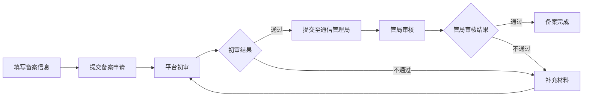

---
title: 小程序备案进度查询指南
date: 2025-10-14
permalink: /miniprogram/beian-progress.html
categories:
  - Technology
  - Learning
---

# 小程序备案进度查询方法

## 一、通过微信公众平台查看

### 方法步骤

1. **登录微信公众平台**
   - 访问：https://mp.weixin.qq.com/
   - 使用小程序管理员账号登录

2. **进入备案管理页面**
   - 登录后，在左侧菜单栏找到【设置】
   - 点击【基本设置】
   - 找到【小程序备案】或【备案管理】模块

3. **查看备案状态**

   在备案管理页面可以看到当前的备案状态，主要包括：

   - **待提交**：备案信息尚未提交
   - **审核中**：已提交等待审核
   - **补充材料**：需要补充或修改材料
   - **审核通过**：备案审核通过
   - **审核不通过**：备案被驳回
   - **已备案**：备案完成并生效

## 二、备案流程及时间

### 备案流程图



### 预计审核时间

- **平台初审**：1-3 个工作日
- **管局审核**：10-20 个工作日
- **总时长**：通常 15-30 个工作日

## 三、通过工信部网站查询（ICP 备案）

如果是 ICP 备案，还可以通过工信部网站查询：

1. **访问工信部备案管理系统**
   - 网址：https://beian.miit.gov.cn/

2. **公共查询**
   - 点击【ICP/IP地址/域名信息备案管理系统】
   - 选择【公共查询】
   - 输入网站域名或备案号查询

## 四、常见备案状态说明

### 状态详解

| 状态 | 说明 | 操作建议 |
|------|------|----------|
| **待提交** | 信息填写未完成 | 完善备案信息并提交 |
| **审核中** | 正在审核 | 耐心等待，通常 1-3 天 |
| **补充材料** | 需要补充信息 | 按要求补充材料后重新提交 |
| **审核通过（平台）** | 平台审核通过，提交管局 | 等待管局审核，10-20 天 |
| **管局审核中** | 通信管理局审核中 | 耐心等待 |
| **审核不通过** | 备案被驳回 | 查看驳回原因，修改后重新提交 |
| **备案成功** | 备案完成 | 可以正式发布小程序 |

## 五、加速备案的建议

### 1. 提前准备材料

- 营业执照
- 法人身份证
- 域名证书
- 网站负责人身份证
- 核验单（部分地区需要）

### 2. 确保信息准确

- 主体信息与营业执照一致
- 联系方式真实有效
- 域名实名认证与主体一致

### 3. 及时响应

- 关注公众平台消息通知
- 绑定手机号接收短信提醒
- 如需补充材料，尽快处理

### 4. 避免常见错误

- 域名未实名认证
- 主办单位信息不一致
- 联系方式无法接通
- 网站内容与备案类型不符

## 六、查询备案号

备案成功后，可以在以下位置查看备案号：

### 在小程序中显示

```javascript
// 在小程序页面底部显示备案号
// 格式：京ICP备12345678号-1
```

### 查询方式

1. **微信公众平台**
   - 【设置】→【基本设置】→【小程序备案】
   - 可以看到完整的备案号

2. **工信部网站**
   - 通过域名查询已生效的备案号

## 七、常见问题

### Q1: 提交后多久能看到进度更新？

**A:** 通常 1-3 个工作日会有初审结果，可以登录公众平台查看。

### Q2: 备案审核不通过怎么办？

**A:** 查看驳回原因，按要求修改后重新提交。常见原因包括信息不一致、材料不全等。

### Q3: 可以催审吗？

**A:** 可以通过公众平台的【客服】功能咨询，但审核时间由管局决定，催审效果有限。

### Q4: 备案期间能否发布小程序？

**A:** 新小程序必须完成备案才能发布；已备案的小程序可以正常发布更新。

### Q5: 如何接收备案通知？

**A:**
- 微信公众平台站内信
- 绑定的手机号短信通知
- 邮箱通知（如果填写了邮箱）

## 八、联系方式

如果遇到问题，可以通过以下方式获取帮助：

1. **微信公众平台客服**
   - 登录后点击右上角【客服】图标

2. **拨打客服电话**
   - 微信客服：95017

3. **查看帮助文档**
   - 微信开放社区：https://developers.weixin.qq.com/community/

---

**温馨提示**：备案是国家法律要求，请确保提供真实有效的信息，耐心等待审核结果。审核时间较长是正常现象，建议提前规划好小程序上线时间。
