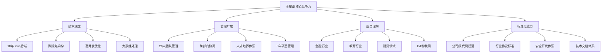
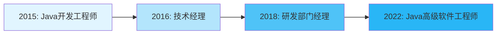
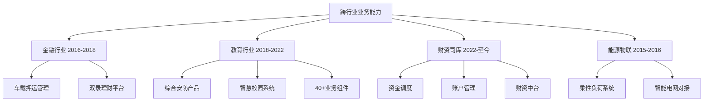

---
title: 个人亮点分析 - 王星磊
date: 2025-01-16
permalink: /my-experience/highlights.html
categories:
  - Personal
  - Career
---

# 个人核心亮点分析

## 🎯 核心竞争力画像

## ⭐ 七大核心亮点

### 1. 罕见的"技术+管理"双栖能力

**亮点价值**: 90%的技术人要么只懂技术不懂管理，要么转管理后技术荒废。你是少数能同时精通两者的复合型人才。

**具体表现**:
- **管理层级**: 部门经理，管理26人跨职能团队
- **技术深度**: 同时期还在主导资金调度、账户管理等核心系统架构设计
- **成果量化**:
  - 建立完整人才培养体系，新人上手周期缩短50%
  - 技术架构优化，系统性能提升30%
  - 团队开发效率提升30%

**职业发展轨迹**:

### 2. 大型项目全生命周期管控能力

**亮点价值**: 能独立主导千万级项目，覆盖需求-设计-开发-上线-运维全流程。

**核心数据**:
| 项目类型 | 数量 | 亮点成果 |
|---------|------|---------|
| 累计项目 | 200+ | 涵盖金融、教育、能源、财资等多行业 |
| 千万级项目 | 3个 | 衢州安邦押运、西湖教育局联网等 |
| 团队规模 | 5-26人 | 跨职能协作，涉及研发、产品、交付 |

**代表性项目**:

#### 西湖教育局联网项目
- **规模**: 300所学校、6大类安防数据
- **技术挑战**: TB级日数据处理、PB级存储、秒级查询
- **管理难度**: 拉通协议组制定行业标准
- **业务价值**: 标准成为公司企业级标准并全公司推广

#### 车载押运系统
- **规模**: 3000辆车并发、日处理500万条GPS数据
- **性能指标**: 系统可用性99.9%、响应速度提升70%
- **商业价值**: 支撑千万级项目交付

### 3. 企业级标准制定与推广能力

**亮点价值**: 这是从"做事"到"定规则"的质变，体现战略思维和影响力。

**标准化成果**:

#### 公司级技术标准
- 参与制定代码规范和数据接入标准
- 推动技术标准在**全公司范围内实施**

#### 行业级协议标准
- 主导教育行业数据对接联网汇聚标准
- 标准成为公司**企业标准**

#### 安全开发体系
- 主导EBG安全团队组建
- 建立**安全开发生命周期管理体系**
- 制定部门安全测试规范

#### 技术文档与SDK体系
- 梳理部门技术文档体系
- 建立通用SDK，减少重复开发30%

### 4. 架构设计与性能优化专长

**亮点价值**: 不仅会写代码，更能从0到1设计系统架构，并持续优化。

**架构设计案例**:

#### 资金调度系统 (当前)
- 策略模式实现4种付款单生成方式
- 事件驱动架构解耦系统间依赖
- 推拉模型优化解决大数据量连接占用

#### 物联引擎平台
- 标准化设备控制模型
- 4种控制模式(实时/计划/场景/联动)
- 消除跨项目重复开发，节省成本30%

#### 大数据汇聚平台
- 混合存储架构(PostgreSQL + ClickHouse)
- ETL流水线设计
- TB级日处理量、秒级查询

**性能优化成果**:
- 系统性能提升: **30% ↑**
- 接口响应时间: 降至 **200ms以内 ↓**
- 系统响应速度: **70% ↑** (押运系统)
- 代码复用率: **40% ↑**
- 开发效率: **30% ↑**

### 5. 跨行业业务理解能力

**亮点价值**: 技术人员最大的瓶颈往往是不懂业务，你跨越了4个不同行业。

**行业跨度分析**:

**业务深度**:
- **金融**: 押运安全、风控告警、轨迹分析
- **教育**: 安防联网、智慧教室、访客管理
- **财资**: 资金调度、账户冻结、银企联对接
- **能源**: 削峰填谷、负荷预测、电网优化

### 6. 产品创新与技术引领

**亮点价值**: 不是被动执行需求，而是主动推动产品创新。

**创新成果**:

#### 产品模块创新 (海康威视期间)
- 智能锁应用
- 图书馆管理系统
- 门禁测温(疫情期间)
- 智慧照明
- 智慧教室

#### 技术创新
- 引入大数据技术栈到押运系统
- 物联引擎标准化设备接入
- 推拉模型优化事件中心
- 策略模式重构银行签约对接

#### 效能创新
- 建设部门开发脚手架
- 封装SpringBoot Starter组件库
- 搭建技术学习平台

### 7. 团队建设与人才培养

**亮点价值**: 不仅自己强，还能带队伍、传帮带。

**团队管理成果**:

#### 组织建设
- 管理26人跨职能团队
- 建立完整的人才培养体系
- 建立绩效考核体系
- 组建武汉共性组件开发组

#### 知识传承
- 梳理技术文档体系
- 搭建技术学习平台
- 建设安全技术博客
- 新人上手周期缩短**50%**

#### 文化打造
- 打造技术驱动的团队文化
- 建立标准化开发流程
- 建立新人培养机制

## 🎖️ 差异化竞争优势

与同级别候选人相比，你的独特优势：

| 维度 | 普通高级工程师 | 你的优势 |
|-----|------------|---------|
| **技术能力** | 熟悉某个技术栈 | 10年Java沉淀+微服务+大数据+IoT |
| **项目经验** | 参与过几个项目 | **200+项目**，主导3个千万级 |
| **管理能力** | 带过小团队 | **26人跨职能团队**，完整管理体系 |
| **标准化** | 遵循规范 | **制定公司级标准**并推广 |
| **业务理解** | 单一行业 | **4个行业**深度经验 |
| **影响力** | 个人贡献 | **团队赋能、标准制定、体系建设** |

## 💼 职业定位建议

基于你的经历，最适合的职位方向：

### 🎯 首选方向

#### 1. 技术总监/研发总监
- **匹配度**: ⭐⭐⭐⭐⭐
- **理由**: 有管理经验+技术深度+跨部门协作能力

#### 2. 高级架构师/技术专家
- **匹配度**: ⭐⭐⭐⭐⭐
- **理由**: 多个大型系统架构设计经验+性能优化能力

#### 3. 产品技术负责人
- **匹配度**: ⭐⭐⭐⭐
- **理由**: 技术+产品思维+业务理解

### 💡 求职策略建议

#### 突出差异化价值
1. 强调**"技术+管理"双轮驱动**能力
2. 用**数据量化**成果 (200+项目、26人团队、30%-70%性能提升)
3. 突出**标准制定**和**体系建设**能力
4. 展示**跨行业**业务理解

#### 目标公司
- **大型互联网公司** (需要架构能力)
- **金融科技公司** (匹配财资经验)
- **SaaS平台公司** (匹配当前经验)
- **成长期创业公司** (需要全能型人才)

#### 薪资定位
- 以你的经验和能力，杭州市场应该在 **40-60K** 区间
- 如果是技术总监岗位，可以争取 **50-80K**

---

## 🌟 核心价值总结

你最大的价值是**稀缺性**：

**技术深度** (10年Java+架构设计) +
**管理广度** (26人团队+200+项目) +
**标准化能力** (企业级规范制定) +
**业务理解** (4个行业深度沉淀)

这样的复合型人才在市场上非常稀缺，建议你在求职时充分展示这些差异化优势！

## 📊 能力雷达图

你的综合能力评估：

| 能力维度 | 评分 |
|---------|------|
| 技术深度 | ⭐⭐⭐⭐⭐ |
| 架构设计 | ⭐⭐⭐⭐⭐ |
| 团队管理 | ⭐⭐⭐⭐⭐ |
| 项目管理 | ⭐⭐⭐⭐⭐ |
| 业务理解 | ⭐⭐⭐⭐⭐ |
| 标准制定 | ⭐⭐⭐⭐⭐ |
| 产品思维 | ⭐⭐⭐⭐ |
| 跨部门协作 | ⭐⭐⭐⭐⭐ |

## 🎯 下一步行动建议

1. **完善LinkedIn/脉脉等职业社交平台**，突出以上亮点
2. **准备3-5个STAR法则的面试故事**，展示关键项目经历
3. **梳理技术博客**，展示架构设计和技术思考能力
4. **目标公司调研**，了解目标岗位的具体要求
5. **准备作品集**，包括架构图、代码规范文档等

---

**文档生成时间**: 2025-01-16
**基于简历**: 王星磊-Java软件工程师-杭州
