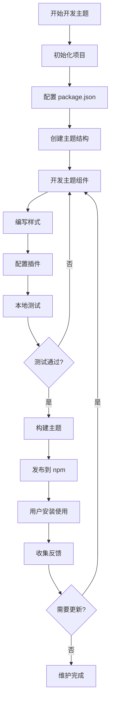
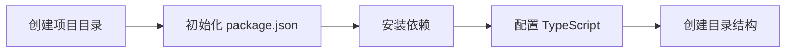
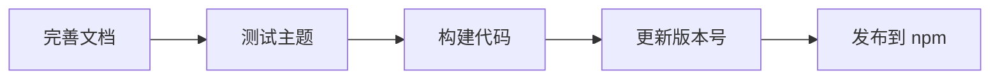
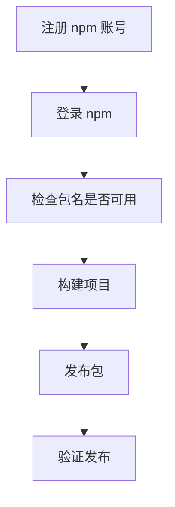
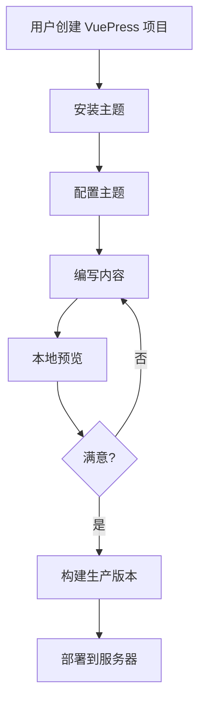

---
title: VuePress 博客主题开发与发布流程
date: 2025-10-22
categories:
  - Frontend
  - Technology
---

# VuePress 博客主题开发与发布流程

本文详细介绍如何开发一个 VuePress 2.x 博客主题，并将其发布到 npm 供他人使用。

## 完整流程图



## 一、主题开发流程

### 1.1 项目初始化



#### 创建项目

```bash
# 创建项目目录
mkdir vuepress-theme-myblog
cd vuepress-theme-myblog

# 初始化 npm 项目
npm init -y

# 安装核心依赖
npm install vuepress@next @vuepress/client@next @vuepress/core@next vue@^3.4.0

# 安装开发依赖
npm install -D typescript @types/node vite
```

#### 配置 package.json

```json
{
  "name": "vuepress-theme-myblog",
  "version": "1.0.0",
  "description": "A custom VuePress theme for blogging",
  "main": "lib/node/index.js",
  "types": "lib/node/index.d.ts",
  "keywords": [
    "vuepress",
    "vuepress-theme",
    "blog"
  ],
  "files": [
    "lib"
  ],
  "scripts": {
    "dev": "tsc -w",
    "build": "tsc",
    "prepublishOnly": "npm run build"
  },
  "peerDependencies": {
    "vuepress": "^2.0.0-rc.0"
  },
  "license": "MIT"
}
```

### 1.2 创建主题结构

VuePress 主题的标准目录结构：

```
vuepress-theme-myblog/
├── lib/                    # 构建输出目录
├── src/
│   ├── client/            # 客户端代码
│   │   ├── components/   # Vue 组件
│   │   │   ├── Home.vue
│   │   │   ├── NavBar.vue
│   │   │   ├── SideBar.vue
│   │   │   └── Page.vue
│   │   ├── layouts/      # 布局组件
│   │   │   ├── Layout.vue
│   │   │   └── 404.vue
│   │   ├── styles/       # 样式文件
│   │   │   ├── index.scss
│   │   │   └── variables.scss
│   │   └── config.ts     # 客户端配置
│   ├── node/             # Node 端代码
│   │   ├── index.ts      # 主题入口
│   │   └── options.ts    # 主题选项
│   └── shared/           # 共享代码
│       └── types.ts
├── tsconfig.json
└── package.json
```

### 1.3 编写主题入口

#### src/node/index.ts

```typescript
import type { Theme } from '@vuepress/core'
import { getDirname, path } from '@vuepress/utils'
import type { MyThemeOptions } from './options'

const __dirname = getDirname(import.meta.url)

export const myTheme = (options: MyThemeOptions): Theme => {
  return {
    name: 'vuepress-theme-myblog',

    // 布局组件
    layouts: {
      Layout: path.resolve(__dirname, '../client/layouts/Layout.vue'),
      404: path.resolve(__dirname, '../client/layouts/404.vue'),
    },

    // 客户端配置文件
    clientConfigFile: path.resolve(__dirname, '../client/config.ts'),

    // 继承默认主题
    extends: '@vuepress/theme-default',

    // 插件配置
    plugins: [
      // 添加你需要的插件
    ],

    // 主题选项
    ...options,
  }
}

export * from './options'
export default myTheme
```

#### src/node/options.ts

```typescript
export interface MyThemeOptions {
  // 导航栏配置
  navbar?: NavbarConfig
  // 侧边栏配置
  sidebar?: SidebarConfig
  // 网站标题
  title?: string
  // 网站描述
  description?: string
  // Logo
  logo?: string
  // 作者信息
  author?: {
    name: string
    link?: string
  }
  // 社交链接
  socialLinks?: Array<{
    icon: string
    link: string
  }>
}

export interface NavbarConfig {
  items?: NavbarItem[]
}

export interface NavbarItem {
  text: string
  link?: string
  children?: NavbarItem[]
}

export interface SidebarConfig {
  [key: string]: SidebarItem[]
}

export interface SidebarItem {
  text: string
  link?: string
  children?: SidebarItem[]
}
```

### 1.4 开发布局组件

#### src/client/layouts/Layout.vue

```vue
<template>
  <div class="theme-container">
    <NavBar :navbar="themeLocale.navbar" />

    <div class="main-wrapper">
      <SideBar v-if="shouldShowSidebar" :sidebar="themeLocale.sidebar" />

      <main class="page">
        <div class="theme-default-content">
          <Content />
        </div>

        <PageMeta />
        <PageNav />
      </main>
    </div>

    <Footer />
  </div>
</template>

<script setup lang="ts">
import { computed } from 'vue'
import { useThemeLocaleData } from '@vuepress/plugin-theme-data/client'
import { usePageFrontmatter } from '@vuepress/client'
import NavBar from '../components/NavBar.vue'
import SideBar from '../components/SideBar.vue'
import Footer from '../components/Footer.vue'
import PageMeta from '../components/PageMeta.vue'
import PageNav from '../components/PageNav.vue'

const themeLocale = useThemeLocaleData()
const frontmatter = usePageFrontmatter()

const shouldShowSidebar = computed(() => {
  return frontmatter.value.sidebar !== false && themeLocale.value.sidebar
})
</script>

<style lang="scss">
.theme-container {
  min-height: 100vh;
  display: flex;
  flex-direction: column;
}

.main-wrapper {
  flex: 1;
  display: flex;
  max-width: 1440px;
  margin: 0 auto;
  width: 100%;
}

.page {
  flex: 1;
  padding: 2rem;
}
</style>
```

### 1.5 客户端配置

#### src/client/config.ts

```typescript
import { defineClientConfig } from '@vuepress/client'
import Layout from './layouts/Layout.vue'
import NotFound from './layouts/404.vue'

import './styles/index.scss'

export default defineClientConfig({
  layouts: {
    Layout,
    NotFound,
  },

  enhance({ app, router, siteData }) {
    // 注册全局组件
    // app.component('MyComponent', MyComponent)
  },

  setup() {
    // 在这里执行 setup 逻辑
  },

  rootComponents: [],
})
```

### 1.6 添加样式

#### src/client/styles/variables.scss

```scss
// 颜色变量
$primary-color: #3eaf7c;
$text-color: #2c3e50;
$border-color: #eaecef;
$code-bg-color: #f6f6f6;

// 布局变量
$navbar-height: 3.6rem;
$sidebar-width: 20rem;
$content-width: 740px;

// 响应式断点
$mobile: 719px;
$tablet: 959px;
```

#### src/client/styles/index.scss

```scss
@import './variables';

* {
  box-sizing: border-box;
}

body {
  margin: 0;
  padding: 0;
  font-family: -apple-system, BlinkMacSystemFont, 'Segoe UI', Roboto, Oxygen,
    Ubuntu, Cantarell, 'Fira Sans', 'Droid Sans', 'Helvetica Neue', sans-serif;
  font-size: 16px;
  color: $text-color;
  line-height: 1.6;
}

code {
  background-color: $code-bg-color;
  padding: 0.25rem 0.5rem;
  border-radius: 3px;
  font-size: 0.85em;
}

a {
  color: $primary-color;
  text-decoration: none;

  &:hover {
    text-decoration: underline;
  }
}
```

### 1.7 TypeScript 配置

#### tsconfig.json

```json
{
  "compilerOptions": {
    "target": "ES2020",
    "module": "ESNext",
    "moduleResolution": "node",
    "lib": ["ES2020", "DOM"],
    "declaration": true,
    "declarationMap": true,
    "outDir": "./lib",
    "rootDir": "./src",
    "strict": true,
    "esModuleInterop": true,
    "skipLibCheck": true,
    "forceConsistentCasingInFileNames": true,
    "resolveJsonModule": true,
    "isolatedModules": true,
    "types": ["node"]
  },
  "include": ["src/**/*"],
  "exclude": ["node_modules", "lib"]
}
```

### 1.8 本地测试

创建一个测试站点来测试你的主题：

```bash
# 在项目根目录创建 example 目录
mkdir example
cd example

# 创建 VuePress 站点
mkdir docs
cd docs
```

#### example/docs/.vuepress/config.ts

```typescript
import { defineUserConfig } from 'vuepress'
import { myTheme } from '../../src/node/index'

export default defineUserConfig({
  title: '测试博客',
  description: '测试我的主题',

  theme: myTheme({
    navbar: {
      items: [
        { text: '首页', link: '/' },
        { text: '文章', link: '/posts/' },
        { text: '关于', link: '/about/' },
      ]
    },
    sidebar: {
      '/posts/': [
        {
          text: '文章',
          children: [
            '/posts/article1.md',
            '/posts/article2.md',
          ]
        }
      ]
    },
    author: {
      name: 'Your Name',
      link: 'https://github.com/yourname'
    }
  }),

  // 其他配置...
})
```

运行测试：

```bash
# 在 example 目录
npm install
npm run dev
```

## 二、主题发布流程

### 2.1 准备发布



#### 完善 README.md

```markdown
# vuepress-theme-myblog

一个简洁优雅的 VuePress 博客主题

## 安装

\`\`\`bash
npm install vuepress-theme-myblog
\`\`\`

## 使用

在 `.vuepress/config.ts` 中：

\`\`\`typescript
import { defineUserConfig } from 'vuepress'
import { myTheme } from 'vuepress-theme-myblog'

export default defineUserConfig({
  theme: myTheme({
    // 主题选项
  })
})
\`\`\`

## 配置

### navbar

导航栏配置...

### sidebar

侧边栏配置...

## 许可证

MIT
```

#### 添加 .npmignore

```
src/
example/
tsconfig.json
*.log
.DS_Store
node_modules/
```

### 2.2 发布到 npm



#### 发布步骤

```bash
# 1. 注册 npm 账号（如果还没有）
# 访问 https://www.npmjs.com/signup

# 2. 登录 npm
npm login

# 3. 检查包名是否可用
npm search vuepress-theme-myblog

# 4. 构建项目
npm run build

# 5. 测试包内容
npm pack
# 会生成 vuepress-theme-myblog-1.0.0.tgz
# 检查压缩包内容是否正确

# 6. 发布
npm publish

# 如果是测试版本
npm publish --tag beta
```

### 2.3 版本管理

使用语义化版本控制（Semantic Versioning）：

```bash
# 补丁版本（bug 修复）：1.0.0 -> 1.0.1
npm version patch

# 次要版本（新功能，向后兼容）：1.0.0 -> 1.1.0
npm version minor

# 主要版本（破坏性更改）：1.0.0 -> 2.0.0
npm version major

# 自动提交并打标签
npm version patch -m "chore: release v%s"

# 发布新版本
npm publish
```

## 三、用户使用流程



### 3.1 用户安装

```bash
# 创建项目
mkdir my-blog
cd my-blog

# 初始化
npm init -y

# 安装 VuePress 和主题
npm install -D vuepress@next vuepress-theme-myblog
```

### 3.2 用户配置

```typescript
// .vuepress/config.ts
import { defineUserConfig } from 'vuepress'
import { myTheme } from 'vuepress-theme-myblog'

export default defineUserConfig({
  title: '我的博客',
  description: '这是我的技术博客',

  theme: myTheme({
    navbar: {
      items: [
        { text: '首页', link: '/' },
        { text: '技术', link: '/tech/' },
        { text: '生活', link: '/life/' },
        { text: '关于', link: '/about/' },
      ]
    },

    sidebar: {
      '/tech/': [
        {
          text: 'JavaScript',
          children: [
            '/tech/js/basic.md',
            '/tech/js/advanced.md',
          ]
        },
        {
          text: 'TypeScript',
          children: [
            '/tech/ts/intro.md',
          ]
        }
      ],
      '/life/': [
        {
          text: '生活记录',
          children: [
            '/life/2024/summary.md',
          ]
        }
      ]
    },

    logo: '/logo.png',

    author: {
      name: '张三',
      link: 'https://github.com/zhangsan'
    },

    socialLinks: [
      {
        icon: 'github',
        link: 'https://github.com/zhangsan'
      },
      {
        icon: 'twitter',
        link: 'https://twitter.com/zhangsan'
      }
    ]
  })
})
```

### 3.3 编写内容

```markdown
---
title: 我的第一篇文章
date: 2025-10-22
tags:
  - JavaScript
  - 前端
categories:
  - 技术
---

# 我的第一篇文章

这是文章内容...
```

### 3.4 运行和构建

```bash
# 本地开发
npm run dev

# 构建生产版本
npm run build

# 预览生产版本
npm run preview
```

## 四、主题维护

### 4.1 收集反馈

- 在 GitHub 上创建 Issues 模板
- 收集用户反馈
- 定期更新文档

### 4.2 持续改进

```bash
# 创建新分支
git checkout -b feature/new-component

# 开发新功能
# ...

# 测试
npm run build
npm test

# 提交代码
git add .
git commit -m "feat: add new component"

# 发布新版本
npm version minor
npm publish

# 推送到 GitHub
git push origin main --tags
```

### 4.3 文档维护

- 保持 README 更新
- 提供详细的配置文档
- 添加示例项目
- 编写迁移指南

## 五、最佳实践

### 5.1 开发建议

1. **模块化设计**：将组件拆分为独立的、可复用的模块
2. **类型安全**：使用 TypeScript 提供完整的类型定义
3. **性能优化**：
   - 按需加载组件
   - 优化图片资源
   - 减少不必要的重渲染
4. **可访问性**：遵循 WCAG 标准
5. **响应式设计**：支持各种屏幕尺寸

### 5.2 发布建议

1. **语义化版本**：严格遵循 semver 规范
2. **变更日志**：维护 CHANGELOG.md
3. **标签管理**：使用 Git 标签标记版本
4. **测试覆盖**：确保充足的测试覆盖率
5. **文档完善**：提供详细的使用文档

### 5.3 安全建议

1. **依赖管理**：定期更新依赖，修复安全漏洞
2. **代码审查**：合并代码前进行审查
3. **权限管理**：使用 npm 双因素认证
4. **包完整性**：使用 `npm pack` 检查发布内容

## 总结

开发和发布 VuePress 主题需要：

1. **扎实的前端基础**：Vue 3、TypeScript、Sass
2. **了解 VuePress 架构**：插件系统、主题系统、构建流程
3. **良好的工程实践**：代码规范、版本管理、文档维护
4. **用户体验意识**：易用性、可定制性、性能优化

通过遵循本文的流程，你可以开发出高质量的 VuePress 主题，并顺利发布到 npm 供社区使用。
