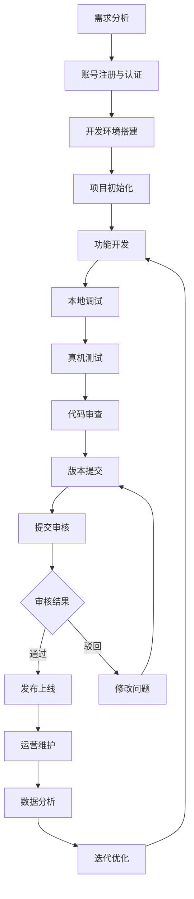
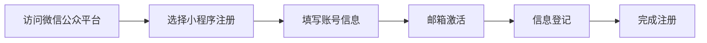
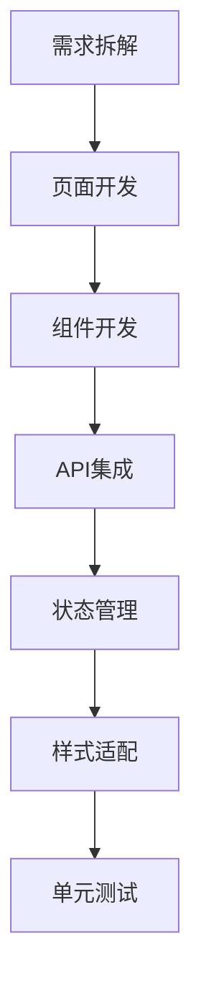
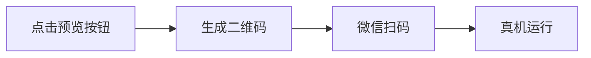
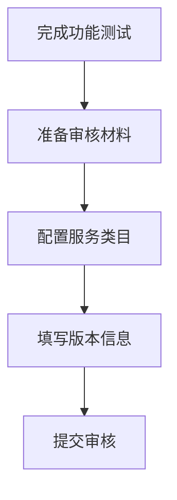
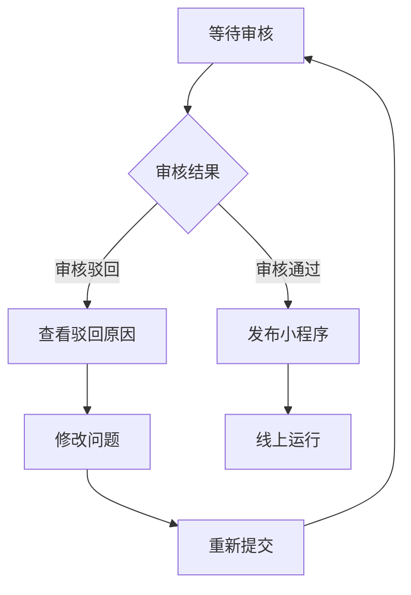
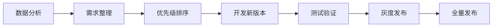

---
title: 小程序开发流程
date: 2025-01-13
categories:
  - Miniprogram
  - Development
---

# 小程序开发流程

本文档详细介绍小程序从需求到上线的完整开发流程,帮助开发者系统化地理解和执行小程序项目开发。

## 开发流程概览



## 一、需求分析阶段

### 1.1 明确项目目标
- 确定小程序的核心功能和业务场景
- 分析目标用户群体和使用场景
- 制定产品功能清单和优先级

### 1.2 技术可行性评估
- 评估小程序平台能力是否满足需求
- 确认是否需要后端服务支持
- 评估第三方服务集成需求(如支付、地图等)

### 1.3 产出物
- 需求规格说明书
- 功能流程图
- 原型设计稿
- 技术方案文档

## 二、账号注册与认证

### 2.1 注册小程序账号



**步骤说明:**
1. 访问 [微信公众平台](https://mp.weixin.qq.com/)
2. 点击"立即注册" > 选择"小程序"
3. 填写邮箱并设置密码
4. 完成邮箱激活
5. 填写主体信息(个人/企业)

### 2.2 完成认证(企业必需)
- 提交营业执照等资质材料
- 完成对公账户打款验证
- 等待审核通过(通常1-3个工作日)

### 2.3 获取关键信息
登录小程序管理后台,获取:
- **AppID**: 小程序唯一标识
- **AppSecret**: 用于服务端API调用

## 三、开发环境搭建

### 3.1 安装开发工具

**微信开发者工具:**
```bash
# 下载地址
https://developers.weixin.qq.com/miniprogram/dev/devtools/download.html

# 支持平台
- Windows
- macOS
- Linux
```

### 3.2 开发者身份绑定
1. 在小程序后台"管理" > "成员管理"中添加开发者
2. 使用微信扫码确认绑定
3. 开发工具中扫码登录

### 3.3 必要工具准备
- **代码编辑器**: VS Code、WebStorm等(可选,辅助开发)
- **版本控制**: Git
- **抓包工具**: Charles、Fiddler(用于调试网络请求)

## 四、项目初始化

### 4.1 创建项目

在微信开发者工具中:
1. 点击"+"创建新项目
2. 填写项目信息:
   - 项目名称
   - 目录路径
   - AppID
   - 开发模式(小程序)
3. 选择模板(不使用模板/使用基础模板)

### 4.2 项目结构

```
miniprogram-project/
├── pages/              # 页面目录
│   ├── index/         # 首页
│   │   ├── index.js   # 页面逻辑
│   │   ├── index.json # 页面配置
│   │   ├── index.wxml # 页面结构
│   │   └── index.wxss # 页面样式
│   └── logs/          # 日志页
├── utils/             # 工具函数
│   └── util.js
├── app.js             # 小程序逻辑
├── app.json           # 全局配置
├── app.wxss           # 全局样式
├── sitemap.json       # 索引配置
└── project.config.json # 项目配置
```

### 4.3 配置文件说明

**app.json (全局配置):**
```json
{
  "pages": [
    "pages/index/index",
    "pages/logs/logs"
  ],
  "window": {
    "backgroundTextStyle": "light",
    "navigationBarBackgroundColor": "#fff",
    "navigationBarTitleText": "我的小程序",
    "navigationBarTextStyle": "black"
  },
  "tabBar": {
    "list": [{
      "pagePath": "pages/index/index",
      "text": "首页"
    }]
  },
  "networkTimeout": {
    "request": 10000
  }
}
```

## 五、功能开发阶段

### 5.1 开发流程图



### 5.2 页面开发

**创建新页面:**
```json
// app.json 中添加页面路径
{
  "pages": [
    "pages/index/index",
    "pages/user/user"  // 新增用户页
  ]
}
```

**页面生命周期:**
```javascript
// pages/user/user.js
Page({
  data: {
    userInfo: {}
  },

  onLoad(options) {
    // 页面加载时触发
    console.log('页面加载', options)
  },

  onShow() {
    // 页面显示时触发
    this.getUserInfo()
  },

  onReady() {
    // 页面初次渲染完成
  },

  onHide() {
    // 页面隐藏
  },

  onUnload() {
    // 页面卸载
  },

  getUserInfo() {
    wx.request({
      url: 'https://api.example.com/user',
      success: (res) => {
        this.setData({
          userInfo: res.data
        })
      }
    })
  }
})
```

### 5.3 组件开发

**自定义组件结构:**
```
components/
└── card/
    ├── card.js
    ├── card.json
    ├── card.wxml
    └── card.wxss
```

**组件定义:**
```javascript
// components/card/card.js
Component({
  properties: {
    title: {
      type: String,
      value: ''
    }
  },

  data: {
    // 组件内部数据
  },

  methods: {
    onTap() {
      this.triggerEvent('cardtap', { id: this.data.id })
    }
  }
})
```

### 5.4 API调用

**网络请求封装:**
```javascript
// utils/request.js
const baseURL = 'https://api.example.com'

function request(url, method = 'GET', data = {}) {
  return new Promise((resolve, reject) => {
    wx.request({
      url: baseURL + url,
      method,
      data,
      header: {
        'Content-Type': 'application/json',
        'Authorization': wx.getStorageSync('token')
      },
      success: (res) => {
        if (res.statusCode === 200) {
          resolve(res.data)
        } else {
          reject(res)
        }
      },
      fail: reject
    })
  })
}

module.exports = {
  get: (url, data) => request(url, 'GET', data),
  post: (url, data) => request(url, 'POST', data)
}
```

### 5.5 常用API示例

**用户授权:**
```javascript
// 获取用户信息
wx.getUserProfile({
  desc: '用于完善用户资料',
  success: (res) => {
    console.log(res.userInfo)
  }
})
```

**位置服务:**
```javascript
// 获取当前位置
wx.getLocation({
  type: 'wgs84',
  success: (res) => {
    const { latitude, longitude } = res
    console.log('位置:', latitude, longitude)
  }
})
```

**支付功能:**
```javascript
// 调起微信支付
wx.requestPayment({
  timeStamp: '',
  nonceStr: '',
  package: '',
  signType: 'MD5',
  paySign: '',
  success: (res) => {
    console.log('支付成功')
  },
  fail: (res) => {
    console.log('支付失败')
  }
})
```

## 六、本地调试

### 6.1 调试工具使用

**Console调试:**
```javascript
console.log('普通日志')
console.info('信息日志')
console.warn('警告日志')
console.error('错误日志')
```

**断点调试:**
1. 在开发者工具的Sources面板中设置断点
2. 触发对应的代码逻辑
3. 查看变量值和调用堆栈

### 6.2 模拟器测试
- 切换不同设备型号
- 测试不同系统版本兼容性
- 网络状态模拟(WiFi/4G/弱网/离线)

### 6.3 性能分析
- 使用Performance面板分析渲染性能
- 检查setData调用频率和数据量
- 优化长列表渲染

## 七、真机测试

### 7.1 预览功能



**步骤:**
1. 在开发者工具中点击"预览"按钮
2. 使用微信扫描生成的二维码
3. 在手机上测试小程序功能

### 7.2 测试要点
- **功能测试**: 验证所有功能是否正常
- **兼容性测试**: 测试不同机型和系统版本
- **网络测试**: 测试弱网和断网场景
- **性能测试**: 检查页面加载速度和流畅度
- **用户体验**: 评估交互流程是否顺畅

### 7.3 常见问题排查
- 白屏问题: 检查页面路径配置
- 请求失败: 确认域名是否配置合法
- 样式异常: 检查rpx单位使用和机型适配
- 授权失败: 确认权限配置和用户拒绝处理

## 八、代码审查

### 8.1 审查清单

**代码质量:**
- [ ] 代码规范符合团队标准
- [ ] 没有冗余和重复代码
- [ ] 函数职责单一,复杂度合理
- [ ] 变量命名清晰易懂

**性能优化:**
- [ ] 避免频繁setData
- [ ] 图片资源已压缩优化
- [ ] 长列表使用虚拟列表
- [ ] 合理使用分包加载

**安全检查:**
- [ ] 敏感信息不在前端存储
- [ ] API接口有权限校验
- [ ] 用户输入有合法性验证
- [ ] 防止XSS和注入攻击

**用户体验:**
- [ ] 加载状态有提示
- [ ] 错误信息友好展示
- [ ] 按钮防重复点击
- [ ] 网络异常有降级方案

## 九、版本提交

### 9.1 上传代码

在开发者工具中:
1. 点击"上传"按钮
2. 填写版本号和项目备注
3. 确认上传

**版本号规范:**
```
主版本号.次版本号.修订号
例: 1.0.0, 1.1.0, 1.1.1
```

### 9.2 体验版本
上传成功后自动生成体验版:
- 在小程序后台"版本管理"中查看
- 可设置体验成员进行体验测试
- 支持生成体验版二维码分享

## 十、提交审核

### 10.1 审核前准备



### 10.2 提交步骤

登录小程序后台:
1. 进入"版本管理" > "开发版本"
2. 点击"提交审核"
3. 填写审核信息:
   - 选择服务类目
   - 填写页面功能说明
   - 上传测试账号(如需要)
   - 上传相关资质(如涉及特殊行业)
4. 确认提交

### 10.3 审核信息填写要点

**服务类目选择:**
- 必须与小程序实际功能匹配
- 部分类目需要特殊资质(如教育、医疗)
- 可选择多个类目(建议不超过5个)

**功能页面说明:**
```
示例:
页面路径: pages/index/index
页面标题: 商品列表
功能说明: 展示商品信息,支持搜索和分类筛选

页面路径: pages/order/order
页面标题: 订单管理
功能说明: 查看订单列表,支持订单详情查看和取消操作
```

### 10.4 审核时效
- 普通审核: 通常1-7个工作日
- 加急审核: 特殊情况可申请(需要理由)

## 十一、审核与发布

### 11.1 审核结果处理



### 11.2 审核通过后发布
1. 在"版本管理"中点击"提交发布"
2. 确认发布版本
3. 发布成功后用户可搜索到小程序

### 11.3 常见驳回原因

**功能问题:**
- 核心功能缺失或无法使用
- 功能与描述不符
- 存在诱导分享、关注行为

**内容问题:**
- 包含违规或低俗内容
- 侵犯知识产权
- 未成年人保护问题

**资质问题:**
- 缺少必要的资质证明
- 服务类目选择不当
- 主体资质与功能不匹配

**技术问题:**
- 存在严重bug或闪退
- 未适配iOS或Android系统
- 存在安全漏洞

### 11.4 驳回后处理流程
1. 仔细阅读驳回原因
2. 针对问题进行修改
3. 如有疑问可在后台申诉
4. 修改完成后重新提交审核

## 十二、运营维护

### 12.1 数据分析

**小程序后台数据:**
- 访问分析: UV、PV、访问时长
- 用户画像: 年龄、性别、地域分布
- 留存分析: 次日留存、7日留存
- 实时统计: 实时在线人数

**埋点统计:**
```javascript
// 自定义分析上报
wx.reportAnalytics('purchase_action', {
  product_id: '123',
  product_name: '商品A',
  price: 99.00
})
```

### 12.2 运营推广

**搜索优化:**
- 优化小程序名称和简介
- 设置合适的服务标签
- 完善小程序信息和截图

**推广渠道:**
- 公众号关联推广
- 微信搜索广告
- 附近的小程序
- 社交分享传播
- 扫码入口

### 12.3 用户反馈处理
- 建立用户反馈通道
- 及时响应用户问题
- 收集优化建议
- 处理投诉和纠纷

## 十三、版本迭代

### 13.1 迭代流程



### 13.2 灰度发布策略
1. 在小程序后台开启"分阶段发布"
2. 设置灰度比例(如5% -> 20% -> 50% -> 100%)
3. 观察数据指标和用户反馈
4. 逐步扩大发布范围

### 13.3 版本回退
当新版本出现严重问题时:
1. 在后台"版本管理"中点击"版本回退"
2. 选择要回退的历史版本
3. 确认回退操作
4. 回退后立即修复问题并重新发布

## 十四、开发最佳实践

### 14.1 性能优化

**启动优化:**
```javascript
// 使用分包加载
{
  "subpackages": [{
    "root": "packageA",
    "pages": [
      "pages/cat/cat"
    ]
  }]
}

// 按需注入
{
  "lazyCodeLoading": "requiredComponents"
}
```

**渲染优化:**
```javascript
// 避免频繁setData
// 不推荐
for (let i = 0; i < 100; i++) {
  this.setData({ [`list[${i}]`]: data[i] })
}

// 推荐
this.setData({ list: data })

// 只传输必要数据
this.setData({
  'userInfo.nickname': 'newName'  // 只更新昵称字段
})
```

### 14.2 用户体验优化

**加载状态:**
```javascript
// 显示加载提示
wx.showLoading({ title: '加载中' })

// 网络请求
wx.request({
  url: 'https://api.example.com/data',
  success: (res) => {
    // 处理数据
  },
  complete: () => {
    wx.hideLoading()  // 隐藏加载提示
  }
})
```

**错误处理:**
```javascript
wx.request({
  url: 'https://api.example.com/data',
  fail: (err) => {
    wx.showToast({
      title: '网络异常,请稍后重试',
      icon: 'none'
    })
  }
})
```

### 14.3 代码规范

**命名规范:**
```javascript
// 文件名: 小写字母,连字符分隔
// user-profile.js

// 变量名: 驼峰命名
const userName = 'John'
const isLoading = true

// 常量名: 大写字母,下划线分隔
const MAX_COUNT = 100
const API_BASE_URL = 'https://api.example.com'

// 组件名: 帕斯卡命名
Component({ ... })  // UserCard
```

**注释规范:**
```javascript
/**
 * 获取用户信息
 * @param {string} userId - 用户ID
 * @returns {Promise} 返回用户信息对象
 */
function getUserInfo(userId) {
  // 实现代码
}
```

## 十五、常见问题与解决方案

### 15.1 开发问题

**问题1: request:fail url not in domain list**
- 原因: 请求域名未配置到小程序合法域名列表
- 解决: 在小程序后台"开发" > "开发管理" > "服务器域名"中添加

**问题2: 页面样式在真机上显示异常**
- 原因: rpx单位换算问题或机型兼容性
- 解决: 使用官方推荐的rpx单位,避免使用百分比

**问题3: setData数据更新后页面未刷新**
- 原因: 数据引用未改变或路径错误
- 解决: 确保修改的是新对象,检查setData路径是否正确

### 15.2 审核问题

**问题1: 小程序功能不完整**
- 解决: 确保核心功能可用,提供测试账号

**问题2: 缺少用户协议和隐私政策**
- 解决: 添加用户协议和隐私政策页面,在注册/登录处展示

**问题3: 服务类目选择错误**
- 解决: 根据实际功能选择正确的类目,准备相应资质

## 十六、开发工具推荐

### 16.1 官方工具
- **微信开发者工具**: 必备开发调试工具
- **小程序助手**: 移动端管理小程序

### 16.2 辅助工具
- **代码编辑器**: VS Code + 小程序插件
- **版本管理**: Git + GitHub/GitLab
- **接口调试**: Postman、Apifox
- **原型设计**: Figma、Sketch
- **性能监控**: 小程序助手、第三方监控平台

### 16.3 开源框架
- **Taro**: 多端统一开发框架
- **uni-app**: 跨平台应用开发框架
- **mpvue**: 基于Vue.js的小程序框架
- **WePY**: 类Vue组件化开发框架

## 总结

小程序开发是一个系统化的工程,涉及需求分析、开发、测试、审核、发布和运营等多个环节。掌握完整的开发流程能够帮助开发者:

1. **提高开发效率**: 按流程规范操作,避免返工
2. **保证代码质量**: 通过代码审查和测试保障质量
3. **提升审核通过率**: 了解审核规则,减少驳回
4. **优化用户体验**: 关注性能和体验细节
5. **持续迭代优化**: 基于数据分析不断改进

希望本文档能够帮助你顺利完成小程序开发项目!

## 参考资料

- [微信小程序官方文档](https://developers.weixin.qq.com/miniprogram/dev/framework/)
- [小程序设计规范](https://developers.weixin.qq.com/miniprogram/design/)
- [小程序运营规范](https://developers.weixin.qq.com/miniprogram/product/)
