# 12306火车票系统设计详解

## 目录

1. [业务分析与挑战](#1-业务分析与挑战)
2. [座位分配策略设计](#2-座位分配策略设计)
3. [高并发查询优化](#3-高并发查询优化)
4. [订单状态管理](#4-订单状态管理)
5. [数据一致性保证](#5-数据一致性保证)
6. [系统架构设计](#6-系统架构设计)
7. [缓存与性能优化](#7-缓存与性能优化)
8. [监控与运维](#8-监控与运维)
9. [实际案例分析](#9-实际案例分析)
10. [总结与最佳实践](#10-总结与最佳实践)

---

## 1. 业务分析与挑战

### 1.1 业务场景特点

#### 1.1.1 12306系统核心业务
```
┌─ 车票查询 ─────────────────────────────────────┐
│ • 余票查询：实时查询列车余票信息               │
│ • 车次查询：按时间、出发地、目的地查询         │
│ • 价格查询：不同席别的票价信息                 │
│ • 时刻表查询：列车运行时刻表                   │
└─────────────────────────────────────────────────┘

┌─ 车票预订 ─────────────────────────────────────┐
│ • 在线订票：选择车次、席别、乘客信息           │
│ • 座位选择：根据偏好选择座位                   │
│ • 候补购票：余票不足时加入候补队列             │
│ • 退改签：票务变更和退票服务                   │
└─────────────────────────────────────────────────┘

┌─ 支付与出票 ───────────────────────────────────┐
│ • 在线支付：多种支付方式支持                   │
│ • 电子票务：电子车票生成和验证                 │
│ • 发票服务：电子发票和纸质发票                 │
│ • 实名认证：乘客身份信息验证                   │
└─────────────────────────────────────────────────┘
```

#### 1.1.2 业务数据规模
```
日常业务量级（2024年数据）:
- 日均访问量: 1500万人次
- 峰值并发: 100万人同时在线
- 日均售票量: 1200万张
- 车次数据: 8000+趟列车
- 车站数据: 5000+个车站
- 座位数据: 单趟列车最多1800+个座位
```

### 1.2 核心技术挑战

#### 1.2.1 高并发挑战


#### 1.2.2 数据一致性挑战
```
┌─ 库存一致性 ───────────────────────────────────┐
│ • 余票数据的实时准确性                         │
│ • 多个用户同时购买最后几张票                   │
│ • 退票后库存的及时释放                         │
│ • 候补订单的自动分配                           │
└─────────────────────────────────────────────────┘

┌─ 订单一致性 ───────────────────────────────────┐
│ • 订单创建与座位占用的原子性                   │
│ • 支付成功与出票的一致性                       │
│ • 退票与库存释放的一致性                       │
│ • 跨系统数据同步（12306↔铁路局）               │
└─────────────────────────────────────────────────┘
```

#### 1.2.3 系统可用性挑战
```
┌─ 春运高峰期挑战 ───────────────────────────────┐
│ • 流量是平时的10-50倍                         │
│ • 热门线路票源紧张                             │
│ • 用户行为模式集中（放票瞬间）                 │
│ • 系统稳定性要求极高                           │
└─────────────────────────────────────────────────┘

┌─ 业务复杂度挑战 ───────────────────────────────┐
│ • 多种票类（成人票、儿童票、学生票等）         │
│ • 复杂定价策略（浮动票价、优惠政策）           │
│ • 席别管理（硬座、软座、硬卧、软卧等）         │
│ • 联程票务（中转换乘）                         │
└─────────────────────────────────────────────────┘
```

### 1.3 关键业务指标

#### 1.3.1 性能指标
| 指标类型 | 目标值 | 说明 |
|----------|--------|------|
| **查询响应时间** | <500ms | 99%的余票查询请求 |
| **购票成功率** | >95% | 有票情况下的购票成功率 |
| **系统可用性** | 99.9% | 年度系统可用时间 |
| **并发处理能力** | 100万QPS | 峰值查询处理能力 |
| **数据准确性** | 100% | 余票和订单数据准确性 |

#### 1.3.2 业务指标
```yaml
用户体验指标:
  - 页面加载时间: <2秒
  - 购票流程完成时间: <5分钟
  - 客服响应时间: <1分钟
  - 退款处理时间: <24小时

运营指标:
  - 客座率: >85%
  - 收入增长率: >10%/年
  - 用户满意度: >90%
  - 投诉率: <1%
```

---

## 2. 座位分配策略设计

### 2.1 座位分配算法

#### 2.1.1 连续座位分配算法
```java
@Component
public class SeatAllocationService {

    @Autowired
    private SeatLayoutService seatLayoutService;

    @Autowired
    private RedisTemplate<String, Object> redisTemplate;

    /**
     * 分配连续座位
     */
    public SeatAllocationResult allocateSeats(SeatAllocationRequest request) {
        String trainNo = request.getTrainNo();
        String date = request.getDate();
        String seatType = request.getSeatType();
        int passengerCount = request.getPassengerCount();

        // 1. 获取车厢座位布局
        List<CarriageLayout> carriageLayouts = seatLayoutService.getCarriageLayouts(trainNo, seatType);

        // 2. 按优先级排序车厢（中间车厢优先）
        carriageLayouts = sortCarriagesByPriority(carriageLayouts);

        // 3. 尝试分配连续座位
        for (CarriageLayout carriage : carriageLayouts) {
            SeatAllocationResult result = tryAllocateInCarriage(
                carriage, request, passengerCount);
            if (result.isSuccess()) {
                return result;
            }
        }

        // 4. 如果无法分配连续座位，尝试分配相近座位
        return allocateNearbySeats(carriageLayouts, request, passengerCount);
    }

    private SeatAllocationResult tryAllocateInCarriage(CarriageLayout carriage,
                                                     SeatAllocationRequest request,
                                                     int passengerCount) {
        String lockKey = "seat:lock:" + request.getTrainNo() + ":" +
                        request.getDate() + ":" + carriage.getCarriageNo();

        // 分布式锁保证并发安全
        Boolean lockAcquired = redisTemplate.opsForValue()
            .setIfAbsent(lockKey, "locked", Duration.ofSeconds(30));

        if (!lockAcquired) {
            return SeatAllocationResult.fail("车厢锁定中");
        }

        try {
            return doAllocateInCarriage(carriage, request, passengerCount);
        } finally {
            redisTemplate.delete(lockKey);
        }
    }

    private SeatAllocationResult doAllocateInCarriage(CarriageLayout carriage,
                                                    SeatAllocationRequest request,
                                                    int passengerCount) {
        // 1. 获取车厢当前座位状态
        String seatStatusKey = String.format("seat:status:%s:%s:%s",
            request.getTrainNo(), request.getDate(), carriage.getCarriageNo());

        BitSet occupiedSeats = getOccupiedSeats(seatStatusKey, carriage.getTotalSeats());

        // 2. 查找连续可用座位
        List<Integer> availableSeats = findConsecutiveSeats(
            occupiedSeats, carriage, passengerCount, request.getPreferences());

        if (availableSeats.size() < passengerCount) {
            return SeatAllocationResult.fail("车厢座位不足");
        }

        // 3. 标记座位为已占用
        for (Integer seatNo : availableSeats) {
            occupiedSeats.set(seatNo);
        }

        // 4. 更新Redis中的座位状态
        updateSeatStatus(seatStatusKey, occupiedSeats);

        // 5. 构建分配结果
        List<SeatInfo> allocatedSeats = buildSeatInfo(carriage, availableSeats);

        return SeatAllocationResult.success(allocatedSeats);
    }

    /**
     * 查找连续座位的核心算法
     */
    private List<Integer> findConsecutiveSeats(BitSet occupiedSeats,
                                             CarriageLayout carriage,
                                             int passengerCount,
                                             SeatPreferences preferences) {
        List<Integer> result = new ArrayList<>();
        SeatMap seatMap = carriage.getSeatMap();

        // 1. 优先尝试同排座位
        List<Integer> sameRowSeats = findSameRowSeats(
            occupiedSeats, seatMap, passengerCount, preferences);
        if (sameRowSeats.size() >= passengerCount) {
            return sameRowSeats.subList(0, passengerCount);
        }

        // 2. 尝试相邻排座位
        List<Integer> adjacentRowSeats = findAdjacentRowSeats(
            occupiedSeats, seatMap, passengerCount, preferences);
        if (adjacentRowSeats.size() >= passengerCount) {
            return adjacentRowSeats.subList(0, passengerCount);
        }

        // 3. 分配任意可用座位
        List<Integer> anyAvailableSeats = findAnyAvailableSeats(
            occupiedSeats, seatMap, passengerCount);
        return anyAvailableSeats.subList(0, Math.min(anyAvailableSeats.size(), passengerCount));
    }

    private List<Integer> findSameRowSeats(BitSet occupiedSeats,
                                         SeatMap seatMap,
                                         int passengerCount,
                                         SeatPreferences preferences) {
        List<Integer> result = new ArrayList<>();

        // 按行遍历座位
        for (SeatRow row : seatMap.getRows()) {
            List<Integer> rowSeats = findConsecutiveInRow(
                occupiedSeats, row, passengerCount, preferences);

            if (rowSeats.size() >= passengerCount) {
                return rowSeats;
            }
        }

        return result;
    }

    private List<Integer> findConsecutiveInRow(BitSet occupiedSeats,
                                             SeatRow row,
                                             int passengerCount,
                                             SeatPreferences preferences) {
        List<Integer> result = new ArrayList<>();
        List<SeatPosition> positions = row.getPositions();

        // 根据偏好调整座位顺序
        if (preferences.isWindowPreferred()) {
            positions = sortByWindowFirst(positions);
        } else if (preferences.isAislePreferred()) {
            positions = sortByAisleFirst(positions);
        }

        int consecutiveCount = 0;
        List<Integer> tempResult = new ArrayList<>();

        for (SeatPosition position : positions) {
            if (!occupiedSeats.get(position.getSeatNo())) {
                tempResult.add(position.getSeatNo());
                consecutiveCount++;

                if (consecutiveCount >= passengerCount) {
                    return tempResult;
                }
            } else {
                // 遇到已占用座位，重置计数
                consecutiveCount = 0;
                tempResult.clear();
            }
        }

        return tempResult;
    }
}
```

#### 2.1.2 智能座位推荐算法
```java
@Component
public class IntelligentSeatRecommendation {

    /**
     * 基于用户偏好和历史行为的座位推荐
     */
    public List<SeatRecommendation> recommendSeats(SeatRecommendationRequest request) {
        // 1. 分析用户历史偏好
        UserSeatPreference userPreference = analyzeUserPreference(request.getUserId());

        // 2. 获取可用座位
        List<AvailableSeat> availableSeats = getAvailableSeats(request);

        // 3. 计算座位评分
        List<SeatScore> seatScores = calculateSeatScores(availableSeats, userPreference, request);

        // 4. 排序并返回推荐结果
        return seatScores.stream()
            .sorted((a, b) -> Double.compare(b.getScore(), a.getScore()))
            .limit(request.getRecommendationCount())
            .map(this::buildRecommendation)
            .collect(Collectors.toList());
    }

    private List<SeatScore> calculateSeatScores(List<AvailableSeat> availableSeats,
                                               UserSeatPreference userPreference,
                                               SeatRecommendationRequest request) {
        List<SeatScore> scores = new ArrayList<>();

        for (AvailableSeat seat : availableSeats) {
            double score = 0.0;

            // 1. 位置偏好评分（40%权重）
            score += calculatePositionScore(seat, userPreference) * 0.4;

            // 2. 连续性评分（30%权重）
            score += calculateContinuityScore(seat, request.getPassengerCount()) * 0.3;

            // 3. 舒适度评分（20%权重）
            score += calculateComfortScore(seat, userPreference) * 0.2;

            // 4. 价格敏感度评分（10%权重）
            score += calculatePriceScore(seat, userPreference) * 0.1;

            scores.add(new SeatScore(seat, score));
        }

        return scores;
    }

    private double calculatePositionScore(AvailableSeat seat, UserSeatPreference preference) {
        double score = 0.0;

        // 窗口偏好
        if (preference.isWindowPreferred() && seat.isWindowSeat()) {
            score += 0.8;
        } else if (preference.isAislePreferred() && seat.isAisleSeat()) {
            score += 0.8;
        } else if (!seat.isWindowSeat() && !seat.isAisleSeat()) {
            score += 0.4; // 中间座位
        }

        // 车厢位置偏好
        if (preference.isMiddleCarriagePreferred()) {
            int totalCarriages = seat.getTrain().getTotalCarriages();
            int carriageNo = seat.getCarriageNo();
            double middle = totalCarriages / 2.0;
            double distance = Math.abs(carriageNo - middle);
            score += (1.0 - distance / middle) * 0.5;
        }

        return Math.min(score, 1.0);
    }

    private double calculateContinuityScore(AvailableSeat seat, int passengerCount) {
        if (passengerCount == 1) {
            return 1.0;
        }

        // 检查该座位周围的连续可用座位数
        int continuousSeats = countContinuousSeats(seat, passengerCount);
        return Math.min((double) continuousSeats / passengerCount, 1.0);
    }

    private UserSeatPreference analyzeUserPreference(Long userId) {
        // 从历史订票数据分析用户偏好
        List<HistoricalBooking> bookings = historicalBookingService.getUserBookings(userId);

        if (bookings.isEmpty()) {
            return getDefaultPreference();
        }

        int windowSeatCount = 0;
        int aisleSeatCount = 0;
        int middleSeatCount = 0;

        for (HistoricalBooking booking : bookings) {
            for (SeatInfo seat : booking.getSeats()) {
                if (seat.isWindowSeat()) {
                    windowSeatCount++;
                } else if (seat.isAisleSeat()) {
                    aisleSeatCount++;
                } else {
                    middleSeatCount++;
                }
            }
        }

        int totalSeats = windowSeatCount + aisleSeatCount + middleSeatCount;

        return UserSeatPreference.builder()
            .windowPreferred(windowSeatCount > totalSeats * 0.6)
            .aislePreferred(aisleSeatCount > totalSeats * 0.6)
            .middleCarriagePreferred(true) // 默认偏好中间车厢
            .pricePreferred(analyzeUserPriceSensitivity(bookings))
            .build();
    }
}
```

### 2.2 座位状态管理

#### 2.2.1 座位状态数据结构
```java
/**
 * 座位状态管理
 */
@Component
public class SeatStatusManager {

    @Autowired
    private RedisTemplate<String, Object> redisTemplate;

    /**
     * 座位状态：使用BitSet压缩存储
     * 每个bit代表一个座位的状态：0=可用，1=已占用
     */
    public void initializeTrainSeats(String trainNo, String date, List<CarriageLayout> carriages) {
        for (CarriageLayout carriage : carriages) {
            String key = buildSeatStatusKey(trainNo, date, carriage.getCarriageNo());

            // 初始化所有座位为可用状态
            BitSet seatStatus = new BitSet(carriage.getTotalSeats());

            // 设置不可售座位（如乘务员席位、故障座位等）
            for (Integer unavailableSeat : carriage.getUnavailableSeats()) {
                seatStatus.set(unavailableSeat);
            }

            // 存储到Redis
            redisTemplate.opsForValue().set(key, seatStatus.toByteArray(), Duration.ofDays(1));
        }
    }

    /**
     * 原子性座位占用操作
     */
    public boolean occupySeats(String trainNo, String date, int carriageNo, List<Integer> seatNos) {
        String key = buildSeatStatusKey(trainNo, date, carriageNo);
        String lockKey = key + ":lock";

        // 获取分布式锁
        Boolean lockAcquired = redisTemplate.opsForValue()
            .setIfAbsent(lockKey, "locked", Duration.ofSeconds(10));

        if (!lockAcquired) {
            return false;
        }

        try {
            // 获取当前座位状态
            byte[] seatStatusBytes = (byte[]) redisTemplate.opsForValue().get(key);
            if (seatStatusBytes == null) {
                return false;
            }

            BitSet seatStatus = BitSet.valueOf(seatStatusBytes);

            // 检查座位是否都可用
            for (Integer seatNo : seatNos) {
                if (seatStatus.get(seatNo)) {
                    return false; // 座位已被占用
                }
            }

            // 占用座位
            for (Integer seatNo : seatNos) {
                seatStatus.set(seatNo);
            }

            // 更新Redis
            redisTemplate.opsForValue().set(key, seatStatus.toByteArray(), Duration.ofDays(1));

            return true;

        } finally {
            redisTemplate.delete(lockKey);
        }
    }

    /**
     * 释放座位
     */
    public boolean releaseSeats(String trainNo, String date, int carriageNo, List<Integer> seatNos) {
        String key = buildSeatStatusKey(trainNo, date, carriageNo);
        String lockKey = key + ":lock";

        Boolean lockAcquired = redisTemplate.opsForValue()
            .setIfAbsent(lockKey, "locked", Duration.ofSeconds(10));

        if (!lockAcquired) {
            return false;
        }

        try {
            byte[] seatStatusBytes = (byte[]) redisTemplate.opsForValue().get(key);
            if (seatStatusBytes == null) {
                return false;
            }

            BitSet seatStatus = BitSet.valueOf(seatStatusBytes);

            // 释放座位
            for (Integer seatNo : seatNos) {
                seatStatus.clear(seatNo);
            }

            // 更新Redis
            redisTemplate.opsForValue().set(key, seatStatus.toByteArray(), Duration.ofDays(1));

            // 通知候补订单处理
            notifyWaitlistProcessor(trainNo, date, carriageNo, seatNos.size());

            return true;

        } finally {
            redisTemplate.delete(lockKey);
        }
    }

    /**
     * 查询车厢剩余座位数
     */
    public int getAvailableSeatCount(String trainNo, String date, int carriageNo) {
        String key = buildSeatStatusKey(trainNo, date, carriageNo);
        byte[] seatStatusBytes = (byte[]) redisTemplate.opsForValue().get(key);

        if (seatStatusBytes == null) {
            return 0;
        }

        BitSet seatStatus = BitSet.valueOf(seatStatusBytes);
        CarriageLayout carriage = seatLayoutService.getCarriageLayout(trainNo, carriageNo);

        return carriage.getTotalSeats() - seatStatus.cardinality();
    }

    private String buildSeatStatusKey(String trainNo, String date, int carriageNo) {
        return String.format("seat:status:%s:%s:%d", trainNo, date, carriageNo);
    }

    private void notifyWaitlistProcessor(String trainNo, String date, int carriageNo, int releasedCount) {
        WaitlistNotification notification = WaitlistNotification.builder()
            .trainNo(trainNo)
            .date(date)
            .carriageNo(carriageNo)
            .availableSeats(releasedCount)
            .timestamp(System.currentTimeMillis())
            .build();

        messageProducer.send("waitlist-notification", notification);
    }
}
```

---

## 3. 高并发查询优化

### 3.1 查询架构设计

#### 3.1.1 多级查询缓存
```java
@Service
public class TicketQueryService {

    @Autowired
    private LocalCacheManager localCache;

    @Autowired
    private RedisTemplate<String, Object> redisTemplate;

    @Autowired
    private TicketQueryMapper ticketQueryMapper;

    /**
     * 多级缓存查询余票信息
     * L1: 本地缓存 (JVM) - 1秒过期
     * L2: Redis缓存 - 30秒过期
     * L3: 数据库查询
     */
    public List<TrainTicketInfo> queryAvailableTickets(TicketQueryRequest request) {
        String cacheKey = buildQueryCacheKey(request);

        // L1: 本地缓存查询
        List<TrainTicketInfo> localResult = localCache.get(cacheKey, List.class);
        if (localResult != null) {
            return localResult;
        }

        // L2: Redis缓存查询
        List<TrainTicketInfo> redisResult = (List<TrainTicketInfo>)
            redisTemplate.opsForValue().get(cacheKey);
        if (redisResult != null) {
            // 回写本地缓存
            localCache.put(cacheKey, redisResult, Duration.ofSeconds(1));
            return redisResult;
        }

        // L3: 数据库查询
        List<TrainTicketInfo> dbResult = queryFromDatabase(request);

        // 写入各级缓存
        if (!dbResult.isEmpty()) {
            redisTemplate.opsForValue().set(cacheKey, dbResult, Duration.ofSeconds(30));
            localCache.put(cacheKey, dbResult, Duration.ofSeconds(1));
        }

        return dbResult;
    }

    private List<TrainTicketInfo> queryFromDatabase(TicketQueryRequest request) {
        // 1. 查询符合条件的车次
        List<TrainSchedule> trainSchedules = ticketQueryMapper.queryTrainSchedules(
            request.getDepartureStation(),
            request.getArrivalStation(),
            request.getDepartureDate()
        );

        // 2. 并行查询每个车次的余票信息
        return trainSchedules.parallelStream()
            .map(schedule -> buildTrainTicketInfo(schedule, request.getDepartureDate()))
            .filter(Objects::nonNull)
            .sorted(Comparator.comparing(TrainTicketInfo::getDepartureTime))
            .collect(Collectors.toList());
    }

    private TrainTicketInfo buildTrainTicketInfo(TrainSchedule schedule, String date) {
        String trainNo = schedule.getTrainNo();

        // 查询各席别余票
        Map<String, Integer> seatTypeAvailability = new HashMap<>();

        for (String seatType : schedule.getAvailableSeatTypes()) {
            int availableCount = calculateAvailableSeats(trainNo, date, seatType, schedule);
            seatTypeAvailability.put(seatType, availableCount);
        }

        return TrainTicketInfo.builder()
            .trainNo(trainNo)
            .trainType(schedule.getTrainType())
            .departureStation(schedule.getDepartureStation())
            .arrivalStation(schedule.getArrivalStation())
            .departureTime(schedule.getDepartureTime())
            .arrivalTime(schedule.getArrivalTime())
            .duration(schedule.getDuration())
            .seatAvailability(seatTypeAvailability)
            .priceInfo(getPriceInfo(trainNo, schedule))
            .build();
    }

    /**
     * 计算指定席别的可用座位数
     */
    private int calculateAvailableSeats(String trainNo, String date, String seatType, TrainSchedule schedule) {
        // 获取该席别的所有车厢
        List<Integer> carriages = seatLayoutService.getCarriagesBySeatType(trainNo, seatType);

        int totalAvailable = 0;
        for (Integer carriageNo : carriages) {
            // 计算区间内的可用座位
            int available = calculateSectionAvailableSeats(
                trainNo, date, carriageNo,
                schedule.getDepartureStationIndex(),
                schedule.getArrivalStationIndex()
            );
            totalAvailable += available;
        }

        return totalAvailable;
    }

    /**
     * 计算区间内的可用座位数（核心算法）
     */
    private int calculateSectionAvailableSeats(String trainNo, String date, int carriageNo,
                                             int departureIndex, int arrivalIndex) {
        String key = String.format("seat:section:%s:%s:%d", trainNo, date, carriageNo);

        // 从Redis获取区间座位占用情况
        Map<String, String> sectionOccupancy = redisTemplate.opsForHash().entries(key);

        if (sectionOccupancy.isEmpty()) {
            // 缓存未命中，从数据库重建
            return rebuildSectionOccupancy(trainNo, date, carriageNo, departureIndex, arrivalIndex);
        }

        CarriageLayout carriage = seatLayoutService.getCarriageLayout(trainNo, carriageNo);
        int availableSeats = 0;

        // 遍历每个座位，检查指定区间是否可用
        for (int seatNo = 1; seatNo <= carriage.getTotalSeats(); seatNo++) {
            String seatKey = String.valueOf(seatNo);
            String occupancyData = sectionOccupancy.get(seatKey);

            if (occupancyData == null || isSeatAvailableInSection(occupancyData, departureIndex, arrivalIndex)) {
                availableSeats++;
            }
        }

        return availableSeats;
    }

    /**
     * 检查座位在指定区间是否可用
     * occupancyData格式: "1-3,5-8" 表示该座位在站点1-3和5-8区间被占用
     */
    private boolean isSeatAvailableInSection(String occupancyData, int departureIndex, int arrivalIndex) {
        if (StringUtils.isEmpty(occupancyData)) {
            return true;
        }

        String[] occupiedSections = occupancyData.split(",");
        for (String section : occupiedSections) {
            String[] range = section.split("-");
            int occupiedStart = Integer.parseInt(range[0]);
            int occupiedEnd = Integer.parseInt(range[1]);

            // 检查是否有区间重叠
            if (!(arrivalIndex <= occupiedStart || departureIndex >= occupiedEnd)) {
                return false; // 有重叠，座位不可用
            }
        }

        return true; // 无重叠，座位可用
    }

    private String buildQueryCacheKey(TicketQueryRequest request) {
        return String.format("ticket:query:%s:%s:%s",
            request.getDepartureStation(),
            request.getArrivalStation(),
            request.getDepartureDate()
        );
    }
}
```

#### 3.1.2 数据库查询优化
```java
@Repository
public class OptimizedTicketQueryMapper {

    /**
     * 优化的车次查询SQL
     */
    @Select("SELECT ts.train_no, ts.train_type, ts.departure_time, ts.arrival_time, " +
            "ts.duration, ds.station_name as departure_station, " +
            "as.station_name as arrival_station, " +
            "tsi1.station_index as departure_index, " +
            "tsi2.station_index as arrival_index " +
            "FROM train_schedule ts " +
            "INNER JOIN train_station_info tsi1 ON ts.train_no = tsi1.train_no " +
            "    AND tsi1.station_code = #{departureStation} " +
            "INNER JOIN train_station_info tsi2 ON ts.train_no = tsi2.train_no " +
            "    AND tsi2.station_code = #{arrivalStation} " +
            "INNER JOIN station ds ON ds.station_code = #{departureStation} " +
            "INNER JOIN station as ON as.station_code = #{arrivalStation} " +
            "WHERE ts.departure_date = #{departureDate} " +
            "AND tsi1.station_index < tsi2.station_index " +
            "AND ts.train_status = 'ACTIVE' " +
            "ORDER BY ts.departure_time")
    List<TrainSchedule> queryTrainSchedules(@Param("departureStation") String departureStation,
                                          @Param("arrivalStation") String arrivalStation,
                                          @Param("departureDate") String departureDate);

    /**
     * 批量查询余票信息
     */
    @Select("<script>" +
            "SELECT train_no, carriage_no, seat_type, available_seats " +
            "FROM ticket_inventory " +
            "WHERE train_no IN " +
            "<foreach collection='trainNos' item='trainNo' open='(' separator=',' close=')'>" +
            "#{trainNo}" +
            "</foreach>" +
            "AND departure_date = #{departureDate} " +
            "AND departure_station_index &lt;= #{departureIndex} " +
            "AND arrival_station_index &gt;= #{arrivalIndex}" +
            "</script>")
    List<TicketInventory> batchQueryTicketInventory(@Param("trainNos") List<String> trainNos,
                                                   @Param("departureDate") String departureDate,
                                                   @Param("departureIndex") int departureIndex,
                                                   @Param("arrivalIndex") int arrivalIndex);

    /**
     * 使用读写分离查询
     */
    @Select("SELECT * FROM train_schedule WHERE train_no = #{trainNo}")
    @DataSource("slave") // 指定从库查询
    TrainSchedule getTrainScheduleFromSlave(@Param("trainNo") String trainNo);
}
```

### 3.2 查询性能优化

#### 3.2.1 异步查询处理
```java
@Service
public class AsyncTicketQueryService {

    @Autowired
    private ThreadPoolTaskExecutor queryExecutor;

    /**
     * 异步查询多个日期的车票信息
     */
    public CompletableFuture<Map<String, List<TrainTicketInfo>>> queryMultipleDates(
            MultipleDateQueryRequest request) {

        List<CompletableFuture<Map.Entry<String, List<TrainTicketInfo>>>> futures =
            new ArrayList<>();

        // 为每个日期创建异步查询任务
        for (String date : request.getDates()) {
            CompletableFuture<Map.Entry<String, List<TrainTicketInfo>>> future =
                CompletableFuture.supplyAsync(() -> {
                    TicketQueryRequest singleDateRequest = TicketQueryRequest.builder()
                        .departureStation(request.getDepartureStation())
                        .arrivalStation(request.getArrivalStation())
                        .departureDate(date)
                        .build();

                    List<TrainTicketInfo> tickets = ticketQueryService.queryAvailableTickets(singleDateRequest);
                    return Map.entry(date, tickets);
                }, queryExecutor);

            futures.add(future);
        }

        // 等待所有查询完成并合并结果
        return CompletableFuture.allOf(futures.toArray(new CompletableFuture[0]))
            .thenApply(v -> futures.stream()
                .map(CompletableFuture::join)
                .collect(Collectors.toMap(
                    Map.Entry::getKey,
                    Map.Entry::getValue
                )));
    }

    /**
     * 异步预加载热门线路数据
     */
    @Scheduled(fixedDelay = 60000) // 每分钟执行一次
    public void preloadPopularRoutes() {
        List<PopularRoute> popularRoutes = getPopularRoutes();

        List<CompletableFuture<Void>> preloadTasks = popularRoutes.stream()
            .map(route -> CompletableFuture.runAsync(() -> {
                try {
                    preloadRouteData(route);
                } catch (Exception e) {
                    log.error("预加载路线数据失败: {}", route, e);
                }
            }, queryExecutor))
            .collect(Collectors.toList());

        // 等待所有预加载任务完成
        CompletableFuture.allOf(preloadTasks.toArray(new CompletableFuture[0]))
            .thenRun(() -> log.info("热门线路数据预加载完成"));
    }

    private void preloadRouteData(PopularRoute route) {
        // 预加载未来7天的数据
        LocalDate today = LocalDate.now();
        for (int i = 0; i < 7; i++) {
            String date = today.plusDays(i).format(DateTimeFormatter.BASIC_ISO_DATE);

            TicketQueryRequest request = TicketQueryRequest.builder()
                .departureStation(route.getDepartureStation())
                .arrivalStation(route.getArrivalStation())
                .departureDate(date)
                .build();

            // 执行查询，结果会被缓存
            ticketQueryService.queryAvailableTickets(request);
        }
    }

    private List<PopularRoute> getPopularRoutes() {
        // 从Redis或数据库获取热门线路
        return popularRouteService.getTopRoutes(100);
    }
}
```

#### 3.2.2 查询结果聚合优化
```java
@Component
public class QueryResultAggregator {

    /**
     * 智能查询结果聚合
     */
    public AggregatedQueryResult aggregateQueryResults(List<TrainTicketInfo> trainTickets,
                                                     QueryAggregationRequest request) {
        // 1. 按出发时间分组
        Map<String, List<TrainTicketInfo>> timeGrouped = groupByTimeSlot(trainTickets);

        // 2. 按价格区间分组
        Map<String, List<TrainTicketInfo>> priceGrouped = groupByPriceRange(trainTickets);

        // 3. 按车型分组
        Map<String, List<TrainTicketInfo>> typeGrouped = trainTickets.stream()
            .collect(Collectors.groupingBy(TrainTicketInfo::getTrainType));

        // 4. 计算统计信息
        QueryStatistics statistics = calculateStatistics(trainTickets);

        // 5. 生成推荐列表
        List<RecommendedTrain> recommendations = generateRecommendations(trainTickets, request);

        return AggregatedQueryResult.builder()
            .totalCount(trainTickets.size())
            .timeSlotGroups(timeGrouped)
            .priceRangeGroups(priceGrouped)
            .trainTypeGroups(typeGrouped)
            .statistics(statistics)
            .recommendations(recommendations)
            .build();
    }

    private Map<String, List<TrainTicketInfo>> groupByTimeSlot(List<TrainTicketInfo> trainTickets) {
        return trainTickets.stream()
            .collect(Collectors.groupingBy(ticket -> {
                LocalTime departureTime = ticket.getDepartureTime();
                if (departureTime.isBefore(LocalTime.of(6, 0))) {
                    return "凌晨 (00:00-06:00)";
                } else if (departureTime.isBefore(LocalTime.of(12, 0))) {
                    return "上午 (06:00-12:00)";
                } else if (departureTime.isBefore(LocalTime.of(18, 0))) {
                    return "下午 (12:00-18:00)";
                } else {
                    return "晚上 (18:00-24:00)";
                }
            }));
    }

    private Map<String, List<TrainTicketInfo>> groupByPriceRange(List<TrainTicketInfo> trainTickets) {
        return trainTickets.stream()
            .collect(Collectors.groupingBy(ticket -> {
                BigDecimal minPrice = ticket.getPriceInfo().getMinPrice();
                if (minPrice.compareTo(new BigDecimal("100")) < 0) {
                    return "经济 (<100元)";
                } else if (minPrice.compareTo(new BigDecimal("300")) < 0) {
                    return "标准 (100-300元)";
                } else if (minPrice.compareTo(new BigDecimal("600")) < 0) {
                    return "舒适 (300-600元)";
                } else {
                    return "豪华 (>600元)";
                }
            }));
    }

    private List<RecommendedTrain> generateRecommendations(List<TrainTicketInfo> trainTickets,
                                                         QueryAggregationRequest request) {
        return trainTickets.stream()
            .map(ticket -> {
                double score = calculateRecommendationScore(ticket, request);
                return new RecommendedTrain(ticket, score, generateReasonDescription(ticket, request));
            })
            .sorted((a, b) -> Double.compare(b.getScore(), a.getScore()))
            .limit(5)
            .collect(Collectors.toList());
    }

    private double calculateRecommendationScore(TrainTicketInfo ticket, QueryAggregationRequest request) {
        double score = 0.0;

        // 1. 时间偏好评分 (40%)
        score += calculateTimePreferenceScore(ticket, request) * 0.4;

        // 2. 价格偏好评分 (30%)
        score += calculatePricePreferenceScore(ticket, request) * 0.3;

        // 3. 车型偏好评分 (20%)
        score += calculateTrainTypePreferenceScore(ticket, request) * 0.2;

        // 4. 余票情况评分 (10%)
        score += calculateAvailabilityScore(ticket) * 0.1;

        return score;
    }
}
```

---

## 4. 订单状态管理

### 4.1 订单状态机设计

#### 4.1.1 订单生命周期


#### 4.1.2 订单状态管理实现
```java
@Component
public class OrderStateMachine {

    @Autowired
    private OrderRepository orderRepository;

    @Autowired
    private SeatStatusManager seatStatusManager;

    @Autowired
    private PaymentService paymentService;

    @Autowired
    private TicketService ticketService;

    /**
     * 订单状态转换
     */
    public OrderStateTransitionResult transitionState(Long orderId,
                                                    OrderEvent event,
                                                    Map<String, Object> context) {
        Order order = orderRepository.findById(orderId)
            .orElseThrow(() -> new OrderNotFoundException("订单不存在: " + orderId));

        OrderStatus currentStatus = order.getStatus();
        OrderStatus targetStatus = getTargetStatus(currentStatus, event);

        if (targetStatus == null) {
            return OrderStateTransitionResult.fail("无效的状态转换: " + currentStatus + " -> " + event);
        }

        // 执行状态转换前的业务逻辑
        try {
            executePreTransitionActions(order, event, context);

            // 更新订单状态
            order.setStatus(targetStatus);
            order.setLastModifiedTime(LocalDateTime.now());
            orderRepository.save(order);

            // 执行状态转换后的业务逻辑
            executePostTransitionActions(order, event, context);

            return OrderStateTransitionResult.success(targetStatus);

        } catch (Exception e) {
            log.error("订单状态转换失败: orderId={}, event={}", orderId, event, e);
            return OrderStateTransitionResult.fail("状态转换失败: " + e.getMessage());
        }
    }

    private OrderStatus getTargetStatus(OrderStatus currentStatus, OrderEvent event) {
        Map<String, OrderStatus> transitionMap = getTransitionMap(currentStatus);
        return transitionMap.get(event.name());
    }

    private Map<String, OrderStatus> getTransitionMap(OrderStatus currentStatus) {
        Map<OrderStatus, Map<String, OrderStatus>> transitions = Map.of(
            OrderStatus.CREATED, Map.of(
                "SEAT_LOCK_SUCCESS", OrderStatus.SEAT_LOCKED,
                "SEAT_LOCK_FAILED", OrderStatus.FAILED
            ),
            OrderStatus.SEAT_LOCKED, Map.of(
                "PAYMENT_SUBMITTED", OrderStatus.WAITING_PAYMENT,
                "PAYMENT_TIMEOUT", OrderStatus.CANCELLED,
                "USER_CANCELLED", OrderStatus.CANCELLED
            ),
            OrderStatus.WAITING_PAYMENT, Map.of(
                "PAYMENT_SUCCESS", OrderStatus.PAID,
                "PAYMENT_FAILED", OrderStatus.CANCELLED,
                "PAYMENT_TIMEOUT", OrderStatus.CANCELLED
            ),
            OrderStatus.PAID, Map.of(
                "TICKET_ISSUED", OrderStatus.TICKET_ISSUED,
                "REFUND_REQUESTED", OrderStatus.REFUNDING
            ),
            OrderStatus.TICKET_ISSUED, Map.of(
                "TRIP_COMPLETED", OrderStatus.COMPLETED,
                "REFUND_REQUESTED", OrderStatus.REFUNDING
            ),
            OrderStatus.REFUNDING, Map.of(
                "REFUND_COMPLETED", OrderStatus.REFUNDED
            )
        );

        return transitions.getOrDefault(currentStatus, Collections.emptyMap());
    }

    private void executePreTransitionActions(Order order, OrderEvent event, Map<String, Object> context) {
        switch (event) {
            case SEAT_LOCK_SUCCESS:
                // 座位锁定成功，设置支付超时
                schedulePaymentTimeout(order);
                break;
            case PAYMENT_SUCCESS:
                // 支付成功，验证支付金额
                validatePaymentAmount(order, context);
                break;
            case REFUND_REQUESTED:
                // 退票申请，检查退票规则
                validateRefundRules(order, context);
                break;
        }
    }

    private void executePostTransitionActions(Order order, OrderEvent event, Map<String, Object> context) {
        switch (event) {
            case SEAT_LOCK_FAILED:
            case PAYMENT_TIMEOUT:
            case USER_CANCELLED:
                // 释放已锁定的座位
                releaseSeatLocks(order);
                break;
            case PAYMENT_SUCCESS:
                // 支付成功，开始出票流程
                initiateTicketIssuance(order);
                break;
            case REFUND_COMPLETED:
                // 退票完成，释放座位并处理候补
                handleRefundCompletion(order);
                break;
        }
    }

    private void schedulePaymentTimeout(Order order) {
        // 15分钟支付超时
        ScheduledTask timeoutTask = ScheduledTask.builder()
            .orderId(order.getId())
            .executionTime(LocalDateTime.now().plusMinutes(15))
            .taskType(TaskType.PAYMENT_TIMEOUT)
            .build();

        scheduledTaskService.schedule(timeoutTask);
    }

    private void releaseSeatLocks(Order order) {
        for (OrderItem item : order.getItems()) {
            boolean released = seatStatusManager.releaseSeats(
                item.getTrainNo(),
                item.getDepartureDate(),
                item.getCarriageNo(),
                item.getSeatNos()
            );

            if (!released) {
                log.warn("座位释放失败: orderId={}, trainNo={}, seats={}",
                    order.getId(), item.getTrainNo(), item.getSeatNos());
            }
        }
    }
}
```

### 4.2 订单超时处理

#### 4.2.1 分布式定时任务
```java
@Component
public class OrderTimeoutProcessor {

    @Autowired
    private RedisTemplate<String, Object> redisTemplate;

    @Autowired
    private OrderStateMachine orderStateMachine;

    /**
     * 基于Redis的延时队列实现
     */
    public void scheduleOrderTimeout(Long orderId, LocalDateTime timeoutTime) {
        String timeoutKey = "order:timeout:" + orderId;
        long timeoutTimestamp = timeoutTime.toEpochSecond(ZoneOffset.UTC);

        // 使用Redis Sorted Set实现延时队列
        redisTemplate.opsForZSet().add("order:timeout:queue", orderId, timeoutTimestamp);

        // 设置订单超时标记
        redisTemplate.opsForValue().set(timeoutKey, orderId, Duration.between(LocalDateTime.now(), timeoutTime));
    }

    /**
     * 定时扫描超时订单
     */
    @Scheduled(fixedDelay = 5000) // 每5秒扫描一次
    public void processTimeoutOrders() {
        long currentTimestamp = LocalDateTime.now().toEpochSecond(ZoneOffset.UTC);

        // 从延时队列中获取已超时的订单
        Set<Object> timeoutOrders = redisTemplate.opsForZSet()
            .rangeByScore("order:timeout:queue", 0, currentTimestamp);

        if (timeoutOrders.isEmpty()) {
            return;
        }

        // 批量处理超时订单
        List<CompletableFuture<Void>> timeoutTasks = timeoutOrders.stream()
            .map(orderIdObj -> CompletableFuture.runAsync(() -> {
                try {
                    Long orderId = (Long) orderIdObj;
                    processTimeoutOrder(orderId);

                    // 从延时队列中移除已处理的订单
                    redisTemplate.opsForZSet().remove("order:timeout:queue", orderId);

                } catch (Exception e) {
                    log.error("处理订单超时失败: orderId={}", orderIdObj, e);
                }
            }, timeoutExecutor))
            .collect(Collectors.toList());

        // 等待所有超时处理完成
        CompletableFuture.allOf(timeoutTasks.toArray(new CompletableFuture[0]))
            .thenRun(() -> log.debug("批量超时订单处理完成, 数量: {}", timeoutOrders.size()));
    }

    private void processTimeoutOrder(Long orderId) {
        String lockKey = "order:timeout:lock:" + orderId;

        // 获取分布式锁，避免重复处理
        Boolean lockAcquired = redisTemplate.opsForValue()
            .setIfAbsent(lockKey, "processing", Duration.ofMinutes(5));

        if (!lockAcquired) {
            return;
        }

        try {
            Order order = orderRepository.findById(orderId).orElse(null);
            if (order == null) {
                return;
            }

            // 检查订单是否仍然需要超时处理
            if (shouldProcessTimeout(order)) {
                OrderEvent timeoutEvent = determineTimeoutEvent(order);
                orderStateMachine.transitionState(orderId, timeoutEvent, Map.of());

                log.info("订单超时处理完成: orderId={}, status={}", orderId, order.getStatus());
            }

        } finally {
            redisTemplate.delete(lockKey);
        }
    }

    private boolean shouldProcessTimeout(Order order) {
        // 只有等待支付状态的订单才需要超时处理
        return order.getStatus() == OrderStatus.WAITING_PAYMENT ||
               order.getStatus() == OrderStatus.SEAT_LOCKED;
    }

    private OrderEvent determineTimeoutEvent(Order order) {
        return order.getStatus() == OrderStatus.WAITING_PAYMENT ?
            OrderEvent.PAYMENT_TIMEOUT : OrderEvent.SEAT_LOCK_TIMEOUT;
    }
}
```

### 4.3 候补订单处理

#### 4.3.1 候补队列管理
```java
@Service
public class WaitlistService {

    @Autowired
    private RedisTemplate<String, Object> redisTemplate;

    @Autowired
    private OrderService orderService;

    /**
     * 添加候补订单
     */
    public WaitlistResult addToWaitlist(WaitlistRequest request) {
        String waitlistKey = buildWaitlistKey(request.getTrainNo(),
                                            request.getDepartureDate(),
                                            request.getSeatType());

        // 检查候补队列长度限制
        Long queueLength = redisTemplate.opsForList().size(waitlistKey);
        if (queueLength >= MAX_WAITLIST_SIZE) {
            return WaitlistResult.fail("候补队列已满");
        }

        // 创建候补订单
        WaitlistOrder waitlistOrder = WaitlistOrder.builder()
            .orderId(request.getOrderId())
            .userId(request.getUserId())
            .trainNo(request.getTrainNo())
            .departureDate(request.getDepartureDate())
            .seatType(request.getSeatType())
            .passengerCount(request.getPassengerCount())
            .priority(calculateWaitlistPriority(request))
            .createTime(System.currentTimeMillis())
            .build();

        // 按优先级插入候补队列
        insertByPriority(waitlistKey, waitlistOrder);

        // 设置候补订单过期时间（24小时）
        redisTemplate.expire(waitlistKey, Duration.ofHours(24));

        return WaitlistResult.success(queueLength + 1);
    }

    /**
     * 处理座位释放，自动分配给候补订单
     */
    public void processWaitlistAllocation(String trainNo, String date, String seatType, int availableSeats) {
        String waitlistKey = buildWaitlistKey(trainNo, date, seatType);

        // 获取待处理的候补订单
        List<WaitlistOrder> waitlistOrders = getWaitlistOrders(waitlistKey, availableSeats);

        if (waitlistOrders.isEmpty()) {
            return;
        }

        // 异步处理候补分配
        CompletableFuture.runAsync(() -> {
            for (WaitlistOrder waitlistOrder : waitlistOrders) {
                try {
                    boolean allocated = allocateWaitlistOrder(waitlistOrder);
                    if (allocated) {
                        // 从候补队列中移除
                        removeFromWaitlist(waitlistKey, waitlistOrder);

                        // 通知用户
                        notifyWaitlistSuccess(waitlistOrder);

                        availableSeats -= waitlistOrder.getPassengerCount();
                        if (availableSeats <= 0) {
                            break;
                        }
                    }
                } catch (Exception e) {
                    log.error("候补订单分配失败: {}", waitlistOrder, e);
                }
            }
        }, waitlistExecutor);
    }

    private boolean allocateWaitlistOrder(WaitlistOrder waitlistOrder) {
        // 1. 尝试分配座位
        SeatAllocationRequest seatRequest = SeatAllocationRequest.builder()
            .trainNo(waitlistOrder.getTrainNo())
            .date(waitlistOrder.getDepartureDate())
            .seatType(waitlistOrder.getSeatType())
            .passengerCount(waitlistOrder.getPassengerCount())
            .build();

        SeatAllocationResult allocationResult = seatAllocationService.allocateSeats(seatRequest);

        if (!allocationResult.isSuccess()) {
            return false;
        }

        // 2. 更新原订单状态
        try {
            orderStateMachine.transitionState(
                waitlistOrder.getOrderId(),
                OrderEvent.WAITLIST_ALLOCATED,
                Map.of("allocatedSeats", allocationResult.getSeats())
            );

            return true;

        } catch (Exception e) {
            // 分配失败，释放已锁定的座位
            seatStatusManager.releaseSeats(
                waitlistOrder.getTrainNo(),
                waitlistOrder.getDepartureDate(),
                allocationResult.getCarriageNo(),
                allocationResult.getSeatNos()
            );

            log.error("候补订单状态更新失败: {}", waitlistOrder, e);
            return false;
        }
    }

    private void insertByPriority(String waitlistKey, WaitlistOrder waitlistOrder) {
        // 获取队列中的所有候补订单
        List<WaitlistOrder> existingOrders = getWaitlistOrders(waitlistKey, -1);

        // 找到插入位置（按优先级和创建时间排序）
        int insertPosition = findInsertPosition(existingOrders, waitlistOrder);

        // 先将新订单添加到队列末尾
        redisTemplate.opsForList().rightPush(waitlistKey, waitlistOrder);

        // 如果不是末尾位置，则移动到正确位置
        if (insertPosition < existingOrders.size()) {
            moveToPosition(waitlistKey, existingOrders.size(), insertPosition);
        }
    }

    private int calculateWaitlistPriority(WaitlistRequest request) {
        int priority = 0;

        // 1. 会员等级优先级
        UserMemberLevel memberLevel = userService.getMemberLevel(request.getUserId());
        priority += memberLevel.getPriorityBonus();

        // 2. 购票历史优先级
        int bookingHistory = userService.getBookingCount(request.getUserId());
        priority += Math.min(bookingHistory / 10, 50); // 最多50分

        // 3. 特殊群体优先级（军人、医护人员等）
        if (userService.isSpecialGroup(request.getUserId())) {
            priority += 100;
        }

        return priority;
    }

    private void notifyWaitlistSuccess(WaitlistOrder waitlistOrder) {
        WaitlistNotification notification = WaitlistNotification.builder()
            .userId(waitlistOrder.getUserId())
            .orderId(waitlistOrder.getOrderId())
            .trainNo(waitlistOrder.getTrainNo())
            .departureDate(waitlistOrder.getDepartureDate())
            .notificationType(NotificationType.WAITLIST_SUCCESS)
            .message("您的候补订单已成功分配座位，请在15分钟内完成支付")
            .build();

        notificationService.send(notification);
    }

    private String buildWaitlistKey(String trainNo, String date, String seatType) {
        return String.format("waitlist:%s:%s:%s", trainNo, date, seatType);
    }
}
```

---

## 5. 数据一致性保证

### 5.1 分布式事务处理

#### 5.1.1 SAGA事务模式
```java
@Component
public class TicketBookingSaga {

    @Autowired
    private SagaManager sagaManager;

    /**
     * 购票SAGA事务编排
     */
    public SagaExecution executeBookingTransaction(BookingRequest request) {
        SagaDefinition sagaDefinition = SagaDefinition.builder()
            .sagaId(UUID.randomUUID().toString())
            .sagaType("TICKET_BOOKING")
            .build();

        // 定义SAGA步骤
        sagaDefinition.addStep(
            SagaStep.builder()
                .stepId("VALIDATE_REQUEST")
                .actionClass(ValidateBookingRequestAction.class)
                .compensationClass(NoCompensationAction.class)
                .build()
        );

        sagaDefinition.addStep(
            SagaStep.builder()
                .stepId("LOCK_SEATS")
                .actionClass(LockSeatsAction.class)
                .compensationClass(ReleaseSeatLocksAction.class)
                .build()
        );

        sagaDefinition.addStep(
            SagaStep.builder()
                .stepId("CREATE_ORDER")
                .actionClass(CreateOrderAction.class)
                .compensationClass(CancelOrderAction.class)
                .build()
        );

        sagaDefinition.addStep(
            SagaStep.builder()
                .stepId("PROCESS_PAYMENT")
                .actionClass(ProcessPaymentAction.class)
                .compensationClass(RefundPaymentAction.class)
                .build()
        );

        sagaDefinition.addStep(
            SagaStep.builder()
                .stepId("ISSUE_TICKET")
                .actionClass(IssueTicketAction.class)
                .compensationClass(CancelTicketAction.class)
                .build()
        );

        // 执行SAGA
        return sagaManager.execute(sagaDefinition, request);
    }
}

/**
 * 座位锁定操作
 */
@Component
public class LockSeatsAction implements SagaAction<BookingRequest, SeatLockResult> {

    @Override
    public SeatLockResult execute(SagaContext context, BookingRequest request) {
        // 尝试锁定座位
        SeatAllocationResult result = seatAllocationService.allocateSeats(
            SeatAllocationRequest.builder()
                .trainNo(request.getTrainNo())
                .date(request.getDepartureDate())
                .seatType(request.getSeatType())
                .passengerCount(request.getPassengers().size())
                .preferences(request.getSeatPreferences())
                .build()
        );

        if (!result.isSuccess()) {
            throw new SagaExecutionException("座位锁定失败: " + result.getErrorMessage());
        }

        // 保存锁定信息到SAGA上下文
        context.put("lockedSeats", result.getSeats());
        context.put("lockTimestamp", System.currentTimeMillis());

        return SeatLockResult.success(result.getSeats());
    }
}

/**
 * 座位锁定补偿操作
 */
@Component
public class ReleaseSeatLocksAction implements SagaCompensation<BookingRequest, SeatLockResult> {

    @Override
    public void compensate(SagaContext context, BookingRequest request, SeatLockResult actionResult) {
        List<SeatInfo> lockedSeats = (List<SeatInfo>) context.get("lockedSeats");

        if (lockedSeats != null && !lockedSeats.isEmpty()) {
            for (SeatInfo seat : lockedSeats) {
                boolean released = seatStatusManager.releaseSeats(
                    request.getTrainNo(),
                    request.getDepartureDate(),
                    seat.getCarriageNo(),
                    List.of(seat.getSeatNo())
                );

                if (!released) {
                    log.error("SAGA补偿: 座位释放失败 - trainNo={}, seat={}",
                        request.getTrainNo(), seat);
                }
            }

            log.info("SAGA补偿: 座位锁定已释放 - trainNo={}, seatCount={}",
                request.getTrainNo(), lockedSeats.size());
        }
    }
}
```

### 5.2 数据一致性检查

#### 5.2.1 余票数据一致性验证
```java
@Component
public class InventoryConsistencyChecker {

    @Autowired
    private RedisTemplate<String, Object> redisTemplate;

    @Autowired
    private TicketInventoryMapper inventoryMapper;

    /**
     * 定期检查余票数据一致性
     */
    @Scheduled(fixedDelay = 300000) // 每5分钟检查一次
    public void checkInventoryConsistency() {
        // 获取需要检查的车次列表
        List<String> trainsToCheck = getTrainsToCheck();

        List<CompletableFuture<ConsistencyCheckResult>> checkTasks = trainsToCheck.stream()
            .map(trainNo -> CompletableFuture.supplyAsync(() ->
                checkTrainInventoryConsistency(trainNo), checkExecutor))
            .collect(Collectors.toList());

        // 等待所有检查完成
        CompletableFuture.allOf(checkTasks.toArray(new CompletableFuture[0]))
            .thenRun(() -> {
                List<ConsistencyCheckResult> results = checkTasks.stream()
                    .map(CompletableFuture::join)
                    .collect(Collectors.toList());

                processConsistencyCheckResults(results);
            });
    }

    private ConsistencyCheckResult checkTrainInventoryConsistency(String trainNo) {
        try {
            // 获取今天和明天的数据进行检查
            String today = LocalDate.now().format(DateTimeFormatter.BASIC_ISO_DATE);
            String tomorrow = LocalDate.now().plusDays(1).format(DateTimeFormatter.BASIC_ISO_DATE);

            List<String> datesToCheck = List.of(today, tomorrow);
            List<InventoryInconsistency> inconsistencies = new ArrayList<>();

            for (String date : datesToCheck) {
                List<InventoryInconsistency> dateInconsistencies =
                    checkDateInventoryConsistency(trainNo, date);
                inconsistencies.addAll(dateInconsistencies);
            }

            return ConsistencyCheckResult.builder()
                .trainNo(trainNo)
                .checkTime(LocalDateTime.now())
                .inconsistencies(inconsistencies)
                .isConsistent(inconsistencies.isEmpty())
                .build();

        } catch (Exception e) {
            log.error("余票一致性检查失败: trainNo={}", trainNo, e);
            return ConsistencyCheckResult.error(trainNo, e.getMessage());
        }
    }

    private List<InventoryInconsistency> checkDateInventoryConsistency(String trainNo, String date) {
        List<InventoryInconsistency> inconsistencies = new ArrayList<>();

        // 1. 从Redis获取座位状态
        Map<String, BitSet> redisSeatStatus = getRedisSeatsStatus(trainNo, date);

        // 2. 从数据库获取订单占用情况
        Map<String, BitSet> dbSeatStatus = getDbSeatStatus(trainNo, date);

        // 3. 比较Redis和数据库的座位状态
        for (String carriageKey : redisSeatStatus.keySet()) {
            BitSet redisSeats = redisSeatStatus.get(carriageKey);
            BitSet dbSeats = dbSeatStatus.get(carriageKey);

            if (dbSeats == null) {
                // 数据库中没有数据，但Redis中有座位被占用
                if (redisSeats.cardinality() > 0) {
                    inconsistencies.add(InventoryInconsistency.builder()
                        .trainNo(trainNo)
                        .date(date)
                        .carriageNo(extractCarriageNo(carriageKey))
                        .inconsistencyType(InconsistencyType.REDIS_EXTRA_OCCUPANCY)
                        .redisOccupiedCount(redisSeats.cardinality())
                        .dbOccupiedCount(0)
                        .build());
                }
                continue;
            }

            // 检查座位占用差异
            BitSet diff = (BitSet) redisSeats.clone();
            diff.xor(dbSeats); // 异或操作找出差异

            if (diff.cardinality() > 0) {
                inconsistencies.add(InventoryInconsistency.builder()
                    .trainNo(trainNo)
                    .date(date)
                    .carriageNo(extractCarriageNo(carriageKey))
                    .inconsistencyType(InconsistencyType.SEAT_STATUS_MISMATCH)
                    .redisOccupiedCount(redisSeats.cardinality())
                    .dbOccupiedCount(dbSeats.cardinality())
                    .differentSeats(bitSetToList(diff))
                    .build());
            }
        }

        return inconsistencies;
    }

    /**
     * 修复数据不一致问题
     */
    public InventoryRepairResult repairInventoryInconsistency(InventoryInconsistency inconsistency) {
        String lockKey = String.format("repair:lock:%s:%s:%d",
            inconsistency.getTrainNo(),
            inconsistency.getDate(),
            inconsistency.getCarriageNo());

        Boolean lockAcquired = redisTemplate.opsForValue()
            .setIfAbsent(lockKey, "repairing", Duration.ofMinutes(10));

        if (!lockAcquired) {
            return InventoryRepairResult.fail("修复操作正在进行中");
        }

        try {
            return doRepairInventoryInconsistency(inconsistency);
        } finally {
            redisTemplate.delete(lockKey);
        }
    }

    private InventoryRepairResult doRepairInventoryInconsistency(InventoryInconsistency inconsistency) {
        switch (inconsistency.getInconsistencyType()) {
            case REDIS_EXTRA_OCCUPANCY:
                return repairRedisExtraOccupancy(inconsistency);
            case DB_EXTRA_OCCUPANCY:
                return repairDbExtraOccupancy(inconsistency);
            case SEAT_STATUS_MISMATCH:
                return repairSeatStatusMismatch(inconsistency);
            default:
                return InventoryRepairResult.fail("未知的不一致类型");
        }
    }

    private InventoryRepairResult repairSeatStatusMismatch(InventoryInconsistency inconsistency) {
        String trainNo = inconsistency.getTrainNo();
        String date = inconsistency.getDate();
        int carriageNo = inconsistency.getCarriageNo();

        // 以数据库为准进行修复
        List<SeatOccupancy> dbOccupancies = inventoryMapper.getSeatOccupancies(trainNo, date, carriageNo);

        // 重建Redis中的座位状态
        String seatStatusKey = String.format("seat:status:%s:%s:%d", trainNo, date, carriageNo);
        CarriageLayout carriage = seatLayoutService.getCarriageLayout(trainNo, carriageNo);
        BitSet newSeatStatus = new BitSet(carriage.getTotalSeats());

        // 根据数据库中的有效订单重建座位状态
        for (SeatOccupancy occupancy : dbOccupancies) {
            if (isValidOccupancy(occupancy)) {
                newSeatStatus.set(occupancy.getSeatNo());
            }
        }

        // 更新Redis
        redisTemplate.opsForValue().set(seatStatusKey, newSeatStatus.toByteArray(), Duration.ofDays(1));

        return InventoryRepairResult.success("座位状态已根据数据库修复");
    }

    private boolean isValidOccupancy(SeatOccupancy occupancy) {
        // 检查订单状态是否有效（已支付、已出票等）
        OrderStatus orderStatus = orderService.getOrderStatus(occupancy.getOrderId());
        return orderStatus == OrderStatus.PAID ||
               orderStatus == OrderStatus.TICKET_ISSUED ||
               orderStatus == OrderStatus.WAITING_PAYMENT;
    }

    private void processConsistencyCheckResults(List<ConsistencyCheckResult> results) {
        int totalInconsistencies = results.stream()
            .mapToInt(r -> r.getInconsistencies().size())
            .sum();

        if (totalInconsistencies > 0) {
            log.warn("发现数据不一致问题: 检查车次数={}, 不一致问题数={}",
                results.size(), totalInconsistencies);

            // 发送告警
            alertService.sendConsistencyAlert(results);

            // 自动修复轻微不一致问题
            autoRepairMinorInconsistencies(results);
        }
    }

    private void autoRepairMinorInconsistencies(List<ConsistencyCheckResult> results) {
        for (ConsistencyCheckResult result : results) {
            for (InventoryInconsistency inconsistency : result.getInconsistencies()) {
                // 只自动修复影响座位数少于5个的不一致问题
                if (inconsistency.getAffectedSeatCount() <= 5) {
                    try {
                        InventoryRepairResult repairResult = repairInventoryInconsistency(inconsistency);
                        if (repairResult.isSuccess()) {
                            log.info("自动修复数据不一致成功: {}", inconsistency);
                        }
                    } catch (Exception e) {
                        log.error("自动修复数据不一致失败: {}", inconsistency, e);
                    }
                }
            }
        }
    }
}
```

---

## 6. 系统架构设计

### 6.1 微服务架构

#### 6.1.1 服务划分
```yaml
# 核心业务服务
services:
  # 用户服务
  user-service:
    description: 用户注册、登录、个人信息管理
    database: user_db
    cache: user_cache
    dependencies: []

  # 车次服务
  train-service:
    description: 车次信息、时刻表、座位布局管理
    database: train_db
    cache: train_cache
    dependencies: []

  # 库存服务
  inventory-service:
    description: 余票查询、座位状态管理
    database: inventory_db
    cache: inventory_cache
    dependencies: [train-service]

  # 订单服务
  order-service:
    description: 订单创建、状态管理、订单查询
    database: order_db
    cache: order_cache
    dependencies: [user-service, inventory-service]

  # 支付服务
  payment-service:
    description: 支付处理、退款、对账
    database: payment_db
    dependencies: [order-service]

  # 票务服务
  ticket-service:
    description: 出票、验票、退改签
    database: ticket_db
    dependencies: [order-service, payment-service]

  # 通知服务
  notification-service:
    description: 短信、邮件、推送通知
    database: notification_db
    dependencies: [user-service]

# 基础设施服务
infrastructure:
  # API网关
  api-gateway:
    description: 请求路由、认证、限流、熔断
    features:
      - rate_limiting
      - authentication
      - circuit_breaker
      - request_tracing

  # 配置中心
  config-center:
    description: 集中配置管理、动态配置更新
    implementation: Spring Cloud Config

  # 服务注册中心
  service-registry:
    description: 服务注册与发现
    implementation: Consul/Nacos

  # 消息队列
  message-queue:
    description: 异步消息处理、事件驱动
    implementation: RocketMQ/Kafka
    topics:
      - order-events
      - payment-events
      - notification-events
      - inventory-events
```

#### 6.1.2 服务间通信设计
```java
/**
 * 服务间调用的统一接口
 */
@Component
public class ServiceCommunicationManager {

    @Autowired
    private RestTemplate restTemplate;

    @Autowired
    private CircuitBreakerFactory circuitBreakerFactory;

    /**
     * 库存服务调用
     */
    public class InventoryServiceClient {

        private final CircuitBreaker circuitBreaker;

        public InventoryServiceClient() {
            this.circuitBreaker = circuitBreakerFactory.create("inventory-service");
        }

        public List<TrainTicketInfo> queryAvailableTickets(TicketQueryRequest request) {
            return circuitBreaker.executeSupplier(() -> {
                String url = "http://inventory-service/api/v1/tickets/query";

                HttpHeaders headers = new HttpHeaders();
                headers.setContentType(MediaType.APPLICATION_JSON);
                headers.add("X-Trace-Id", TraceContext.getCurrentTraceId());

                HttpEntity<TicketQueryRequest> entity = new HttpEntity<>(request, headers);

                ResponseEntity<List<TrainTicketInfo>> response = restTemplate.exchange(
                    url, HttpMethod.POST, entity,
                    new ParameterizedTypeReference<List<TrainTicketInfo>>() {}
                );

                return response.getBody();
            });
        }

        public SeatAllocationResult allocateSeats(SeatAllocationRequest request) {
            return circuitBreaker.executeSupplier(() -> {
                String url = "http://inventory-service/api/v1/seats/allocate";

                HttpEntity<SeatAllocationRequest> entity = new HttpEntity<>(request, createHeaders());

                ResponseEntity<SeatAllocationResult> response = restTemplate.exchange(
                    url, HttpMethod.POST, entity, SeatAllocationResult.class
                );

                if (!response.getStatusCode().is2xxSuccessful()) {
                    throw new ServiceCommunicationException("座位分配调用失败: " + response.getStatusCode());
                }

                return response.getBody();
            });
        }

        // 熔断降级处理
        public SeatAllocationResult fallbackAllocateSeats(SeatAllocationRequest request, Exception ex) {
            log.warn("座位分配服务调用失败，启用降级策略: {}", ex.getMessage());

            // 降级策略：返回失败结果，提示用户稍后重试
            return SeatAllocationResult.fail("系统繁忙，请稍后重试");
        }
    }

    /**
     * 异步事件发布
     */
    @Component
    public class EventPublisher {

        @Autowired
        private RocketMQTemplate rocketMQTemplate;

        public void publishOrderEvent(OrderEvent event) {
            OrderEventMessage message = OrderEventMessage.builder()
                .eventId(UUID.randomUUID().toString())
                .eventType(event.getEventType())
                .orderId(event.getOrderId())
                .eventData(event.getEventData())
                .timestamp(System.currentTimeMillis())
                .traceId(TraceContext.getCurrentTraceId())
                .build();

            // 异步发送事件消息
            SendCallback sendCallback = new SendCallback() {
                @Override
                public void onSuccess(SendResult sendResult) {
                    log.debug("订单事件发送成功: eventId={}, msgId={}",
                        message.getEventId(), sendResult.getMsgId());
                }

                @Override
                public void onException(Throwable e) {
                    log.error("订单事件发送失败: eventId={}", message.getEventId(), e);
                    // 重试或记录到失败队列
                    handleEventSendFailure(message, e);
                }
            };

            rocketMQTemplate.asyncSend("order-events", message, sendCallback);
        }

        private void handleEventSendFailure(OrderEventMessage message, Throwable e) {
            // 将失败的事件保存到数据库，用于后续重试
            FailedEvent failedEvent = FailedEvent.builder()
                .eventId(message.getEventId())
                .topic("order-events")
                .messageBody(JSON.toJSONString(message))
                .failureReason(e.getMessage())
                .retryCount(0)
                .createTime(LocalDateTime.now())
                .build();

            failedEventRepository.save(failedEvent);
        }
    }

    private HttpHeaders createHeaders() {
        HttpHeaders headers = new HttpHeaders();
        headers.setContentType(MediaType.APPLICATION_JSON);
        headers.add("X-Trace-Id", TraceContext.getCurrentTraceId());
        headers.add("X-User-Id", UserContext.getCurrentUserId().toString());
        return headers;
    }
}
```

### 6.2 数据库设计

#### 6.2.1 分库分表策略
```java
/**
 * 数据库分片配置
 */
@Configuration
public class ShardingConfiguration {

    /**
     * 订单表分片策略
     */
    @Bean
    public ShardingRuleConfiguration orderShardingRuleConfig() {
        ShardingRuleConfiguration config = new ShardingRuleConfiguration();

        // 订单表分片规则
        TableRuleConfiguration orderTableRuleConfig = new TableRuleConfiguration("t_order",
            "order_db_${0..3}.t_order_${0..15}");

        // 分库策略：按用户ID哈希分库
        orderTableRuleConfig.setDatabaseShardingStrategyConfig(
            new InlineShardingStrategyConfiguration("user_id", "order_db_${user_id % 4}")
        );

        // 分表策略：按订单创建时间分表
        orderTableRuleConfig.setTableShardingStrategyConfig(
            new InlineShardingStrategyConfiguration("create_time",
                "t_order_${create_time.hashCode() % 16}")
        );

        config.getTableRuleConfigs().add(orderTableRuleConfig);

        // 订单明细表分片规则（与订单表使用相同分片键）
        TableRuleConfiguration orderItemTableRuleConfig = new TableRuleConfiguration("t_order_item",
            "order_db_${0..3}.t_order_item_${0..15}");

        orderItemTableRuleConfig.setDatabaseShardingStrategyConfig(
            new InlineShardingStrategyConfiguration("user_id", "order_db_${user_id % 4}")
        );

        orderItemTableRuleConfig.setTableShardingStrategyConfig(
            new InlineShardingStrategyConfiguration("create_time",
                "t_order_item_${create_time.hashCode() % 16}")
        );

        config.getTableRuleConfigs().add(orderItemTableRuleConfig);

        return config;
    }

    /**
     * 库存表分片策略
     */
    @Bean
    public ShardingRuleConfiguration inventoryShardingRuleConfig() {
        ShardingRuleConfiguration config = new ShardingRuleConfiguration();

        // 座位状态表分片规则
        TableRuleConfiguration seatStatusTableRuleConfig = new TableRuleConfiguration("t_seat_status",
            "inventory_db_${0..7}.t_seat_status_${0..31}");

        // 按车次+日期分片
        seatStatusTableRuleConfig.setDatabaseShardingStrategyConfig(
            new InlineShardingStrategyConfiguration("train_no",
                "inventory_db_${train_no.hashCode() % 8}")
        );

        seatStatusTableRuleConfig.setTableShardingStrategyConfig(
            new InlineShardingStrategyConfiguration("departure_date",
                "t_seat_status_${departure_date.hashCode() % 32}")
        );

        config.getTableRuleConfigs().add(seatStatusTableRuleConfig);

        return config;
    }

    /**
     * 读写分离配置
     */
    @Bean
    public MasterSlaveRuleConfiguration masterSlaveRuleConfig() {
        MasterSlaveRuleConfiguration config = new MasterSlaveRuleConfiguration(
            "ms_order_db", "order_db_master",
            Arrays.asList("order_db_slave_1", "order_db_slave_2")
        );

        // 读写分离负载均衡算法
        config.setLoadBalanceAlgorithmType("ROUND_ROBIN");

        return config;
    }
}
```

#### 6.2.2 核心表结构设计
```sql
-- 车次信息表
CREATE TABLE t_train_schedule (
    id BIGINT PRIMARY KEY AUTO_INCREMENT,
    train_no VARCHAR(20) NOT NULL COMMENT '车次号',
    train_type VARCHAR(10) NOT NULL COMMENT '车型(G/D/C/K等)',
    departure_station VARCHAR(10) NOT NULL COMMENT '始发站代码',
    arrival_station VARCHAR(10) NOT NULL COMMENT '终点站代码',
    departure_time TIME NOT NULL COMMENT '发车时间',
    arrival_time TIME NOT NULL COMMENT '到达时间',
    running_days VARCHAR(20) NOT NULL COMMENT '运行日期(1234567表示周一到周日)',
    train_status VARCHAR(20) DEFAULT 'ACTIVE' COMMENT '车次状态',
    create_time DATETIME DEFAULT CURRENT_TIMESTAMP,
    update_time DATETIME DEFAULT CURRENT_TIMESTAMP ON UPDATE CURRENT_TIMESTAMP,
    INDEX idx_train_no (train_no),
    INDEX idx_departure_station (departure_station),
    INDEX idx_arrival_station (arrival_station)
) COMMENT '车次基础信息表';

-- 车次经停站信息表
CREATE TABLE t_train_station_info (
    id BIGINT PRIMARY KEY AUTO_INCREMENT,
    train_no VARCHAR(20) NOT NULL,
    station_code VARCHAR(10) NOT NULL COMMENT '车站代码',
    station_index INT NOT NULL COMMENT '站序(从1开始)',
    arrival_time TIME COMMENT '到达时间',
    departure_time TIME COMMENT '出发时间',
    stop_duration INT DEFAULT 0 COMMENT '停靠时长(分钟)',
    mileage INT DEFAULT 0 COMMENT '里程(公里)',
    INDEX idx_train_no (train_no),
    INDEX idx_station_code (station_code),
    UNIQUE KEY uk_train_station (train_no, station_code)
) COMMENT '车次经停站信息表';

-- 座位布局表
CREATE TABLE t_carriage_layout (
    id BIGINT PRIMARY KEY AUTO_INCREMENT,
    train_no VARCHAR(20) NOT NULL,
    carriage_no INT NOT NULL COMMENT '车厢号',
    carriage_type VARCHAR(20) NOT NULL COMMENT '车厢类型',
    seat_type VARCHAR(20) NOT NULL COMMENT '席别类型',
    total_seats INT NOT NULL COMMENT '总座位数',
    seat_layout JSON NOT NULL COMMENT '座位布局配置',
    unavailable_seats JSON COMMENT '不可售座位列表',
    create_time DATETIME DEFAULT CURRENT_TIMESTAMP,
    UNIQUE KEY uk_train_carriage (train_no, carriage_no),
    INDEX idx_train_no (train_no),
    INDEX idx_seat_type (seat_type)
) COMMENT '车厢座位布局表';

-- 票价信息表
CREATE TABLE t_ticket_price (
    id BIGINT PRIMARY KEY AUTO_INCREMENT,
    train_no VARCHAR(20) NOT NULL,
    departure_station VARCHAR(10) NOT NULL,
    arrival_station VARCHAR(10) NOT NULL,
    seat_type VARCHAR(20) NOT NULL,
    base_price DECIMAL(10,2) NOT NULL COMMENT '基础票价',
    service_fee DECIMAL(10,2) DEFAULT 0 COMMENT '服务费',
    insurance_fee DECIMAL(10,2) DEFAULT 0 COMMENT '保险费',
    total_price DECIMAL(10,2) NOT NULL COMMENT '总票价',
    effective_date DATE NOT NULL COMMENT '生效日期',
    expire_date DATE COMMENT '失效日期',
    price_type VARCHAR(20) DEFAULT 'NORMAL' COMMENT '票价类型(NORMAL/FLOATING)',
    create_time DATETIME DEFAULT CURRENT_TIMESTAMP,
    INDEX idx_train_station (train_no, departure_station, arrival_station),
    INDEX idx_effective_date (effective_date)
) COMMENT '票价信息表';

-- 订单表（分片）
CREATE TABLE t_order (
    id BIGINT PRIMARY KEY,
    order_no VARCHAR(32) NOT NULL UNIQUE COMMENT '订单号',
    user_id BIGINT NOT NULL COMMENT '用户ID',
    train_no VARCHAR(20) NOT NULL COMMENT '车次号',
    departure_station VARCHAR(10) NOT NULL COMMENT '出发站',
    arrival_station VARCHAR(10) NOT NULL COMMENT '到达站',
    departure_date DATE NOT NULL COMMENT '出发日期',
    departure_time TIME NOT NULL COMMENT '出发时间',
    arrival_time TIME NOT NULL COMMENT '到达时间',
    passenger_count INT NOT NULL COMMENT '乘客数量',
    total_amount DECIMAL(10,2) NOT NULL COMMENT '订单总金额',
    order_status VARCHAR(20) NOT NULL COMMENT '订单状态',
    payment_method VARCHAR(20) COMMENT '支付方式',
    payment_time DATETIME COMMENT '支付时间',
    contact_mobile VARCHAR(20) NOT NULL COMMENT '联系手机',
    contact_email VARCHAR(100) COMMENT '联系邮箱',
    create_time DATETIME DEFAULT CURRENT_TIMESTAMP,
    update_time DATETIME DEFAULT CURRENT_TIMESTAMP ON UPDATE CURRENT_TIMESTAMP,
    INDEX idx_user_id (user_id),
    INDEX idx_order_no (order_no),
    INDEX idx_train_date (train_no, departure_date),
    INDEX idx_create_time (create_time),
    INDEX idx_status (order_status)
) COMMENT '订单主表';

-- 订单明细表（分片）
CREATE TABLE t_order_item (
    id BIGINT PRIMARY KEY AUTO_INCREMENT,
    order_id BIGINT NOT NULL COMMENT '订单ID',
    passenger_id BIGINT NOT NULL COMMENT '乘客ID',
    carriage_no INT NOT NULL COMMENT '车厢号',
    seat_no VARCHAR(10) NOT NULL COMMENT '座位号',
    seat_type VARCHAR(20) NOT NULL COMMENT '席别',
    ticket_price DECIMAL(10,2) NOT NULL COMMENT '票价',
    passenger_name VARCHAR(50) NOT NULL COMMENT '乘客姓名',
    passenger_id_type VARCHAR(20) NOT NULL COMMENT '证件类型',
    passenger_id_no VARCHAR(50) NOT NULL COMMENT '证件号码',
    passenger_type VARCHAR(20) DEFAULT 'ADULT' COMMENT '乘客类型',
    ticket_no VARCHAR(32) COMMENT '车票号',
    ticket_status VARCHAR(20) DEFAULT 'VALID' COMMENT '车票状态',
    create_time DATETIME DEFAULT CURRENT_TIMESTAMP,
    INDEX idx_order_id (order_id),
    INDEX idx_passenger_id (passenger_id),
    INDEX idx_train_seat (carriage_no, seat_no),
    INDEX idx_ticket_no (ticket_no)
) COMMENT '订单明细表';

-- 座位占用状态表（分片）
CREATE TABLE t_seat_occupancy (
    id BIGINT PRIMARY KEY AUTO_INCREMENT,
    train_no VARCHAR(20) NOT NULL,
    departure_date DATE NOT NULL,
    carriage_no INT NOT NULL,
    seat_no INT NOT NULL,
    order_id BIGINT NOT NULL,
    passenger_id BIGINT NOT NULL,
    departure_station_index INT NOT NULL COMMENT '上车站序',
    arrival_station_index INT NOT NULL COMMENT '下车站序',
    occupancy_status VARCHAR(20) NOT NULL COMMENT '占用状态',
    lock_time DATETIME COMMENT '锁定时间',
    create_time DATETIME DEFAULT CURRENT_TIMESTAMP,
    update_time DATETIME DEFAULT CURRENT_TIMESTAMP ON UPDATE CURRENT_TIMESTAMP,
    UNIQUE KEY uk_seat_occupancy (train_no, departure_date, carriage_no, seat_no, departure_station_index, arrival_station_index),
    INDEX idx_order_id (order_id),
    INDEX idx_train_date (train_no, departure_date),
    INDEX idx_passenger_id (passenger_id)
) COMMENT '座位占用状态表';

-- 候补订单表
CREATE TABLE t_waitlist_order (
    id BIGINT PRIMARY KEY AUTO_INCREMENT,
    order_id BIGINT NOT NULL COMMENT '原订单ID',
    user_id BIGINT NOT NULL COMMENT '用户ID',
    train_no VARCHAR(20) NOT NULL COMMENT '车次号',
    departure_date DATE NOT NULL COMMENT '出发日期',
    departure_station VARCHAR(10) NOT NULL COMMENT '出发站',
    arrival_station VARCHAR(10) NOT NULL COMMENT '到达站',
    seat_type VARCHAR(20) NOT NULL COMMENT '席别',
    passenger_count INT NOT NULL COMMENT '乘客数量',
    waitlist_priority INT NOT NULL COMMENT '候补优先级',
    waitlist_status VARCHAR(20) NOT NULL COMMENT '候补状态',
    submit_time DATETIME NOT NULL COMMENT '提交时间',
    expire_time DATETIME NOT NULL COMMENT '过期时间',
    allocated_time DATETIME COMMENT '分配时间',
    create_time DATETIME DEFAULT CURRENT_TIMESTAMP,
    update_time DATETIME DEFAULT CURRENT_TIMESTAMP ON UPDATE CURRENT_TIMESTAMP,
    INDEX idx_user_id (user_id),
    INDEX idx_train_date (train_no, departure_date),
    INDEX idx_priority (waitlist_priority DESC),
    INDEX idx_status (waitlist_status),
    INDEX idx_submit_time (submit_time)
) COMMENT '候补订单表';
```

---

## 7. 缓存与性能优化

### 7.1 多级缓存架构

#### 7.1.1 缓存层级设计


#### 7.1.2 智能缓存管理
```java
@Component
public class IntelligentCacheManager {

    @Autowired
    private RedisTemplate<String, Object> redisTemplate;

    @Autowired
    private CacheMetricsCollector metricsCollector;

    private final ConcurrentHashMap<String, CacheAccessPattern> accessPatterns = new ConcurrentHashMap<>();

    /**
     * 智能缓存预热
     */
    @EventListener(ApplicationReadyEvent.class)
    public void warmupCache() {
        log.info("开始缓存预热...");

        // 1. 预热基础数据
        warmupBaseData();

        // 2. 预热热门线路数据
        warmupPopularRoutes();

        // 3. 预热用户偏好数据
        warmupUserPreferences();

        log.info("缓存预热完成");
    }

    /**
     * 动态缓存过期策略
     */
    public Duration calculateCacheExpiry(String cacheKey, Object data) {
        CacheAccessPattern pattern = accessPatterns.get(cacheKey);

        if (pattern == null) {
            return getDefaultExpiry(cacheKey);
        }

        // 根据访问频率动态调整过期时间
        double accessFrequency = pattern.getAccessFrequency();
        Duration baseExpiry = getDefaultExpiry(cacheKey);

        if (accessFrequency > 100) {
            // 高频访问数据，延长缓存时间
            return baseExpiry.multipliedBy(2);
        } else if (accessFrequency < 10) {
            // 低频访问数据，缩短缓存时间
            return baseExpiry.dividedBy(2);
        }

        return baseExpiry;
    }

    /**
     * 缓存穿透防护
     */
    public <T> T getWithPenetrationProtection(String key,
                                             Class<T> type,
                                             Supplier<T> dataLoader,
                                             Duration expiry) {
        // 1. 首先尝试从缓存获取
        T cached = (T) redisTemplate.opsForValue().get(key);
        if (cached != null) {
            updateAccessPattern(key);
            return cached;
        }

        // 2. 使用分布式锁防止缓存击穿
        String lockKey = "lock:" + key;
        Boolean lockAcquired = redisTemplate.opsForValue()
            .setIfAbsent(lockKey, "loading", Duration.ofSeconds(30));

        if (lockAcquired) {
            try {
                // 再次检查缓存（双重检查）
                cached = (T) redisTemplate.opsForValue().get(key);
                if (cached != null) {
                    return cached;
                }

                // 加载数据
                T data = dataLoader.get();

                if (data != null) {
                    // 存入缓存
                    Duration actualExpiry = calculateCacheExpiry(key, data);
                    redisTemplate.opsForValue().set(key, data, actualExpiry);
                } else {
                    // 缓存空值，防止缓存穿透
                    redisTemplate.opsForValue().set(key, NULL_VALUE, Duration.ofMinutes(5));
                }

                return data;

            } finally {
                redisTemplate.delete(lockKey);
            }
        } else {
            // 获取锁失败，等待一段时间后重试
            try {
                Thread.sleep(100);
                return getWithPenetrationProtection(key, type, dataLoader, expiry);
            } catch (InterruptedException e) {
                Thread.currentThread().interrupt();
                return dataLoader.get();
            }
        }
    }
}
```

---

## 8. 监控与运维

### 8.1 全链路监控体系

#### 8.1.1 监控架构设计


#### 8.1.2 核心监控指标
```java
/**
 * 核心业务指标监控
 */
@Component
public class BusinessMetricsCollector {

    @Autowired
    private MeterRegistry meterRegistry;

    // 业务指标
    private final Counter ticketQueryCounter;
    private final Counter orderCreationCounter;
    private final Counter paymentCounter;
    private final Timer queryResponseTime;
    private final Timer orderProcessingTime;
    private final Gauge inventoryAccuracy;

    public BusinessMetricsCollector(MeterRegistry meterRegistry) {
        this.meterRegistry = meterRegistry;

        // 初始化指标
        this.ticketQueryCounter = Counter.builder("business.ticket.query.total")
            .description("车票查询总数")
            .tags("type", "query")
            .register(meterRegistry);

        this.orderCreationCounter = Counter.builder("business.order.creation.total")
            .description("订单创建总数")
            .tags("type", "order")
            .register(meterRegistry);

        this.queryResponseTime = Timer.builder("business.query.response.time")
            .description("查询响应时间")
            .register(meterRegistry);

        this.inventoryAccuracy = Gauge.builder("business.inventory.accuracy")
            .description("库存准确性")
            .register(meterRegistry, this, BusinessMetricsCollector::calculateInventoryAccuracy);
    }

    /**
     * 实时业务大盘指标
     */
    @Scheduled(fixedDelay = 10000) // 每10秒更新一次
    public void updateRealtimeMetrics() {
        // 1. 实时订单统计
        updateOrderMetrics();

        // 2. 实时库存统计
        updateInventoryMetrics();

        // 3. 实时用户活跃度
        updateUserActivityMetrics();

        // 4. 实时系统健康度
        updateSystemHealthMetrics();
    }

    private double calculateInventoryAccuracy() {
        // 计算库存数据的准确性
        return inventoryConsistencyChecker.calculateAccuracyRate();
    }
}
```

---

## 9. 实际案例分析

### 9.1 春运高峰期应对

#### 9.1.1 容量规划与预案
```yaml
# 春运容量规划
spring_festival_capacity_plan:
  peak_period: "春运前15天"

  traffic_estimation:
    normal_daily_pv: 50_000_000
    peak_daily_pv: 500_000_000  # 10倍流量增长
    peak_concurrent_users: 5_000_000
    peak_qps: 100_000

  infrastructure_scaling:
    # API网关层
    api_gateway:
      normal_instances: 10
      peak_instances: 50
      cpu_limit: "4 cores"
      memory_limit: "8GB"

    # 微服务层
    services:
      inventory_service:
        normal_instances: 20
        peak_instances: 100
        auto_scaling_enabled: true
        cpu_threshold: 70%

      order_service:
        normal_instances: 15
        peak_instances: 80
        auto_scaling_enabled: true

    # 数据库层
    database:
      master_instances: 2
      read_replicas: 8  # 平时4个，扩容到8个
      connection_pool_size: 500  # 平时200，扩容到500

    # 缓存层
    redis:
      cluster_nodes: 12  # 平时6个，扩容到12个
      memory_per_node: "32GB"
      max_connections_per_node: 10000
```

---

## 10. 总结与最佳实践

### 10.1 核心设计原则

#### 10.1.1 系统设计要点总结

```mermaid
mindmap
  root((12306系统设计))
    高可用设计
      多活架构
      故障自愈
      优雅降级
      快速恢复

    高性能优化
      多级缓存
      读写分离
      分库分表
      异步处理

    数据一致性
      分布式事务
      最终一致性
      数据校验
      冲突解决

    安全保障
      防刷控制
      数据加密
      权限管控
      审计日志

    运维监控
      全链路追踪
      智能告警
      自动化运维
      容量规划
```


#### 10.1.2 关键技术选型
| 技术领域 | 推荐技术栈 | 选型理由 |
|----------|------------|----------|
| **服务框架** | Spring Cloud + Dubbo | 成熟的微服务生态，强大的服务治理能力 |
| **数据库** | MySQL 8.0 + ShardingSphere | 高性能，支持分库分表，事务保证 |
| **缓存** | Redis Cluster + Local Cache | 高可用集群，多级缓存架构 |
| **消息队列** | RocketMQ / Kafka | 高吞吐量，支持事务消息 |
| **搜索引擎** | Elasticsearch | 强大的全文搜索和聚合分析能力 |
| **监控** | Prometheus + Grafana + Jaeger | 完整的监控和链路追踪解决方案 |
| **容器化** | Kubernetes + Docker | 自动化部署，弹性伸缩 |
| **负载均衡** | Nginx + LVS | 高性能七层和四层负载均衡 |

### 10.2 系统演进建议

#### 10.2.1 技术债务管理
```java
/**
 * 技术债务管理和系统演进建议
 */
public class SystemEvolutionGuide {

    /**
     * 短期优化计划（1-3个月）
     */
    public class ShortTermOptimizations {
        /*
        🎯 性能优化
        ✓ 查询SQL优化：分析慢查询日志，优化TOP 20慢查询
        ✓ 缓存命中率提升：分析缓存使用模式，提升命中率到95%+
        ✓ 连接池调优：根据实际负载调整连接池参数
        ✓ JVM参数优化：根据内存使用模式调整GC策略

        🎯 稳定性提升
        ✓ 监控完善：补充业务指标监控，提升告警准确性
        ✓ 日志规范：统一日志格式，提升问题定位效率
        ✓ 异常处理：完善异常处理机制，避免系统雪崩
        ✓ 容错能力：增加熔断、限流、降级机制
        */
    }

    /**
     * 中期发展计划（3-12个月）
     */
    public class MediumTermEvolution {
        /*
        🚀 架构升级
        ✓ 微服务治理：引入Service Mesh，提升服务间通信可观测性
        ✓ 事件驱动：从同步调用向事件驱动架构演进
        ✓ 云原生：全面容器化，引入Serverless计算
        ✓ 多云部署：支持多云部署，提升可用性
        */
    }

    /**
     * 长期愿景规划（1-3年）
     */
    public class LongTermVision {
        /*
        🌟 技术前瞻
        ✓ 量子计算：探索量子计算在复杂优化问题中的应用
        ✓ 5G/6G：利用新一代移动网络提升用户体验
        ✓ AR/VR：虚拟现实技术在车站导航中的应用
        ✓ IoT集成：与物联网设备集成，提供智能出行服务
        */
    }
}
```

### 10.3 总结

12306火车票系统作为国家级的关键基础设施，其设计和实现需要综合考虑高并发、高可用、数据一致性、安全性等多个维度的技术挑战。通过本文的详细分析，我们可以总结出以下核心要点：

#### 10.3.1 关键成功因素
1. **架构设计合理性**：采用微服务架构，实现服务解耦和独立扩展
2. **性能优化策略**：多级缓存、读写分离、分库分表等技术综合运用
3. **数据一致性保障**：通过分布式事务、数据校验等机制确保数据准确性
4. **运维监控体系**：全方位的监控告警和自动化运维能力
5. **容灾恢复能力**：完善的故障检测、自愈和恢复机制

#### 10.3.2 经验启示
1. **技术选型要谨慎**：选择成熟稳定的技术栈，避免过度追求新技术
2. **性能测试要充分**：充分的压力测试和容量规划是系统稳定运行的基础
3. **监控告警要完善**：全面的监控体系是快速发现和解决问题的关键
4. **文档规范要健全**：完善的文档是系统可维护性的重要保障
5. **团队协作要高效**：跨职能团队的高效协作是项目成功的重要因素

通过本设计方案的实施，可以构建一个高性能、高可用、可扩展的现代化票务系统，为用户提供优质的购票体验，同时为运营方提供强大的业务支撑能力。